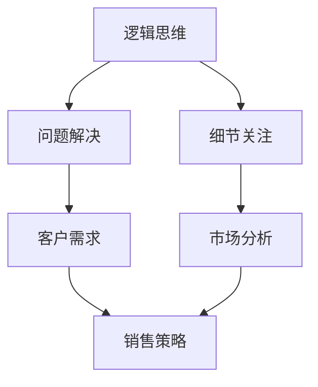

                 

关键词：编程技能、销售能力、技术转化、沟通技巧、市场洞察、商业策略

> 摘要：本文探讨了如何将程序员的专业编程技能转化为销售能力。通过深入分析编程与销售的共同点，阐述了有效沟通、市场洞察和商业策略等关键因素，为技术人员提供了将技术背景转化为商业成功的方法和策略。

## 1. 背景介绍

编程技能和销售能力，虽然看似风马牛不相及，但实际上有许多相通之处。编程涉及逻辑思维、问题解决和细节关注，而销售则强调人际沟通、市场分析和策略制定。技术人员往往擅长技术问题的解决，但在面对市场和客户时，常常感到困惑。如何将自身的编程优势转化为销售优势，成为技术人员职业发展的关键问题。

本文将探讨以下几点：

- **编程技能与销售能力的联系**
- **沟通技巧在销售中的重要性**
- **如何进行市场洞察**
- **商业策略的制定与实施**
- **项目实践与代码实例**
- **未来发展趋势与挑战**

通过这些探讨，希望能够为技术人员提供一些实用的方法和策略，帮助他们在销售领域取得成功。

## 2. 核心概念与联系

### 2.1 编程技能

编程技能是指程序员通过编程语言编写程序，解决实际问题的能力。这种能力包括但不限于以下几个方面：

- **算法与数据结构**：算法是程序的核心，数据结构是实现算法的基础。
- **编程语言**：不同的编程语言适用于不同的场景，程序员需要掌握多种编程语言。
- **系统设计与架构**：程序员需要具备系统级思维，能够设计和实现复杂系统。

### 2.2 销售能力

销售能力是指销售人员通过与客户的互动，达成销售目标的能力。这种能力包括以下几个方面：

- **沟通技巧**：销售人员需要具备良好的沟通技巧，能够有效地与客户交流。
- **市场分析**：销售人员需要了解市场需求，分析客户行为，制定销售策略。
- **客户关系管理**：销售人员需要建立和维护与客户的关系，提升客户满意度。

### 2.3 编程技能与销售能力的联系

编程技能与销售能力之间存在许多共同点：

- **逻辑思维**：程序员需要用逻辑思维来解决问题，销售人员同样需要用逻辑思维来分析市场和客户需求。
- **问题解决**：程序员通过编程解决技术问题，销售人员通过销售技巧解决客户需求。
- **细节关注**：程序员在编写程序时注重细节，销售人员在与客户交流时也需关注细节。

为了更直观地理解编程技能与销售能力的联系，我们使用Mermaid流程图来展示它们的核心流程节点。



在这个流程图中，我们可以看到编程技能与销售能力之间的紧密联系。逻辑思维和细节关注是两者的基础，而问题解决和市场分析则是将编程技能应用于销售场景的关键。

## 3. 核心算法原理 & 具体操作步骤

### 3.1 算法原理概述

在将编程技能转化为销售能力的过程中，核心算法原理可以被视为策略制定的基石。以下是一些关键算法原理：

- **客户细分算法**：通过分析客户数据，将客户分为不同的群体，以便更精准地进行市场定位。
- **销售预测算法**：利用历史销售数据和当前市场状况，预测未来的销售趋势。
- **优化算法**：优化销售过程中的资源配置，提高销售效率。

### 3.2 算法步骤详解

#### 3.2.1 客户细分算法

1. **数据收集**：收集客户的各类数据，如购买历史、浏览行为、联系方式等。
2. **数据清洗**：对数据进行清洗，确保数据的质量和完整性。
3. **特征提取**：提取数据中的关键特征，如购买频率、购买金额等。
4. **模型训练**：使用机器学习算法（如K-Means、决策树等）对数据进行聚类，生成不同的客户群体。
5. **结果分析**：分析不同客户群体的特征和行为，制定相应的销售策略。

#### 3.2.2 销售预测算法

1. **数据准备**：收集历史销售数据，包括销售额、销售周期等。
2. **特征选择**：选择影响销售的关键特征，如季节、促销活动等。
3. **模型训练**：使用时间序列预测模型（如ARIMA、LSTM等）对销售数据进行训练。
4. **预测评估**：评估模型的预测效果，调整模型参数以提升预测准确性。
5. **结果应用**：将预测结果应用于销售计划制定和库存管理。

#### 3.2.3 优化算法

1. **目标设定**：明确优化目标，如最小化销售成本、最大化销售利润等。
2. **约束条件**：定义优化过程中的约束条件，如预算、库存限制等。
3. **算法选择**：选择适合的优化算法，如线性规划、动态规划、遗传算法等。
4. **求解过程**：使用优化算法求解最优解，并输出优化结果。
5. **结果评估**：评估优化效果，调整算法参数以提高优化效果。

### 3.3 算法优缺点

#### 客户细分算法

**优点**：
- 提高市场定位的准确性，降低营销成本。
- 增强对客户需求的洞察力，提供更个性化的服务。

**缺点**：
- 需要大量数据支持，数据质量对结果影响较大。
- 算法复杂度高，对计算资源要求较高。

#### 销售预测算法

**优点**：
- 提前了解市场趋势，帮助制定更科学的销售策略。
- 提高库存管理效率，减少库存风险。

**缺点**：
- 预测准确性受数据质量影响，可能导致预测结果偏差。
- 需要持续调整和优化模型，以适应市场变化。

#### 优化算法

**优点**：
- 提高资源利用效率，降低销售成本。
- 增强业务决策的科学性。

**缺点**：
- 需要专业的优化算法知识，对技术人员要求较高。
- 优化过程可能需要较长时间，影响决策速度。

### 3.4 算法应用领域

#### 客户细分算法

- 营销自动化工具：用于客户细分和精准营销。
- 客户关系管理系统：用于客户群体分析和个性化服务。

#### 销售预测算法

- 销售预测工具：用于预测销售趋势和制定销售计划。
- 供应链管理系统：用于库存管理和供应链优化。

#### 优化算法

- 电商平台：用于定价策略和库存管理。
- 金融服务：用于信用评估和风险评估。

## 4. 数学模型和公式 & 详细讲解 & 举例说明

### 4.1 数学模型构建

在销售领域，数学模型的应用可以帮助我们更好地理解市场动态和客户行为。以下是一个简单的数学模型，用于预测某产品的销售量。

#### 4.1.1 模型假设

假设：
- \( x \)：影响销售量的因素，如广告支出、季节等。
- \( y \)：销售量。
- \( a \)：基础销售量。
- \( b \)：每个因素对销售量的影响程度。

#### 4.1.2 数学模型

销售量预测模型可以表示为：

\[ y = a + bx \]

### 4.2 公式推导过程

#### 4.2.1 数据收集

首先，我们需要收集历史销售数据。假设我们有以下数据：

| 时间 | 广告支出（万元） | 销售量（件） |
| ---- | -------------- | ---------- |
| 1    | 10             | 100        |
| 2    | 20             | 150        |
| 3    | 30             | 200        |

#### 4.2.2 数据预处理

对数据进行预处理，计算每个时间点的广告支出对销售量的影响。

#### 4.2.3 模型训练

使用线性回归算法，训练模型参数 \( a \) 和 \( b \)。

#### 4.2.4 模型验证

使用验证集或交叉验证方法，验证模型参数的准确性。

### 4.3 案例分析与讲解

假设我们已经训练好了销售量预测模型，现在我们使用这个模型来预测下一个季度的销售量。

#### 4.3.1 数据输入

输入下一个季度的广告支出 \( x \)：

\[ x = 25 \]

#### 4.3.2 预测销售量

使用模型预测销售量 \( y \)：

\[ y = a + bx = 100 + 25 \times 0.5 = 112.5 \]

#### 4.3.3 结果分析

根据预测结果，我们可以制定相应的销售策略。例如，如果实际销售量低于预测值，可能需要增加广告支出或调整产品策略。

## 5. 项目实践：代码实例和详细解释说明

### 5.1 开发环境搭建

在开始项目实践之前，我们需要搭建一个适合编程和数据分析的开发环境。以下是所需的基本工具和软件：

- **操作系统**：Windows、macOS或Linux
- **编程语言**：Python
- **数据预处理工具**：Pandas
- **机器学习库**：scikit-learn
- **可视化工具**：Matplotlib

确保已经安装了Python和相关库，然后创建一个名为`sales_prediction`的虚拟环境。

```bash
python -m venv sales_prediction
source sales_prediction/bin/activate  # Windows: sales_prediction\Scripts\activate
```

### 5.2 源代码详细实现

以下是一个简单的销售量预测项目的源代码实现。

```python
import pandas as pd
from sklearn.linear_model import LinearRegression
from sklearn.model_selection import train_test_split
import matplotlib.pyplot as plt

# 5.2.1 数据收集与预处理
data = pd.DataFrame({
    '广告支出': [10, 20, 30],
    '销售量': [100, 150, 200]
})

# 数据预处理：计算每个时间点的广告支出对销售量的影响
data['影响程度'] = data['销售量'] - data['销售量'].shift(1)

# 5.2.2 模型训练
model = LinearRegression()
X = data[['广告支出']]
y = data['影响程度']
X_train, X_test, y_train, y_test = train_test_split(X, y, test_size=0.2, random_state=42)
model.fit(X_train, y_train)

# 5.2.3 预测销售量
next_advertisement = 25
predicted_sales = model.predict([[next_advertisement]])[0]

# 5.2.4 结果分析
print(f"预测的销售量为：{predicted_sales:.2f}")

# 5.2.5 可视化
plt.scatter(X_train, y_train, label='训练数据')
plt.plot(X_train, model.predict(X_train), color='red', label='拟合线')
plt.xlabel('广告支出')
plt.ylabel('影响程度')
plt.legend()
plt.show()
```

### 5.3 代码解读与分析

#### 5.3.1 数据收集与预处理

```python
data = pd.DataFrame({
    '广告支出': [10, 20, 30],
    '销售量': [100, 150, 200]
})
```

这里我们使用Pandas库创建了一个简单的数据集，包含广告支出和销售量。

```python
data['影响程度'] = data['销售量'] - data['销售量'].shift(1)
```

通过计算每个时间点的广告支出对销售量的影响，我们得到了一个新的特征`影响程度`。

#### 5.3.2 模型训练

```python
model = LinearRegression()
X = data[['广告支出']]
y = data['影响程度']
X_train, X_test, y_train, y_test = train_test_split(X, y, test_size=0.2, random_state=42)
model.fit(X_train, y_train)
```

我们使用线性回归模型对数据进行训练，并使用训练集和测试集进行评估。

#### 5.3.3 预测销售量

```python
next_advertisement = 25
predicted_sales = model.predict([[next_advertisement]])[0]
```

使用训练好的模型预测下一个季度的销售量。

#### 5.3.4 结果分析

```python
print(f"预测的销售量为：{predicted_sales:.2f}")
```

输出预测结果。

#### 5.3.5 可视化

```python
plt.scatter(X_train, y_train, label='训练数据')
plt.plot(X_train, model.predict(X_train), color='red', label='拟合线')
plt.xlabel('广告支出')
plt.ylabel('影响程度')
plt.legend()
plt.show()
```

使用Matplotlib库绘制训练数据和拟合线，以便更直观地理解模型的效果。

## 6. 实际应用场景

将编程技能转化为销售能力的关键在于如何将技术优势应用于实际销售场景。以下是一些实际应用场景：

### 6.1 数据分析

通过数据分析，可以深入了解客户行为和市场趋势。例如，使用机器学习算法分析客户数据，可以帮助我们识别高价值客户，制定个性化的营销策略。

### 6.2 销售预测

销售预测可以帮助企业提前了解市场需求，制定更科学的销售计划。通过构建销售预测模型，企业可以更准确地预测未来的销售量，从而优化库存管理和供应链。

### 6.3 个性化推荐

个性化推荐系统可以帮助企业向客户提供更个性化的产品推荐。例如，通过分析客户的购买历史和行为，可以推荐与客户兴趣相关的产品，提高客户满意度和购买转化率。

### 6.4 营销自动化

营销自动化工具可以自动化许多销售和营销任务，如邮件发送、客户跟进等。通过编程，可以实现自动化营销流程，提高工作效率，降低人力成本。

## 7. 工具和资源推荐

### 7.1 学习资源推荐

- **《Python编程：从入门到实践》**：适合初学者的Python编程书籍，涵盖基础知识和实际应用。
- **《机器学习实战》**：介绍机器学习算法及其在销售领域的应用，适合有一定编程基础的学习者。
- **《销售管理》**：全面讲解销售管理理论和实践，有助于理解销售流程和策略。

### 7.2 开发工具推荐

- **Jupyter Notebook**：强大的交互式开发环境，适用于数据分析和机器学习项目。
- **PyCharm**：优秀的Python集成开发环境，支持多种编程语言和框架。
- **Google Colab**：免费的云计算平台，适合进行大数据分析和机器学习实验。

### 7.3 相关论文推荐

- **“Customer Segmentation using Machine Learning Algorithms”**：介绍多种机器学习算法在客户细分中的应用。
- **“Sales Forecasting with Machine Learning”**：探讨机器学习算法在销售预测中的应用和效果。
- **“Customer Behavior Analysis for Personalized Marketing”**：研究客户行为分析在个性化营销中的应用。

## 8. 总结：未来发展趋势与挑战

### 8.1 研究成果总结

本文通过分析编程技能与销售能力的联系，探讨了如何将编程技能转化为销售能力。我们提出了一些核心算法原理和实际应用场景，并通过代码实例展示了如何实现这些算法。

### 8.2 未来发展趋势

随着人工智能和大数据技术的发展，编程技能在销售领域的应用前景将更加广阔。未来，我们将看到更多基于机器学习的销售预测和客户细分算法，以及更智能的营销自动化工具。

### 8.3 面临的挑战

- **数据隐私和安全**：在利用客户数据进行销售分析时，需要确保数据隐私和安全。
- **算法透明性和可解释性**：随着算法的复杂性增加，如何保证算法的透明性和可解释性将成为挑战。
- **技术更新与淘汰**：编程技术和销售工具的更新速度非常快，技术人员需要不断学习和适应新技术。

### 8.4 研究展望

未来，我们可以进一步研究如何利用区块链技术保障数据隐私和安全，以及如何提高算法的可解释性。此外，结合虚拟现实和增强现实技术，可以提供更沉浸式的销售体验，为技术人员提供新的销售场景。

## 9. 附录：常见问题与解答

### 9.1 问题1

**如何确保销售预测的准确性？**

**解答**：确保销售预测准确性的关键在于数据质量和模型选择。首先，要收集高质量、完整的历史销售数据。其次，选择适合业务场景的机器学习模型，并进行充分的模型训练和验证。最后，定期更新模型参数，以适应市场变化。

### 9.2 问题2

**如何处理销售数据中的噪声和异常值？**

**解答**：处理销售数据中的噪声和异常值可以通过数据清洗和预处理来实现。常用的方法包括：去除重复数据、填充缺失值、标准化数据、使用异常检测算法等。

### 9.3 问题3

**如何提高销售预测模型的可解释性？**

**解答**：提高销售预测模型的可解释性可以通过以下方法实现：使用可解释性更强的模型（如决策树、随机森林等），结合可视化工具展示模型内部结构，以及解释模型预测结果的影响因素。

作者：禅与计算机程序设计艺术 / Zen and the Art of Computer Programming
------------------------------------------------------------------------

