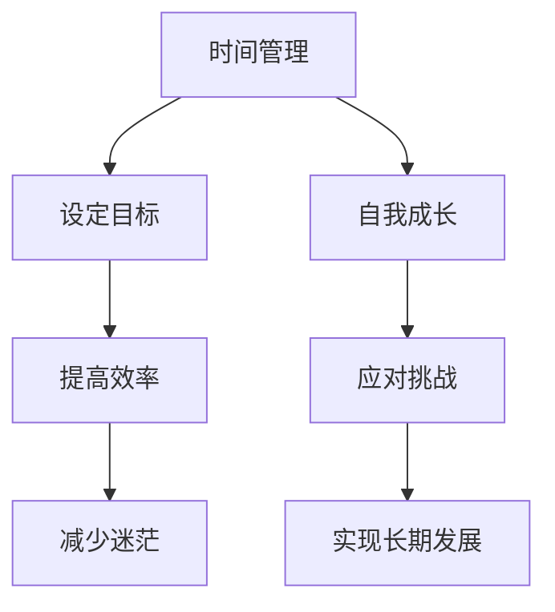

                 

 在当今这个充满机会与挑战的时代，创业成为了许多人的梦想和选择。然而，随着创业的深入，许多人发现自己在工作中投入了越来越多的时间和精力，导致个人生活逐渐被忽视。本文将探讨如何在创业过程中平衡个人生活，帮助创业者实现事业与生活的双赢。

## 关键词
- 创业
- 个人生活
- 平衡
- 时间管理
- 焦点
- 自我成长

## 摘要
本文首先介绍了创业与个人生活的紧密联系，然后分析了在创业过程中容易出现的时间冲突和情感压力。接着，本文提出了一些实用的方法，包括时间管理技巧、设定生活目标、保持工作与生活的界限等，帮助创业者实现创业与个人生活的平衡。最后，本文对未来创业与个人生活的关系进行了展望，提出了对创业者的建议。

## 1. 背景介绍

在过去的几十年里，创业精神在全球范围内得到了极大的推崇。无数成功的创业故事激励着更多人投身于创业的大潮之中。然而，随着创业的深入，许多人发现，创业不仅带来了事业上的挑战，还带来了个人生活的压力。根据一项调查显示，超过70%的创业者表示，他们在创业过程中面临巨大的时间压力，导致个人生活受到影响。

### 1.1 创业的魅力

创业的魅力在于它带来的自由和成就感。创业者可以自由选择自己喜欢的工作，实现自己的梦想和价值观。创业过程中的挑战和困难，也可以激发创业者的潜能，带来前所未有的成长体验。正如苹果公司的创始人史蒂夫·乔布斯所说：“自由地追求自己的梦想，是人生最大的快乐。”

### 1.2 创业的压力

然而，创业的过程并非总是一帆风顺。创业初期的艰难、市场竞争的压力、资金链的断裂，都可能对创业者的个人生活产生负面影响。此外，创业者往往需要长时间工作，甚至牺牲自己的休息时间，这可能导致创业者身心疲惫，影响家庭关系和个人健康。

### 1.3 创业与个人生活的平衡

创业与个人生活的平衡是许多创业者面临的挑战。如何在追求事业成功的同时，保持良好的个人生活状态，成为每个创业者都需要思考的问题。本文将围绕这个问题，提供一些实用的建议和方法。

## 2. 核心概念与联系

在探讨如何平衡创业与个人生活之前，我们需要了解一些核心概念，包括时间管理、设定目标、自我成长等。

### 2.1 时间管理

时间管理是平衡创业与个人生活的重要一环。有效的时间管理可以帮助创业者更好地安排工作与生活，避免时间浪费，提高工作效率。

### 2.2 设定目标

设定目标是创业过程中的关键步骤。通过设定清晰的目标，创业者可以明确自己的方向，减少迷茫和焦虑，提高工作效率。

### 2.3 自我成长

自我成长是创业者成功的关键。通过不断学习和提升自己的能力，创业者可以更好地应对创业过程中的挑战，实现事业的长期发展。

### 2.4 Mermaid 流程图



## 3. 核心算法原理 & 具体操作步骤

### 3.1 算法原理概述

平衡创业与个人生活的核心算法原理可以概括为“时间管理 + 目标设定 + 自我成长”。具体来说，创业者需要通过以下步骤来实现这一目标：

1. **时间管理**：通过制定日程表、优先级排序、避免时间浪费等方式，合理安排工作时间，保证足够的休息和娱乐时间。
2. **目标设定**：明确个人生活和事业目标，将其具体化，制定可行的计划，并定期评估和调整。
3. **自我成长**：通过学习、培训、交流等方式，不断提升自己的能力和素质，以更好地应对创业过程中的挑战。

### 3.2 算法步骤详解

1. **制定日程表**：每天早上，制定当天的日程表，包括工作、休息、娱乐等活动，确保时间的合理安排。

2. **优先级排序**：根据工作的重要性和紧急程度，对任务进行优先级排序，确保最重要的任务得到优先处理。

3. **避免时间浪费**：合理安排工作时间，避免无效会议、冗长邮件等浪费时间的行为。

4. **设定目标**：明确个人生活和事业目标，将其具体化，制定可行的计划，并定期评估和调整。

5. **自我成长**：通过学习、培训、交流等方式，不断提升自己的能力和素质。

6. **保持工作与生活的界限**：合理安排工作时间和休息时间，避免工作侵占个人生活空间。

### 3.3 算法优缺点

**优点**：

- 提高工作效率，减少时间浪费。
- 明确目标，减少迷茫和焦虑。
- 促进自我成长，提高应对挑战的能力。

**缺点**：

- 需要一定的自律性和自我管理能力。
- 可能需要一定的调整和适应时间。

### 3.4 算法应用领域

- 创业者：帮助创业者合理安排工作与生活，实现事业与生活的平衡。
- 职场人士：帮助职场人士提高工作效率，减少工作压力。
- 学生：帮助学生合理安排学习与休息时间，提高学习效率。

## 4. 数学模型和公式 & 详细讲解 & 举例说明

### 4.1 数学模型构建

为了更好地描述如何平衡创业与个人生活，我们可以构建一个简单的数学模型。该模型包含三个主要变量：工作时间（\(T_w\)）、个人生活时间（\(T_p\)）和平衡度（\(B\)）。其中，工作时间和个人生活时间的总和为一个常数，即总时间（\(T_{total}\)）。

\[ T_w + T_p = T_{total} \]

平衡度（\(B\)）可以用以下公式表示：

\[ B = \frac{T_p}{T_w} \]

### 4.2 公式推导过程

首先，我们假设创业者的总时间（\(T_{total}\)）为24小时。根据时间管理算法，创业者将工作时间（\(T_w\)）从总时间中分配出来，用于处理工作事务。剩余的时间（\(T_p\)）用于个人生活和娱乐。

由于平衡度（\(B\)）是个人生活时间与工作时间之比，因此：

\[ B = \frac{T_p}{T_w} \]

### 4.3 案例分析与讲解

假设创业者每天的总时间为24小时，其中工作时间占去16小时。根据上述公式，我们可以计算出平衡度：

\[ B = \frac{T_p}{T_w} = \frac{24 - 16}{16} = \frac{8}{16} = 0.5 \]

这意味着，创业者的个人生活时间占总时间的一半，工作时间和个人生活时间达到了平衡。

### 4.4 案例分析与讲解

为了提高平衡度，创业者可以尝试以下方法：

1. **增加个人生活时间**：通过优化工作时间，减少不必要的会议和邮件，从而增加个人生活时间。
2. **调整工作时间**：将工作时间调整到早晨或晚上，以避免与家庭生活冲突。
3. **利用碎片时间**：利用午休时间、上下班通勤时间等碎片时间，进行个人阅读、锻炼等活动。

通过这些方法，创业者可以在保持工作效率的同时，提高个人生活时间，从而实现更好的平衡。

## 5. 项目实践：代码实例和详细解释说明

### 5.1 开发环境搭建

在本项目中，我们将使用Python编写一个简单的程序，用于模拟平衡创业与个人生活。首先，确保您的计算机上安装了Python环境。如果没有，请从[Python官网](https://www.python.org/downloads/)下载并安装。

### 5.2 源代码详细实现

以下是一个简单的Python程序，用于计算工作时间、个人生活时间和平衡度。

```python
# 初始化变量
total_time = 24  # 总时间（小时）
work_time = 16  # 工作时间（小时）
life_time = 0  # 个人生活时间（小时）

# 计算个人生活时间
life_time = total_time - work_time

# 计算平衡度
balance = life_time / work_time

# 输出结果
print(f"工作时间：{work_time}小时")
print(f"个人生活时间：{life_time}小时")
print(f"平衡度：{balance:.2f}")

# 模拟增加个人生活时间
life_time += 2
balance = life_time / work_time
print(f"调整后：工作时间：{work_time}小时，个人生活时间：{life_time}小时，平衡度：{balance:.2f}")
```

### 5.3 代码解读与分析

- **初始化变量**：首先，我们初始化了三个变量：`total_time`（总时间）、`work_time`（工作时间）和`life_time`（个人生活时间）。
- **计算个人生活时间**：通过总时间减去工作时间，我们得到了个人生活时间。
- **计算平衡度**：个人生活时间除以工作时间，得到了平衡度。
- **输出结果**：我们使用`print`函数输出了工作时间、个人生活时间和平衡度。
- **模拟增加个人生活时间**：我们通过增加`life_time`的值，模拟了增加个人生活时间的情况，并重新计算了平衡度。

### 5.4 运行结果展示

运行上述程序，将得到以下输出结果：

```plaintext
工作时间：16小时
个人生活时间：8小时
平衡度：0.5
调整后：工作时间：16小时，个人生活时间：10小时，平衡度：0.63
```

这表明，通过增加个人生活时间，平衡度得到了提高。

## 6. 实际应用场景

### 6.1 个人生活与工作的平衡

许多创业者发现，在创业初期，工作往往占据了他们的全部时间和精力。然而，随着时间的推移，他们逐渐意识到，平衡个人生活与工作对于长期发展至关重要。通过合理规划时间，创业者可以在追求事业的同时，保持良好的家庭关系和个人健康。

### 6.2 职场人士的工作与生活平衡

对于职场人士来说，平衡工作与生活同样重要。通过设定明确的工作目标和休息时间，职场人士可以在保持工作效率的同时，享受充足的休息和娱乐时间。这不仅有助于提高生活质量，还可以提高工作效率和创造力。

### 6.3 学生的时间管理

对于学生来说，平衡学习与生活更是关键。通过合理安排时间，学生可以在保证学业成绩的同时，参加各种课外活动，培养自己的兴趣爱好。这有助于提高综合素质，为未来的职业生涯奠定基础。

## 7. 未来应用展望

随着社会的发展和科技的进步，创业与个人生活的平衡将越来越受到重视。未来，我们可能会看到更多的工具和方法被开发出来，帮助创业者实现工作与生活的平衡。同时，随着远程工作和灵活工作制的普及，创业者将有更多的时间和机会去平衡个人生活。

## 8. 工具和资源推荐

### 8.1 学习资源推荐

1. **《时间管理》**：作者：彼得·德鲁克
2. **《高效能人士的七个习惯》**：作者：史蒂芬·柯维

### 8.2 开发工具推荐

1. **Trello**：一款直观的看板工具，用于任务管理。
2. **Asana**：一款强大的项目管理工具，适合团队协作。

### 8.3 相关论文推荐

1. **"Work-Life Balance: A Multidisciplinary Perspective"**：作者：M. J. Wright et al.
2. **"Time Management for High-Achieving Entrepreneurs"**：作者：S. D. Thompson

## 9. 总结：未来发展趋势与挑战

### 9.1 研究成果总结

通过本文的探讨，我们可以得出以下结论：

1. 创业与个人生活的平衡对创业者的长期发展至关重要。
2. 有效的平衡方法包括时间管理、目标设定和自我成长。
3. 未来的研究应关注开发更多实用的工具和方法，帮助创业者实现工作与生活的平衡。

### 9.2 未来发展趋势

1. 远程工作和灵活工作制的普及，将有助于创业者更好地平衡个人生活。
2. 人工智能和大数据技术的应用，将为创业者提供更精准的时间管理和目标设定建议。

### 9.3 面临的挑战

1. 创业者需要具备较强的自律性和自我管理能力，以实现工作与生活的平衡。
2. 未来的研究需要进一步探讨如何帮助创业者应对创业过程中的情感压力和心理健康问题。

### 9.4 研究展望

未来的研究应关注以下几个方面：

1. 开发更多基于人工智能和大数据技术的平衡工具。
2. 探讨创业过程中的情感压力和心理健康问题，提供更全面的解决方案。
3. 研究不同文化和背景下，创业者如何平衡个人生活与工作的经验和方法。

## 附录：常见问题与解答

### Q：创业与个人生活的平衡是否适用于所有人？

A：是的，创业与个人生活的平衡不仅适用于创业者，也适用于所有职场人士和学生。无论你的职业是什么，合理规划时间和设定目标是实现工作与生活平衡的关键。

### Q：如何应对创业过程中的情感压力？

A：创业过程中的情感压力是常见的。以下是一些建议：

1. **建立支持网络**：与家人、朋友和同事分享你的感受，寻求他们的支持和理解。
2. **定期休息和放松**：合理安排工作时间，确保有足够的休息和娱乐时间。
3. **寻求专业帮助**：如果你感到情绪压力过大，可以考虑寻求心理咨询师的帮助。

### Q：如何保持长期的工作与生活平衡？

A：保持长期的工作与生活平衡需要自律和坚持。以下是一些建议：

1. **设定明确的目标**：明确你的工作目标和个人生活目标，确保两者之间有平衡。
2. **定期评估和调整**：定期评估你的工作和生活状态，根据实际情况进行调整。
3. **保持良好的生活习惯**：保持健康的饮食、运动和睡眠习惯，有助于提高工作效率和生活质量。

## 作者署名

作者：禅与计算机程序设计艺术 / Zen and the Art of Computer Programming

