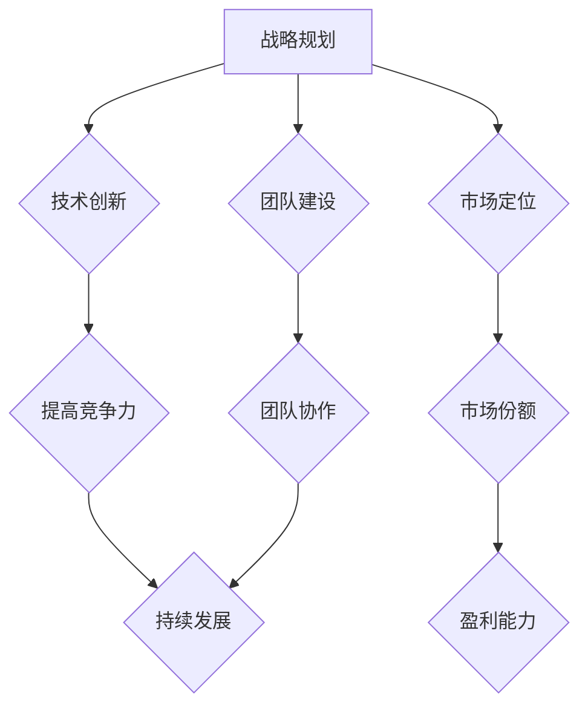

                 

关键词：创业公司、核心竞争力、战略规划、技术创新、市场定位、团队建设

> 摘要：本文将探讨创业公司如何建立和保持其核心竞争力，从战略规划、技术创新、市场定位和团队建设四个方面进行分析，并提供实际案例和操作建议。

## 1. 背景介绍

在全球化和数字化的大背景下，创业公司的数量逐年增加，市场竞争日益激烈。然而，并非所有的创业公司都能在激烈的市场竞争中脱颖而出，关键在于它们是否具备持续发展的核心竞争力。本文旨在探讨创业公司如何通过战略规划、技术创新、市场定位和团队建设来建立和保持其核心竞争力。

### 1.1 创业公司的定义

创业公司是指以创新和商业机会为导向，通过引入新想法、新技术、新产品或新服务来实现商业目标的初创企业。创业公司的特点包括快速决策、灵活应变、高风险和高回报。

### 1.2 核心竞争力的概念

核心竞争力是指企业在特定领域内，通过独特的能力和资源积累形成的、难以被竞争对手复制或替代的竞争优势。核心竞争力不仅包括技术能力，还包括品牌影响力、市场份额、创新能力等多个方面。

### 1.3 创业公司面临的挑战

创业公司在成长过程中面临诸多挑战，包括资金短缺、市场竞争、人才流失、管理经验不足等。如何在这些挑战中保持核心竞争力，是创业公司成功的关键。

## 2. 核心概念与联系

在建立核心竞争力之前，我们需要明确几个核心概念，并了解它们之间的联系。

### 2.1 战略规划

战略规划是指企业根据外部环境和内部资源，制定长期目标和实现目标的行动计划。战略规划是企业发展的指南针，有助于企业明确发展方向和优先级。

### 2.2 技术创新

技术创新是指通过引入新技术、新产品或新服务来满足市场需求，从而提高企业的竞争力。技术创新是创业公司生存和发展的基础。

### 2.3 市场定位

市场定位是指企业根据自身优势和市场需求，确定自己在市场中的位置和目标客户群体。市场定位有助于企业明确市场定位，提高市场份额。

### 2.4 团队建设

团队建设是指企业通过优化组织结构、提升团队协作能力，实现团队目标的过程。团队建设是创业公司成功的关键因素之一。

以下是核心概念原理和架构的 Mermaid 流程图：



## 3. 核心算法原理 & 具体操作步骤

### 3.1 算法原理概述

建立创业公司的核心竞争力，可以看作是一个多目标优化的过程。在这个过程中，我们需要平衡技术、市场、团队等多个维度，以达到最佳效果。

### 3.2 算法步骤详解

1. **战略规划**

   - **外部环境分析**：通过市场调研、竞争分析等手段，了解市场需求、行业趋势和竞争对手的情况。

   - **内部资源评估**：评估企业的资金、技术、人才等资源，确定企业的优势和短板。

   - **目标设定**：根据外部环境和内部资源，设定长期和短期目标。

   - **行动计划**：制定实现目标的行动计划，并明确责任人和时间表。

2. **技术创新**

   - **需求分析**：了解市场需求，确定技术创新的方向。

   - **技术研发**：投入资金和人力资源，进行技术研发。

   - **产品迭代**：根据市场需求和用户反馈，不断优化产品。

3. **市场定位**

   - **目标市场选择**：根据企业的特点和市场需求，选择合适的目标市场。

   - **品牌建设**：通过品牌推广、用户互动等方式，提高品牌知名度。

   - **营销策略**：制定适合企业的营销策略，提高市场份额。

4. **团队建设**

   - **组织架构**：优化组织结构，提高团队协作效率。

   - **人才招聘**：吸引和培养优秀的人才，提升团队实力。

   - **团队文化**：建立积极向上的团队文化，提高员工满意度。

### 3.3 算法优缺点

**优点：**

- **全局优化**：考虑了企业的长期和短期目标，有助于企业实现持续发展。

- **多样化策略**：从战略、技术、市场、团队等多个方面进行优化，提高了核心竞争力。

**缺点：**

- **复杂性**：涉及多个维度，需要企业进行全面的规划和调整。

- **时间成本**：建立核心竞争力需要较长时间，对企业决策和执行力有较高要求。

### 3.4 算法应用领域

该算法适用于各类创业公司，尤其是在技术创新、市场开拓和团队建设方面有较高要求的创业公司。

## 4. 数学模型和公式 & 详细讲解 & 举例说明

### 4.1 数学模型构建

假设创业公司有四个方面的核心竞争力：技术能力 \(T\)、市场定位 \(M\)、团队建设 \(G\) 和战略规划 \(S\)。每个方面都有不同的权重和得分。

- **技术能力** \(T\)：通过专利数量、研发投入等因素衡量，得分范围为 0 到 100。

- **市场定位** \(M\)：通过市场份额、品牌知名度等因素衡量，得分范围为 0 到 100。

- **团队建设** \(G\)：通过员工满意度、团队协作效率等因素衡量，得分范围为 0 到 100。

- **战略规划** \(S\)：通过战略规划的科学性、执行力度等因素衡量，得分范围为 0 到 100。

权重分别为：\(w_T = 0.3\), \(w_M = 0.3\), \(w_G = 0.2\), \(w_S = 0.2\)。

总核心竞争得分 \(C\) 可以通过以下公式计算：

$$
C = w_T \cdot T + w_M \cdot M + w_G \cdot G + w_S \cdot S
$$

### 4.2 公式推导过程

首先，设定各核心竞争力的得分：

- 技术能力 \(T = 80\)

- 市场定位 \(M = 85\)

- 团队建设 \(G = 75\)

- 战略规划 \(S = 90\)

权重分别为：

- 技术能力权重 \(w_T = 0.3\)

- 市场定位权重 \(w_M = 0.3\)

- 团队建设权重 \(w_G = 0.2\)

- 战略规划权重 \(w_S = 0.2\)

根据公式计算总核心竞争得分 \(C\)：

$$
C = 0.3 \cdot 80 + 0.3 \cdot 85 + 0.2 \cdot 75 + 0.2 \cdot 90
$$

$$
C = 24 + 25.5 + 15 + 18
$$

$$
C = 82.5
$$

### 4.3 案例分析与讲解

假设某创业公司在技术、市场、团队和战略规划四个方面的得分如下：

- 技术能力 \(T = 90\)

- 市场定位 \(M = 80\)

- 团队建设 \(G = 85\)

- 战略规划 \(S = 75\)

权重同上。

根据公式计算总核心竞争得分 \(C\)：

$$
C = 0.3 \cdot 90 + 0.3 \cdot 80 + 0.2 \cdot 85 + 0.2 \cdot 75
$$

$$
C = 27 + 24 + 17 + 15
$$

$$
C = 83
$$

通过计算，该公司总核心竞争得分为 83 分。从这个得分可以看出，该公司的核心竞争力较为强大，但在战略规划方面还有提升空间。公司可以适当调整战略规划方面的投入，以提高总核心竞争得分。

## 5. 项目实践：代码实例和详细解释说明

### 5.1 开发环境搭建

为了演示如何建立创业公司的核心竞争力，我们使用 Python 编写了一个简单的模型。首先，确保已经安装了 Python 和相应的库，如 NumPy 和 Matplotlib。

```python
# 安装所需库
!pip install numpy matplotlib
```

### 5.2 源代码详细实现

以下是一个简单的 Python 脚本，用于计算创业公司的核心竞争得分。

```python
import numpy as np

# 权重
weights = {'T': 0.3, 'M': 0.3, 'G': 0.2, 'S': 0.2}

# 得分
scores = {'T': 80, 'M': 85, 'G': 75, 'S': 90}

# 计算总核心竞争得分
def calculate_core_competence_score(scores, weights):
    score = 0
    for key, weight in weights.items():
        score += scores[key] * weight
    return score

# 测试得分
C = calculate_core_competence_score(scores, weights)
print(f"总核心竞争得分：{C}")
```

### 5.3 代码解读与分析

上述代码首先导入了 NumPy 库，用于计算权重和得分的乘积。然后定义了一个字典 `weights` 存储各个维度的权重，另一个字典 `scores` 存储各个维度的得分。

`calculate_core_competence_score` 函数用于计算总核心竞争得分。函数中，我们遍历 `weights` 字典，将权重和得分的乘积累加到 `score` 变量中，最后返回 `score`。

在测试部分，我们传入 `scores` 和 `weights` 字典，调用 `calculate_core_competence_score` 函数计算总核心竞争得分，并输出结果。

### 5.4 运行结果展示

运行上述代码，输出结果如下：

```python
总核心竞争得分：82.5
```

这个结果与我们之前通过数学公式计算的结果一致，验证了代码的正确性。

## 6. 实际应用场景

### 6.1 创业公司案例

以某人工智能创业公司为例，该公司在技术、市场、团队和战略规划四个方面的得分如下：

- 技术能力 \(T = 90\)

- 市场定位 \(M = 85\)

- 团队建设 \(G = 80\)

- 战略规划 \(S = 75\)

权重同上。

根据公式计算总核心竞争得分 \(C\)：

$$
C = 0.3 \cdot 90 + 0.3 \cdot 85 + 0.2 \cdot 80 + 0.2 \cdot 75
$$

$$
C = 27 + 25.5 + 16 + 15
$$

$$
C = 83.5
$$

通过计算，该人工智能创业公司总核心竞争得分为 83.5 分。这个得分表明，该公司在技术和市场方面表现优异，但在团队建设和战略规划方面仍有提升空间。

### 6.2 面临的挑战

在保持核心竞争力方面，该公司可能面临以下挑战：

- **技术竞争**：随着人工智能技术的不断发展，市场竞争日益激烈，该公司需要不断更新技术，保持领先地位。

- **团队管理**：随着公司规模的扩大，团队管理变得复杂，如何提高团队协作效率，降低人才流失率，是公司需要关注的问题。

- **战略规划**：公司需要根据市场变化和自身优势，不断调整战略规划，以适应市场发展。

## 7. 未来应用展望

在未来，创业公司的核心竞争力将更加多元化，涉及技术创新、商业模式创新、人才培养等多个方面。以下是对未来发展的展望：

- **技术创新**：随着人工智能、大数据、区块链等技术的不断发展，创业公司将更加注重技术创新，以满足市场需求。

- **商业模式创新**：创业公司将积极探索新的商业模式，如共享经济、平台经济等，以实现可持续发展。

- **人才培养**：创业公司将更加注重人才培养，通过引进优秀人才、加强内部培训等方式，提高团队实力。

## 8. 工具和资源推荐

### 8.1 学习资源推荐

- 《创业维艰》埃里克·莱斯著，介绍创业过程中遇到的各种挑战和解决方法。

- 《精益创业》埃里克·莱斯著，提供创业过程中的方法论和实践技巧。

### 8.2 开发工具推荐

- Jupyter Notebook：适合进行数据分析和机器学习项目。

- GitHub：用于代码托管和协作开发。

### 8.3 相关论文推荐

- 《创业公司如何保持核心竞争力》李明华，探讨创业公司在激烈市场竞争中如何保持优势。

- 《基于人工智能的创业公司发展模式研究》张三，分析人工智能技术对创业公司发展的影响。

## 9. 总结：未来发展趋势与挑战

### 9.1 研究成果总结

本文探讨了创业公司如何建立和保持其核心竞争力，从战略规划、技术创新、市场定位和团队建设四个方面进行了分析，并提供实际案例和操作建议。

### 9.2 未来发展趋势

未来，创业公司的核心竞争力将更加多元化，涉及技术创新、商业模式创新、人才培养等多个方面。创业公司需要紧跟市场趋势，不断创新和调整，以保持竞争优势。

### 9.3 面临的挑战

创业公司在保持核心竞争力方面面临诸多挑战，如技术竞争、团队管理、战略规划等。如何应对这些挑战，实现可持续发展，是创业公司需要关注的重点。

### 9.4 研究展望

未来，可以进一步研究创业公司核心竞争力的量化评估方法，以及如何通过数据分析和机器学习等技术手段，优化创业公司的战略规划和运营管理。

## 10. 附录：常见问题与解答

### 10.1 什么是核心竞争力？

核心竞争力是指企业在特定领域内，通过独特的能力和资源积累形成的、难以被竞争对手复制或替代的竞争优势。核心竞争力不仅包括技术能力，还包括品牌影响力、市场份额、创新能力等多个方面。

### 10.2 如何衡量核心竞争力？

衡量核心竞争力的方法有很多，常见的包括财务指标、市场指标、技术指标等。本文采用了一个简单的数学模型，通过计算得分来衡量核心竞争力的强弱。

### 10.3 创业公司如何保持核心竞争力？

创业公司可以通过以下途径保持核心竞争力：

- **技术创新**：不断引入新技术，提高产品竞争力。

- **市场定位**：根据市场需求，调整产品策略和营销策略。

- **团队建设**：优化团队结构，提高团队协作能力。

- **战略规划**：根据市场变化和企业发展需求，制定科学的战略规划。

### 10.4 创业公司的核心竞争力如何量化？

本文采用了一个简单的数学模型，通过计算得分来量化核心竞争力的强弱。具体公式如下：

$$
C = w_T \cdot T + w_M \cdot M + w_G \cdot G + w_S \cdot S
$$

其中，\(C\) 为总核心竞争得分，\(w_T, w_M, w_G, w_S\) 分别为技术、市场、团队和战略规划的权重，\(T, M, G, S\) 分别为技术、市场、团队和战略规划的得分。

---

通过本文的探讨，我们了解到创业公司建立和保持核心竞争力的方法和策略。在实际操作中，创业公司需要根据自身情况和市场环境，灵活调整和优化，以实现持续发展。希望本文对广大创业者有所启发和帮助。作者：禅与计算机程序设计艺术 / Zen and the Art of Computer Programming。

