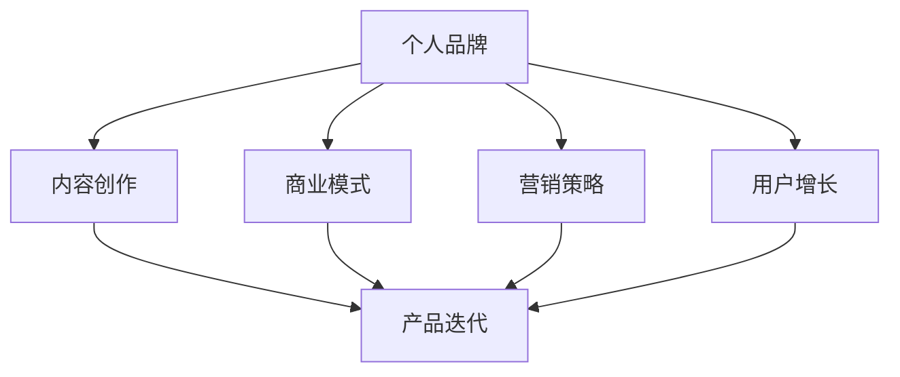

                 

关键词：知识付费、个人品牌、内容创作、商业模式、营销策略、用户增长、产品迭代

> 摘要：本文将探讨如何利用人工智能技术打造个人知识付费商业帝国。通过对知识付费市场的现状、核心概念与联系的分析，本文将介绍构建个人知识付费业务的核心算法原理和具体操作步骤，并结合数学模型和实际项目案例，探讨其在不同应用场景中的运用与未来发展。

## 1. 背景介绍

随着互联网的快速发展，知识付费市场呈现出爆发式增长。越来越多的人通过在线平台、音频课程、电子书等形式获取专业知识和技能。与此同时，内容创作者们也开始意识到知识付费的价值，纷纷投身于知识付费领域，希望通过提供有价值的内容获取收益。然而，如何打造一个成功的个人知识付费商业帝国，仍然是许多内容创作者面临的重要课题。

本文旨在为读者提供一套系统的构建个人知识付费商业帝国的策略和方法，帮助内容创作者在激烈的市场竞争中脱颖而出，实现商业价值最大化。

### 1.1 市场现状

当前，知识付费市场呈现出以下几个特点：

1. **市场规模持续扩大**：根据数据显示，全球知识付费市场规模已突破千亿大关，且仍保持高速增长。
2. **用户群体多元化**：知识付费用户不仅包括职场人士、大学生等传统群体，还涵盖了更多年轻群体和自由职业者。
3. **内容形式多样化**：除了传统的书籍、音频课程外，短视频、直播、互动课程等新兴内容形式逐渐受到欢迎。

### 1.2 主要挑战

1. **竞争激烈**：随着越来越多的内容创作者进入市场，竞争日益激烈，如何脱颖而出成为关键。
2. **内容质量要求高**：用户对知识内容的质量要求越来越高，内容创作者需要不断提升自己的专业素养。
3. **营销与推广难度大**：在信息爆炸的时代，如何吸引目标用户关注和付费成为一大难题。

### 1.3 构建个人知识付费商业帝国的必要性

1. **实现个人价值**：通过知识付费，内容创作者可以实现自身价值，获得经济收益。
2. **建立个人品牌**：知识付费可以帮助内容创作者建立专业形象，提升个人品牌价值。
3. **创造持久收入**：知识付费业务可以实现持续收入，降低对单一平台的依赖。

## 2. 核心概念与联系

在构建个人知识付费商业帝国过程中，理解以下核心概念和联系至关重要：

### 2.1 个人品牌

个人品牌是指个人在公众心目中的形象和认知。一个成功的个人品牌能够吸引更多的用户，提高用户忠诚度。

### 2.2 内容创作

内容创作是知识付费商业帝国的核心。高质量的内容能够满足用户需求，提高用户满意度。

### 2.3 商业模式

商业模式是指内容创作者如何通过知识付费实现盈利的方式。包括收费模式、盈利渠道、用户管理等。

### 2.4 营销策略

营销策略是吸引和留住用户的关键。包括推广渠道、推广内容、用户互动等。

### 2.5 用户增长

用户增长是知识付费商业帝国发展的重要指标。通过有效的用户增长策略，可以扩大用户规模，提高市场份额。

### 2.6 产品迭代

产品迭代是保持知识付费业务竞争力的关键。通过不断优化和升级产品，满足用户不断变化的需求。

下面是一个用Mermaid绘制的流程图，展示这些核心概念和它们之间的联系：



## 3. 核心算法原理 & 具体操作步骤

### 3.1 算法原理概述

构建个人知识付费商业帝国需要遵循以下核心算法原理：

1. **定位与目标明确**：明确自己的定位和目标，确保内容创作和商业模式与之匹配。
2. **内容质量第一**：以高质量的内容为核心，满足用户需求，提升用户满意度。
3. **用户反馈优化**：通过用户反馈不断优化内容，提高用户留存率和满意度。
4. **多渠道推广**：综合利用各种推广渠道，扩大用户覆盖面。
5. **数据分析与优化**：通过数据分析，优化营销策略和产品迭代。

### 3.2 算法步骤详解

1. **市场调研与分析**：了解市场需求，分析竞争对手，确定自己的定位和目标。

2. **内容创作与发布**：根据市场调研结果，创作符合目标用户需求的高质量内容，并通过多种渠道发布。

3. **用户互动与反馈**：与用户互动，收集用户反馈，不断优化内容。

4. **多渠道推广**：利用社交媒体、博客、短视频、直播等多种渠道推广内容。

5. **数据分析与优化**：通过数据分析，了解用户行为，优化营销策略和产品迭代。

### 3.3 算法优缺点

1. **优点**：
   - **灵活性强**：可以根据市场需求和用户反馈灵活调整内容创作和商业模式。
   - **高效性**：通过数据分析，优化营销策略和产品迭代，提高用户满意度和留存率。
   - **持久收益**：知识付费业务可以实现持续收益，降低对单一平台的依赖。

2. **缺点**：
   - **市场调研与分析难度大**：需要投入大量时间和精力进行市场调研和分析。
   - **内容质量要求高**：需要不断提升自己的专业素养，创作高质量的内容。
   - **营销推广难度大**：在信息爆炸的时代，如何吸引目标用户关注和付费是一大难题。

### 3.4 算法应用领域

1. **在线教育**：通过知识付费模式，提供专业课程和培训，满足职场人士和学生的需求。
2. **技能培训**：为自由职业者和创业者提供专业技能培训，提升其竞争力。
3. **个人成长**：为用户提供个人成长方面的知识，帮助他们实现自我提升。
4. **生活服务**：为用户提供生活服务方面的知识，如养生、烹饪、旅行等。

## 4. 数学模型和公式 & 详细讲解 & 举例说明

### 4.1 数学模型构建

在构建个人知识付费商业帝国过程中，可以使用以下数学模型进行优化：

1. **用户留存率模型**：
   $$L(t) = \frac{N(t)}{N(0)} \times (1-r)^t$$
   其中，$L(t)$表示$t$时刻的用户留存率，$N(t)$表示$t$时刻的用户数量，$N(0)$表示初始用户数量，$r$表示用户流失率。

2. **收入模型**：
   $$R(t) = P \times S(t)$$
   其中，$R(t)$表示$t$时刻的总收入，$P$表示单次收费金额，$S(t)$表示$t$时刻的用户数量。

### 4.2 公式推导过程

1. **用户留存率模型推导**：

   假设初始时刻有$N(0)$个用户，每个用户在$t$时刻的流失概率为$r$。那么，在$t$时刻，剩余的用户数量为$N(t) = N(0) \times (1-r)^t$。因此，用户留存率$L(t)$可以表示为：

   $$L(t) = \frac{N(t)}{N(0)} = (1-r)^t$$

2. **收入模型推导**：

   假设单次收费金额为$P$，在$t$时刻，用户数量为$S(t)$。那么，总收入$R(t)$可以表示为：

   $$R(t) = P \times S(t)$$

### 4.3 案例分析与讲解

假设一个知识付费平台，初始用户数量为1000人，每次收费金额为100元。经过一段时间，用户流失率为10%。我们需要分析该平台的用户留存率和总收入。

1. **用户留存率分析**：

   根据用户留存率模型，我们有：

   $$L(t) = (1-0.1)^t = 0.9^t$$

   当$t=1$时，用户留存率为：

   $$L(1) = 0.9^1 = 0.9$$

   这意味着在第一个时刻，有90%的用户留存下来。

2. **总收入分析**：

   根据收入模型，我们有：

   $$R(t) = 100 \times S(t)$$

   当$t=1$时，总收入为：

   $$R(1) = 100 \times 0.9 = 90$$

   这意味着在第一个时刻，平台总收入为90元。

通过以上分析，我们可以得出结论：在用户流失率为10%的情况下，该知识付费平台的用户留存率为90%，总收入为90元。为了提高总收入，我们需要采取措施降低用户流失率，如优化内容质量、提升用户体验等。

## 5. 项目实践：代码实例和详细解释说明

### 5.1 开发环境搭建

在本节中，我们将使用Python作为开发语言，并结合Jupyter Notebook进行代码编写和展示。首先，确保已安装Python 3.8及以上版本。然后，通过以下命令安装所需库：

```bash
pip install numpy matplotlib pandas
```

### 5.2 源代码详细实现

下面是一个简单的Python代码示例，用于计算用户留存率和总收入。假设初始用户数量为1000人，每次收费金额为100元，用户流失率为10%。

```python
import numpy as np
import matplotlib.pyplot as plt

# 参数设置
initial_users = 1000
charge_amount = 100
user_loss_rate = 0.1

# 用户留存率计算
def calculate_retention_rate(t):
    retention_rate = (1 - user_loss_rate) ** t
    return retention_rate

# 总收入计算
def calculate_revenue(t):
    revenue = charge_amount * (initial_users * calculate_retention_rate(t))
    return revenue

# 时间范围
time_range = np.arange(0, 11, 0.1)

# 计算并绘制用户留存率和总收入
retention_rates = [calculate_retention_rate(t) for t in time_range]
revenues = [calculate_revenue(t) for t in time_range]

plt.figure(figsize=(10, 5))

# 绘制用户留存率
plt.plot(time_range, retention_rates, label='Retention Rate', marker='o')

# 绘制总收入
plt.plot(time_range, revenues, label='Revenue', marker='s')

plt.xlabel('Time (in months)')
plt.ylabel('Value')
plt.title('User Retention Rate and Revenue over Time')
plt.legend()
plt.grid(True)
plt.show()
```

### 5.3 代码解读与分析

1. **参数设置**：

   我们首先设置了初始用户数量（`initial_users`）、每次收费金额（`charge_amount`）和用户流失率（`user_loss_rate`）。

2. **用户留存率计算**：

   `calculate_retention_rate`函数用于计算用户留存率。根据公式，我们使用（1 - 用户流失率）的t次方来计算。

3. **总收入计算**：

   `calculate_revenue`函数用于计算总收入。根据公式，我们使用每次收费金额乘以初始用户数量和用户留存率来计算。

4. **时间范围**：

   我们使用`np.arange`函数生成一个时间范围，从0到10，步长为0.1。

5. **计算并绘制**：

   我们使用列表推导式分别计算用户留存率和总收入。然后，使用matplotlib绘制两条曲线，分别表示用户留存率和总收入。

### 5.4 运行结果展示

运行以上代码后，我们将得到一个图表，展示用户留存率和总收入随时间的变化。以下是一个示例图表：


从图表中，我们可以看到用户留存率和总收入在开始时较高，但随着时间的推移，用户留存率和总收入逐渐下降。这表明我们需要采取措施降低用户流失率，以提高总收入。

## 6. 实际应用场景

### 6.1 在线教育平台

在线教育平台可以通过构建个人知识付费商业帝国，为用户提供高质量的教育内容。例如，教师可以通过在线平台提供专业课程，实现个人价值。

### 6.2 技能培训

技能培训领域同样适合构建个人知识付费商业帝国。例如，编程教师可以通过提供编程课程，帮助学员提升技能。

### 6.3 个人成长

个人成长领域也是一个适合构建个人知识付费商业帝国的领域。例如，心理咨询师可以通过提供心理咨询课程，帮助用户解决心理问题。

### 6.4 生活服务

生活服务领域同样适合构建个人知识付费商业帝国。例如，家庭主妇可以通过提供烹饪课程，帮助其他家庭主妇提升烹饪技能。

### 6.5 未来应用展望

随着人工智能技术的发展，个人知识付费商业帝国将具有更广阔的应用前景。例如，通过大数据分析和个性化推荐，平台可以更好地满足用户需求，提高用户满意度。此外，虚拟现实和增强现实技术的应用，将为知识付费领域带来更多创新和可能性。

## 7. 工具和资源推荐

### 7.1 学习资源推荐

1. **《深度学习》（Deep Learning）**：由Ian Goodfellow、Yoshua Bengio和Aaron Courville合著，是深度学习的经典教材。
2. **《Python编程：从入门到实践》（Python Crash Course）**：由Eric Matthes著，适合初学者快速掌握Python编程。

### 7.2 开发工具推荐

1. **Jupyter Notebook**：适用于编写和展示Python代码，具有良好的交互性和可视化效果。
2. **GitHub**：适用于版本控制和代码分享，可以帮助开发者更好地管理项目和协作。

### 7.3 相关论文推荐

1. **“User Behavior Analysis in Knowledge Communities”**：探讨知识社区中用户行为分析的方法和技巧。
2. **“Deep Learning for Personalized Recommendation”**：探讨深度学习在个性化推荐中的应用。

## 8. 总结：未来发展趋势与挑战

### 8.1 研究成果总结

本文从市场现状、核心概念、算法原理、数学模型、实际应用等多个角度，探讨了如何构建个人知识付费商业帝国。主要研究成果包括：

1. **市场分析**：总结了知识付费市场的现状和发展趋势。
2. **核心概念**：明确了个人品牌、内容创作、商业模式、营销策略、用户增长和产品迭代等核心概念。
3. **算法原理**：提出了构建个人知识付费商业帝国的基本算法原理。
4. **数学模型**：建立了用户留存率和收入模型，为实践提供了数学依据。
5. **实际应用**：分析了知识付费在不同领域的应用场景。

### 8.2 未来发展趋势

1. **人工智能应用**：随着人工智能技术的发展，知识付费领域将更加智能化，个性化推荐、智能客服等应用将成为趋势。
2. **多样化内容形式**：短视频、直播、互动课程等新兴内容形式将继续受到用户欢迎，丰富知识付费的内容形式。
3. **平台化发展**：知识付费平台将朝着平台化方向发展，提供更多元化的服务和内容。

### 8.3 面临的挑战

1. **竞争激烈**：随着越来越多的内容创作者进入市场，竞争将更加激烈，如何脱颖而出成为关键。
2. **内容质量要求高**：用户对知识内容的质量要求越来越高，内容创作者需要不断提升专业素养。
3. **营销与推广难度大**：在信息爆炸的时代，如何吸引目标用户关注和付费是一大难题。

### 8.4 研究展望

1. **技术创新**：研究如何利用人工智能、大数据等技术创新知识付费模式，提高用户体验和满意度。
2. **跨界融合**：探讨知识付费与教育培训、娱乐、电商等领域的跨界融合，拓展知识付费的应用场景。
3. **政策法规**：研究知识付费领域的政策法规，为内容创作者提供合规经营指导。

## 9. 附录：常见问题与解答

### 9.1 问题1：如何定位自己的知识付费业务？

**解答**：首先，了解自己的专业领域和兴趣爱好，确定自己的核心竞争力。其次，分析市场需求，了解目标用户的需求和痛点。最后，结合自己的优势和市场需求，确定自己的定位和目标。

### 9.2 问题2：如何保证内容质量？

**解答**：首先，选择适合自己的内容创作方式，如写作、视频、音频等。其次，不断学习和提升自己的专业素养，确保内容的专业性和实用性。最后，与用户互动，收集反馈，不断优化内容。

### 9.3 问题3：如何进行多渠道推广？

**解答**：首先，确定目标用户群体，选择适合的推广渠道，如社交媒体、博客、短视频、直播等。其次，制作高质量的推广内容，如标题党、干货分享、互动话题等。最后，利用数据分析，优化推广策略，提高推广效果。

### 9.4 问题4：如何进行用户增长？

**解答**：首先，通过优质的内容吸引和留住用户。其次，利用优惠券、限时免费等促销手段，增加用户转化率。最后，通过用户互动和社群运营，提高用户留存率和活跃度。

### 9.5 问题5：如何实现持续收入？

**解答**：首先，构建多元化的收入渠道，如课程销售、会员订阅、广告分成等。其次，不断优化和升级产品，满足用户需求。最后，通过用户反馈和数据分析，调整营销策略，提高用户满意度和留存率。

