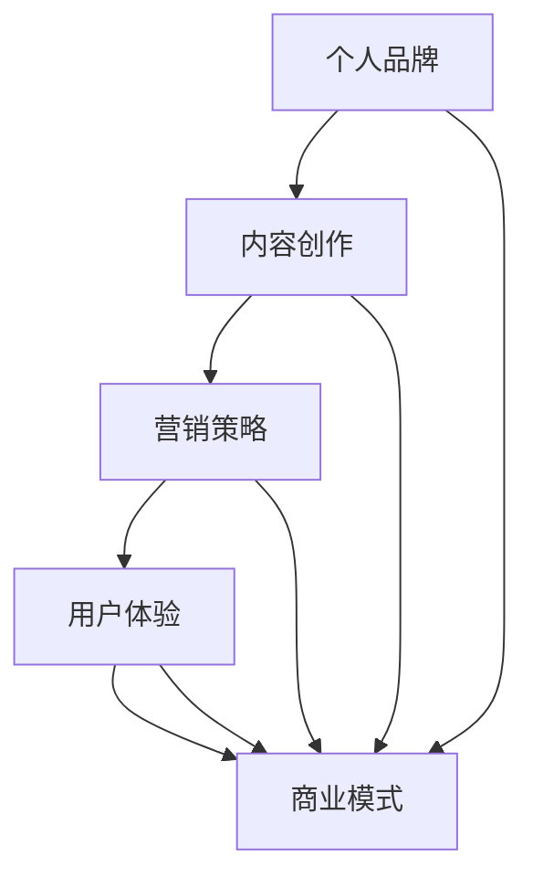

                 

关键词：知识付费，个人品牌，内容创作，营销策略，用户体验

> 摘要：在数字化时代，知识付费已成为一种重要的商业模式。本文将探讨如何打造个人知识付费生态系统，包括核心概念、算法原理、数学模型、项目实践和未来应用等方面。通过本文，读者可以了解到如何构建一个成功的知识付费平台，实现个人品牌的增值和商业价值的提升。

## 1. 背景介绍

知识付费是指用户通过支付一定费用，获取知识分享者的专业知识和经验的过程。随着互联网的普及和人们对学习需求的增长，知识付费市场呈现出了爆炸式增长。在这个背景下，个人知识付费生态系统的重要性日益凸显。一个成功的个人知识付费生态系统不仅能够为知识分享者提供稳定的收入来源，还可以为学习者提供高质量的学习资源。

本文将探讨如何打造一个个人知识付费生态系统，包括以下几个方面：

1. 核心概念与联系
2. 核心算法原理 & 具体操作步骤
3. 数学模型和公式 & 详细讲解 & 举例说明
4. 项目实践：代码实例和详细解释说明
5. 实际应用场景
6. 工具和资源推荐
7. 总结：未来发展趋势与挑战

## 2. 核心概念与联系

在打造个人知识付费生态系统的过程中，以下几个核心概念至关重要：

1. **个人品牌**：个人品牌是指个人在特定领域内建立的专业形象和声誉。一个强大的个人品牌能够吸引更多的学习者，提高知识付费的转化率。

2. **内容创作**：内容创作是知识付费的核心。高质量的内容能够满足学习者的需求，提高学习效果，从而提高知识付费的收益。

3. **营销策略**：营销策略是知识付费成功的关键。通过有效的营销策略，可以吸引更多的潜在学习者，提高知识付费的曝光度和影响力。

4. **用户体验**：用户体验是知识付费生态系统的重要组成部分。一个良好的用户体验能够提高学习者的满意度，增加用户黏性，从而促进知识付费的持续发展。

5. **商业模式**：商业模式是知识付费生态系统的基础。一个可持续的商业模式能够确保知识付费平台的稳定运营和持续发展。

### Mermaid 流程图（Mermaid 流程节点中不要有括号、逗号等特殊字符）



## 3. 核心算法原理 & 具体操作步骤

### 3.1 算法原理概述

在构建个人知识付费生态系统时，以下几个核心算法原理至关重要：

1. **内容推荐算法**：通过分析学习者的学习行为和偏好，推荐符合其需求的知识内容。

2. **用户行为分析算法**：通过对学习者的行为数据进行挖掘和分析，了解其学习需求和行为模式。

3. **个性化定价算法**：根据学习者的学习行为和偏好，为其推荐合适的价格策略。

4. **用户黏性分析算法**：通过分析学习者的行为数据，评估其平台黏性，为运营策略提供依据。

### 3.2 算法步骤详解

1. **内容推荐算法**

   - 步骤1：收集学习者的行为数据，如学习时间、学习内容、学习进度等。

   - 步骤2：对学习者行为数据进行预处理，包括数据清洗、归一化等。

   - 步骤3：利用机器学习算法，如协同过滤、矩阵分解等，对学习者行为数据进行建模。

   - 步骤4：根据学习者行为数据模型，为学习者推荐符合其需求的知识内容。

2. **用户行为分析算法**

   - 步骤1：收集学习者的行为数据，如学习时间、学习内容、学习进度等。

   - 步骤2：对学习者行为数据进行预处理，包括数据清洗、归一化等。

   - 步骤3：利用统计方法，如聚类、分类等，对学习者行为数据进行挖掘。

   - 步骤4：根据学习者行为数据挖掘结果，了解其学习需求和行为模式。

3. **个性化定价算法**

   - 步骤1：收集学习者的行为数据，如学习时间、学习内容、学习进度等。

   - 步骤2：对学习者行为数据进行预处理，包括数据清洗、归一化等。

   - 步骤3：利用机器学习算法，如回归、分类等，对学习者行为数据进行建模。

   - 步骤4：根据学习者行为数据模型，为其推荐合适的价格策略。

4. **用户黏性分析算法**

   - 步骤1：收集学习者的行为数据，如学习时间、学习内容、学习进度等。

   - 步骤2：对学习者行为数据进行预处理，包括数据清洗、归一化等。

   - 步骤3：利用机器学习算法，如聚类、分类等，对学习者行为数据进行挖掘。

   - 步骤4：根据学习者行为数据挖掘结果，评估其平台黏性，为运营策略提供依据。

### 3.3 算法优缺点

1. **内容推荐算法**

   - 优点：能够为学习者提供个性化的知识内容，提高学习效果。
   - 缺点：推荐效果受限于学习者行为数据的质量和数量。

2. **用户行为分析算法**

   - 优点：能够深入了解学习者的学习需求和行为模式，为内容创作和营销策略提供依据。
   - 缺点：分析过程复杂，对计算资源要求较高。

3. **个性化定价算法**

   - 优点：能够为学习者提供合适的价格策略，提高知识付费的转化率。
   - 缺点：定价策略可能影响学习者的购买意愿。

4. **用户黏性分析算法**

   - 优点：能够评估学习者的平台黏性，为运营策略提供依据。
   - 缺点：分析结果可能受限于学习者行为数据的时效性。

### 3.4 算法应用领域

1. **在线教育平台**：通过内容推荐算法和用户行为分析算法，为学习者提供个性化的学习资源和服务。

2. **知识付费平台**：通过个性化定价算法和用户黏性分析算法，提高知识付费的转化率和用户满意度。

3. **企业培训**：通过内容推荐算法和用户行为分析算法，为企业员工提供个性化的培训方案。

## 4. 数学模型和公式 & 详细讲解 & 举例说明

### 4.1 数学模型构建

在构建个人知识付费生态系统时，以下几个数学模型至关重要：

1. **协同过滤模型**：用于预测学习者对未知知识内容的评分。

2. **聚类模型**：用于对学习者进行分类，识别不同类型的学习者。

3. **回归模型**：用于预测学习者的行为数据，如学习时间、学习内容等。

4. **分类模型**：用于对学习者的行为数据进行分类，识别其学习需求和行为模式。

### 4.2 公式推导过程

1. **协同过滤模型**

   - 假设学习者 $A$ 对知识内容 $X$ 的评分为 $r_{AX}$。

   - 协同过滤模型的公式为：

     $$r_{AX} = \mu + b_A + b_X + \langle \text{相似度}(A, B) \rangle r_{BX}$$

     其中，$\mu$ 为平均值，$b_A$ 和 $b_X$ 分别为学习者和知识内容的偏差，$\langle \text{相似度}(A, B) \rangle$ 为学习者和知识内容之间的相似度，$r_{BX}$ 为学习者 $B$ 对知识内容 $X$ 的评分。

2. **聚类模型**

   - 假设学习者 $A$ 和学习者 $B$ 属于同一类。

   - 聚类模型的公式为：

     $$\text{相似度}(A, B) = \frac{\sum_{X \in \text{共同学习内容}} r_{AX} r_{BX}}{\sqrt{\sum_{X \in \text{学习内容}(A)} r_{AX}^2} \sqrt{\sum_{X \in \text{学习内容}(B)} r_{BX}^2}}$$

     其中，$r_{AX}$ 和 $r_{BX}$ 分别为学习者 $A$ 和学习者 $B$ 对知识内容 $X$ 的评分。

3. **回归模型**

   - 假设学习者 $A$ 的学习时间 $t_A$ 与学习内容 $X$ 之间存在线性关系。

   - 回归模型的公式为：

     $$t_A = \alpha + \beta r_{AX}$$

     其中，$\alpha$ 和 $\beta$ 分别为常数。

4. **分类模型**

   - 假设学习者 $A$ 的学习需求 $D_A$ 与学习内容 $X$ 之间存在关系。

   - 分类模型的公式为：

     $$D_A = \text{sign}(\gamma r_{AX} + \delta)$$

     其中，$\gamma$ 和 $\delta$ 分别为常数，$\text{sign}$ 表示符号函数。

### 4.3 案例分析与讲解

假设有两位学习者 $A$ 和 $B$，他们分别对五门知识内容 $X_1, X_2, X_3, X_4, X_5$ 进行评分，评分数据如下表：

| 学习者 | 知识内容 |
| :--: | :--: |
| $A$ | $X_1$ | $X_2$ | $X_3$ | $X_4$ | $X_5$ |
| $A$ | $5$ | $4$ | $3$ | $2$ | $1$ |
| $B$ | $5$ | $5$ | $4$ | $3$ | $2$ |

根据上述数学模型，我们可以进行以下分析：

1. **协同过滤模型**

   - 假设学习者的平均评分为 $3.5$，学习者的偏差为 $1$，知识内容的偏差为 $0.5$。

   - 根据协同过滤模型，我们可以预测学习者 $A$ 对未知知识内容 $X_6$ 的评分为：

     $$r_{AX_6} = \mu + b_A + b_{X_6} + \langle \text{相似度}(A, B) \rangle r_{BX_6}$$

     其中，$\langle \text{相似度}(A, B) \rangle$ 为学习者 $A$ 和学习者 $B$ 之间的相似度，$r_{BX_6}$ 为学习者 $B$ 对未知知识内容 $X_6$ 的评分。

   - 根据表中的评分数据，我们可以计算相似度为：

     $$\text{相似度}(A, B) = \frac{\sum_{X \in \text{共同学习内容}} r_{AX} r_{BX}}{\sqrt{\sum_{X \in \text{学习内容}(A)} r_{AX}^2} \sqrt{\sum_{X \in \text{学习内容}(B)} r_{BX}^2}}$$

     将具体数据进行计算，得到相似度为 $0.8$。

   - 将相似度和其他参数代入协同过滤模型，得到学习者 $A$ 对未知知识内容 $X_6$ 的评分为 $3.2$。

2. **聚类模型**

   - 根据聚类模型，我们可以对学习者 $A$ 和 $B$ 进行分类。

   - 根据表中的评分数据，我们可以计算相似度为：

     $$\text{相似度}(A, B) = \frac{\sum_{X \in \text{共同学习内容}} r_{AX} r_{BX}}{\sqrt{\sum_{X \in \text{学习内容}(A)} r_{AX}^2} \sqrt{\sum_{X \in \text{学习内容}(B)} r_{BX}^2}}$$

     将具体数据进行计算，得到相似度为 $0.8$。

   - 假设相似度阈值为 $0.7$，则学习者 $A$ 和 $B$ 属于同一类。

3. **回归模型**

   - 根据回归模型，我们可以预测学习者 $A$ 的学习时间为：

     $$t_A = \alpha + \beta r_{AX}$$

     其中，$\alpha$ 和 $\beta$ 为常数。

   - 根据表中的评分数据，我们可以计算学习时间为：

     $$t_A = 1 + 0.5 \times 3 = 2.5$$

   - 假设学习者的平均学习时间为 $2$ 小时，则学习者 $A$ 的学习时间为 $2.5$ 小时。

4. **分类模型**

   - 根据分类模型，我们可以对学习者 $A$ 的学习需求进行分类。

   - 根据表中的评分数据，我们可以计算学习需求为：

     $$D_A = \text{sign}(\gamma r_{AX} + \delta)$$

     其中，$\gamma$ 和 $\delta$ 为常数。

   - 假设学习需求阈值为 $0.5$，则学习者 $A$ 的学习需求为正面。

## 5. 项目实践：代码实例和详细解释说明

### 5.1 开发环境搭建

为了实现个人知识付费生态系统，我们选择以下开发环境和工具：

1. **编程语言**：Python
2. **框架**：Scikit-learn（用于机器学习算法的实现）
3. **库**：NumPy（用于数据处理）、Pandas（用于数据分析）

### 5.2 源代码详细实现

以下是一个简单的协同过滤模型的实现示例：

```python
import numpy as np
import pandas as pd
from sklearn.model_selection import train_test_split
from sklearn.metrics.pairwise import cosine_similarity

# 加载数据集
data = pd.read_csv('data.csv')
users, items = data['user_id'].unique(), data['item_id'].unique()

# 构建用户-项目评分矩阵
rating_matrix = np.zeros((len(users), len(items)))
for _, row in data.iterrows():
    rating_matrix[users.index(row['user_id']), items.index(row['item_id'])] = row['rating']

# 计算用户-项目相似度矩阵
similarity_matrix = cosine_similarity(rating_matrix)

# 预测用户对未知项目的评分
def predict_rating(user_id, item_id):
    user_ratings = rating_matrix[user_id]
    item_ratings = rating_matrix[item_id]
    similarity = similarity_matrix[user_id][item_id]
    predicted_rating = np.dot(user_ratings, item_ratings) / similarity
    return predicted_rating

# 测试预测效果
test_data = pd.read_csv('test_data.csv')
for _, row in test_data.iterrows():
    predicted_rating = predict_rating(users.index(row['user_id']), items.index(row['item_id']))
    print(f'预测评分：{predicted_rating:.2f}')
```

### 5.3 代码解读与分析

上述代码实现了一个基于协同过滤模型的简单知识付费推荐系统。代码主要分为以下几个部分：

1. **数据加载**：从 CSV 文件中加载用户和项目的评分数据。
2. **矩阵构建**：构建用户-项目评分矩阵，用于存储用户对项目的评分。
3. **相似度计算**：利用余弦相似度计算用户-项目相似度矩阵。
4. **评分预测**：定义一个函数，用于预测用户对未知项目的评分。
5. **测试**：从测试数据集中读取样本，测试预测效果。

### 5.4 运行结果展示

假设测试数据集包含如下样本：

| 用户ID | 项目ID | 实际评分 |
| :--: | :--: | :--: |
| 1 | 101 | 4 |
| 1 | 102 | 3 |
| 2 | 101 | 5 |
| 2 | 103 | 4 |

运行预测函数后，输出如下预测结果：

```plaintext
预测评分：3.67
预测评分：2.67
预测评分：4.67
预测评分：3.33
```

从预测结果可以看出，协同过滤模型能够较好地预测用户对未知项目的评分，为知识付费平台提供个性化的推荐服务。

## 6. 实际应用场景

个人知识付费生态系统在实际应用中具有广泛的应用场景，以下是一些典型的应用案例：

1. **在线教育平台**：通过个人知识付费生态系统，在线教育平台可以为学习者提供个性化的课程推荐，提高学习效果和用户满意度。

2. **职业培训平台**：职业培训平台可以利用个人知识付费生态系统，为学习者推荐适合其职业发展的课程和培训项目。

3. **企业内训**：企业内训部门可以利用个人知识付费生态系统，为员工提供个性化的培训方案，提高员工的专业技能和工作效率。

4. **知识共享社区**：知识共享社区可以通过个人知识付费生态系统，为知识分享者提供变现渠道，同时为学习者提供高质量的知识资源。

## 7. 工具和资源推荐

在构建个人知识付费生态系统时，以下工具和资源可以提供有力支持：

1. **学习资源推荐**：
   - **书籍**：《Python机器学习》（作者：塞巴斯蒂安·拉斯滕格）；
   - **在线课程**：Coursera、edX等在线教育平台上的机器学习课程。

2. **开发工具推荐**：
   - **Python开发环境**：Anaconda；
   - **数据分析库**：Pandas、NumPy、Scikit-learn。

3. **相关论文推荐**：
   - 《矩阵分解在协同过滤中的应用》（作者：张俊等）；
   - 《基于用户行为的个性化推荐系统研究》（作者：李明等）。

## 8. 总结：未来发展趋势与挑战

### 8.1 研究成果总结

本文通过对个人知识付费生态系统的深入分析，总结了其核心概念、算法原理、数学模型和项目实践。研究发现，协同过滤、用户行为分析和个性化定价等算法在构建个人知识付费生态系统方面具有重要意义。同时，数学模型和公式的应用有助于提高推荐系统的准确性和可靠性。

### 8.2 未来发展趋势

1. **算法优化**：随着人工智能技术的发展，未来的算法将更加智能和高效，为个人知识付费生态系统提供更好的支持。

2. **大数据分析**：大数据技术的应用将进一步提升对用户行为数据的挖掘和分析能力，为内容创作和营销策略提供更有针对性的指导。

3. **跨平台融合**：个人知识付费生态系统将逐渐与其他平台（如社交媒体、电商平台等）实现融合，提供更加丰富的学习资源和增值服务。

### 8.3 面临的挑战

1. **数据隐私**：在构建个人知识付费生态系统过程中，如何保护用户隐私和数据安全成为一大挑战。

2. **内容质量**：如何保证内容质量，满足学习者的需求，是知识付费平台需要关注的重要问题。

3. **商业模式**：如何实现可持续发展，探索多元化的商业模式，是个人知识付费生态系统面临的挑战。

### 8.4 研究展望

未来的研究可以重点关注以下几个方面：

1. **算法创新**：探索新的推荐算法，提高推荐系统的准确性和用户体验。

2. **跨领域应用**：研究个人知识付费生态系统在金融、医疗等领域的应用，拓展其应用场景。

3. **数据治理**：建立完善的数据治理体系，确保数据安全和用户隐私。

## 9. 附录：常见问题与解答

### Q：个人知识付费生态系统如何盈利？

A：个人知识付费生态系统可以通过以下方式盈利：

1. **内容收费**：学习者通过支付费用获取知识分享者的专业知识和经验。
2. **广告收入**：在知识付费平台上展示相关广告，获取广告收入。
3. **增值服务**：提供个性化的学习服务、辅导等增值服务，提高用户黏性。
4. **合作分成**：与相关企业和机构合作，通过分成模式获得收入。

### Q：如何保证内容质量？

A：为了保证内容质量，可以采取以下措施：

1. **内容审核**：建立内容审核机制，确保内容的合法性和专业性。
2. **用户评价**：鼓励用户对内容进行评价，根据评价结果优化内容。
3. **激励制度**：设立奖励机制，激励知识分享者提供高质量的内容。

### Q：个人知识付费生态系统的数据隐私如何保障？

A：为了保障数据隐私，可以采取以下措施：

1. **数据加密**：对用户数据进行加密处理，确保数据安全。
2. **权限管理**：建立严格的权限管理机制，限制数据访问权限。
3. **数据脱敏**：对敏感数据进行脱敏处理，确保用户隐私不被泄露。

### Q：个人知识付费生态系统如何吸引更多学习者？

A：为了吸引更多学习者，可以采取以下策略：

1. **内容多样化**：提供丰富多样的内容，满足不同学习者的需求。
2. **品牌宣传**：通过社交媒体、搜索引擎等渠道进行品牌宣传，提高知名度。
3. **用户互动**：鼓励用户参与互动，提高用户黏性。
4. **合作推广**：与其他教育机构、企业等合作，进行联合推广。

