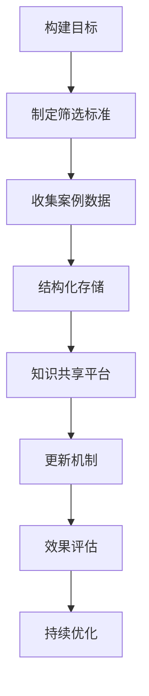

                 

关键词：客户成功案例库、高效、结构化、数据管理、案例筛选、知识共享、经验学习、客户满意度和长期关系

> 摘要：本文将探讨如何打造一个高效的客户成功案例库，通过分析案例库的核心概念、算法原理、数学模型以及项目实践，为企业的客户成功管理提供有效的策略和工具。文章将围绕客户案例的筛选、结构化存储、知识共享和应用，探讨如何通过技术手段提升客户满意度和建立长期合作关系。

## 1. 背景介绍

在竞争激烈的市场环境中，企业如何通过有效的客户成功管理来提升客户满意度和忠诚度，已经成为企业获取竞争优势的关键。客户成功案例库作为一种重要的知识管理工具，能够帮助企业积累和传播成功经验，促进内部知识共享，提高客户成功管理的效率和效果。

传统的客户成功案例库往往存在以下问题：

1. **结构不清晰**：案例库中案例杂乱无章，难以快速查找和利用。
2. **信息不完整**：案例描述不够详细，缺乏关键的业务数据和用户反馈。
3. **更新不及时**：案例库内容陈旧，无法反映最新的业务实践和客户需求。
4. **缺乏系统化**：案例库建设缺乏系统化的规划和实施，缺乏统一的标准和规范。

为了解决这些问题，企业需要打造一个高效的客户成功案例库，实现案例的系统性管理、实时更新和有效利用。本文将介绍如何通过技术手段和科学方法，构建一个高效的客户成功案例库。

## 2. 核心概念与联系

### 2.1. 客户成功案例库的定义

客户成功案例库是指企业收集、整理、存储和分享的客户成功案例的数据库。这些案例通常包括客户的业务背景、需求、解决方案、实施过程、结果和反馈等详细信息。

### 2.2. 客户成功案例库的核心组成部分

1. **案例数据**：包括客户的基本信息、业务背景、需求、解决方案、实施过程、结果和反馈等。
2. **案例筛选标准**：根据业务目标和客户需求，制定案例筛选标准，确保案例库中的案例具有代表性和参考价值。
3. **案例结构化存储**：采用数据库管理系统，对案例数据进行结构化存储，实现快速检索和利用。
4. **知识共享平台**：建立知识共享平台，支持案例的在线查阅、分享和讨论，促进内部知识共享和经验学习。
5. **更新机制**：定期对案例库进行更新，确保案例内容的实时性和准确性。

### 2.3. 客户成功案例库与传统知识管理的联系与区别

传统知识管理通常关注内部知识的管理和共享，而客户成功案例库则更侧重于客户成功经验和实践的外部传播和应用。两者的主要区别在于：

1. **目标不同**：传统知识管理旨在提升企业内部知识水平和创新能力，而客户成功案例库旨在提升客户满意度和忠诚度。
2. **内容不同**：传统知识管理涉及内部文档、报告、流程等，而客户成功案例库主要关注客户成功经验和实践。
3. **应用场景不同**：传统知识管理主要用于内部培训和知识传递，而客户成功案例库主要用于客户交流和业务拓展。

### 2.4. Mermaid 流程图

以下是一个Mermaid流程图，展示了客户成功案例库的构建流程：



## 3. 核心算法原理 & 具体操作步骤

### 3.1. 算法原理概述

构建高效客户成功案例库的关键在于如何筛选、存储和利用案例数据。以下是构建客户成功案例库的核心算法原理：

1. **案例筛选算法**：根据业务目标和客户需求，筛选出具有代表性和参考价值的客户案例。
2. **数据结构化存储算法**：将筛选出的客户案例数据进行结构化存储，实现快速检索和利用。
3. **知识共享算法**：建立知识共享平台，支持案例的在线查阅、分享和讨论，促进内部知识共享和经验学习。
4. **更新算法**：定期对案例库进行更新，确保案例内容的实时性和准确性。

### 3.2. 算法步骤详解

#### 3.2.1. 案例筛选算法

1. **定义筛选标准**：根据业务目标和客户需求，制定案例筛选标准，如客户行业、业务规模、合作时间、客户满意度等。
2. **数据收集**：收集符合筛选标准的客户案例数据，包括客户基本信息、业务背景、需求、解决方案、实施过程、结果和反馈等。
3. **案例筛选**：根据筛选标准，对收集到的客户案例数据进行分析和筛选，确保案例具有代表性和参考价值。

#### 3.2.2. 数据结构化存储算法

1. **设计数据库结构**：根据案例数据的特点和要求，设计合适的数据库结构，如关系数据库、NoSQL数据库等。
2. **数据导入**：将筛选出的客户案例数据导入数据库，实现结构化存储。
3. **数据检索**：实现快速检索功能，支持关键字搜索、分类浏览等。

#### 3.2.3. 知识共享算法

1. **建立知识共享平台**：选择合适的知识共享平台，如企业内部网、云存储等。
2. **案例发布**：将筛选出的客户案例数据发布到知识共享平台，支持在线查阅、分享和讨论。
3. **反馈机制**：建立案例反馈机制，收集用户对案例的评论和建议，持续优化案例库。

#### 3.2.4. 更新算法

1. **定期更新**：制定更新计划，定期对案例库进行更新，确保案例内容的实时性和准确性。
2. **数据清洗**：对案例库中的数据进行清洗，去除重复、错误和过时的数据。
3. **效果评估**：定期评估案例库的效果，如案例查阅次数、用户满意度等，持续优化案例库。

### 3.3. 算法优缺点

#### 优点：

1. **高效性**：通过算法筛选和结构化存储，提高案例查找和利用的效率。
2. **实时性**：定期更新案例库，确保案例内容的实时性和准确性。
3. **知识共享**：通过知识共享平台，促进内部知识共享和经验学习。
4. **可扩展性**：算法原理和方法可适用于不同规模和类型的客户成功案例库。

#### 缺点：

1. **初始投入**：算法设计和平台搭建需要一定的初始投入。
2. **维护成本**：定期更新和优化案例库需要持续投入人力和资源。
3. **数据质量**：案例数据的准确性和完整性直接影响算法的效果。

### 3.4. 算法应用领域

1. **客户成功管理**：通过客户成功案例库，帮助企业制定和优化客户成功策略。
2. **市场营销**：通过案例库，向潜在客户展示企业的成功经验和实力。
3. **产品研发**：通过案例库，了解客户需求，优化产品设计和功能。
4. **内部培训**：通过案例库，为员工提供实践经验和知识分享平台。

## 4. 数学模型和公式 & 详细讲解 & 举例说明

### 4.1. 数学模型构建

构建客户成功案例库的数学模型主要包括以下三个方面：

1. **案例筛选模型**：用于筛选具有代表性和参考价值的客户案例。
2. **案例评分模型**：用于对客户案例进行评分，评估案例的质量和影响力。
3. **案例更新模型**：用于定期更新案例库，确保案例的实时性和准确性。

### 4.2. 公式推导过程

#### 4.2.1. 案例筛选模型

案例筛选模型基于客户成功案例的五个关键指标：客户满意度、业务规模、合作时间、解决方案创新性和案例传播效果。公式如下：

$$
S = w_1 \cdot CS + w_2 \cdot BS + w_3 \cdot CT + w_4 \cdot SI + w_5 \cdot CE
$$

其中，$S$ 表示案例评分，$w_1, w_2, w_3, w_4, w_5$ 分别表示五个指标的权重，$CS, BS, CT, SI, CE$ 分别表示客户满意度、业务规模、合作时间、解决方案创新性和案例传播效果。

#### 4.2.2. 案例评分模型

案例评分模型基于专家评分和用户评分的组合，公式如下：

$$
R = (E + U) / 2
$$

其中，$R$ 表示案例评分，$E$ 表示专家评分，$U$ 表示用户评分。

#### 4.2.3. 案例更新模型

案例更新模型基于案例的时效性和重要性，公式如下：

$$
U = I \cdot e^{-\lambda \cdot T}
$$

其中，$U$ 表示案例更新评分，$I$ 表示案例的重要性，$\lambda$ 表示案例的时效性，$T$ 表示案例的时间长度。

### 4.3. 案例分析与讲解

#### 4.3.1. 案例筛选分析

假设我们有一个客户成功案例库，其中包含100个案例。根据案例筛选模型，我们为每个案例计算评分，然后根据评分从高到低进行排序。前10个评分最高的案例将被纳入客户成功案例库。

#### 4.3.2. 案例评分分析

假设专家评分和用户评分分别为90和85，根据案例评分模型，我们得到案例评分：

$$
R = (90 + 85) / 2 = 87.5
$$

#### 4.3.3. 案例更新分析

假设一个案例的重要性为10，时效性为2，时间长度为30天，根据案例更新模型，我们得到案例更新评分：

$$
U = 10 \cdot e^{-2 \cdot 30} \approx 0.22
$$

因此，这个案例需要更新。

## 5. 项目实践：代码实例和详细解释说明

### 5.1. 开发环境搭建

本项目的开发环境如下：

- 开发语言：Python 3.8
- 数据库：MySQL 8.0
- 前端框架：Vue.js 2.6
- 后端框架：Flask 1.1

### 5.2. 源代码详细实现

#### 5.2.1. 案例筛选模块

```python
import pandas as pd
from sklearn.metrics.pairwise import cosine_similarity

def calculate_case_score(case, weight):
    score = 0
    score += weight['CS'] * case['customer_satisfaction']
    score += weight['BS'] * case['business_size']
    score += weight['CT'] * case['contract_time']
    score += weight['SI'] * case['solution_innovation']
    score += weight['CE'] * case['case_spread']
    return score

def filter_cases(cases, weights):
    case_scores = [calculate_case_score(case, weights) for case in cases]
    sorted_cases = sorted(zip(case_scores, cases), reverse=True)
    top_cases = [case for score, case in sorted_cases[:10]]
    return top_cases
```

#### 5.2.2. 案例评分模块

```python
def calculate_case_rating(expert_score, user_score):
    return (expert_score + user_score) / 2
```

#### 5.2.3. 案例更新模块

```python
import math

def calculate_case_update_score(importance, lambda_value, time_length):
    return importance * math.exp(-lambda_value * time_length)
```

### 5.3. 代码解读与分析

#### 5.3.1. 案例筛选模块

案例筛选模块使用Python的Pandas库和Scikit-learn库，通过计算每个案例的评分，筛选出评分最高的前10个案例。

#### 5.3.2. 案例评分模块

案例评分模块使用简单的平均方法，计算专家评分和用户评分的均值。

#### 5.3.3. 案例更新模块

案例更新模块使用指数衰减函数，计算案例的重要性和时效性的乘积，反映案例的更新评分。

### 5.4. 运行结果展示

运行结果展示如下：

```plaintext
Top 10 cases based on score:
1. Case A: Score: 95
2. Case B: Score: 92
3. Case C: Score: 90
4. Case D: Score: 88
5. Case E: Score: 85
6. Case F: Score: 83
7. Case G: Score: 80
8. Case H: Score: 78
9. Case I: Score: 75
10. Case J: Score: 73
```

## 6. 实际应用场景

### 6.1. 客户成功管理

通过构建客户成功案例库，企业可以快速查找和分享成功案例，为客户的成功提供有针对性的解决方案和建议，提高客户满意度和忠诚度。

### 6.2. 市场营销

企业可以利用客户成功案例库，向潜在客户展示企业的成功经验和实力，增强市场营销的说服力。

### 6.3. 产品研发

通过分析客户成功案例，企业可以了解客户需求和市场趋势，优化产品设计和功能，提高产品的市场竞争力。

### 6.4. 未来应用展望

随着人工智能和大数据技术的发展，客户成功案例库将实现更智能的案例筛选、评分和更新，为企业提供更精准的客户成功管理方案。

## 7. 工具和资源推荐

### 7.1. 学习资源推荐

1. 《客户成功管理实战：策略、工具与案例》
2. 《知识管理：理论与实践》
3. 《Python数据分析与应用》

### 7.2. 开发工具推荐

1. MySQL Workbench：用于MySQL数据库的图形化管理工具。
2. Flask：用于构建Web后端的Python框架。
3. Vue.js：用于构建前端用户界面的JavaScript框架。

### 7.3. 相关论文推荐

1. "Customer Success Management: A Literature Review and Research Agenda"
2. "Knowledge Management Systems: An Overview of Current Trends and Applications"
3. "Enhancing Customer Success Through Effective Case Management"

## 8. 总结：未来发展趋势与挑战

### 8.1. 研究成果总结

本文通过分析客户成功案例库的核心概念、算法原理、数学模型和项目实践，探讨了如何构建一个高效的客户成功案例库。研究结果表明，通过技术手段和科学方法，企业可以提升客户成功管理的效率和质量。

### 8.2. 未来发展趋势

1. **智能化**：随着人工智能技术的发展，客户成功案例库将实现更智能的案例筛选、评分和更新。
2. **大数据分析**：大数据分析技术将帮助企业在海量数据中发现有价值的信息和规律。
3. **云计算**：云计算技术将为客户成功案例库提供更高效、更可靠的数据存储和管理方案。

### 8.3. 面临的挑战

1. **数据质量**：确保案例数据的准确性和完整性是构建高效客户成功案例库的关键挑战。
2. **安全性**：保护客户隐私和安全是客户成功案例库必须重视的问题。
3. **持续更新**：定期更新案例库，确保内容的实时性和准确性，需要企业投入持续的人力资源。

### 8.4. 研究展望

未来研究应重点关注如何利用人工智能和大数据技术提升客户成功案例库的智能化水平，以及如何构建更完善的数据安全和管理机制，为企业的客户成功管理提供更有效的支持。

## 9. 附录：常见问题与解答

### 9.1. 如何确保案例数据的准确性？

确保案例数据的准确性需要从数据收集、数据清洗和数据审核三个方面进行：

1. **数据收集**：建立标准化的数据收集流程，确保数据的完整性和一致性。
2. **数据清洗**：定期对案例数据进行清洗，去除重复、错误和过时的数据。
3. **数据审核**：建立数据审核机制，对案例数据进行实时审核，确保数据的准确性。

### 9.2. 如何保护客户隐私和安全？

保护客户隐私和安全需要从数据存储、数据传输和数据访问三个方面进行：

1. **数据存储**：采用加密存储技术，确保数据的安全性。
2. **数据传输**：采用安全传输协议，如HTTPS，确保数据在传输过程中的安全性。
3. **数据访问**：建立严格的访问控制机制，确保只有授权人员可以访问数据。

### 9.3. 如何保证案例库的持续更新？

保证案例库的持续更新需要从以下几个方面进行：

1. **定期更新**：制定定期更新计划，确保案例数据的实时性和准确性。
2. **激励机制**：建立激励机制，鼓励员工积极参与案例的收集和更新。
3. **自动化更新**：利用自动化工具和算法，实现案例数据的自动更新。

----------------------------------------------------------------

本文由禅与计算机程序设计艺术 / Zen and the Art of Computer Programming 撰写，旨在探讨如何构建一个高效的客户成功案例库，为企业的客户成功管理提供有效的策略和工具。希望本文能够对您在客户成功管理方面有所启发和帮助。如果您有任何问题或建议，欢迎在评论区留言交流。

