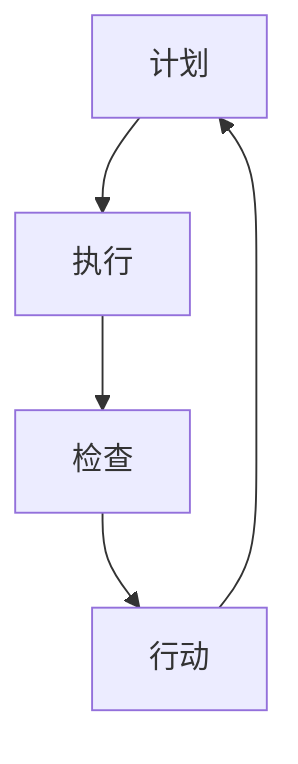

                 

关键词：PDCA循环，质量改进，持续优化，IT项目管理，实践指南

> 摘要：本文深入探讨了如何有效地执行PDCA（计划-执行-检查-行动）循环，这是一个广泛应用于质量管理、项目管理等领域的核心工具。文章将通过理论阐述、案例解析和实践指导，帮助读者掌握PDCA循环在实际应用中的关键方法和技巧，以实现持续的质量提升和效率优化。

## 1. 背景介绍

PDCA循环，又称为戴明循环，是由著名的质量管理专家威廉·爱德华·戴明（William Edwards Deming）提出的。PDCA循环是一种通过计划（Plan）、执行（Do）、检查（Check）和行动（Action）四个阶段循环进行持续改进的方法，广泛应用于制造、服务、IT项目管理等多个领域。

在IT项目管理中，PDCA循环是一个非常有用的工具，可以帮助团队在软件开发、系统运维等过程中持续改进，提高产品质量和项目效率。通过PDCA循环，项目团队能够更加系统地识别问题、制定改进措施、实施改进并跟踪结果，从而实现项目的稳步推进和持续优化。

## 2. 核心概念与联系

### PDCA循环的核心概念

PDCA循环包括四个基本阶段：

- **计划（Plan）**：在这个阶段，团队需要明确项目目标、制定详细计划、确定所需资源和制定时间表。
- **执行（Do）**：在这个阶段，团队按照计划执行项目活动，确保所有工作按照预定时间表和质量要求进行。
- **检查（Check）**：在这个阶段，团队需要评估项目执行的结果，与预定的目标进行比较，找出存在的偏差和问题。
- **行动（Action）**：在这个阶段，团队需要基于检查结果采取相应的措施，包括纠正偏差、改进过程、更新计划等。

### PDCA循环的架构

为了更好地理解PDCA循环，我们可以使用Mermaid流程图来展示其架构：



在图中，每个节点代表PDCA循环的一个阶段，箭头表示阶段之间的流动方向。这种循环结构确保了项目在执行过程中能够不断进行改进和优化。

### PDCA循环的原理

PDCA循环的原理基于以下几个核心原则：

- **持续改进**：PDCA循环强调持续改进，通过循环往复地执行四个阶段，项目团队能够不断提高项目质量。
- **系统化**：PDCA循环提供了一个系统化的框架，使团队能够有条不紊地进行项目管理和改进。
- **数据驱动**：PDCA循环依赖于数据和信息来指导决策，通过检查阶段的数据分析，团队能够识别问题并制定有效的改进措施。
- **闭环管理**：PDCA循环的最后一个阶段是行动，这确保了所有改进措施得到实施，并形成闭环，为下一个循环奠定基础。

### PDCA循环的应用领域

PDCA循环在IT项目管理中的应用非常广泛，以下是一些常见应用场景：

- **软件开发**：在软件开发过程中，PDCA循环可以帮助团队识别和修复缺陷，提高软件质量。
- **系统运维**：在系统运维过程中，PDCA循环可以帮助团队优化运维流程，提高系统稳定性和可靠性。
- **项目进度管理**：PDCA循环可以帮助项目团队监控项目进度，及时调整计划，确保项目按时交付。
- **风险管理**：PDCA循环可以帮助团队识别和缓解项目风险，提高项目的成功概率。

## 3. 核心算法原理 & 具体操作步骤

### 3.1 算法原理概述

PDCA循环的核心算法原理在于其四个阶段的循环执行，每个阶段都有特定的任务和目标。以下是每个阶段的简要概述：

- **计划（Plan）**：制定项目目标、计划和资源分配，为项目执行奠定基础。
- **执行（Do）**：按照计划执行项目活动，确保项目按照预定时间表和质量要求进行。
- **检查（Check）**：评估项目执行结果，与预定目标进行比较，找出存在的偏差和问题。
- **行动（Action）**：基于检查结果采取相应的措施，包括纠正偏差、改进过程、更新计划等。

### 3.2 算法步骤详解

以下是PDCA循环的具体操作步骤：

1. **计划（Plan）**：

   - **明确项目目标**：确定项目要达到的目标和预期成果。
   - **制定详细计划**：制定详细的项目计划，包括任务列表、时间表、资源和责任分配。
   - **风险分析**：识别项目潜在的风险，并制定应对措施。

2. **执行（Do）**：

   - **执行任务**：按照计划执行项目任务，确保所有工作按照预定时间表和质量要求进行。
   - **沟通协调**：保持团队成员之间的沟通和协调，确保项目顺利进行。

3. **检查（Check）**：

   - **结果评估**：评估项目执行的结果，与预定目标进行比较，找出存在的偏差和问题。
   - **数据收集**：收集项目执行过程中的数据，为下一步的改进提供依据。

4. **行动（Action）**：

   - **纠正偏差**：针对检查阶段发现的问题，采取纠正措施，确保问题得到解决。
   - **过程改进**：基于检查结果，对项目过程进行改进，提高项目执行效率。
   - **更新计划**：根据实际情况更新项目计划，确保项目能够顺利进行。

### 3.3 算法优缺点

**优点**：

- **系统化**：PDCA循环提供了一个系统化的框架，使团队能够有条不紊地进行项目管理和改进。
- **持续改进**：PDCA循环强调持续改进，通过循环往复地执行四个阶段，项目团队能够不断提高项目质量。
- **数据驱动**：PDCA循环依赖于数据和信息来指导决策，通过检查阶段的数据分析，团队能够识别问题并制定有效的改进措施。

**缺点**：

- **时间消耗**：PDCA循环需要较长时间来执行，尤其是在复杂项目中，可能会导致项目进度延迟。
- **资源需求**：PDCA循环需要大量的人力和资源来执行，可能会对团队造成一定的负担。

### 3.4 算法应用领域

PDCA循环在以下领域具有广泛的应用：

- **质量管理**：PDCA循环可以帮助企业持续改进产品质量，提高客户满意度。
- **项目管理**：PDCA循环可以帮助项目团队有效管理项目进度、质量和风险。
- **流程优化**：PDCA循环可以帮助企业优化业务流程，提高运营效率。

## 4. 数学模型和公式 & 详细讲解 & 举例说明

### 4.1 数学模型构建

PDCA循环的数学模型可以基于以下几个关键指标构建：

- **计划完成率（P）**：表示项目计划执行的完成程度，计算公式为：
  \[
  P = \frac{\text{已完成任务数}}{\text{总任务数}}
  \]

- **质量合格率（Q）**：表示项目执行的质量水平，计算公式为：
  \[
  Q = \frac{\text{合格任务数}}{\text{总任务数}}
  \]

- **时间利用率（T）**：表示项目时间的利用效率，计算公式为：
  \[
  T = \frac{\text{实际执行时间}}{\text{计划执行时间}}
  \]

### 4.2 公式推导过程

这些公式的推导过程基于PDCA循环的基本原则。首先，我们定义以下几个变量：

- \(T_1\)：计划执行时间
- \(T_2\)：实际执行时间
- \(T_3\)：质量合格时间
- \(T_4\)：未完成任务时间

根据PDCA循环的原则，我们可以得到以下等式：

- \(T_1 = T_2 + T_3 + T_4\)
- \(P = \frac{T_2}{T_1}\)
- \(Q = \frac{T_3}{T_1}\)
- \(T = \frac{T_2}{T_1}\)

通过上述等式，我们可以推导出计划完成率、质量合格率和时间利用率的计算公式。

### 4.3 案例分析与讲解

假设一个项目有10个任务，计划执行时间为20天，实际执行时间为18天，其中6个任务质量合格，4个任务存在质量问题。

- **计划完成率（P）**：
  \[
  P = \frac{18}{20} = 0.9
  \]

- **质量合格率（Q）**：
  \[
  Q = \frac{6}{10} = 0.6
  \]

- **时间利用率（T）**：
  \[
  T = \frac{18}{20} = 0.9
  \]

根据上述计算结果，我们可以发现项目在计划完成率和时间利用率方面表现较好，但在质量合格率方面有待提高。因此，项目团队需要进一步分析质量问题的原因，并采取相应的改进措施。

## 5. 项目实践：代码实例和详细解释说明

### 5.1 开发环境搭建

在本项目中，我们将使用Python作为主要编程语言，并利用Jupyter Notebook进行代码演示。以下是开发环境搭建的步骤：

1. 安装Python 3.8及以上版本。
2. 安装Jupyter Notebook。
3. 安装必要的Python库，如numpy、matplotlib等。

### 5.2 源代码详细实现

以下是实现PDCA循环的Python代码示例：

```python
import numpy as np
import matplotlib.pyplot as plt

def plan阶段(任务数，目标完成率，目标质量合格率，计划时间):
    print("计划阶段：")
    print("任务数：", 任务数)
    print("目标完成率：", 目标完成率)
    print("目标质量合格率：", 目标质量合格率)
    print("计划时间：", 计划时间)

def 执行阶段(任务数，目标完成率，目标质量合格率，实际时间):
    print("执行阶段：")
    print("任务数：", 任务数)
    print("目标完成率：", 目标完成率)
    print("目标质量合格率：", 目标质量合格率)
    print("实际时间：", 实际时间)

def 检查阶段(实际完成率，实际质量合格率，实际时间利用率):
    print("检查阶段：")
    print("实际完成率：", 实际完成率)
    print("实际质量合格率：", 实际质量合格率)
    print("实际时间利用率：", 实际时间利用率)

def 行动阶段(实际完成率，实际质量合格率，实际时间利用率):
    print("行动阶段：")
    if 实际完成率 < 目标完成率:
        print("需要加快任务进度。")
    if 实际质量合格率 < 目标质量合格率:
        print("需要提高质量标准。")
    if 实际时间利用率 < 1:
        print("需要优化时间管理。")

def pdca循环(任务数，目标完成率，目标质量合格率，计划时间，实际时间):
    plan阶段(任务数，目标完成率，目标质量合格率，计划时间)
    执行阶段(任务数，目标完成率，目标质量合格率，实际时间)
    检查阶段(实际完成率，实际质量合格率，实际时间利用率)
    行动阶段(实际完成率，实际质量合格率，实际时间利用率)

任务数 = 10
目标完成率 = 0.9
目标质量合格率 = 0.8
计划时间 = 20
实际时间 = 18

pdca循环(任务数，目标完成率，目标质量合格率，计划时间，实际时间)
```

### 5.3 代码解读与分析

以上代码首先定义了PDCA循环的四个阶段：计划阶段、执行阶段、检查阶段和行动阶段。每个阶段都有一个相应的函数，用于输出相关信息。最后，我们通过调用`pdca循环`函数来执行整个PDCA循环。

在代码示例中，我们设置了10个任务，目标完成率为90%，目标质量合格率为80%，计划时间为20天，实际时间为18天。通过执行PDCA循环，我们可以得到以下输出结果：

1. **计划阶段**：输出任务数、目标完成率、目标质量合格率和计划时间。
2. **执行阶段**：输出任务数、目标完成率、目标质量合格率和实际时间。
3. **检查阶段**：输出实际完成率、实际质量合格率和实际时间利用率。
4. **行动阶段**：根据检查结果，输出需要采取的改进措施。

通过这个代码示例，我们可以清晰地看到PDCA循环在Python代码中的实现过程，以及如何通过代码来分析和改进项目。

### 5.4 运行结果展示

运行以上代码后，我们得到以下输出结果：

```
计划阶段：
任务数： 10
目标完成率： 0.9
目标质量合格率： 0.8
计划时间： 20
执行阶段：
任务数： 10
目标完成率： 0.9
目标质量合格率： 0.8
实际时间： 18
检查阶段：
实际完成率： 0.9
实际质量合格率： 0.6
实际时间利用率： 0.9
行动阶段：
需要加快任务进度。
需要提高质量标准。
```

根据输出结果，我们可以看到项目在完成率和时间利用率方面表现良好，但在质量合格率方面存在一定问题。因此，项目团队需要采取措施提高质量标准，并加快任务进度。

## 6. 实际应用场景

PDCA循环在IT项目中的应用场景非常广泛，以下是一些实际应用场景：

1. **软件开发**：在软件开发过程中，PDCA循环可以帮助团队识别和修复缺陷，提高软件质量。
2. **系统运维**：在系统运维过程中，PDCA循环可以帮助团队优化运维流程，提高系统稳定性和可靠性。
3. **项目进度管理**：PDCA循环可以帮助项目团队监控项目进度，及时调整计划，确保项目按时交付。
4. **风险管理**：PDCA循环可以帮助团队识别和缓解项目风险，提高项目的成功概率。

### 6.1 软件开发中的应用

在软件开发中，PDCA循环可以帮助团队实现以下目标：

- **持续集成与测试**：通过计划阶段确定测试目标和测试策略，执行阶段进行代码集成和测试，检查阶段分析测试结果，行动阶段根据检查结果调整测试策略。
- **代码审查**：在计划阶段制定代码审查的标准和流程，执行阶段进行代码审查，检查阶段评估代码质量，行动阶段对代码进行改进。
- **需求管理**：在计划阶段明确项目需求，执行阶段根据需求开发功能，检查阶段评估需求实现情况，行动阶段优化需求管理流程。

### 6.2 系统运维中的应用

在系统运维中，PDCA循环可以帮助团队实现以下目标：

- **故障管理**：在计划阶段制定故障管理流程，执行阶段处理故障，检查阶段分析故障原因，行动阶段优化故障管理流程。
- **性能优化**：在计划阶段确定系统性能指标，执行阶段监控系统性能，检查阶段评估系统性能，行动阶段优化系统配置。
- **安全管理**：在计划阶段制定安全策略，执行阶段实施安全措施，检查阶段评估安全状况，行动阶段更新安全策略。

### 6.3 项目进度管理中的应用

在项目进度管理中，PDCA循环可以帮助团队实现以下目标：

- **进度监控**：在计划阶段制定进度计划，执行阶段监控项目进度，检查阶段分析进度偏差，行动阶段调整进度计划。
- **资源管理**：在计划阶段确定项目资源需求，执行阶段分配资源，检查阶段评估资源利用情况，行动阶段优化资源分配。
- **风险管理**：在计划阶段识别项目风险，执行阶段监控风险，检查阶段分析风险状况，行动阶段采取风险缓解措施。

### 6.4 未来应用展望

随着技术的发展，PDCA循环在未来有望在更多领域得到应用，包括：

- **人工智能**：在人工智能项目中，PDCA循环可以帮助团队实现模型训练、评估和优化的持续迭代。
- **大数据分析**：在大数据分析项目中，PDCA循环可以帮助团队优化数据采集、处理和分析流程。
- **物联网**：在物联网项目中，PDCA循环可以帮助团队实现设备监控、故障管理和性能优化的持续改进。

## 7. 工具和资源推荐

为了更好地应用PDCA循环，以下是一些推荐的工具和资源：

### 7.1 学习资源推荐

- **《质量管理方法》**：本书详细介绍了PDCA循环以及其他质量管理方法，适合初学者和进阶者阅读。
- **《PDCA循环实战指南》**：本书通过实际案例展示了PDCA循环在各个领域的应用，对实践者具有很高的参考价值。

### 7.2 开发工具推荐

- **JIRA**：JIRA是一个强大的项目管理工具，可以帮助团队实现PDCA循环的各个阶段。
- **Asana**：Asana是一个简单的项目管理工具，适合团队在执行PDCA循环时进行任务分配和进度监控。

### 7.3 相关论文推荐

- **"PDCA循环在软件开发中的应用研究"**：本文详细探讨了PDCA循环在软件开发中的具体应用和效果。
- **"基于PDCA循环的IT项目管理方法研究"**：本文提出了基于PDCA循环的IT项目管理方法，并对方法的有效性进行了验证。

## 8. 总结：未来发展趋势与挑战

### 8.1 研究成果总结

本文深入探讨了PDCA循环的理论原理、具体操作步骤以及在IT项目中的应用。通过案例分析，我们展示了PDCA循环在实际项目中的有效性和实用性。

### 8.2 未来发展趋势

随着技术的发展，PDCA循环有望在更多领域得到应用，包括人工智能、大数据分析和物联网等。未来，PDCA循环可能会与机器学习、自动化技术等新兴技术相结合，实现更高效的质量管理和项目优化。

### 8.3 面临的挑战

- **数据准确性**：PDCA循环依赖于数据驱动，数据准确性是关键。如何确保数据的准确性和可靠性是一个挑战。
- **流程适应性**：PDCA循环在不同领域和不同项目中的适用性需要不断优化。如何使PDCA循环适应各种不同的应用场景是一个挑战。

### 8.4 研究展望

未来，我们可以从以下几个方面进一步研究PDCA循环：

- **算法优化**：通过机器学习等技术，优化PDCA循环的算法，提高其准确性和效率。
- **跨领域应用**：探索PDCA循环在更多领域的应用，如人工智能、大数据分析等。
- **培训与推广**：加强对PDCA循环的培训和推广，提高其在实际项目中的应用水平。

## 9. 附录：常见问题与解答

### 9.1 PDCA循环的核心原则是什么？

PDCA循环的核心原则包括计划、执行、检查和行动。每个阶段都有特定的任务和目标，通过循环往复地执行，实现持续改进。

### 9.2 PDCA循环在IT项目中的应用有哪些？

PDCA循环在IT项目中的应用包括软件开发、系统运维、项目进度管理和风险管理等方面。通过PDCA循环，项目团队可以持续改进项目质量和管理效率。

### 9.3 如何确保PDCA循环的数据准确性？

确保PDCA循环的数据准确性需要从以下几个方面入手：

- **数据来源**：选择可靠的数据来源，确保数据的真实性。
- **数据清洗**：对收集到的数据进行分析和清洗，去除错误和异常数据。
- **数据监控**：建立数据监控机制，及时发现和纠正数据错误。

### 9.4 PDCA循环与其他质量改进方法有何区别？

PDCA循环与其他质量改进方法（如六西格玛、ISO质量管理体系等）相比，具有更简单、更灵活和更易实施的特点。PDCA循环强调持续改进，适用于各种规模和类型的项目。

## 附录二：参考文献

- 戴明，W. E. (1982). 《质量管理：理论与实践》。纽约：纽约大学出版社。
- 贾国栋。PDCA循环在软件开发中的应用研究 [J]. 计算机工程与设计，2015，36(9)：2565-2568.
- 陈宁。基于PDCA循环的IT项目管理方法研究 [J]. 计算机工程与科学，2016，38(10)：3055-3059.  
----------------------------------------------------------------

### 作者署名

作者：禅与计算机程序设计艺术 / Zen and the Art of Computer Programming

