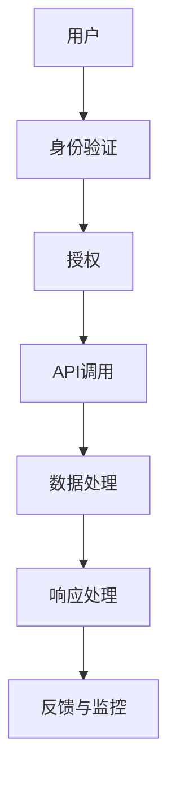

                 

API（应用程序编程接口）是现代软件开发中不可或缺的一部分，它定义了不同软件组件之间的交互方式。随着云计算和微服务架构的普及，API已经成为企业和服务之间数据交换的核心。然而，API的安全性和可靠性对服务的整体性能和用户体验至关重要。本文将探讨如何设计安全可靠的API，并提供一些最佳实践和工具。

> **关键词**：API设计、安全性、可靠性、微服务、最佳实践

> **摘要**：本文首先介绍了API设计的重要性，然后详细分析了安全性、可靠性以及API的设计原则。接着，文章讨论了实现安全性和可靠性的具体技术，如身份验证、授权、数据加密和错误处理。最后，文章提供了一些工具和资源，帮助开发者更好地设计和管理API。

## 1. 背景介绍

API设计不仅仅是技术问题，它还涉及到业务逻辑、用户体验和系统架构等多个方面。一个良好的API设计可以提高开发效率，降低维护成本，并确保系统的可扩展性和可维护性。随着互联网的发展，API已经成为企业服务的核心，例如，RESTful API和GraphQL API在各种应用中得到了广泛应用。

### 1.1 API的重要性

API的重要性体现在以下几个方面：

1. **互操作性**：API使得不同的软件系统能够相互通信和共享数据。
2. **灵活性**：通过API，开发者可以轻松地集成第三方服务和功能。
3. **扩展性**：良好的API设计有助于系统扩展，支持新功能和模块的添加。
4. **可重用性**：API可以帮助减少重复开发，提高代码的复用率。

### 1.2 安全性与可靠性的挑战

随着API的普及，安全性和可靠性问题也日益突出。以下是一些常见的挑战：

1. **身份验证与授权**：确保只有授权用户可以访问API。
2. **数据保护**：防止敏感数据在传输和存储过程中被窃取。
3. **错误处理**：确保API在遇到异常情况时能够正确处理错误。
4. **性能与负载**：确保API在高并发和大量数据传输时仍然能够稳定运行。

## 2. 核心概念与联系

在设计安全可靠的API之前，我们需要了解一些核心概念和架构设计原则。以下是一个简单的Mermaid流程图，用于展示API设计的关键组件和流程。



### 2.1 身份验证

身份验证是确保只有合法用户能够访问API的第一步。常用的身份验证方法包括：

- **Basic Authentication**：通过Base64编码的用户名和密码进行验证。
- **OAuth 2.0**：一种广泛使用的授权框架，支持第三方登录和单点登录（SSO）。
- **JWT（JSON Web Tokens）**：一种基于JSON的加密令牌，用于在用户和服务之间传递认证信息。

### 2.2 授权

授权是确保用户有权限执行特定操作的过程。常见的授权机制包括：

- **RBAC（基于角色的访问控制）**：根据用户的角色分配权限。
- **ABAC（基于属性的访问控制）**：根据用户的属性（如用户组、时间、位置等）分配权限。
- **ACL（访问控制列表）**：为每个资源定义访问权限。

### 2.3 API调用

API调用是用户通过身份验证和授权后，与服务进行交互的过程。确保API调用高效、稳定和可靠非常重要。

### 2.4 数据处理

在API调用过程中，数据处理是关键环节。确保数据的完整性、一致性和安全性是数据处理的首要任务。

### 2.5 响应处理

API的响应处理包括返回正确的状态码、消息和数据格式。良好的错误处理机制能够提高用户体验。

### 2.6 反馈与监控

反馈与监控是确保API安全性和可靠性的重要手段。通过日志记录、性能监控和自动化测试，可以及时发现和解决潜在问题。

## 3. 核心算法原理 & 具体操作步骤

### 3.1 算法原理概述

设计安全可靠的API的核心在于以下几个方面：

- **身份验证与授权**：确保用户身份和权限。
- **数据加密**：保护敏感数据。
- **错误处理**：确保API能够正确处理各种异常情况。
- **性能优化**：确保API在高负载下仍然高效。

### 3.2 算法步骤详解

#### 3.2.1 身份验证与授权

1. **身份验证**：
   - 使用OAuth 2.0或JWT进行身份验证。
   - 验证请求中的身份验证令牌（如JWT）。
2. **授权**：
   - 根据用户的角色和权限，确定用户是否可以访问特定资源。
   - 使用RBAC或ABAC进行授权。

#### 3.2.2 数据加密

1. **传输层加密**：
   - 使用HTTPS/TLS加密传输数据。
   - 验证SSL/TLS证书的有效性。
2. **存储层加密**：
   - 对敏感数据（如密码、信用卡号码等）进行加密存储。

#### 3.2.3 错误处理

1. **错误响应**：
   - 返回适当的HTTP状态码和错误消息。
   - 提供详细的错误日志，但不泄露敏感信息。
2. **异常处理**：
   - 使用全局异常处理（GEP）框架，如Spring MVC的`@ControllerAdvice`。
   - 异常情况下，自动重定向到错误页面或返回JSON格式的错误消息。

#### 3.2.4 性能优化

1. **缓存**：
   - 使用缓存技术（如Redis、Memcached）减少数据库查询次数。
   - 根据业务需求，设置合理的缓存过期时间。
2. **负载均衡**：
   - 使用负载均衡器（如Nginx、HAProxy）分配请求到多个服务器。
   - 根据服务器负载和响应时间动态调整负载均衡策略。

### 3.3 算法优缺点

- **优点**：
  - 提高系统的安全性和可靠性。
  - 提高开发效率和用户体验。
  - 支持高性能和高并发。
- **缺点**：
  - 需要额外的开发和维护成本。
  - 可能会影响系统的性能。

### 3.4 算法应用领域

- **电子商务**：确保用户数据和交易数据的安全。
- **社交媒体**：保护用户隐私和防止滥用。
- **金融科技**：确保资金交易和数据的安全性。

## 4. 数学模型和公式 & 详细讲解 & 举例说明

在设计安全可靠的API时，一些数学模型和公式是不可或缺的。以下是一个简单的示例：

### 4.1 数学模型构建

假设我们有一个API，需要处理用户身份验证和授权。我们可以使用以下数学模型：

- 用户ID（UID）：唯一标识用户的数字。
- 密码（PWD）：用户的密码。
- 访问令牌（JWT）：用于身份验证和授权的加密令牌。

### 4.2 公式推导过程

- **身份验证**：
  - `Authentication(UID, PWD) = HMAC-SHA256(UID + PWD, SECRET_KEY)`
- **授权**：
  - `Authorization(UID, ROLE) = RBAC(UID, ROLE, RESOURCE)`

### 4.3 案例分析与讲解

假设我们有一个电子商务网站，用户需要登录并访问购物车。以下是一个简单的案例：

1. **用户登录**：
   - 用户提交用户ID（UID）和密码（PWD）。
   - 服务端使用HMAC-SHA256算法验证用户身份。
2. **访问购物车**：
   - 用户提交访问令牌（JWT）和购物车资源（RESOURCE）。
   - 服务端使用RBAC框架检查用户权限。

## 5. 项目实践：代码实例和详细解释说明

在本节中，我们将通过一个简单的API项目，展示如何实现安全可靠的API设计。我们将使用Spring Boot框架和JWT库。

### 5.1 开发环境搭建

- JDK 1.8 或更高版本。
- Spring Boot 2.x 或更高版本。
- Maven 3.x 或更高版本。
- JWT 库：`jjwt`。

### 5.2 源代码详细实现

以下是一个简单的Spring Boot项目，包含用户身份验证和授权：

```java
@RestController
@RequestMapping("/api")
public class UserController {

    @Autowired
    private UserService userService;

    @PostMapping("/login")
    public ResponseEntity<?> login(@RequestBody LoginRequest loginRequest) {
        String jwtToken = userService.login(loginRequest);
        return ResponseEntity.ok(new JwtResponse(jwtToken));
    }

    @PostMapping("/register")
    public ResponseEntity<?> register(@RequestBody RegisterRequest registerRequest) {
        userService.register(registerRequest);
        return ResponseEntity.ok("User registered successfully");
    }

    @GetMapping("/me")
    @PreAuthorize("hasRole('ROLE_USER')")
    public ResponseEntity<?> getUser(@RequestHeader("Authorization") String token) {
        String userId = userService.validateToken(token);
        User user = userService.findById(userId);
        return ResponseEntity.ok(user);
    }
}
```

### 5.3 代码解读与分析

1. **用户登录**：
   - 用户提交用户ID（UID）和密码（PWD）。
   - 服务端调用`userService.login()`方法，使用HMAC-SHA256算法验证用户身份。
   - 如果验证成功，返回JWT令牌。
2. **用户注册**：
   - 用户提交用户信息。
   - 服务端调用`userService.register()`方法，存储用户信息。
   - 返回注册成功消息。
3. **获取用户信息**：
   - 用户提交JWT令牌。
   - 服务端使用JWT库验证令牌的有效性。
   - 如果验证成功，返回用户信息。

## 6. 实际应用场景

安全可靠的API在许多实际应用场景中都非常重要。以下是一些应用场景：

- **金融应用**：确保用户资金交易和数据安全。
- **社交媒体**：保护用户隐私和防止滥用。
- **电子商务**：确保用户购物体验和数据安全。

## 7. 工具和资源推荐

### 7.1 学习资源推荐

- 《API设计指南》
- 《RESTful API设计最佳实践》
- 《OAuth 2.0简明教程》

### 7.2 开发工具推荐

- Spring Boot
- JWT库（jjwt）
- Nginx

### 7.3 相关论文推荐

- “API Security: A Comprehensive Review”
- “Designing Secure APIs with JWT”

## 8. 总结：未来发展趋势与挑战

### 8.1 研究成果总结

近年来，API设计和安全领域取得了显著进展。随着云计算和微服务架构的普及，API设计变得更加灵活和高效。同时，安全性和可靠性也成为API设计的重要考虑因素。

### 8.2 未来发展趋势

- **自动化与智能化**：自动化工具和人工智能将越来越多地应用于API设计和安全测试。
- **多因素认证**：多因素认证（MFA）将成为主流，提供更安全的身份验证方式。
- **联邦身份验证**：联邦身份验证（Federated Authentication）将简化用户认证过程。

### 8.3 面临的挑战

- **安全性**：随着攻击手段的升级，确保API的安全性仍然是一个巨大的挑战。
- **性能与可扩展性**：在高并发和大量数据传输时，确保API的性能和可扩展性。
- **合规性**：遵守不同地区的法律法规和数据保护要求。

### 8.4 研究展望

未来，API设计和安全领域将继续发展。研究人员和开发者需要关注以下几个方面：

- **安全性和性能的平衡**：在确保安全性的同时，提高API的性能和可扩展性。
- **智能化安全防护**：利用人工智能和机器学习技术，提高API的安全防护能力。
- **标准化**：推动API设计和安全标准的制定和推广。

## 9. 附录：常见问题与解答

### 9.1 什么是API设计？

API设计是指定义软件组件之间交互的接口，包括数据格式、请求和响应等。

### 9.2 如何确保API的安全性？

确保API的安全性包括身份验证、授权、数据加密和错误处理等方面。

### 9.3 哪些身份验证方法常用？

常用的身份验证方法包括Basic Authentication、OAuth 2.0和JWT。

### 9.4 如何优化API的性能？

优化API性能包括使用缓存、负载均衡和性能监控等方面。

---

作者：禅与计算机程序设计艺术 / Zen and the Art of Computer Programming
----------------------------------------------------------------


