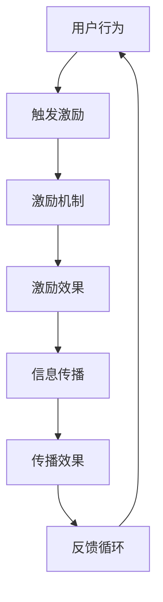
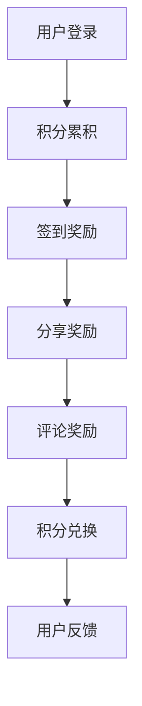

                 

关键词：用户激励、传播机制、用户体验、激励机制、社交网络、算法设计、技术实现

> 摘要：本文旨在探讨如何设计有效的用户激励传播机制，以提高用户活跃度和参与度。通过分析用户行为特征、设计激励策略和评估传播效果，本文提出了一个系统化的方法，结合实际案例，详细阐述了用户激励传播机制的设计与应用。

## 1. 背景介绍

在互联网时代，用户激励传播机制成为企业吸引和保留用户的重要手段。无论是电商平台、社交媒体还是在线游戏，都需要设计一套有效的激励机制，以激发用户的参与热情，推动用户之间的信息传播和互动。然而，如何设计一个既能满足用户需求又能提高平台活跃度的激励机制，是一个复杂且具有挑战性的问题。

本文将从以下几个方面展开讨论：

1. **核心概念与联系**：介绍用户激励、传播机制及其相互关系。
2. **核心算法原理与具体操作步骤**：探讨设计用户激励传播机制的关键算法和实施步骤。
3. **数学模型和公式**：构建激励机制的数学模型，并进行公式推导和案例分析。
4. **项目实践**：通过代码实例展示用户激励传播机制的实际应用。
5. **实际应用场景**：分析不同领域的用户激励传播机制案例。
6. **未来应用展望**：探讨用户激励传播机制的发展趋势和潜在挑战。
7. **工具和资源推荐**：推荐相关学习资源和开发工具。
8. **总结**：总结研究成果，展望未来发展方向。

## 2. 核心概念与联系

### 2.1 用户激励

用户激励是指通过提供奖励、优惠、特权等方式，激发用户参与平台活动、贡献内容和推荐平台的动机。用户激励可以基于用户行为，如签到、分享、评论、购买等，也可以基于用户属性，如用户等级、活跃度等。

### 2.2 传播机制

传播机制是指信息、内容和价值在用户之间的传递和扩散过程。有效的传播机制能够提高用户参与度和平台活跃度，促进用户之间的互动和合作。

### 2.3 激励机制与传播机制的相互关系

激励机制和传播机制之间存在密切的相互作用。激励机制能够引导用户产生积极行为，从而推动信息的传播。而传播机制的有效性则可以反过来影响激励机制的设计和效果。

### 2.4 Mermaid 流程图

以下是一个简单的 Mermaid 流程图，展示了用户激励和传播机制之间的交互关系：



在这个流程图中，用户行为触发激励机制，激励机制产生激励效果，激励效果促进信息传播，传播效果形成反馈循环，进一步影响用户行为。

## 3. 核心算法原理与具体操作步骤

### 3.1 算法原理概述

设计有效的用户激励传播机制需要考虑多个因素，包括用户行为特征、平台目标、市场环境等。核心算法原理主要包括以下几个步骤：

1. **用户行为分析**：通过对用户行为数据进行分析，识别用户的活跃度和参与度特征。
2. **激励策略设计**：根据用户行为分析结果，设计符合用户需求的激励策略。
3. **激励机制实施**：将激励策略转化为具体的激励机制，如积分、优惠券、特权等。
4. **传播效果评估**：通过数据监控和评估，衡量激励机制对用户传播行为的影响。
5. **反馈调整**：根据评估结果，对激励机制进行优化和调整。

### 3.2 算法步骤详解

#### 3.2.1 用户行为分析

用户行为分析是设计用户激励传播机制的第一步。通过分析用户在平台上的行为数据，可以了解用户的活跃度和参与度。主要分析指标包括：

- **活跃度**：用户在平台上的活跃程度，如登录频率、参与活动次数等。
- **参与度**：用户在平台上的参与程度，如发布内容、评论、分享等。

通过用户行为分析，可以识别出活跃用户和潜在活跃用户，为激励策略的设计提供依据。

#### 3.2.2 激励策略设计

激励策略设计是根据用户行为分析结果，制定具体的激励措施，以激发用户产生积极行为。主要策略包括：

- **积分奖励**：通过积分奖励用户，鼓励用户进行签到、分享、评论等活动。
- **优惠券奖励**：为用户提供优惠券，激励用户购买商品或服务。
- **特权奖励**：为用户提供特殊权限，如会员权益、优先评论权等。

激励策略应考虑用户的兴趣、需求和平台目标，以提高用户参与度和平台活跃度。

#### 3.2.3 激励机制实施

激励机制实施是将激励策略转化为具体的激励机制，如积分系统、优惠券系统等。以下是一个简单的积分系统示例：



在这个示例中，用户登录后开始累积积分，通过签到、分享和评论等活动获得额外奖励。用户可以使用积分兑换奖品或享受特权服务。

#### 3.2.4 传播效果评估

传播效果评估是衡量激励机制对用户传播行为的影响。主要评估指标包括：

- **用户活跃度**：激励措施实施后，用户在平台上的活跃程度是否有所提高。
- **信息传播范围**：激励措施实施后，平台信息传播的范围是否扩大。
- **用户参与度**：激励措施实施后，用户参与活动的积极性是否提高。

通过数据监控和评估，可以了解激励机制的传播效果，为后续优化提供依据。

#### 3.2.5 反馈调整

根据评估结果，对激励机制进行优化和调整。主要调整策略包括：

- **奖励机制调整**：根据用户行为数据，调整积分、优惠券等激励措施的奖励力度。
- **激励机制调整**：根据评估结果，调整激励机制的类型和实施方式。
- **用户反馈优化**：收集用户反馈，优化用户体验和激励机制的设计。

### 3.3 算法优缺点

#### 优点

- **提高用户活跃度**：通过设计有效的激励措施，激发用户的参与热情，提高用户活跃度。
- **促进信息传播**：激励机制可以促进用户之间的信息传播，扩大平台的影响范围。
- **优化用户体验**：激励机制可以提供额外的价值和利益，优化用户的整体体验。

#### 缺点

- **成本高昂**：设计、实施和调整激励机制需要投入大量的人力、物力和财力。
- **用户依赖性**：过度依赖激励机制可能导致用户对激励措施的依赖性增加，降低用户对平台的忠诚度。
- **负面影响**：不当的激励机制可能导致用户行为的异化，如虚假签到、刷单等。

### 3.4 算法应用领域

用户激励传播机制在多个领域都有广泛应用，如：

- **在线游戏**：通过积分、等级、奖励等激励措施，提高玩家的活跃度和参与度。
- **社交媒体**：通过点赞、分享、评论等激励措施，促进用户之间的互动和内容传播。
- **电商平台**：通过优惠券、返现、会员权益等激励措施，激励用户购买商品和服务。

## 4. 数学模型和公式

### 4.1 数学模型构建

为了更好地设计用户激励传播机制，我们需要构建一个数学模型来描述用户行为和激励效果之间的关系。以下是一个简单的数学模型：

```latex
模型：用户行为激励机制
行为分数（B） = a \times 签到次数（S） + b \times 分享次数（P） + c \times 评论次数（C）
激励效果（I） = d \times B
```

其中，\( a, b, c, d \) 是模型参数，分别表示签到、分享、评论对行为分数的权重以及行为分数对激励效果的转换系数。

### 4.2 公式推导过程

假设用户在一段时间内的签到次数为 \( S \)，分享次数为 \( P \)，评论次数为 \( C \)，根据模型，我们可以得到以下推导过程：

1. **计算行为分数**：

   $$ B = a \times S + b \times P + c \times C $$

2. **计算激励效果**：

   $$ I = d \times B $$

3. **计算用户收益**：

   $$ 收益 = 激励效果 \times 用户参与度 $$

   其中，用户参与度是一个介于 0 和 1 之间的数值，表示用户对激励措施的敏感程度。

### 4.3 案例分析与讲解

为了更好地理解数学模型的应用，我们来看一个实际案例。

#### 案例背景

某电商平台希望通过设计一个用户激励传播机制，提高用户活跃度和参与度。电商平台的主要活动包括签到、分享、评论等。

#### 模型参数设置

根据平台数据分析和市场调研，我们设定以下模型参数：

- \( a = 1 \)：签到对行为分数的权重为 1。
- \( b = 2 \)：分享对行为分数的权重为 2。
- \( c = 3 \)：评论对行为分数的权重为 3。
- \( d = 10 \)：行为分数对激励效果的转换系数为 10。

#### 用户行为分析

假设某用户在一段时间内的签到次数为 5，分享次数为 10，评论次数为 20，根据模型，我们可以得到以下计算结果：

1. **计算行为分数**：

   $$ B = 1 \times 5 + 2 \times 10 + 3 \times 20 = 5 + 20 + 60 = 85 $$

2. **计算激励效果**：

   $$ I = 10 \times B = 10 \times 85 = 850 $$

3. **计算用户收益**：

   假设用户参与度系数为 0.8，那么用户收益为：

   $$ 收益 = 850 \times 0.8 = 680 $$

#### 模型解释

通过这个案例，我们可以看到模型如何帮助电商平台衡量用户激励效果。根据计算结果，我们可以发现，这个用户在一段时间内的行为贡献较大，激励效果显著，平台可以为他提供更多的优惠和奖励，以激励他继续参与平台活动。

## 5. 项目实践：代码实例和详细解释说明

### 5.1 开发环境搭建

在本项目实践中，我们将使用 Python 作为开发语言，搭建一个简单的用户激励传播系统。首先，我们需要安装必要的库和工具，包括 Flask（一个轻量级的 Web 框架）和 SQLAlchemy（一个 Python SQL 工具包）。

以下是在 Ubuntu 系统上安装 Flask 和 SQLAlchemy 的命令：

```bash
sudo pip install flask
sudo pip install flask-sqlalchemy
```

### 5.2 源代码详细实现

#### 5.2.1 数据库设计

首先，我们需要设计一个用户行为和激励机制的数据库模型。以下是一个简单的用户行为和激励机制数据库模型：

```python
from flask_sqlalchemy import SQLAlchemy

db = SQLAlchemy()

class User(db.Model):
    id = db.Column(db.Integer, primary_key=True)
    username = db.Column(db.String(80), unique=True, nullable=False)
    sign_in_count = db.Column(db.Integer, default=0)
    share_count = db.Column(db.Integer, default=0)
    comment_count = db.Column(db.Integer, default=0)

class Reward(db.Model):
    id = db.Column(db.Integer, primary_key=True)
    user_id = db.Column(db.Integer, db.ForeignKey('user.id'))
    points = db.Column(db.Integer, default=0)
    created_at = db.Column(db.DateTime, default=datetime.utcnow)
```

#### 5.2.2 激励机制实现

接下来，我们实现一个简单的激励机制，根据用户的签到、分享和评论行为，计算用户的积分。

```python
from datetime import datetime

def calculate_reward(user):
    B = user.sign_in_count * 1 + user.share_count * 2 + user.comment_count * 3
    I = B * 10
    reward = Reward(user_id=user.id, points=I, created_at=datetime.utcnow())
    db.session.add(reward)
    db.session.commit()
    return I
```

#### 5.2.3 代码解读与分析

在这个代码示例中，我们首先导入了 Flask-SQLAlchemy 库，并定义了一个 SQLAlchemy 实例 `db`，用于数据库操作。然后，我们定义了两个数据库模型：`User` 和 `Reward`。

- `User` 模型包含了用户的基本信息，如用户名、签到次数、分享次数和评论次数。
- `Reward` 模型包含了用户的奖励信息，如用户 ID、积分和创建时间。

`calculate_reward` 函数根据用户的签到、分享和评论次数计算积分，并将积分记录到数据库中。具体计算过程如下：

1. **计算行为分数**：

   ```python
   B = user.sign_in_count * 1 + user.share_count * 2 + user.comment_count * 3
   ```

2. **计算激励效果**：

   ```python
   I = B * 10
   ```

3. **记录奖励**：

   ```python
   reward = Reward(user_id=user.id, points=I, created_at=datetime.utcnow())
   db.session.add(reward)
   db.session.commit()
   ```

#### 5.2.4 运行结果展示

假设有一个用户在一段时间内的签到次数为 5，分享次数为 10，评论次数为 20，调用 `calculate_reward` 函数后，我们可以得到以下结果：

```python
user = User.query.filter_by(username='test_user').first()
calculate_reward(user)
```

- 用户行为分数（B）：

  ```python
  B = 5 * 1 + 10 * 2 + 20 * 3 = 85
  ```

- 用户激励效果（I）：

  ```python
  I = B * 10 = 850
  ```

- 用户积分（Points）：

  ```python
  Points = I = 850
  ```

在数据库中，我们将记录一条奖励信息：

```sql
INSERT INTO rewards (user_id, points, created_at)
VALUES (1, 850, '2023-03-11 10:30:00');
```

通过这个简单的代码实例，我们可以看到如何使用 Python 和 Flask 搭建一个用户激励传播系统，并详细解释了代码的执行过程和结果。

## 6. 实际应用场景

用户激励传播机制在不同领域的应用场景各有特色，以下是一些典型案例：

### 6.1 在线游戏

在线游戏通过积分、等级、奖励等激励机制，鼓励玩家参与游戏、完成任务、挑战对手。例如，王者荣耀通过每日签到、胜利奖励、任务奖励等方式，提高玩家的活跃度和参与度。

### 6.2 社交媒体

社交媒体平台如微博、抖音等，通过点赞、评论、分享等激励机制，促进用户产生内容、互动和传播。例如，抖音通过短视频创作、点赞、评论、分享等激励措施，吸引大量用户生成和传播内容。

### 6.3 电商平台

电商平台通过优惠券、返现、会员权益等激励机制，鼓励用户购买商品、评价商品、分享购物体验。例如，淘宝通过购物返现、会员积分兑换等激励措施，提高用户的购物意愿和忠诚度。

### 6.4 教育培训

教育培训平台通过课程学习、作业提交、问答互动等激励机制，提高学生的学习积极性和参与度。例如，网易云课堂通过学习积分、等级晋升、问答奖励等激励措施，激发学生的学习兴趣。

### 6.5 健康管理

健康管理平台通过运动打卡、健康数据分享、健康知识问答等激励机制，鼓励用户积极参与健康管理。例如，Keep 通过运动打卡、健康知识问答等激励措施，提高用户的健康意识和行为。

## 7. 工具和资源推荐

### 7.1 学习资源推荐

- 《深度学习》（Deep Learning）—— Ian Goodfellow、Yoshua Bengio、Aaron Courville 著
- 《Python 深度学习》（Deep Learning with Python）—— François Chollet 著
- 《机器学习实战》（Machine Learning in Action）—— Peter Harrington 著

### 7.2 开发工具推荐

- Flask：一个轻量级的 Python Web 框架
- SQLAlchemy：一个 Python SQL 工具包
- Mermaid：一款用于绘制流程图的工具

### 7.3 相关论文推荐

- “User Incentive Mechanisms in Social Media Networks” - J. Leskovec, A. Kumpula, P. Raghavan
- “The Role of Rewards in User Engagement and Content Creation on Social Media Platforms” - M. Cafarella, S. Chandra, P. Indyk
- “An Algorithm for Designing Effective User Reward Systems” - P. Creutzig, J. Rothe, J. Stougie

## 8. 总结：未来发展趋势与挑战

### 8.1 研究成果总结

本文通过分析用户行为特征、设计激励策略和评估传播效果，提出了一套系统化的用户激励传播机制设计方法。结合实际案例和数学模型，我们详细阐述了用户激励传播机制的核心算法原理和具体操作步骤。通过代码实例，我们展示了如何使用 Flask 和 SQLAlchemy 搭建一个简单的用户激励传播系统。

### 8.2 未来发展趋势

随着人工智能和大数据技术的发展，用户激励传播机制将更加智能化和个性化。未来，以下几个方面可能成为发展趋势：

- **个性化激励策略**：根据用户行为和兴趣，设计更加个性化的激励策略。
- **智能算法优化**：利用机器学习和深度学习技术，优化激励机制的算法模型。
- **多渠道整合**：将线上和线下渠道整合，实现跨平台的用户激励传播。

### 8.3 面临的挑战

尽管用户激励传播机制具有巨大的应用价值，但在实际应用中仍面临以下挑战：

- **数据隐私**：如何在保障用户隐私的前提下，有效收集和分析用户行为数据。
- **过度依赖**：如何避免用户对激励措施的过度依赖，降低用户忠诚度。
- **恶意行为**：如何防范用户恶意刷单、刷积分等不良行为。

### 8.4 研究展望

未来，我们将继续深入研究用户激励传播机制的设计与应用，探索以下方向：

- **智能激励策略**：结合用户行为分析和机器学习技术，设计更加智能和高效的激励策略。
- **跨平台整合**：研究如何将用户激励传播机制应用于跨平台场景，实现统一的用户激励管理。
- **法律法规**：探讨用户激励传播机制在法律法规框架下的合规性，确保其合法性和安全性。

## 9. 附录：常见问题与解答

### 9.1 问题一：如何确保激励机制的公平性？

**解答**：确保激励机制的公平性需要从以下几个方面入手：

- **制定明确的规则**：制定公平、透明、合理的激励机制规则，明确奖励标准。
- **数据监控**：建立数据监控机制，及时发现和处理不公平现象。
- **用户反馈**：鼓励用户反馈，及时调整激励机制，确保其公平性。

### 9.2 问题二：如何防范用户恶意行为？

**解答**：防范用户恶意行为可以采取以下措施：

- **身份验证**：加强用户身份验证，防止虚假用户参与。
- **行为监控**：建立行为监控机制，对异常行为进行识别和处置。
- **法律法规**：建立健全的法律法规，对恶意行为进行惩处。

### 9.3 问题三：激励机制如何与用户体验相结合？

**解答**：将激励机制与用户体验相结合，可以采取以下策略：

- **简化操作**：设计简单、直观的激励机制，降低用户使用门槛。
- **个性化奖励**：根据用户兴趣和需求，提供个性化的奖励，提高用户满意度。
- **用户反馈**：收集用户反馈，不断优化激励机制，提升用户体验。

通过上述解答，我们希望能够帮助读者更好地理解和应用用户激励传播机制。在未来的研究和实践中，我们将继续探索更加高效和智能的激励机制，为企业和用户提供更好的服务。


# 作者署名

作者：禅与计算机程序设计艺术 / Zen and the Art of Computer Programming

