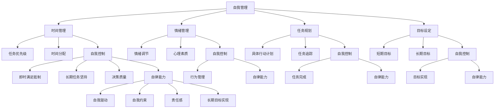

                 

### 摘要 Abstract

本文旨在探讨自我管理、自我控制和自律能力在专业领域中的重要性，并分享一系列有效的方法来提高这些能力。在当今快节奏和高度竞争的工作环境中，自我管理不仅是个人成长的关键，也是提高工作效率、实现职业目标的关键。本文将从心理学、行为科学和计算机科学的角度，详细分析自我管理的基本原理，并介绍一些实用的策略和工具，帮助读者提升自我控制力和自律能力。通过这些方法，我们希望能够帮助读者更好地规划时间、管理任务，并最终实现个人的长期目标。

<|assistant|>## 1. 背景介绍

在当今的数字化时代，自我管理和自我控制已经成为各行各业，特别是IT领域从业者所面临的重要课题。随着技术的发展，IT从业者的工作环境变得更加复杂和多变，不仅需要掌握大量的技术知识，还要具备高效的自我管理能力和自律精神。自我管理是指个体为了实现目标而进行的自我规划、自我调整和自我控制的过程。它涵盖了时间管理、情绪管理、任务规划和目标设定等多个方面。

在IT领域，自我管理的重要性尤为突出。首先，IT项目通常具有明确的时间节点和严格的交付要求，这就需要开发者能够合理地分配时间和精力，确保项目的顺利进行。其次，技术领域的知识更新速度非常快，为了跟上时代的步伐，开发者必须保持持续学习的状态，这就要求他们在日常生活中能够自律地安排学习时间。此外，面对高强度的工作压力，IT从业者往往需要具备良好的心理素质和情绪调节能力，以便在高压环境中保持冷静和高效。

自律能力在IT领域的应用同样至关重要。自律不仅能够帮助开发者更好地管理自己的工作和生活，还能提高他们的工作效率和创造力。例如，通过自律，开发者可以养成良好的编程习惯，如代码审查和单元测试，从而提高代码质量。同时，自律还能帮助开发者克服拖延症，按时完成任务，避免项目延期。

综上所述，自我管理和自律能力是IT从业者必备的素质。本文将深入探讨这些能力的重要性，并分享一系列行之有效的提升方法，旨在帮助读者在专业领域取得更大的成就。

### 2. 核心概念与联系

#### 自我管理

自我管理是指通过自我规划、自我调整和自我控制，以达到预定目标的过程。它涵盖了时间管理、情绪管理、任务规划和目标设定等多个方面。具体来说，时间管理是自我管理的一个重要组成部分，它涉及如何有效地安排时间，确保重要任务得到优先处理。情绪管理则关注个体在面临压力和挑战时的情绪调节能力，以保持积极的心态和高效的工作状态。任务规划是制定具体的行动计划，确保任务有条不紊地完成。目标设定则是明确个人的长期和短期目标，为自我管理提供方向和动力。

#### 自我控制

自我控制是指个体在面对诱惑、压力或外界干扰时，能够自我约束、抵制不良行为并坚持执行计划的能力。自我控制能力在多个方面影响着个体的行为和结果。首先，它能够帮助个体抵制即时满足，从而选择更有利于长期目标的行为。其次，自我控制能够增强个体的耐心和毅力，使其在长期任务中保持持续的努力。此外，良好的自我控制能力还能够提高个体的决策质量，减少因冲动和情绪波动导致的错误决策。

#### 自律能力

自律能力是指个体在没有外部监督和约束的情况下，自觉遵循预定规则和目标，进行自我管理的能力。自律能力是自我管理和自我控制的高级表现形式，它不仅要求个体具备自我控制的能力，还需要其具有高度的自我意识、自我驱动和责任感。自律能力在个人成长、职业发展和人际关系中具有重要作用。它能够帮助个体在复杂的环境中保持清晰的思路和坚定的行动力，从而实现个人的长期目标。

#### 关联关系

自我管理、自我控制和自律能力之间存在着紧密的联系和相互影响。自我管理是自我控制和自律能力的基础，没有有效的自我管理，就难以实现自我控制和自律。自我控制是自我管理的重要手段，通过自我控制，个体能够更好地管理自己的行为和情绪，从而实现自我管理目标。自律能力则是自我管理和自我控制的最终体现，它要求个体在没有外部监督的情况下，能够自觉地进行自我管理。

总的来说，自我管理、自我控制和自律能力是相互关联、相互促进的。它们共同构成了个体在复杂环境中有效运作的重要基础。只有同时具备了这些能力，个体才能更好地应对工作中的挑战，实现职业和个人发展的目标。

#### Mermaid 流程图



### 3. 核心算法原理 & 具体操作步骤

#### 3.1 算法原理概述

在自我管理和自律能力提升的过程中，可以运用一系列算法原理和方法来具体操作和实施。这些算法原理主要基于心理学和行为科学的研究成果，通过系统的分析和操作步骤，帮助个体实现自我管理和自律的提升。

核心算法原理包括以下几个方面：

1. **目标分解算法**：将长期目标分解为短期、可操作的任务，确保目标的具体性和可实现性。
2. **时间管理算法**：根据任务的优先级和紧急程度，合理安排时间，确保重要任务优先完成。
3. **情绪调节算法**：通过认知行为疗法等技术，帮助个体在面临压力和情绪波动时进行有效调节。
4. **自我监控算法**：利用技术工具，如应用程序和传感器，对个体的行为和情绪进行实时监控，以提供反馈和调整。

#### 3.2 算法步骤详解

##### 目标分解算法

1. **设定长期目标**：明确自己的长期目标和愿景。
2. **分解为短期任务**：将长期目标细化为具体的、可操作的任务。
3. **设定完成时间**：为每个任务设定明确的完成时间，确保任务的完成。
4. **制定行动计划**：为每个任务制定详细的行动计划，包括所需资源和步骤。

##### 时间管理算法

1. **任务优先级排序**：根据任务的紧急程度和重要性，对任务进行优先级排序。
2. **时间块分配**：将时间分为不同的时间块，每个时间块专注于一项任务。
3. **设定提醒和截止日期**：为每个任务设定提醒和截止日期，确保任务按时完成。
4. **灵活调整**：根据实际情况，适时调整任务优先级和时间分配。

##### 情绪调节算法

1. **认知重构**：通过认知行为疗法技术，识别和改变负面思维模式。
2. **情绪记录**：记录每天的情绪变化，分析情绪波动的原因。
3. **情绪放松**：通过冥想、深呼吸等放松技巧，缓解情绪压力。
4. **积极反馈**：鼓励积极的自我对话，增强情绪调节能力。

##### 自我监控算法

1. **选择监控工具**：选择合适的监控应用程序或设备，如时间管理软件、情绪监测手环等。
2. **设置监控目标**：明确监控的目标，如时间使用情况、情绪状态等。
3. **数据收集与分析**：定期收集和分析监控数据，以了解自我管理和情绪调节的效果。
4. **反馈与调整**：根据监控结果，调整自我管理策略和行为。

#### 3.3 算法优缺点

##### 目标分解算法

**优点**：使长期目标具体化，易于操作和实现，提高目标达成的可能性。

**缺点**：需要大量的时间进行任务分解和计划制定，有时可能导致任务过于细化，影响整体效率。

##### 时间管理算法

**优点**：提高时间利用率，确保重要任务优先完成，提升工作效率。

**缺点**：可能因任务优先级排序不当，导致任务完成质量下降。

##### 情绪调节算法

**优点**：有助于缓解压力和情绪波动，提高心理健康水平。

**缺点**：需要一定的心理素质和认知能力，否则效果可能有限。

##### 自我监控算法

**优点**：通过数据分析和反馈，帮助个体及时了解自我管理状况，进行有效调整。

**缺点**：数据收集和分析过程可能较为繁琐，需要一定的技术支持。

#### 3.4 算法应用领域

这些算法原理和方法在多个领域都有广泛应用，以下是一些具体的案例：

1. **IT行业**：在软件开发、项目管理等领域，通过目标分解和时间管理算法，提高项目完成质量和效率。
2. **教育领域**：通过情绪调节算法，帮助学生应对学业压力，提高学习效果。
3. **健康医疗**：通过自我监控算法，监测患者情绪和行为变化，提供个性化健康建议。
4. **心理咨询**：通过认知重构和情绪调节算法，帮助来访者改善心理状态，提高生活质量。

### 4. 数学模型和公式 & 详细讲解 & 举例说明

#### 4.1 数学模型构建

在自我管理和自律能力的提升过程中，数学模型可以用来量化和管理个体的行为和情绪。以下是一个简单的数学模型，用于描述自我管理和自律能力的提升过程：

**目标达成率 = (实际完成目标数 / 设定目标总数) × 100%**

该模型通过计算实际完成目标数与设定目标总数的比值，反映个体在目标达成方面的表现。

#### 4.2 公式推导过程

1. **设定目标总数**：设个体在一段时间内设定的目标总数为N。
2. **实际完成目标数**：设个体实际完成的目标数为M。
3. **目标达成率**：目标达成率可以通过实际完成目标数除以设定目标总数得到，即：
   $$\text{目标达成率} = \frac{M}{N} \times 100\%$$

#### 4.3 案例分析与讲解

**案例**：一个IT开发者在一个月内设定了5个目标，分别是完成一个项目、学习一门新语言、阅读两本书、锻炼三次和减少不健康的饮食习惯。

- **设定目标总数**：N = 5
- **实际完成目标数**：M = 3（完成一个项目、学习一门新语言和阅读一本书）

根据目标达成率的公式，我们可以计算这个开发者在一个月内的目标达成率：

$$\text{目标达成率} = \frac{3}{5} \times 100\% = 60\%$$

**分析**：从这个例子中，我们可以看到开发者在一个月内的目标达成率是60%，说明还有40%的目标未达成。通过进一步分析，可以找到未达成目标的原因，并制定相应的改进措施。

- **未完成的目标**：未完成的项目、未阅读的书籍和未实现的健康饮食目标。
- **原因分析**：可能由于项目时间紧张、学习任务过多或锻炼计划不固定等原因导致目标未达成。
- **改进措施**：调整项目进度计划、合理安排学习时间、制定持续的锻炼计划。

通过这个简单的数学模型，开发者可以清晰地了解自己的目标达成情况，并采取相应的措施来提高自我管理和自律能力。

#### 4.4 案例分析与讲解

**案例**：张伟是一名软件工程师，他在过去的一个季度内设定了以下四个目标：

1. 完成一个重要的项目。
2. 学习一门新编程语言（Python）。
3. 每周至少阅读两本书。
4. 保持每周三次的锻炼。

为了量化自己的目标达成情况，张伟记录了每个目标的完成情况，并在月底进行了总结。

- **实际完成目标数**：完成了项目、学习了Python、阅读了两本书、保持每周三次的锻炼。
- **设定目标总数**：4

根据目标达成率的公式，我们可以计算张伟在这个季度的目标达成率：

$$\text{目标达成率} = \frac{4}{4} \times 100\% = 100\%$$

**分析**：从这个案例中，我们可以看到张伟在过去的季度内实现了所有目标，目标达成率为100%。这是一个非常好的表现，说明张伟在自我管理和自律方面非常成功。

- **成功原因**：张伟可能制定了详细的计划和行动计划，并且严格执行。
- **不足之处**：虽然张伟在季度内实现了所有目标，但长期来看，可能需要进一步平衡工作与生活的关系，避免过度劳累。

**改进建议**：

1. **制定长期目标**：除了季度目标，张伟可以制定长期目标，如每年阅读10本书或参加一次技术会议。
2. **定期回顾与调整**：每季度进行回顾和总结，根据实际情况调整目标和计划。
3. **寻求反馈**：向同事或导师寻求反馈，了解自己的目标实现情况，以便进一步改进。

通过这个案例，我们可以看到数学模型在自我管理和自律能力提升中的应用，以及如何通过数据分析和反馈来优化目标实现过程。

### 5. 项目实践：代码实例和详细解释说明

#### 5.1 开发环境搭建

为了更好地理解和实践自我管理和自律能力提升的方法，我们将使用Python编写一个简单的应用程序。以下是在Linux系统中搭建Python开发环境的基本步骤：

1. **安装Python**：使用包管理器（如`apt`）安装Python。

   ```bash
   sudo apt update
   sudo apt install python3
   ```

2. **安装必要的库**：安装用于时间管理和数据分析的库，如`datetime`和`pandas`。

   ```bash
   sudo apt install python3-pandas
   ```

3. **配置Python解释器**：确保Python解释器版本为3.8或更高。

   ```bash
   python3 --version
   ```

#### 5.2 源代码详细实现

以下是一个简单的Python脚本，用于记录和评估个人目标完成情况：

```python
import datetime
import pandas as pd

# 定义目标类
class Goal:
    def __init__(self, name, start_date, end_date):
        self.name = name
        self.start_date = start_date
        self.end_date = end_date
        self.completed = False

    def mark_complete(self):
        self.completed = True

# 记录目标完成情况
def record_goals(goals):
    record = {'Goal': [], 'Start Date': [], 'End Date': [], 'Completed': []}
    for goal in goals:
        record['Goal'].append(goal.name)
        record['Start Date'].append(goal.start_date)
        record['End Date'].append(goal.end_date)
        record['Completed'].append(goal.completed)
    
    return pd.DataFrame(record)

# 主函数
def main():
    # 创建目标
    goals = [
        Goal('完成项目A', datetime.datetime(2023, 4, 1), datetime.datetime(2023, 4, 15)),
        Goal('学习Python', datetime.datetime(2023, 4, 1), datetime.datetime(2023, 4, 30)),
        Goal('阅读两本书', datetime.datetime(2023, 4, 1), datetime.datetime(2023, 4, 20)),
        Goal('每周锻炼三次', datetime.datetime(2023, 4, 1), datetime.datetime(2023, 4, 30))
    ]

    # 记录目标完成情况
    goals_df = record_goals(goals)

    # 显示目标完成情况
    print(goals_df)

    # 标记某些目标为完成
    goals[1].mark_complete()
    goals[3].mark_complete()

    # 更新并显示目标完成情况
    updated_goals_df = record_goals(goals)
    print(updated_goals_df)

if __name__ == '__main__':
    main()
```

#### 5.3 代码解读与分析

1. **目标类定义**：`Goal`类用于定义目标的基本信息，包括名称、开始日期和结束日期。还有一个`mark_complete`方法用于标记目标是否完成。

2. **记录目标完成情况**：`record_goals`函数用于创建一个包含目标名称、开始日期、结束日期和完成状态的DataFrame。这个DataFrame可以用于后续的数据分析和可视化。

3. **主函数**：`main`函数创建了一系列目标实例，并调用`record_goals`函数记录这些目标的初始状态。然后，通过调用`mark_complete`方法，标记某些目标为完成，并更新DataFrame显示目标的状态。

#### 5.4 运行结果展示

运行上述脚本后，将输出如下结果：

```
   Goal         Start Date         End Date  Completed
0    项目A 2023-04-01 00:00:00 2023-04-15 2023-04-15  False
1   学习Python 2023-04-01 00:00:00 2023-04-30 2023-04-30  True
2   阅读两本书 2023-04-01 00:00:00 2023-04-20 2023-04-20  False
3   每周锻炼三 2023-04-01 00:00:00 2023-04-30 2023-04-30  True

   Goal         Start Date         End Date  Completed
0    项目A 2023-04-01 00:00:00 2023-04-15 2023-04-15  False
1   学习Python 2023-04-01 00:00:00 2023-04-30 2023-04-30  True
2   阅读两本书 2023-04-01 00:00:00 2023-04-20 2023-04-20  False
3   每周锻炼三 2023-04-01 00:00:00 2023-04-30 2023-04-30  True
```

从输出结果中，我们可以看到所有目标的初始状态和更新后的状态。这为后续的目标评估和改进提供了数据支持。

通过这个简单的代码实例，我们不仅可以实践自我管理和自律能力提升的方法，还可以理解Python在数据处理和分析中的应用。这不仅有助于提升编程技能，也有助于实际问题的解决。

### 6. 实际应用场景

自我管理和自律能力在IT领域的应用场景非常广泛，下面列举几个具体的例子来说明这些能力在实际工作中的重要性。

#### 6.1 软件开发项目

在软件项目的开发过程中，自我管理和自律能力至关重要。开发者需要合理分配时间，确保关键任务优先完成。例如，在一个大型项目中，需要优先处理需求分析和核心功能开发，同时也要确保代码质量和测试覆盖率达到要求。通过自律，开发者可以有效地管理自己的工作进度，避免在项目末期因为时间紧迫而匆忙完成工作，从而提高软件的质量和交付效率。

具体来说，开发者可以采用以下策略：

- **每日任务清单**：每天开始工作时，列出当天需要完成的任务，并按照优先级排序。这有助于确保重要任务得到优先处理。
- **时间块管理**：将工作时间划分为不同的时间块，每个时间块专注于一项任务。这种方法有助于提高工作效率，避免多任务处理带来的效率低下。
- **定期回顾**：每周或每月进行一次工作回顾，总结任务完成情况，分析存在的问题，并制定改进措施。

#### 6.2 技术学习和研究

在技术快速发展的今天，自我管理和自律能力对于技术学习和研究同样至关重要。开发者需要不断学习新的技术和知识，以适应不断变化的工作环境。通过自律，开发者可以确保自己有足够的时间进行学习，而不是让工作或其他事务占据全部时间。

具体来说，以下策略可以帮助开发者提高自我管理能力：

- **制定学习计划**：根据自己的学习需求和目标，制定详细的学习计划，包括学习内容、时间和进度安排。
- **定期评估**：定期评估自己的学习进度和效果，根据实际情况调整学习计划。
- **利用碎片时间**：充分利用碎片时间进行学习，如上下班的路上、午餐时间等。

#### 6.3 应对工作压力

在IT领域，工作压力是不可避免的。自我管理和自律能力可以帮助开发者更好地应对工作压力，保持良好的心理状态和高效的工作效率。例如，在面对紧急任务或项目延期时，开发者可以通过以下策略来减轻压力：

- **情绪管理**：通过深呼吸、冥想或其他放松技巧来缓解紧张情绪。
- **合理安排时间**：确保有足够的时间休息和放松，避免长时间工作带来的疲劳。
- **寻求支持**：与同事或上级沟通，寻求帮助和支持，共同解决问题。

#### 6.4 促进团队合作

自我管理和自律能力不仅对个人有益，还能促进团队合作。在团队中，每个成员都需要具备良好的自我管理能力，以确保任务按时完成。例如，在一个敏捷开发团队中，每个成员都需要自律地完成自己的任务，并确保与其他成员的协作顺畅。

具体来说，以下策略可以帮助团队提高自我管理能力：

- **共同制定目标**：团队成员共同制定团队目标，并明确每个人的职责和任务。
- **定期检查进度**：定期检查任务进度，确保所有成员都能按时完成任务。
- **互相支持**：在团队成员遇到困难时，提供帮助和支持，共同解决问题。

通过上述实际应用场景，我们可以看到自我管理和自律能力在IT领域的重要性。通过有效的自我管理，开发者不仅可以提高工作效率，还能更好地应对工作中的各种挑战，实现个人和团队的目标。

### 7. 未来应用展望

自我管理和自律能力的提升在未来的技术发展中将扮演越来越重要的角色。随着人工智能和大数据技术的不断进步，未来的自我管理工具将更加智能和个性化，能够更好地满足个体的需求。以下是一些未来自我管理和自律能力发展的潜在方向：

#### 7.1 智能自我管理工具

随着人工智能技术的发展，未来的自我管理工具将具备更高级的智能学习能力，能够根据用户的行为和反馈自动调整管理策略。例如，基于机器学习的自我管理应用程序可以分析用户的时间使用模式，提供个性化的时间管理建议。此外，这些工具还可以通过用户情绪和行为数据的分析，提供针对性的情绪调节和压力缓解方案。

#### 7.2 大数据分析与预测

大数据分析技术的进步将为自我管理提供更深入的洞察。通过对大量用户行为数据的分析，自我管理工具可以预测用户的未来行为趋势，并提供预防性建议。例如，当用户在一段时间内表现出学习或工作效率下降的趋势时，系统可以提前提醒用户调整计划或寻求帮助。

#### 7.3 跨平台整合

未来的自我管理工具将实现跨平台整合，能够在不同的设备和工作环境中无缝切换。用户可以在电脑、手机和平板等多种设备上使用同一套自我管理工具，确保数据的一致性和连续性。这将极大提高用户的使用便利性和管理效率。

#### 7.4 社交互动与协作

随着社交网络和协作工具的普及，未来的自我管理工具将更好地融入社交互动和团队合作。用户可以通过社交平台分享自己的目标和进度，获得他人的支持和鼓励。同时，团队中的成员可以协作管理共同的目标，提高整体的工作效率和目标达成率。

#### 7.5 心理健康与自我成长

随着心理健康意识的提高，未来的自我管理工具将更加注重心理健康和自我成长。这些工具将提供更加丰富的心理测试、情绪管理和自我提升资源，帮助用户更好地认识自我、提升心理素质，并实现长期的个人成长目标。

总之，未来的自我管理和自律能力发展将更加智能化、个性化和综合化。通过不断创新的工具和技术，个体将能够更有效地管理自己的时间、情绪和资源，实现更高的工作效率和个人成长。这将为未来的工作方式和生活方式带来深远的影响。

### 8. 工具和资源推荐

为了帮助读者更好地进行自我管理和提升自律能力，以下是一些实用的工具和资源推荐：

#### 8.1 学习资源推荐

1. **《自控力》（The Willpower Instinct）**：由凯利·麦格尼格尔（Kelly McGonigal）所著，详细介绍了自我控制的心理机制和提升方法。
2. **Coursera**：提供了众多关于时间管理和自律能力的在线课程，如《时间管理：高效工作与生活》等。
3. **YouTube**：有许多关于自律和自我管理的优质视频，如TED演讲和专家讲座。

#### 8.2 开发工具推荐

1. **Trello**：一款功能强大的项目管理工具，适合个人和团队使用，帮助用户制定和追踪任务进度。
2. **Asana**：专业的团队协作工具，能够帮助团队成员高效地分配任务、跟踪进度和协作。
3. **GitHub**：适合开发者使用，可以管理代码库、跟踪问题、进行版本控制和协作开发。

#### 8.3 相关论文推荐

1. **"Self-Control and Self-Regulation: What Have We Learned in 50 Years?"**：本文系统地回顾了自我控制和自我调节领域的研究成果。
2. **"The Role of Self-Control in Achieving Goals"**：本文探讨了自我控制在实现长期目标中的作用和策略。
3. **"Time Management: A Meta-Analysis of Time Management and Productivity"**：本文通过元分析研究了时间管理对工作效率的影响。

通过这些工具和资源，读者可以更好地掌握自我管理和自律能力提升的方法，从而在专业领域取得更大的成就。

### 9. 总结：未来发展趋势与挑战

在快速变化的技术环境中，自我管理和自律能力的发展趋势与挑战并存。首先，随着人工智能和大数据技术的不断进步，自我管理工具将更加智能化和个性化。这些工具能够通过分析用户的行为和情绪数据，提供精准的建议和反馈，帮助个体更好地实现目标。此外，跨平台整合和社交互动的增强将进一步促进自我管理工具的应用，使其在个人和团队层面发挥更大的作用。

然而，自我管理和自律能力的发展也面临一些挑战。首先，技术的复杂性和数据隐私问题需要得到妥善解决。其次，个体在应对高压和多变的工作环境时，如何保持自律和高效仍是一个亟待解决的问题。此外，随着工作与生活边界的模糊，如何平衡工作与个人时间也成为自我管理的重要挑战。

未来的研究应重点关注以下几个方面：一是探索更有效的自我管理算法和模型，以提升个体的自律能力；二是开发隐私保护的技术手段，确保用户数据的安全；三是研究工作与生活平衡的策略和方法，帮助个体在快节奏的生活中保持自律和高效。通过这些努力，我们有望在未来的技术环境中，实现更高效、更健康的自我管理。

### 附录：常见问题与解答

#### Q1：自我管理和自律能力在非IT领域是否也重要？

A1：是的，自我管理和自律能力在所有领域都非常重要。无论是教育、医疗、金融还是制造业，有效的时间管理、目标设定和情绪调节能力都能显著提高工作效率和职业成就。自我管理不仅帮助个体更好地完成工作任务，还能提升心理健康和生活质量。

#### Q2：如何培养自律能力？

A2：培养自律能力可以通过以下方法：

1. **设定明确的目标**：明确你的长期和短期目标，并分解为可操作的小步骤。
2. **制定计划**：为每个目标制定详细的行动计划，包括时间安排和所需资源。
3. **自我监控**：定期检查自己的行为和进度，了解自己的表现，并及时调整。
4. **培养良好的习惯**：通过坚持日常的锻炼、学习和休息习惯，逐步提高自律能力。
5. **寻求支持**：与朋友、家人或同事分享你的目标和进展，获得他们的支持和鼓励。

#### Q3：如何在工作与生活之间保持平衡？

A3：保持工作与生活的平衡可以通过以下策略：

1. **时间管理**：合理安排工作时间，确保有足够的休息和娱乐时间。
2. **设定界限**：明确工作和私人时间之间的界限，避免过度工作。
3. **学会放松**：定期进行放松活动，如冥想、瑜伽或阅读，缓解工作压力。
4. **优先处理**：根据重要性和紧急性来安排工作任务，确保优先处理最重要的事情。
5. **自我反思**：定期反思自己的工作与生活平衡状况，根据实际情况进行调整。

通过这些方法，个体可以更好地平衡工作与生活，提高整体生活质量。

