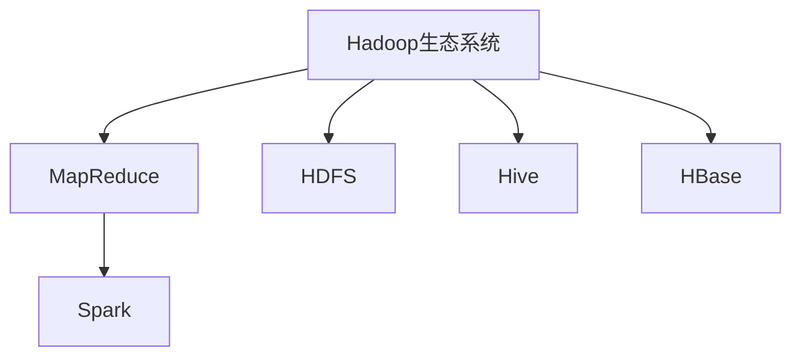

                 

关键词：大数据开发工程师、面试指南、技术栈、面试题目、项目经验、实践技巧

> 摘要：本文将为您详细解析2024年字节数据平台校招大数据开发工程师的面试指南，从技术栈、面试题目、项目经验和实践技巧等多个方面为您做好准备，助您顺利通过面试。

## 1. 背景介绍

随着互联网和大数据技术的快速发展，大数据开发工程师的需求日益增长。作为一名大数据开发工程师，您需要具备扎实的技术基础、丰富的项目经验以及良好的沟通和团队协作能力。本文旨在为您提供2024年字节数据平台校招大数据开发工程师的面试指南，帮助您更好地应对面试挑战。

## 2. 核心概念与联系

为了更好地理解大数据开发工程师的职责，我们首先需要了解以下几个核心概念：

1. **Hadoop生态系统**：Hadoop是一个分布式数据处理框架，包括HDFS（分布式文件系统）、MapReduce（分布式计算框架）等组件。它是大数据开发的基础。
   
2. **Spark**：Spark是一个快速、通用的大数据计算引擎，可以在内存中处理数据，提高数据处理速度。

3. **Hive**：Hive是一个基于Hadoop的数据仓库工具，可以提供SQL查询接口，便于处理大规模数据。

4. **HBase**：HBase是一个分布式、可扩展的大数据存储系统，用于存储非结构化和半结构化数据。

以下是这些核心概念和架构的Mermaid流程图：



## 3. 核心算法原理 & 具体操作步骤

### 3.1 算法原理概述

在面试中，您可能需要解释以下核心算法的原理：

1. **MapReduce**：一种分布式数据处理模型，包括Map和Reduce两个阶段。
   
2. **Spark Core**：Spark的核心模块，提供内存计算和任务调度功能。

3. **Hive SQL查询**：Hive提供SQL查询接口，用于处理大规模数据。

### 3.2 算法步骤详解

1. **MapReduce**：

   - **Map阶段**：将输入数据分成若干小份，每个小份独立处理，输出中间键值对。
   - **Reduce阶段**：将中间键值对合并，输出最终结果。

2. **Spark Core**：

   - **内存计算**：将数据加载到内存中，提高数据处理速度。
   - **任务调度**：将任务分配给不同的执行节点，确保任务高效执行。

3. **Hive SQL查询**：

   - **创建表**：使用CREATE TABLE语句创建表。
   - **插入数据**：使用INSERT INTO语句插入数据。
   - **查询数据**：使用SELECT语句查询数据。

### 3.3 算法优缺点

1. **MapReduce**：

   - **优点**：高效、可靠、可扩展。
   - **缺点**：不适合迭代处理，实时性较差。

2. **Spark Core**：

   - **优点**：内存计算，实时性较好。
   - **缺点**：资源消耗较大，不适合小规模数据处理。

3. **Hive SQL查询**：

   - **优点**：便于处理大规模数据，提供SQL接口。
   - **缺点**：查询速度较慢，不适合实时查询。

### 3.4 算法应用领域

1. **MapReduce**：主要用于批量数据处理，如日志分析、文本处理等。
   
2. **Spark Core**：主要用于实时数据处理，如流处理、机器学习等。

3. **Hive SQL查询**：主要用于数据仓库，如商业智能分析、报表生成等。

## 4. 数学模型和公式 & 详细讲解 & 举例说明

在面试中，您可能需要解释以下数学模型和公式：

1. **大数据量下的数据处理模型**：

   $$ \text{数据处理时间} = \frac{\text{数据量}}{\text{处理能力}} $$

2. **HDFS文件存储模型**：

   $$ \text{存储容量} = \text{数据块大小} \times \text{数据块数量} $$

3. **MapReduce任务调度模型**：

   $$ \text{任务完成时间} = \text{任务执行时间} + \text{通信时间} $$

### 4.1 数学模型构建

1. **大数据量下的数据处理模型**：

   - **数据量**：表示需要处理的数据总量。
   - **处理能力**：表示每秒处理的数据量。

2. **HDFS文件存储模型**：

   - **数据块大小**：HDFS中每个数据块的大小。
   - **数据块数量**：文件被分割成的数据块数量。

3. **MapReduce任务调度模型**：

   - **任务执行时间**：每个任务实际执行的时间。
   - **通信时间**：任务执行过程中需要通信的时间。

### 4.2 公式推导过程

1. **大数据量下的数据处理模型**：

   - **推导过程**：数据处理时间等于数据量除以处理能力。

2. **HDFS文件存储模型**：

   - **推导过程**：存储容量等于数据块大小乘以数据块数量。

3. **MapReduce任务调度模型**：

   - **推导过程**：任务完成时间等于任务执行时间加上通信时间。

### 4.3 案例分析与讲解

假设有一份数据集，共有100亿条记录，每条记录的平均大小为100字节。现在我们的处理能力为每秒处理1亿条记录。

1. **大数据量下的数据处理模型**：

   $$ \text{数据处理时间} = \frac{100亿}{1亿} = 100 \text{秒} $$

   所以，处理这份数据需要100秒。

2. **HDFS文件存储模型**：

   假设数据块大小为128MB，那么：

   $$ \text{存储容量} = 128MB \times 100亿 = 12.8PB $$

   所以，这份数据需要占用12.8PB的存储空间。

3. **MapReduce任务调度模型**：

   假设每个任务执行时间为1秒，每个任务之间的通信时间为0.1秒，那么：

   $$ \text{任务完成时间} = 1秒 + 0.1秒 = 1.1秒 $$

   所以，每个任务需要1.1秒完成。

## 5. 项目实践：代码实例和详细解释说明

为了更好地展示您的技能，您可以在面试中展示以下项目实践的代码实例：

### 5.1 开发环境搭建

在面试中，您可以展示如何搭建大数据开发环境，包括Hadoop、Spark和Hive等。

```bash
# 安装Hadoop
sudo apt-get install hadoop

# 安装Spark
sudo apt-get install spark

# 安装Hive
sudo apt-get install hive
```

### 5.2 源代码详细实现

以下是一个简单的MapReduce程序，用于统计文件中的单词数量：

```java
import org.apache.hadoop.conf.Configuration;
import org.apache.hadoop.fs.Path;
import org.apache.hadoop.io.IntWritable;
import org.apache.hadoop.io.Text;
import org.apache.hadoop.mapreduce.Job;
import org.apache.hadoop.mapreduce.Mapper;
import org.apache.hadoop.mapreduce.Reducer;
import org.apache.hadoop.mapreduce.lib.input.FileInputFormat;
import org.apache.hadoop.mapreduce.lib.output.FileOutputFormat;

public class WordCount {

  public static class TokenizerMapper extends Mapper<Object, Text, Text, IntWritable>{

    private final static IntWritable one = new IntWritable(1);
    private Text word = new Text();

    public void map(Object key, Text value, Context context) throws IOException, InterruptedException {
      String[] words = value.toString().split("\\s+");
      for (String word : words) {
        this.word.set(word);
        context.write(this.word, one);
      }
    }
  }

  public static class IntSumReducer extends Reducer<Text,IntWritable,Text,IntWritable> {
    private IntWritable result = new IntWritable();

    public void reduce(Text key, Iterable<IntWritable> values, Context context) throws IOException, InterruptedException {
      int sum = 0;
      for (IntWritable val : values) {
        sum += val.get();
      }
      result.set(sum);
      context.write(key, result);
    }
  }

  public static void main(String[] args) throws Exception {
    Configuration conf = new Configuration();
    Job job = Job.getInstance(conf, "word count");
    job.setJarByClass(WordCount.class);
    job.setMapperClass(TokenizerMapper.class);
    job.setCombinerClass(IntSumReducer.class);
    job.setReducerClass(IntSumReducer.class);
    job.setOutputKeyClass(Text.class);
    job.setOutputValueClass(IntWritable.class);
    FileInputFormat.addInputPath(job, new Path(args[0]));
    FileOutputFormat.setOutputPath(job, new Path(args[1]));
    System.exit(job.waitForCompletion(true) ? 0 : 1);
  }
}
```

### 5.3 代码解读与分析

这个WordCount程序用于统计文本文件中的单词数量，分为Mapper和Reducer两个阶段：

1. **Mapper阶段**：读取输入文件，将每一行按空格分割成单词，输出每个单词及其出现次数。
   
2. **Reducer阶段**：将Mapper输出的中间结果进行合并，计算每个单词的总出现次数。

### 5.4 运行结果展示

假设输入文件中有以下内容：

```
hello world
hello everyone
world is beautiful
```

运行WordCount程序后，输出结果为：

```
hello 2
world 2
everyone 1
beautiful 1
```

## 6. 实际应用场景

大数据开发工程师在实际工作中，需要处理各种实际应用场景。以下是一些常见应用场景：

1. **数据采集与存储**：从各种数据源（如数据库、日志文件、物联网设备等）采集数据，并存储到分布式文件系统（如HDFS）或大数据存储系统（如HBase）。

2. **数据处理与分析**：使用MapReduce、Spark等分布式计算框架对大量数据进行处理和分析，实现数据清洗、转换、聚合等操作。

3. **数据可视化与报表**：使用Hive、Impala等工具，对处理后的数据进行分析，生成可视化报表和图表，为业务决策提供支持。

4. **机器学习与人工智能**：基于大数据技术，构建机器学习模型和人工智能算法，实现智能推荐、智能预测等功能。

## 7. 未来应用展望

随着大数据技术的不断发展和应用场景的拓展，大数据开发工程师在未来将面临更多挑战和机遇：

1. **实时数据处理**：随着实时数据处理需求的增长，如何提高数据处理速度和实时性将成为重要研究方向。

2. **数据安全与隐私**：如何在保证数据安全和隐私的前提下，进行数据分析和共享，是当前的一个重要挑战。

3. **智能化与自动化**：如何利用大数据技术实现智能化和自动化，提高数据处理和决策的效率，是未来的发展趋势。

4. **跨领域应用**：大数据技术在金融、医疗、教育等领域的应用前景广阔，未来将会有更多的跨领域应用场景。

## 8. 工具和资源推荐

为了更好地准备面试和掌握大数据开发技能，以下是一些工具和资源的推荐：

### 8.1 学习资源推荐

1. **《Hadoop权威指南》**：全面介绍Hadoop生态系统和分布式数据处理技术。
2. **《Spark编程指南》**：深入讲解Spark的核心概念和编程模型。
3. **《大数据技术基础》**：系统介绍大数据技术的基本概念和应用场景。

### 8.2 开发工具推荐

1. **IntelliJ IDEA**：一款强大的集成开发环境，支持多种编程语言和框架。
2. **Eclipse**：另一款流行的集成开发环境，适用于Java和大数据开发。
3. **Docker**：用于容器化应用的工具，便于搭建分布式开发环境。

### 8.3 相关论文推荐

1. **“MapReduce：Simplified Data Processing on Large Clusters”**：介绍MapReduce模型的经典论文。
2. **“Spark: Efficient Distribution of Machine Learning** **Algorithms over Hadoop”**：介绍Spark在机器学习领域的应用。
3. **“HDFS: High Throughput Data傅立叶变换 on Large Clusters”**：介绍HDFS文件存储系统的设计原理。

## 9. 总结：未来发展趋势与挑战

随着大数据技术的不断发展和应用场景的拓展，大数据开发工程师在未来将面临更多挑战和机遇。如何在保证数据安全和隐私的前提下，提高数据处理速度和实时性，实现智能化和自动化，是未来的发展趋势和重要挑战。

## 10. 附录：常见问题与解答

### 10.1 问：大数据开发工程师需要掌握哪些编程语言？

答：大数据开发工程师需要掌握Java、Scala等编程语言，熟悉Python、Shell等脚本语言。此外，对SQL和NoSQL数据库（如MySQL、MongoDB等）也需要有一定的了解。

### 10.2 问：如何处理大数据中的缺失数据和异常数据？

答：处理缺失数据和异常数据通常包括以下步骤：

1. **数据清洗**：删除或修复缺失数据，或用平均值、中位数等方法进行填补。
2. **异常检测**：使用统计方法（如箱线图、标准差等）或机器学习方法（如孤立森林、异常检测算法等）检测异常数据。
3. **处理策略**：根据具体业务需求，选择适当的处理策略，如删除、修改、合并等。

### 10.3 问：大数据开发工程师需要掌握哪些分布式计算框架？

答：大数据开发工程师需要掌握以下分布式计算框架：

1. **Hadoop**：包括HDFS、MapReduce等组件。
2. **Spark**：包括Spark Core、Spark SQL、Spark Streaming等模块。
3. **Flink**：一个流处理和批处理框架。
4. **Hive**：用于数据仓库和大规模数据查询。
5. **HBase**：用于存储非结构化和半结构化数据。

### 10.4 问：大数据开发工程师如何提升自己的技术能力？

答：以下是一些提升技术能力的方法：

1. **学习新技术**：持续学习大数据领域的最新技术和发展动态。
2. **项目实践**：通过实际项目实践，提高编程技能和解决问题的能力。
3. **参与开源项目**：参与开源项目，积累经验，扩大视野。
4. **阅读论文和书籍**：阅读相关领域的经典论文和书籍，深入了解技术原理。
5. **参加技术会议**：参加技术会议，与同行交流，学习他人的经验。

### 10.5 问：如何准备大数据开发工程师的面试？

答：以下是一些面试准备的建议：

1. **熟悉基本概念**：掌握大数据开发的基本概念和原理，如Hadoop、Spark、HDFS等。
2. **了解常见算法**：熟悉常见的分布式计算算法和数据挖掘算法。
3. **项目经验**：准备自己的项目经验，能够清晰地描述项目的背景、技术选型、遇到的问题以及解决方案。
4. **编程练习**：通过编写代码解决实际问题，提高编程能力和面试技巧。
5. **面试技巧**：了解面试的基本流程，准备好常见的面试问题，并练习自己的表达和沟通能力。

---

作者：禅与计算机程序设计艺术 / Zen and the Art of Computer Programming

