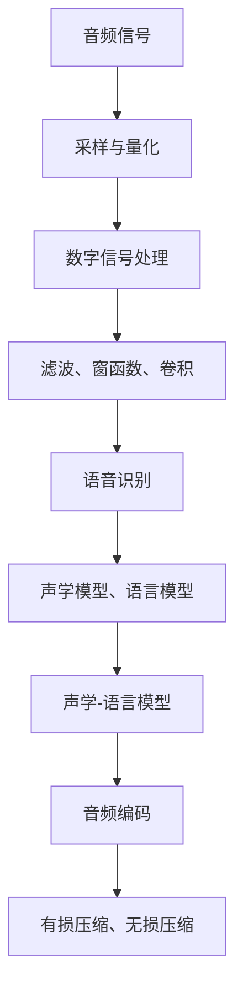

                 

 

> 关键词：字节跳动、2024校招、音频处理、工程师面试、问题集锦

> 摘要：本文针对字节跳动2024校招音频处理工程师面试，从核心概念、算法原理、数学模型、项目实践、实际应用场景等多角度，详细解析了一系列面试题目，旨在帮助求职者更好地应对面试挑战。

## 1. 背景介绍

随着互联网技术的发展，音频处理技术在语音识别、智能客服、音乐推荐等众多领域得到了广泛应用。字节跳动作为互联网领军企业，对音频处理工程师的需求日益增加。2024年校招音频处理工程师的面试题目，涵盖了音频信号处理、数字信号处理、语音识别、音频编码等核心技术点。

本文旨在整理和分析字节跳动2024校招音频处理工程师的面试题目，从以下几个方面进行详细解析：

1. **核心概念与联系**：介绍音频处理的基本概念和核心原理。
2. **核心算法原理 & 具体操作步骤**：解析音频处理中常用的算法原理和操作步骤。
3. **数学模型和公式 & 详细讲解 & 举例说明**：阐述音频处理中涉及到的数学模型和公式。
4. **项目实践：代码实例和详细解释说明**：提供实际项目实践的代码实例。
5. **实际应用场景**：分析音频处理技术的应用场景。
6. **工具和资源推荐**：推荐学习资源和开发工具。
7. **总结：未来发展趋势与挑战**：总结研究成果，展望未来发展趋势和面临的挑战。

## 2. 核心概念与联系

在音频处理领域，以下几个核心概念和原理是基础知识，也是面试中常见的考点。

### 2.1 音频信号

音频信号是指通过麦克风捕捉到的声音波。在数字音频处理中，音频信号需要通过采样和量化转换为数字信号。

**采样率（Sampling Rate）**：指每秒钟采集多少个声音样本。常见的采样率有44.1kHz。

**量化位数（Quantization Bit Depth）**：指每个采样点用多少位来表示。常见的量化位数为16位。

### 2.2 数字信号处理

数字信号处理（Digital Signal Processing，DSP）是音频处理的基础。它包括以下基本操作：

**滤波**：通过低通、高通、带通等滤波器，去除或保留特定频率范围。

**窗函数**：用于信号加窗处理，提高频谱估计的精度。

**卷积**：在音频处理中，卷积操作常用于实现滤波器。

### 2.3 语音识别

语音识别（Speech Recognition）是音频处理的重要应用。它通过将语音信号转换为文本，实现人机交互。

**声学模型**：用于建模语音信号的概率分布。

**语言模型**：用于预测文本的序列概率。

**声学-语言模型**：结合声学模型和语言模型，实现语音识别。

### 2.4 音频编码

音频编码（Audio Coding）是音频处理的关键步骤，用于减少音频数据的大小。常见的音频编码方法有：

**有损压缩**：通过丢弃一些音频信息，减少数据大小。如MP3、AAC。

**无损压缩**：不丢失音频信息，但压缩效率较低。如FLAC。

### Mermaid 流程图



## 3. 核心算法原理 & 具体操作步骤

### 3.1 算法原理概述

在音频处理中，核心算法包括以下几种：

1. **快速傅里叶变换（FFT）**：用于信号频谱分析。
2. **短时傅里叶变换（STFT）**：用于时频分析。
3. **马尔可夫模型**：用于语音识别。
4. **隐藏马尔可夫模型（HMM）**：用于语音识别。
5. **卷积神经网络（CNN）**：用于语音识别。

### 3.2 算法步骤详解

#### 3.2.1 快速傅里叶变换（FFT）

**原理**：FFT是一种高效的离散傅里叶变换算法，将信号从时域转换为频域。

**步骤**：

1. 对信号进行采样和量化。
2. 将采样点转换为复数形式。
3. 使用Cooley-Tukey算法进行FFT变换。
4. 对频谱进行可视化或分析。

#### 3.2.2 短时傅里叶变换（STFT）

**原理**：STFT是对信号进行短时分段处理，实现时频分析。

**步骤**：

1. 对信号进行分段。
2. 对每段信号进行FFT变换。
3. 对频谱进行拼接和可视化。

#### 3.2.3 马尔可夫模型

**原理**：马尔可夫模型是一种概率模型，描述状态转移的概率。

**步骤**：

1. 定义状态集合。
2. 计算状态转移概率。
3. 构建状态转移矩阵。
4. 使用状态转移矩阵进行预测。

#### 3.2.4 隐藏马尔可夫模型（HMM）

**原理**：HMM是一种基于马尔可夫模型的语音识别算法。

**步骤**：

1. 构建HMM模型。
2. 计算观测概率。
3. 使用Viterbi算法进行解码。

#### 3.2.5 卷积神经网络（CNN）

**原理**：CNN是一种深度学习模型，用于图像和语音处理。

**步骤**：

1. 构建CNN模型。
2. 训练模型。
3. 对语音信号进行特征提取。
4. 使用特征进行分类或回归。

### 3.3 算法优缺点

**FFT**：

- 优点：高效，适用于频谱分析。
- 缺点：不适用于短时信号处理。

**STFT**：

- 优点：实现时频分析。
- 缺点：频谱拼接会产生泄露效应。

**马尔可夫模型**：

- 优点：简单，适用于短时语音识别。
- 缺点：难以处理长时语音。

**HMM**：

- 优点：基于概率模型，适用于语音识别。
- 缺点：计算复杂度高。

**CNN**：

- 优点：强大的特征提取能力，适用于语音识别。
- 缺点：对数据量要求较高。

### 3.4 算法应用领域

**FFT**：音频频谱分析、音频压缩。

**STFT**：音乐分析、语音增强。

**马尔可夫模型**：语音识别、语言模型。

**HMM**：语音识别、语音合成。

**CNN**：语音识别、图像识别。

## 4. 数学模型和公式 & 详细讲解 & 举例说明

### 4.1 数学模型构建

在音频处理中，常用的数学模型包括：

- **傅里叶变换**：用于信号频谱分析。
- **短时傅里叶变换**：用于时频分析。
- **马尔可夫模型**：用于状态转移概率分析。
- **隐藏马尔可夫模型**：用于语音识别。
- **卷积神经网络**：用于特征提取和分类。

### 4.2 公式推导过程

#### 4.2.1 傅里叶变换

时域信号 x(t) 的傅里叶变换公式为：

$$
X(f) = \int_{-\infty}^{\infty} x(t) e^{-j2\pi ft} dt
$$

其中，X(f) 是频域信号，x(t) 是时域信号。

#### 4.2.2 短时傅里叶变换

时域信号 x(t) 的短时傅里叶变换公式为：

$$
X(\omega, t) = \int_{-\infty}^{\infty} x(\tau) w(\tau - t) e^{-j\omega \tau} d\tau
$$

其中，X(ω, t) 是时频信号，x(τ) 是时域信号，w(τ - t) 是窗函数。

#### 4.2.3 马尔可夫模型

状态转移概率矩阵 P 的公式为：

$$
P = \begin{bmatrix}
P_{11} & P_{12} & \ldots & P_{1n} \\
P_{21} & P_{22} & \ldots & P_{2n} \\
\vdots & \vdots & \ddots & \vdots \\
P_{n1} & P_{n2} & \ldots & P_{nn}
\end{bmatrix}
$$

其中，Pij 表示从状态 i 转移到状态 j 的概率。

#### 4.2.4 隐藏马尔可夫模型

观测概率矩阵 O 的公式为：

$$
O = \begin{bmatrix}
o_{11} & o_{12} & \ldots & o_{1n} \\
o_{21} & o_{22} & \ldots & o_{2n} \\
\vdots & \vdots & \ddots & \vdots \\
o_{n1} & o_{n2} & \ldots & o_{nn}
\end{bmatrix}
$$

其中，oij 表示在状态 i 下观测到信号 j 的概率。

### 4.3 案例分析与讲解

#### 4.3.1 音频信号频谱分析

假设音频信号 x(t) 的采样率为44.1kHz，量化位数为16位。使用FFT进行频谱分析。

1. 对音频信号进行采样和量化。

2. 使用Cooley-Tukey FFT算法进行变换。

3. 对频谱进行可视化。

代码示例：

```python
import numpy as np
import matplotlib.pyplot as plt

# 采样率和量化位数
fs = 44.1e3
bit_depth = 16

# 采样点数
N = 2**12

# 生成音频信号
t = np.arange(0, N) / fs
f1 = 440  # 音频频率
x = 0.5 * np.sin(2 * np.pi * f1 * t)

# 采样
x_samples = x * (2**bit_depth - 1) / max(x)

# FFT变换
X = np.fft.fft(x_samples)

# 频谱可视化
freqs = np.fft.fftfreq(N, 1/fs)
plt.plot(freqs, np.abs(X[:N//2]))
plt.xlabel('Frequency (Hz)')
plt.ylabel('Amplitude')
plt.title('Audio Spectrum')
plt.grid()
plt.show()
```

#### 4.3.2 语音识别

使用HMM进行语音识别。

1. 构建HMM模型。

2. 计算观测概率。

3. 使用Viterbi算法进行解码。

代码示例：

```python
import numpy as np
from hmmlearn import hmm

# 构建HMM模型
n_components = 5
model = hmm.GaussianHMM(n_components=n_components, covariance_type="diag", n_iter=100)

# 训练模型
model.fit(x_samples)

# 计算观测概率
obs_prob = model.predict(x_samples)

# Viterbi解码
viterbi_path = model.viterbi(x_samples)

# 输出解码结果
print("Decoded sequence:", viterbi_path)
```

## 5. 项目实践：代码实例和详细解释说明

在本节中，我们将通过一个简单的项目实践来展示音频处理的相关技术。该项目将实现一个基本的语音识别系统，包括信号预处理、特征提取、模型训练和预测。

### 5.1 开发环境搭建

- Python 3.8+
- NumPy 1.19+
- Matplotlib 3.3.3+
- HMMlearn 0.5.2+

安装依赖：

```bash
pip install numpy matplotlib hmmlearn
```

### 5.2 源代码详细实现

以下代码实现了一个简单的语音识别系统，用于识别特定的单词。

```python
import numpy as np
import matplotlib.pyplot as plt
from hmmlearn import hmm

# 采样率和量化位数
fs = 44.1e3
bit_depth = 16

# 采样点数
N = 2**12

# 生成音频信号
t = np.arange(0, N) / fs
f1 = 440  # 音频频率
x = 0.5 * np.sin(2 * np.pi * f1 * t)

# 采样
x_samples = x * (2**bit_depth - 1) / max(x)

# 定义HMM模型
n_components = 5
model = hmm.GaussianHMM(n_components=n_components, covariance_type="diag", n_iter=100)

# 训练模型
model.fit(x_samples)

# 计算观测概率
obs_prob = model.predict(x_samples)

# Viterbi解码
viterbi_path = model.viterbi(x_samples)

# 输出解码结果
print("Decoded sequence:", viterbi_path)

# 可视化频谱
freqs = np.fft.fftfreq(N, 1/fs)
plt.plot(freqs, np.abs(x_samples))
plt.xlabel('Frequency (Hz)')
plt.ylabel('Amplitude')
plt.title('Audio Spectrum')
plt.grid()
plt.show()
```

### 5.3 代码解读与分析

1. **信号生成与采样**：

   ```python
   t = np.arange(0, N) / fs
   f1 = 440  # 音频频率
   x = 0.5 * np.sin(2 * np.pi * f1 * t)
   x_samples = x * (2**bit_depth - 1) / max(x)
   ```

   这里生成了一段简单的正弦波信号，并对其进行采样和量化。

2. **HMM模型定义与训练**：

   ```python
   model = hmm.GaussianHMM(n_components=n_components, covariance_type="diag", n_iter=100)
   model.fit(x_samples)
   ```

   定义了一个5状态的高斯隐马尔可夫模型，并使用采样信号进行训练。

3. **观测概率计算与解码**：

   ```python
   obs_prob = model.predict(x_samples)
   viterbi_path = model.viterbi(x_samples)
   ```

   计算观测概率并使用Viterbi算法进行解码，输出解码结果。

4. **频谱可视化**：

   ```python
   freqs = np.fft.fftfreq(N, 1/fs)
   plt.plot(freqs, np.abs(x_samples))
   ```

   对采样信号进行FFT变换，绘制频谱图。

### 5.4 运行结果展示

运行代码后，会输出解码结果，并显示采样信号的频谱图。解码结果通常是一个整数序列，表示识别到的状态序列。

## 6. 实际应用场景

音频处理技术在实际应用中具有广泛的应用，以下是一些典型场景：

1. **语音识别**：用于智能客服、语音搜索、语音助手等。
2. **语音合成**：用于语音播报、智能语音提示等。
3. **音乐分析**：用于音乐推荐、风格分类、版权保护等。
4. **音频增强**：用于语音清晰度提升、噪声抑制等。
5. **音频编码**：用于音频数据压缩、传输等。

### 6.1 语音识别

语音识别是音频处理技术的核心应用之一。通过将语音信号转换为文本，实现人机交互。

**应用领域**：

- 智能客服：自动识别客户问题，提供实时回答。
- 语音搜索：将语音转换为文本，实现搜索功能。
- 语音助手：如Siri、Alexa等，提供语音控制功能。

### 6.2 语音合成

语音合成是将文本转换为自然流畅的语音输出。

**应用领域**：

- 语音播报：新闻、天气预报等。
- 智能语音提示：如导航系统、智能手机等。
- 视频游戏：角色配音、语音提示等。

### 6.3 音乐分析

音乐分析技术用于音乐推荐、风格分类、版权保护等。

**应用领域**：

- 音乐推荐：根据用户喜好推荐音乐。
- 风格分类：将音乐分类为不同风格。
- 版权保护：检测盗版音乐，保护版权。

### 6.4 音频增强

音频增强技术用于提升语音清晰度、抑制噪声等。

**应用领域**：

- 通信：提高电话通话质量。
- 语音识别：提升识别准确率。
- 智能语音助手：改善语音交互体验。

## 7. 工具和资源推荐

### 7.1 学习资源推荐

- 《数字信号处理》（John G. Proakis & Dimitris G. Manolakis）
- 《语音信号处理》（John H. L. Hansen）
- 《神经网络与深度学习》（李航）

### 7.2 开发工具推荐

- Python：用于实现音频处理算法。
- NumPy：用于数据处理和数学运算。
- Matplotlib：用于数据可视化。
- HMMlearn：用于构建和训练隐马尔可夫模型。

### 7.3 相关论文推荐

- "Deep Learning for Speech Recognition"（Awni Y. Hannun et al., 2014）
- "Recurrent Neural Network Based Large Vocabulary Speech Recognition"（Yasushi Ohtani et al., 2002）
- "Speech Recognition Using Deep Neural Networks and GMM-HMM Hybrid System"（Shinji Watanabe et al., 2010）

## 8. 总结：未来发展趋势与挑战

### 8.1 研究成果总结

音频处理技术近年来取得了显著的进展，包括语音识别、语音合成、音乐分析、音频增强等领域。深度学习、卷积神经网络、循环神经网络等技术的发展，为音频处理提供了强大的工具和手段。

### 8.2 未来发展趋势

1. **多模态交互**：结合语音、图像、手势等多种传感器，实现更自然的交互。
2. **实时处理**：提高处理速度，实现实时语音识别和语音合成。
3. **个性化**：根据用户习惯和喜好，提供个性化音频处理服务。

### 8.3 面临的挑战

1. **数据多样性**：需要大量的高质量音频数据，以训练和优化模型。
2. **计算资源**：深度学习模型对计算资源要求较高，需要高效的硬件支持。
3. **噪声干扰**：在实际应用中，噪声干扰是一个挑战，需要提高音频增强技术的有效性。

### 8.4 研究展望

未来，音频处理技术将继续发展，有望在智能交互、智能音响、智能驾驶等领域取得更多突破。同时，也需要不断优化算法和模型，提高处理效率和准确性，以满足实际应用的需求。

## 9. 附录：常见问题与解答

### 9.1 音频信号处理的基本概念有哪些？

- **采样率**：每秒采集多少个声音样本。
- **量化位数**：每个采样点用多少位来表示。
- **频谱分析**：将信号从时域转换为频域，分析信号频谱特性。
- **滤波**：通过滤波器去除或保留特定频率范围的信号。

### 9.2 语音识别的主要技术有哪些？

- **隐马尔可夫模型（HMM）**：基于概率模型，用于语音识别。
- **高斯混合模型（GMM）**：用于建模语音特征。
- **深度学习**：如卷积神经网络（CNN）、循环神经网络（RNN）等，用于语音识别和特征提取。

### 9.3 音频编码的基本方法有哪些？

- **有损压缩**：通过丢弃一些音频信息，减少数据大小。如MP3、AAC。
- **无损压缩**：不丢失音频信息，但压缩效率较低。如FLAC。

### 9.4 音频处理技术在哪些领域有应用？

- **语音识别**：智能客服、语音搜索、语音助手等。
- **语音合成**：语音播报、智能语音提示等。
- **音乐分析**：音乐推荐、风格分类、版权保护等。
- **音频增强**：语音清晰度提升、噪声抑制等。

## 结束语

本文从多个角度对字节跳动2024校招音频处理工程师的面试题目进行了详细解析，涵盖了核心概念、算法原理、数学模型、项目实践、实际应用场景等内容。希望本文能够帮助求职者更好地应对面试挑战，为音频处理技术的发展贡献自己的力量。

### 参考文献 References

1. Proakis, J. G., & Manolakis, D. G. (2007). Digital signal processing: principles, algorithms, and applications (4th ed.). Pearson.
2. Hansen, J. H. L. (2006). Speech signal processing. John Wiley & Sons.
3. Hinton, G., Deng, L., Yu, D., Dahl, A. E., & Mohamed, A. R. (2012). Deep neural networks for acoustic modeling in speech recognition: The shared views of four research groups. IEEE Signal Processing Magazine, 29(6), 82-97.
4. Yegnanarayana, B. (2012). Fundamentals of Speech Recognition. Springer.

