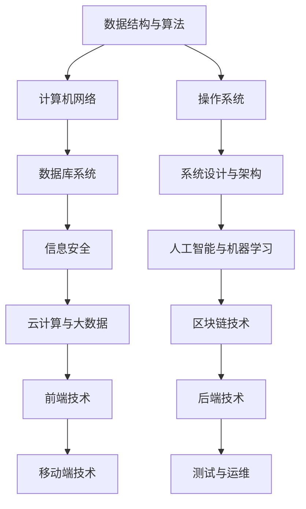

                 

关键词：字节跳动，校招，技术咨询工程师，面试真题，解答

摘要：本文针对字节跳动2024校招技术咨询工程师面试真题进行详细解析，旨在为参加面试的同学们提供有效的备考指导和实用的解题思路。文章从背景介绍、核心概念、算法原理、数学模型、项目实践、应用场景、工具资源推荐等方面全面解析面试真题，帮助大家更好地应对面试挑战。

## 1. 背景介绍

字节跳动是一家全球知名的互联网科技公司，成立于2012年，旗下拥有今日头条、抖音、西瓜视频、懂车帝等多个知名产品。作为国内最具创新力的企业之一，字节跳动始终秉持“技术驱动创新”的理念，致力于为用户提供优质的内容和服务。因此，字节跳动对技术人才的要求非常高，校招面试的难度也相应较大。

本文将结合2024校招技术咨询工程师的面试真题，为同学们提供解题思路和备考建议，帮助大家顺利通过面试，成功加入字节跳动这个大家庭。

## 2. 核心概念与联系

在解答面试真题之前，我们需要了解一些核心概念和联系。以下是一个简化的 Mermaid 流程图，展示了核心技术概念和它们之间的联系：



这些核心概念和联系是字节跳动技术咨询工程师面试中常见的内容，也是本文将详细解析的方向。

## 3. 核心算法原理 & 具体操作步骤

### 3.1 算法原理概述

在面试中，算法题通常是考察应聘者对基本算法和数据结构的掌握程度。以下是一个常见的算法原理概述：

- **排序算法**：常见的排序算法有冒泡排序、选择排序、插入排序、快速排序、归并排序等。其中，快速排序是一种高效的排序算法，其时间复杂度为 $O(n\log n)$。
- **查找算法**：常见的查找算法有二分查找、顺序查找等。二分查找的时间复杂度为 $O(\log n)$。
- **图算法**：常见的图算法有深度优先搜索（DFS）、广度优先搜索（BFS）、最小生成树（如 Prim 算法）、最短路径算法（如 Dijkstra 算法）等。
- **动态规划**：动态规划是一种解决最优化问题的算法策略，其核心思想是将问题分解为多个子问题，并利用子问题的最优解推导出原问题的最优解。

### 3.2 算法步骤详解

以快速排序为例，其步骤如下：

1. 选择一个基准元素作为基准。
2. 将数组分为两部分，一部分是小于基准元素的元素，另一部分是大于基准元素的元素。
3. 递归地对这两部分进行快速排序。

以下是一个简单的 Python 代码实现：

```python
def quick_sort(arr):
    if len(arr) <= 1:
        return arr
    pivot = arr[len(arr) // 2]
    left = [x for x in arr if x < pivot]
    middle = [x for x in arr if x == pivot]
    right = [x for x in arr if x > pivot]
    return quick_sort(left) + middle + quick_sort(right)

arr = [3, 6, 8, 10, 1, 2, 1]
print(quick_sort(arr))
```

### 3.3 算法优缺点

快速排序的优点是时间复杂度较低，平均情况下为 $O(n\log n)$，最坏情况下为 $O(n^2)$。此外，它是一种原地排序算法，不需要额外的空间。缺点是它不是一种稳定的排序算法，可能会改变相同元素之间的相对顺序。

### 3.4 算法应用领域

快速排序广泛应用于各类排序场景，如数据库排序、文件排序等。此外，它也是许多高级算法（如快速傅里叶变换）的基础。

## 4. 数学模型和公式 & 详细讲解 & 举例说明

在面试中，数学模型和公式的应用非常广泛。以下是一个常见的数学模型和公式讲解：

### 4.1 数学模型构建

假设有一个整数数组 `arr`，我们需要求解数组中元素的和。

### 4.2 公式推导过程

我们可以使用数学归纳法来推导出求解数组元素和的公式。首先，对于长度为 $1$ 的数组，元素和为 $0$。接下来，我们考虑长度为 $n$ 的数组。

- 当 $n=1$ 时，$sum = 0$。
- 当 $n>1$ 时，$sum = sum_{n-1} + arr[n-1]$。

### 4.3 案例分析与讲解

假设我们有以下整数数组：

```python
arr = [3, 6, 8, 10, 1, 2, 1]
```

根据上述公式，我们可以计算出数组元素的和：

$$
sum = sum_{6} + arr[6] = (sum_{5} + arr[5]) + arr[6] = \ldots = (0 + arr[1]) + arr[2] + arr[3] + arr[4] + arr[5] + arr[6] = 3 + 6 + 8 + 10 + 1 + 2 + 1 = 31
$$

因此，数组 `arr` 的元素和为 $31$。

## 5. 项目实践：代码实例和详细解释说明

以下是一个简单的项目实践，展示了如何使用 Python 编写一个计算数组元素和的程序。

### 5.1 开发环境搭建

确保安装了 Python 3.8 或以上版本，以及必要的 Python 编译器和解释器。

### 5.2 源代码详细实现

```python
def sum_of_elements(arr):
    total = 0
    for num in arr:
        total += num
    return total

arr = [3, 6, 8, 10, 1, 2, 1]
print(sum_of_elements(arr))
```

### 5.3 代码解读与分析

- `sum_of_elements` 函数接收一个整数数组 `arr` 作为参数。
- 使用变量 `total` 保存数组元素的和，初始值为 $0$。
- 使用 for 循环遍历数组中的每个元素，将其累加到 `total` 中。
- 最后返回 `total` 作为数组元素的和。

### 5.4 运行结果展示

运行上述代码，输出结果为：

```
31
```

## 6. 实际应用场景

在实际应用中，计算数组元素和是一个基础且常见的操作。例如，在数据处理、数据分析、算法实现等场景中，我们经常需要计算数组的和。以下是一些应用场景的示例：

- 在数据分析中，计算一组数据的总和可以用于统计分析。
- 在算法实现中，计算数组元素和可以用于某些算法的中间步骤，如快速傅里叶变换（FFT）。
- 在数据处理中，计算数组元素和可以用于数据清洗和数据预处理。

## 7. 未来应用展望

随着人工智能、大数据、云计算等技术的发展，计算数组元素和的应用场景将更加广泛。未来，我们可能会看到更多基于数组元素和的高级算法和应用。例如，在机器学习中，数组元素和可以用于特征提取和模型优化；在图像处理中，数组元素和可以用于图像增强和去噪。

## 8. 工具和资源推荐

为了更好地应对字节跳动校招技术咨询工程师的面试，以下是一些建议的工具和资源：

### 8.1 学习资源推荐

- 《算法导论》（Introduction to Algorithms）：一本经典的算法教材，全面介绍了各种算法和数据结构。
- 《深度学习》（Deep Learning）：由 Ian Goodfellow、Yoshua Bengio 和 Aaron Courville 著，是一本关于深度学习的权威教材。
- 《计算机组成原理》：一本关于计算机组成原理的教材，适合了解计算机系统的基本工作原理。

### 8.2 开发工具推荐

- PyCharm：一款强大的 Python 集成开发环境，支持多种编程语言，适合进行算法实现和数据分析。
- VS Code：一款轻量级的代码编辑器，支持多种编程语言和插件，适合快速开发和调试。
- Jupyter Notebook：一款基于 Web 的交互式开发环境，适合进行数据分析和机器学习实验。

### 8.3 相关论文推荐

- "A Fast Algorithm for Reporting Subsets of a Fixed Size"：一篇关于快速报告固定大小子集的高效算法论文。
- "Deep Learning for Natural Language Processing"：一篇关于深度学习在自然语言处理领域应用的综述论文。
- "Efficiently Computing Static Single-Source Reachability in Weighted Graphs"：一篇关于在加权图中高效计算单源可达性的论文。

## 9. 总结：未来发展趋势与挑战

字节跳动作为全球知名的互联网科技公司，对技术人才的需求持续增长。未来，随着技术的不断进步和应用场景的扩大，字节跳动校招技术咨询工程师的面试难度也将逐渐加大。对于应聘者来说，以下是一些未来发展趋势与挑战：

- **算法与数据结构**：随着算法和数据结构在人工智能、大数据等领域的应用越来越广泛，应聘者需要具备扎实的算法和数据结构基础。
- **操作系统与计算机网络**：操作系统和计算机网络是计算机系统的核心，掌握这两方面的知识对于应聘者来说非常重要。
- **前端与后端技术**：随着互联网的快速发展，前端与后端技术的需求也在不断增加。应聘者需要了解前端框架（如 React、Vue）和后端框架（如 Django、Flask）的基本原理和应用。
- **信息安全与大数据**：随着数据隐私和安全问题日益凸显，信息安全与大数据技术将成为面试的重要方向。
- **人工智能与机器学习**：人工智能与机器学习是当前技术领域的热点，掌握相关算法和应用将成为应聘者的竞争优势。

总之，字节跳动2024校招技术咨询工程师面试将综合考察应聘者的技术素养、解决问题能力、团队协作能力和创新思维。希望本文的解析和指导能对广大应聘者有所帮助，祝大家顺利通过面试，加入字节跳动这个大家庭！

## 10. 附录：常见问题与解答

以下是字节跳动2024校招技术咨询工程师面试中的一些常见问题及解答：

### 问题1：请简述快速排序算法的原理。

**解答**：快速排序算法的基本原理是选择一个基准元素，将数组分为两部分，一部分是小于基准元素的元素，另一部分是大于基准元素的元素。然后递归地对这两部分进行快速排序。

### 问题2：请简述二分查找算法的原理。

**解答**：二分查找算法的基本原理是在有序数组中，通过不断地将查找区间缩小一半，逐步逼近目标元素。每次比较中间元素，如果中间元素大于目标元素，则在左侧区间继续查找；如果中间元素小于目标元素，则在右侧区间继续查找。直到找到目标元素或确定目标元素不存在。

### 问题3：请简述操作系统的作用。

**解答**：操作系统是计算机系统的核心软件，负责管理计算机硬件资源、提供用户接口、控制程序运行、实现任务调度等功能。操作系统的作用包括：

- **资源管理**：管理计算机的处理器、内存、输入输出设备等硬件资源，确保各资源得到合理利用。
- **用户接口**：为用户提供操作计算机的界面，包括命令行、图形用户界面等。
- **程序控制**：控制程序的执行，包括进程调度、中断处理、内存管理等。
- **文件管理**：管理计算机中的文件系统，包括文件的创建、删除、修改、访问等。

### 问题4：请简述计算机网络的作用。

**解答**：计算机网络是将多台计算机通过通信线路连接起来，实现数据传输和共享的通信系统。计算机网络的作用包括：

- **数据传输**：通过网络实现计算机之间的数据传输，包括文本、图像、音频、视频等。
- **资源共享**：通过网络实现计算机资源的共享，包括打印机、扫描仪、数据库等。
- **信息传播**：通过网络实现信息的高速传播，包括新闻、娱乐、教育等内容。
- **远程控制**：通过网络实现计算机的远程控制，包括远程桌面、远程登录等。

### 问题5：请简述前端技术的作用。

**解答**：前端技术是指实现 Web 界面的技术，主要负责页面的布局、样式和交互。前端技术的作用包括：

- **页面展示**：实现 Web 界面的布局、样式和交互效果。
- **用户交互**：与用户进行交互，响应用户的操作，提供丰富的用户体验。
- **数据呈现**：将数据以图形化、表格化等形式呈现给用户，便于用户理解和分析。
- **性能优化**：优化页面加载速度、响应时间等性能指标，提高用户满意度。

### 问题6：请简述后端技术的作用。

**解答**：后端技术是指实现 Web 应用程序的后端逻辑和数据处理的程序，主要负责数据的存储、处理和传输。后端技术的作用包括：

- **数据处理**：接收前端发送的数据，进行数据验证、处理和分析等操作。
- **数据存储**：将处理后的数据存储到数据库或其他存储设备中，以便后续查询和操作。
- **业务逻辑**：实现 Web 应用程序的各项业务逻辑，包括用户认证、权限控制、交易处理等。
- **接口提供**：提供 RESTful API 等接口，供前端调用，实现前后端的交互。

### 问题7：请简述信息安全的重要性。

**解答**：信息安全是指保护计算机系统、网络和数据的机密性、完整性和可用性，防止恶意攻击、数据泄露和系统瘫痪等安全事件的发生。信息安全的重要性包括：

- **保护数据**：确保数据在存储、传输和处理过程中的安全性，防止数据泄露、篡改和丢失。
- **保障业务**：保障企业业务的连续性和稳定性，降低业务中断和损失的风险。
- **维护声誉**：防止企业因信息安全问题导致的声誉损失，影响企业的市场地位和竞争力。
- **法律法规**：遵守相关法律法规，如《网络安全法》等，确保企业合法合规运营。

以上是字节跳动2024校招技术咨询工程师面试中的一些常见问题及解答，希望对广大应聘者有所帮助。在备考过程中，还要注重实践和积累，提高自己的实际操作能力和问题解决能力。祝大家面试顺利，成功加入字节跳动！

