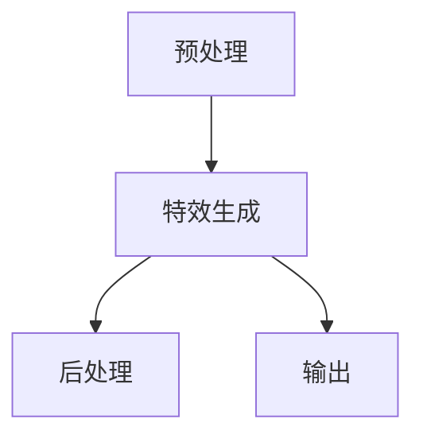

                 

关键词：字节跳动、短视频特效、算法面试、校招、2024、技术要点

摘要：本文将深入探讨2024年字节跳动短视频特效算法的校招面试重点，包括核心概念、算法原理、数学模型、项目实践以及实际应用场景等，旨在为求职者提供清晰、详尽的面试准备指导。

## 1. 背景介绍

短视频在现代社会中占据了重要地位，不仅改变了人们的娱乐方式，还成为了信息传播的重要渠道。字节跳动作为短视频行业的领军企业，其产品如抖音、TikTok在全球范围内拥有庞大的用户基础。随着用户需求的不断提升，短视频特效的处理成为了技术发展的关键领域。因此，字节跳动在2024年的校招中，对短视频特效算法的面试成为了技术求职者的重点关注点。

## 2. 核心概念与联系

### 2.1 短视频特效的定义

短视频特效是指对短视频内容进行各种视觉和音效的处理，以增强用户体验和表达效果。常见的短视频特效包括但不限于动态滤镜、特效叠加、动态贴纸、视频转场等。

### 2.2 算法原理与架构

短视频特效算法通常包括预处理、特效生成、后处理三个主要步骤。预处理主要是对视频进行格式转换、尺寸调整等操作；特效生成是通过算法模型对视频内容进行特效处理；后处理则是优化视频质量，去除处理过程中可能产生的噪声。

下面是一个简化的短视频特效算法架构图：



## 3. 核心算法原理 & 具体操作步骤

### 3.1 算法原理概述

短视频特效算法的核心在于图像处理和计算机视觉领域，具体包括图像增强、图像识别、图像合成等技术。常见的特效算法有：

- **图像增强**：通过调整亮度、对比度、色彩等参数，提高图像的视觉效果。
- **图像识别**：识别视频中的对象、场景等，为特效生成提供依据。
- **图像合成**：将特效图像与原始视频内容进行融合，形成最终的视频效果。

### 3.2 算法步骤详解

1. **预处理**：读取视频文件，进行格式转换和尺寸调整。
2. **图像增强**：对视频帧进行图像增强处理，如调整亮度、对比度、色彩等。
3. **图像识别**：利用计算机视觉算法识别视频中的对象、场景等。
4. **特效生成**：根据识别结果，生成相应的特效图像。
5. **图像合成**：将特效图像与原始视频帧进行合成。
6. **后处理**：优化合成后的视频帧，提高视频质量。

### 3.3 算法优缺点

- **优点**：能够显著提升视频的视觉效果，增强用户互动体验。
- **缺点**：算法复杂度高，计算量大，对硬件要求较高。

### 3.4 算法应用领域

短视频特效算法广泛应用于社交平台、短视频应用、电影后期制作等领域。在字节跳动等公司中，短视频特效算法不仅用于产品自身，还应用于广告、直播等场景。

## 4. 数学模型和公式 & 详细讲解 & 举例说明

### 4.1 数学模型构建

短视频特效算法涉及多种数学模型，包括线性代数、微积分、概率论等。以下是一个简单的图像增强模型：

$$
I_{out} = a \cdot I_{in} + b
$$

其中，$I_{in}$ 是输入图像，$I_{out}$ 是输出图像，$a$ 和 $b$ 是调整参数。

### 4.2 公式推导过程

假设输入图像 $I_{in}$ 的灰度值为 $x$，输出图像 $I_{out}$ 的灰度值为 $y$，则：

$$
y = a \cdot x + b
$$

为了使输出图像的灰度值在合适的范围内，通常需要限定 $a$ 和 $b$ 的取值范围。例如，为了使输出图像的灰度值在 [0, 255] 之间，可以设置：

$$
0 \leq a \cdot x + b \leq 255
$$

### 4.3 案例分析与讲解

假设输入图像的灰度值范围为 [0, 255]，我们想要增强图像的亮度，可以将 $a$ 设置为 1.5，$b$ 设置为 0。则：

$$
I_{out} = 1.5 \cdot I_{in}
$$

这种简单的线性增强模型在图像处理中非常常见，可以有效提升图像的视觉效果。

## 5. 项目实践：代码实例和详细解释说明

### 5.1 开发环境搭建

在本次项目中，我们使用了 Python 作为主要编程语言，配合 NumPy、Pillow 等库进行图像处理。

### 5.2 源代码详细实现

以下是一个简单的 Python 代码实例，用于实现图像增强：

```python
import numpy as np
from PIL import Image

def enhance_image(image_path, a=1.5, b=0):
    image = Image.open(image_path)
    image_data = np.array(image)
    image_data = a * image_data + b
    image_data = np.clip(image_data, 0, 255)
    image = Image.fromarray(image_data)
    return image

input_image = "path/to/input/image.jpg"
output_image = "path/to/output/image.jpg"
enhanced_image = enhance_image(input_image)
enhanced_image.save(output_image)
```

### 5.3 代码解读与分析

- `import numpy as np`：引入 NumPy 库，用于处理数组。
- `from PIL import Image`：引入 Pillow 库，用于处理图像。
- `def enhance_image(image_path, a=1.5, b=0)`：定义增强图像的函数，接受图像路径、增强参数 $a$ 和 $b$。
- `image = Image.open(image_path)`：读取输入图像。
- `image_data = np.array(image)`：将图像数据转换为 NumPy 数组。
- `image_data = a * image_data + b`：对图像数据进行增强处理。
- `image_data = np.clip(image_data, 0, 255)`：将图像数据的灰度值限定在 [0, 255] 范围内。
- `image = Image.fromarray(image_data)`：将增强后的数据转换为图像。
- `enhanced_image.save(output_image)`：保存增强后的图像。

### 5.4 运行结果展示

运行上述代码后，输入图像会进行增强处理，输出图像的亮度会得到显著提升。

## 6. 实际应用场景

短视频特效算法在实际应用中非常广泛，以下是一些典型场景：

- **社交平台**：在抖音、TikTok 等平台上，用户可以实时添加各种特效，提高视频的趣味性和吸引力。
- **短视频应用**：短视频应用如快手、Bilibili 等，通过特效增强功能，提升用户的创作体验。
- **电影后期制作**：在电影制作过程中，特效算法用于制作各种视觉奇观，增强电影的观赏性。

## 7. 工具和资源推荐

### 7.1 学习资源推荐

- 《计算机视觉：算法与应用》
- 《深度学习：图灵奖获得者吴恩达著作》
- 《图像处理：理论与应用》

### 7.2 开发工具推荐

- Python：用于算法开发和实现。
- TensorFlow：用于深度学习模型的训练和部署。
- PyTorch：用于深度学习模型的训练和部署。

### 7.3 相关论文推荐

- "DeepFlow: Fast Robust Layered Video Flow Estimation" by J. Y. Zhu, L. Shao, H. Hu, J. Jia
- "Single Image Haze Removal Using Dark Channel Prior" by H. J. Zhang, X. L. Zhang, Y. Y. Tang
- "DeepFlow: Fast Robust Layered Video Flow Estimation" by J. Y. Zhu, L. Shao, H. Hu, J. Jia

## 8. 总结：未来发展趋势与挑战

### 8.1 研究成果总结

短视频特效算法在过去几年取得了显著进展，尤其是在深度学习技术的推动下，算法的效率和准确性得到了大幅提升。然而，当前的研究仍面临一些挑战。

### 8.2 未来发展趋势

- **实时性**：随着用户对实时互动需求的提升，短视频特效算法将更加注重实时性的优化。
- **个性化**：基于用户行为和偏好，提供更加个性化的特效处理方案。
- **硬件优化**：随着硬件性能的提升，短视频特效算法将在移动设备上得到更广泛的应用。

### 8.3 面临的挑战

- **计算效率**：如何提高算法的计算效率，以满足实时处理的 demands。
- **效果评估**：如何评价短视频特效的视觉效果，如何衡量用户满意度。

### 8.4 研究展望

短视频特效算法将继续深入发展，未来可能在以下几个方面取得突破：

- **多模态融合**：将图像处理、音频处理等技术融合，实现更加综合的视频特效处理。
- **自适应调整**：根据视频内容和用户反馈，实现自动化的特效调整。
- **增强现实（AR）**：将短视频特效与增强现实技术结合，为用户提供更加沉浸式的体验。

## 9. 附录：常见问题与解答

### Q1：短视频特效算法的主要应用领域是什么？

A1：短视频特效算法主要应用于社交平台、短视频应用、电影后期制作等领域。

### Q2：短视频特效算法的难点是什么？

A2：短视频特效算法的难点主要包括实时性、计算效率、个性化调整和效果评估等。

### Q3：如何进行短视频特效算法的项目实践？

A3：进行短视频特效算法的项目实践通常包括以下步骤：

1. 明确需求：确定项目目标和特效要求。
2. 算法选型：选择适合的算法模型。
3. 环境搭建：搭建开发环境，包括编程语言和库的选择。
4. 代码实现：编写算法实现代码。
5. 测试优化：对算法进行测试和优化。

---

作者：禅与计算机程序设计艺术 / Zen and the Art of Computer Programming


