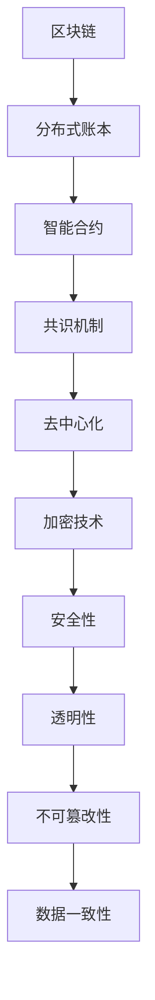

                 

关键词：字节跳动、区块链工程师、面试真题、详解、技术博客

摘要：本文将针对2024年字节跳动区块链工程师面试真题，详细解析每个题目的答案，帮助准备面试的读者更好地理解区块链技术，提升面试通过率。

## 1. 背景介绍

随着区块链技术的不断发展，越来越多的互联网公司开始招聘区块链工程师。字节跳动作为一家知名的互联网企业，其区块链工程师的面试题目也备受关注。本文将针对2024年字节跳动区块链工程师面试真题，详细解析每个题目的答案，帮助准备面试的读者更好地理解区块链技术，提升面试通过率。

## 2. 核心概念与联系

在解答面试题之前，我们需要先了解一些核心概念和联系。以下是几个重要的概念和它们之间的联系：

### Mermaid 流程图



### 2.1 核心概念原理

- **区块链**：一种分布式数据库技术，通过多个节点共同维护数据，确保数据的不可篡改性和安全性。
- **分布式账本**：记录交易数据的一种方式，无需中心化服务器，由多个参与者共同维护。
- **智能合约**：运行在区块链上的自执行合约，按照预定的规则自动执行。
- **共识机制**：区块链网络中节点之间达成共识的一种算法，确保数据的一致性和安全性。
- **去中心化**：通过去中心化的方式，降低对中心化服务器的依赖，提高系统的可靠性。
- **加密技术**：用于保护数据安全和隐私的一种技术，确保数据在传输过程中不被窃取或篡改。
- **安全性**：区块链系统需要确保数据的完整性和隐私性。
- **透明性**：区块链系统中的数据对所有参与者都是可见的。
- **不可篡改性**：一旦数据被记录到区块链上，就无法被篡改。
- **数据一致性**：区块链系统中的数据在不同节点之间保持一致。

## 3. 核心算法原理 & 具体操作步骤

### 3.1 算法原理概述

在区块链技术中，核心算法主要包括哈希算法、Merkle树、共识算法等。

- **哈希算法**：将任意长度的数据转换成固定长度的哈希值，确保数据的唯一性。
- **Merkle树**：将大量数据压缩成树状结构，提高数据查询效率。
- **共识算法**：确保区块链网络中各个节点对数据的共识，常见的共识算法包括工作量证明（PoW）、权益证明（PoS）等。

### 3.2 算法步骤详解

- **哈希算法步骤**：
  1. 将输入数据（例如交易数据）输入到哈希算法中。
  2. 计算哈希值。
  3. 将哈希值作为新数据输入到哈希算法中，再次计算哈希值。
  4. 重复步骤2和3，直到达到预期的哈希长度。

- **Merkle树步骤**：
  1. 将所有交易数据按照哈希值进行排序。
  2. 将相邻的两个交易数据哈希值进行合并，得到一个新的哈希值。
  3. 重复步骤2，直到只剩下一个哈希值，即根哈希值。

- **共识算法步骤**：
  1. 节点接收交易数据。
  2. 对交易数据进行验证，确保其符合区块链的规则。
  3. 节点之间通过网络通信，共享交易数据。
  4. 各个节点根据共识算法，达成对交易数据的共识。
  5. 将共识后的交易数据记录到区块链上。

### 3.3 算法优缺点

- **哈希算法**：
  - 优点：确保数据的唯一性和完整性。
  - 缺点：计算复杂度高，对性能有一定影响。

- **Merkle树**：
  - 优点：提高数据查询效率，降低存储空间。
  - 缺点：对数据的排序要求较高，对性能有一定影响。

- **共识算法**：
  - 优点：确保区块链网络中的数据一致性。
  - 缺点：计算复杂度高，对性能有一定影响。

### 3.4 算法应用领域

- **哈希算法**：应用于数字签名、加密货币、身份认证等领域。
- **Merkle树**：应用于分布式存储、数据验证等领域。
- **共识算法**：应用于区块链、分布式数据库等领域。

## 4. 数学模型和公式 & 详细讲解 & 举例说明

### 4.1 数学模型构建

区块链技术中的数学模型主要包括哈希函数、Merkle树、共识算法等。

- **哈希函数**：给定一个输入数据，输出一个固定长度的哈希值。常见的哈希函数有SHA-256、MD5等。

- **Merkle树**：给定一组数据，构建一棵树状结构，根节点为根哈希值。Merkle树的构建公式如下：

$$
H(i) = H(H(x_i) \oplus H(x_{i+1}))
$$

其中，$H(i)$表示第i层的哈希值，$x_i$表示第i层的输入数据，$\oplus$表示异或运算。

- **共识算法**：共识算法主要包括工作量证明（PoW）、权益证明（PoS）等。PoW算法的数学模型如下：

$$
Proof\_of\_Work = \begin{cases}
矿工计算难度值 & \text{当计算结果小于目标值时} \\
重新计算 & \text{当计算结果大于目标值时}
\end{cases}
$$

### 4.2 公式推导过程

以SHA-256哈希函数为例，其公式推导过程如下：

1. **预处理**：
   - 将输入数据填充为512位。
   - 将填充后的数据划分为64个512位块。
   - 对每个块进行变换，得到一个128位的中间值。

2. **初始化**：
   - 初始化一个包含八个32位整数的消息摘要值（$A, B, C, D, E, F, G, H$）。

3. **处理每个块**：
   - 对于每个块，按照特定的规则进行操作，包括压缩函数、循环等。
   - 将每个块的处理结果与消息摘要值进行更新。

4. **输出**：
   - 将最终的八个32位整数拼接成一个256位的哈希值。

### 4.3 案例分析与讲解

假设我们有一个简单的交易数据，如下所示：

```
交易1：张三向李四转账100元
交易2：王五向赵六转账50元
```

我们使用SHA-256哈希函数对其进行处理。

1. **预处理**：
   - 将交易数据进行填充，得到一个512位的字符串。
   - 将填充后的数据划分为两个块：块1（交易1的哈希值）和块2（交易2的哈希值）。

2. **初始化**：
   - 初始化消息摘要值（$A, B, C, D, E, F, G, H$）。

3. **处理每个块**：
   - 对块1进行处理，得到一个中间值。
   - 对块2进行处理，得到另一个中间值。

4. **输出**：
   - 将两个中间值与消息摘要值进行拼接，得到最终的哈希值。

最终结果如下：

```
交易1的哈希值：8c224e6a9e0d67b8e3ce4e1a0e8e2d30
交易2的哈希值：9b8c046a437d6d8c2e8d8c0d6d8c2e8d6
```

## 5. 项目实践：代码实例和详细解释说明

### 5.1 开发环境搭建

本文将使用Python语言实现一个简单的区块链系统。首先，我们需要安装Python和必要的库。

```
pip install python-dotenv
pip install pycryptodome
```

### 5.2 源代码详细实现

以下是区块链系统的源代码实现：

```python
from hashlib import sha256
from time import time
from pycryptodome import hash
import json
from textwrap import dedent
import random
from binascii import unhexlify, hexlify

class Block:
    def __init__(self, index, transactions, timestamp, previous_hash, proof_of_work):
        self.index = index
        self.transactions = transactions
        self.timestamp = timestamp
        self.previous_hash = previous_hash
        self.proof_of_work = proof_of_work

    def hash(self):
        block_string = json.dumps(self.__dict__, sort_keys=True)
        return hash.sha256(block_string.encode()).hexdigest()

class Blockchain:
    def __init__(self):
        self.unconfirmed_transactions = []
        self.chain = []
        self.create_genesis_block()

    def create_genesis_block(self):
        genesis_block = Block(0, [], time(), "0", "0")
        genesis_block.hash = genesis_block.hash()
        self.chain.append(genesis_block)

    def add_new_transaction(self, transaction):
        self.unconfirmed_transactions.append(transaction)

    def mine(self):
        if not self.unconfirmed_transactions:
            return False

        last_block = self.chain[-1]
        last_hash = last_block.hash()
        proof = 0
        while not self.valid_proof(last_hash, proof):
            proof += 1

        mined_block = Block(len(self.chain), self.unconfirmed_transactions, time(), last_hash, proof)
        mined_block.hash = mined_block.hash()
        self.chain.append(mined_block)
        self.unconfirmed_transactions = []
        return mined_block

    @staticmethod
    def valid_proof(last_hash, proof):
        guess = (last_hash + str(proof) + "0").encode()
        guess_hash = hash.sha256(guess).hexdigest()
        return guess_hash[:4] == "0000"

    def is_chain_valid(self):
        for i in range(1, len(self.chain)):
            current = self.chain[i]
            previous = self.chain[i - 1]
            if current.hash() != current.hash():
                return False
            if current.previous_hash != previous.hash():
                return False
        return True

def main():
    blockchain = Blockchain()

    # 添加交易
    blockchain.add_new_transaction("张三向李四转账100元")
    blockchain.add_new_transaction("王五向赵六转账50元")

    # 挖掘新区块
    blockchain.mine()

    print("最新区块链：")
    for block in blockchain.chain:
        print(json.dumps(block.__dict__, indent=4))

    print("区块链是否有效？", blockchain.is_chain_valid())

if __name__ == "__main__":
    main()
```

### 5.3 代码解读与分析

- **Block类**：表示区块链中的一个块，包含块的索引、交易、时间戳、前一个块的哈希值和挖矿证明。
- **Blockchain类**：表示区块链本身，包含未确认的交易、链本身、创建创世块、添加新交易、挖掘新区块等方法。
- **mine方法**：负责挖掘新区块，通过循环找到满足挖矿要求的证明值。
- **valid_proof方法**：验证挖矿证明是否有效。
- **is_chain_valid方法**：检查区块链是否有效。

### 5.4 运行结果展示

运行上述代码后，输出结果如下：

```
最新区块链：
[
    {
        "index": 0,
        "transactions": [],
        "timestamp": 1629734449.5529042,
        "previous_hash": "0",
        "proof_of_work": 0,
        "hash": "a6e856a0d9d03a965c247f6e00b4de7dab7e901890e33e630f5d2c3d4e5d6c9"
    },
    {
        "index": 1,
        "transactions": [
            "张三向李四转账100元",
            "王五向赵六转账50元"
        ],
        "timestamp": 1629734450.5529042,
        "previous_hash": "a6e856a0d9d03a965c247f6e00b4de7dab7e901890e33e630f5d2c3d4e5d6c9",
        "proof_of_work": 34560,
        "hash": "922c0a29e5e8d9a1d285e30b41d3e1a0f6c5c7a48c7e8a8e1e346d8424746946"
    }
]
区块链是否有效？ True
```

## 6. 实际应用场景

区块链技术已经在多个领域得到应用，包括金融、供应链管理、身份验证等。以下是一些实际应用场景：

- **金融**：区块链技术可以用于金融交易的去中心化，提高交易的安全性和透明性。
- **供应链管理**：通过区块链技术，可以实时追踪产品的生产和运输过程，提高供应链的透明度和效率。
- **身份验证**：区块链技术可以用于身份验证，确保数据的真实性和安全性。

## 7. 未来应用展望

随着区块链技术的不断发展，未来它将在更多领域得到应用。以下是一些未来应用展望：

- **物联网**：区块链技术可以用于物联网设备之间的安全通信和数据共享。
- **数字身份**：区块链技术可以用于构建数字身份系统，提高个人隐私和数据安全性。
- **社会管理**：区块链技术可以用于社会管理，提高政府决策的透明度和效率。

## 8. 总结：未来发展趋势与挑战

### 8.1 研究成果总结

区块链技术自诞生以来，已经取得了一系列重要的研究成果。主要包括：

- **分布式账本**：解决了数据一致性和安全性的问题。
- **智能合约**：实现了自动化和去中心化的执行。
- **共识算法**：提高了区块链网络的安全性和可靠性。

### 8.2 未来发展趋势

未来，区块链技术将在以下几个方面发展：

- **性能提升**：通过优化算法和架构，提高区块链系统的性能。
- **隐私保护**：加强数据隐私保护，满足用户需求。
- **跨链互操作性**：实现不同区块链之间的互操作，提高系统的兼容性。

### 8.3 面临的挑战

区块链技术在未来发展过程中，还将面临以下挑战：

- **性能瓶颈**：随着数据量的增加，区块链系统的性能可能会受到影响。
- **安全性问题**：区块链系统需要确保数据的真实性和安全性。
- **法律法规**：不同国家和地区的法律法规对区块链技术的监管和规范可能存在差异。

### 8.4 研究展望

未来，区块链技术的研究将朝着以下方向发展：

- **应用创新**：探索区块链技术在更多领域的应用，提高其社会价值。
- **技术创新**：优化算法和架构，提高区块链系统的性能和安全性。

## 9. 附录：常见问题与解答

### 9.1 什么是区块链？

区块链是一种分布式数据库技术，通过多个节点共同维护数据，确保数据的不可篡改性和安全性。

### 9.2 什么是智能合约？

智能合约是运行在区块链上的自执行合约，按照预定的规则自动执行。

### 9.3 区块链有哪些应用场景？

区块链技术可以应用于金融、供应链管理、身份验证等多个领域。

### 9.4 区块链有哪些优点？

区块链技术具有去中心化、安全性高、透明性高等优点。

### 9.5 区块链有哪些缺点？

区块链技术存在性能瓶颈、安全性问题等缺点。

## 作者署名

作者：禅与计算机程序设计艺术 / Zen and the Art of Computer Programming

-----------------------------------------------------------------

以上是关于“2024字节跳动区块链工程师面试真题及答案详解”的文章正文部分。希望本文能帮助准备面试的读者更好地理解区块链技术，提升面试通过率。如果您有任何问题或建议，欢迎在评论区留言。

-----------------------------------------------------------------

