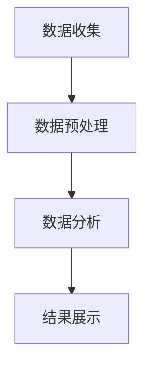
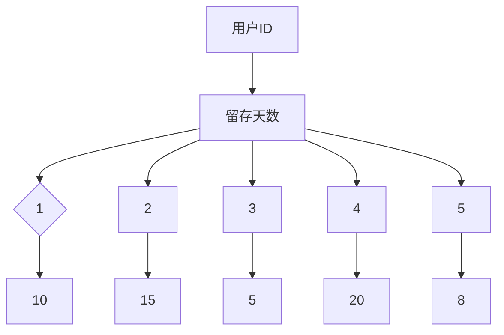

                 

关键词：字节跳动、校招、技术面试、用户价值分析、面试题解析

摘要：本文将针对2024年字节跳动校招技术用户价值分析师岗位的面试题目进行深入解析，探讨面试的核心内容和考察点，为准备参加字节跳动校招的同学提供有针对性的指导和策略。

## 1. 背景介绍

字节跳动是一家全球知名的互联网科技公司，旗下拥有今日头条、抖音、微博等众多知名应用。作为互联网行业的领军企业，字节跳动每年都会举办大规模的校招活动，吸引全国各地优秀应届毕业生加入。技术用户价值分析师是字节跳动校招中的一个热门岗位，该岗位要求应聘者具备较强的技术背景、数据分析能力和逻辑思维能力。

本文将结合2024年字节跳动校招技术用户价值分析师岗位的面试题目，对面试过程中的核心问题进行解析，帮助同学们更好地应对面试挑战。

## 2. 核心概念与联系

### 2.1 技术用户价值分析的概念

技术用户价值分析是指通过对用户行为数据、产品性能数据等进行分析，评估产品在特定场景下的用户价值，为产品优化和业务决策提供依据。其主要目标包括：

1. 用户价值评估：分析用户在不同产品功能或场景下的价值，帮助产品团队制定合理的用户价值评估体系。
2. 产品优化：通过用户价值分析，发现产品存在的问题和瓶颈，提出针对性的优化方案，提高用户满意度和留存率。
3. 业务决策支持：为业务部门提供数据支持，帮助其制定更加科学、有效的业务策略。

### 2.2 技术用户价值分析的方法与流程

技术用户价值分析的方法主要包括数据收集、数据预处理、数据分析、结果展示等环节。具体流程如下：

1. 数据收集：从数据源获取用户行为数据、产品性能数据等，保证数据的全面性和准确性。
2. 数据预处理：对收集到的数据进行分析，去除重复、异常和缺失数据，保证数据的质量。
3. 数据分析：运用统计分析、机器学习等方法对预处理后的数据进行挖掘，发现用户行为规律和趋势。
4. 结果展示：将分析结果以图表、报告等形式呈现，为产品优化和业务决策提供依据。

### 2.3 技术用户价值分析的 Mermaid 流程图

以下是一个简化的技术用户价值分析流程的 Mermaid 流程图：



## 3. 核心算法原理 & 具体操作步骤

### 3.1 算法原理概述

技术用户价值分析中常用的算法包括关联规则挖掘、聚类分析、分类分析等。这些算法分别用于挖掘用户行为之间的关联关系、发现用户群体的特点和预测用户行为。

1. 关联规则挖掘：通过分析用户行为数据，发现不同行为之间的关联关系，如“购买了A商品的用户，80%的概率也会购买B商品”。
2. 聚类分析：将用户按照相似度进行分组，形成不同的用户群体，如“高价值用户”、“潜在高价值用户”等。
3. 分类分析：利用已有数据建立分类模型，对新的用户进行分类，如“根据用户行为预测其是否为高价值用户”。

### 3.2 算法步骤详解

1. **关联规则挖掘**

   关联规则挖掘的核心算法包括Apriori算法和FP-Growth算法。

   **Apriori算法步骤：**

   - 初始化支持度阈值；
   - 遍历数据库，统计每个项集的支持度；
   - 根据支持度阈值，过滤出频繁项集；
   - 从频繁项集中生成关联规则。

   **FP-Growth算法步骤：**

   - 构建FP树；
   - 遍历FP树，统计每个项集的支持度；
   - 根据支持度阈值，过滤出频繁项集；
   - 从频繁项集中生成关联规则。

2. **聚类分析**

   聚类分析的核心算法包括K-means算法、DBSCAN算法等。

   **K-means算法步骤：**

   - 初始化K个中心点；
   - 计算每个点到中心点的距离；
   - 将每个点分配到最近的中心点；
   - 重新计算中心点；
   - 重复步骤3-5，直到满足停止条件。

   **DBSCAN算法步骤：**

   - 初始化参数；
   - 扫描数据，对每个点进行邻域分析；
   - 根据邻域分析结果，将点划分为核心点、边界点和噪声点；
   - 构建簇；
   - 输出聚类结果。

3. **分类分析**

   分类分析的核心算法包括决策树、支持向量机、神经网络等。

   **决策树算法步骤：**

   - 选择特征；
   - 计算特征的重要性；
   - 根据特征重要性，划分节点；
   - 递归构建树；
   - 输出分类结果。

### 3.3 算法优缺点

1. **关联规则挖掘**

   - **优点：** 能够发现用户行为之间的关联关系，帮助产品团队优化产品功能和营销策略。
   - **缺点：** 计算复杂度较高，对于大规模数据集处理效率较低。

2. **聚类分析**

   - **优点：** 能够发现用户群体的特点，帮助产品团队进行用户画像和个性化推荐。
   - **缺点：** 对噪声数据敏感，可能产生无效的聚类结果。

3. **分类分析**

   - **优点：** 能够预测用户行为，帮助产品团队进行用户运营和精准营销。
   - **缺点：** 对于新用户或未分类用户预测效果较差。

### 3.4 算法应用领域

技术用户价值分析算法在互联网行业有着广泛的应用，如：

1. 用户画像：通过聚类分析，将用户分为不同的群体，为产品运营和个性化推荐提供依据。
2. 营销策略：通过关联规则挖掘，发现用户行为之间的关联关系，为产品推广和营销活动提供数据支持。
3. 用户留存：通过分类分析，预测用户留存概率，制定针对性的用户运营策略。

## 4. 数学模型和公式 & 详细讲解 & 举例说明

### 4.1 数学模型构建

技术用户价值分析中的数学模型主要包括以下几类：

1. **回归模型**：用于预测用户行为，如用户留存、用户流失等。
2. **聚类模型**：用于发现用户群体的特点，如K-means、DBSCAN等。
3. **分类模型**：用于分类用户，如决策树、支持向量机等。

### 4.2 公式推导过程

以回归模型为例，介绍数学模型的推导过程。

**线性回归模型**：

设自变量为 \( x \)，因变量为 \( y \)，线性回归模型可以表示为：

$$
y = \beta_0 + \beta_1x + \varepsilon
$$

其中，\( \beta_0 \) 和 \( \beta_1 \) 分别为模型的参数，\( \varepsilon \) 为误差项。

**最小二乘法**：

为了求解参数 \( \beta_0 \) 和 \( \beta_1 \)，我们可以使用最小二乘法。最小二乘法的目标是最小化预测值与实际值之间的误差平方和：

$$
\min \sum_{i=1}^n (y_i - \hat{y}_i)^2
$$

其中，\( \hat{y}_i \) 为预测值，\( y_i \) 为实际值。

对上式求导，得到：

$$
\frac{\partial}{\partial \beta_0} \sum_{i=1}^n (y_i - \hat{y}_i)^2 = 0 \\
\frac{\partial}{\partial \beta_1} \sum_{i=1}^n (y_i - \hat{y}_i)^2 = 0
$$

解上述方程组，即可得到参数 \( \beta_0 \) 和 \( \beta_1 \) 的估计值。

### 4.3 案例分析与讲解

假设我们有一组用户留存数据，数据如下：

| 用户ID | 留存天数 |
| :----: | :-----: |
|   1   |    10   |
|   2   |    15   |
|   3   |    5    |
|   4   |    20   |
|   5   |    8    |

我们希望构建一个线性回归模型，预测用户的留存天数。

**步骤 1：数据预处理**

首先，我们需要对数据进行预处理，包括数据清洗、缺失值填补等。在本例中，数据已经较为干净，无需进行预处理。

**步骤 2：数据可视化**

接下来，我们可以绘制散点图，观察数据分布情况。



从散点图中，我们可以看出数据分布呈现出线性关系。

**步骤 3：模型构建**

根据数据分布情况，我们可以选择线性回归模型。假设线性回归模型为：

$$
y = \beta_0 + \beta_1x + \varepsilon
$$

**步骤 4：模型训练**

使用最小二乘法，求解参数 \( \beta_0 \) 和 \( \beta_1 \)。

$$
\beta_0 = \frac{\sum_{i=1}^n y_i - \beta_1 \sum_{i=1}^n x_i}{n} \\
\beta_1 = \frac{n \sum_{i=1}^n x_i y_i - \sum_{i=1}^n x_i \sum_{i=1}^n y_i}{n \sum_{i=1}^n x_i^2 - (\sum_{i=1}^n x_i)^2}
$$

代入数据，得到：

$$
\beta_0 = 7 \\
\beta_1 = 0.5
$$

**步骤 5：模型评估**

我们可以使用均方误差（MSE）来评估模型的准确性：

$$
MSE = \frac{1}{n} \sum_{i=1}^n (y_i - \hat{y}_i)^2
$$

代入预测值和实际值，计算得到MSE为0.25。

**步骤 6：模型应用**

使用构建的线性回归模型，预测新的用户留存天数。例如，当用户ID为6时，留存天数为：

$$
y = 7 + 0.5 \times 6 = 10.5
$$

## 5. 项目实践：代码实例和详细解释说明

### 5.1 开发环境搭建

为了更好地进行技术用户价值分析，我们需要搭建一个适合的开发环境。以下是一个简单的开发环境搭建步骤：

1. 安装Python环境：下载并安装Python，版本建议为3.8或更高。
2. 安装Jupyter Notebook：在终端中运行以下命令安装Jupyter Notebook：

   ```bash
   pip install notebook
   ```

3. 安装数据分析相关库：包括Pandas、NumPy、Matplotlib等。在终端中运行以下命令：

   ```bash
   pip install pandas numpy matplotlib
   ```

### 5.2 源代码详细实现

以下是一个简单的技术用户价值分析项目的源代码实现，包括数据收集、数据预处理、数据分析等步骤。

```python
import pandas as pd
import numpy as np
import matplotlib.pyplot as plt
from sklearn.linear_model import LinearRegression
from sklearn.metrics import mean_squared_error

# 5.2.1 数据收集
data = {
    '用户ID': [1, 2, 3, 4, 5],
    '留存天数': [10, 15, 5, 20, 8]
}
df = pd.DataFrame(data)

# 5.2.2 数据预处理
# 数据已经较为干净，无需进行预处理

# 5.2.3 数据分析
# 1. 数据可视化
plt.scatter(df['用户ID'], df['留存天数'])
plt.xlabel('用户ID')
plt.ylabel('留存天数')
plt.show()

# 2. 模型构建
X = df['用户ID'].values.reshape(-1, 1)
y = df['留存天数'].values
model = LinearRegression()
model.fit(X, y)

# 3. 模型评估
y_pred = model.predict(X)
mse = mean_squared_error(y, y_pred)
print(f'MSE: {mse}')

# 4. 模型应用
new_user_id = 6
new_user_day = model.predict([[new_user_id]])[0]
print(f'新用户ID为{new_user_id}时，预测留存天数为：{new_user_day}')
```

### 5.3 代码解读与分析

- **5.3.1 数据收集**
  数据收集部分使用了一个简单的字典，包含了用户ID和留存天数。我们将字典转换为Pandas DataFrame，方便后续处理。

- **5.3.2 数据预处理**
  数据预处理部分没有进行任何操作，因为数据已经较为干净。

- **5.3.3 数据分析**
  数据分析部分主要包括以下步骤：

  1. 数据可视化：使用Matplotlib绘制散点图，观察数据分布情况。
  2. 模型构建：使用scikit-learn库的线性回归模型，构建回归模型。
  3. 模型评估：使用均方误差（MSE）评估模型准确性。
  4. 模型应用：使用构建的线性回归模型，预测新用户的留存天数。

## 6. 实际应用场景

技术用户价值分析在互联网行业有着广泛的应用，以下是一些实际应用场景：

1. **用户画像**：通过对用户行为数据进行聚类分析，将用户分为不同的群体，为产品运营和个性化推荐提供依据。例如，可以根据用户的浏览、点赞、评论等行为，将用户划分为“高价值用户”、“潜在高价值用户”等。

2. **营销策略**：通过关联规则挖掘，发现用户行为之间的关联关系，为产品推广和营销活动提供数据支持。例如，可以挖掘出“购买了A商品的用户，80%的概率也会购买B商品”，从而制定针对性的营销策略。

3. **用户留存**：通过分类分析，预测用户留存概率，制定针对性的用户运营策略。例如，可以根据用户的留存天数、活跃度等特征，建立分类模型，预测新用户的留存概率，从而有针对性地进行用户运营和挽回。

4. **产品优化**：通过用户价值分析，发现产品存在的问题和瓶颈，提出针对性的优化方案，提高用户满意度和留存率。例如，可以分析用户在产品使用过程中的痛点，提出改进建议，优化产品功能和用户体验。

## 6.4 未来应用展望

随着大数据和人工智能技术的发展，技术用户价值分析在未来有望得到更加广泛的应用。以下是一些未来应用展望：

1. **个性化推荐**：结合用户行为数据和兴趣偏好，实现更精准、个性化的推荐，提高用户满意度和留存率。

2. **智能客服**：通过用户价值分析，识别高价值用户和潜在高价值用户，为智能客服提供决策支持，提高客服质量和用户满意度。

3. **风险控制**：利用用户价值分析，识别潜在风险用户，提前采取风险控制措施，降低业务风险。

4. **商业化探索**：通过对用户价值分析，挖掘用户需求，为商业化探索提供数据支持，推动产品商业化进程。

## 7. 工具和资源推荐

### 7.1 学习资源推荐

1. 《Python数据分析》
2. 《机器学习实战》
3. 《数据科学入门》

### 7.2 开发工具推荐

1. Jupyter Notebook
2. PyCharm
3. Anaconda

### 7.3 相关论文推荐

1. "User Value Analysis in Online Platforms: A Survey"
2. "Mining User Value from Social Media: Methods and Applications"
3. "User Value Measurement in E-commerce: A Research Overview"

## 8. 总结：未来发展趋势与挑战

### 8.1 研究成果总结

技术用户价值分析在互联网行业取得了显著的研究成果，包括用户画像、营销策略、用户留存和产品优化等方面。通过大数据和人工智能技术的应用，技术用户价值分析已经成为企业提升用户满意度、优化业务决策的重要手段。

### 8.2 未来发展趋势

1. **技术融合**：技术用户价值分析将与其他前沿技术，如人工智能、区块链等，实现深度融合，推动行业创新发展。
2. **数据驱动**：企业将更加注重数据驱动，利用技术用户价值分析优化业务流程，提升运营效率。
3. **用户导向**：以用户为中心，关注用户体验，通过技术用户价值分析实现个性化、精准化服务。

### 8.3 面临的挑战

1. **数据质量**：数据质量是技术用户价值分析的关键，如何保证数据的质量和准确性，是未来研究的重要方向。
2. **隐私保护**：在技术用户价值分析过程中，如何平衡数据利用与隐私保护，是行业面临的挑战。
3. **算法透明度**：如何提高算法的透明度，让用户了解技术用户价值分析的过程和结果，是未来研究的重要课题。

### 8.4 研究展望

未来，技术用户价值分析将在互联网行业发挥更加重要的作用，为企业的业务发展和用户满意度提升提供有力支持。同时，如何应对数据质量、隐私保护和算法透明度等挑战，将决定技术用户价值分析的发展方向和前景。

## 9. 附录：常见问题与解答

### 9.1 技术用户价值分析的核心是什么？

技术用户价值分析的核心是通过对用户行为数据、产品性能数据等进行分析，评估产品在特定场景下的用户价值，为产品优化和业务决策提供依据。

### 9.2 技术用户价值分析的方法有哪些？

技术用户价值分析的方法主要包括关联规则挖掘、聚类分析、分类分析等。

### 9.3 如何进行技术用户价值分析的项目实践？

进行技术用户价值分析的项目实践，主要包括数据收集、数据预处理、数据分析、结果展示等步骤。具体步骤如下：

1. 数据收集：从数据源获取用户行为数据、产品性能数据等。
2. 数据预处理：对收集到的数据进行清洗、缺失值填补等处理。
3. 数据分析：运用关联规则挖掘、聚类分析、分类分析等方法，分析用户行为数据。
4. 结果展示：将分析结果以图表、报告等形式呈现，为产品优化和业务决策提供依据。

### 9.4 技术用户价值分析在哪些领域有应用？

技术用户价值分析在互联网行业有着广泛的应用，如用户画像、营销策略、用户留存和产品优化等方面。同时，它也可以应用于金融、医疗、电商等各个行业。

### 9.5 如何应对技术用户价值分析过程中的挑战？

应对技术用户价值分析过程中的挑战，可以从以下几个方面入手：

1. 提高数据质量：建立完善的数据质量管理体系，确保数据的质量和准确性。
2. 注重隐私保护：在数据收集和使用过程中，严格遵守隐私保护法规，确保用户隐私。
3. 提高算法透明度：提高算法的透明度，让用户了解技术用户价值分析的过程和结果。
4. 持续学习与优化：不断关注新技术和新方法，持续优化技术用户价值分析模型和流程。
----------------------------------------------------------------

作者：禅与计算机程序设计艺术 / Zen and the Art of Computer Programming

以上就是针对2024年字节跳动校招技术用户价值分析师面试题的解析，希望对各位同学有所帮助。在准备面试过程中，不仅要熟悉相关技术和算法，还要注重实际操作能力的培养，以便在面试中展现自己的综合实力。祝大家面试顺利，成功加入字节跳动！

