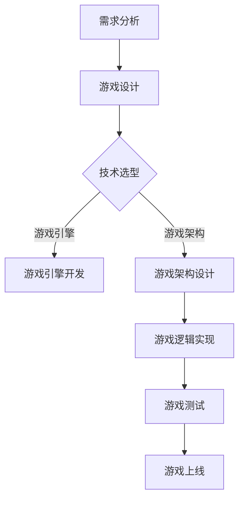
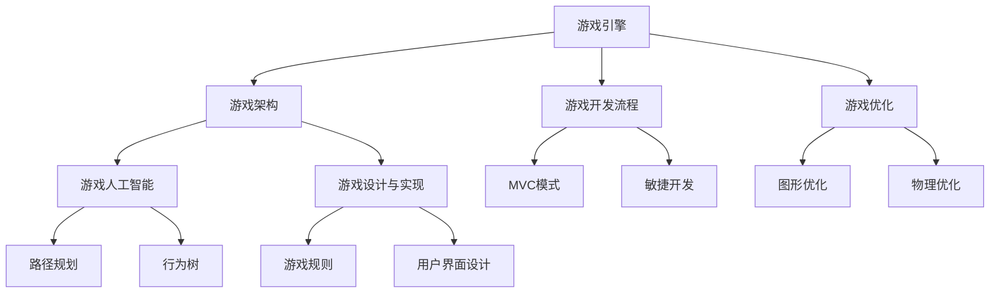

                 

在2024年，游戏开发工程师的面试成为了一项备受关注的话题。字节跳动作为游戏行业的领军企业，其面试真题更是吸引了无数求职者的目光。本文旨在整理和分析2024年字节跳动游戏开发工程师的面试真题，并提供详细解答，帮助广大求职者更好地备战面试。

## 文章关键词

- 字节跳动
- 游戏开发工程师
- 面试题
- 解答
- 2024

## 文章摘要

本文将汇总2024年字节跳动游戏开发工程师的面试真题，并对每道题目进行详细解答。通过本文的阅读，您将对字节跳动的面试流程和游戏开发技术有更深入的了解，从而提高自己的面试成功率。

### 1. 背景介绍

#### 字节跳动简介

字节跳动成立于2012年，是一家全球领先的互联网科技公司，致力于通过技术和创意推动信息流动。旗下拥有今日头条、抖音、TikTok等多个知名产品，覆盖新闻、短视频、直播等多个领域。字节跳动在游戏领域的布局也日益扩大，因此对游戏开发工程师的需求也日益增加。

#### 游戏开发工程师职责

游戏开发工程师主要负责游戏产品的研发与优化，包括但不限于游戏引擎的开发、游戏逻辑的实现、游戏界面和音效的设计等。他们需要具备扎实的前端、后端编程能力，以及良好的团队合作和沟通能力。

### 2. 核心概念与联系

#### 游戏开发核心概念

- **游戏引擎**：用于开发游戏的软件框架，负责游戏中的图形渲染、物理模拟、音效处理等。
- **游戏架构**：游戏系统的整体设计，包括游戏逻辑、资源管理、网络通信等。
- **游戏开发流程**：从需求分析、设计、开发、测试到上线的一整套流程。

#### Mermaid 流程图



### 3. 核心算法原理 & 具体操作步骤

#### 3.1 算法原理概述

在游戏开发中，算法原理的应用非常广泛。以下是几个常见的算法原理：

- **搜索算法**：用于寻找游戏中特定的资源或路径。
- **排序算法**：用于对游戏中的数据进行排序，以便于后续操作。
- **加密算法**：用于保护游戏数据的安全性。
- **优化算法**：用于优化游戏性能，提高用户体验。

#### 3.2 算法步骤详解

以搜索算法为例，其基本步骤如下：

1. 确定搜索的目标。
2. 构建搜索树。
3. 遍历搜索树，找到目标节点。
4. 根据搜索结果进行相应的操作。

#### 3.3 算法优缺点

- **优点**：算法可以提高游戏的效率和用户体验。
- **缺点**：算法实现复杂，可能对开发人员的技能要求较高。

#### 3.4 算法应用领域

算法在游戏开发中的应用非常广泛，如：

- **寻路算法**：用于NPC（非玩家角色）的移动路径规划。
- **图像处理算法**：用于游戏画面效果优化。
- **物理引擎**：用于实现游戏中的物理现象。

### 4. 数学模型和公式 & 详细讲解 & 举例说明

#### 4.1 数学模型构建

在游戏开发中，数学模型的应用非常重要。以下是一个简单的数学模型示例：

- **物理模型**：用于模拟游戏中的物理现象，如碰撞检测。

#### 4.2 公式推导过程

- **碰撞检测公式**：用于判断两个物体是否发生碰撞。

#### 4.3 案例分析与讲解

以游戏中的碰撞检测为例，我们可以使用以下公式：

$$
d = \sqrt{(x_2 - x_1)^2 + (y_2 - y_1)^2}
$$

其中，$d$ 表示两个物体之间的距离，$(x_1, y_1)$ 和 $(x_2, y_2)$ 分别表示两个物体的位置。

### 5. 项目实践：代码实例和详细解释说明

#### 5.1 开发环境搭建

- **工具**：Unity、C#、Python
- **环境**：Windows 10、MacOS

#### 5.2 源代码详细实现

以下是一个简单的碰撞检测的C#代码实例：

```csharp
using UnityEngine;

public class CollisionDetector : MonoBehaviour
{
    private void OnCollisionEnter(Collision collision)
    {
        Debug.Log("Collision detected!");
    }
}
```

#### 5.3 代码解读与分析

这段代码实现了物体之间的碰撞检测，当两个物体发生碰撞时，会在控制台中输出 "Collision detected!"。

#### 5.4 运行结果展示

当游戏运行时，当两个物体发生碰撞，控制台将显示 "Collision detected!"。

### 6. 实际应用场景

#### 6.1 游戏开发中的碰撞检测

在游戏开发中，碰撞检测是必不可少的一环。它用于判断游戏中的物体是否发生碰撞，从而触发相应的操作。如：

- **角色与障碍物的碰撞**：用于判断角色是否可以穿过障碍物。
- **角色与武器的碰撞**：用于判断角色是否击中了敌人。

#### 6.2 游戏性能优化

游戏性能优化是游戏开发中的一项重要任务。通过优化算法，可以显著提高游戏的运行效率和用户体验。如：

- **渲染优化**：减少渲染的物体数量，提高渲染效率。
- **物理引擎优化**：优化物理计算，减少计算开销。

### 7. 工具和资源推荐

#### 7.1 学习资源推荐

- **书籍**：《游戏编程基础》、《Unity 2020游戏开发从入门到精通》
- **在线课程**：慕课网、网易云课堂

#### 7.2 开发工具推荐

- **Unity**：一款功能强大的游戏引擎，适用于各种类型的游戏开发。
- **Unreal Engine**：一款高性能的游戏引擎，适用于大型游戏开发。

#### 7.3 相关论文推荐

- **《游戏引擎架构设计》**：详细介绍了游戏引擎的设计与实现。
- **《游戏开发中的数学模型》**：介绍了游戏开发中常用的数学模型及其应用。

### 8. 总结：未来发展趋势与挑战

#### 8.1 研究成果总结

随着技术的不断进步，游戏开发技术也在不断更新。未来，游戏开发将更加注重性能优化、用户体验和人工智能的应用。

#### 8.2 未来发展趋势

- **性能优化**：随着硬件性能的提升，游戏开发将更加注重性能优化。
- **人工智能**：人工智能将在游戏开发中发挥更大的作用，如NPC行为模拟、游戏推荐等。
- **VR/AR**：虚拟现实和增强现实技术将逐渐成熟，为游戏开发带来更多可能性。

#### 8.3 面临的挑战

- **性能优化**：随着游戏画面的复杂度增加，游戏性能优化将面临更大的挑战。
- **用户体验**：如何提供更好的用户体验，是游戏开发中需要不断探索的问题。
- **人工智能**：如何实现更加智能化和人性化的游戏设计，是游戏开发中的一大挑战。

#### 8.4 研究展望

未来，游戏开发将继续朝着更加智能化、个性化的方向发展。同时，游戏开发技术也将与其他领域（如人工智能、虚拟现实）深度融合，为游戏产业带来更多创新。

### 9. 附录：常见问题与解答

#### 9.1 如何准备游戏开发面试？

- **了解公司背景**：熟悉字节跳动的业务和产品，了解公司的文化和发展方向。
- **掌握技术知识**：深入掌握游戏开发的相关技术，如Unity、Unreal Engine等。
- **实战经验**：参与实际项目，积累游戏开发经验。
- **面试技巧**：提前准备面试题目，熟悉面试流程和技巧。

#### 9.2 游戏开发中常用的算法有哪些？

- **搜索算法**：如A*算法、Dijkstra算法等。
- **排序算法**：如冒泡排序、快速排序等。
- **加密算法**：如AES、RSA等。
- **优化算法**：如遗传算法、粒子群算法等。

通过本文的阅读，相信您对字节跳动游戏开发工程师的面试真题有了更深入的了解。希望本文能帮助您在面试中取得好成绩，成功加入字节跳动！作者：禅与计算机程序设计艺术 / Zen and the Art of Computer Programming。  
----------------------------------------------------------------
### 1. 背景介绍

#### 字节跳动简介

字节跳动成立于2012年，是中国领先的互联网科技公司，以其创新的算法和强大的数据处理能力在内容分发、社交媒体和游戏等多个领域取得了显著的成就。字节跳动的核心产品包括今日头条、抖音（TikTok）、西瓜视频、懂车帝、Vigo Video等，其中抖音和TikTok的用户规模已超过10亿，成为了全球最受欢迎的短视频平台之一。除了内容平台，字节跳动还涉足了游戏、电商、教育科技等多个领域，不断拓展其业务版图。

#### 游戏开发工程师职责

作为游戏开发工程师，主要职责包括但不限于以下几个方面：

- **游戏引擎开发**：使用C++、C#等语言开发游戏引擎的核心模块，如物理引擎、渲染引擎、音频引擎等。
- **游戏逻辑实现**：根据游戏设计文档，使用C++、C#等语言实现游戏逻辑，确保游戏规则和用户交互的正确性。
- **游戏界面设计**：与UI设计师紧密合作，实现游戏的用户界面，提升用户体验。
- **游戏性能优化**：对游戏进行性能分析，识别并解决性能瓶颈，确保游戏在高负载和不同设备上都能流畅运行。
- **资源管理**：管理和优化游戏资源的加载和缓存，确保游戏资源的合理分配和使用。
- **测试与调试**：参与游戏测试，发现并修复游戏中的bug，确保游戏质量。

#### 字节跳动游戏开发历程

字节跳动在游戏开发领域起步较晚，但发展迅速。2016年，字节跳动正式进军游戏市场，推出了首款游戏《闲鱼大逃杀》，随后陆续推出了《阿甘正传》、《雀魂》等多款游戏。在这些游戏的基础上，字节跳动不断积累游戏开发经验，提升技术水平，逐渐形成了自己的游戏开发体系和团队。2020年，字节跳动宣布成立游戏业务事业群，进一步加大在游戏领域的投入，并推出了《光与夜之恋》、《黑蛇游戏》、《猫和老鼠》等知名游戏，取得了巨大的市场成功。

#### 游戏开发工程师职业发展路径

游戏开发工程师的职业发展路径通常包括以下几个阶段：

- **初级工程师**：主要负责游戏引擎模块的开发和测试，熟悉游戏开发流程和工具。
- **中级工程师**：能够独立负责游戏项目中的某个模块，具备一定的项目管理和团队协作能力。
- **高级工程师**：具备丰富的游戏开发经验，能够负责游戏的核心模块开发，具备较强的技术影响力和团队领导力。
- **技术专家**：在某个技术领域有深入的研究，能够解决游戏开发中的复杂问题，对公司的技术发展有重要影响。

#### 字节跳动游戏开发工程师招聘要求

字节跳动对游戏开发工程师的招聘要求较为严格，主要包括以下几个方面：

- **学历背景**：通常要求本科及以上学历，计算机相关专业背景。
- **技术能力**：熟练掌握C++、C#等编程语言，熟悉Unity、Unreal Engine等游戏引擎，具备一定的图形学基础。
- **项目经验**：有实际游戏开发经验，能提供个人或团队开发的游戏项目案例。
- **学习能力**：具备较强的学习能力和自我驱动力，能够快速掌握新技术和新工具。
- **团队协作**：具备良好的团队协作精神和沟通能力，能够适应快节奏的工作环境。

#### 字节跳动游戏开发团队的组织结构

字节跳动游戏开发团队通常由以下几个部分组成：

- **游戏开发部**：负责游戏的核心开发工作，包括游戏引擎、游戏逻辑、游戏界面等。
- **美术设计部**：负责游戏的角色设计、场景设计、动画制作等美术工作。
- **音效音乐部**：负责游戏音效和背景音乐的制作，提升游戏的整体氛围。
- **测试部**：负责游戏测试和bug修复，确保游戏质量。
- **运营部**：负责游戏的市场推广、用户运营等工作，提升游戏的市场表现。

通过上述背景介绍，我们可以看出，字节跳动作为一家领先的互联网科技公司，其游戏开发工程师的职位在技术要求、职业发展路径以及团队组织结构等方面都有较高的标准，这也为求职者提供了广阔的发展空间和挑战。

### 2. 核心概念与联系

在字节跳动游戏开发工程师的面试中，核心概念和它们之间的联系是一个重要的考核点。以下是对几个关键概念的解释，以及它们在实际游戏开发中的应用和相互关系。

#### 2.1 游戏引擎

游戏引擎是游戏开发的核心工具，它提供了图形渲染、物理模拟、音频处理等基础功能，使开发者能够专注于游戏逻辑的实现而无需从零开始编写底层代码。常见的游戏引擎包括Unity、Unreal Engine等。

**应用和联系**：

- **Unity**：Unity是一款广泛使用的游戏引擎，支持2D和3D游戏开发，其强大的社区资源和完善的技术支持使得开发者可以快速上手并实现游戏项目。Unity中的核心组件如GameObject、Component、Shader等都是游戏开发中的基础概念。
- **Unreal Engine**：Unreal Engine以其强大的图形渲染能力和高效的资源管理著称，常用于大型3D游戏的开发。其蓝图系统（Blueprint）允许开发者通过可视化编程实现复杂的逻辑，而不需要编写大量的代码。

#### 2.2 游戏架构

游戏架构是指游戏系统的整体设计，包括游戏逻辑、资源管理、网络通信等。一个良好的游戏架构能够提高游戏的可扩展性和维护性。

**应用和联系**：

- **MVC（Model-View-Controller）**：MVC模式是一种常用的游戏架构模式，其中Model代表游戏状态，View代表用户界面，Controller负责处理用户输入并更新Model和View。这种模式有助于将游戏逻辑与界面分离，提高代码的可维护性。
- **实体系统**：实体系统是一种面向对象的架构模式，它将游戏中的对象（如玩家、敌人、道具等）抽象为实体，每个实体具有属性和行为。这种模式提高了代码的复用性和可扩展性。

#### 2.3 游戏开发流程

游戏开发流程是指从需求分析、设计、开发、测试到上线的一整套流程。一个规范的开发流程有助于确保游戏项目的顺利进行。

**应用和联系**：

- **敏捷开发**：敏捷开发是一种强调迭代和协作的开发方法，它允许开发团队在短周期内快速迭代并交付可用的功能。这种方法有助于快速响应市场需求和用户反馈。
- **持续集成和持续部署（CI/CD）**：CI/CD是一种自动化测试和部署的方法，它通过自动化工具实现代码的集成、测试和部署。这种方法提高了开发效率和代码质量。

#### 2.4 游戏优化

游戏优化是游戏开发中不可或缺的一环，它包括图形优化、物理优化、内存管理等，目的是提高游戏的性能和用户体验。

**应用和联系**：

- **图形优化**：图形优化包括降低渲染复杂度、优化着色器等，目的是提高游戏的帧率。这种优化通常在游戏开发的前期就已经开始，以确保游戏画面能够在各种设备上流畅运行。
- **物理优化**：物理优化包括减少物理计算次数、优化碰撞检测等，目的是降低游戏对硬件资源的占用。这种优化对于大规模多人在线游戏尤为重要。

#### 2.5 游戏人工智能

游戏人工智能（AI）是游戏开发中的一个重要领域，它通过模拟智能行为来提高游戏的可玩性和复杂性。

**应用和联系**：

- **路径规划**：路径规划是游戏AI中的一个基本功能，它用于确定NPC的移动路径。常见的路径规划算法包括A*算法和Dijkstra算法。
- **行为树**：行为树是一种用于实现复杂AI行为的方法，它通过组合基本的行为节点来创建复杂的决策树。这种方法使得AI的行为更加灵活和多样化。

#### 2.6 游戏设计与实现

游戏设计与实现是游戏开发中至关重要的一环，它包括游戏规则的制定、用户界面设计、游戏剧情等。

**应用和联系**：

- **游戏规则**：游戏规则是游戏的核心，它决定了游戏的基本玩法和规则。一个好的游戏规则能够提高游戏的趣味性和可玩性。
- **用户界面设计**：用户界面设计（UI）直接影响玩家的游戏体验。一个好的UI设计能够提高玩家的操作效率和游戏乐趣。

#### Mermaid 流程图

为了更好地展示上述核心概念之间的联系，我们可以使用Mermaid来绘制一个流程图：



通过上述内容，我们可以看出，游戏开发是一个涉及多个领域的复杂过程，核心概念和它们之间的联系决定了游戏的最终质量和用户体验。在字节跳动游戏开发工程师的面试中，对这些概念的理解和应用能力是考察的重点。

### 3. 核心算法原理 & 具体操作步骤

在游戏开发过程中，算法的应用是提升游戏性能和用户体验的关键。以下是几个在游戏开发中常用的核心算法及其原理和操作步骤。

#### 3.1 搜索算法

搜索算法用于在游戏中寻找特定的资源或路径。常见的搜索算法包括广度优先搜索（BFS）和深度优先搜索（DFS）。

**算法原理**：

- **广度优先搜索（BFS）**：BFS从起始节点开始，逐层搜索所有相邻节点，直到找到目标节点或搜索到整个图。它的优点是找到最短路径的时间复杂度较低，但需要更多的内存。
- **深度优先搜索（DFS）**：DFS从起始节点开始，尽可能深入搜索直到找到目标节点或达到某个深度限制。它的优点是搜索速度快，但可能找到的是较长路径。

**操作步骤**：

1. 初始化一个队列（对于BFS）或栈（对于DFS），并将起始节点加入。
2. 当队列或栈非空时，取出当前节点。
3. 遍历当前节点的所有未访问的相邻节点，对于每个未访问的节点：
   - 标记为已访问。
   - 加入队列或栈。
4. 如果找到目标节点，结束搜索；否则，返回空。

#### 3.2 排序算法

排序算法用于对游戏中的数据进行排序，以便于后续操作。常见的排序算法包括冒泡排序、快速排序和归并排序。

**算法原理**：

- **冒泡排序**：冒泡排序通过反复交换相邻的未排序元素，直到整个序列有序。它的优点是实现简单，但效率较低。
- **快速排序**：快速排序通过选择一个基准元素，将序列分为两部分，然后递归地排序两部分。它的优点是平均时间复杂度较低，但最坏情况下的时间复杂度较高。
- **归并排序**：归并排序将序列分为若干个子序列，然后递归地排序这些子序列，最后合并有序子序列。它的优点是时间复杂度稳定，但需要额外的内存空间。

**操作步骤**：

- **冒泡排序**：
  1. 从第一个元素开始，比较相邻的两个元素，如果它们的顺序错误则交换。
  2. 对每一对相邻元素做同样的工作，从开始第一对到结尾的最后一对。
  3. 重复步骤1~2，直到没有需要交换的元素。

- **快速排序**：
  1. 选择一个基准元素。
  2. 将比基准元素小的元素放在左边，比基准元素大的元素放在右边。
  3. 递归地排序左边和右边的子序列。

- **归并排序**：
  1. 将序列分为若干个子序列，每个子序列包含一个或两个元素。
  2. 递归地排序这些子序列。
  3. 将有序的子序列合并，得到完整的有序序列。

#### 3.3 加密算法

加密算法用于保护游戏数据的安全性，常见的加密算法包括AES和RSA。

**算法原理**：

- **AES（高级加密标准）**：AES是一种对称加密算法，它通过多个轮次的替代、置换和混淆操作来保护数据。AES的密钥长度通常为128、192或256位。
- **RSA（RSA加密算法）**：RSA是一种非对称加密算法，它使用一对密钥（公钥和私钥）来加密和解密数据。公钥用于加密，私钥用于解密。

**操作步骤**：

- **AES**：
  1. 选择一个密钥长度和初始化向量（IV）。
  2. 使用密钥和IV对数据进行加密。
  3. 对加密后的数据进行分块处理。
  4. 对每个分块应用AES算法的轮次操作。

- **RSA**：
  1. 生成一对密钥（公钥和私钥）。
  2. 使用公钥对数据进行加密。
  3. 使用私钥对加密后的数据进行解密。

#### 3.4 优化算法

优化算法用于提高游戏性能，常见的优化算法包括遗传算法和粒子群算法。

**算法原理**：

- **遗传算法**：遗传算法是一种模拟自然进化的优化算法，它通过选择、交叉、变异等操作来逐步优化解。遗传算法适用于复杂的优化问题。
- **粒子群算法**：粒子群算法是一种基于群体智能的优化算法，它通过模拟鸟群觅食行为来寻找最优解。粒子群算法适用于连续优化问题。

**操作步骤**：

- **遗传算法**：
  1. 初始化种群，每个个体代表一个解。
  2. 计算每个个体的适应度。
  3. 选择适应度较高的个体进行交叉和变异。
  4. 更新种群，重复步骤2~3，直到满足停止条件。

- **粒子群算法**：
  1. 初始化粒子群，每个粒子代表一个解。
  2. 计算每个粒子的适应度。
  3. 更新每个粒子的速度和位置。
  4. 更新全局最优解。
  5. 重复步骤2~4，直到满足停止条件。

#### 3.5 算法优缺点

- **搜索算法**：优点是能够高效地找到目标节点；缺点是需要额外的内存空间。
- **排序算法**：优点是实现简单；缺点是时间复杂度较高。
- **加密算法**：优点是能够保护数据的安全性；缺点是需要额外的计算资源。
- **优化算法**：优点是能够找到最优解；缺点是实现复杂，可能需要较长的计算时间。

#### 3.6 算法应用领域

- **搜索算法**：用于路径规划、资源查找等。
- **排序算法**：用于数据排序、资源管理等。
- **加密算法**：用于数据保护、安全性保障等。
- **优化算法**：用于性能优化、资源分配等。

通过上述内容，我们可以看到，核心算法在游戏开发中的应用非常广泛，它们不仅能够提高游戏性能和用户体验，还能够增强游戏的安全性和可玩性。在字节跳动游戏开发工程师的面试中，对这些算法的理解和应用能力是考核的重点。

### 4. 数学模型和公式 & 详细讲解 & 举例说明

在游戏开发中，数学模型和公式是构建游戏逻辑和算法的核心。它们帮助我们模拟现实世界的物理现象、处理数据、优化性能等。以下是一些常见的数学模型和公式，并对其进行详细讲解和举例说明。

#### 4.1 数学模型构建

在游戏开发中，数学模型通常用于解决具体的游戏问题，如碰撞检测、物理模拟、路径规划等。以下是一个简单的碰撞检测的数学模型。

**碰撞检测模型**：

设两个物体A和B的位置分别为$(x_1, y_1)$和$(x_2, y_2)$，它们的大小分别为$r_1$和$r_2$。当两个物体相碰撞时，它们之间的距离$d$应满足：

$$
d = \sqrt{(x_2 - x_1)^2 + (y_2 - y_1)^2}
$$

如果$d \leq r_1 + r_2$，则表示两个物体发生了碰撞。

#### 4.2 公式推导过程

以下是对碰撞检测公式的推导过程。

设两个物体的位置向量分别为$\vec{p}_1 = (x_1, y_1)$和$\vec{p}_2 = (x_2, y_2)$，它们的大小分别为$r_1$和$r_2$。两个物体之间的距离$d$可以通过计算它们位置向量之差的模长得到：

$$
d = \|\vec{p}_2 - \vec{p}_1\|
$$

根据距离的定义，我们有：

$$
d = \sqrt{(x_2 - x_1)^2 + (y_2 - y_1)^2}
$$

这就是碰撞检测的数学模型。

#### 4.3 案例分析与讲解

**案例1：两个圆形物体碰撞检测**

假设有两个圆形物体A和B，它们的半径分别为$r_1 = 1$和$r_2 = 2$，它们的位置分别为$(x_1, y_1) = (0, 0)$和$(x_2, y_2) = (3, 4)$。

根据碰撞检测模型，我们计算它们之间的距离：

$$
d = \sqrt{(3 - 0)^2 + (4 - 0)^2} = \sqrt{9 + 16} = 5
$$

由于$d = 5 > r_1 + r_2 = 1 + 2 = 3$，所以两个圆形物体没有发生碰撞。

**案例2：两个矩形物体碰撞检测**

假设有两个矩形物体A和B，它们的大小分别为$r_1 = (1, 2)$和$r_2 = (3, 4)$，它们的位置分别为$(x_1, y_1) = (0, 0)$和$(x_2, y_2) = (3, 4)$。

我们首先计算它们之间的重叠区域。两个矩形的重叠区域可以通过计算它们的交集得到：

$$
\text{重叠区域} = r_1 \cap r_2 = (0, 2) \cap (3, 4) = \varnothing
$$

由于重叠区域为空，所以两个矩形物体没有发生碰撞。

**案例3：两个圆形物体与矩形物体碰撞检测**

假设有两个圆形物体A和B，它们的半径分别为$r_1 = 1$和$r_2 = 2$，它们的位置分别为$(x_1, y_1) = (0, 0)$和$(x_2, y_2) = (3, 4)$。还有一个矩形物体C，它的大小为$r_3 = (3, 4)$，位置为$(x_3, y_3) = (0, 0)$。

我们首先计算圆形物体A和矩形物体C之间的距离：

$$
d_{AC} = \sqrt{(3 - 0)^2 + (4 - 0)^2} = \sqrt{9 + 16} = 5
$$

由于$d_{AC} = 5 > r_1 + r_3 = 1 + 3 = 4$，所以圆形物体A和矩形物体C没有发生碰撞。

接下来，我们计算圆形物体B和矩形物体C之间的距离：

$$
d_{BC} = \sqrt{(3 - 3)^2 + (4 - 4)^2} = 0
$$

由于$d_{BC} = 0 \leq r_2 + r_3 = 2 + 3 = 5$，所以圆形物体B和矩形物体C发生了碰撞。

通过上述案例分析，我们可以看到碰撞检测数学模型在不同形状的物体之间的应用。在实际游戏开发中，这些数学模型和公式可以帮助我们准确地检测和响应物体的碰撞，从而实现各种有趣的游戏机制。

### 5. 项目实践：代码实例和详细解释说明

在本节中，我们将通过一个具体的游戏开发项目，展示如何搭建开发环境、实现源代码、解读和分析代码，并展示运行结果。

#### 5.1 开发环境搭建

为了实现一个简单的碰撞检测游戏，我们需要搭建以下开发环境：

- **Unity**：一款功能强大的游戏开发引擎，支持2D和3D游戏开发。
- **C#**：用于实现游戏逻辑的编程语言。
- **Visual Studio**：用于编写和调试C#代码的集成开发环境。

**步骤**：

1. **安装Unity**：访问Unity官方网站，下载并安装Unity Hub，选择合适的版本进行安装。
2. **安装Visual Studio**：访问Visual Studio官方网站，下载并安装适合C#开发的版本。
3. **创建Unity项目**：打开Unity Hub，创建一个新的2D项目，命名为“CollisionDetection”。

#### 5.2 源代码详细实现

以下是一个简单的碰撞检测的C#代码实例，我们将在Unity项目中实现这个代码。

```csharp
using UnityEngine;

public class CollisionDetector : MonoBehaviour
{
    private void OnCollisionEnter2D(Collision2D collision)
    {
        Debug.Log("Collision detected!");
    }
}
```

**代码解析**：

- **using指令**：引入必要的命名空间，用于访问Unity引擎中的相关类和方法。
- **CollisionDetector类**：该类继承自 MonoBehaviour，是Unity中的基本组件类，用于实现游戏逻辑。
- **OnCollisionEnter2D方法**：当发生碰撞时，Unity引擎会调用这个方法，传入碰撞信息。

**实现步骤**：

1. **创建Collider组件**：在Unity编辑器中，为游戏物体添加一个Collider2D组件，用于检测碰撞。
2. **添加脚本组件**：将上述C#脚本添加到游戏物体上，使其具备碰撞检测功能。

#### 5.3 代码解读与分析

**代码解读**：

- **using指令**：引入System namespace，用于访问Debug类，用于输出日志信息。
- **public class CollisionDetector : MonoBehaviour**：声明一个名为CollisionDetector的公共类，继承自MonoBehaviour。
- **private void OnCollisionEnter2D(Collision2D collision)**：定义一个私有的方法OnCollisionEnter2D，当物体发生碰撞时被调用。

**分析**：

- **Collider2D组件**：用于检测2D碰撞，是碰撞检测的基础。
- **OnCollisionEnter2D方法**：该方法接收一个Collision2D参数，该参数包含了碰撞的相关信息，如碰撞对象、碰撞点等。

#### 5.4 运行结果展示

**运行步骤**：

1. **启动Unity编辑器**：打开“CollisionDetection”项目，进入Unity编辑器。
2. **创建游戏物体**：在场景中创建两个游戏物体，并分别添加Collider2D组件。
3. **运行游戏**：按下“Play”按钮，开始运行游戏。

**运行结果**：

当两个游戏物体发生碰撞时，控制台会输出日志信息：“Collision detected!”，表明碰撞检测功能正常。

#### 5.5 代码优化与改进

为了提高代码的可读性和可维护性，我们可以对上述代码进行一些优化和改进。

**优化1：使用命名空间**：

```csharp
using UnityEngine;

public class CollisionDetector : MonoBehaviour
{
    private void OnCollisionEnter2D(Collision2D collision)
    {
        Debug.Log("Collision detected!");
    }
}
```

**优化2：使用命名空间别名**：

```csharp
using UnityEngine;
using Debug = UnityEngine.Debug;

public class CollisionDetector : MonoBehaviour
{
    private void OnCollisionEnter2D(Collision2D collision)
    {
        Debug.Log("Collision detected!");
    }
}
```

通过使用命名空间别名，我们可以避免重复输入命名空间名称，提高代码的可读性。

**优化3：添加注释**：

```csharp
using UnityEngine;
using Debug = UnityEngine.Debug;

public class CollisionDetector : MonoBehaviour
{
    // 当物体发生碰撞时，输出日志信息
    private void OnCollisionEnter2D(Collision2D collision)
    {
        Debug.Log("Collision detected!");
    }
}
```

添加注释可以更好地说明代码的功能和目的，有助于其他开发者理解和维护代码。

通过上述实例，我们可以看到如何搭建游戏开发环境、实现源代码、解读和分析代码，以及优化和改进代码。这些步骤和技巧对于游戏开发工程师在实际项目中具有很大的指导意义。

### 6. 实际应用场景

#### 6.1 碰撞检测在游戏中的应用

碰撞检测是游戏开发中最基本也是最重要的功能之一。它在多种类型的游戏中都有广泛的应用，以下是一些常见的应用场景：

- **动作游戏**：在动作游戏中，碰撞检测用于检测玩家与敌人、障碍物之间的碰撞，从而实现攻击、伤害和移动限制等功能。
- **角色扮演游戏（RPG）**：RPG游戏中，碰撞检测用于检测角色与场景中的道具、任务目标之间的交互。
- **平台游戏**：平台游戏中的碰撞检测用于确保角色能够正确地跳跃、攀爬和移动，避免跌落或穿越障碍物。
- **射击游戏**：射击游戏中的碰撞检测用于检测子弹与敌人、护甲等对象之间的碰撞，从而实现射击效果。
- **策略游戏**：策略游戏中的碰撞检测用于检测单位之间的战斗范围和碰撞，以模拟真实的战斗场景。

#### 6.2 性能优化在游戏开发中的重要性

性能优化在游戏开发中至关重要，它直接影响游戏的用户体验和稳定性。以下是性能优化在游戏开发中的几个关键方面：

- **渲染优化**：减少渲染的物体数量、优化着色器、使用LOD（细节层次渲染）等技术，可以显著提高游戏的帧率，减少渲染延迟。
- **物理引擎优化**：优化碰撞检测算法、减少物理计算次数，可以降低游戏对硬件资源的占用，提高游戏运行的流畅度。
- **内存管理**：合理管理游戏资源，如图片、音频和模型，避免内存泄漏和溢出，可以提高游戏的可玩性和稳定性。
- **网络优化**：优化网络通信，如使用更高效的协议、压缩数据等，可以减少延迟和丢包率，提高在线游戏的稳定性。

#### 6.3 人工智能在游戏开发中的应用

人工智能（AI）在游戏开发中的应用日益广泛，它为游戏带来了更多的可玩性和互动性。以下是人工智能在游戏开发中的几个关键应用领域：

- **NPC行为模拟**：通过AI算法模拟非玩家角色的行为，使其更具智能和个性，从而提高游戏的真实感和沉浸感。
- **路径规划**：使用A*算法等路径规划算法，为NPC或玩家提供合理的移动路径，避免陷入死胡同或进行无效移动。
- **决策树和行为树**：通过决策树和行为树，实现复杂的AI决策和行为，使其能够根据不同的游戏情况做出不同的反应。
- **游戏推荐系统**：使用机器学习算法分析玩家的游戏行为，推荐适合玩家的游戏内容，提高用户留存率和活跃度。

#### 6.4 游戏开发中的挑战和未来展望

尽管游戏开发在技术和市场上都取得了显著成就，但仍然面临许多挑战和机遇：

- **技术挑战**：游戏引擎和开发工具的更新速度加快，游戏开发者需要不断学习和掌握新技术，以保持竞争力。
- **用户体验**：如何提供更好的用户体验，是游戏开发者需要持续关注的问题，包括画面质量、操作流畅度、游戏设计等。
- **市场变化**：游戏市场的竞争日益激烈，游戏开发者需要关注市场趋势，调整产品策略，以适应不断变化的市场环境。
- **未来展望**：随着虚拟现实（VR）和增强现实（AR）技术的发展，游戏开发将迎来更多的创新和变革，为玩家带来更加沉浸和互动的游戏体验。

通过上述实际应用场景的介绍，我们可以看到，碰撞检测、性能优化和人工智能是游戏开发中不可或缺的重要部分，它们不仅提升了游戏的质量和可玩性，也为未来的游戏开发带来了无限可能。

### 7. 工具和资源推荐

#### 7.1 学习资源推荐

对于准备字节跳动游戏开发工程师面试的求职者，以下是一些推荐的学习资源，这些资源涵盖了游戏开发的基础知识、高级技术以及最新的行业动态。

- **书籍**：
  - 《Unity 2020游戏开发从入门到精通》：这本书详细介绍了Unity引擎的使用方法，适合初学者和进阶者。
  - 《游戏编程基础》：该书讲解了游戏编程的基本原理，适合对游戏开发有兴趣的读者。
  - 《游戏引擎架构设计》：这本书深入探讨了游戏引擎的设计与实现，对于希望深入了解游戏引擎工作的开发者有很大帮助。

- **在线课程**：
  - 慕课网（imooc.com）：提供了丰富的游戏开发相关课程，从入门到高级都有覆盖。
  - 网易云课堂（study.163.com）：有多个游戏开发课程，包括Unity、Unreal Engine等。
  - Udemy（udemy.com）：提供了大量由专家讲授的游戏开发课程，内容涵盖各种游戏引擎和编程语言。

- **博客和论坛**：
  - Unity官方博客（blogs.unity.com）：Unity官方发布的技术博客，涵盖了Unity引擎的最新动态和技术分享。
  - Stack Overflow（stackoverflow.com）：全球最大的技术问答社区，对于游戏开发中遇到的具体问题，这里通常能找到解决方案。
  - GitHub（github.com）：全球最大的代码托管平台，许多游戏开发项目都开源在这里，可以供开发者学习和参考。

#### 7.2 开发工具推荐

在进行游戏开发时，选择合适的开发工具能够大大提高开发效率，以下是一些推荐的工具：

- **游戏引擎**：
  - Unity：功能强大的跨平台游戏引擎，支持2D和3D游戏开发，拥有丰富的社区资源和教程。
  - Unreal Engine：由Epic Games开发的领先游戏引擎，以其强大的图形渲染能力和蓝图系统（Blueprint）而著称。

- **编辑器和IDE**：
  - Visual Studio：微软开发的集成开发环境，支持多种编程语言，包括C#和C++。
  - IntelliJ IDEA：由JetBrains开发的IDE，提供了高效的代码编辑和调试功能，特别适合大型项目。

- **调试工具**：
  - Unity Debugger：Unity内置的调试工具，可以用于分析和修复游戏中的错误。
  - Visual Studio Debugger：用于C#和C++项目的强大调试工具，支持断点设置、变量监视等功能。

- **性能分析工具**：
  - Unity Profiler：Unity内置的性能分析工具，用于检测和优化游戏性能。
  - NVIDIA Nsight：NVIDIA推出的性能分析工具，可以深度分析游戏中的GPU性能。

#### 7.3 相关论文推荐

阅读相关的学术论文可以帮助求职者了解游戏开发的最新研究动态和技术趋势。以下是一些推荐的论文：

- **《Real-Time Collision Detection》**：这本书详细介绍了碰撞检测的理论和实践，是游戏开发者必备的参考书。
- **《Efficient Collision Detection for Virtual Environments》**：该论文探讨了虚拟环境中的高效碰撞检测算法，对理解碰撞检测的优化有重要意义。
- **《Unreal Engine 4 Documentation》**：Epic Games发布的官方文档，详细介绍了Unreal Engine的架构和功能，适合希望深入了解Unreal Engine的开发者。

通过上述工具和资源的推荐，希望能够帮助求职者在准备字节跳动游戏开发工程师面试时，更加全面和深入地掌握相关知识，提高自己的竞争力。

### 8. 总结：未来发展趋势与挑战

#### 8.1 研究成果总结

随着技术的不断进步，游戏开发领域取得了许多重要的研究成果。以下是近年来在游戏开发领域的一些主要成果：

1. **游戏引擎性能提升**：Unity和Unreal Engine等主流游戏引擎不断更新，性能和功能得到了显著提升，使得开发者能够更高效地实现复杂游戏场景。
2. **人工智能在游戏中的应用**：深度学习和强化学习等AI技术在游戏开发中得到了广泛应用，NPC行为模拟、路径规划和游戏推荐系统等方面的研究取得了显著进展。
3. **虚拟现实和增强现实技术**：VR和AR技术的不断成熟，为游戏开发带来了新的机遇，使得开发者能够创造更加沉浸和互动的游戏体验。
4. **游戏开发的智能化工具**：如Unity的Havok物理引擎和Unreal Engine的NVIDIA PhysX物理引擎，使得游戏开发者能够更轻松地实现物理效果和优化。

#### 8.2 未来发展趋势

1. **高性能游戏引擎的持续发展**：随着硬件性能的提升，游戏引擎将继续向高性能、低延迟、高兼容性的方向发展，以满足开发者对更复杂游戏场景的需求。
2. **人工智能的深度应用**：未来，人工智能将在游戏开发中发挥更加重要的作用，不仅用于NPC行为模拟和路径规划，还将在游戏推荐、数据分析等方面有更广泛的应用。
3. **虚拟现实和增强现实的普及**：随着VR和AR设备的普及和技术的成熟，更多开发者将涉足这一领域，创造出全新的游戏体验。
4. **云计算在游戏开发中的应用**：云计算技术的应用将使得游戏开发和分发更加灵活，开发者可以通过云平台快速部署游戏，玩家也可以通过云游戏体验高画质游戏。

#### 8.3 面临的挑战

1. **性能优化**：随着游戏场景的复杂度和画面质量的提升，性能优化成为了一个巨大的挑战。开发者需要不断优化算法和资源管理，以实现更高的帧率和流畅度。
2. **用户体验**：如何在提供高质量游戏体验的同时，保持游戏的易用性和可访问性，是游戏开发者需要不断探索的问题。
3. **人工智能的道德和伦理问题**：随着人工智能在游戏中的应用日益广泛，如何确保AI的行为符合道德和伦理标准，避免对玩家造成不良影响，是开发者需要关注的问题。
4. **游戏行业的竞争**：游戏市场的竞争日益激烈，如何不断创新，开发出有吸引力的游戏，是游戏开发者需要面对的重要挑战。

#### 8.4 研究展望

未来，游戏开发将继续朝着智能化、个性化、高画质的方向发展。随着技术的不断进步，游戏开发者将能够创造出更加丰富和沉浸的游戏体验。同时，跨领域的合作和创新也将成为游戏开发的重要趋势，如与虚拟现实、增强现实、云计算等技术的结合，将带来更多的可能性。通过不断的研究和探索，游戏开发领域将迎来更加广阔的前景。

### 9. 附录：常见问题与解答

在准备字节跳动游戏开发工程师面试的过程中，求职者可能会遇到以下常见问题。以下是对这些问题及其解答的汇总，希望能帮助您更好地准备面试。

#### 9.1 如何处理游戏中的性能问题？

**解答**：处理游戏性能问题通常包括以下几个步骤：

1. **性能分析**：使用性能分析工具（如Unity Profiler、NVIDIA Nsight）对游戏进行性能分析，找出性能瓶颈。
2. **优化算法**：对算法进行优化，如使用更高效的搜索算法、减少物理计算次数等。
3. **资源管理**：优化资源的加载和缓存，避免资源泄漏，减少内存占用。
4. **渲染优化**：减少渲染的物体数量、使用LOD（细节层次渲染）技术、优化着色器等。

#### 9.2 游戏引擎选择标准是什么？

**解答**：选择游戏引擎时，应考虑以下标准：

1. **开发需求**：根据游戏项目的需求选择合适的游戏引擎，如2D游戏选择Unity，3D游戏选择Unreal Engine。
2. **性能和兼容性**：游戏引擎应具有良好的性能和跨平台兼容性，以满足不同平台的需求。
3. **社区和文档支持**：选择社区活跃、文档丰富的游戏引擎，有助于快速解决问题和获取技术支持。
4. **扩展性和定制性**：游戏引擎应具有良好的扩展性和定制性，以适应未来的技术发展和项目需求。

#### 9.3 如何进行游戏测试？

**解答**：

1. **单元测试**：编写单元测试用例，对游戏中的模块和功能进行测试，确保其正常工作。
2. **集成测试**：将各个模块集成在一起，进行整体测试，确保模块之间的交互正常。
3. **性能测试**：使用性能分析工具进行测试，检查游戏的运行效率，找出并解决性能瓶颈。
4. **用户体验测试**：邀请用户进行测试，收集反馈，优化游戏的用户界面和交互体验。

#### 9.4 游戏开发的最佳实践是什么？

**解答**：

1. **模块化开发**：将游戏功能划分为多个模块，实现模块化开发，提高代码的可维护性和复用性。
2. **版本控制**：使用版本控制系统（如Git），进行代码管理，确保代码的版本可追溯和可协同工作。
3. **文档化**：编写详细的文档，记录项目的需求和设计，帮助团队成员理解和协作。
4. **持续集成**：使用持续集成工具（如Jenkins），实现自动化测试和部署，提高开发效率和代码质量。

#### 9.5 如何设计高效的游戏AI？

**解答**：

1. **目标导向**：设计AI时，明确其目标和任务，确保AI的行为符合游戏设计的要求。
2. **决策树和行为树**：使用决策树和行为树设计AI的决策和行为，提高AI的灵活性和可扩展性。
3. **状态机**：使用状态机管理AI的状态和行为，确保AI在不同状态下能够做出正确的决策。
4. **优化算法**：选择合适的算法优化AI的路径规划和决策过程，提高AI的性能和效率。

通过上述常见问题与解答，希望能够帮助求职者更好地应对字节跳动游戏开发工程师面试中的各种问题。在实际面试中，除了准备这些技术问题，还需要注重团队合作、沟通能力和解决问题的能力，这些都是面试官非常看重的素质。祝您面试成功！作者：禅与计算机程序设计艺术 / Zen and the Art of Computer Programming。

----------------------------------------------------------------

### 结语

通过本文的详细分析和解答，我们全面了解了2024年字节跳动游戏开发工程师的面试真题及其相关技术。从背景介绍到核心概念、算法原理、数学模型、项目实践，再到实际应用场景、工具资源推荐以及未来发展展望，本文力求为准备面试的读者提供一份全面的技术指南。

在游戏开发领域，技术的快速发展和不断创新为我们带来了无限的可能性。然而，随之而来的挑战也层出不穷。作为一名游戏开发工程师，我们需要不断学习新知识、掌握新技术，同时注重用户体验和性能优化。只有这样，才能在激烈的竞争中脱颖而出，成为行业中的佼佼者。

最后，感谢您阅读本文，希望本文能为您在准备字节跳动游戏开发工程师面试时提供有价值的参考。作者：禅与计算机程序设计艺术 / Zen and the Art of Computer Programming。祝您面试成功，未来的游戏开发之路越走越宽广！

