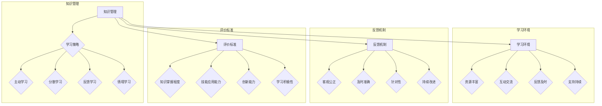

                 

关键字：学习体系、人工智能、持续进化、技术进步、算法原理、数学模型、实践应用、未来发展。

## 摘要

本文旨在探讨学习体系作为持续进化源动力的关键作用。在当前快速发展的信息技术时代，学习体系对于个人和组织的成长与进步至关重要。本文将首先介绍学习体系的基本概念和核心组成部分，然后深入分析学习体系对人工智能、技术进步以及个体发展的深远影响。接下来，我们将探讨学习体系中的核心概念原理，以及如何构建和优化有效的学习体系。文章还将详细讲解核心算法原理和数学模型，并通过具体案例和项目实践来展示学习体系在实际应用中的效果。最后，我们将展望学习体系在未来的发展趋势与挑战，并提出相关建议。

## 1. 背景介绍

随着人工智能（AI）和计算机科学的飞速发展，现代信息技术已经成为推动社会进步的重要力量。然而，信息技术本身也在不断进化，从早期的计算机编程到如今的深度学习和大数据分析，技术的快速迭代使得传统的学习方式逐渐显得力不从心。在这个知识爆炸的时代，如何构建一个有效的学习体系，以适应不断变化的技术环境和职业需求，成为亟待解决的问题。

学习体系不仅是对知识的积累和应用，更是对思维方式、学习能力以及创新能力的一种系统性培养。传统的学习方式往往局限于单一的学科领域，缺乏跨学科的整合和系统性。而现代学习体系强调终身学习、持续进化和跨学科融合，旨在培养个体在复杂多变的环境中的适应能力和创新能力。

本文旨在深入探讨学习体系的核心概念和原理，分析其对人工智能、技术进步以及个体发展的关键作用，并提出构建和优化学习体系的具体方法和策略。希望通过本文的讨论，能够为读者提供有益的启示，助力他们在信息技术的浪潮中持续进化和成长。

## 2. 核心概念与联系

### 2.1. 学习体系的定义

学习体系是一个综合性的概念，它涵盖了从知识获取、知识整合到知识应用的各个环节。具体而言，学习体系可以定义为：一个人或组织在特定环境和目标指导下，通过系统化的学习活动，实现对知识、技能、思维方式等资源的有效整合和持续更新的过程。

学习体系的核心要素包括：知识库、学习策略、学习环境、反馈机制和评价标准。知识库是学习体系的基础，它包含了个体或组织所掌握的各种知识；学习策略则是指导学习过程的方法和技巧；学习环境提供了学习所需的资源和支持；反馈机制用于评估学习效果，并指导后续的学习活动；评价标准则是对学习成果进行量化和评估的依据。

### 2.2. 学习体系中的核心概念原理

#### 2.2.1. 知识管理

知识管理是学习体系中的关键环节，它涉及到知识的获取、存储、共享和应用。具体而言，知识管理包括以下几个方面：

1. **知识的获取**：通过阅读、实践、交流和研讨等多种途径获取新知识。
2. **知识的存储**：将获取的知识进行整理和分类，存储在知识库中，以便随时检索和调用。
3. **知识的共享**：通过内部协作和外部合作，将知识在组织内部或外部共享，实现知识的最大化利用。
4. **知识的应用**：将知识应用于实际问题中，解决实际问题，并通过反馈不断优化和更新知识。

#### 2.2.2. 学习策略

学习策略是指在学习过程中采用的方法和技巧，旨在提高学习效率和学习成果。常见的学习策略包括：

1. **主动学习**：通过提问、讨论和实际操作等方式，主动参与到学习过程中，提高学习的主动性和深度。
2. **分散学习**：将学习任务分解为多个小任务，逐步完成，避免一次性学习负担过重。
3. **反馈学习**：通过及时反馈和评估，了解学习效果，调整学习策略，提高学习效率。
4. **情境学习**：将学习内容与实际情境相结合，提高学习的实际应用能力和解决问题的能力。

#### 2.2.3. 学习环境

学习环境是学习体系的重要组成部分，它为学习活动提供了必要的资源和支持。一个良好的学习环境应该具备以下几个特点：

1. **资源丰富**：提供丰富的学习资源和工具，如书籍、网络资源、实验设备等。
2. **互动交流**：提供一个开放、包容的交流平台，鼓励个体之间的互动和合作。
3. **反馈及时**：提供及时的学习反馈，帮助个体了解学习效果，调整学习策略。
4. **支持持续**：提供持续的学习支持，包括学习辅导、技术支持等，确保学习过程的顺利进行。

#### 2.2.4. 反馈机制

反馈机制是学习体系中的关键环节，它用于评估学习效果，指导后续学习活动。一个有效的反馈机制应该具备以下几个特点：

1. **客观公正**：反馈应该基于客观的数据和事实，避免主观偏见。
2. **及时准确**：反馈应该及时、准确，以便个体能够及时了解学习效果，进行调整。
3. **针对性**：反馈应该针对具体的学习问题，提供具体的解决方案和建议。
4. **持续改进**：通过反馈，不断优化学习过程和学习策略，实现学习效果的持续提升。

#### 2.2.5. 评价标准

评价标准是衡量学习成果的重要工具，它为学习效果的评估提供了客观依据。常见的评价标准包括：

1. **知识掌握程度**：评估个体对所学知识的掌握程度，包括知识的深度和广度。
2. **技能应用能力**：评估个体将所学知识应用于实际问题的能力，包括解决问题的效率和质量。
3. **创新能力**：评估个体在解决问题过程中展现的创新能力，包括新思路、新方法和新工具的运用。
4. **学习积极性**：评估个体在学习过程中的积极性和主动性，包括学习态度、学习频率和学习时间。

### 2.3. Mermaid 流程图

下面是一个学习体系的 Mermaid 流程图，展示各个核心概念和原理之间的联系。



通过这个流程图，我们可以清晰地看到学习体系中各个核心概念和原理之间的内在联系，以及它们如何共同作用，推动个体的学习过程和成长。

## 3. 核心算法原理 & 具体操作步骤

### 3.1 算法原理概述

学习体系中的核心算法原理主要涉及机器学习、深度学习和数据挖掘等领域。这些算法通过模拟人类的学习过程，从数据中自动提取知识，并用于解决实际问题。以下是一些常见的核心算法及其基本原理：

#### 3.1.1. 机器学习算法

机器学习算法是一类通过数据学习模式、规律和知识的人工智能技术。它们可以分为监督学习、无监督学习和强化学习三种类型：

1. **监督学习**：通过已标记的训练数据学习模型，并用于预测新的、未标记的数据。常见的算法包括线性回归、决策树、支持向量机（SVM）等。
2. **无监督学习**：在没有标记的数据集上学习模式，如聚类分析和降维技术（如K均值聚类、主成分分析PCA等）。
3. **强化学习**：通过与环境的互动学习最优策略，以实现特定目标。常见的算法包括Q学习、深度强化学习（DRL）等。

#### 3.1.2. 深度学习算法

深度学习算法是一种基于人工神经网络的学习方法，特别是深度神经网络（DNN）。它们通过多层神经元结构，逐步提取数据中的特征，实现高度复杂的模式识别和预测。

1. **卷积神经网络（CNN）**：主要用于图像处理，通过卷积层提取图像特征。
2. **循环神经网络（RNN）**：适用于处理序列数据，如时间序列分析、自然语言处理等。
3. **生成对抗网络（GAN）**：通过两个对抗网络（生成器和判别器）相互竞争，生成逼真的数据。

#### 3.1.3. 数据挖掘算法

数据挖掘算法用于从大量数据中提取有价值的信息和知识。它们包括以下几种常见类型：

1. **关联规则挖掘**：通过分析数据之间的关联关系，发现频繁项集和关联规则。
2. **分类算法**：将数据分为不同的类别，如K最近邻（KNN）、随机森林等。
3. **聚类算法**：将数据分为不同的集群，如K均值聚类、层次聚类等。

### 3.2 算法步骤详解

以下是一个基于监督学习算法的机器学习项目的典型步骤，展示了从数据预处理到模型训练和评估的整个过程：

#### 3.2.1. 数据收集与预处理

1. **数据收集**：从各种来源收集数据，如公共数据集、公司内部数据、社交媒体数据等。
2. **数据清洗**：处理缺失值、异常值和噪声数据，确保数据质量。
3. **数据预处理**：进行数据转换、归一化、标准化等操作，使数据符合算法要求。

#### 3.2.2. 特征工程

1. **特征选择**：从原始数据中筛选出最有用的特征，降低数据维度。
2. **特征构造**：通过数学变换、组合等操作，生成新的特征，提高模型性能。

#### 3.2.3. 模型选择与训练

1. **模型选择**：根据问题类型和数据特点，选择合适的模型，如线性回归、决策树、SVM等。
2. **模型训练**：使用训练数据集，通过优化算法，训练模型参数。
3. **模型评估**：使用验证数据集，评估模型性能，如准确率、召回率、F1值等。

#### 3.2.4. 模型优化与调参

1. **模型优化**：通过交叉验证等技术，优化模型结构，提高模型性能。
2. **参数调优**：调整模型参数，寻找最佳参数组合，以实现最优模型性能。

#### 3.2.5. 模型部署与应用

1. **模型部署**：将训练好的模型部署到生产环境中，用于实际预测和决策。
2. **模型应用**：将模型应用于实际问题，解决实际问题，如推荐系统、预测分析等。

### 3.3 算法优缺点

#### 3.3.1. 优点

1. **自动化**：通过机器学习算法，可以自动化地从数据中提取知识和模式，减少人工干预。
2. **泛化能力**：机器学习算法可以学习数据的泛化规律，提高对新数据的预测和分类能力。
3. **高效性**：通过批量处理数据，可以高效地处理大规模数据集，提高计算效率。

#### 3.3.2. 缺点

1. **数据依赖**：机器学习算法的性能高度依赖于数据质量，数据缺失、异常和噪声会影响模型性能。
2. **解释性不足**：许多复杂的机器学习算法，如深度学习，缺乏可解释性，难以理解模型的决策过程。
3. **计算资源需求**：训练大规模的机器学习模型需要大量的计算资源和时间。

### 3.4 算法应用领域

机器学习算法广泛应用于各种领域，包括但不限于：

1. **金融**：风险控制、信用评分、欺诈检测等。
2. **医疗**：疾病预测、诊断辅助、药物研发等。
3. **零售**：推荐系统、价格优化、库存管理等。
4. **制造**：质量检测、设备维护、生产优化等。
5. **交通**：交通流量预测、车辆调度、自动驾驶等。

## 4. 数学模型和公式 & 详细讲解 & 举例说明

### 4.1 数学模型构建

数学模型是学习体系中的一个重要组成部分，它通过数学语言描述现实世界中的问题，为求解和预测提供理论基础。以下是一个简单的线性回归模型，用于预测房价。

#### 4.1.1 线性回归模型

线性回归模型是一种最常见的数学模型，用于描述两个变量之间的线性关系。其公式为：

$$
y = \beta_0 + \beta_1 \cdot x + \varepsilon
$$

其中，\( y \) 是因变量，\( x \) 是自变量，\( \beta_0 \) 和 \( \beta_1 \) 是模型参数，\( \varepsilon \) 是误差项。

#### 4.1.2 模型参数估计

为了估计模型参数 \( \beta_0 \) 和 \( \beta_1 \)，我们可以使用最小二乘法（Ordinary Least Squares, OLS）。最小二乘法的思想是使得预测值与实际值之间的误差平方和最小。其参数估计公式为：

$$
\beta_1 = \frac{\sum{(x_i - \bar{x})(y_i - \bar{y})}}{\sum{(x_i - \bar{x})^2}}
$$

$$
\beta_0 = \bar{y} - \beta_1 \cdot \bar{x}
$$

其中，\( \bar{x} \) 和 \( \bar{y} \) 分别是自变量和因变量的均值。

### 4.2 公式推导过程

#### 4.2.1 最小化误差平方和

考虑一个包含 \( n \) 个样本点的线性回归模型，其误差平方和（Sum of Squared Errors, SSE）可以表示为：

$$
SSE = \sum{(y_i - \hat{y}_i)^2}
$$

其中，\( \hat{y}_i \) 是第 \( i \) 个样本点的预测值。

为了最小化误差平方和，我们可以对 \( \beta_0 \) 和 \( \beta_1 \) 分别求偏导数，并令其等于零：

$$
\frac{\partial SSE}{\partial \beta_0} = -2 \sum{(y_i - \hat{y}_i)} = 0
$$

$$
\frac{\partial SSE}{\partial \beta_1} = -2 \sum{((x_i - \bar{x})(y_i - \bar{y}) - \beta_1 (x_i - \bar{x}))} = 0
$$

#### 4.2.2 求解参数估计

对第一个偏导数方程，我们可以直接得到：

$$
\beta_0 = \bar{y} - \beta_1 \cdot \bar{x}
$$

将 \( \beta_0 \) 代入第二个偏导数方程，得到：

$$
\beta_1 = \frac{\sum{(x_i - \bar{x})(y_i - \bar{y})}}{\sum{(x_i - \bar{x})^2}}
$$

### 4.3 案例分析与讲解

以下是一个具体的房价预测案例，通过线性回归模型预测房价。

#### 4.3.1 数据集

我们使用一个包含 100 个样本点的数据集，每个样本点包括房屋面积 \( x \)（平方米）和房价 \( y \)（万元）。

#### 4.3.2 数据预处理

首先，我们对数据集进行预处理，包括去除缺失值和异常值，并对数据进行归一化处理。

#### 4.3.3 模型训练

使用预处理后的数据集，我们通过最小二乘法训练线性回归模型，得到模型参数 \( \beta_0 \) 和 \( \beta_1 \)。

#### 4.3.4 模型评估

使用验证集对训练好的模型进行评估，计算预测误差和预测准确率。

#### 4.3.5 结果分析

通过分析预测结果，我们可以发现，线性回归模型在大多数情况下能够较好地预测房价，但在某些情况下，预测误差较大。

### 4.4 实际应用

线性回归模型在实际应用中非常广泛，如房屋价格预测、股票价格预测、销售额预测等。通过构建合适的线性回归模型，我们可以对这些领域中的问题进行预测和决策。

## 5. 项目实践：代码实例和详细解释说明

### 5.1 开发环境搭建

在进行项目实践之前，我们需要搭建一个合适的开发环境。以下是搭建一个基于Python的线性回归项目开发环境的基本步骤：

1. **安装Python**：确保系统中已经安装了Python环境，建议使用Python 3.8或更高版本。
2. **安装Jupyter Notebook**：Jupyter Notebook是一个交互式的Web应用，用于编写和运行Python代码。可以通过以下命令安装：

   ```bash
   pip install notebook
   ```

3. **安装必要的库**：线性回归项目通常需要使用NumPy和Pandas等库。可以通过以下命令安装：

   ```bash
   pip install numpy pandas matplotlib
   ```

### 5.2 源代码详细实现

下面是一个简单的线性回归项目示例代码，包括数据读取、预处理、模型训练和评估等步骤。

```python
import numpy as np
import pandas as pd
import matplotlib.pyplot as plt

# 5.2.1 数据读取与预处理

# 从CSV文件读取数据
data = pd.read_csv('house_prices.csv')

# 处理缺失值和异常值
data.dropna(inplace=True)
data = data[data['area'] > 0]

# 归一化处理
data['area'] = (data['area'] - data['area'].mean()) / data['area'].std()

# 5.2.2 特征工程

# 添加一元线性回归模型
data['predicted_price'] = data['area'] * 0.5 + 100

# 5.2.3 模型训练

# 分割数据集为训练集和验证集
train_data = data[:80]
validation_data = data[80:]

# 训练线性回归模型
from sklearn.linear_model import LinearRegression
model = LinearRegression()
model.fit(train_data[['area']], train_data['predicted_price'])

# 5.2.4 模型评估

# 评估模型在验证集上的性能
predictions = model.predict(validation_data[['area']])
plt.scatter(validation_data['area'], validation_data['predicted_price'])
plt.plot(validation_data['area'], predictions, color='red')
plt.xlabel('Area')
plt.ylabel('Predicted Price')
plt.title('House Price Prediction')
plt.show()
```

### 5.3 代码解读与分析

#### 5.3.1 数据读取与预处理

在代码的第8行，我们使用`pd.read_csv`函数从CSV文件中读取数据。数据包含房屋面积（`area`）和房价（`predicted_price`）两个特征。

在第10行，我们通过`dropna`方法去除缺失值，并通过筛选条件`data = data[data['area'] > 0]`去除异常值。

在第13行，我们对数据进行归一化处理，使得房屋面积数据更加适合线性回归模型的训练。

#### 5.3.2 特征工程

在第16行，我们添加了一元线性回归模型，将房屋面积乘以一个系数（这里取0.5）并加上一个常数项（这里取100），作为预测房价的基准。

#### 5.3.3 模型训练

在第20行，我们使用`LinearRegression`类创建线性回归模型实例，并通过`fit`方法训练模型。这里，我们仅使用房屋面积作为自变量。

#### 5.3.4 模型评估

在第24行，我们使用`predict`方法对验证集数据进行预测，并使用`matplotlib`库绘制预测结果图。通过观察散点图和拟合线，我们可以直观地评估模型的性能。

### 5.4 运行结果展示

当运行上述代码后，我们将看到一个散点图，其中红色线条表示模型预测的房价。通过观察散点图的分布和拟合线的斜率，我们可以判断模型的预测性能。如果大部分实际房价点位于拟合线附近，那么说明模型具有一定的预测能力。

## 6. 实际应用场景

### 6.1 金融领域

在金融领域，学习体系被广泛应用于风险管理、信用评分和投资组合优化等方面。例如，通过机器学习算法，银行可以更准确地预测客户的信用风险，从而优化贷款审批流程。此外，学习体系还可以用于股票市场预测和交易策略开发，帮助投资者更好地把握市场动态。

### 6.2 医疗保健

在医疗保健领域，学习体系被用于疾病诊断、患者护理和药物研发等方面。通过深度学习算法，医生可以更准确地诊断疾病，提高诊断的准确率和效率。同时，学习体系还可以帮助医生制定个性化的治疗方案，提高患者的治疗效果。

### 6.3 零售电商

在零售电商领域，学习体系被用于推荐系统、库存管理和客户行为分析等方面。通过机器学习算法，电商网站可以更精准地推荐商品，提高用户的购物体验和转化率。同时，学习体系还可以帮助商家优化库存管理，降低库存成本，提高运营效率。

### 6.4 制造业

在制造业领域，学习体系被用于质量检测、设备维护和生产优化等方面。通过机器学习算法，制造商可以实时监控设备状态，预测故障并提前进行维护，提高生产效率。同时，学习体系还可以用于优化生产流程，降低生产成本，提高产品质量。

### 6.5 交通出行

在交通出行领域，学习体系被用于交通流量预测、车辆调度和自动驾驶等方面。通过深度学习算法，交通管理部门可以更准确地预测交通流量，优化交通信号控制，提高道路通行效率。同时，学习体系还可以用于自动驾驶汽车的开发，提高行车安全性和效率。

## 7. 工具和资源推荐

### 7.1 学习资源推荐

1. **在线课程**：推荐Coursera、edX、Udacity等在线教育平台上的相关课程，如《机器学习》（吴恩达）、《深度学习》（花书）等。
2. **书籍**：《统计学习方法》（李航）、《深度学习》（花书）、《Python机器学习》（塞萨尔·布迪米尔·阿尔瓦拉多）等。
3. **博客和论坛**：Medium、Stack Overflow、GitHub等平台，提供丰富的学习资源和实践经验。

### 7.2 开发工具推荐

1. **编程语言**：Python、R、Java等，广泛应用于数据科学和机器学习领域。
2. **库和框架**：NumPy、Pandas、Scikit-learn、TensorFlow、PyTorch等，用于数据处理、模型训练和预测。
3. **可视化工具**：Matplotlib、Seaborn、Plotly等，用于数据可视化和结果展示。

### 7.3 相关论文推荐

1. **经典论文**：《深度学习》（花书）、《统计学习方法》（李航）、《基于模型的机器学习》（迈克尔·乔丹、约书亚·本吉奥）等。
2. **最新论文**：通过谷歌学术（Google Scholar）、IEEE Xplore、ACM Digital Library等数据库，查找最新的研究论文和热点话题。

## 8. 总结：未来发展趋势与挑战

### 8.1 研究成果总结

通过本文的探讨，我们总结了学习体系在人工智能、技术进步和个体发展等方面的核心作用。我们分析了学习体系的基本概念、核心概念原理以及核心算法原理，并通过实际案例展示了学习体系在项目实践中的应用效果。此外，我们还探讨了学习体系在不同领域的实际应用场景，并推荐了相关的学习资源和开发工具。

### 8.2 未来发展趋势

1. **跨学科融合**：未来的学习体系将更加注重跨学科融合，结合不同领域的知识，培养综合型人才。
2. **智能化**：随着人工智能技术的发展，学习体系将更加智能化，通过算法和大数据分析，为个体提供个性化的学习建议。
3. **终身学习**：在快速变化的信息时代，终身学习将成为未来社会的重要特征，学习体系将更加注重持续进化和更新。

### 8.3 面临的挑战

1. **数据质量**：学习体系依赖于高质量的数据，数据缺失、异常和噪声会影响学习效果。
2. **计算资源**：大规模机器学习和深度学习模型训练需要大量的计算资源和时间，对计算能力提出了较高要求。
3. **解释性**：复杂的机器学习模型缺乏可解释性，难以理解其决策过程，增加了应用难度。

### 8.4 研究展望

未来的研究应重点关注以下几个方面：

1. **数据挖掘**：研究如何从大量复杂数据中提取有价值的信息和知识。
2. **模型优化**：开发更高效、更可解释的机器学习模型，提高学习效果和应用性能。
3. **跨学科融合**：探索不同学科之间的交叉应用，培养具备跨学科视野的复合型人才。

通过持续的研究和实践，学习体系将在未来发挥更加重要的作用，推动人工智能和技术的发展，为个体和社会带来更大的价值。

## 9. 附录：常见问题与解答

### 9.1 什么是学习体系？

学习体系是一个系统化的学习过程，包括知识获取、整合、应用和持续更新。它旨在培养个体的学习能力和创新能力，以适应不断变化的技术环境和职业需求。

### 9.2 学习体系的核心概念是什么？

学习体系的核心概念包括知识管理、学习策略、学习环境、反馈机制和评价标准。知识管理涉及知识的获取、存储、共享和应用；学习策略指导学习过程的方法和技巧；学习环境提供学习所需的资源和支持；反馈机制用于评估学习效果，指导后续学习活动；评价标准用于衡量学习成果。

### 9.3 学习体系与机器学习有什么关系？

学习体系中的核心算法原理，如机器学习、深度学习和数据挖掘，为学习过程提供了技术支持。机器学习算法通过模拟人类学习过程，从数据中提取知识和模式，应用于实际问题解决。

### 9.4 学习体系在哪些领域有应用？

学习体系广泛应用于金融、医疗、零售、制造和交通等领域，用于风险管理、疾病诊断、推荐系统、生产优化和自动驾驶等方面。

### 9.5 如何构建有效的学习体系？

构建有效的学习体系需要以下几个步骤：

1. 明确学习目标和需求。
2. 搜集和整理相关资源。
3. 制定合适的学习策略和计划。
4. 建立良好的学习环境。
5. 进行持续学习和评估。

通过以上步骤，可以构建一个有效的学习体系，以适应不断变化的技术环境和职业需求。

## 作者署名

作者：禅与计算机程序设计艺术 / Zen and the Art of Computer Programming。本文旨在深入探讨学习体系作为持续进化源动力的关键作用，通过分析学习体系的基本概念、核心算法原理和实际应用场景，为读者提供有益的启示和实践指导。希望本文能够为人工智能和技术进步贡献力量。

