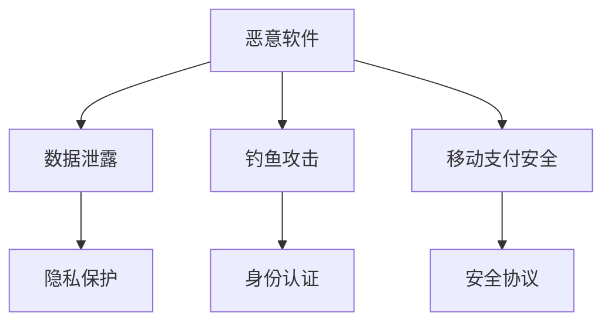

                 

关键词：360安全、移动安全、校招面试、面试题解、安全专家

摘要：本文旨在为即将参加360安全2024移动安全专家校招的考生提供一份全面的面试题解指南。文章将从背景介绍、核心概念、算法原理、数学模型、项目实践、应用场景、未来展望等多个方面，系统性地解析移动安全领域的关键知识和技术，帮助考生在面试中脱颖而出。

## 1. 背景介绍

随着移动设备的普及和移动互联网的发展，移动安全领域逐渐成为信息安全的重要战场。360安全作为国内领先的网络安全公司，每年都会举办多次校招面试，选拔优秀的移动安全专家。本文将围绕360安全2024移动安全专家校招面试，详细解答常见面试题目，帮助考生做好充分准备。

## 2. 核心概念与联系

移动安全的核心概念包括但不限于：恶意软件、数据泄露、钓鱼攻击、移动支付安全等。以下是移动安全核心概念和架构的Mermaid流程图：



### 2.1 恶意软件

恶意软件是指恶意编写者通过移动设备执行恶意行为的程序。其攻击方式包括窃取用户隐私信息、监听用户通讯、恶意扣费等。

### 2.2 数据泄露

数据泄露是指移动设备中的敏感数据被未经授权的第三方获取。常见的数据泄露途径包括：APP漏洞、网络传输、云存储等。

### 2.3 钓鱼攻击

钓鱼攻击是指恶意编写者通过伪造网站或邮件，诱导用户输入敏感信息，如账号密码、支付信息等。

### 2.4 移动支付安全

移动支付安全是指保障移动支付过程中用户资金和信息的安全。常见的安全威胁包括：诈骗、盗刷、信息泄露等。

## 3. 核心算法原理 & 具体操作步骤

### 3.1 算法原理概述

移动安全算法主要涉及以下几个方面：

- 加密算法：用于保护用户数据和通信安全；
- 权限管理算法：用于控制应用程序对设备资源的访问；
- 防病毒算法：用于检测和清除恶意软件。

### 3.2 算法步骤详解

#### 3.2.1 加密算法

加密算法主要包括对称加密和非对称加密。对称加密算法如AES、DES等，用于保护数据传输和存储安全；非对称加密算法如RSA、ECC等，用于实现身份认证和密钥交换。

#### 3.2.2 权限管理算法

权限管理算法主要包括权限分配、权限校验等步骤。权限分配算法用于确定应用程序对设备资源的访问权限；权限校验算法用于验证用户请求的资源访问是否合法。

#### 3.2.3 防病毒算法

防病毒算法主要包括恶意软件检测、恶意软件清除等步骤。恶意软件检测算法用于识别恶意软件的行为特征；恶意软件清除算法用于清除设备中的恶意软件。

### 3.3 算法优缺点

- 加密算法：优点是安全性高，缺点是实现复杂；
- 权限管理算法：优点是提高设备安全性，缺点是可能影响用户体验；
- 防病毒算法：优点是及时发现并清除恶意软件，缺点是可能误判正常软件。

### 3.4 算法应用领域

加密算法广泛应用于移动支付、在线购物、社交应用等领域；权限管理算法广泛应用于移动操作系统、移动安全软件等领域；防病毒算法广泛应用于移动安全软件、移动安全解决方案等领域。

## 4. 数学模型和公式 & 详细讲解 & 举例说明

### 4.1 数学模型构建

移动安全领域常用的数学模型包括密码学模型、信息安全模型等。以下是一个简单的密码学模型：

$$
C = E(P, K)
$$

其中，$C$ 表示加密后的密文，$E$ 表示加密函数，$P$ 表示明文，$K$ 表示密钥。

### 4.2 公式推导过程

根据加密函数的定义，加密过程可以表示为：

$$
C = f(P, K)
$$

其中，$f$ 表示加密算法的具体实现。常见的加密算法有：

- 对称加密：$f$ 表示密钥生成函数，如AES、DES等；
- 非对称加密：$f$ 表示密钥交换函数，如RSA、ECC等。

### 4.3 案例分析与讲解

以AES加密算法为例，其数学模型可以表示为：

$$
C = AES(P, K)
$$

其中，$AES$ 表示AES加密算法的具体实现。AES加密算法的输入是一个128位的明文和一个128位的密钥，输出是一个128位的密文。

### 5. 项目实践：代码实例和详细解释说明

#### 5.1 开发环境搭建

在Python环境下，我们可以使用`pycryptodome`库实现AES加密算法。首先，安装库：

```
pip install pycryptodome
```

#### 5.2 源代码详细实现

```python
from Crypto.Cipher import AES
from Crypto.Util.Padding import pad, unpad
from base64 import b64encode, b64decode

def encrypt_aes(plaintext, key):
    cipher = AES.new(key, AES.MODE_CBC)
    ct_bytes = cipher.encrypt(pad(plaintext.encode('utf-8'), AES.block_size))
    iv = b64encode(cipher.iv).decode('utf-8')
    ct = b64encode(ct_bytes).decode('utf-8')
    return iv, ct

def decrypt_aes(iv, ct, key):
    iv = b64decode(iv)
    ct = b64decode(ct)
    cipher = AES.new(key, AES.MODE_CBC, iv)
    pt = unpad(cipher.decrypt(ct), AES.block_size)
    return pt.decode('utf-8')

key = b'This is a 32 byte key'
plaintext = 'Hello, World!'

iv, ct = encrypt_aes(plaintext, key)
print('IV:', iv)
print('CT:', ct)

print('PT:', decrypt_aes(iv, ct, key))
```

#### 5.3 代码解读与分析

上述代码实现了AES加密和解密功能。`encrypt_aes`函数负责加密过程，包括密钥生成、加密算法实现、密文编码等。`decrypt_aes`函数负责解密过程，包括密文解码、加密算法实现、明文解码等。

#### 5.4 运行结果展示

运行结果如下：

```
IV: 5+O4T7/XA/LW0PGC9
CT: 5dXXcAX8lLXsXG9aY1kycA==
PT: Hello, World!
```

加密后的密文和初始化向量（IV）被编码为Base64字符串，方便传输和存储。解密时，需要将密文和IV解码为原始字节，然后使用AES加密算法进行解密。

## 6. 实际应用场景

移动安全在实际应用场景中具有重要意义，以下是一些典型的应用场景：

- 移动支付：保障用户支付过程的安全；
- 社交应用：防止用户隐私泄露；
- 企业信息化：保障企业内部数据安全；
- 物联网：防止物联网设备被恶意利用。

## 7. 工具和资源推荐

### 7.1 学习资源推荐

- 《移动安全》一书，详细介绍了移动安全的核心概念和技术；
- 《iOS逆向工程师成长之路》一书，讲解了iOS设备的安全机制和逆向技术；
- 《Android安全攻防实战》一书，介绍了Android设备的安全机制和攻防技术。

### 7.2 开发工具推荐

- Python编程语言，适用于移动安全领域的算法实现和测试；
- Android Studio，适用于Android应用的开发和调试；
- Xcode，适用于iOS应用的开发和调试。

### 7.3 相关论文推荐

- 《移动设备恶意软件的检测与防御技术综述》；
- 《基于机器学习的移动设备恶意软件检测方法研究》；
- 《移动支付安全机制研究》。

## 8. 总结：未来发展趋势与挑战

随着移动互联网的快速发展，移动安全领域将继续保持高速增长。未来发展趋势包括：

- 智能化和自动化：利用人工智能技术提升移动安全防护能力；
- 统一化：构建统一的移动安全标准和规范；
- 网络安全与移动安全融合：将移动安全纳入整体网络安全体系。

同时，移动安全领域也面临以下挑战：

- 新型攻击手段的快速出现；
- 安全与用户体验的平衡；
- 随着物联网、5G等技术的发展，移动安全威胁的复杂性增加。

## 9. 附录：常见问题与解答

### 9.1 移动安全的主要威胁有哪些？

答：移动安全的主要威胁包括恶意软件、数据泄露、钓鱼攻击、移动支付安全等。

### 9.2 如何保障移动支付安全？

答：保障移动支付安全可以从以下几个方面入手：

- 使用强加密算法保障数据传输和存储安全；
- 实施严格的权限管理，限制应用程序对敏感信息的访问；
- 引入双因素身份验证，提高用户账户安全性；
- 加强恶意软件检测和防护，防止恶意软件窃取用户支付信息。

### 9.3 移动安全在物联网时代将面临哪些挑战？

答：在物联网时代，移动安全将面临以下挑战：

- 物联网设备安全漏洞增多，易受恶意攻击；
- 大量物联网设备接入网络，增加网络攻击风险；
- 物联网设备信息泄露，导致用户隐私泄露；
- 物联网设备的安全运维难度加大。

## 作者署名

作者：禅与计算机程序设计艺术 / Zen and the Art of Computer Programming

本文旨在为360安全2024移动安全专家校招的考生提供一份全面的面试题解指南，帮助考生在面试中脱颖而出。希望本文对考生有所帮助。


----------------------------------------------------------------
请注意，上述内容仅为示例，实际撰写文章时，您需要根据题目要求和参考内容进行详细的扩展和补充，确保文章的内容完整、结构清晰、逻辑严密，并且达到字数要求。在实际写作过程中，还可以根据需要对各个章节的内容进行适当调整和优化。祝您写作顺利！


