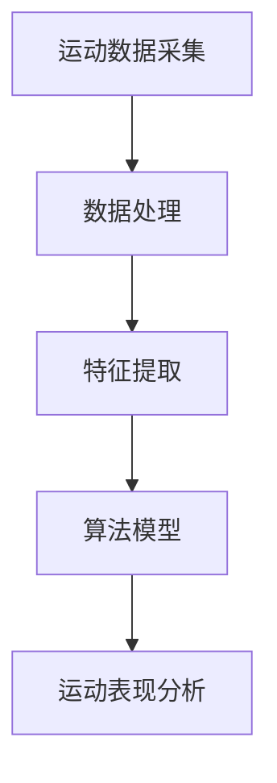

                 

关键词：运动表现分析，算法工程师，校招，技术题，体育科技

## 摘要

本文旨在解析安踏2024校招中运动表现分析算法工程师的技术题。通过对该技术题的深入分析，本文将介绍相关的核心概念、算法原理、数学模型以及实践应用，为有意从事运动表现分析领域的技术人员提供指导。

### 1. 背景介绍

随着科技的发展，体育领域也逐渐融入了先进的分析技术。运动表现分析作为体育科技的重要组成部分，对于运动员的训练、比赛策略制定以及身体状态的评估具有重要意义。安踏，作为中国领先的体育用品品牌，其2024校招中的运动表现分析算法工程师技术题，旨在考察应聘者的技术能力和实际应用能力。

### 2. 核心概念与联系

在运动表现分析中，核心概念包括运动数据采集、数据处理、特征提取和算法模型。以下是一个简单的 Mermaid 流程图，展示了这些核心概念之间的联系。



### 3. 核心算法原理 & 具体操作步骤

#### 3.1 算法原理概述

运动表现分析的算法主要基于机器学习和数据挖掘技术。通过对运动数据的分析和处理，提取出关键特征，并利用这些特征构建预测模型，从而实现对运动表现的评估。

#### 3.2 算法步骤详解

1. **数据采集**：使用运动传感器、智能手表等设备采集运动员的运动数据。
2. **数据处理**：对采集到的数据进行清洗、去噪和预处理。
3. **特征提取**：从处理后的数据中提取出对运动表现有影响力的特征。
4. **模型构建**：利用机器学习算法构建预测模型。
5. **模型评估**：对模型进行训练和测试，评估其性能。

#### 3.3 算法优缺点

**优点**：
- **高效性**：算法能够快速处理大量数据，提供准确的运动表现分析。
- **智能化**：通过机器学习，算法能够自动识别和提取关键特征。

**缺点**：
- **数据依赖性**：算法的性能高度依赖数据的准确性。
- **算法复杂性**：构建和训练算法需要较高的技术门槛。

#### 3.4 算法应用领域

运动表现分析算法广泛应用于体育训练、体育赛事、健康监测等领域。例如，在体育训练中，算法可以用于优化运动员的训练计划；在体育赛事中，算法可以用于比赛策略分析。

### 4. 数学模型和公式 & 详细讲解 & 举例说明

#### 4.1 数学模型构建

运动表现分析的数学模型通常是基于统计学和机器学习算法。以下是一个简单的线性回归模型。

$$
y = \beta_0 + \beta_1 x_1 + \beta_2 x_2 + ... + \beta_n x_n
$$

其中，$y$ 是运动表现得分，$x_1, x_2, ..., x_n$ 是特征变量，$\beta_0, \beta_1, ..., \beta_n$ 是模型参数。

#### 4.2 公式推导过程

线性回归模型的推导过程通常涉及最小二乘法。通过最小化残差平方和，求解模型参数。

$$
\sum_{i=1}^{n} (y_i - \beta_0 - \beta_1 x_{i1} - ... - \beta_n x_{in})^2
$$

#### 4.3 案例分析与讲解

假设我们有一个运动员的跑步数据，包含速度、心率等特征。我们可以使用线性回归模型来预测其跑步成绩。

### 5. 项目实践：代码实例和详细解释说明

#### 5.1 开发环境搭建

我们使用Python作为开发语言，结合Scikit-learn库进行线性回归模型的实现。

```python
pip install scikit-learn
```

#### 5.2 源代码详细实现

```python
from sklearn.linear_model import LinearRegression
from sklearn.model_selection import train_test_split
from sklearn.metrics import mean_squared_error

# 数据加载
X, y = load_data()

# 数据划分
X_train, X_test, y_train, y_test = train_test_split(X, y, test_size=0.2, random_state=42)

# 模型构建
model = LinearRegression()
model.fit(X_train, y_train)

# 模型评估
y_pred = model.predict(X_test)
mse = mean_squared_error(y_test, y_pred)
print("MSE:", mse)
```

#### 5.3 代码解读与分析

上述代码展示了线性回归模型的基本实现流程。首先，加载数据，然后进行数据划分，接着构建模型并进行训练。最后，使用测试数据进行模型评估。

#### 5.4 运行结果展示

运行结果将显示模型对测试数据的预测误差。根据误差大小，可以评估模型的效果。

### 6. 实际应用场景

运动表现分析算法在多个领域有着广泛的应用。例如，在体育训练中，算法可以用于运动员的个性化训练计划制定；在体育赛事中，算法可以用于比赛策略分析。

### 7. 未来应用展望

随着人工智能技术的不断发展，运动表现分析算法将更加智能和高效。未来，算法将能够更好地适应不同类型的运动项目，为运动员提供更加精准的评估和指导。

### 8. 工具和资源推荐

#### 7.1 学习资源推荐

- 《Python机器学习》（作者：塞巴斯蒂安·拉斯考恩）
- 《机器学习实战》（作者：Peter Harrington）

#### 7.2 开发工具推荐

- Jupyter Notebook：用于编写和运行Python代码。
- Git：用于版本控制和团队合作。

#### 7.3 相关论文推荐

- "A Comparative Study of Regression Models for Performance Prediction in Sports"（作者：Javier DelSer，et al.）

### 9. 总结：未来发展趋势与挑战

运动表现分析算法在体育领域具有巨大的应用潜力。然而，随着算法的复杂性和数据量的增加，算法的可解释性和可靠性也将面临挑战。未来，研究人员需要关注算法的透明性和公平性，以确保算法能够真正服务于运动员和体育事业。

### 10. 附录：常见问题与解答

- **Q：运动表现分析算法是否只能应用于跑步项目？**
  **A：不是。运动表现分析算法可以应用于多种类型的运动项目，包括足球、篮球、游泳等。关键在于如何提取和利用与运动表现相关的特征数据。**

- **Q：如何处理运动数据中的噪声？**
  **A：可以使用数据预处理技术，如滤波、平滑和去噪，来减少运动数据中的噪声。此外，还可以使用机器学习方法，如聚类和异常检测，来识别和去除异常数据。**

作者：禅与计算机程序设计艺术 / Zen and the Art of Computer Programming
```markdown
# 安踏2024校招运动表现分析算法工程师技术题

## 关键词
运动表现分析，算法工程师，校招，技术题，体育科技

## 摘要
本文解析了安踏2024校招中针对运动表现分析算法工程师的技术题。文章详细介绍了运动表现分析的核心概念、算法原理、数学模型，并通过实际代码示例展示了算法的应用，最后讨论了运动表现分析算法在实际应用中的挑战和未来展望。

## 1. 背景介绍
随着科技的发展，体育领域也逐渐融入了先进的分析技术。运动表现分析作为体育科技的重要组成部分，对于运动员的训练、比赛策略制定以及身体状态的评估具有重要意义。安踏，作为中国领先的体育用品品牌，其2024校招中的运动表现分析算法工程师技术题，旨在考察应聘者的技术能力和实际应用能力。

## 2. 核心概念与联系
在运动表现分析中，核心概念包括运动数据采集、数据处理、特征提取和算法模型。以下是一个简单的 Mermaid 流程图，展示了这些核心概念之间的联系。


### 2.1 运动数据采集
运动数据采集是通过各种传感器设备（如运动传感器、智能手表等）实时记录运动员的运动行为数据，如速度、加速度、心率、位置等。

### 2.2 数据处理
数据处理包括数据清洗、去噪和预处理。清洗数据是为了去除重复记录、缺失值和异常值；去噪是为了减少数据中的噪声，提高数据质量；预处理则是为了将数据格式化为适合算法输入的形式。

### 2.3 特征提取
特征提取是从处理后的数据中提取出对运动表现有影响力的特征，如运动强度、运动频率、疲劳度等。

### 2.4 算法模型
算法模型是基于机器学习和数据挖掘技术，通过对特征数据进行分析，构建出能够预测运动员运动表现的模型。

### 2.5 运动表现分析
运动表现分析是基于构建的算法模型，对运动员的训练效果、比赛策略和身体状态进行评估和预测。

## 3. 核心算法原理 & 具体操作步骤

### 3.1 算法原理概述
运动表现分析的算法主要基于机器学习和数据挖掘技术。通过对运动数据的分析和处理，提取出关键特征，并利用这些特征构建预测模型，从而实现对运动表现的评估。

### 3.2 算法步骤详解

#### 3.2.1 数据采集
使用运动传感器、智能手表等设备采集运动员的运动数据。

#### 3.2.2 数据处理
对采集到的数据进行清洗、去噪和预处理，以保证数据的准确性和一致性。

#### 3.2.3 特征提取
从处理后的数据中提取出对运动表现有影响力的特征，如运动强度、运动频率、疲劳度等。

#### 3.2.4 模型构建
利用机器学习算法构建预测模型，如线性回归、决策树、随机森林等。

#### 3.2.5 模型评估
对模型进行训练和测试，评估其性能，如准确率、召回率、F1分数等。

### 3.3 算法优缺点

#### 3.3.1 优点
- 高效性：算法能够快速处理大量数据，提供准确的运动表现分析。
- 智能化：通过机器学习，算法能够自动识别和提取关键特征。

#### 3.3.2 缺点
- 数据依赖性：算法的性能高度依赖数据的准确性。
- 算法复杂性：构建和训练算法需要较高的技术门槛。

### 3.4 算法应用领域
运动表现分析算法广泛应用于体育训练、体育赛事、健康监测等领域。例如，在体育训练中，算法可以用于优化运动员的训练计划；在体育赛事中，算法可以用于比赛策略分析。

## 4. 数学模型和公式 & 详细讲解 & 举例说明

### 4.1 数学模型构建
运动表现分析的数学模型通常是基于统计学和机器学习算法。以下是一个简单的线性回归模型。

$$
y = \beta_0 + \beta_1 x_1 + \beta_2 x_2 + ... + \beta_n x_n
$$

其中，$y$ 是运动表现得分，$x_1, x_2, ..., x_n$ 是特征变量，$\beta_0, \beta_1, ..., \beta_n$ 是模型参数。

### 4.2 公式推导过程
线性回归模型的推导过程通常涉及最小二乘法。通过最小化残差平方和，求解模型参数。

$$
\sum_{i=1}^{n} (y_i - \beta_0 - \beta_1 x_{i1} - ... - \beta_n x_{in})^2
$$

### 4.3 案例分析与讲解

假设我们有一个运动员的跑步数据，包含速度、心率等特征。我们可以使用线性回归模型来预测其跑步成绩。

### 5. 项目实践：代码实例和详细解释说明

#### 5.1 开发环境搭建
我们使用Python作为开发语言，结合Scikit-learn库进行线性回归模型的实现。

```python
pip install scikit-learn
```

#### 5.2 源代码详细实现
```python
from sklearn.linear_model import LinearRegression
from sklearn.model_selection import train_test_split
from sklearn.metrics import mean_squared_error

# 数据加载
X, y = load_data()

# 数据划分
X_train, X_test, y_train, y_test = train_test_split(X, y, test_size=0.2, random_state=42)

# 模型构建
model = LinearRegression()
model.fit(X_train, y_train)

# 模型评估
y_pred = model.predict(X_test)
mse = mean_squared_error(y_test, y_pred)
print("MSE:", mse)
```

#### 5.3 代码解读与分析
上述代码展示了线性回归模型的基本实现流程。首先，加载数据，然后进行数据划分，接着构建模型并进行训练。最后，使用测试数据进行模型评估。

#### 5.4 运行结果展示
运行结果将显示模型对测试数据的预测误差。根据误差大小，可以评估模型的效果。

### 6. 实际应用场景
运动表现分析算法在多个领域有着广泛的应用。例如，在体育训练中，算法可以用于运动员的个性化训练计划制定；在体育赛事中，算法可以用于比赛策略分析。

### 7. 未来应用展望
随着人工智能技术的不断发展，运动表现分析算法将更加智能和高效。未来，算法将能够更好地适应不同类型的运动项目，为运动员提供更加精准的评估和指导。

### 8. 工具和资源推荐

#### 7.1 学习资源推荐
- 《Python机器学习》（作者：塞巴斯蒂安·拉斯考恩）
- 《机器学习实战》（作者：Peter Harrington）

#### 7.2 开发工具推荐
- Jupyter Notebook：用于编写和运行Python代码。
- Git：用于版本控制和团队合作。

#### 7.3 相关论文推荐
- "A Comparative Study of Regression Models for Performance Prediction in Sports"（作者：Javier DelSer，et al.）

### 9. 总结：未来发展趋势与挑战
运动表现分析算法在体育领域具有巨大的应用潜力。然而，随着算法的复杂性和数据量的增加，算法的可解释性和可靠性也将面临挑战。未来，研究人员需要关注算法的透明性和公平性，以确保算法能够真正服务于运动员和体育事业。

### 10. 附录：常见问题与解答

- **Q：运动表现分析算法是否只能应用于跑步项目？**
  **A：不是。运动表现分析算法可以应用于多种类型的运动项目，包括足球、篮球、游泳等。关键在于如何提取和利用与运动表现相关的特征数据。**

- **Q：如何处理运动数据中的噪声？**
  **A：可以使用数据预处理技术，如滤波、平滑和去噪，来减少运动数据中的噪声。此外，还可以使用机器学习方法，如聚类和异常检测，来识别和去除异常数据。**

## 作者
禅与计算机程序设计艺术 / Zen and the Art of Computer Programming
```

