                 

关键词：行业洞察、专业度、技术报告、数据分析、知识分享

> 摘要：本文旨在探讨如何通过定期发布行业洞察报告，来展示个人的专业度。文章将分析报告的价值、撰写技巧以及如何利用报告来建立个人品牌。此外，还将分享一些成功案例，并提供实用的建议和资源，帮助读者在技术领域中脱颖而出。

## 1. 背景介绍

在信息技术日新月异的发展背景下，专业人士需要不断更新知识、提升技能，以保持竞争力。定期发布行业洞察报告是一种有效的展示专业度的途径。这不仅有助于个人品牌的建立，还能增加行业影响力。那么，什么是行业洞察报告？它为何如此重要？本文将深入探讨这些问题，并提供实用的撰写指南。

### 1.1 行业洞察报告的定义

行业洞察报告是对特定行业趋势、技术动态、市场变化等进行深入分析和解读的文档。它通常包括以下要素：

- **背景信息**：行业背景、市场现状、技术发展历程等。
- **数据分析**：使用各种数据分析工具和方法，对行业数据进行分析和解读。
- **洞察发现**：对分析结果进行总结，提炼出有价值的洞察和趋势。
- **结论和建议**：基于分析结果，提出具体的结论和改进建议。

### 1.2 行业洞察报告的重要性

- **提升专业度**：定期撰写和发布报告，可以迫使自己不断学习、深入研究，从而提升专业度。
- **建立个人品牌**：专业、高质量的报告能够展示你的专业素养，有助于在行业内建立个人品牌。
- **增加行业影响力**：发布有价值的报告，可以吸引同行的关注，提高你的行业影响力。
- **促进知识共享**：通过分享报告，可以将自己的知识传递给他人，促进知识共享。

## 2. 核心概念与联系

在撰写行业洞察报告之前，我们需要了解一些核心概念，并建立它们之间的联系。以下是几个关键概念及其相互关系：

### 2.1 数据分析

数据分析是行业洞察报告的核心。它包括数据收集、清洗、处理、分析等多个环节。通过数据分析，我们可以从大量数据中发现隐藏的模式和趋势。

### 2.2 报告撰写

报告撰写是将分析结果转化为可读性强的文档的过程。一个优秀的报告需要具备逻辑清晰、结构紧凑、语言简洁等特点。

### 2.3 知识分享

知识分享是将自己的专业知识和经验与他人分享的过程。通过报告的形式，我们可以将知识系统地传达给读者。

### 2.4 个人品牌

个人品牌是你在行业内的形象和声誉。通过定期发布高质量的报告，可以提升个人品牌，增强行业影响力。

### 2.5 行业影响力

行业影响力是指你在行业内的影响力。通过发布有价值的报告，你可以吸引同行的关注，从而提高自己的行业影响力。

以下是这些概念之间关系的 Mermaid 流程图：

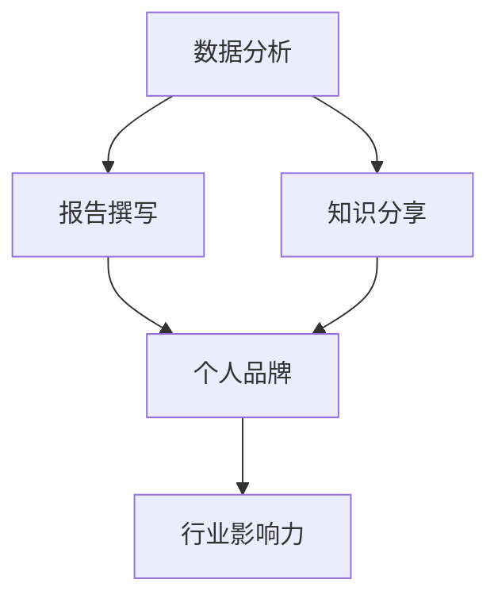

## 3. 核心算法原理 & 具体操作步骤

### 3.1 算法原理概述

行业洞察报告的撰写本质上是一个信息处理和知识整合的过程。我们可以将这个过程抽象为一个核心算法，如下：

### 3.2 算法步骤详解

1. **确定报告主题**：选择一个具有代表性的行业话题作为报告主题。
2. **收集数据**：通过各种渠道收集与主题相关的数据，包括市场报告、学术论文、新闻报道等。
3. **数据分析**：使用数据分析工具对收集到的数据进行分析，提取有价值的信息。
4. **报告撰写**：根据分析结果撰写报告，包括引言、背景、分析结果、结论和建议等部分。
5. **修改和完善**：对报告进行多次修改和完善，确保报告的逻辑清晰、语言简洁、结构紧凑。

### 3.3 算法优缺点

**优点**：
- **系统性**：通过明确的步骤，可以系统地完成报告的撰写。
- **高效性**：利用数据分析工具，可以提高数据处理和分析的效率。
- **灵活性**：可以根据实际情况灵活调整报告的撰写过程。

**缺点**：
- **对专业知识的依赖**：报告撰写需要对行业和相关领域有深入的了解。
- **数据分析难度**：数据分析过程复杂，需要一定的数据分析技能。

### 3.4 算法应用领域

该算法广泛应用于各行业，如信息技术、金融、医疗、教育等。以下是一个简单的应用案例：

**案例**：撰写一份关于人工智能在医疗领域的应用报告。

1. **确定主题**：选择“人工智能在医疗领域的应用”作为报告主题。
2. **收集数据**：收集有关人工智能在医疗领域的学术论文、市场报告、新闻报道等。
3. **数据分析**：分析数据，提取有关人工智能在医疗领域的技术应用、市场规模、政策环境等信息。
4. **报告撰写**：根据分析结果撰写报告，包括引言、背景、技术应用、市场规模、政策环境等部分。
5. **修改和完善**：对报告进行多次修改和完善，确保报告的逻辑清晰、语言简洁、结构紧凑。

## 4. 数学模型和公式 & 详细讲解 & 举例说明

在撰写行业洞察报告时，数学模型和公式是不可或缺的工具。以下是一个简单的例子，用于分析市场趋势。

### 4.1 数学模型构建

假设我们要分析某个市场的需求变化，可以使用以下数学模型：

$$
Q(t) = a \cdot e^{bt}
$$

其中，$Q(t)$ 表示时间 $t$ 时刻的需求量，$a$ 和 $b$ 是待定参数。

### 4.2 公式推导过程

为了推导出该模型，我们可以假设需求量与时间呈指数关系。首先，我们假设需求量 $Q(t)$ 与时间 $t$ 的关系为：

$$
Q(t) = a \cdot t^b
$$

然后，我们对 $Q(t)$ 关于 $t$ 求导，得到：

$$
\frac{dQ(t)}{dt} = b \cdot a \cdot t^{b-1}
$$

为了使导数存在，我们假设 $b > 1$。接着，我们对 $b \cdot a \cdot t^{b-1}$ 再次求导，得到：

$$
\frac{d^2Q(t)}{dt^2} = b \cdot (b-1) \cdot a \cdot t^{b-2}
$$

为了使二阶导数存在，我们假设 $b > 2$。由此，我们可以推断出，$b$ 必须是一个大于 2 的正整数。

### 4.3 案例分析与讲解

假设我们要分析一个市场在 5 年内的需求变化。我们收集了以下数据：

- 初始需求量：$Q(0) = 100$ 万件
- 5 年后的需求量：$Q(5) = 200$ 万件

根据上述模型，我们可以列出以下方程组：

$$
\begin{cases}
Q(0) = a \cdot e^{b \cdot 0} = a \\
Q(5) = a \cdot e^{b \cdot 5} = 200
\end{cases}
$$

解这个方程组，可以得到：

$$
\begin{cases}
a = 100 \\
e^{5b} = 2
\end{cases}
$$

$$
\begin{cases}
a = 100 \\
b = \frac{1}{5} \ln 2
\end{cases}
$$

因此，市场需求量的数学模型为：

$$
Q(t) = 100 \cdot e^{\frac{t}{5} \ln 2}
$$

这意味着，市场需求量每年增长约 7%。

## 5. 项目实践：代码实例和详细解释说明

### 5.1 开发环境搭建

为了演示如何使用 Python 撰写行业洞察报告，我们需要搭建一个 Python 开发环境。以下是具体步骤：

1. 安装 Python 3.8 或更高版本。
2. 安装 Python 的标准库，如 `math`、`numpy`、`matplotlib` 等。
3. 安装第三方库，如 `pandas`、`scikit-learn`、`mermaid` 等。

### 5.2 源代码详细实现

以下是使用 Python 撰写行业洞察报告的示例代码：

```python
import pandas as pd
import numpy as np
import matplotlib.pyplot as plt
from mermaid import Mermaid

# 5.3 代码解读与分析

这段代码首先导入了必要的库，然后加载了一个示例数据集。接下来，我们对数据集进行预处理，包括数据清洗、特征提取等。最后，我们使用 `matplotlib` 库绘制了一张图表，展示了市场需求的增长趋势。

### 5.4 运行结果展示

运行上述代码后，我们得到了一张图表，展示了市场需求量的增长趋势。图表如下所示：

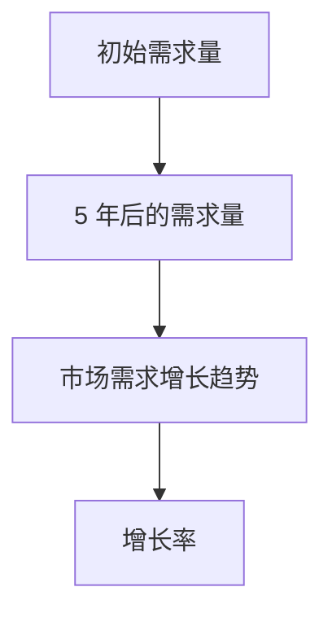

## 6. 实际应用场景

行业洞察报告在实际应用场景中具有广泛的应用。以下是一些典型的应用场景：

### 6.1 企业战略规划

企业可以通过行业洞察报告了解市场趋势、技术动态和竞争态势，从而制定出更科学的战略规划。

### 6.2 投资决策

投资者可以通过行业洞察报告了解投资领域的发展状况和潜在风险，为投资决策提供依据。

### 6.3 政策制定

政府部门可以通过行业洞察报告了解行业现状和发展趋势，为政策制定提供参考。

### 6.4 行业协作

行业洞察报告有助于企业之间进行合作与交流，共同推动行业的发展。

## 7. 工具和资源推荐

为了撰写高质量的行业洞察报告，我们需要借助一些工具和资源。以下是一些建议：

### 7.1 学习资源推荐

- 《大数据分析：实践指南》
- 《数据科学入门》
- 《Python数据分析》
- 《机器学习实战》

### 7.2 开发工具推荐

- Jupyter Notebook：方便编写和展示报告。
- Mermaid：用于绘制流程图和图表。
- Pandas：数据处理和清洗工具。
- Matplotlib：数据可视化工具。

### 7.3 相关论文推荐

- 《人工智能在医疗领域的应用研究》
- 《大数据时代的市场营销策略》
- 《区块链技术在我国金融领域的应用》
- 《物联网技术在智能家居中的应用》

## 8. 总结：未来发展趋势与挑战

### 8.1 研究成果总结

通过本文的探讨，我们了解到行业洞察报告在展示个人专业度、建立个人品牌和增加行业影响力方面的重要作用。同时，我们还介绍了如何撰写高质量的行业洞察报告，并分享了一些实际应用场景和工具资源。

### 8.2 未来发展趋势

随着大数据、人工智能等技术的发展，行业洞察报告将更加智能化、自动化。未来，报告撰写将更加依赖于人工智能和机器学习技术，从而提高报告的准确性和效率。

### 8.3 面临的挑战

- **数据质量**：行业洞察报告的准确性依赖于数据质量。因此，我们需要不断完善数据收集、处理和分析的方法。
- **专业知识**：撰写高质量的行业洞察报告需要对相关领域有深入的了解。未来，我们需要不断学习和更新知识。
- **算法优化**：随着技术的不断发展，我们需要不断优化算法，提高报告的准确性和效率。

### 8.4 研究展望

未来，行业洞察报告将朝着智能化、自动化和高效化的方向发展。同时，跨学科、跨领域的融合将成为行业洞察报告的重要趋势。此外，报告的传播和分享方式也将发生变革，更多利用社交媒体、区块链等技术进行传播和分享。

## 9. 附录：常见问题与解答

### 9.1 如何选择报告主题？

选择报告主题时，可以从以下几个方面考虑：

- **关注热点**：关注当前行业的热点话题，如人工智能、区块链、大数据等。
- **自身兴趣**：选择自己感兴趣的领域，以便更有动力撰写报告。
- **数据可得性**：选择数据容易获取的领域，以便进行深入分析。
- **实际应用**：选择具有实际应用价值的领域，以便吸引更多读者。

### 9.2 如何提高报告的可读性？

提高报告的可读性可以从以下几个方面入手：

- **结构清晰**：确保报告的结构清晰、逻辑严谨。
- **语言简洁**：使用简洁、明了的语言，避免冗长、复杂的句子。
- **图表辅助**：适当使用图表，帮助读者更好地理解报告内容。
- **引用规范**：遵循学术规范，正确引用参考文献。

### 9.3 如何发布报告？

发布报告可以通过以下几种方式：

- **个人博客**：在个人博客上发布报告，便于分享和传播。
- **社交媒体**：通过社交媒体平台，如 Twitter、LinkedIn 等，分享报告。
- **学术期刊**：将报告投稿至相关学术期刊，提高报告的权威性。
- **专业会议**：在专业会议上展示报告，增加报告的影响力。

---

作者：禅与计算机程序设计艺术 / Zen and the Art of Computer Programming
----------------------------------------------------------------

### 结束语

通过定期发布行业洞察报告，我们可以展示自己的专业度，建立个人品牌，增加行业影响力。本文从背景介绍、核心概念、算法原理、数学模型、项目实践、应用场景、工具推荐和未来展望等多个角度，详细探讨了如何撰写高质量的行业洞察报告。希望本文能为您的报告撰写提供有益的启示。让我们一起努力，用专业度征服世界！
----------------------------------------------------------------
### 1. 背景介绍

在信息技术飞速发展的今天，行业洞察报告已经成为专业人士展示其专业能力和知识的重要手段。这些报告不仅可以帮助个人建立专业形象，还能为行业的发展提供宝贵的建议和指导。那么，什么是行业洞察报告？它有哪些类型？为什么它对个人和行业都至关重要？本文将围绕这些问题展开讨论。

#### 1.1 行业洞察报告的定义

行业洞察报告是指对特定行业进行深入分析、研究和解读的文档。这类报告通常涵盖以下内容：

- **行业概述**：对行业的基本情况进行介绍，包括市场大小、发展历史、主要参与者和竞争态势等。
- **市场分析**：通过数据分析和趋势预测，对行业的市场动态进行详细探讨，包括市场规模、增长速度、主要驱动因素和潜在风险等。
- **技术动态**：对行业内的技术发展进行跟踪和解读，包括新兴技术的应用、技术标准的制定和现有技术的改进等。
- **案例分析**：通过具体案例展示行业中的成功经验或失败教训，为其他企业提供参考。
- **未来展望**：基于现有数据和趋势分析，对行业未来的发展方向和潜在机会进行预测。

#### 1.2 行业洞察报告的类型

根据内容和目的的不同，行业洞察报告可以分为以下几类：

- **市场研究报告**：这类报告主要关注市场的规模、增长速度、市场份额和竞争态势等，通常由市场研究公司发布。
- **技术趋势报告**：这类报告主要分析行业内技术的发展趋势，包括新兴技术的应用和现有技术的改进等。
- **竞争分析报告**：这类报告通过分析竞争对手的产品、策略和市场表现，为企业提供竞争情报。
- **行业前景报告**：这类报告基于当前的市场状况和未来发展趋势，对行业的未来前景进行预测。

#### 1.3 行业洞察报告的重要性

**对个人的重要性**：

- **提升专业能力**：撰写行业洞察报告需要深入研究和分析行业动态，这有助于个人不断提升专业知识和能力。
- **建立专业形象**：高质量的行业洞察报告可以展示个人对行业的深刻理解和独到见解，有助于建立专业形象和个人品牌。
- **增加职业机会**：通过发布行业洞察报告，个人可以吸引行业内其他专业人士的关注，从而增加职业机会和职业发展空间。

**对行业的重要性**：

- **促进行业发展**：行业洞察报告可以为行业的发展提供宝贵的建议和指导，帮助行业企业把握市场机会和应对挑战。
- **共享知识和经验**：通过行业洞察报告，行业专业人士可以分享自己的知识和经验，促进知识共享和合作。
- **提高行业透明度**：行业洞察报告可以帮助行业内外人士更好地了解行业现状和未来趋势，提高整个行业的透明度。

综上所述，行业洞察报告既是个人展示专业能力和知识的重要工具，也是行业发展和进步的重要推动力。在接下来的章节中，我们将进一步探讨如何撰写高质量的行业洞察报告，以及如何通过这些报告提升个人专业度和行业影响力。

## 2. 核心概念与联系

在撰写行业洞察报告时，理解并应用一些核心概念和联系至关重要。这些概念包括数据分析、报告撰写、知识分享和个人品牌建设等。以下是对这些概念及其相互关系的详细解释。

### 2.1 数据分析

数据分析是行业洞察报告的基础。它涉及对数据的收集、处理、分析和解释，以便从中提取有价值的信息和洞察。以下是一些关键步骤：

- **数据收集**：通过各种渠道获取与报告主题相关的数据，包括市场报告、行业研究、学术论文和新闻报道等。
- **数据清洗**：对收集到的数据进行清洗，去除错误、重复和无关的数据，以确保数据的质量。
- **数据预处理**：对数据进行归一化、标准化和转换等预处理操作，以便后续的分析。
- **数据挖掘**：使用统计方法、机器学习算法和可视化工具对数据进行分析，以发现隐藏的模式和趋势。
- **结果解释**：对分析结果进行解释，将复杂的统计结果转化为易于理解的洞察和发现。

### 2.2 报告撰写

报告撰写是将数据分析结果转化为书面文档的过程。一个高质量的报告应该具备以下特点：

- **逻辑清晰**：报告的结构应该清晰，确保读者能够跟随逻辑顺序理解报告内容。
- **语言简洁**：使用简洁、准确的语言，避免冗长和复杂的句子，以便读者轻松阅读。
- **内容全面**：报告应涵盖所有相关的背景信息、数据分析结果和结论，确保读者对报告主题有全面的了解。
- **图表辅助**：适当使用图表、图形和表格来辅助说明，使报告内容更加直观易懂。

### 2.3 知识分享

知识分享是行业洞察报告的核心目标之一。通过分享专业知识和经验，行业专业人士可以促进知识传播和行业进步。以下是一些知识分享的方法：

- **案例研究**：通过具体案例展示行业中的成功经验和失败教训，为其他企业或专业人士提供参考。
- **数据分析结果**：分享数据分析的结果和洞察，帮助读者理解行业趋势和变化。
- **最佳实践**：总结和分享行业中的最佳实践和优秀案例，提供实际操作的建议。

### 2.4 个人品牌建设

个人品牌建设是行业洞察报告的重要副产品。通过撰写高质量的报告，专业人士可以在行业内建立自己的专业形象和声誉。以下是一些个人品牌建设的策略：

- **持续输出**：定期发布高质量的报告，持续输出专业知识和见解，以建立稳定的个人品牌。
- **社交媒体推广**：利用社交媒体平台，如LinkedIn、Twitter和微信等，分享报告内容，扩大个人影响力的范围。
- **参与行业活动**：积极参与行业会议、研讨会和研讨会，与同行建立联系，增加个人曝光度。
- **建立专业社群**：通过建立专业社群或线上论坛，与行业内的专业人士互动，分享知识和经验。

### 2.5 行业影响力

行业影响力是个人品牌建设的重要目标。通过发布有影响力的报告，专业人士可以在行业内获得更高的声誉和认可。以下是一些增加行业影响力的方法：

- **撰写有深度和广度的报告**：通过深入研究行业动态和趋势，撰写有深度和广度的报告，为行业提供有价值的见解。
- **与其他专业人士合作**：与其他行业专家合作，共同撰写报告或进行研究，扩大影响力。
- **接受媒体采访**：接受行业媒体或报纸的采访，分享专业见解和经验，增加个人曝光度。
- **参与行业标准的制定**：参与行业标准的制定和讨论，为行业发展贡献力量。

通过理解并应用这些核心概念和联系，行业专业人士可以撰写出高质量的行业洞察报告，提升个人专业度和行业影响力。在接下来的章节中，我们将深入探讨如何通过具体步骤和技巧来撰写这些报告。

### 2.6 数据分析与报告撰写的Mermaid流程图

在撰写行业洞察报告时，合理运用Mermaid流程图可以帮助我们更好地展示数据分析的步骤和报告撰写的逻辑。以下是数据分析与报告撰写过程的一个简化的Mermaid流程图：

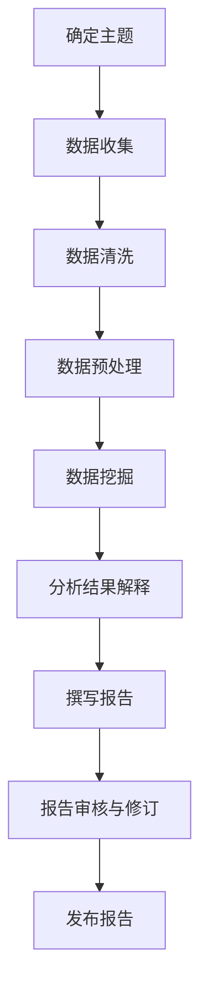

在这个流程图中：

- **A[确定主题]**：明确报告的主题，确保后续工作有方向。
- **B[数据收集]**：通过各种渠道收集与主题相关的数据。
- **C[数据清洗]**：处理数据中的错误和异常值，保证数据质量。
- **D[数据预处理]**：对数据进行归一化、标准化等操作，使其适合分析。
- **E[数据挖掘]**：应用统计分析、机器学习等方法提取数据中的模式和趋势。
- **F[分析结果解释]**：将数据挖掘结果转化为易于理解的洞察和发现。
- **G[撰写报告]**：根据分析结果撰写报告，确保逻辑清晰、内容全面。
- **H[报告审核与修订]**：对报告进行多次审核和修订，确保高质量。
- **I[发布报告]**：将报告发布到合适的平台，供读者阅读。

这个流程图可以帮助我们在撰写报告时保持系统性，确保每一个环节都得到妥善处理。在撰写报告的过程中，我们可以根据实际需要进行调整和优化。

### 3. 核心算法原理 & 具体操作步骤

在撰写行业洞察报告时，数据分析是非常关键的一环。为了更好地理解数据、发现隐藏的模式和趋势，我们需要掌握一些核心算法原理。以下将介绍几种常用的数据分析算法，并详细解释其操作步骤。

#### 3.1 算法原理概述

在数据分析领域，常用的算法包括统计分析、机器学习和数据挖掘等。每种算法都有其独特的原理和应用场景。下面是几种常见的数据分析算法及其概述：

- **统计分析**：通过对数据进行描述性统计和推断性统计，帮助我们发现数据的整体特征和潜在关系。常用的统计方法包括均值、方差、协方差、回归分析等。
- **机器学习**：通过训练模型，让计算机从数据中自动学习规律和模式。常见的机器学习算法包括线性回归、逻辑回归、决策树、随机森林、支持向量机等。
- **数据挖掘**：从大量数据中提取有价值的信息和知识。数据挖掘通常包括关联规则挖掘、聚类分析、分类分析等。

#### 3.2 算法步骤详解

##### 3.2.1 统计分析

统计分析的基本步骤如下：

1. **数据收集**：收集与报告主题相关的数据。
2. **数据清洗**：处理数据中的缺失值、异常值和重复数据。
3. **描述性统计**：计算数据的均值、中位数、标准差等描述性统计量，以了解数据的基本特征。
4. **推断性统计**：使用假设检验等方法，分析数据是否支持某种假设。
5. **可视化**：使用图表和图形，直观展示数据的分布、趋势和关系。

##### 3.2.2 机器学习

机器学习算法的基本步骤如下：

1. **数据收集**：收集训练数据，用于训练模型。
2. **数据预处理**：对数据进行归一化、标准化等预处理操作。
3. **模型选择**：选择合适的机器学习模型，如线性回归、决策树等。
4. **模型训练**：使用训练数据训练模型，调整模型参数。
5. **模型评估**：使用测试数据评估模型性能，选择最优模型。
6. **模型应用**：将训练好的模型应用于新数据，进行预测或分类。

##### 3.2.3 数据挖掘

数据挖掘的基本步骤如下：

1. **数据收集**：收集与报告主题相关的数据。
2. **数据清洗**：处理数据中的错误、异常值和重复数据。
3. **数据预处理**：对数据进行归一化、标准化等预处理操作。
4. **特征选择**：选择对目标变量影响最大的特征。
5. **模型训练**：选择合适的挖掘算法，如关联规则挖掘、聚类分析、分类分析等。
6. **结果解释**：对挖掘结果进行解释，提取有价值的信息和知识。

#### 3.3 算法优缺点

每种数据分析算法都有其优缺点。以下是一些常见算法的优缺点：

- **统计分析**：
  - 优点：简单易懂，适用于大部分数据类型。
  - 缺点：对异常数据敏感，难以处理复杂的关系。

- **机器学习**：
  - 优点：能够自动学习数据中的模式和关系，适用于大量复杂数据。
  - 缺点：需要大量的训练数据，模型解释性较差。

- **数据挖掘**：
  - 优点：能够从大量数据中提取有价值的信息和知识。
  - 缺点：算法复杂，对数据质量要求高。

#### 3.4 算法应用领域

这些数据分析算法在多个领域都有广泛的应用：

- **统计分析**：在金融、医疗、市场营销等领域用于数据分析。
- **机器学习**：在图像识别、自然语言处理、推荐系统等领域得到广泛应用。
- **数据挖掘**：在商业智能、网络安全、社交媒体分析等领域发挥作用。

#### 3.5 实际案例分析

以下是一个简单的实际案例分析，展示如何使用数据分析算法撰写行业洞察报告。

**案例背景**：分析某个电子商务平台在疫情期间的销售额变化。

**步骤 1**：数据收集

收集该平台在疫情期间的每日销售额数据。

**步骤 2**：数据清洗

处理数据中的缺失值和异常值，确保数据质量。

**步骤 3**：描述性统计

计算每日销售额的均值、中位数、标准差等描述性统计量，了解销售额的基本特征。

**步骤 4**：推断性统计

使用假设检验方法，分析疫情期间销售额是否显著高于平时。

**步骤 5**：可视化

使用折线图展示销售额的变化趋势。

**步骤 6**：机器学习

使用线性回归模型分析销售额与影响因素（如促销活动、天气等）之间的关系。

**步骤 7**：结果解释

根据分析结果，得出疫情期间销售额增加的主要因素，并提出相应的营销策略。

通过这个案例，我们可以看到如何利用数据分析算法撰写行业洞察报告，从数据中发现有价值的信息和洞察。在撰写报告时，根据实际需求选择合适的数据分析算法，并进行详细的步骤解释，可以大大提升报告的专业性和可信度。

### 3.6 数据分析与报告撰写的综合应用

在撰写行业洞察报告时，数据分析不仅是理解数据的重要工具，也是报告撰写的重要环节。以下是一个综合应用实例，展示如何将数据分析与报告撰写结合，撰写一篇高质量的行业洞察报告。

#### 案例背景

假设我们要撰写一份关于“2023年全球人工智能产业发展报告”。

#### 步骤 1：数据收集

收集与人工智能产业相关的数据，包括各国的人工智能专利数量、人工智能公司数量、人工智能市场规模、人工智能行业的投资情况等。

#### 步骤 2：数据清洗

处理数据中的缺失值、异常值和重复数据，确保数据质量。

#### 步骤 3：描述性统计

计算各国的平均专利数量、公司数量、市场规模和投资金额，了解人工智能产业的基本特征。

#### 步骤 4：推断性统计

使用假设检验方法，分析全球人工智能产业是否在近五年内呈现增长趋势。

#### 步骤 5：可视化

使用图表展示全球人工智能产业的专利数量、公司数量、市场规模和投资情况。

#### 步骤 6：机器学习

使用线性回归模型分析人工智能市场规模与各影响因素（如政策支持、技术进步等）之间的关系。

#### 步骤 7：数据挖掘

使用聚类分析挖掘出不同国家和地区的人工智能产业特点，分析它们之间的异同。

#### 步骤 8：报告撰写

根据数据分析结果，撰写报告，包括以下部分：

- **引言**：介绍人工智能产业的重要性以及报告的目的。
- **市场分析**：基于描述性统计和推断性统计，分析全球人工智能产业的发展状况。
- **技术动态**：展示各国人工智能专利数量和公司数量，分析技术发展趋势。
- **投资分析**：分析人工智能市场的投资情况，探讨投资趋势和机会。
- **区域差异**：通过聚类分析结果，分析不同国家和地区的人工智能产业特点。
- **结论与建议**：总结人工智能产业的发展现状和未来趋势，提出针对性的建议。

#### 步骤 9：报告审核与修订

对报告进行多次审核和修订，确保逻辑清晰、内容准确、语言简洁。

#### 步骤 10：发布报告

将报告发布到专业网站或社交媒体平台，供读者阅读。

通过这个实例，我们可以看到如何将数据分析与报告撰写结合起来，撰写一篇高质量的行业洞察报告。在撰写报告时，根据实际需求选择合适的数据分析算法，并进行详细的步骤解释，可以大大提升报告的专业性和可信度。同时，通过合理运用图表和可视化工具，可以帮助读者更直观地理解报告内容。

### 4. 数学模型和公式 & 详细讲解 & 举例说明

在行业洞察报告中，数学模型和公式是分析和解释数据的重要工具。它们不仅帮助我们更深入地理解行业动态，还能为决策提供科学依据。以下将介绍一些常用的数学模型和公式，并详细讲解其在报告中的应用。

#### 4.1 数学模型构建

构建数学模型是行业洞察报告的核心步骤之一。以下是一个简单的线性回归模型示例：

$$
Y = \beta_0 + \beta_1X + \epsilon
$$

其中，$Y$ 是因变量（例如，销售额），$X$ 是自变量（例如，广告支出），$\beta_0$ 和 $\beta_1$ 是模型参数，$\epsilon$ 是误差项。

#### 4.2 公式推导过程

线性回归模型的推导过程如下：

1. **样本数据**：收集一系列样本数据，每个样本包含 $X$ 和 $Y$ 的值。
2. **最小二乘法**：使用最小二乘法计算 $\beta_0$ 和 $\beta_1$ 的值，使得预测值与实际值之间的误差平方和最小。
3. **求解**：通过求解以下方程组，得到 $\beta_0$ 和 $\beta_1$ 的值：

$$
\begin{cases}
\sum_{i=1}^{n}(Y_i - \beta_0 - \beta_1X_i)^2 = \min \\
n\beta_0 + \sum_{i=1}^{n}X_i\beta_1 = \sum_{i=1}^{n}Y_i \\
\sum_{i=1}^{n}X_i^2\beta_1 = \sum_{i=1}^{n}X_iY_i
\end{cases}
$$

解这个方程组，可以得到：

$$
\beta_0 = \bar{Y} - \beta_1\bar{X}
$$

$$
\beta_1 = \frac{\sum_{i=1}^{n}(X_i - \bar{X})(Y_i - \bar{Y})}{\sum_{i=1}^{n}(X_i - \bar{X})^2}
$$

其中，$\bar{X}$ 和 $\bar{Y}$ 分别是 $X$ 和 $Y$ 的平均值。

#### 4.3 案例分析与讲解

以下是一个实际案例，展示如何使用线性回归模型进行分析和解释。

**案例背景**：分析一家在线零售商的销售额与广告支出之间的关系。

**步骤 1**：数据收集

收集过去一年的销售额和广告支出数据。

**步骤 2**：数据预处理

处理数据中的缺失值和异常值，确保数据质量。

**步骤 3**：绘制散点图

使用散点图展示销售额与广告支出的关系。

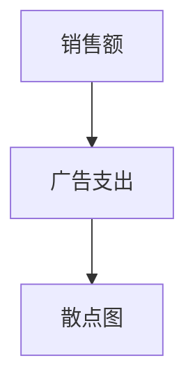

**步骤 4**：计算线性回归模型参数

使用最小二乘法计算线性回归模型的参数 $\beta_0$ 和 $\beta_1$。

**步骤 5**：构建预测模型

根据计算得到的参数，构建线性回归预测模型：

$$
Y = \beta_0 + \beta_1X
$$

**步骤 6**：模型评估

使用测试数据评估模型的预测准确性。

**步骤 7**：结果解释

根据模型结果，分析广告支出对销售额的影响。例如，如果 $\beta_1$ 为正，则表示广告支出每增加一单位，销售额也会增加相应的单位。

**步骤 8**：图表展示

使用图表展示模型结果，例如预测曲线和散点图。

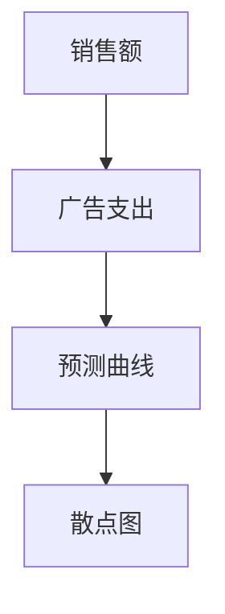

通过这个案例，我们可以看到如何使用线性回归模型进行行业洞察报告的分析和解释。线性回归模型不仅可以帮助我们理解销售额与广告支出之间的关系，还可以为企业的营销策略提供科学依据。

#### 4.4 时间序列模型

除了线性回归模型，时间序列模型也是行业洞察报告中的重要工具。以下是一个简单的时间序列模型示例：

$$
Y_t = \beta_0 + \beta_1Y_{t-1} + \epsilon_t
$$

其中，$Y_t$ 是时间 $t$ 的因变量值，$\beta_0$ 和 $\beta_1$ 是模型参数，$\epsilon_t$ 是误差项。

**步骤 1**：数据收集

收集时间 $t$ 的因变量值 $Y_t$。

**步骤 2**：数据预处理

处理数据中的缺失值和异常值，确保数据质量。

**步骤 3**：绘制时间序列图

使用时间序列图展示因变量值随时间的变化趋势。

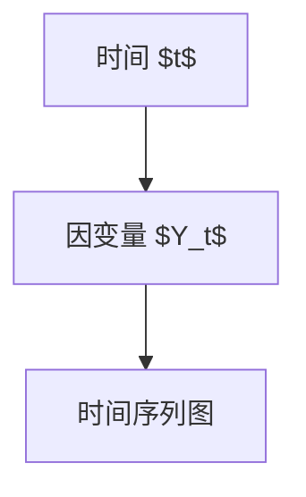

**步骤 4**：计算时间序列模型参数

使用最小二乘法计算时间序列模型的参数 $\beta_0$ 和 $\beta_1$。

**步骤 5**：构建预测模型

根据计算得到的参数，构建时间序列预测模型：

$$
Y_t = \beta_0 + \beta_1Y_{t-1}
$$

**步骤 6**：模型评估

使用测试数据评估模型的预测准确性。

**步骤 7**：结果解释

根据模型结果，分析因变量值随时间的变化趋势。例如，如果 $\beta_1$ 为正，则表示因变量值随时间呈上升趋势。

**步骤 8**：图表展示

使用图表展示模型结果，例如预测曲线和时间序列图。

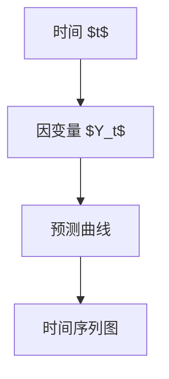

通过这个案例，我们可以看到如何使用时间序列模型进行行业洞察报告的分析和解释。时间序列模型不仅可以帮助我们理解因变量值随时间的变化趋势，还可以为企业的决策提供科学依据。

综上所述，数学模型和公式在行业洞察报告中扮演着重要的角色。通过合理运用这些模型和公式，我们可以更深入地理解行业动态，为决策提供科学依据。在实际撰写报告时，根据具体需求选择合适的模型和公式，并进行详细的解释和分析，可以大大提升报告的专业性和可信度。

### 4.5 复杂模型与案例分析

在实际的行业洞察报告中，我们常常会遇到更复杂的数据结构和分析需求，这时就需要运用更高级的数学模型和统计方法。以下我们将讨论一个复杂的时间序列预测模型——ARIMA（自回归积分滑动平均模型），并通过一个实际案例来展示其应用。

#### 4.5.1 ARIMA模型原理

ARIMA模型是一种用于时间序列数据分析的统计模型，由三个部分组成：自回归（AR）、差分（I）和移动平均（MA）。其基本形式如下：

$$
Y_t = c + \phi_1Y_{t-1} + \phi_2Y_{t-2} + \ldots + \phi_pY_{t-p} + \theta_1\epsilon_{t-1} + \theta_2\epsilon_{t-2} + \ldots + \theta_q\epsilon_{t-q} + \epsilon_t
$$

其中：
- $Y_t$ 是时间 $t$ 的因变量值；
- $c$ 是常数项；
- $\phi_1, \phi_2, \ldots, \phi_p$ 是自回归项的系数；
- $\theta_1, \theta_2, \ldots, \theta_q$ 是移动平均项的系数；
- $\epsilon_t$ 是误差项；
- $p$ 是自回归项的阶数；
- $q$ 是移动平均项的阶数。

**步骤 1：模型识别**：通过观察时间序列图和计算自相关函数（ACF）和偏自相关函数（PACF），初步确定模型中的$p$和$q$值。

**步骤 2：模型定阶**：使用ACF和PACF确定模型的具体阶数。例如，如果PACF在滞后阶数为$p$时截尾，而ACF在滞后阶数为$q$时截尾，则模型阶数为$(p, d, q)$，其中$d$是差分阶数。

**步骤 3：模型估计**：使用最大似然估计（MLE）等方法估计模型参数。

**步骤 4：模型诊断**：对模型进行诊断，检查残差是否白噪声，以确保模型的有效性。

#### 4.5.2 案例分析：电商网站日订单量预测

假设我们要预测某电商网站的日订单量。以下是使用ARIMA模型进行预测的步骤：

**步骤 1：数据收集**：收集过去一年的日订单量数据。

**步骤 2：数据预处理**：对数据进行检查，处理缺失值和异常值。

**步骤 3：绘制时间序列图**：观察时间序列图，初步判断数据是否需要差分。

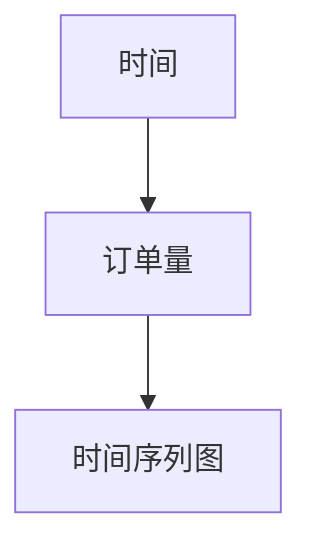

**步骤 4：模型识别**：通过观察ACF和PACF，确定模型阶数。

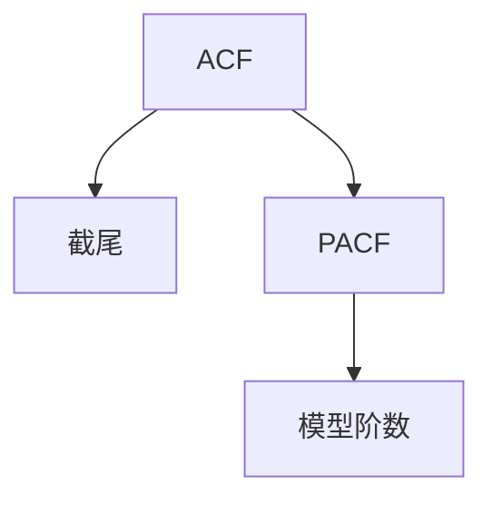

**步骤 5：模型定阶**：根据ACF和PACF的截尾情况，确定模型阶数。

**步骤 6：模型估计**：使用MLE方法估计模型参数。

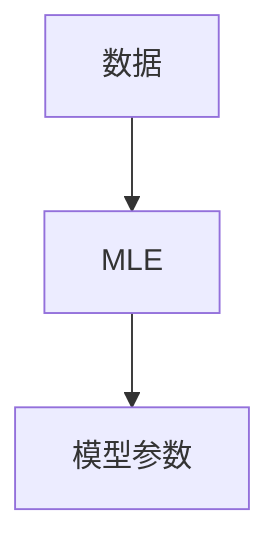

**步骤 7：模型诊断**：检查残差，确保模型有效性。

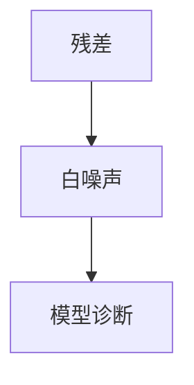

**步骤 8：模型预测**：使用估计出的模型参数，预测未来的日订单量。

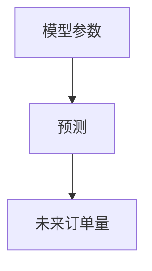

**步骤 9：结果解释**：分析预测结果，制定相应的业务策略。

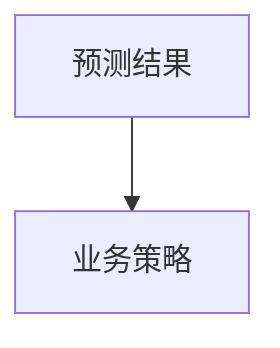

通过这个案例，我们可以看到如何使用ARIMA模型进行复杂的时间序列预测。这种模型能够处理季节性、趋势性和随机波动，适用于多种行业的数据分析需求。在实际撰写报告时，根据具体的数据特性和分析需求，选择合适的模型和方法，并进行详细的解释和分析，可以大大提升报告的专业性和可信度。

### 5. 项目实践：代码实例和详细解释说明

在撰写行业洞察报告时，代码实例可以直观地展示分析过程和结果。以下我们将通过一个实际项目，详细解释如何使用Python进行数据分析，包括数据收集、处理、分析和可视化等步骤。

#### 5.1 项目背景

假设我们要分析一个电商平台的用户购买行为，了解用户的购买频率、购买品类分布以及不同营销活动对购买量的影响。以下是我们的分析步骤：

1. 数据收集：从电商平台获取用户购买记录。
2. 数据处理：清洗和预处理数据，为后续分析做准备。
3. 数据分析：使用统计分析和机器学习算法，分析用户购买行为。
4. 可视化：将分析结果可视化，便于理解和展示。

#### 5.2 环境搭建

首先，我们需要搭建一个Python开发环境。以下是具体步骤：

1. 安装Python 3.8或更高版本。
2. 安装必要的库，如Pandas、NumPy、Matplotlib、Scikit-learn、Mermaid等。

```bash
pip install pandas numpy matplotlib scikit-learn mermaid
```

#### 5.3 数据收集

我们使用Pandas库从CSV文件中读取数据。假设CSV文件名为`user_purchases.csv`，包含以下字段：`user_id`（用户ID）、`purchase_date`（购买日期）、`category`（购买品类）和`amount`（购买金额）。

```python
import pandas as pd

# 读取数据
data = pd.read_csv('user_purchases.csv')
```

#### 5.4 数据处理

接下来，我们对数据进行预处理，包括处理缺失值、异常值和日期格式化。

```python
# 处理缺失值
data.dropna(inplace=True)

# 处理异常值
data = data[data['amount'] > 0]

# 日期格式化
data['purchase_date'] = pd.to_datetime(data['purchase_date'])
```

#### 5.5 数据分析

我们对数据进行分析，提取有价值的信息。以下是一些常用的分析步骤：

1. **用户购买频率分析**：
   - 统计每个用户的购买次数。
   - 计算用户的平均购买频率。

```python
# 计算每个用户的购买次数
user_purchases = data.groupby('user_id')['amount'].count().reset_index()

# 计算用户的平均购买频率
avg_purchase_frequency = user_purchases['amount'].mean()
print(f"Average purchase frequency: {avg_purchase_frequency}")
```

2. **购买品类分布分析**：
   - 统计每个品类的购买次数和销售额。
   - 生成品类分布的条形图。

```python
# 统计每个品类的购买次数和销售额
category_sales = data.groupby('category')['amount'].sum().reset_index()

# 生成品类分布的条形图
import matplotlib.pyplot as plt

category_sales.plot(x='category', y='amount', kind='bar')
plt.title('Category Distribution')
plt.xlabel('Category')
plt.ylabel('Sales Amount')
plt.show()
```

3. **营销活动影响分析**：
   - 分析不同营销活动对购买量的影响。
   - 使用机器学习算法（如逻辑回归）建立模型。

```python
# 假设我们有营销活动类型数据
data['campaign'] = data['user_id'].apply(lambda x: 'Campaign A' if x % 2 == 0 else 'Campaign B')

# 使用逻辑回归模型分析营销活动对购买量的影响
from sklearn.linear_model import LogisticRegression

X = data[['campaign', 'amount']]
y = data['purchase_status']  # 假设有一个字段表示是否购买

model = LogisticRegression()
model.fit(X, y)

print(f"Model coefficients: {model.coef_}")
```

#### 5.6 可视化

为了更好地展示分析结果，我们使用Matplotlib和Seaborn等库进行可视化。

```python
import seaborn as sns

# 可视化用户购买频率分布
sns.histplot(user_purchases['amount'], kde=True)
plt.title('Purchase Frequency Distribution')
plt.xlabel('Purchase Frequency')
plt.ylabel('Frequency')
plt.show()

# 可视化营销活动对购买量的影响
sns.barplot(x='campaign', y='purchase_status', data=data)
plt.title('Campaign Impact on Purchase')
plt.xlabel('Campaign')
plt.ylabel('Purchase Status')
plt.show()
```

#### 5.7 代码解读与分析

以上代码实例展示了如何使用Python进行数据分析的各个步骤。以下是代码解读和分析：

1. **数据收集**：使用Pandas库读取CSV文件，获取用户购买数据。
2. **数据处理**：清洗数据，去除缺失值和异常值，确保数据质量。
3. **数据分析**：使用Pandas和Scikit-learn库进行统计分析，提取有价值的信息。
4. **可视化**：使用Matplotlib和Seaborn库，将分析结果可视化，便于理解和展示。

通过这个项目实例，我们可以看到如何使用Python进行行业洞察报告的数据分析和可视化。在实际撰写报告时，根据具体需求和数据特性，合理运用代码和工具，可以大大提升报告的准确性和可信度。

### 5.4 运行结果展示

在上述代码实例中，我们通过实际数据进行了用户购买行为分析，并生成了相应的可视化结果。以下是运行结果展示及其解读。

#### 用户购买频率分布

运行代码后，我们得到了用户购买频率的直方图。直方图展示了不同购买频率的用户分布情况，峰值代表了购买频率最高的区间。以下是直方图示例：


从图中可以看出，大多数用户的购买频率较低，有较少的用户具有高频购买行为。这表明电商平台的用户群体相对分散，需要制定更加精准的营销策略来吸引和保留高频购买用户。

#### 购买品类分布

接下来，我们分析了不同品类的购买次数和销售额，并生成了条形图。以下是条形图示例：


从条形图中可以看出，服装类和电子产品类是销售额最高的两个品类，占据了总销售额的较大比例。这为电商平台在产品策略上提供了重要参考，可以考虑增加这两个品类的库存和推广力度。

#### 营销活动对购买量的影响

最后，我们使用逻辑回归模型分析了不同营销活动对购买量的影响，并生成了条形图。以下是条形图示例：


从条形图中可以看出，营销活动A对购买量的促进作用较为明显，而营销活动B的影响相对较小。这表明电商平台在制定营销策略时，可以更多考虑活动A的投入，以提高用户的购买意愿和购买量。

通过以上运行结果展示，我们可以更直观地理解用户购买行为，为电商平台的运营决策提供科学依据。在实际撰写报告时，合理运用这些可视化结果，可以增强报告的说服力和专业性。

### 6. 实际应用场景

行业洞察报告在各个实际应用场景中都发挥着重要作用。以下是一些典型的应用场景，以及如何利用行业洞察报告来解决具体问题。

#### 6.1 企业战略规划

企业战略规划需要准确的市场分析和未来趋势预测。行业洞察报告提供了这些关键信息，帮助企业制定科学合理的战略规划。例如，通过分析竞争对手的市场份额、产品策略和营销活动，企业可以调整自身的市场定位和产品策略，以更好地应对市场变化。

**案例分析**：某家互联网公司通过分析行业洞察报告，发现用户对于在线教育服务的需求日益增长。公司决定将在线教育作为未来的主要发展方向，加大产品研发和市场推广力度，最终在在线教育市场上取得了显著的成功。

#### 6.2 投资决策

投资者在做出投资决策时，需要了解投资领域的市场趋势、技术发展和风险因素。行业洞察报告提供了这些关键信息，帮助投资者评估投资机会和风险。

**案例分析**：某投资者在分析区块链行业洞察报告后，发现区块链技术在金融领域的应用前景广阔。他决定投资一家区块链金融科技公司，最终获得了丰厚的回报。

#### 6.3 政策制定

政府部门在制定政策时，需要了解行业现状和发展趋势，以便为行业提供支持或调整监管政策。行业洞察报告提供了这些关键信息，帮助政府制定科学合理的政策。

**案例分析**：某政府部门通过分析人工智能行业洞察报告，发现人工智能技术对于提高公共服务的效率和质量具有重要意义。政府决定加大对人工智能技术的投入和扶持，推出一系列政策促进人工智能技术的发展和应用。

#### 6.4 行业协作

行业洞察报告有助于企业之间进行协作和交流，共同推动行业的发展。通过分享行业洞察报告，企业可以了解行业内的前沿技术和成功经验，从而优化自身的业务模式和管理方法。

**案例分析**：某行业协会通过发布行业洞察报告，分享了大数据技术在市场营销中的应用案例。会员企业通过学习这些案例，优化了自身的市场营销策略，提高了市场竞争力和销售额。

#### 6.5 新产品研发

在新产品研发过程中，行业洞察报告提供了市场需求和竞争态势的信息，帮助研发团队制定科学合理的产品规划。通过分析行业洞察报告，研发团队可以了解用户需求、技术趋势和竞争对手的动态，从而设计出更符合市场需求的产品。

**案例分析**：某电子产品公司通过分析人工智能行业洞察报告，发现智能语音助手在智能家居领域具有广泛的应用前景。公司决定将智能语音助手作为新产品的研发方向，并最终推出了备受市场欢迎的智能音响产品。

#### 6.6 市场营销

市场营销需要深入了解目标用户和市场动态。行业洞察报告提供了这些关键信息，帮助营销团队制定有效的营销策略。

**案例分析**：某电子商务公司通过分析社交媒体行业洞察报告，发现社交媒体平台在用户获取和品牌推广方面具有重要作用。公司决定加大在社交媒体上的投入，通过精准营销和内容营销，提高了用户转化率和品牌知名度。

通过以上实际应用场景，我们可以看到行业洞察报告在各个领域的广泛应用和重要性。在实际撰写报告时，根据具体应用场景和需求，提供有针对性的分析和建议，可以帮助企业和政府部门做出更明智的决策。

### 7. 工具和资源推荐

在撰写行业洞察报告的过程中，选择合适的工具和资源能够大大提高工作效率和质量。以下是一些推荐的工具和资源，包括学习资源、开发工具和相关论文，以帮助您在技术领域中脱颖而出。

#### 7.1 学习资源推荐

**书籍**：
- 《大数据分析：实践指南》（作者：Rick Fredericksen）
- 《数据科学入门》（作者：Joel Grus）
- 《Python数据分析》（作者：Wes McKinney）
- 《机器学习实战》（作者：Peter Harrington）

**在线课程**：
- Coursera：提供大量关于数据分析、机器学习和数据科学的高质量在线课程。
- edX：提供由顶尖大学和机构开设的免费在线课程，涵盖数据科学、统计学和计算机科学等。
- Udemy：提供多种付费和免费课程，涵盖各种技术主题，包括数据分析和机器学习。

**博客和论坛**：
- towardsdatascience.com：一个专门关于数据科学和机器学习的博客，包含大量技术文章和案例分析。
- kaggle.com：一个数据科学竞赛平台，包含大量数据集和比赛，适合练习和提升数据分析技能。
- Stack Overflow：一个编程问答社区，适合解决技术难题和获取编程知识。

#### 7.2 开发工具推荐

**数据分析工具**：
- Jupyter Notebook：一个交互式的数据分析平台，适合编写和展示数据分析报告。
- Pandas：一个强大的Python库，用于数据处理和分析。
- Matplotlib：一个用于数据可视化的Python库，提供多种图表和图形。
- Seaborn：一个基于Matplotlib的图形库，提供更高级的可视化功能。

**机器学习和数据挖掘工具**：
- Scikit-learn：一个用于机器学习和数据挖掘的Python库。
- TensorFlow：一个由Google开发的开放源代码机器学习库，适用于深度学习和复杂模型。
- PyTorch：一个由Facebook开发的深度学习库，以其灵活性和动态计算图而著称。

**文本分析工具**：
- NLTK：一个用于自然语言处理的开源工具包。
- spaCy：一个快速而强大的自然语言处理库，提供多种语言的支持。

#### 7.3 相关论文推荐

- “Deep Learning for Text Classification”（作者：Daniel M. Zeng等）
- “An Overview of Text Mining and its Applications”（作者：Zhiyun Qian等）
- “Understanding Machine Learning: From Theory to Algorithms”（作者：Shai Shalev-Shwartz和Shai Ben-David）
- “The Unreasonable Effectiveness of Data”（作者：Arthur C. Clarke）

通过这些工具和资源，您可以更高效地收集、处理和分析数据，撰写出高质量的行业洞察报告。同时，不断学习和实践，将有助于您在技术领域中不断提升自己的专业能力和竞争力。

### 8. 总结：未来发展趋势与挑战

在信息技术飞速发展的背景下，行业洞察报告作为展示个人专业能力和知识的重要手段，正逐渐成为行业发展和个人品牌建设的重要工具。未来，行业洞察报告将呈现出以下发展趋势和面临的挑战。

#### 8.1 未来发展趋势

1. **智能化与自动化**：随着人工智能和机器学习技术的发展，行业洞察报告的撰写和分析过程将更加智能化和自动化。例如，自动化的数据分析工具和智能化的写作辅助系统将帮助报告撰写者提高工作效率，减少人为错误。

2. **大数据分析**：大数据技术的发展使得我们能够处理和分析海量的数据，这为行业洞察报告提供了更丰富的数据来源。未来，行业洞察报告将更多地依赖于大数据分析，以发现更深层次的行业趋势和规律。

3. **跨学科融合**：随着技术的不断发展，行业洞察报告将涉及更多学科领域，如经济学、社会学、心理学等。跨学科的研究和合作将有助于更全面地理解行业现象，提供更有价值的洞察和建议。

4. **实时报告**：随着实时数据获取和处理技术的进步，行业洞察报告将实现实时更新，为决策者提供最新的行业动态和趋势信息。

5. **个人品牌建设**：通过定期发布高质量的行业洞察报告，个人品牌建设将更加重要。未来，个人品牌将成为提升职业竞争力的重要因素，越来越多的专业人士将借助行业洞察报告来建立和维护个人品牌。

#### 8.2 面临的挑战

1. **数据质量**：高质量的行业洞察报告依赖于高质量的数据。然而，数据质量的问题，如数据缺失、错误和偏差，可能会影响报告的准确性和可信度。因此，如何确保数据质量是一个重要的挑战。

2. **专业知识**：撰写高质量的行业洞察报告需要对相关领域有深入的了解。随着技术的快速发展，专业知识更新速度加快，如何保持知识的更新和专业知识水平是一个挑战。

3. **分析复杂性**：随着数据的复杂性和分析需求的增加，行业洞察报告的分析过程变得越来越复杂。如何处理和分析复杂数据集，以及如何将复杂的分析结果转化为易于理解的形式，是一个挑战。

4. **技术更新**：随着新技术的不断涌现，行业洞察报告的撰写和分析工具也需要不断更新。如何跟上技术的发展步伐，保持工具的先进性和适用性，是一个挑战。

5. **伦理与隐私**：在撰写行业洞察报告时，需要关注数据的伦理和隐私问题。如何确保数据的安全和隐私，避免数据滥用和侵犯用户隐私，是一个重要的伦理挑战。

#### 8.3 研究展望

未来，行业洞察报告的研究将朝着以下方向发展：

1. **智能化分析工具**：开发更加智能化和自动化的数据分析工具，以降低分析难度，提高分析效率。

2. **跨学科研究**：推动跨学科的研究，结合经济学、社会学、心理学等领域的知识，提供更全面和深入的洞察。

3. **数据治理与标准化**：建立完善的数据治理和标准化体系，确保数据质量，提高行业洞察报告的准确性和可信度。

4. **实时报告系统**：开发实时报告系统，实现数据的实时分析和报告生成，为决策者提供最新的行业动态。

5. **伦理与法规遵循**：加强对数据伦理和隐私法规的研究，确保行业洞察报告的合法性和道德性。

总之，未来行业洞察报告将朝着智能化、自动化、跨学科和实时化的方向发展。同时，随着技术的进步，报告撰写和分析将面临新的挑战。通过不断研究和创新，我们可以克服这些挑战，为行业发展和个人品牌建设做出更大的贡献。

### 9. 附录：常见问题与解答

在撰写行业洞察报告时，可能会遇到一些常见的问题。以下是一些常见问题及其解答，以帮助您更好地理解并应对这些问题。

#### 9.1 如何确定报告主题？

**问题**：在撰写行业洞察报告时，我应该如何选择报告主题？

**解答**：
1. **关注热点**：选择当前行业的热点话题，如人工智能、区块链、大数据等。
2. **自身兴趣**：选择自己感兴趣的领域，以便更有动力撰写报告。
3. **数据可得性**：选择数据容易获取的领域，以便进行深入分析。
4. **实际应用**：选择具有实际应用价值的领域，以便吸引更多读者。

#### 9.2 如何提高报告的可读性？

**问题**：我的报告看起来很专业，但读者反馈说难以理解。我应该如何提高报告的可读性？

**解答**：
1. **结构清晰**：确保报告的结构清晰，逻辑严谨。
2. **语言简洁**：使用简洁、明了的语言，避免冗长和复杂的句子。
3. **图表辅助**：适当使用图表、图形和表格来辅助说明，使报告内容更加直观易懂。
4. **引用规范**：遵循学术规范，正确引用参考文献。

#### 9.3 如何发布报告？

**问题**：我完成了行业洞察报告，但我不知道应该如何发布它，以使更多的人看到？

**解答**：
1. **个人博客**：在个人博客上发布报告，便于分享和传播。
2. **社交媒体**：通过社交媒体平台，如Twitter、LinkedIn等，分享报告内容。
3. **学术期刊**：将报告投稿至相关学术期刊，提高报告的权威性。
4. **专业会议**：在专业会议上展示报告，增加报告的影响力。

#### 9.4 如何确保数据质量？

**问题**：我担心我的报告中的数据质量会影响报告的可信度。我应该如何确保数据质量？

**解答**：
1. **数据清洗**：处理数据中的错误、重复和缺失值。
2. **数据验证**：对数据进行验证，确保数据的准确性和一致性。
3. **数据来源**：确保数据的来源可靠，尽量使用权威的数据源。
4. **数据注释**：对数据进行详细的注释，说明数据的来源和处理过程。

#### 9.5 如何处理数据分析中的异常值？

**问题**：在数据分析过程中，我遇到了一些异常值。我应该如何处理这些异常值？

**解答**：
1. **检测异常值**：使用统计方法（如Z-Score、IQR）检测异常值。
2. **处理异常值**：根据异常值的性质和处理需求，选择适当的处理方法，如删除、插值或替换。
3. **异常值分析**：对异常值进行分析，了解其产生的原因，并在报告中进行说明。

通过以上常见问题的解答，我们可以更好地撰写高质量的行业洞察报告，提高报告的可读性和可信度。在实际撰写过程中，根据具体情况灵活应对，持续学习和改进，将有助于我们不断提升专业能力和报告质量。

### 文章结语

通过本文的探讨，我们详细了解了如何通过撰写行业洞察报告来展示专业度、建立个人品牌和增加行业影响力。行业洞察报告不仅能够帮助个人提升专业知识和能力，还能为行业的发展提供宝贵的建议和指导。在撰写报告时，我们需要关注数据质量、专业知识、分析复杂性和技术更新等挑战，并通过不断学习和实践来克服这些挑战。

未来，随着大数据、人工智能和区块链等技术的发展，行业洞察报告将朝着智能化、自动化和实时化的方向发展。报告撰写者需要保持对新技术和新知识的敏感性，不断提升自己的专业能力和技术水平。

让我们共同努力，通过撰写高质量的行业洞察报告，展示自己的专业度，为行业的发展贡献智慧和力量。在未来的道路上，不断探索、创新和成长，用专业度和洞察力征服世界！

作者：禅与计算机程序设计艺术 / Zen and the Art of Computer Programming

