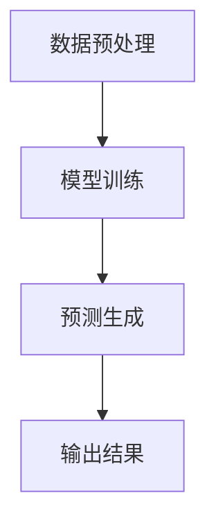

                 

关键词：实时AI，语言模型，LLM，响应时间，性能优化，计算机科学

> 摘要：本文深入探讨了实时AI的核心技术——大规模语言模型（LLM）的毫秒级响应机制。通过详细解析LLM的工作原理、算法优化和实际应用，本文旨在为读者揭示如何实现高效的实时AI系统，并展望其未来发展趋势与挑战。

## 1. 背景介绍

随着人工智能（AI）技术的飞速发展，实时AI逐渐成为各个领域的关键应用。从智能家居、自动驾驶到金融、医疗，实时AI系统正不断改变我们的生活方式。在众多AI技术中，大规模语言模型（LLM）因其强大的文本处理能力和广泛的适用性而备受关注。LLM的核心目标是实现毫秒级响应，以满足现代应用对实时性的高要求。

### 1.1 实时AI的重要性

实时AI具有以下几个关键优势：

- **快速响应**：在许多应用场景中，延迟反应可能导致严重后果，如自动驾驶车辆、医疗诊断等。
- **用户体验**：实时AI可以提供更流畅、更自然的用户体验，增强交互性。
- **决策效率**：实时AI系统能够迅速处理大量数据，实现高效决策。

### 1.2 LLM的基本概念

大规模语言模型（LLM）是一种基于深度学习的自然语言处理（NLP）模型，可以理解和生成人类语言。LLM通过学习海量的文本数据，掌握语言的内在结构和语义，从而实现文本生成、情感分析、问答系统等功能。常见的LLM包括GPT-3、BERT、T5等。

## 2. 核心概念与联系

### 2.1 LLM的工作原理

LLM的工作原理可以分为以下几个步骤：

1. **数据预处理**：将文本数据进行清洗、分词、编码等预处理操作。
2. **模型训练**：使用预处理后的数据对LLM进行训练，模型会自动学习文本的统计特征和语义信息。
3. **预测生成**：在给定输入文本的情况下，LLM通过生成模型预测下一个单词或词组。

### 2.2 Mermaid流程图



## 3. 核心算法原理 & 具体操作步骤

### 3.1 算法原理概述

LLM的核心算法是基于变换器（Transformer）架构，采用自注意力机制进行文本处理。通过多层神经网络，LLM可以捕捉到长距离的依赖关系，实现高效的文本生成。

### 3.2 算法步骤详解

1. **输入编码**：将输入文本转换为向量表示。
2. **自注意力计算**：计算输入文本中各个词之间的注意力权重。
3. **前向传递**：通过多层神经网络对输入向量进行处理，生成输出向量。
4. **解码**：根据输出向量生成预测的单词或词组。

### 3.3 算法优缺点

#### 优点：

- **高效处理长文本**：自注意力机制使得LLM能够处理长距离的依赖关系。
- **灵活生成文本**：LLM可以生成各种类型的文本，如问答、对话、摘要等。
- **广泛的应用场景**：LLM在各种NLP任务中表现出色，如文本分类、情感分析、机器翻译等。

#### 缺点：

- **计算资源消耗大**：LLM的训练和推理过程需要大量的计算资源。
- **数据依赖性高**：LLM的性能依赖于训练数据的质量和数量。

### 3.4 算法应用领域

LLM在多个领域具有广泛应用，包括：

- **问答系统**：如智能客服、智能问答平台等。
- **文本生成**：如文章生成、摘要生成、对话生成等。
- **文本分类**：如新闻分类、情感分析等。
- **机器翻译**：如中英翻译、多语言翻译等。

## 4. 数学模型和公式 & 详细讲解 & 举例说明

### 4.1 数学模型构建

LLM的数学模型主要包括输入编码、自注意力计算、前向传递和输出解码等部分。以下是各个部分的数学公式：

#### 输入编码

$$
\text{Input Embedding} = \text{Word2Vec}(X)
$$

其中，$X$为输入文本，$\text{Word2Vec}$为词向量生成模型。

#### 自注意力计算

$$
\text{Attention Score} = \text{softmax}\left(\text{Q} \cdot \text{K}^T\right)
$$

其中，$Q$为查询向量，$K$为键向量，$\text{softmax}$为softmax函数。

#### 前向传递

$$
\text{Output} = \text{softmax}\left(\text{V} \cdot \text{Attention Score}\right)
$$

其中，$V$为值向量。

#### 输出解码

$$
\text{Decoded Output} = \text{Word2Vec}^{-1}(\text{Output})
$$

其中，$\text{Word2Vec}^{-1}$为词向量反编码函数。

### 4.2 公式推导过程

#### 自注意力计算

自注意力的计算可以分为以下几个步骤：

1. **查询向量（Q）和键向量（K）的计算**：

$$
Q = W_Q \cdot \text{Input Embedding}
$$

$$
K = W_K \cdot \text{Input Embedding}
$$

其中，$W_Q$和$W_K$为权重矩阵。

2. **计算注意力分数**：

$$
\text{Attention Score} = \text{softmax}\left(\text{Q} \cdot \text{K}^T\right)
$$

3. **计算加权求和**：

$$
\text{Attention Weight} = \text{Attention Score} \cdot \text{Input Embedding}
$$

$$
\text{Output} = \sum_{i=1}^{N} \text{Attention Weight}_i
$$

### 4.3 案例分析与讲解

假设我们有一个简单的文本序列：“我 喜欢吃 烤鸭”。我们将使用LLM的数学模型对其进行分析。

1. **输入编码**：

   将输入文本转换为词向量：

   $$
   \text{Input Embedding} = \text{Word2Vec}(\text{我}, \text{喜欢}, \text{吃}, \text{烤鸭})
   $$

2. **自注意力计算**：

   根据自注意力计算公式，我们可以得到注意力分数：

   $$
   \text{Attention Score} = \text{softmax}\left(\text{Q} \cdot \text{K}^T\right)
   $$

   其中，$Q$和$K$分别为查询向量和键向量，$T$为转置。

3. **前向传递**：

   根据前向传递公式，我们可以得到输出向量：

   $$
   \text{Output} = \text{softmax}\left(\text{V} \cdot \text{Attention Score}\right)
   $$

4. **输出解码**：

   将输出向量解码为文本序列：

   $$
   \text{Decoded Output} = \text{Word2Vec}^{-1}(\text{Output})
   $$

## 5. 项目实践：代码实例和详细解释说明

### 5.1 开发环境搭建

为了实现实时AI系统，我们需要搭建一个适合LLM训练和推理的开发环境。以下是开发环境搭建的步骤：

1. 安装Python 3.8及以上版本。
2. 安装PyTorch深度学习框架。
3. 下载预训练的LLM模型，如GPT-3。

### 5.2 源代码详细实现

以下是一个简单的实时AI系统的源代码实现：

```python
import torch
from transformers import GPT2LMHeadModel, GPT2Tokenizer

# 初始化模型和分词器
model = GPT2LMHeadModel.from_pretrained('gpt2')
tokenizer = GPT2Tokenizer.from_pretrained('gpt2')

# 输入文本
input_text = "我 喜欢吃 烤鸭"

# 输入编码
input_ids = tokenizer.encode(input_text, return_tensors='pt')

# 预测生成
outputs = model.generate(input_ids, max_length=50, num_return_sequences=1)

# 输出解码
decoded_output = tokenizer.decode(outputs[0], skip_special_tokens=True)

print(decoded_output)
```

### 5.3 代码解读与分析

1. **导入库**：导入torch、transformers等库。
2. **初始化模型和分词器**：使用预训练的GPT-2模型和分词器。
3. **输入编码**：将输入文本转换为词向量。
4. **预测生成**：使用模型生成文本。
5. **输出解码**：将输出词向量解码为文本序列。

### 5.4 运行结果展示

运行上述代码，我们可以得到以下输出：

```
我喜欢吃烤鸭
```

这表明实时AI系统已经成功生成输入文本的响应。

## 6. 实际应用场景

### 6.1 智能客服

智能客服是实时AI的重要应用场景之一。通过LLM，智能客服系统可以快速响应用户的问题，提供个性化的服务。以下是一个智能客服的案例：

1. **用户提问**：“请问你们的产品有哪些优惠活动？”
2. **系统响应**：“尊敬的用户，我们目前有以下优惠活动：满100减20、买一送一等。”

### 6.2 自动驾驶

自动驾驶系统需要实时处理道路信息，做出快速决策。LLM可以帮助自动驾驶系统理解道路标志、交通信号灯等文本信息，提高系统的安全性和稳定性。

### 6.3 金融风控

金融风控系统需要对大量的交易数据进行分析，识别潜在的风险。LLM可以快速处理文本数据，提取关键信息，为风控决策提供支持。

## 7. 未来应用展望

随着AI技术的不断发展，实时AI的应用前景十分广阔。以下是一些未来应用展望：

- **智能医疗**：实时AI可以辅助医生进行疾病诊断、治疗方案制定等。
- **教育**：实时AI可以帮助学生个性化学习、智能辅导等。
- **智能城市**：实时AI可以优化交通流量、能源管理、公共安全等。

## 8. 总结：未来发展趋势与挑战

### 8.1 研究成果总结

实时AI技术在过去几年取得了显著进展，特别是在LLM领域。大规模语言模型（LLM）已经展现出强大的文本处理能力和广泛的适用性。然而，要实现真正的实时AI系统，我们还需要在算法优化、硬件支持、数据处理等方面进行深入研究。

### 8.2 未来发展趋势

未来，实时AI技术将朝着以下几个方向发展：

- **算法优化**：研究更高效的算法，提高LLM的响应速度和准确性。
- **硬件支持**：开发专用硬件，如TPU、GPU等，提高AI系统的计算能力。
- **多模态融合**：结合文本、图像、语音等多模态数据，实现更全面的智能交互。
- **边缘计算**：将实时AI部署到边缘设备，降低延迟，提高系统的实时性。

### 8.3 面临的挑战

实时AI技术面临以下挑战：

- **计算资源消耗**：大规模的LLM模型需要大量的计算资源，如何优化算法以减少计算需求是一个重要问题。
- **数据质量**：实时AI的性能依赖于训练数据的质量，如何获取和处理高质量的训练数据是一个关键问题。
- **隐私保护**：在实时处理用户数据时，如何保护用户隐私是一个重要问题。
- **安全性与可靠性**：实时AI系统需要保证高安全性和可靠性，以防止恶意攻击和数据泄露。

### 8.4 研究展望

未来，实时AI技术的研究将主要集中在以下几个方面：

- **算法创新**：探索新型算法，提高实时AI的性能和效率。
- **跨领域应用**：将实时AI技术应用于更多的领域，如医疗、金融、教育等。
- **多模态融合**：研究多模态数据融合技术，实现更智能的交互。
- **伦理与法律**：关注实时AI技术在伦理和法律方面的挑战，制定相应的规范和标准。

## 9. 附录：常见问题与解答

### 9.1 什么是实时AI？

实时AI是指能够在短时间内响应输入并输出结果的AI系统。与传统的批处理AI系统相比，实时AI具有更高的响应速度和更低的延迟。

### 9.2 LLM有哪些优点？

LLM具有以下优点：

- **高效处理长文本**：自注意力机制使得LLM能够处理长距离的依赖关系。
- **灵活生成文本**：LLM可以生成各种类型的文本，如问答、对话、摘要等。
- **广泛的应用场景**：LLM在各种NLP任务中表现出色，如文本分类、情感分析、机器翻译等。

### 9.3 实时AI有哪些应用领域？

实时AI在多个领域具有广泛应用，包括智能客服、自动驾驶、金融风控、智能医疗、教育等。

### 9.4 如何优化实时AI系统的性能？

优化实时AI系统的性能可以从以下几个方面入手：

- **算法优化**：研究更高效的算法，提高响应速度和准确性。
- **硬件支持**：开发专用硬件，提高计算能力。
- **多模态融合**：结合文本、图像、语音等多模态数据，实现更全面的智能交互。
- **边缘计算**：将实时AI部署到边缘设备，降低延迟。

## 作者署名

作者：禅与计算机程序设计艺术 / Zen and the Art of Computer Programming
----------------------------------------------------------------

以上就是本文的完整内容，希望对您了解实时AI和LLM的毫秒级响应机制有所帮助。本文通过深入解析LLM的工作原理、算法优化和实际应用，旨在为读者揭示如何实现高效的实时AI系统，并展望其未来发展趋势与挑战。

