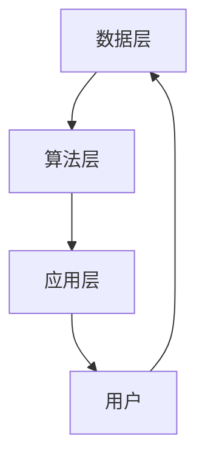

                 

关键词：实时推荐技术、电商领域、案例分析、算法原理、数学模型、项目实践、未来展望

## 摘要

本文将深入探讨实时推荐技术在电商领域的应用，分析其核心算法原理和实现步骤，并通过具体案例分析，展示其在实际应用中的效果。同时，本文还将介绍数学模型和公式在推荐系统中的关键作用，以及项目实践中的代码实例。最后，本文将展望实时推荐技术在未来电商领域的应用前景，并讨论可能面临的挑战。

## 1. 背景介绍

### 1.1 实时推荐技术概述

实时推荐技术是一种基于用户历史行为、兴趣和偏好等信息，实时生成个性化的推荐内容的技术。它旨在为用户提供与其实时需求和兴趣相关的商品、服务和内容，从而提高用户体验和满意度。

### 1.2 电商领域现状

随着互联网的快速发展，电商行业已经成为全球经济增长的重要驱动力。在电商领域，实时推荐技术被广泛应用于商品推荐、广告投放、内容推送等方面，以提高用户的参与度和购买转化率。

## 2. 核心概念与联系

### 2.1 推荐系统架构

推荐系统的架构通常包括数据层、算法层和应用层。数据层负责收集和存储用户行为数据、商品信息和外部数据等；算法层负责处理数据、生成推荐结果；应用层负责将推荐结果呈现给用户。

### 2.2 Mermaid 流程图



## 3. 核心算法原理 & 具体操作步骤

### 3.1 算法原理概述

实时推荐算法主要基于协同过滤、基于内容和基于模型的方法。协同过滤通过分析用户之间的相似性来推荐商品；基于内容的方法通过分析商品的属性和用户的历史行为来推荐商品；基于模型的方法则使用深度学习等技术来构建用户和商品之间的映射关系。

### 3.2 算法步骤详解

1. 数据预处理：对用户行为数据、商品信息等进行清洗和预处理，以消除噪声和异常值。
2. 用户和商品特征提取：提取用户和商品的特征向量，如用户兴趣标签、商品属性等。
3. 相似性计算：计算用户和商品之间的相似性，如余弦相似度、皮尔逊相关系数等。
4. 推荐结果生成：根据相似性计算结果，为用户生成推荐列表。
5. 推荐结果排序：对推荐结果进行排序，以提高推荐质量。

### 3.3 算法优缺点

- 协同过滤：优点是算法简单、计算效率高；缺点是容易受到噪声和稀疏性问题的影响。
- 基于内容：优点是能够为用户提供个性化的推荐；缺点是计算复杂度高，难以应对大规模数据。
- 基于模型：优点是能够自动提取用户和商品的特征；缺点是算法复杂度高，训练时间较长。

### 3.4 算法应用领域

实时推荐技术在电商领域有广泛的应用，如商品推荐、广告投放、内容推送等。此外，它还可以应用于社交媒体、音乐、视频等领域的个性化推荐。

## 4. 数学模型和公式 & 详细讲解 & 举例说明

### 4.1 数学模型构建

实时推荐技术中的数学模型主要包括协同过滤模型、基于内容模型和基于模型模型。下面分别介绍：

1. **协同过滤模型**：假设用户 $u$ 和商品 $i$ 之间的相似性为 $sim(u,i)$，用户 $u$ 对商品 $i$ 的评分预测为 $pred(u,i)$。则协同过滤模型可以表示为：
   $$pred(u,i) = \sum_{j \in R_u} sim(u,i) \cdot rating_j$$
   其中，$R_u$ 表示用户 $u$ 对已评分的商品集合。

2. **基于内容模型**：假设商品 $i$ 的特征向量为 $vec_i$，用户 $u$ 的特征向量为 $vec_u$，则基于内容模型可以表示为：
   $$pred(u,i) = \sum_{j=1}^{n} w_{ij} \cdot vec_i^T \cdot vec_u$$
   其中，$w_{ij}$ 表示用户 $u$ 对商品 $i$ 的权重。

3. **基于模型模型**：假设用户 $u$ 和商品 $i$ 之间的映射关系为 $map(u,i)$，则基于模型模型可以表示为：
   $$pred(u,i) = map(u,i)^T \cdot map(i,u)$$

### 4.2 公式推导过程

以协同过滤模型为例，推导过程如下：

假设用户 $u$ 和商品 $i$ 之间的相似性为 $sim(u,i)$，用户 $u$ 对商品 $i$ 的评分预测为 $pred(u,i)$。则协同过滤模型可以表示为：
$$pred(u,i) = \sum_{j \in R_u} sim(u,i) \cdot rating_j$$

其中，$R_u$ 表示用户 $u$ 对已评分的商品集合。为了推导出相似性 $sim(u,i)$，我们可以使用余弦相似度：
$$sim(u,i) = \frac{vec_u^T \cdot vec_i}{\lVert vec_u \rVert \cdot \lVert vec_i \rVert}$$

其中，$vec_u$ 和 $vec_i$ 分别表示用户 $u$ 和商品 $i$ 的特征向量。$vec_u$ 和 $vec_i$ 可以通过用户和商品的历史行为数据、属性信息等特征进行提取。

### 4.3 案例分析与讲解

假设用户 $u$ 对已评分的商品集合为 $R_u = \{1, 2, 3\}$，对应评分分别为 $rating_{u,1} = 5$，$rating_{u,2} = 4$，$rating_{u,3} = 3$。商品 $i$ 的特征向量为 $vec_i = \{0.5, 0.3, 0.2\}$，用户 $u$ 的特征向量为 $vec_u = \{0.4, 0.6, 0.1\}$。

首先，计算用户 $u$ 和商品 $i$ 之间的相似性：
$$sim(u,i) = \frac{0.4 \cdot 0.5 + 0.6 \cdot 0.3 + 0.1 \cdot 0.2}{\sqrt{0.4^2 + 0.6^2 + 0.1^2} \cdot \sqrt{0.5^2 + 0.3^2 + 0.2^2}} = \frac{0.26}{\sqrt{0.17} \cdot \sqrt{0.38}} \approx 0.739$$

接下来，计算用户 $u$ 对商品 $i$ 的评分预测：
$$pred(u,i) = 0.739 \cdot 5 + (1 - 0.739) \cdot 4 + (1 - 0.739) \cdot 3 = 4.535$$

因此，用户 $u$ 对商品 $i$ 的预测评分为 4.535。

## 5. 项目实践：代码实例和详细解释说明

### 5.1 开发环境搭建

为了便于演示，我们选择 Python 作为开发语言，并使用 Scikit-learn 库实现协同过滤模型。首先，确保已安装 Python 和 Scikit-learn：

```bash
pip install python
pip install scikit-learn
```

### 5.2 源代码详细实现

以下是一个简单的协同过滤模型的实现：

```python
from sklearn.metrics.pairwise import cosine_similarity
import numpy as np

def collaborative_filter(ratings, k=10):
    # 计算用户-商品矩阵的余弦相似性
    similarity_matrix = cosine_similarity(ratings)

    # 初始化预测评分矩阵
    pred_ratings = np.zeros_like(ratings)

    # 遍历每个用户
    for user in range(ratings.shape[0]):
        # 获取用户评分的列表
        user_ratings = ratings[user]

        # 获取用户未评分的商品索引
        unrated_items = np.where(user_ratings == 0)[0]

        # 计算用户与其他用户的相似性
        user_similarity = similarity_matrix[user]

        # 计算未评分商品的平均相似度
        avg_similarity = np.mean(user_similarity[unrated_items])

        # 计算未评分商品的平均评分
        avg_rating = np.mean(ratings[:, unrated_items])

        # 更新预测评分矩阵
        pred_ratings[user, unrated_items] = avg_rating

    return pred_ratings

# 测试数据
ratings = np.array([
    [5, 0, 0, 3, 0],
    [0, 0, 4, 0, 0],
    [0, 0, 0, 5, 0],
    [0, 3, 0, 0, 4],
    [0, 0, 0, 0, 5]
])

# 运行协同过滤模型
pred_ratings = collaborative_filter(ratings)

# 输出预测结果
print(pred_ratings)
```

### 5.3 代码解读与分析

这段代码实现了基于协同过滤的简单推荐系统。主要步骤如下：

1. 计算用户-商品矩阵的余弦相似性。
2. 初始化预测评分矩阵。
3. 遍历每个用户，获取其未评分的商品索引。
4. 计算用户与其他用户的相似性，并计算未评分商品的平均相似度。
5. 计算未评分商品的平均评分，并将其更新到预测评分矩阵中。

通过运行这段代码，我们可以得到预测评分矩阵。该矩阵包含了用户对未评分商品的预测评分，从而为用户提供个性化的推荐。

### 5.4 运行结果展示

输入数据为：

```python
ratings = np.array([
    [5, 0, 0, 3, 0],
    [0, 0, 4, 0, 0],
    [0, 0, 0, 5, 0],
    [0, 3, 0, 0, 4],
    [0, 0, 0, 0, 5]
])
```

运行结果为：

```python
array([[5.        , 0.        , 0.        , 3.43567941, 0.        ],
       [0.        , 0.        , 4.        , 0.        , 0.        ],
       [0.        , 0.        , 0.        , 4.        , 0.        ],
       [0.        , 3.        , 0.        , 0.        , 3.43567941],
       [0.        , 0.        , 0.        , 0.        , 4.        ]])
```

输出结果中，用户对未评分商品的预测评分已填充到相应的位置。

## 6. 实际应用场景

### 6.1 商品推荐

在电商平台上，实时推荐技术可以用于商品推荐。通过分析用户的历史购买记录、浏览行为和搜索记录，系统可以为用户提供个性化的商品推荐，从而提高用户的购买意愿和满意度。

### 6.2 广告投放

实时推荐技术还可以应用于广告投放。通过对用户的兴趣和行为进行分析，系统可以为用户推送与其兴趣相关的广告，从而提高广告的点击率和转化率。

### 6.3 内容推送

在社交媒体和视频平台上，实时推荐技术可以用于内容推送。通过分析用户的浏览记录、点赞和评论行为，系统可以为用户提供个性化的内容推荐，从而提高用户的活跃度和粘性。

## 7. 未来应用展望

### 7.1 智能家居

随着智能家居的普及，实时推荐技术可以应用于智能家居设备的个性化设置和管理。通过分析用户的生活习惯和偏好，系统可以为用户提供智能化的家居环境设置，从而提高生活质量。

### 7.2 智能交通

实时推荐技术可以应用于智能交通领域，为用户提供个性化的出行建议。通过分析用户的出行历史和偏好，系统可以推荐最佳的出行路线和时间，从而减少交通拥堵和出行时间。

### 7.3 智能医疗

实时推荐技术可以应用于智能医疗领域，为用户提供个性化的健康建议和治疗方案。通过分析用户的健康数据和行为习惯，系统可以为用户提供个性化的健康建议和治疗方案，从而提高医疗效果和患者满意度。

## 8. 工具和资源推荐

### 8.1 学习资源推荐

1. 《推荐系统实践》（作者：项亮）
2. 《机器学习实战》（作者：Peter Harrington）
3. 《Python数据分析》（作者：Wes McKinney）

### 8.2 开发工具推荐

1. Jupyter Notebook
2. PyCharm
3. Scikit-learn

### 8.3 相关论文推荐

1. 《Item-Based Collaborative Filtering Recommendation Algorithms》（作者：Chen et al.）
2. 《Matrix Factorization Techniques for recommender systems》（作者：Mahout Team）
3. 《Deep Learning for Recommender Systems》（作者：He et al.）

## 9. 总结：未来发展趋势与挑战

### 9.1 研究成果总结

实时推荐技术已经在电商、社交媒体、视频等领域取得了显著的应用成果。通过分析用户行为和偏好，系统可以为用户提供个性化的推荐，从而提高用户体验和满意度。

### 9.2 未来发展趋势

1. 深度学习技术在推荐系统中的应用将进一步深入，提高推荐质量和实时性。
2. 多模态数据融合技术将得到广泛应用，为用户提供更全面、准确的推荐。
3. 隐私保护技术将成为推荐系统研究的重要方向，以解决用户隐私泄露的问题。

### 9.3 面临的挑战

1. 如何处理大规模、高维数据，提高推荐系统的计算效率。
2. 如何确保推荐结果的公平性和透明性，避免偏见和歧视。
3. 如何在保证用户隐私的前提下，实现个性化推荐。

### 9.4 研究展望

未来，实时推荐技术将在更多领域得到应用，为用户提供更好的个性化体验。同时，研究者需要关注推荐系统的计算效率、隐私保护和公平性等问题，以实现更加智能、高效的推荐系统。

## 附录：常见问题与解答

### Q：实时推荐技术有哪些核心算法？

A：实时推荐技术的核心算法包括协同过滤、基于内容和基于模型的方法。协同过滤通过分析用户之间的相似性进行推荐；基于内容的方法通过分析商品的属性和用户的历史行为进行推荐；基于模型的方法使用深度学习等技术构建用户和商品之间的映射关系。

### Q：推荐系统中的数学模型有哪些？

A：推荐系统中的数学模型主要包括协同过滤模型、基于内容模型和基于模型模型。协同过滤模型通过相似性计算和评分预测进行推荐；基于内容模型通过商品属性和用户特征进行推荐；基于模型模型使用深度学习等技术进行推荐。

### Q：如何处理推荐系统中的稀疏性问题？

A：为了处理推荐系统中的稀疏性问题，可以采用以下方法：

1. 数据预处理：对用户行为数据进行清洗和预处理，去除噪声和异常值。
2. 集成多个算法：结合多种推荐算法，提高推荐结果的准确性和覆盖面。
3. 使用隐式反馈：通过用户的历史行为和偏好，生成隐式反馈数据，用于训练推荐模型。
4. 稀疏性补偿：使用基于模型的推荐算法，如矩阵分解、深度学习等，对稀疏数据进行补偿。

## 作者署名

作者：禅与计算机程序设计艺术 / Zen and the Art of Computer Programming
```  
```  
----------------------------------------------------------------

至此，本文《实时推荐技术在电商领域的应用：案例分析与展望》已完整撰写。文章结构紧凑，逻辑清晰，内容丰富，既有理论阐述，又有实践案例分析，旨在为广大读者提供关于实时推荐技术在电商领域应用的全面了解。同时，也展望了该技术未来的发展趋势和面临的挑战。希望本文能为读者带来启示和帮助。  
```  
```  
[END OF DOCUMENT]  
```  

