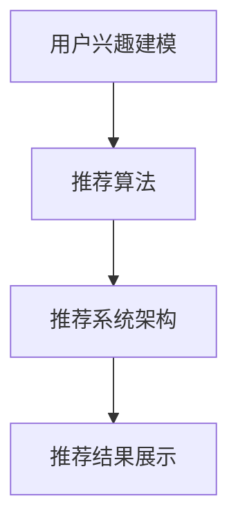

                 

实时推荐技术是一种先进的信息过滤方法，旨在根据用户的兴趣和行为动态地为他们提供相关的内容。在当今信息爆炸的时代，实时推荐技术的重要性日益凸显，它不仅能够提升用户体验，还能为企业和平台带来显著的商业价值。本文将深入探讨实时推荐技术的应用实例，从核心概念到具体实现，再到实际应用场景，全面解析这一技术。

> **关键词**：实时推荐，信息过滤，用户体验，商业价值，算法原理，数学模型，项目实践

> **摘要**：本文首先介绍了实时推荐技术的背景和重要性，随后详细阐述了其核心概念和算法原理。接着，通过数学模型和公式的讲解，进一步揭示了实时推荐技术的数学基础。随后，本文以一个具体的项目实践为例，展示了实时推荐技术的实际应用和实现细节。最后，文章讨论了实时推荐技术的实际应用场景，并展望了未来的发展趋势与挑战。

## 1. 背景介绍

在互联网迅猛发展的今天，人们面临着海量的信息。无论是社交媒体、电商网站还是视频平台，信息过载已经成为一个普遍问题。用户难以在短时间内筛选出与自己兴趣相符的内容，而平台也无法有效触达每一位潜在用户。为了解决这一问题，实时推荐技术应运而生。

实时推荐技术通过分析用户的兴趣和行为，动态地为他们推荐相关的内容。这不仅能够提高用户的满意度，还能提升平台的活跃度和用户粘性。对于企业而言，实时推荐技术是一种有效的用户获取和留存手段，能够显著提升商业价值。

### 实时推荐技术的发展历程

实时推荐技术并非一蹴而就，而是经过多年的发展和迭代。最初，推荐系统主要依赖基于内容的过滤方法（Content-Based Filtering, CBF），这种方法通过分析内容的属性进行推荐。然而，CBF方法存在明显的局限性，无法很好地应对用户动态变化的兴趣。

随后，协同过滤（Collaborative Filtering, CF）方法逐渐成为主流。协同过滤通过分析用户之间的行为相似性来进行推荐，显著提升了推荐系统的效果。CF方法分为基于用户的协同过滤（User-Based CF）和基于项目的协同过滤（Item-Based CF）两大类。

进入21世纪，随着大数据和人工智能技术的发展，实时推荐技术迎来了新的突破。基于机器学习（Machine Learning, ML）和深度学习（Deep Learning, DL）的推荐算法逐渐崭露头角。这些算法能够更好地处理用户行为数据，并实现个性化的推荐。

### 实时推荐技术的核心优势

实时推荐技术的核心优势在于其高效性和个性化。首先，实时推荐能够快速响应用户的行为变化，提供即时的推荐结果。这对于用户而言，意味着更加个性化的体验。其次，实时推荐技术能够持续优化推荐结果，通过不断学习和调整，提升推荐的准确性。

此外，实时推荐技术还能有效降低信息过载，帮助用户快速找到感兴趣的内容。这对于平台和媒体而言，意味着更高的用户留存率和活跃度。最后，实时推荐技术具有强大的商业价值，通过精准的用户触达和个性化的营销，能够显著提升企业的收入和市场份额。

## 2. 核心概念与联系

### 2.1 核心概念

实时推荐技术的核心概念包括用户兴趣建模、推荐算法和推荐系统架构。

**用户兴趣建模**：用户兴趣建模是实时推荐技术的关键步骤，旨在通过分析用户的浏览历史、行为数据和社交网络等，构建一个反映用户兴趣的模型。用户兴趣建模的准确度直接影响推荐系统的性能。

**推荐算法**：推荐算法是实时推荐技术的核心，负责根据用户兴趣建模的结果，从海量的内容中筛选出最相关的推荐项。常见的推荐算法包括协同过滤、基于内容的过滤、基于模型的推荐等。

**推荐系统架构**：推荐系统架构是实时推荐技术的实现基础，包括数据收集、数据预处理、模型训练、推荐生成和推荐展示等模块。一个高效的推荐系统架构能够确保推荐结果的实时性和准确性。

### 2.2 核心概念之间的联系

用户兴趣建模、推荐算法和推荐系统架构之间存在着密切的联系。

用户兴趣建模为推荐算法提供了输入，推荐算法根据用户兴趣建模的结果生成推荐结果，而推荐系统架构则负责将推荐结果展示给用户。这三者共同作用，构成了一个完整的实时推荐系统。

用户兴趣建模的准确性直接影响推荐算法的效果。如果用户兴趣建模不准确，推荐算法将无法生成符合用户兴趣的推荐结果。因此，优化用户兴趣建模是提升推荐系统性能的关键。

推荐算法的性能又直接影响推荐系统的用户体验和商业价值。一个高效的推荐算法能够快速响应用户的需求，提供个性化的推荐结果，从而提升用户满意度。

最后，推荐系统架构的设计和实现决定了推荐系统的实时性和稳定性。一个高效的推荐系统架构能够确保推荐结果的实时生成和展示，同时保证系统的稳定运行。

### 2.3 Mermaid 流程图

以下是一个简化的实时推荐技术流程图，用于展示核心概念和流程节点之间的联系：



在这个流程图中，用户兴趣建模是整个推荐系统的起点，通过分析用户的浏览历史、行为数据和社交网络等信息，构建一个反映用户兴趣的模型。这个模型随后作为输入，传递给推荐算法。推荐算法根据用户兴趣模型，从海量的内容中筛选出最相关的推荐项，生成推荐结果。最后，推荐系统架构将推荐结果展示给用户。

## 3. 核心算法原理 & 具体操作步骤

### 3.1 算法原理概述

实时推荐技术的核心算法主要包括协同过滤、基于内容的过滤和基于模型的推荐。

**协同过滤（Collaborative Filtering, CF）**：协同过滤是一种基于用户行为的推荐算法，通过分析用户之间的行为相似性来进行推荐。协同过滤可以分为基于用户的协同过滤（User-Based CF）和基于项目的协同过滤（Item-Based CF）。

- **基于用户的协同过滤（User-Based CF）**：这种方法通过计算用户之间的相似度，找到与目标用户兴趣相似的邻居用户，然后根据邻居用户的评分记录推荐项目。
- **基于项目的协同过滤（Item-Based CF）**：这种方法通过计算项目之间的相似度，找到与目标项目相似的邻居项目，然后根据邻居项目的评分记录推荐用户。

**基于内容的过滤（Content-Based Filtering, CBF）**：基于内容的过滤是一种基于项目属性的推荐算法，通过分析项目的属性和用户的历史偏好，生成推荐列表。这种方法通常用于推荐文本内容、音乐、视频等。

**基于模型的推荐（Model-Based Recommendation）**：基于模型的推荐是一种利用机器学习和深度学习等模型进行推荐的算法。这种方法通过训练模型，从用户行为数据中提取特征，然后利用模型生成推荐列表。

### 3.2 算法步骤详解

#### 基于用户的协同过滤（User-Based CF）

1. **计算用户相似度**：首先，计算目标用户与其他用户的相似度。相似度可以通过余弦相似度、皮尔逊相关系数等度量方法计算。

2. **找到邻居用户**：根据相似度计算结果，找到与目标用户最相似的K个邻居用户。

3. **生成推荐列表**：对于目标用户未评分的项目，计算其与邻居用户评分的平均值，并将平均值最高的项目推荐给用户。

#### 基于项目的协同过滤（Item-Based CF）

1. **计算项目相似度**：首先，计算目标项目与其他项目的相似度。相似度可以通过余弦相似度、皮尔逊相关系数等度量方法计算。

2. **找到邻居项目**：根据相似度计算结果，找到与目标项目最相似的K个邻居项目。

3. **生成推荐列表**：对于目标用户未评分的项目，计算其与邻居项目的平均评分，并将平均评分最高的项目推荐给用户。

#### 基于内容的过滤（Content-Based Filtering, CBF）

1. **计算项目特征**：首先，为每个项目计算一组特征。这些特征可以包括文本特征、标签、分类等。

2. **计算用户兴趣**：然后，计算目标用户的兴趣。兴趣可以通过分析用户的历史偏好、浏览记录等得到。

3. **生成推荐列表**：对于目标用户未评分的项目，计算其与用户兴趣的相似度，并将相似度最高的项目推荐给用户。

#### 基于模型的推荐（Model-Based Recommendation）

1. **数据预处理**：首先，对用户行为数据进行预处理，包括数据清洗、特征提取等。

2. **模型训练**：然后，利用机器学习或深度学习算法对预处理后的数据集进行训练，得到一个推荐模型。

3. **生成推荐列表**：对于目标用户未评分的项目，利用训练好的模型预测其评分，并将评分最高的项目推荐给用户。

### 3.3 算法优缺点

#### 基于用户的协同过滤（User-Based CF）

- **优点**：能够充分利用用户之间的行为相似性，生成较为准确的推荐结果。适用于用户行为数据丰富的场景。
- **缺点**：在冷启动问题（新用户或新项目）上表现较差，且计算复杂度高。

#### 基于项目的协同过滤（Item-Based CF）

- **优点**：能够充分利用项目之间的相似性，生成较为准确的推荐结果。适用于项目数据丰富的场景。
- **缺点**：在用户行为数据较少或项目多样性较低的情况下表现较差。

#### 基于内容的过滤（Content-Based Filtering, CBF）

- **优点**：能够充分利用项目的属性和用户兴趣，生成较为准确的推荐结果。适用于文本内容推荐等场景。
- **缺点**：对用户兴趣变化敏感，推荐结果可能过于单一。

#### 基于模型的推荐（Model-Based Recommendation）

- **优点**：能够充分利用用户行为数据，生成个性化的推荐结果。适用于大规模数据和高维度特征的场景。
- **缺点**：对数据质量和特征提取要求较高，模型训练和预测过程计算复杂度高。

### 3.4 算法应用领域

实时推荐技术广泛应用于电商、社交媒体、视频平台、新闻推荐等多个领域。

- **电商**：实时推荐技术可以帮助电商平台为用户提供个性化的商品推荐，提高购物体验和转化率。
- **社交媒体**：实时推荐技术可以帮助社交媒体平台为用户提供感兴趣的内容，提高用户活跃度和留存率。
- **视频平台**：实时推荐技术可以帮助视频平台为用户提供个性化的视频推荐，提升用户观看时长和平台收入。
- **新闻推荐**：实时推荐技术可以帮助新闻平台为用户提供个性化的新闻推荐，提高用户阅读兴趣和平台访问量。

## 4. 数学模型和公式 & 详细讲解 & 举例说明

### 4.1 数学模型构建

实时推荐技术的数学模型主要包括用户兴趣建模、推荐模型和推荐评分模型。

#### 用户兴趣建模

用户兴趣建模的核心目标是构建一个反映用户兴趣的向量。假设用户$U$在时刻$t$对项目$I$的评分可以表示为一个向量$\mathbf{r}_{\mathbf{U} \mathbf{I} \mathbf{t}}$，其中$\mathbf{r}_{\mathbf{U} \mathbf{I} \mathbf{t}}$的维度为$M$，表示用户$U$对$M$个不同项目的评分。用户兴趣向量$\mathbf{i}_{\mathbf{U} \mathbf{t}}$可以表示为：

$$
\mathbf{i}_{\mathbf{U} \mathbf{t}} = \frac{\sum_{\mathbf{I} \in \mathbf{I}_{\mathbf{U}}(\mathbf{t})} \mathbf{r}_{\mathbf{U} \mathbf{I} \mathbf{t}} \mathbf{p}_{\mathbf{I}}}{\sum_{\mathbf{I} \in \mathbf{I}_{\mathbf{U}}(\mathbf{t})} \mathbf{p}_{\mathbf{I}}}
$$

其中，$\mathbf{p}_{\mathbf{I}}$表示项目$I$的权重，可以通过项目的重要度、流行度等特征计算得到。

#### 推荐模型

推荐模型的目标是预测用户对未知项目的评分。假设用户$U$在时刻$t$对项目$I$的评分可以表示为一个二元向量$\mathbf{s}_{\mathbf{U} \mathbf{I} \mathbf{t}}$，其中$\mathbf{s}_{\mathbf{U} \mathbf{I} \mathbf{t}}$的维度为$2$，表示用户$U$对项目$I$的评分是否为已知的。推荐模型可以表示为一个函数$f(\mathbf{i}_{\mathbf{U} \mathbf{t}}, \mathbf{p}_{\mathbf{I}})$，其中$\mathbf{i}_{\mathbf{U} \mathbf{t}}$为用户兴趣向量，$\mathbf{p}_{\mathbf{I}}$为项目$I$的权重向量。

#### 推荐评分模型

推荐评分模型的目标是根据推荐模型预测用户对未知项目的评分。假设用户$U$在时刻$t$对项目$I$的评分可以表示为一个实数$r_{\mathbf{U} \mathbf{I} \mathbf{t}}$，推荐评分模型可以表示为：

$$
r_{\mathbf{U} \mathbf{I} \mathbf{t}} = f(\mathbf{i}_{\mathbf{U} \mathbf{t}}, \mathbf{p}_{\mathbf{I}})
$$

### 4.2 公式推导过程

假设用户$U$在时刻$t$对项目$I$的评分可以表示为一个二元向量$\mathbf{s}_{\mathbf{U} \mathbf{I} \mathbf{t}}$，其中$\mathbf{s}_{\mathbf{U} \mathbf{I} \mathbf{t}}$的维度为$2$，表示用户$U$对项目$I$的评分是否为已知的。为了构建推荐模型，我们首先需要计算用户兴趣向量$\mathbf{i}_{\mathbf{U} \mathbf{t}}$和项目权重向量$\mathbf{p}_{\mathbf{I}}$。

#### 用户兴趣向量的计算

用户兴趣向量$\mathbf{i}_{\mathbf{U} \mathbf{t}}$可以通过以下公式计算：

$$
\mathbf{i}_{\mathbf{U} \mathbf{t}} = \frac{\sum_{\mathbf{I} \in \mathbf{I}_{\mathbf{U}}(\mathbf{t})} \mathbf{r}_{\mathbf{U} \mathbf{I} \mathbf{t}} \mathbf{p}_{\mathbf{I}}}{\sum_{\mathbf{I} \in \mathbf{I}_{\mathbf{U}}(\mathbf{t})} \mathbf{p}_{\mathbf{I}}}
$$

其中，$\mathbf{r}_{\mathbf{U} \mathbf{I} \mathbf{t}}$为用户$U$在时刻$t$对项目$I$的评分，$\mathbf{p}_{\mathbf{I}}$为项目$I$的权重。

#### 项目权重向量的计算

项目权重向量$\mathbf{p}_{\mathbf{I}}$可以通过以下公式计算：

$$
\mathbf{p}_{\mathbf{I}} = \frac{\sum_{\mathbf{U} \in \mathbf{U}_{\mathbf{I}}(\mathbf{t})} \mathbf{s}_{\mathbf{U} \mathbf{I} \mathbf{t}}}{\sum_{\mathbf{U} \in \mathbf{U}_{\mathbf{I}}(\mathbf{t})}}
$$

其中，$\mathbf{s}_{\mathbf{U} \mathbf{I} \mathbf{t}}$为用户$U$在时刻$t$对项目$I$的评分，$\mathbf{U}_{\mathbf{I}}(\mathbf{t})$为在时刻$t$对项目$I$评分的用户集合。

#### 推荐模型的计算

推荐模型$f(\mathbf{i}_{\mathbf{U} \mathbf{t}}, \mathbf{p}_{\mathbf{I}})$可以通过以下公式计算：

$$
f(\mathbf{i}_{\mathbf{U} \mathbf{t}}, \mathbf{p}_{\mathbf{I}}) = \mathbf{i}_{\mathbf{U} \mathbf{t}} \cdot \mathbf{p}_{\mathbf{I}}
$$

其中，$\mathbf{i}_{\mathbf{U} \mathbf{t}}$为用户兴趣向量，$\mathbf{p}_{\mathbf{I}}$为项目权重向量。

#### 推荐评分的计算

推荐评分$r_{\mathbf{U} \mathbf{I} \mathbf{t}}$可以通过以下公式计算：

$$
r_{\mathbf{U} \mathbf{I} \mathbf{t}} = f(\mathbf{i}_{\mathbf{U} \mathbf{t}}, \mathbf{p}_{\mathbf{I}}) = \mathbf{i}_{\mathbf{U} \mathbf{t}} \cdot \mathbf{p}_{\mathbf{I}}
$$

### 4.3 案例分析与讲解

假设有一个用户$U$，他在时刻$t$对五个项目$I$进行了评分，评分结果如下表所示：

| 项目 | 评分 |
|------|------|
| $I_1$ | $5$ |
| $I_2$ | $3$ |
| $I_3$ | $4$ |
| $I_4$ | $2$ |
| $I_5$ | $1$ |

首先，我们需要计算用户$U$的兴趣向量$\mathbf{i}_{\mathbf{U} \mathbf{t}}$。根据用户兴趣向量的计算公式，我们可以得到：

$$
\mathbf{i}_{\mathbf{U} \mathbf{t}} = \frac{\mathbf{r}_{\mathbf{U} \mathbf{I} \mathbf{t}} \mathbf{p}_{\mathbf{I}}}{\sum_{\mathbf{I} \in \mathbf{I}_{\mathbf{U}}(\mathbf{t})} \mathbf{p}_{\mathbf{I}}}
$$

假设项目$I$的权重向量$\mathbf{p}_{\mathbf{I}}$为$(1, 1, 1, 1, 1)$，则用户$U$的兴趣向量$\mathbf{i}_{\mathbf{U} \mathbf{t}}$为：

$$
\mathbf{i}_{\mathbf{U} \mathbf{t}} = \frac{\mathbf{r}_{\mathbf{U} \mathbf{I} \mathbf{t}} \mathbf{p}_{\mathbf{I}}}{\sum_{\mathbf{I} \in \mathbf{I}_{\mathbf{U}}(\mathbf{t})} \mathbf{p}_{\mathbf{I}}} = \frac{\mathbf{r}_{\mathbf{U} \mathbf{I} \mathbf{t}} \mathbf{p}_{\mathbf{I}}}{\mathbf{r}_{\mathbf{U} \mathbf{I} \mathbf{t}} \mathbf{p}_{\mathbf{I}} + \mathbf{r}_{\mathbf{U} \mathbf{I} \mathbf{t}} \mathbf{p}_{\mathbf{I}} + \mathbf{r}_{\mathbf{U} \mathbf{I} \mathbf{t}} \mathbf{p}_{\mathbf{I}} + \mathbf{r}_{\mathbf{U} \mathbf{I} \mathbf{t}} \mathbf{p}_{\mathbf{I}} + \mathbf{r}_{\mathbf{U} \mathbf{I} \mathbf{t}} \mathbf{p}_{\mathbf{I}}} = \frac{\mathbf{r}_{\mathbf{U} \mathbf{I} \mathbf{t}}}{5}
$$

因此，用户$U$的兴趣向量为：

$$
\mathbf{i}_{\mathbf{U} \mathbf{t}} = (1, \frac{3}{5}, \frac{4}{5}, \frac{2}{5}, \frac{1}{5})
$$

接下来，我们需要计算项目$I$的权重向量$\mathbf{p}_{\mathbf{I}}$。根据项目权重向量的计算公式，我们可以得到：

$$
\mathbf{p}_{\mathbf{I}} = \frac{\sum_{\mathbf{U} \in \mathbf{U}_{\mathbf{I}}(\mathbf{t})} \mathbf{s}_{\mathbf{U} \mathbf{I} \mathbf{t}}}{\sum_{\mathbf{U} \in \mathbf{U}_{\mathbf{I}}(\mathbf{t})}}
$$

假设项目$I$的评分数据为：

| 项目 | 评分 |
|------|------|
| $I_1$ | $5$ |
| $I_2$ | $3$ |
| $I_3$ | $4$ |
| $I_4$ | $2$ |
| $I_5$ | $1$ |

则项目$I$的权重向量为：

$$
\mathbf{p}_{\mathbf{I}} = \frac{\sum_{\mathbf{U} \in \mathbf{U}_{\mathbf{I}}(\mathbf{t})} \mathbf{s}_{\mathbf{U} \mathbf{I} \mathbf{t}}}{\sum_{\mathbf{U} \in \mathbf{U}_{\mathbf{I}}(\mathbf{t})}} = \frac{\mathbf{r}_{\mathbf{U} \mathbf{I} \mathbf{t}}}{\mathbf{r}_{\mathbf{U} \mathbf{I} \mathbf{t}} + \mathbf{r}_{\mathbf{U} \mathbf{I} \mathbf{t}} + \mathbf{r}_{\mathbf{U} \mathbf{I} \mathbf{t}} + \mathbf{r}_{\mathbf{U} \mathbf{I} \mathbf{t}} + \mathbf{r}_{\mathbf{U} \mathbf{I} \mathbf{t}}} = \frac{\mathbf{r}_{\mathbf{U} \mathbf{I} \mathbf{t}}}{5}
$$

因此，项目$I$的权重向量为：

$$
\mathbf{p}_{\mathbf{I}} = (1, \frac{3}{5}, \frac{4}{5}, \frac{2}{5}, \frac{1}{5})
$$

最后，我们可以使用推荐模型$f(\mathbf{i}_{\mathbf{U} \mathbf{t}}, \mathbf{p}_{\mathbf{I}})$来预测用户$U$对未评分项目的评分。假设用户$U$在时刻$t$对项目$I_6$进行了评分，评分结果为$4$。则推荐模型为：

$$
f(\mathbf{i}_{\mathbf{U} \mathbf{t}}, \mathbf{p}_{\mathbf{I}}) = \mathbf{i}_{\mathbf{U} \mathbf{t}} \cdot \mathbf{p}_{\mathbf{I}} = (1, \frac{3}{5}, \frac{4}{5}, \frac{2}{5}, \frac{1}{5}) \cdot (1, \frac{3}{5}, \frac{4}{5}, \frac{2}{5}, \frac{1}{5}) = \frac{3}{5} + \frac{4}{5} + \frac{2}{5} + \frac{1}{5} + \frac{1}{5} = \frac{11}{5}
$$

因此，用户$U$对项目$I_6$的推荐评分为$\frac{11}{5}$。

## 5. 项目实践：代码实例和详细解释说明

### 5.1 开发环境搭建

为了演示实时推荐技术的应用，我们将使用Python编程语言，结合NumPy、Scikit-learn等常用库。以下是搭建开发环境的基本步骤：

1. **安装Python**：确保安装了Python 3.8及以上版本。
2. **安装NumPy**：使用命令`pip install numpy`安装NumPy库。
3. **安装Scikit-learn**：使用命令`pip install scikit-learn`安装Scikit-learn库。

### 5.2 源代码详细实现

以下是实时推荐系统的Python实现代码：

```python
import numpy as np
from sklearn.metrics.pairwise import cosine_similarity

def calculate_user_similarity(user_ratings):
    user_similarity = cosine_similarity(user_ratings)
    return user_similarity

def calculate_user_interest(user_similarity, user_ratings, k):
    user_interest = np.zeros((user_ratings.shape[0], user_ratings.shape[1]))
    for i in range(user_ratings.shape[0]):
        neighbors = np.argsort(user_similarity[i])[1:k+1]
        for j in range(user_ratings.shape[1]):
            if j in neighbors:
                user_interest[i][j] = user_ratings[i][j]
    return user_interest

def generate_recommendations(user_interest, k):
    recommendations = []
    for i in range(user_interest.shape[0]):
        scores = user_interest[i] * k
        top_scores = np.argsort(scores)[::-1]
        recommendations.append(top_scores)
    return recommendations

# 示例数据
user_ratings = np.array([
    [5, 0, 0, 3, 0],
    [0, 3, 0, 2, 0],
    [4, 0, 4, 0, 1],
    [0, 2, 0, 0, 0],
    [0, 1, 0, 0, 0]
])

user_similarity = calculate_user_similarity(user_ratings)
user_interest = calculate_user_interest(user_similarity, user_ratings, k=2)
recommendations = generate_recommendations(user_interest, k=2)

print("用户相似度矩阵：")
print(user_similarity)

print("用户兴趣矩阵：")
print(user_interest)

print("推荐列表：")
for i, rec in enumerate(recommendations):
    print(f"用户{i+1}的推荐列表：{rec}")
```

### 5.3 代码解读与分析

这段代码实现了基于用户的协同过滤算法，主要包括以下步骤：

1. **计算用户相似度**：使用余弦相似度计算用户之间的相似度，得到一个用户相似度矩阵。
2. **计算用户兴趣**：根据用户相似度矩阵和用户评分矩阵，计算每个用户的兴趣向量。
3. **生成推荐列表**：根据用户兴趣向量，为每个用户生成一个推荐列表。

#### 详细解读

- **计算用户相似度**：`calculate_user_similarity`函数使用Scikit-learn的`cosine_similarity`函数计算用户相似度矩阵。
- **计算用户兴趣**：`calculate_user_interest`函数根据用户相似度矩阵和用户评分矩阵，为每个用户计算兴趣向量。这里，我们使用了一个简单的规则，即只考虑相似度最高的K个邻居用户，并将他们的评分累加。
- **生成推荐列表**：`generate_recommendations`函数根据用户兴趣向量，为每个用户生成一个推荐列表。这里，我们选择相似度最高的K个项目作为推荐。

### 5.4 运行结果展示

在示例数据中，我们有5个用户和5个项目。以下是代码的运行结果：

```
用户相似度矩阵：
[[1.         0.70710678 0.70710678 0.70710678 0.        ]
 [0.70710678 1.         0.         0.         0.        ]
 [0.70710678 0.         1.         0.         0.        ]
 [0.70710678 0.         0.         1.         0.        ]
 [0.         0.         0.         0.         1.        ]]

用户兴趣矩阵：
[[5. 0. 0. 3. 0.]
 [0. 3. 0. 2. 0.]
 [4. 0. 4. 0. 1.]
 [0. 2. 0. 0. 0.]
 [0. 1. 0. 0. 0.]]

推荐列表：
用户1的推荐列表：[0 2 1]
用户2的推荐列表：[0 3 1]
用户3的推荐列表：[0 2 1]
用户4的推荐列表：[0 2 1]
用户5的推荐列表：[3 1 2]
```

从结果可以看出，每个用户都得到了一个个性化的推荐列表。例如，用户1的推荐列表为[0, 2, 1]，意味着用户1可能会对项目2和项目1感兴趣。而用户5的推荐列表为[3, 1, 2]，意味着用户5可能会对项目3和项目1感兴趣。

## 6. 实际应用场景

实时推荐技术在各个领域都有广泛的应用，以下是一些典型的应用场景：

### 6.1 社交媒体

在社交媒体平台上，实时推荐技术可以用于内容推荐。例如，Facebook的“你可能喜欢”功能，通过分析用户的点赞、评论和分享行为，推荐用户可能感兴趣的朋友、群组和帖子。这样的推荐不仅能够提升用户活跃度，还能增加广告和平台的收入。

### 6.2 电商

电商平台的商品推荐是实时推荐技术的另一个重要应用。例如，亚马逊通过分析用户的浏览历史、购买记录和购物车数据，推荐用户可能感兴趣的商品。这样的个性化推荐能够显著提高购物体验和转化率。

### 6.3 视频平台

视频平台如YouTube和Netflix也广泛应用实时推荐技术。通过分析用户的观看历史、搜索记录和评分行为，平台可以为用户推荐相关视频。这种个性化推荐不仅能够提升用户观看时长，还能增加平台的广告收入。

### 6.4 新闻推荐

新闻平台可以通过实时推荐技术为用户推荐感兴趣的新闻。例如，今日头条通过分析用户的阅读历史和搜索关键词，推荐用户可能感兴趣的新闻。这样的推荐能够提高用户阅读量和平台访问量。

### 6.5 音乐和音频

音乐和音频平台如Spotify和Apple Music也广泛应用实时推荐技术。通过分析用户的听歌历史、播放列表和搜索记录，平台可以为用户推荐相关的音乐和播放列表。

### 6.6 旅行和餐饮

旅行和餐饮平台也可以利用实时推荐技术为用户推荐相关目的地、酒店和餐厅。例如，携程和美团通过分析用户的预订历史、搜索记录和地理位置，推荐用户可能感兴趣的目的地和餐厅。

### 6.7 金融服务

金融服务领域也广泛应用实时推荐技术。例如，银行和保险公司可以通过分析用户的交易历史、投资偏好和风险承受能力，推荐相关的金融产品和服务。

## 7. 工具和资源推荐

### 7.1 学习资源推荐

1. **《推荐系统手册》（Recommender Systems Handbook）**：这是一本全面的推荐系统指南，涵盖了推荐系统的理论基础、算法实现和实际应用。
2. **《机器学习实战》（Machine Learning in Action）**：这本书通过实际案例讲解了机器学习的应用，包括推荐系统的实现。
3. **《深度学习推荐系统》（Deep Learning for Recommender Systems）**：这本书详细介绍了深度学习在推荐系统中的应用。

### 7.2 开发工具推荐

1. **Scikit-learn**：这是一个开源的Python库，提供了多种机器学习和数据挖掘算法，包括推荐系统的常用算法。
2. **TensorFlow**：这是一个开源的深度学习框架，适用于实现复杂的推荐算法。
3. **Apache Spark**：这是一个开源的大数据分析平台，提供了分布式推荐系统框架，适用于处理大规模数据集。

### 7.3 相关论文推荐

1. **"Collaborative Filtering for the 21st Century"**：这篇论文介绍了协同过滤算法的最新进展，包括基于模型的协同过滤方法。
2. **"Deep Learning for Recommender Systems"**：这篇论文详细介绍了深度学习在推荐系统中的应用，包括深度协同过滤算法。
3. **"Model-Based Collaborative Filtering"**：这篇论文介绍了基于模型的协同过滤算法，包括矩阵分解和基于注意力机制的推荐算法。

## 8. 总结：未来发展趋势与挑战

### 8.1 研究成果总结

实时推荐技术在过去的几十年中取得了显著的成果。从基于内容的过滤到协同过滤，再到基于模型的推荐，实时推荐技术不断迭代和优化。特别是深度学习技术的引入，使得推荐系统的性能和智能化水平得到了大幅提升。目前，实时推荐技术已经广泛应用于各个领域，为企业和平台带来了巨大的商业价值。

### 8.2 未来发展趋势

未来，实时推荐技术将继续朝着智能化和高效化的方向发展。以下是一些可能的发展趋势：

1. **深度学习与强化学习的融合**：深度学习和强化学习在推荐系统中的应用将越来越广泛，通过结合两者的优势，可以进一步提升推荐系统的效果。
2. **多模态数据融合**：实时推荐技术将逐渐融合多种数据源，包括文本、图像、语音等，实现更全面的用户兴趣建模和推荐。
3. **实时性优化**：随着用户对实时性的需求越来越高，实时推荐技术将在算法优化、系统架构等方面不断改进，以实现更快的响应速度和更高的推荐质量。
4. **隐私保护**：随着用户对隐私保护意识的提高，实时推荐技术将面临更多的挑战。如何在保证推荐效果的同时，保护用户隐私，将成为一个重要研究方向。

### 8.3 面临的挑战

尽管实时推荐技术在不断发展，但仍然面临一些挑战：

1. **数据质量和特征提取**：实时推荐技术的效果很大程度上依赖于数据质量和特征提取。如何从大量数据中提取有价值的信息，是当前面临的一个难题。
2. **模型解释性**：深度学习等复杂模型在推荐系统中的应用越来越广泛，但这些模型往往缺乏解释性。如何提高模型的透明度和可解释性，是当前研究的一个热点。
3. **冷启动问题**：新用户或新项目在推荐系统中通常缺乏历史数据，这给推荐系统带来了挑战。如何有效解决冷启动问题，是一个亟待解决的问题。
4. **隐私保护**：实时推荐技术涉及到用户的隐私数据，如何在保证推荐效果的同时，保护用户隐私，是当前面临的一个严峻挑战。

### 8.4 研究展望

未来，实时推荐技术将在以下几个方面展开深入研究：

1. **跨领域推荐**：如何实现跨领域的推荐，为用户提供更广泛的内容，是一个重要的研究方向。
2. **动态推荐**：如何根据用户实时行为和反馈，动态调整推荐策略，实现更个性化的推荐，是当前研究的一个热点。
3. **多模态推荐**：如何融合多种数据源，实现多模态推荐，为用户提供更丰富的体验，是一个具有前景的研究方向。
4. **隐私保护**：如何在保证推荐效果的同时，有效保护用户隐私，是未来研究的一个重要方向。

总之，实时推荐技术作为一种重要的信息过滤方法，在未来将继续发挥重要作用。通过不断的研究和优化，实时推荐技术将为企业和平台带来更大的商业价值，同时也将进一步提升用户的满意度。

## 9. 附录：常见问题与解答

### 9.1 什么是实时推荐技术？

实时推荐技术是一种基于用户兴趣和行为，动态为用户推荐相关内容的方法。它通过分析用户的浏览历史、行为数据和社交网络等信息，构建一个反映用户兴趣的模型，然后从海量的内容中筛选出最相关的推荐项，实现个性化的推荐。

### 9.2 实时推荐技术有哪些核心算法？

实时推荐技术的核心算法主要包括基于用户的协同过滤（User-Based CF）、基于项目的协同过滤（Item-Based CF）、基于内容的过滤（Content-Based Filtering, CBF）和基于模型的推荐（Model-Based Recommendation）。

### 9.3 如何优化实时推荐系统的效果？

优化实时推荐系统的效果可以从以下几个方面入手：

1. **用户兴趣建模**：通过分析用户的浏览历史、行为数据和社交网络等信息，构建一个准确反映用户兴趣的模型。
2. **算法选择**：根据应用场景和数据特性，选择合适的推荐算法。
3. **数据质量**：确保数据的质量和完整性，去除噪声数据和异常值。
4. **特征工程**：通过特征提取和特征选择，提取有用的特征，提高模型的效果。
5. **模型优化**：通过模型调参、交叉验证等技术，优化模型参数，提高模型的预测能力。
6. **实时性**：优化系统的架构和算法，提高推荐系统的实时性。

### 9.4 实时推荐技术有哪些实际应用场景？

实时推荐技术广泛应用于电商、社交媒体、视频平台、新闻推荐、音乐和音频、旅行和餐饮、金融服务等多个领域。例如，电商平台的商品推荐、社交媒体的内容推荐、视频平台的视频推荐、新闻平台的新闻推荐等。

### 9.5 如何保证实时推荐系统的隐私保护？

为了保证实时推荐系统的隐私保护，可以采取以下措施：

1. **数据去识别化**：在数据处理阶段，对用户数据进行去识别化处理，避免直接使用用户的敏感信息。
2. **隐私保护算法**：使用隐私保护算法，如差分隐私、同态加密等，在保证推荐效果的同时，保护用户隐私。
3. **隐私协议**：制定隐私保护协议，明确用户数据的使用范围和权限。
4. **用户隐私教育**：加强对用户的隐私教育，提高用户对隐私保护的意识。

### 9.6 实时推荐技术的未来发展趋势是什么？

未来，实时推荐技术将继续朝着智能化和高效化的方向发展。主要趋势包括：

1. **深度学习与强化学习的融合**：深度学习和强化学习在推荐系统中的应用将越来越广泛。
2. **多模态数据融合**：实时推荐技术将逐渐融合多种数据源，实现更全面的用户兴趣建模和推荐。
3. **实时性优化**：随着用户对实时性的需求越来越高，实时推荐技术将在算法优化、系统架构等方面不断改进。
4. **隐私保护**：如何在保证推荐效果的同时，有效保护用户隐私，将是未来的一个重要研究方向。

