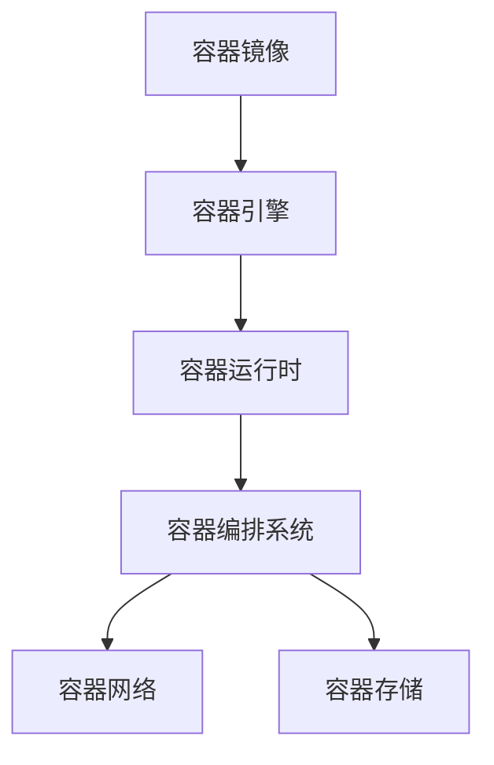

                 

关键词：容器化技术，云原生架构，Docker，Kubernetes，微服务，持续集成，持续部署，DevOps

摘要：本文将深入探讨容器化技术在云原生架构中的应用，重点分析Docker和Kubernetes这两大核心技术。通过对容器化技术的基本原理、应用场景、操作步骤和优缺点的详细讲解，结合实际项目实践，全面展示容器化技术在现代软件开发和运维中的重要性。最后，将对容器化技术的未来发展趋势与挑战进行展望，为读者提供全面的参考和指导。

## 1. 背景介绍

容器化技术是一种轻量级、可移植、自给自足的软件打包方式，旨在将应用程序及其依赖项打包到一个容器中，确保其能够跨不同环境和操作系统上无缝运行。这种技术最早起源于Linux操作系统中的cgroups和Namespace机制，旨在解决应用程序在不同环境中运行不一致的问题。

随着云计算和微服务架构的兴起，容器化技术逐渐成为软件开发和运维的关键技术之一。特别是在云原生架构中，容器化技术提供了高效的资源利用、快速部署和弹性伸缩等优势，使得应用程序能够更加敏捷地适应业务需求。

本文将主要围绕Docker和Kubernetes这两大核心技术展开讨论。Docker是一种开源的应用容器引擎，它通过将应用程序及其依赖打包成容器镜像，实现了应用程序的轻量级打包和快速部署。而Kubernetes则是一个开源的容器编排系统，用于自动化容器的部署、扩展和管理。

### 1.1 容器化技术的起源与发展

容器化技术的起源可以追溯到20世纪90年代，当时Linux操作系统引入了cgroups（控制组）和Namespace机制，为容器化技术的实现奠定了基础。cgroups允许系统管理员对进程资源进行隔离和限制，而Namespace则提供了进程间隔离的机制。

在2013年，Docker项目的创立标志着容器化技术的真正崛起。Docker通过提供简单易用的容器打包和管理工具，使得容器化技术迅速在开发者社区中得到普及。随后，Kubernetes在2014年诞生，作为一种高效的容器编排系统，进一步推动了容器化技术的发展。

随着容器化技术的不断成熟，它已经成为云计算和微服务架构的核心组成部分，为现代软件开发和运维带来了前所未有的变革。

### 1.2 容器化技术的核心概念

容器化技术涉及多个核心概念，包括容器、容器镜像、容器编排等。

- **容器**：容器是一种轻量级的、可执行的软件包，包含了应用程序及其运行时环境。容器通过隔离机制将应用程序与宿主机操作系统和其他容器隔离开来，确保应用程序的运行一致性和可移植性。

- **容器镜像**：容器镜像是一种静态的、只读的文件系统，包含了应用程序、库、配置文件等所有必需的依赖项。容器镜像通过分层存储技术实现，可以灵活地组合和修改，以满足不同应用程序的需求。

- **容器编排**：容器编排是指对容器进行部署、扩展和管理的过程。容器编排系统（如Kubernetes）提供了一系列自动化工具，使得开发者和管理员能够轻松地管理大规模的容器集群。

### 1.3 容器化技术的优势

容器化技术具有多个显著的优势，包括：

- **轻量级**：容器仅包含应用程序及其依赖，相比虚拟机，容器具有更小的资源占用和更快的启动速度。

- **可移植性**：容器可以在不同的操作系统和硬件平台上运行，确保了应用程序的一致性和可移植性。

- **隔离性**：容器通过隔离机制确保应用程序之间相互独立，降低了系统故障的风险。

- **灵活性**：容器支持微服务架构，使得应用程序可以更加灵活地分解和组合，提高了系统的可扩展性和可维护性。

## 2. 核心概念与联系

在深入探讨容器化技术的应用之前，我们需要了解其核心概念和架构。

### 2.1 容器化技术的基本原理

容器化技术通过以下基本原理实现应用程序的轻量级打包和部署：

1. **容器镜像**：容器镜像是一种静态的、只读的文件系统，包含了应用程序、库、配置文件等所有必需的依赖项。容器镜像通过分层存储技术实现，可以灵活地组合和修改，以满足不同应用程序的需求。

2. **容器引擎**：容器引擎（如Docker）负责创建、启动、停止和管理容器。容器引擎通过解析容器镜像，将应用程序及其依赖项加载到容器中，并为容器提供运行环境。

3. **容器编排系统**：容器编排系统（如Kubernetes）负责管理容器集群，包括容器的部署、扩展、监控和故障恢复等。容器编排系统提供了一系列自动化工具，使得开发者和管理员能够轻松地管理大规模的容器集群。

### 2.2 容器化技术的架构

容器化技术的架构主要包括以下几个组成部分：

1. **容器运行时**：容器运行时负责解析和管理容器镜像，提供容器运行所需的资源和服务。

2. **容器引擎**：容器引擎（如Docker）负责创建、启动、停止和管理容器。容器引擎通过解析容器镜像，将应用程序及其依赖项加载到容器中，并为容器提供运行环境。

3. **容器编排系统**：容器编排系统（如Kubernetes）负责管理容器集群，包括容器的部署、扩展、监控和故障恢复等。容器编排系统提供了一系列自动化工具，使得开发者和管理员能够轻松地管理大规模的容器集群。

4. **容器网络**：容器网络负责容器之间的通信和隔离，确保容器能够相互通信并保持独立性。

5. **容器存储**：容器存储负责容器数据的存储和管理，支持数据的持久化和共享。

### 2.3 容器化技术的核心概念与联系

以下是容器化技术的核心概念及其相互联系：

1. **容器镜像**：容器镜像是一种静态的、只读的文件系统，包含了应用程序、库、配置文件等所有必需的依赖项。容器镜像通过分层存储技术实现，可以灵活地组合和修改，以满足不同应用程序的需求。

2. **容器引擎**：容器引擎（如Docker）负责创建、启动、停止和管理容器。容器引擎通过解析容器镜像，将应用程序及其依赖项加载到容器中，并为容器提供运行环境。

3. **容器编排系统**：容器编排系统（如Kubernetes）负责管理容器集群，包括容器的部署、扩展、监控和故障恢复等。容器编排系统提供了一系列自动化工具，使得开发者和管理员能够轻松地管理大规模的容器集群。

4. **容器网络**：容器网络负责容器之间的通信和隔离，确保容器能够相互通信并保持独立性。

5. **容器存储**：容器存储负责容器数据的存储和管理，支持数据的持久化和共享。

以下是容器化技术的核心概念和架构的Mermaid流程图：



## 3. 核心算法原理 & 具体操作步骤

### 3.1 算法原理概述

容器化技术的核心算法主要涉及容器镜像的构建、容器引擎的管理和容器编排系统的调度。以下是这些算法的简要概述：

1. **容器镜像构建**：容器镜像构建算法通过将应用程序及其依赖项打包到一个只读的文件系统中，实现应用程序的轻量级打包和部署。构建过程通常使用Dockerfile，通过一系列指令将应用程序和依赖项组装成容器镜像。

2. **容器引擎管理**：容器引擎管理算法负责创建、启动、停止和管理容器。容器引擎（如Docker）通过解析容器镜像，为容器提供运行环境，并监控容器的状态和性能。

3. **容器编排系统调度**：容器编排系统调度算法负责管理容器集群，包括容器的部署、扩展、监控和故障恢复。容器编排系统（如Kubernetes）通过自动化工具和策略，确保容器集群的稳定运行和资源利用率。

### 3.2 算法步骤详解

以下是容器化技术核心算法的具体步骤：

1. **容器镜像构建**

   - 编写Dockerfile：根据应用程序的需求，编写Dockerfile，定义应用程序的依赖项、安装步骤和环境变量等。
   - 构建容器镜像：使用Docker命令构建容器镜像，将Dockerfile中的指令应用到容器镜像中。
   - 镜像仓库管理：将构建好的容器镜像推送到镜像仓库（如Docker Hub），以便后续部署和使用。

2. **容器引擎管理**

   - 启动容器：使用Docker命令启动容器，将容器镜像加载到容器引擎中，并为容器分配资源和网络接口。
   - 监控容器状态：使用Docker命令监控容器的状态和性能，包括容器的启动时间、CPU使用率、内存使用率等。
   - 停止和删除容器：根据需要停止和删除容器，释放容器占用的资源和网络接口。

3. **容器编排系统调度**

   - 定义部署策略：根据应用程序的需求，定义容器的部署策略，包括容器的数量、资源分配、网络设置等。
   - 部署容器：使用Kubernetes命令部署容器，将容器镜像应用到容器编排系统中，并按照部署策略进行容器的创建和启动。
   - 监控和管理容器：使用Kubernetes命令监控和管理容器，包括容器的状态、性能、日志等。
   - 扩展和缩容：根据业务需求，自动扩展和缩容容器，确保容器集群的稳定运行和资源利用率。

### 3.3 算法优缺点

容器化技术核心算法的优缺点如下：

- **优点**：
  - **轻量级**：容器化技术通过将应用程序及其依赖打包到容器镜像中，实现轻量级的部署和管理，提高了系统的性能和资源利用率。
  - **可移植性**：容器化技术使得应用程序可以在不同的操作系统和硬件平台上运行，确保了应用程序的一致性和可移植性。
  - **高可用性**：容器编排系统提供了自动化故障恢复和负载均衡功能，确保容器集群的稳定运行和高效利用。

- **缺点**：
  - **安全性**：容器化技术在一定程度上降低了系统的安全性，因为容器共享宿主机的内核，可能导致恶意容器对宿主机的影响。
  - **复杂性**：容器化技术的部署和管理需要一定的技术基础和运维经验，对于初学者来说可能会相对困难。

### 3.4 算法应用领域

容器化技术核心算法主要应用于以下领域：

- **云计算和微服务架构**：容器化技术是云计算和微服务架构的核心组成部分，通过容器化技术可以实现应用程序的快速部署、弹性扩展和高效管理。
- **持续集成和持续部署（CI/CD）**：容器化技术可以简化持续集成和持续部署的过程，通过自动化工具实现代码的构建、测试和部署，提高开发效率和软件质量。
- **DevOps文化**：容器化技术是DevOps文化的重要组成部分，通过容器化技术可以实现开发、测试和运维的紧密协作，促进软件开发和运维的自动化和标准化。

## 4. 数学模型和公式 & 详细讲解 & 举例说明

### 4.1 数学模型构建

容器化技术涉及到多个数学模型和公式，以下是一些常用的数学模型和公式：

1. **资源利用率**：

   资源利用率 = （实际使用资源 / 总资源）× 100%

   其中，实际使用资源包括CPU使用率、内存使用率、网络带宽等，总资源为系统提供的总资源。

2. **容器调度策略**：

   容器调度策略主要包括最小资源利用率策略、最大资源利用率策略、优先级策略等。

   - 最小资源利用率策略：将容器调度到资源利用率最低的节点上，以最大化资源利用率。
   - 最大资源利用率策略：将容器调度到资源利用率最高的节点上，以充分利用资源。
   - 优先级策略：根据容器的优先级进行调度，优先级高的容器优先调度。

3. **容器故障恢复**：

   容器故障恢复主要包括自动重启、滚动更新、蓝绿部署等策略。

   - 自动重启：当容器出现故障时，自动重启容器，确保服务的持续可用。
   - 滚动更新：逐步更新容器，确保在更新过程中服务的持续可用。
   - 蓝绿部署：同时运行两个版本的容器（蓝色和绿色），逐步切换流量，确保服务的平稳更新。

### 4.2 公式推导过程

以下是一个简单的容器调度策略的推导过程：

假设有N个节点，每个节点的资源利用率分别为r1, r2, ..., rN。我们需要选择一个节点来部署新容器，目标是最大化资源利用率。

1. 计算每个节点的资源利用率：

   - r1 = (实际使用资源1 / 总资源1) × 100%
   - r2 = (实际使用资源2 / 总资源2) × 100%
   - ...
   - rN = (实际使用资源N / 总资源N) × 100%

2. 计算每个节点的期望资源利用率：

   - r1' = (r1 × 总资源1) / N
   - r2' = (r2 × 总资源2) / N
   - ...
   - rN' = (rN × 总资源N) / N

3. 选择资源利用率最高的节点：

   - 选择节点i，使得ri'最大。

### 4.3 案例分析与讲解

假设有3个节点，节点的资源利用率如下：

- 节点1：CPU使用率80%，内存使用率70%，网络带宽使用率60%
- 节点2：CPU使用率50%，内存使用率40%，网络带宽使用率30%
- 节点3：CPU使用率90%，内存使用率80%，网络带宽使用率70%

根据最小资源利用率策略，我们需要选择一个节点来部署新容器，目标是最大化资源利用率。

1. 计算每个节点的资源利用率：

   - 节点1：CPU使用率80%，内存使用率70%，网络带宽使用率60%
   - 节点2：CPU使用率50%，内存使用率40%，网络带宽使用率30%
   - 节点3：CPU使用率90%，内存使用率80%，网络带宽使用率70%

2. 计算每个节点的期望资源利用率：

   - 节点1：期望CPU使用率40%，期望内存使用率28%，期望网络带宽使用率24%
   - 节点2：期望CPU使用率20%，期望内存使用率16%，期望网络带宽使用率12%
   - 节点3：期望CPU使用率18%，期望内存使用率16%，期望网络带宽使用率14%

3. 选择资源利用率最高的节点：

   - 节点1的期望资源利用率最高，因此选择节点1来部署新容器。

通过这个案例，我们可以看到最小资源利用率策略的选择过程。在实际应用中，可以根据具体情况选择不同的调度策略，以满足不同的业务需求。

## 5. 项目实践：代码实例和详细解释说明

### 5.1 开发环境搭建

在开始项目实践之前，我们需要搭建一个适合容器化技术开发的实验环境。以下是搭建开发环境的步骤：

1. 安装Docker：在Linux系统中，可以使用以下命令安装Docker：

   ```shell
   sudo apt-get update
   sudo apt-get install docker-ce docker-ce-cli containerd.io
   ```

   在Windows系统中，可以从Docker官网下载Docker Desktop并安装。

2. 安装Kubernetes：在Linux系统中，可以使用以下命令安装Kubernetes：

   ```shell
   curl -s https://packages.cloud.google.com/apt/doc/apt-key.gpg | sudo apt-key add -
   echo "deb https://apt.kubernetes.io/ kubernetes-xenial main" | sudo tee -a /etc/apt/sources.list
   sudo apt-get update
   sudo apt-get install kubeadm kubelet kubectl
   sudo systemctl enable kubelet
   ```

   在Windows系统中，可以使用Minikube搭建本地Kubernetes集群。

### 5.2 源代码详细实现

为了演示容器化技术的应用，我们以一个简单的Web应用程序为例，介绍如何使用Docker和Kubernetes进行开发、部署和管理。

1. **编写应用程序代码**：

   创建一个名为`webapp.py`的Python文件，实现一个简单的Web服务器功能：

   ```python
   from flask import Flask

   app = Flask(__name__)

   @app.route('/')
   def hello_world():
       return 'Hello, World!'

   if __name__ == '__main__':
       app.run(host='0.0.0.0', port=80)
   ```

2. **创建Dockerfile**：

   编写一个名为`Dockerfile`的文件，用于构建应用程序的容器镜像：

   ```Dockerfile
   FROM python:3.8

   WORKDIR /app

   COPY . .

   RUN pip install -r requirements.txt

   EXPOSE 80

   CMD ["python", "webapp.py"]
   ```

3. **构建容器镜像**：

   使用以下命令构建应用程序的容器镜像：

   ```shell
   docker build -t webapp .
   ```

4. **运行容器**：

   使用以下命令运行应用程序容器：

   ```shell
   docker run -d -p 8080:80 webapp
   ```

   这将启动一个容器，并将容器的80端口映射到宿主机的8080端口，以便通过浏览器访问应用程序。

5. **部署到Kubernetes**：

   创建一个名为`deployment.yaml`的Kubernetes部署文件，用于部署应用程序：

   ```yaml
   apiVersion: apps/v1
   kind: Deployment
   metadata:
     name: webapp
   spec:
     replicas: 3
     selector:
       matchLabels:
         app: webapp
     template:
       metadata:
         labels:
           app: webapp
       spec:
         containers:
         - name: webapp
           image: webapp:latest
           ports:
           - containerPort: 80
   ```

   使用以下命令部署应用程序：

   ```shell
   kubectl apply -f deployment.yaml
   ```

   这将创建一个包含3个副本的部署，确保应用程序的可用性和负载均衡。

### 5.3 代码解读与分析

在这个项目中，我们通过以下步骤实现了一个简单的Web应用程序：

1. **编写应用程序代码**：使用Python编写Web应用程序，实现基本的Web服务器功能。
2. **创建Dockerfile**：定义容器镜像的构建过程，将应用程序及其依赖打包到容器镜像中。
3. **构建容器镜像**：使用Docker命令构建应用程序的容器镜像，并推送到镜像仓库。
4. **运行容器**：使用Docker命令运行容器，将容器镜像加载到宿主机中。
5. **部署到Kubernetes**：使用Kubernetes命令部署应用程序，确保容器集群的稳定运行和资源利用率。

通过这个项目实践，我们可以看到容器化技术在开发、部署和管理中的应用。容器化技术使得应用程序的打包、部署和管理变得更加简单和高效，提高了开发效率和软件质量。

### 5.4 运行结果展示

在成功部署应用程序后，我们可以通过以下方式访问Web服务器：

1. **通过浏览器访问**：

   在浏览器中输入宿主机的IP地址和端口（例如：http://<宿主机IP>:8080），将看到Web服务器的欢迎页面：

   ```html
   Hello, World!
   ```

2. **通过Kubernetes集群访问**：

   如果使用Kubernetes集群部署应用程序，可以通过以下命令获取负载均衡器的地址：

   ```shell
   kubectl get svc webapp
   ```

   输出中包含负载均衡器的IP地址和端口，通过浏览器访问该地址，同样可以看到Web服务器的欢迎页面。

通过这些运行结果，我们可以验证容器化技术和Kubernetes在部署和管理应用程序方面的有效性和可靠性。

## 6. 实际应用场景

容器化技术在现代软件开发和运维中有着广泛的应用场景。以下是一些常见的应用场景：

### 6.1 云原生应用开发

云原生应用开发是容器化技术最为典型的应用场景之一。云原生应用是指那些专门为云环境设计、开发和部署的应用程序。这类应用程序通常采用微服务架构，能够充分利用容器化技术的轻量级、可移植性和弹性伸缩等优势。通过容器化技术，开发人员可以更加灵活地开发和部署应用程序，快速响应业务需求。

### 6.2 持续集成和持续部署

持续集成和持续部署（CI/CD）是软件开发中重要的实践，容器化技术可以大大简化这一过程。通过容器镜像，开发人员可以将代码快速构建、测试和部署到生产环境。容器编排系统（如Kubernetes）可以自动化部署和管理容器，确保应用程序的持续可用性和稳定性。

### 6.3 DevOps文化推广

DevOps文化的核心在于开发和运维团队的紧密协作和自动化。容器化技术是实现DevOps文化的重要工具，它将开发、测试和运维流程集成在一起，提高了团队的协作效率和系统的稳定性。通过容器化技术，开发人员和运维人员可以更加紧密地合作，共同推动软件交付的持续改进。

### 6.4 容器编排与调度

容器编排和调度是容器化技术的重要应用之一。容器编排系统（如Kubernetes）可以自动化容器的部署、扩展、监控和故障恢复等操作，确保容器集群的高效运行。容器调度策略可以根据资源利用率、容器优先级等指标，智能地分配容器到不同的节点，提高资源利用率和系统性能。

### 6.5 云服务与混合云架构

容器化技术可以支持云服务和混合云架构的构建。通过容器化技术，应用程序可以在公有云、私有云和边缘云之间灵活迁移和部署，实现跨云服务的高效运营。容器化技术还支持混合云架构的构建，使得企业可以充分利用公有云和私有云的资源优势，实现混合云的平滑过渡。

### 6.6 未来应用展望

随着容器化技术的不断发展，未来将会有更多的应用场景和商业模式涌现。例如，容器化技术可以支持物联网（IoT）设备的快速开发和部署，实现大规模物联网应用的构建。此外，容器化技术还可以在区块链、人工智能等新兴领域发挥重要作用，为这些领域的创新提供强大的支持。

## 7. 工具和资源推荐

为了更好地理解和应用容器化技术，以下是一些推荐的工具和资源：

### 7.1 学习资源推荐

- **《Docker实战》**：本书详细介绍了Docker的安装、配置和使用方法，适合初学者和有经验开发者阅读。
- **《Kubernetes权威指南》**：这本书是Kubernetes官方文档的中文翻译，全面讲解了Kubernetes的架构、功能和使用方法。
- **《云原生应用架构》**：这本书深入探讨了云原生应用的设计原则和实践方法，对于理解云原生架构有很高的参考价值。

### 7.2 开发工具推荐

- **Docker Desktop**：Docker的官方桌面版，适用于Windows和Mac操作系统，方便开发者进行容器化技术的学习和实验。
- **Kubernetes Dashboard**：Kubernetes的Web界面，可以方便地管理Kubernetes集群中的资源和容器。
- **Jenkins**：开源的持续集成和持续部署工具，可以与Docker和Kubernetes集成，实现自动化部署和管理。

### 7.3 相关论文推荐

- **《容器编排系统的设计与实现：以Kubernetes为例》**：这篇论文详细分析了Kubernetes的设计原理和实现细节，对于理解容器编排系统有很高的参考价值。
- **《容器化技术在云计算中的应用研究》**：这篇论文探讨了容器化技术在云计算中的应用场景和优势，分析了容器化技术在云计算领域的未来发展。
- **《基于容器化的微服务架构设计与实现》**：这篇论文介绍了基于容器化的微服务架构的设计原则和实现方法，对于理解微服务架构和容器化技术的结合有很好的参考作用。

## 8. 总结：未来发展趋势与挑战

容器化技术作为现代软件开发和运维的关键技术，正不断推动着云计算和微服务架构的发展。未来，容器化技术将在多个领域发挥更大的作用，包括物联网、人工智能、区块链等新兴领域。

### 8.1 研究成果总结

近年来，容器化技术取得了显著的成果，包括：

- **Docker和Kubernetes的普及**：Docker和Kubernetes已经成为容器化技术的代表，广泛应用于云计算和微服务架构中。
- **容器化技术的标准化**：容器化技术的标准化工作不断推进，如OCI（开放容器倡议）和CNCF（云原生计算基金会）等组织推动了容器化技术的标准化和生态建设。
- **容器编排和调度算法的创新**：随着容器化技术的不断发展，新的容器编排和调度算法不断涌现，提高了资源利用率和系统性能。

### 8.2 未来发展趋势

未来，容器化技术将呈现以下发展趋势：

- **多架构支持**：容器化技术将支持更多操作系统和硬件平台，实现更广泛的跨平台应用。
- **智能化和自动化**：容器化技术将更加智能化和自动化，通过机器学习和人工智能技术，提高容器的部署、监控和管理效率。
- **融合新兴技术**：容器化技术将与其他新兴技术（如物联网、区块链等）融合，为这些领域提供强大的支持。

### 8.3 面临的挑战

尽管容器化技术取得了显著成果，但在发展过程中仍面临以下挑战：

- **安全性**：容器化技术在一定程度上降低了系统的安全性，如何保证容器安全成为重要问题。
- **复杂性和运维**：容器化技术的部署和管理需要一定的技术基础和运维经验，如何简化部署和管理流程，提高运维效率是重要挑战。
- **生态建设和标准化**：容器化技术的生态建设和标准化工作仍需进一步完善，以支持更广泛的应用场景。

### 8.4 研究展望

未来，容器化技术的研究方向将包括：

- **安全性研究**：加强容器安全防护，提高容器安全性。
- **智能化和自动化研究**：通过机器学习和人工智能技术，实现容器的智能化和自动化管理。
- **多架构支持研究**：拓展容器化技术的应用范围，支持更多操作系统和硬件平台。
- **融合新兴技术研究**：与物联网、区块链等新兴技术融合，推动容器化技术的创新发展。

## 9. 附录：常见问题与解答

### 9.1 容器化技术与虚拟化技术的区别

**问**：容器化技术是否可以完全替代虚拟化技术？

**答**：容器化技术并不完全替代虚拟化技术，而是与之互补。虚拟化技术通过虚拟化硬件资源，提供完全隔离的虚拟环境，适用于需要高隔离性的场景。而容器化技术则通过轻量级的虚拟化方式，实现应用程序及其依赖的打包和部署，适用于需要高效资源利用和快速部署的场景。在某些情况下，容器化技术和虚拟化技术可以结合使用，以实现最佳的性能和隔离性。

### 9.2 Kubernetes与Docker的关系

**问**：Kubernetes和Docker之间是什么关系？

**答**：Kubernetes是一个容器编排系统，主要用于管理容器集群，而Docker是一个容器引擎，负责创建和管理容器。Kubernetes可以与Docker配合使用，通过Docker创建和管理容器，然后由Kubernetes进行编排和管理。Docker为Kubernetes提供了容器化技术的基础，而Kubernetes则提供了自动化部署、扩展和管理容器的功能。

### 9.3 容器化技术的安全性问题

**问**：容器化技术是否安全？

**答**：容器化技术在安全性方面存在一些挑战。由于容器共享宿主机的内核，可能导致恶意容器对宿主机的影响。然而，通过以下措施可以提高容器化技术的安全性：

- **使用安全的容器镜像**：确保容器镜像来自可靠的来源，并使用安全扫描工具检测容器镜像中的漏洞。
- **限制容器权限**：通过配置容器权限，限制容器对宿主机资源的访问，减少安全风险。
- **容器网络隔离**：使用容器网络隔离技术，确保容器之间相互独立，降低容器间攻击的风险。
- **定期更新和打补丁**：定期更新容器操作系统和应用程序，确保安全补丁及时应用。

### 9.4 容器化技术的适用场景

**问**：容器化技术适用于哪些场景？

**答**：容器化技术适用于以下场景：

- **云计算和微服务架构**：容器化技术可以支持云计算和微服务架构的构建，提高资源利用率和系统性能。
- **持续集成和持续部署**：容器化技术可以简化持续集成和持续部署的过程，提高开发效率和软件质量。
- **DevOps文化推广**：容器化技术是实现DevOps文化的重要工具，可以提高团队的协作效率和系统的稳定性。
- **跨平台部署**：容器化技术可以支持跨平台部署，确保应用程序在不同操作系统和硬件平台上的一致性和可移植性。

