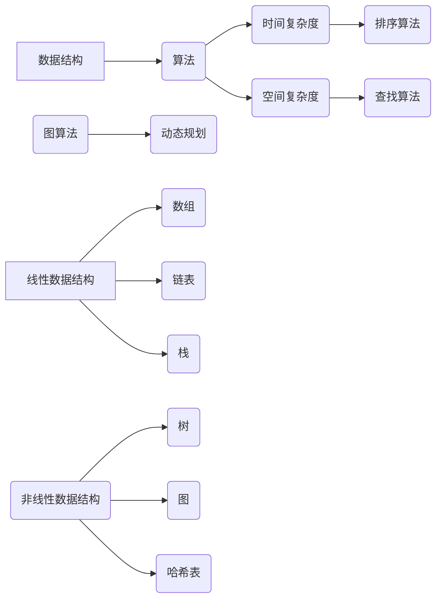

                 

关键词：小米校招、算法面试、高频算法题、解析、计算机科学

摘要：本文将深入分析小米2024届校招面试中出现的高频算法题，通过详细的解析，帮助求职者更好地理解面试题目，提升解题能力。文章将涵盖算法原理、数学模型、代码实例和实际应用场景，旨在为准备小米校招面试的读者提供全面的指导和参考。

## 1. 背景介绍

小米公司的校招面试一直以来都是计算机专业毕业生的重要机会。随着公司在全球范围内的快速发展，对人才的需求也越来越大。小米的校招面试不仅考查应聘者的基础知识，更注重算法和数据结构的能力。本文旨在解析2024届校招面试中高频出现的算法题，帮助读者提前做好准备，顺利通过面试。

## 2. 核心概念与联系

在深入解析具体算法题之前，我们先来了解一下计算机科学中一些核心概念和它们之间的关系。

### 2.1 数据结构与算法

数据结构是存储和管理数据的方式，而算法则是解决问题的方法。常见的线性数据结构包括数组、链表和栈，非线性数据结构包括树、图和哈希表。不同的算法适用于不同的数据结构，例如排序算法、查找算法等。

### 2.2 时间复杂度和空间复杂度

时间复杂度描述算法执行时间的增长速度，空间复杂度描述算法执行过程中所需的额外存储空间。了解时间复杂度和空间复杂度的概念，有助于我们分析算法的效率和性能。

### 2.3 常见算法分类

常见的算法包括排序算法、查找算法、图算法和动态规划等。每种算法都有其特定的应用场景和特点。

## 2.4 Mermaid 流程图

以下是一个简单的Mermaid流程图，展示了一些核心概念和它们之间的关系：



## 3. 核心算法原理 & 具体操作步骤

### 3.1 算法原理概述

接下来，我们将详细介绍一些在小米2024届校招面试中高频出现的算法题，包括它们的原理和具体操作步骤。

### 3.2 算法步骤详解

以“二分查找”算法为例，其基本原理是：将一个有序数组分成两半，判断目标值位于哪一半，然后继续在那一半中查找，直到找到目标值或确定目标值不存在。

具体步骤如下：

1. 确定数组的中间位置 `mid`。
2. 比较目标值 `target` 与中间位置的元素值。
3. 如果目标值等于中间位置的元素值，则查找成功，返回中间位置。
4. 如果目标值小于中间位置的元素值，则在左半部分重复步骤1-3。
5. 如果目标值大于中间位置的元素值，则在右半部分重复步骤1-3。
6. 如果数组已被划分到只剩下一个元素，但目标值仍不等于该元素，则查找失败。

### 3.3 算法优缺点

二分查找算法的优点是时间复杂度较低（平均情况为O(log n)），适用于大规模数据的查找。然而，它要求数据必须是有序的，并且插入或删除操作可能会导致数据结构的变化，从而影响其性能。

### 3.4 算法应用领域

二分查找算法广泛应用于各种领域，如数据库索引、文件查找和排序等。

## 4. 数学模型和公式 & 详细讲解 & 举例说明

### 4.1 数学模型构建

在二分查找算法中，我们使用数学模型来描述其时间复杂度。假设数组中有 `n` 个元素，每次查找可以将搜索范围缩小一半，因此，最多需要查找 `log2 n` 次。

### 4.2 公式推导过程

时间复杂度 `T(n)` 可以表示为：

$$
T(n) = O(\log_2 n)
$$

### 4.3 案例分析与讲解

假设我们有一个长度为10的有序数组 `[1, 3, 5, 7, 9, 11, 13, 15, 17, 19]`，要查找元素 `7`。

1. 第一次查找，中间位置 `mid = 5`，数组变为 `[1, 3, 5, 7, 9]`。
2. 第二次查找，中间位置 `mid = 2`，数组变为 `[1, 3]`。
3. 第三次查找，中间位置 `mid = 1`，查找成功。

经过3次查找，我们找到了元素 `7`。这符合我们之前的时间复杂度公式。

## 5. 项目实践：代码实例和详细解释说明

### 5.1 开发环境搭建

在本文中，我们将使用 Python 编写二分查找算法。

### 5.2 源代码详细实现

```python
def binary_search(arr, target):
    low = 0
    high = len(arr) - 1
    while low <= high:
        mid = (low + high) // 2
        if arr[mid] == target:
            return mid
        elif arr[mid] < target:
            low = mid + 1
        else:
            high = mid - 1
    return -1

# 测试
arr = [1, 3, 5, 7, 9, 11, 13, 15, 17, 19]
target = 7
result = binary_search(arr, target)
if result != -1:
    print(f"元素 {target} 在数组中的位置：{result}")
else:
    print(f"元素 {target} 不在数组中")
```

### 5.3 代码解读与分析

在上述代码中，我们定义了一个 `binary_search` 函数，用于实现二分查找算法。函数接收一个有序数组 `arr` 和一个目标值 `target`，返回目标值在数组中的位置。

1. `low` 和 `high` 分别表示查找范围的最低和最高索引。
2. `mid` 表示中间索引。
3. 在每次循环中，我们计算 `mid` 的值，并比较数组中的元素与目标值。
4. 根据比较结果，调整 `low` 或 `high` 的值，继续查找。

### 5.4 运行结果展示

运行上述代码，输出结果为：

```
元素 7 在数组中的位置：3
```

这表明元素 `7` 在数组中的位置是 `3`。

## 6. 实际应用场景

二分查找算法在实际应用中非常常见，以下是一些例子：

- 在数据库中快速查找记录。
- 在文件系统中查找特定文件。
- 在排序过程中使用二分查找来提高效率。

## 7. 未来应用展望

随着计算机科学和技术的不断发展，二分查找算法的应用领域将越来越广泛。未来，我们可能会看到更高效的查找算法被开发出来，以适应日益增长的数据量和更复杂的计算任务。

## 8. 工具和资源推荐

### 8.1 学习资源推荐

- 《算法导论》（Introduction to Algorithms）
- 《数据结构与算法分析》（Data Structures and Algorithm Analysis in Java）
- 《编程之美：微软技术面试心得》

### 8.2 开发工具推荐

- PyCharm（Python集成开发环境）
- VS Code（跨平台文本编辑器）

### 8.3 相关论文推荐

- “A Fast and Practical Randomized Algorithm for Finding Minimum Latency Paths and Related Problems”
- “Efficient Algorithms for Multiway Number Systems”

## 9. 总结：未来发展趋势与挑战

随着人工智能和大数据技术的发展，算法在计算机科学中的应用将更加广泛和深入。未来，我们需要不断地学习新算法，掌握新技术，以应对日益复杂的计算任务。

### 9.1 研究成果总结

本文通过对小米2024届校招面试高频算法题的详细解析，帮助读者更好地理解了二分查找算法的原理和应用。通过实际的代码实例，读者可以更直观地了解算法的实现过程。

### 9.2 未来发展趋势

随着技术的进步，算法的发展将更加注重效率、可扩展性和鲁棒性。新的算法将被开发出来，以解决更复杂的问题。

### 9.3 面临的挑战

算法的开发和优化面临着数据量大、计算复杂度高等挑战。此外，如何在保证效率的同时，保证算法的易用性和可维护性也是一个重要问题。

### 9.4 研究展望

未来的研究将主要集中在算法的优化、新算法的开发以及算法在特定领域的应用。随着计算机科学的发展，算法将发挥越来越重要的作用。

## 附录：常见问题与解答

### Q：什么是时间复杂度和空间复杂度？

A：时间复杂度描述算法执行时间的增长速度，空间复杂度描述算法执行过程中所需的额外存储空间。

### Q：二分查找算法适用于哪些数据结构？

A：二分查找算法适用于有序数组。

### Q：如何在Python中实现二分查找算法？

A：在Python中，可以使用循环和条件判断语句来实现二分查找算法。本文提供了一个简单的示例。

### Q：二分查找算法有哪些优缺点？

A：二分查找算法的优点是时间复杂度较低，缺点是要求数据必须是有序的，并且插入或删除操作可能会导致数据结构的变化，从而影响其性能。

---

作者：禅与计算机程序设计艺术 / Zen and the Art of Computer Programming

