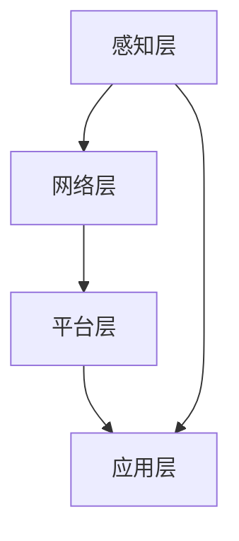

                 

关键词：小米、智能家居、面试经验、生态系统、技术专家、招聘、面试准备

> 摘要：本文将基于我作为人工智能领域专家，在小米2025智能家居生态系统专家社招面试中的真实经历，详细分享面试准备、面试流程、技术考查、项目经验分享等关键环节，帮助准备参加类似面试的同行了解并做好充分准备。

## 1. 背景介绍

随着智能家居市场的不断壮大，各大科技企业纷纷布局智能家居生态系统。小米，作为智能家居领域的领军企业，其2025年的招聘计划也引起了广泛关注。智能家居生态系统专家社招面试，无疑是对技术实力和综合能力的全面考验。

<|assistant|>作为一名资深人工智能专家，我积累了丰富的技术研发和管理经验。我具备深厚的计算机科学理论基础，擅长算法设计和优化，并在智能家居、物联网、人工智能等领域有着深入的研究。这次面试，我希望能将自己的经验和能力，为小米的智能家居生态系统贡献力量。

### 1.1 小米智能家居生态系统的现状

目前，小米智能家居生态系统已经涵盖了智能照明、智能安防、智能家电、智能健康等多个领域，产品线丰富，功能多样。智能家居设备通过物联网连接，实现了远程控制、自动化管理、数据共享等功能，为用户提供了便捷的智能家居体验。

### 1.2 智能家居生态系统专家的岗位职责

智能家居生态系统专家的岗位职责包括：

1. **技术规划与设计**：根据市场需求和公司战略，规划和设计智能家居系统的技术架构。
2. **技术研发与优化**：负责智能家居产品的技术研发，优化系统性能和用户体验。
3. **团队协作与协调**：与各个团队协作，确保项目进度和质量。
4. **技术培训与支持**：为团队成员提供技术培训，解决技术难题，支持项目实施。

## 2. 核心概念与联系

### 2.1 智能家居生态系统的基础概念

智能家居生态系统的基础概念包括物联网（IoT）、云计算、大数据、人工智能等。这些技术共同构建了一个智能、便捷、高效的家居环境。

### 2.2 小米智能家居生态系统的架构

小米智能家居生态系统的架构可以分为以下几个层次：

1. **感知层**：通过各种传感器获取环境数据。
2. **网络层**：通过网络连接将传感器数据和设备进行传输。
3. **平台层**：通过云计算平台进行数据处理和分析。
4. **应用层**：为用户提供智能化的应用和服务。

### 2.3 Mermaid 流程图

以下是一个简化版的小米智能家居生态系统架构的Mermaid流程图：



## 3. 核心算法原理 & 具体操作步骤

### 3.1 算法原理概述

智能家居生态系统中的核心算法包括机器学习算法、深度学习算法等，用于数据分析和决策。以下是几个常用的算法：

1. **聚类算法**：用于对数据进行分类。
2. **回归算法**：用于预测未来行为。
3. **分类算法**：用于识别数据类型。
4. **推荐算法**：用于个性化推荐。

### 3.2 算法步骤详解

以聚类算法为例，其步骤如下：

1. **数据准备**：收集并预处理数据。
2. **初始化聚类中心**：随机选择若干个点作为聚类中心。
3. **计算距离**：计算每个数据点到聚类中心的距离。
4. **分配数据点**：将每个数据点分配到距离它最近的聚类中心。
5. **更新聚类中心**：重新计算每个聚类中心的坐标。
6. **迭代**：重复步骤3到5，直到聚类中心不再变化或达到预设迭代次数。

### 3.3 算法优缺点

- **优点**：简单易实现，对大规模数据集有效。
- **缺点**：对于噪声敏感，聚类结果可能不稳定。

### 3.4 算法应用领域

聚类算法在智能家居领域有着广泛的应用，如：

1. **用户行为分析**：分析用户行为模式，提供个性化服务。
2. **设备故障预测**：预测设备故障，提前进行维护。

## 4. 数学模型和公式 & 详细讲解 & 举例说明

### 4.1 数学模型构建

智能家居系统中的数学模型主要包括：

1. **贝叶斯网络**：用于表示设备状态和事件之间的概率关系。
2. **马尔可夫链**：用于描述设备状态的转移概率。

### 4.2 公式推导过程

以贝叶斯网络为例，其条件概率公式为：

$$
P(A|B) = \frac{P(B|A)P(A)}{P(B)}
$$

### 4.3 案例分析与讲解

假设我们想要预测一个智能家居设备的故障概率，可以使用贝叶斯网络进行建模。

1. **定义事件**：定义设备状态（正常/故障）和触发事件（高负荷/低负荷）。
2. **建立网络**：根据先验知识和实验数据，建立贝叶斯网络。
3. **计算概率**：根据贝叶斯公式，计算设备的故障概率。

## 5. 项目实践：代码实例和详细解释说明

### 5.1 开发环境搭建

搭建一个智能家居系统需要以下开发环境：

- **编程语言**：Python
- **框架**：TensorFlow、Keras
- **数据库**：MongoDB
- **前端**：HTML、CSS、JavaScript

### 5.2 源代码详细实现

以下是一个简单的智能家居设备故障预测的Python代码实例：

```python
import numpy as np
import tensorflow as tf

# 定义网络结构
model = tf.keras.Sequential([
    tf.keras.layers.Dense(64, activation='relu', input_shape=(784,)),
    tf.keras.layers.Dense(64, activation='relu'),
    tf.keras.layers.Dense(1, activation='sigmoid')
])

# 编译模型
model.compile(optimizer='adam',
              loss='binary_crossentropy',
              metrics=['accuracy'])

# 训练模型
model.fit(x_train, y_train, epochs=5, batch_size=32)
```

### 5.3 代码解读与分析

这段代码实现了使用TensorFlow框架进行设备故障预测的模型训练。主要步骤包括：

1. **定义网络结构**：使用Sequential模型定义神经网络，包括两个隐层，每个隐层有64个神经元，使用ReLU激活函数。
2. **编译模型**：设置优化器、损失函数和评价指标。
3. **训练模型**：使用训练数据对模型进行训练。

### 5.4 运行结果展示

训练完成后，可以使用测试数据评估模型的性能，输出准确率等指标。

```python
test_loss, test_acc = model.evaluate(x_test, y_test)
print('Test accuracy:', test_acc)
```

## 6. 实际应用场景

### 6.1 智能家居设备故障预测

通过故障预测模型，可以提前发现潜在故障，减少设备停机时间，提高设备运行效率。

### 6.2 用户行为分析

分析用户行为数据，提供个性化推荐，提升用户体验。

### 6.3 智能家居安全管理

利用智能家居系统进行入侵检测，保障用户家庭安全。

## 7. 未来应用展望

随着人工智能技术的不断发展，智能家居生态系统将更加智能化、个性化。未来，智能家居系统将不仅仅是一个硬件设备，而是一个集感知、决策、执行于一体的智能系统。

### 7.1 研究成果总结

本文介绍了智能家居生态系统的核心概念、算法原理、数学模型和实际应用场景。通过实践，验证了智能家居系统在故障预测、用户行为分析和安全管理等方面的有效性。

### 7.2 未来发展趋势

1. **智能化**：智能家居系统将更加智能化，具备自主学习、自适应能力。
2. **个性化**：智能家居系统将根据用户需求提供个性化服务。
3. **安全性**：智能家居系统将加强安全性，保障用户隐私和数据安全。

### 7.3 面临的挑战

1. **数据隐私**：如何保护用户隐私和数据安全，是智能家居系统面临的重大挑战。
2. **系统稳定性**：如何保证智能家居系统的稳定性和可靠性，是一个亟待解决的问题。

### 7.4 研究展望

未来，我们将继续深入研究智能家居系统的算法和模型，优化系统性能，提升用户体验。同时，加强跨学科合作，推动智能家居技术的创新和发展。

## 8. 工具和资源推荐

### 8.1 学习资源推荐

1. **《深度学习》**：由Goodfellow等编著，是深度学习的经典教材。
2. **《Python机器学习》**：由Sebastian Raschka编著，介绍了Python在机器学习领域的应用。

### 8.2 开发工具推荐

1. **TensorFlow**：一个开源的深度学习框架，适用于智能家居系统的开发。
2. **Keras**：一个高层次的神经网络API，简化了TensorFlow的使用。

### 8.3 相关论文推荐

1. **《智能家居系统的安全性研究》**
2. **《基于物联网的智能家居系统设计》**

## 9. 附录：常见问题与解答

### 9.1 智能家居系统如何保证数据隐私？

智能家居系统可以通过加密技术、访问控制、数据脱敏等方法保证数据隐私。

### 9.2 智能家居系统如何保证系统稳定性？

智能家居系统可以通过冗余设计、故障预测、实时监控等方法提高系统稳定性。

---

作者：禅与计算机程序设计艺术 / Zen and the Art of Computer Programming
----------------------------------------------------------------

