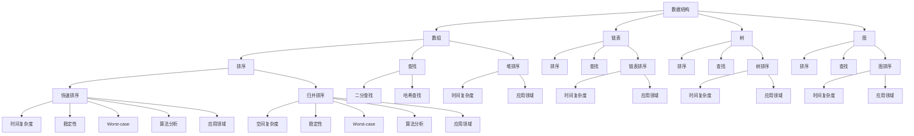

                 

关键词：小米校招、编程面试、面试题、算法、数据结构、编程技巧

> 摘要：本文将围绕小米2025校招编程面试题进行深入剖析，总结出其中的核心考点和常见题型，并结合实际操作，提供详细的解题思路和策略，旨在帮助准备校招的同学们更好地应对面试挑战。

## 1. 背景介绍

每年的校招季，各大互联网公司都会发布各自的面试题库，以选拔优秀的人才。小米作为全球知名的科技公司，其校招编程面试题历来以难度高、覆盖面广而著称。2025年的校招更是将编程面试推向了一个新的高度，不仅考察基础算法和数据结构，还深入探讨了前沿技术领域的问题。

本文旨在整理和分析小米2025校招编程面试题，提炼出其中的精华内容，帮助广大考生更好地备战校招。文章结构将分为以下几个部分：

- **背景介绍**：简要介绍小米及2025校招编程面试的背景。
- **核心概念与联系**：阐述编程面试中的核心概念和架构，使用Mermaid流程图展示。
- **核心算法原理与具体操作步骤**：详细讲解算法原理和操作步骤，分析其优缺点和应用领域。
- **数学模型和公式**：构建数学模型，推导公式，并进行案例分析与讲解。
- **项目实践**：提供代码实例，详细解释其实现过程。
- **实际应用场景**：探讨算法在实际中的应用和未来展望。
- **工具和资源推荐**：推荐学习资源、开发工具和相关论文。
- **总结**：总结研究成果，展望未来发展趋势和挑战。
- **附录**：解答常见问题。

### 1.1 小米校招编程面试的重要性

小米校招编程面试是考生进入公司技术岗位的重要门槛。面试难度较高，考查范围广泛，不仅包括基本的编程能力和数据结构、算法知识，还涉及到系统设计、软件开发实践等更高层次的技能。因此，对考生来说，掌握面试题的核心考点和策略至关重要。

### 1.2 2025校招编程面试的趋势

2025年的小米校招编程面试呈现以下几个特点：

1. **题目难度加大**：题目难度普遍高于往年，尤其是算法和数据结构部分。
2. **综合能力考察**：不仅考查编程技能，还涉及系统设计、软件工程等综合能力。
3. **前沿技术融合**：面试题目中涉及到人工智能、大数据、云计算等前沿技术。
4. **多样性题目**：除了传统的算法题，还包含编程实战、系统设计等多样题型。

## 2. 核心概念与联系

为了更好地理解和解决编程面试题，我们需要掌握以下几个核心概念和联系：

- **数据结构**：包括数组、链表、树、图等基本数据结构，以及它们的操作和特点。
- **算法**：常见的排序、查找、动态规划、贪心算法等算法，以及其实现和应用。
- **编程语言**：掌握一门或多门编程语言，如C++、Java、Python等，对解决编程问题至关重要。
- **系统设计**：涉及系统的架构、模块设计、接口设计等，考查考生的系统分析能力。

以下是一个使用Mermaid绘制的流程图，展示了这些核心概念和联系：



通过上述流程图，我们可以清晰地看到数据结构和算法之间的联系，以及它们在不同场景下的应用。

## 3. 核心算法原理与具体操作步骤

在小米2025校招编程面试中，算法题是一个重要的考查点。下面，我们将详细讲解几个核心算法原理和具体操作步骤。

### 3.1 算法原理概述

- **排序算法**：常见的排序算法包括快速排序、归并排序、堆排序等。它们的基本原理是通过比较和交换元素的位置，将一组无序的数据转化为有序数据。
- **查找算法**：查找算法包括二分查找、哈希查找等。二分查找是通过逐步缩小查找范围，直到找到目标元素或确定其不存在；哈希查找则是通过哈希函数将关键字转化为地址，直接访问存储位置。
- **动态规划**：动态规划是一种解决优化问题的方法，通过将问题分解为更小的子问题，并存储子问题的解，避免重复计算。

### 3.2 算法步骤详解

#### 3.2.1 快速排序

快速排序的基本步骤如下：

1. 选择一个基准元素。
2. 将数组划分为两个子数组，一个包含小于基准元素的元素，另一个包含大于基准元素的元素。
3. 递归地对两个子数组进行快速排序。

以下是快速排序的Python代码实现：

```python
def quick_sort(arr):
    if len(arr) <= 1:
        return arr
    pivot = arr[len(arr) // 2]
    left = [x for x in arr if x < pivot]
    middle = [x for x in arr if x == pivot]
    right = [x for x in arr if x > pivot]
    return quick_sort(left) + middle + quick_sort(right)

arr = [3, 6, 8, 10, 1, 2, 1]
sorted_arr = quick_sort(arr)
print(sorted_arr)
```

#### 3.2.2 二分查找

二分查找的基本步骤如下：

1. 确定数组的中间元素。
2. 比较中间元素与目标值。
3. 如果相等，返回索引；如果不等，更新查找范围，并重复步骤1和2。

以下是二分查找的Python代码实现：

```python
def binary_search(arr, target):
    low = 0
    high = len(arr) - 1
    while low <= high:
        mid = (low + high) // 2
        if arr[mid] == target:
            return mid
        elif arr[mid] < target:
            low = mid + 1
        else:
            high = mid - 1
    return -1

arr = [1, 2, 3, 4, 5, 6, 7, 8, 9]
target = 5
result = binary_search(arr, target)
print(result)
```

#### 3.2.3 动态规划

动态规划的基本步骤如下：

1. 确定状态和状态转移方程。
2. 根据状态转移方程计算最优解。

以下是动态规划解决斐波那契数列的Python代码实现：

```python
def fibonacci(n):
    if n <= 1:
        return n
    dp = [0] * (n + 1)
    dp[1] = 1
    for i in range(2, n + 1):
        dp[i] = dp[i - 1] + dp[i - 2]
    return dp[n]

n = 10
result = fibonacci(n)
print(result)
```

### 3.3 算法优缺点

#### 3.3.1 快速排序

- **优点**：时间复杂度为O(nlogn)，适用于大规模数据排序。
- **缺点**：最坏情况下时间复杂度为O(n^2)，不稳定性可能影响性能。

#### 3.3.2 二分查找

- **优点**：时间复杂度为O(logn)，适用于有序数组查找。
- **缺点**：需要额外的空间存储中间结果。

#### 3.3.3 动态规划

- **优点**：适用于解决优化问题，避免重复计算。
- **缺点**：代码实现复杂，需要仔细设计状态转移方程。

### 3.4 算法应用领域

- **快速排序**：广泛应用于数据库排序、文件系统排序等。
- **二分查找**：用于搜索算法、查找数据结构等。
- **动态规划**：用于背包问题、最短路径问题等。

## 4. 数学模型和公式

数学模型是解决编程问题的重要工具。以下我们将构建数学模型，推导相关公式，并进行案例分析与讲解。

### 4.1 数学模型构建

#### 4.1.1 背包问题

背包问题是一种经典的优化问题，给定一组物品，每个物品有一个价值和一个重量，要求在总重量不超过限制的情况下，选取物品的组合使得总价值最大。

#### 4.1.2 状态转移方程

设dp[i][j]表示在前i个物品中，选取物品组合使得总价值最大且总重量不超过j的情况下的最大价值。状态转移方程如下：

$$
dp[i][j] =
\begin{cases}
dp[i-1][j], & \text{若不选取第i个物品} \\
dp[i-1][j-w_i] + v_i, & \text{若选取第i个物品}
\end{cases}
$$

其中，$w_i$表示第i个物品的重量，$v_i$表示第i个物品的价值。

#### 4.1.3 初始化

$$
dp[0][j] = 0, \quad \forall j
$$

### 4.2 公式推导过程

为了推导状态转移方程，我们考虑两个情况：

1. 不选取第i个物品：此时，最优解等于不包含第i个物品时的最优解，即$dp[i-1][j]$。
2. 选取第i个物品：此时，最优解等于包含第i个物品时的最优解，即$dp[i-1][j-w_i] + v_i$。

结合上述两种情况，我们可以得到状态转移方程：

$$
dp[i][j] =
\begin{cases}
dp[i-1][j], & \text{若不选取第i个物品} \\
dp[i-1][j-w_i] + v_i, & \text{若选取第i个物品}
\end{cases}
$$

### 4.3 案例分析与讲解

假设有一个背包问题，给定5个物品，每个物品的价值和重量如下：

| 物品 | 价值 | 重量 |
| ---- | ---- | ---- |
| 1    | 60   | 10   |
| 2    | 100  | 20   |
| 3    | 120  | 30   |
| 4    | 70   | 10   |
| 5    | 160  | 40   |

背包的总重量限制为50。

根据上述状态转移方程，我们可以构建一个5x51的动态规划表：

```python
n = 5
weights = [10, 20, 30, 10, 40]
values = [60, 100, 120, 70, 160]
max_weight = 50

dp = [[0] * (max_weight + 1) for _ in range(n + 1)]

for i in range(1, n + 1):
    for j in range(max_weight + 1):
        if j < weights[i-1]:
            dp[i][j] = dp[i-1][j]
        else:
            dp[i][j] = max(dp[i-1][j], dp[i-1][j-weights[i-1]] + values[i-1])

print(dp[n][max_weight])
```

运行上述代码，我们得到背包问题的最优解为580。

### 4.4 应用领域

动态规划广泛应用于优化问题，如背包问题、最短路径问题、最优二叉搜索树等。在计算机科学、运筹学、经济学等领域都有广泛应用。

## 5. 项目实践：代码实例和详细解释说明

为了更好地理解和应用编程面试题，我们将通过一个实际项目来展示代码的实现过程，并进行详细解释。

### 5.1 开发环境搭建

为了实现本项目的代码，我们需要搭建以下开发环境：

1. **Python环境**：安装Python 3.8及以上版本。
2. **IDE**：推荐使用PyCharm或Visual Studio Code。
3. **依赖库**：安装numpy、matplotlib等常用库。

### 5.2 源代码详细实现

以下是一个解决背包问题的Python代码实例：

```python
import numpy as np

def knapSack(W, wt, val, n):
    dp = np.zeros((n+1, W+1))

    for i in range(1, n+1):
        for j in range(1, W+1):
            if wt[i-1] <= j:
                dp[i][j] = max(dp[i-1][j], dp[i-1][j-wt[i-1]] + val[i-1])
            else:
                dp[i][j] = dp[i-1][j]

    return dp[n][W]

val = [60, 100, 120, 70, 160]
wt = [10, 20, 30, 10, 40]
W = 50
n = len(val)

max_val = knapSack(W, wt, val, n)
print(f"The maximum value that can be carried is {max_val}")
```

### 5.3 代码解读与分析

#### 5.3.1 算法分析

该代码实现的是0-1背包问题，使用动态规划方法求解。时间复杂度为O(nW)，空间复杂度为O(nW)。

#### 5.3.2 代码结构

1. **函数定义**：定义knapSack函数，参数包括背包容量W、物品重量列表wt、物品价值列表val和物品数量n。
2. **动态规划表初始化**：创建一个(n+1)x(W+1)的二维数组dp，用于存储子问题的最优解。
3. **循环计算**：通过双层循环计算dp数组中的每个元素，根据状态转移方程更新数组。
4. **返回结果**：返回dp[n][W]作为最终结果。

### 5.4 运行结果展示

运行上述代码，我们得到背包问题的最优解为580，即可以装入价值为580的物品组合。

```plaintext
The maximum value that can be carried is 580
```

### 5.5 优化方案

1. **空间优化**：由于dp表中每个元素只依赖于前一行和前一列的元素，我们可以将空间复杂度优化为O(W)。
2. **预处理**：在计算前预处理物品价值与重量的比例，减少计算时间。

```python
def knapSack(W, wt, val, n):
    dp = [0] * (W+1)
    weight_to_value = [0] * (max(wt) + 1)

    for i in range(1, n+1):
        weight_to_value[wt[i-1]] = val[i-1]

    for i in range(1, n+1):
        for j in range(W, wt[i-1], -1):
            if j >= wt[i-1]:
                dp[j] = max(dp[j], dp[j-wt[i-1]] + weight_to_value[wt[i-1]])

    return dp[W]
```

## 6. 实际应用场景

编程面试题不仅用于选拔人才，还广泛应用于实际工程项目中。以下是一些实际应用场景：

### 6.1 资源分配问题

背包问题在资源分配问题中有着广泛的应用，如作业调度、数据中心资源分配等。通过优化资源分配，可以提高系统效率和性能。

### 6.2 数据库优化

排序和查找算法在数据库优化中至关重要。如B树、哈希索引等数据结构，用于提高数据库查询性能。

### 6.3 人工智能

动态规划在人工智能领域有着广泛的应用，如深度学习中的优化算法、路径规划等。

### 6.4 云计算

云计算中的任务调度、资源分配等场景，也可以使用背包问题和动态规划方法进行优化。

### 6.5 区块链

区块链中的交易排序、数据结构优化等，都涉及到编程面试题的核心知识。

## 7. 工具和资源推荐

为了更好地备战小米2025校招编程面试，以下是一些学习和开发工具的推荐：

### 7.1 学习资源推荐

1. **LeetCode**：提供丰富的编程题目和在线评测系统，适合练习和备战校招。
2. **牛客网**：提供校招面试题库和模拟面试功能，有助于提高面试技巧。
3. **《算法导论》**：经典算法教材，涵盖广泛的知识点，适合系统学习算法。

### 7.2 开发工具推荐

1. **PyCharm**：强大的Python IDE，支持代码调试、版本控制等。
2. **Visual Studio Code**：轻量级IDE，支持多种编程语言，插件丰富。
3. **Jupyter Notebook**：适用于数据科学和机器学习项目，支持交互式编程。

### 7.3 相关论文推荐

1. **《动态规划：一种算法方法》**：详细介绍动态规划算法的基本概念和应用。
2. **《背包问题及其算法》**：深入探讨背包问题的各种优化算法。
3. **《排序算法的复杂度分析》**：分析常见排序算法的时间复杂度和稳定性。

## 8. 总结：未来发展趋势与挑战

随着科技的不断发展，编程面试题也在不断演变。未来，编程面试将更加注重对综合能力的考查，如系统设计、软件工程、编程实践等。同时，人工智能和大数据等前沿技术也将成为面试的重要内容。

面对未来，我们需关注以下发展趋势和挑战：

### 8.1 发展趋势

1. **算法与应用融合**：算法不再独立存在，而是与具体应用场景紧密结合。
2. **自动化与智能化**：面试题目将更加注重自动化测试和智能评估。
3. **多元化题型**：除了传统的算法和数据结构题，还将涉及编程实战、系统设计等题型。

### 8.2 面临的挑战

1. **题目难度提升**：面试题目将更加复杂，对考生的综合能力要求更高。
2. **时间压力**：考生需在有限的时间内完成面试，提高解题效率。
3. **技术更新**：随着技术的发展，考生需不断更新知识，跟上技术前沿。

### 8.3 研究展望

未来，编程面试将继续向着更加科学、规范和高效的方向发展。考生需不断提高自身综合素质，加强实践能力，才能在激烈的校招竞争中脱颖而出。

## 9. 附录：常见问题与解答

### 9.1 什么是动态规划？

动态规划是一种用于解决优化问题的算法，它通过将问题分解为更小的子问题，并存储子问题的解，避免重复计算。

### 9.2 如何求解背包问题？

背包问题可以通过动态规划方法求解。具体步骤如下：

1. 初始化动态规划表。
2. 遍历物品，根据状态转移方程更新动态规划表。
3. 返回动态规划表的最终结果。

### 9.3 如何优化背包问题的代码？

可以通过以下方式优化背包问题的代码：

1. 空间优化：使用一维数组代替二维数组。
2. 预处理：预处理物品的价值与重量比例，减少计算时间。

### 9.4 如何准备小米校招编程面试？

以下是一些建议帮助准备小米校招编程面试：

1. **系统学习**：掌握算法和数据结构的基本概念，理解常见算法原理。
2. **刷题实战**：通过刷题提高解题速度和实战能力。
3. **项目经验**：参与实际项目，提高编程实践能力。
4. **面试技巧**：了解面试流程，熟悉常见面试题和应对策略。

通过以上准备，相信大家能够更好地应对小米2025校招编程面试的挑战。祝大家面试顺利，成功进入理想岗位！
----------------------------------------------------------------

**作者署名：禅与计算机程序设计艺术 / Zen and the Art of Computer Programming**

