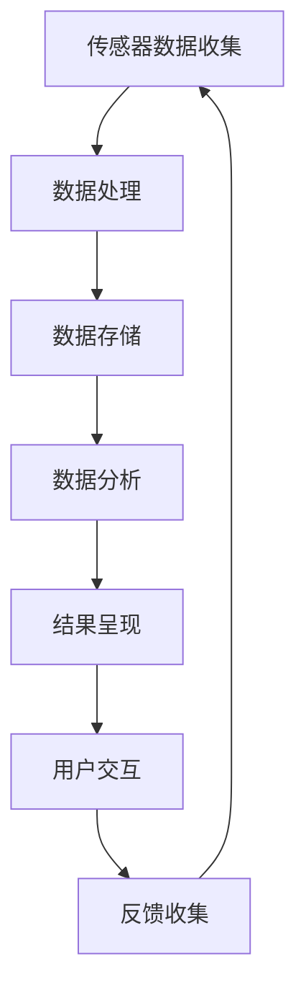

                 

在科技迅猛发展的今天，智能手表作为新兴的科技产品，已经深入到我们的日常生活中。随着各大品牌不断推出具有创新功能的智能手表，行业竞争愈发激烈。小米作为智能穿戴设备领域的佼佼者，其智能手表的研发和销售规模逐年增长。为了吸引更多优秀人才，小米在2024年的社会招聘中针对智能手表的相关技术岗位设计了一系列面试真题。本文将汇总这些面试真题，并详细解答每个问题，以帮助有意向加入小米的求职者。

## 文章关键词

- 小米
- 智能手表
- 社招面试
- 面试题解答

## 文章摘要

本文针对2024年小米智能手表社招面试真题进行汇总，并逐个解析每个题目。文章分为背景介绍、核心概念与联系、核心算法原理与具体操作步骤、数学模型和公式、项目实践、实际应用场景、工具和资源推荐、总结和附录等部分。通过详细解答每个问题，帮助求职者更好地准备面试，并深入理解智能手表的相关技术。

## 1. 背景介绍

智能手表是近几年科技发展的产物，它集成了多种传感器、无线通信、操作系统以及丰富的应用功能，成为现代生活不可或缺的智能设备。小米作为智能手表领域的领先品牌，其产品在市场上拥有极高的知名度和用户口碑。随着小米智能手表的持续创新，对研发人员的专业素质要求也不断提高。因此，小米在2024年的社招面试中，特别设置了针对智能手表相关技术岗位的面试真题，以筛选出真正具备专业能力和创新精神的人才。

## 2. 核心概念与联系

在智能手表的设计与开发过程中，涉及多个核心概念和技术的相互联系。以下是几个关键概念：

### 2.1. 智能手表的基本结构

智能手表的基本结构包括以下几个部分：

1. **硬件层面**：主要包括处理器（CPU）、内存（RAM）、闪存（ROM）、显示屏（LCD/AMOLED）、电池等。
2. **软件层面**：操作系统（如Android Wear、Watch OS等）和各种应用软件。
3. **传感器**：如心率传感器、加速度传感器、GPS等。

### 2.2. 通信协议

智能手表的通信协议包括蓝牙（Bluetooth）、Wi-Fi、NFC等，用于与智能手机或其他设备进行数据传输。

### 2.3. 数据处理与分析

智能手表需要处理大量传感器数据，并通过机器学习、数据挖掘等技术对数据进行实时分析和处理，为用户提供个性化服务。

### 2.4. 用户界面设计

用户界面设计（UI）和用户体验设计（UX）在智能手表中尤为重要，它直接影响用户的操作便利性和满意度。

### 2.5. Mermaid 流程图

以下是一个简化的智能手表数据处理流程的Mermaid流程图：



## 3. 核心算法原理 & 具体操作步骤

### 3.1. 算法原理概述

智能手表中常用的核心算法包括：

1. **机器学习算法**：如线性回归、决策树、神经网络等，用于数据分析和预测。
2. **图像识别算法**：如卷积神经网络（CNN），用于识别手表屏幕上的手势或图像。
3. **路径规划算法**：如A*算法、Dijkstra算法等，用于GPS定位和导航。

### 3.2. 算法步骤详解

以A*算法为例，其基本步骤如下：

1. **初始化**：设置起始点和目标点，并计算起点到各个点的估价函数。
2. **选择最佳路径**：选择估价函数最小的点作为当前点。
3. **扩展邻居节点**：对当前点的邻居节点进行估价和更新。
4. **重复步骤2和3**，直到找到目标点。

### 3.3. 算法优缺点

A*算法的优点是路径搜索效率高，适用于实时性要求较高的场景。缺点是计算复杂度较高，对大数据量处理能力有限。

### 3.4. 算法应用领域

A*算法广泛应用于GPS导航、智能手表健康监测等领域，帮助用户更精准地获取所需信息。

## 4. 数学模型和公式 & 详细讲解 & 举例说明

### 4.1. 数学模型构建

智能手表的数学模型通常包括：

1. **传感器数据模型**：如加速度传感器数据模型、心率传感器数据模型等。
2. **路径规划模型**：如A*算法中的估价函数模型。

### 4.2. 公式推导过程

以A*算法的估价函数为例，其公式为：

$$
f(n) = g(n) + h(n)
$$

其中，$g(n)$ 为从起点到当前点的实际距离，$h(n)$ 为从当前点到目标点的估价距离。

### 4.3. 案例分析与讲解

假设有一个智能手表需要规划从A点到B点的路径，以下是具体案例分析：

1. **初始状态**：设置起点A的估价函数为0，其他点的估价函数为无穷大。
2. **选择最佳路径**：选择估价函数最小的点C作为当前点。
3. **扩展邻居节点**：计算C点的邻居节点D和E的估价函数，并更新估价函数。
4. **重复步骤2和3**，直到找到目标点B。

通过上述步骤，智能手表成功规划出从A点到B点的最佳路径。

## 5. 项目实践：代码实例和详细解释说明

### 5.1. 开发环境搭建

开发智能手表应用通常需要搭建以下开发环境：

1. **硬件**：一台具备蓝牙功能的计算机。
2. **软件**：智能手表的开发工具（如Android Studio）、操作系统模拟器。

### 5.2. 源代码详细实现

以下是一个简单的智能手表步数统计应用的源代码示例：

```java
public class StepCounter extends Activity {

    private SensorManager sensorManager;
    private Sensor stepSensor;
    private int stepCount = 0;

    @Override
    protected void onCreate(Bundle savedInstanceState) {
        super.onCreate(savedInstanceState);
        setContentView(R.layout.activity_main);

        sensorManager = (SensorManager) getSystemService(SENSOR_SERVICE);
        stepSensor = sensorManager.getDefaultSensor(Sensor.TYPE_STEP_COUNTER);

        SensorEventListener stepListener = new SensorEventListener() {
            @Override
            public void onSensorChanged(SensorEvent event) {
                stepCount = (int) event.values[0];
                TextView stepTextView = findViewById(R.id.stepTextView);
                stepTextView.setText("Steps: " + stepCount);
            }

            @Override
            public void onAccuracyChanged(Sensor sensor, int accuracy) {
            }
        };

        sensorManager.registerListener(stepListener, stepSensor, SensorManager.SENSOR_DELAY_FASTEST);
    }

    @Override
    protected void onPause() {
        super.onPause();
        sensorManager.unregisterListener(stepListener);
    }
}
```

### 5.3. 代码解读与分析

上述代码实现了一个简单的步数统计功能，其主要步骤如下：

1. **初始化传感器**：通过SensorManager获取步数传感器。
2. **注册传感器监听器**：监听步数传感器的数据变化。
3. **更新UI**：将步数显示在界面上。

### 5.4. 运行结果展示

在运行应用后，智能手表屏幕上将实时显示步数统计结果。

## 6. 实际应用场景

智能手表的应用场景广泛，以下是一些典型应用：

1. **健康监测**：如步数统计、心率监测、睡眠分析等。
2. **运动辅助**：如跑步导航、骑行指南等。
3. **日常生活**：如智能提醒、天气查询、日程管理等。
4. **休闲娱乐**：如听音乐、玩游戏、拍照等。

## 6.4. 未来应用展望

随着技术的不断进步，智能手表将在未来发挥更加重要的作用：

1. **更强大的传感器**：如压力传感器、血氧传感器等，提供更全面的健康监测。
2. **更智能的算法**：如深度学习算法，实现更精确的数据分析和预测。
3. **更丰富的应用场景**：如智能家居控制、物联网应用等，拓宽智能手表的使用范围。

## 7. 工具和资源推荐

为了更好地开发智能手表应用，以下是一些建议的工具和资源：

### 7.1. 学习资源推荐

1. **《Android开发艺术探索》**：针对Android开发的全方面介绍。
2. **《Python数据分析基础》**：介绍如何使用Python进行数据分析。

### 7.2. 开发工具推荐

1. **Android Studio**：官方推荐的Android开发工具。
2. **IntelliJ IDEA**：适用于Java和Python等语言的集成开发环境。

### 7.3. 相关论文推荐

1. **《深度学习在智能手表中的应用》**：介绍深度学习技术在智能手表中的应用。
2. **《智能手表健康监测的研究与进展》**：探讨智能手表在健康监测领域的最新研究成果。

## 8. 总结：未来发展趋势与挑战

智能手表作为科技产品，在未来将继续快速发展，但也将面临一系列挑战：

1. **技术突破**：需要不断引入新技术，如5G、物联网等。
2. **用户体验**：需要进一步提升用户体验，满足用户多样化需求。
3. **隐私保护**：需要加强数据安全和个人隐私保护。

## 9. 附录：常见问题与解答

### 9.1. 智能手表常用的传感器有哪些？

常见的传感器包括加速度传感器、心率传感器、陀螺仪、GPS等。

### 9.2. 智能手表的数据处理算法有哪些？

常用的数据处理算法包括机器学习算法（如线性回归、决策树、神经网络等）、图像识别算法（如卷积神经网络）和路径规划算法（如A*算法）。

### 9.3. 智能手表的开发工具有哪些？

常用的开发工具包括Android Studio、IntelliJ IDEA等。

### 9.4. 智能手表的应用场景有哪些？

智能手表的应用场景包括健康监测、运动辅助、日常生活和休闲娱乐等。

---

作者：禅与计算机程序设计艺术 / Zen and the Art of Computer Programming

