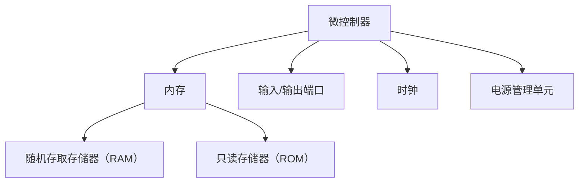

                 

关键词：嵌入式系统，微控制器，编程入门，创新项目，微控制器编程，嵌入式编程，开发环境，代码实例，算法原理，应用领域。

> 摘要：本文旨在为广大编程初学者提供一个深入浅出的嵌入式系统编程入门指南。通过介绍微控制器的基本概念、编程环境搭建、核心算法原理及具体实现，再到项目的实践与运行结果展示，本文希望帮助读者理解嵌入式系统的开发过程，激发对微控制器编程的兴趣，培养独立进行创新项目的能力。

## 1. 背景介绍

嵌入式系统（Embedded System）是指那些嵌入在其他设备中、为特定功能而设计的计算机系统。它们广泛应用于各类电子设备中，从家庭电器、汽车控制系统到医疗设备、工业自动化等。随着物联网（IoT）的兴起，嵌入式系统的应用领域日益扩大，它们在信息采集、处理和传输方面发挥着重要作用。

微控制器（Microcontroller）是一种集成电路，它集成了中央处理单元（CPU）、内存、输入/输出端口以及其他外设（如定时器、串行通信接口等）在一个芯片上。由于它们的集成度高、功耗低、成本低，微控制器被广泛应用于各种嵌入式系统中，成为嵌入式系统开发的核心组件。

本篇文章将围绕嵌入式系统编程的入门知识展开讨论，旨在帮助读者了解并掌握微控制器的基本编程技巧，为后续的创新项目打下基础。

## 2. 核心概念与联系

### 2.1 嵌入式系统的构成

嵌入式系统通常由以下几个部分组成：

- **微控制器（Microcontroller）**：作为系统的核心，负责控制和协调各个部分的工作。
- **存储器（Memory）**：包括随机存取存储器（RAM）和只读存储器（ROM），用于存储程序和数据。
- **输入/输出端口（I/O Ports）**：用于与外部设备进行通信和数据交换。
- **时钟（Clock）**：为微控制器提供定时信号，保证系统正常工作。
- **电源管理单元（Power Management Unit）**：负责电源的稳定供应和功耗管理。

### 2.2 微控制器的架构

微控制器的架构通常包括以下部分：

- **中央处理单元（CPU）**：执行程序指令，进行数据处理和运算。
- **内存管理单元（Memory Management Unit）**：管理存储器资源，包括内存分配和保护。
- **外设接口（Peripheral Interfaces）**：包括串行通信接口（如UART、SPI、I2C等）、定时器、中断控制器等。

### 2.3 嵌入式系统编程的关键概念

- **汇编语言（Assembly Language）**：与机器语言非常接近，但提供了可读性。用于编写对硬件有较高要求的程序。
- **高级编程语言（High-Level Programming Languages）**：如C、C++、Python等。它们提供了更丰富的功能和更简洁的代码，但可能需要编译器或解释器的支持。

### 2.4 Mermaid 流程图

为了更好地理解嵌入式系统的编程过程，我们可以使用Mermaid流程图来表示其基本架构：



## 3. 核心算法原理 & 具体操作步骤

### 3.1 算法原理概述

嵌入式系统的核心在于算法的实现。算法是解决特定问题的方法，而嵌入式系统编程中的算法通常需要考虑资源受限、实时性要求高等特点。

以下是几种常见的嵌入式系统算法：

- **定时器算法**：用于实现定时功能，如延时、周期性任务等。
- **中断处理算法**：处理外部事件和硬件中断，如按键、传感器数据读取等。
- **通信算法**：实现微控制器与其他设备之间的数据交换，如UART通信、SPI通信等。

### 3.2 算法步骤详解

#### 3.2.1 定时器算法

1. 初始化定时器：设置定时器的周期、模式等参数。
2. 启动定时器：启动定时器计数。
3. 定时器中断服务程序：当定时器计数到达设定值时，触发中断，执行相关操作（如延时函数、周期性任务等）。

#### 3.2.2 中断处理算法

1. 使能中断：开启硬件中断。
2. 中断初始化：设置中断优先级、中断服务程序入口等。
3. 中断服务程序：响应中断请求，执行相关操作（如读取传感器数据、发送数据等）。

#### 3.2.3 通信算法

1. 通信初始化：配置通信接口（如UART、SPI等）的参数。
2. 发送数据：通过通信接口发送数据。
3. 接收数据：通过通信接口接收数据。
4. 数据处理：对接收到的数据进行处理，如解码、分析等。

### 3.3 算法优缺点

- **定时器算法**：简单易实现，适合对定时精度要求不高的应用。
- **中断处理算法**：提高了系统的响应速度，但可能增加程序复杂性。
- **通信算法**：适用于各种通信场景，但可能需要复杂的协议处理。

### 3.4 算法应用领域

- **定时器算法**：广泛应用于家用电器、汽车电子等领域。
- **中断处理算法**：用于实时操作系统（RTOS）和工业控制系统。
- **通信算法**：应用于物联网设备、智能家居等场景。

## 4. 数学模型和公式 & 详细讲解 & 举例说明

### 4.1 数学模型构建

嵌入式系统中的数学模型主要用于描述系统的动态行为，如信号处理、控制算法等。以下是几种常见的数学模型：

- **差分方程**：描述系统的时间序列行为。
- **传递函数**：描述系统的输入输出关系。
- **状态空间模型**：描述系统的状态和状态转移。

### 4.2 公式推导过程

以差分方程为例，推导一个简单的滤波器模型：

1. **输入输出关系**：
   $$ y[n] = a_0x[n] + a_1x[n-1] + b_0y[n-1] + b_1y[n-2] $$

2. **初始条件**：
   $$ x[n] = \text{输入序列}, \quad y[n] = \text{输出序列} $$

3. **推导过程**：
   $$ y[n] - b_0y[n-1] - b_1y[n-2] = a_0x[n] + a_1x[n-1] $$
   $$ (1 - b_0z^{-1} - b_1z^{-2})y[n] = a_0x[n] + a_1x[n-1] $$
   $$ y[n] = \frac{a_0x[n] + a_1x[n-1]}{1 - b_0z^{-1} - b_1z^{-2}} $$

### 4.3 案例分析与讲解

假设我们需要设计一个低通滤波器，其传递函数为：

$$ H(z) = \frac{1}{1 - \frac{1}{2}z^{-1}} $$

1. **输入输出关系**：
   $$ y[n] = \frac{x[n]}{1 - \frac{1}{2}z^{-1}}x[n] $$

2. **实现步骤**：
   - 初始化：设置滤波器参数 \( a_0 = 1 \), \( a_1 = 0 \), \( b_0 = \frac{1}{2} \), \( b_1 = 0 \)。
   - 输入信号：生成一个包含高频噪声的信号序列。
   - 滤波：使用差分方程进行滤波，得到输出信号序列。
   - 分析：对比输入信号和输出信号，观察滤波效果。

## 5. 项目实践：代码实例和详细解释说明

### 5.1 开发环境搭建

为了进行嵌入式系统编程，我们需要搭建一个合适的开发环境。以下是一个简单的搭建步骤：

1. **安装交叉编译工具**：用于在PC上编译嵌入式系统的代码，如GNU Arm Embedded Toolchain。
2. **选择开发板**：例如Arduino Uno、STM32 Discovery等。
3. **安装集成开发环境（IDE）**：如Eclipse、STM32CubeIDE等。
4. **连接开发板**：通过USB或串行通信线连接开发板和PC。

### 5.2 源代码详细实现

以下是一个简单的Arduino示例代码，用于控制LED灯的亮灭：

```cpp
// 定义LED灯连接的引脚
const int ledPin = 13;

// 初始化LED灯状态
bool ledState = LOW;

void setup() {
  // 初始化串口通信
  Serial.begin(9600);

  // 设置LED灯引脚为输出模式
  pinMode(ledPin, OUTPUT);
}

void loop() {
  // 反转LED灯状态
  ledState = !ledState;

  // 根据LED灯状态更新引脚电压
  digitalWrite(ledPin, ledState);

  // 延时一段时间
  delay(1000);
}
```

### 5.3 代码解读与分析

- **初始化部分**：定义了LED灯连接的引脚和初始状态。
- **setup函数**：初始化串口通信，设置LED灯引脚为输出模式。
- **loop函数**：实现LED灯的亮灭控制，每隔1秒切换一次状态。

### 5.4 运行结果展示

当我们将这段代码上传到Arduino开发板后，LED灯将每隔1秒闪烁一次。通过串口监视器，我们可以看到Arduino板上的串口输出。

## 6. 实际应用场景

嵌入式系统编程的应用场景非常广泛，以下是一些典型的应用场景：

- **智能家居**：使用微控制器控制家庭设备，如照明、安防系统、智能音箱等。
- **工业自动化**：监控和控制生产线上的各种设备，实现自动化生产。
- **医疗设备**：用于监测患者生命体征、药物剂量管理等。
- **交通系统**：控制交通信号灯、监控车辆运行状态等。

### 6.4 未来应用展望

随着物联网、5G通信等技术的发展，嵌入式系统编程将迎来更广阔的应用前景。未来的发展趋势包括：

- **边缘计算**：将计算任务从云端转移到边缘设备，实现更高效的资源利用和更低的延迟。
- **人工智能**：将人工智能算法应用于嵌入式系统，实现智能感知和决策。
- **可靠性提升**：通过硬件和软件的优化，提高嵌入式系统的可靠性和稳定性。

## 7. 工具和资源推荐

### 7.1 学习资源推荐

- **在线教程**：如Arduino官网、STM32官方文档等。
- **书籍**：《嵌入式系统编程》、《微控制器编程入门》等。
- **开源项目**：如STM32CubeMX、Arduino IDE等。

### 7.2 开发工具推荐

- **交叉编译工具**：如GNU Arm Embedded Toolchain、IAR Embedded Workbench等。
- **集成开发环境**：如Eclipse、STM32CubeIDE等。
- **开发板**：如Arduino Uno、STM32 Discovery等。

### 7.3 相关论文推荐

- **嵌入式系统设计**：如《嵌入式系统设计方法》、《嵌入式系统实时性能优化》等。
- **微控制器编程**：如《微控制器编程技巧》、《嵌入式系统编程实战》等。
- **物联网技术**：如《物联网技术与应用》、《物联网安全研究》等。

## 8. 总结：未来发展趋势与挑战

### 8.1 研究成果总结

本文通过对嵌入式系统编程的基本概念、核心算法原理、开发实践及应用场景的介绍，为广大编程初学者提供了一个全面的入门指南。通过实例代码和详细解释，读者可以了解到嵌入式系统编程的基本流程和技巧。

### 8.2 未来发展趋势

随着技术的进步，嵌入式系统编程将在以下方面取得重要进展：

- **边缘计算**：提高数据处理速度和效率，实现更智能的物联网应用。
- **人工智能**：将人工智能算法应用于嵌入式系统，提升系统的智能化水平。
- **物联网安全**：加强物联网设备的安全性，保障数据安全和用户隐私。

### 8.3 面临的挑战

- **资源限制**：嵌入式系统通常具有资源受限的特点，如何在有限的资源下实现高效的算法和系统功能是一个挑战。
- **实时性要求**：嵌入式系统常用于实时应用场景，保证任务的实时性和响应速度是关键。
- **安全性**：随着物联网的普及，嵌入式系统面临的安全威胁日益增加，如何保障系统的安全性和可靠性是一个重要课题。

### 8.4 研究展望

未来，嵌入式系统编程的研究将更加注重系统的智能化、安全性和实时性。通过跨学科的融合，将人工智能、物联网、云计算等新技术应用于嵌入式系统，实现更加智能、高效、可靠的嵌入式系统解决方案。

## 9. 附录：常见问题与解答

### Q：如何选择合适的微控制器？

A：选择微控制器时，需要考虑以下几个因素：

- **性能要求**：根据项目需求选择合适的处理器频率、内存大小等。
- **外设接口**：根据项目需求选择具有必要外设接口的微控制器，如UART、SPI、I2C等。
- **功耗**：考虑功耗需求，选择低功耗微控制器以延长电池寿命。
- **成本**：根据预算选择性价比合适的微控制器。

### Q：如何进行嵌入式系统编程？

A：进行嵌入式系统编程的基本步骤如下：

- **环境搭建**：安装交叉编译工具、集成开发环境和开发板。
- **学习编程语言**：掌握C/C++等编程语言，熟悉嵌入式系统编程的语法和特性。
- **理解硬件架构**：了解所选微控制器的硬件架构和编程接口。
- **编写代码**：根据项目需求编写嵌入式系统程序。
- **调试和优化**：使用调试工具对程序进行调试和性能优化。

### Q：如何进行嵌入式系统的调试？

A：嵌入式系统的调试方法包括：

- **串口调试**：通过串口监视器查看程序的输出日志，调试程序逻辑。
- **硬件调试器**：使用硬件调试器（如JTAG、SWD等）进行实时调试，观察寄存器、内存等。
- **断点调试**：在程序中设置断点，逐步执行代码，观察变量和函数调用情况。
- **性能分析**：使用性能分析工具（如perf）分析程序的性能瓶颈。

## 结束语

嵌入式系统编程是一个充满挑战和乐趣的领域。通过本文的学习，相信您已经对嵌入式系统编程有了更深入的了解。希望您能够在实践中不断探索，创造属于自己的创新项目，为这个充满机遇的领域贡献自己的智慧和力量。作者：禅与计算机程序设计艺术 / Zen and the Art of Computer Programming。

