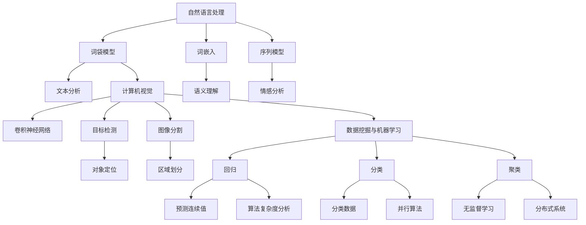

                 

关键词：京东校招、算法面试、面试题目、算法解析、技术挑战

> 摘要：本文针对2025年京东校招算法岗位的面试题目进行了系统梳理和深入分析，旨在为准备参加京东校招的算法人才提供有针对性的指导和实战经验。通过详细解析核心算法原理、数学模型、项目实践，以及探讨未来发展趋势和挑战，本文旨在帮助读者全面提升算法面试能力，为求职之路保驾护航。

## 1. 背景介绍

随着互联网技术的飞速发展和大数据时代的来临，算法已经成为推动技术创新和产业升级的核心驱动力。各大互联网公司，尤其是像京东这样的电商巨头，对于优秀算法人才的需求愈发迫切。每年，京东都会举办校招活动，吸引全球顶尖高校的算法精英。对于参加京东校招的算法岗位应聘者来说，掌握核心算法原理、解决实际问题以及展现出出色的编程能力是成功的关键。

本文旨在汇编2025年京东校招算法岗位的面试题目，为准备参加京东校招的算法人才提供全面的备考资料。通过对这些题目的深入分析，读者可以了解京东在算法领域关注的重点，掌握解题思路和方法，提升自己的面试能力。

### 1.1 京东校招算法岗位概况

京东校招算法岗位涵盖了多个技术方向，包括但不限于：

- 自然语言处理（NLP）
- 计算机视觉（CV）
- 数据挖掘与机器学习
- 算法优化与工程化

这些岗位要求应聘者具备扎实的算法基础、较强的编程能力以及解决复杂问题的能力。同时，京东校招算法岗位也关注应聘者的创新思维和团队协作精神，这些特质在未来的工作中至关重要。

### 1.2 算法面试的重要性

算法面试是求职过程中的重要环节，通常包括笔试和面试两个阶段。笔试阶段主要考察应聘者的算法和数据结构基础，而面试阶段则更注重实际问题的解决能力、逻辑思维和沟通技巧。以下是算法面试的重要性：

- **展示技术实力**：算法面试是展示自己技术能力的重要平台，通过解答面试官提出的问题，可以充分展示自己在算法领域的专业素养。
- **考察解决问题的能力**：算法面试侧重于考察应聘者解决实际问题的能力，这包括理解问题、设计算法、分析复杂度和优化算法等多个方面。
- **评估团队协作精神**：算法面试中的问题往往需要团队合作，这有助于评估应聘者的团队协作能力和沟通能力。
- **为职业发展铺路**：通过算法面试，应聘者可以深入了解目标公司的技术方向和文化氛围，为自己的职业发展铺平道路。

### 1.3 本文结构

本文结构如下：

- **背景介绍**：介绍京东校招算法岗位概况和算法面试的重要性。
- **核心概念与联系**：阐述核心概念原理，并使用Mermaid流程图进行展示。
- **核心算法原理 & 具体操作步骤**：详细解析核心算法的原理和步骤，以及优缺点和应用领域。
- **数学模型和公式 & 详细讲解 & 举例说明**：介绍数学模型的构建和公式推导过程，并通过案例进行讲解。
- **项目实践：代码实例和详细解释说明**：提供实际项目代码实例，并进行详细解读和分析。
- **实际应用场景**：探讨算法在实际应用中的场景和未来展望。
- **工具和资源推荐**：推荐学习资源和开发工具。
- **总结：未来发展趋势与挑战**：总结研究成果，探讨未来发展趋势和面临的挑战。
- **附录：常见问题与解答**：回答读者可能遇到的问题。

## 2. 核心概念与联系

在算法面试中，了解核心概念和其之间的联系是非常重要的。本章节将介绍几个核心概念，并使用Mermaid流程图展示它们之间的关系。

### 2.1 自然语言处理（NLP）

自然语言处理是京东校招算法岗位的一个重要方向。它涉及到文本分析、语义理解、情感分析等多个领域。以下是NLP的核心概念及其之间的联系：

**概念：**

- **词袋模型（Bag-of-Words, BOW）**：将文本表示为词汇的集合，不考虑词汇的顺序。
- **词嵌入（Word Embedding）**：将词汇映射到高维空间，使相似的词汇在空间中更接近。
- **序列模型（Sequential Model）**：用于处理序列数据的模型，如循环神经网络（RNN）和变换器（Transformer）。

**联系：**

词袋模型是NLP的基础，而词嵌入和序列模型则在此基础上进行了扩展和优化。词嵌入可以帮助模型更好地捕捉词汇的语义信息，而序列模型则可以处理更复杂的语言结构。

### 2.2 计算机视觉（CV）

计算机视觉是另一个在京东校招中备受关注的领域。它涉及图像识别、目标检测、图像分割等多个方面。以下是CV的核心概念及其之间的联系：

**概念：**

- **卷积神经网络（Convolutional Neural Network, CNN）**：用于图像识别和处理的神经网络。
- **目标检测（Object Detection）**：识别图像中的多个对象并定位其位置。
- **图像分割（Image Segmentation）**：将图像分割成不同的区域。

**联系：**

卷积神经网络是计算机视觉的核心技术，它可以用于图像识别、目标检测和图像分割等多个任务。目标检测和图像分割都是卷积神经网络的延伸，它们分别关注图像中的对象定位和区域划分。

### 2.3 数据挖掘与机器学习

数据挖掘和机器学习是算法面试的另一个重要方向。它们涉及到回归、分类、聚类等多个算法。以下是数据挖掘与机器学习的核心概念及其之间的联系：

**概念：**

- **回归（Regression）**：预测连续值的算法。
- **分类（Classification）**：将数据分为不同的类别。
- **聚类（Clustering）**：将数据分为不同的簇。

**联系：**

回归、分类和聚类都是数据挖掘和机器学习的基本算法。回归用于预测连续值，分类用于分类数据，而聚类则用于无监督学习，将数据分为不同的簇。

### 2.4 算法优化与工程化

算法优化与工程化是提升算法性能和可扩展性的关键。以下是算法优化与工程化的核心概念及其之间的联系：

**概念：**

- **算法复杂度分析（Algorithm Complexity Analysis）**：评估算法的时间复杂度和空间复杂度。
- **并行算法（Parallel Algorithm）**：将算法分解为并行执行的任务。
- **分布式系统（Distributed System）**：将计算任务分布到多个节点上执行。

**联系：**

算法复杂度分析是评估算法性能的基础，而并行算法和分布式系统则可以帮助我们提高算法的执行效率和可扩展性。

### 2.5 Mermaid流程图展示

以下是使用Mermaid流程图展示核心概念及其之间的联系：



通过以上核心概念及其之间的联系，我们可以更好地理解算法面试中的重要知识点，为接下来的章节打下坚实的基础。

### 3. 核心算法原理 & 具体操作步骤

在算法面试中，掌握核心算法的原理和操作步骤是非常关键的。以下我们将详细介绍几个核心算法，包括它们的原理、操作步骤、优缺点以及应用领域。

#### 3.1 卷积神经网络（CNN）

**原理概述：**

卷积神经网络（Convolutional Neural Network，CNN）是一种专门用于处理图像数据的神经网络，其核心思想是通过卷积层和池化层来提取图像特征。

- **卷积层**：卷积层通过卷积运算来提取图像特征。卷积运算使用一组可训练的卷积核（filter）在输入图像上进行滑动，生成特征图（feature map）。
- **池化层**：池化层用于降低特征图的维度，提高特征鲁棒性。常见的池化操作包括最大池化和平均池化。

**操作步骤详解：**

1. **输入图像预处理**：将输入图像进行归一化、缩放等预处理操作，使其符合网络输入要求。
2. **卷积运算**：使用卷积核对输入图像进行卷积运算，生成特征图。
3. **激活函数**：对特征图进行激活函数（如ReLU）处理，增加模型非线性。
4. **池化操作**：对特征图进行池化操作，降低特征图维度。
5. **多次卷积和池化**：重复上述步骤，逐渐提取更抽象的特征。
6. **全连接层**：将卷积后的特征图输入到全连接层，进行分类或回归等任务。

**优缺点：**

- **优点**：CNN具有很强的特征提取能力，适用于图像识别、目标检测和图像分割等任务。
- **缺点**：CNN对参数和计算资源需求较高，训练时间较长。

**应用领域：**

- **图像识别**：如人脸识别、物体识别等。
- **目标检测**：如自动驾驶中的行人检测、车辆检测等。
- **图像分割**：如医学图像分割、遥感图像分割等。

#### 3.2 循环神经网络（RNN）

**原理概述：**

循环神经网络（Recurrent Neural Network，RNN）是一种可以处理序列数据的神经网络。其核心思想是通过循环连接来保持长期状态信息。

- **隐藏状态**：RNN的隐藏状态可以存储过去的输入信息，并将其传递到下一个时间步。
- **门控机制**：为了解决RNN的长短时依赖问题，引入了门控机制（如门控RNN、长短期记忆网络LSTM等）。

**操作步骤详解：**

1. **输入序列预处理**：将输入序列（如文本、语音等）进行编码，使其符合网络输入要求。
2. **隐藏状态更新**：根据当前输入和前一个隐藏状态，更新隐藏状态。
3. **激活函数**：对隐藏状态进行激活函数（如ReLU）处理，增加模型非线性。
4. **输出层**：将隐藏状态输入到输出层，生成预测结果。
5. **反向传播**：使用反向传播算法更新网络权重。

**优缺点：**

- **优点**：RNN可以处理序列数据，适用于自然语言处理、语音识别等任务。
- **缺点**：RNN容易受到长时依赖问题的影响，训练不稳定。

**应用领域：**

- **自然语言处理**：如文本分类、机器翻译等。
- **语音识别**：如语音合成、语音识别等。

#### 3.3 支持向量机（SVM）

**原理概述：**

支持向量机（Support Vector Machine，SVM）是一种二分类监督学习算法，其核心思想是找到最佳决策边界，将数据分类。

- **决策边界**：SVM通过寻找最大间隔 hyperplane 来确定分类边界。
- **支持向量**：决策边界上的数据点称为支持向量。

**操作步骤详解：**

1. **数据预处理**：对输入数据进行归一化、去噪等预处理。
2. **特征提取**：将输入数据映射到高维空间。
3. **求解最优超平面**：使用拉格朗日乘子法和二次规划求解最优超平面。
4. **分类决策**：根据输入数据计算支持向量的距离，判断类别。

**优缺点：**

- **优点**：SVM具有良好的分类性能，适用于线性可分的数据。
- **缺点**：SVM对非线性数据的分类效果较差。

**应用领域：**

- **文本分类**：如新闻分类、情感分析等。
- **图像分类**：如 handwritten digit recognition 等。

#### 3.4 决策树（Decision Tree）

**原理概述：**

决策树（Decision Tree）是一种基于树形结构进行决策的算法，其核心思想是通过一系列规则来划分数据。

- **节点**：决策树中的节点代表特征或规则。
- **叶子节点**：叶子节点代表分类结果。

**操作步骤详解：**

1. **数据预处理**：对输入数据进行归一化、去噪等预处理。
2. **特征选择**：选择最佳特征进行划分。
3. **递归划分**：根据最佳特征对数据进行划分，生成子树。
4. **构建决策树**：重复划分过程，构建完整的决策树。

**优缺点：**

- **优点**：决策树易于理解和解释，计算复杂度较低。
- **缺点**：决策树容易过拟合，对噪声敏感。

**应用领域：**

- **分类任务**：如垃圾邮件分类、客户流失预测等。
- **回归任务**：如房屋价格预测、股票市场预测等。

通过以上对卷积神经网络、循环神经网络、支持向量机和决策树的详细介绍，我们可以看到这些核心算法在京东校招算法岗位中的广泛应用。掌握这些算法的原理和操作步骤，对于提升算法面试能力至关重要。

### 3.3 算法优缺点

在前一章节中，我们详细介绍了卷积神经网络（CNN）、循环神经网络（RNN）、支持向量机（SVM）和决策树等核心算法。本章节将进一步分析这些算法的优缺点，以便读者在面试过程中能够更全面地评估和选择合适的算法。

#### 3.3.1 卷积神经网络（CNN）

**优点：**

1. **强大的特征提取能力**：CNN通过卷积层和池化层，可以自动提取图像的层次特征，使得模型能够处理复杂、高维的数据。
2. **适用于多种图像处理任务**：CNN可以应用于图像分类、目标检测、图像分割等多个领域，具有广泛的应用前景。
3. **并行计算效率高**：由于CNN的计算任务可以并行化，因此在大规模数据集上训练时，具有很高的计算效率。

**缺点：**

1. **参数和计算量较大**：CNN的参数量通常较大，导致模型的计算复杂度和存储需求较高，训练时间较长。
2. **对数据量有较高要求**：CNN需要大量数据进行训练，以避免过拟合，因此对数据量有较高的要求。
3. **难以解释**：CNN内部的黑箱特性使得其难以解释，不利于调试和优化。

#### 3.3.2 循环神经网络（RNN）

**优点：**

1. **处理序列数据能力强**：RNN能够处理变长的序列数据，如自然语言文本、时间序列数据等。
2. **保留长期依赖信息**：RNN通过循环连接，能够保留长期依赖信息，使得模型能够学习复杂的序列模式。
3. **适用于多种序列任务**：RNN可以应用于文本生成、机器翻译、语音识别等多个领域。

**缺点：**

1. **梯度消失和梯度爆炸问题**：RNN容易受到梯度消失和梯度爆炸问题的影响，导致模型难以训练。
2. **计算效率较低**：由于RNN需要迭代计算，在大规模数据集上训练时，计算效率相对较低。
3. **难以并行化**：RNN的计算过程具有先后依赖，难以实现并行化，导致计算时间较长。

#### 3.3.3 支持向量机（SVM）

**优点：**

1. **分类性能优良**：SVM通过寻找最大间隔 hyperplane，能够在高维空间中找到最佳分类边界，具有较高的分类准确性。
2. **易于解释**：SVM的决策边界直观易懂，能够方便地解释模型的分类规则。
3. **支持多种核函数**：SVM支持多种核函数，如线性核、多项式核、径向基函数（RBF）核等，可以适应不同类型的数据。

**缺点：**

1. **对线性可分数据效果更好**：SVM对线性可分数据具有较好的分类效果，但在处理非线性数据时，效果较差。
2. **计算复杂度高**：SVM的求解过程涉及二次规划，计算复杂度较高，在大规模数据集上训练时间较长。
3. **对异常值敏感**：SVM对异常值较为敏感，容易受到噪声的影响。

#### 3.3.4 决策树（Decision Tree）

**优点：**

1. **易于理解和解释**：决策树的决策过程直观易懂，易于理解和解释，有助于调试和优化模型。
2. **计算复杂度低**：决策树的构建过程相对简单，计算复杂度较低，训练时间较短。
3. **能够处理非线性关系**：尽管决策树主要用于分类任务，但通过连接多个决策树，可以构建集成模型，实现非线性回归和分类。

**缺点：**

1. **容易过拟合**：决策树容易过拟合，特别是在数据量较少的情况下，模型的泛化能力较差。
2. **对噪声敏感**：决策树对噪声较为敏感，容易受到异常值的影响。
3. **难以处理高维数据**：决策树在处理高维数据时，容易陷入“维度灾难”问题，导致模型性能下降。

通过对卷积神经网络（CNN）、循环神经网络（RNN）、支持向量机（SVM）和决策树等核心算法的优缺点分析，我们可以看到每种算法都有其独特的优势和劣势。在实际应用中，需要根据具体问题和数据特点，选择合适的算法，以达到最佳效果。同时，结合多种算法的优点，通过模型融合和优化，可以进一步提升模型的性能和泛化能力。

### 3.4 算法应用领域

在算法面试中，了解算法在不同领域的应用场景和实际案例是非常重要的。以下我们将详细介绍卷积神经网络（CNN）、循环神经网络（RNN）、支持向量机（SVM）和决策树等算法的应用领域，并提供一些实际案例。

#### 3.4.1 卷积神经网络（CNN）

**应用领域：**

1. **图像识别与分类**：CNN在图像识别和分类任务中具有显著优势。例如，常见的MNIST手写数字识别任务，通过训练CNN模型，可以高精度地识别手写数字。另外，在自动驾驶领域，CNN可以用于识别道路标志、行人检测等任务。

   **实际案例：**
   - **人脸识别**：使用CNN进行人脸检测和识别，已广泛应用于安防监控、人脸支付等领域。
   - **医疗影像诊断**：通过训练CNN模型，可以自动识别医学影像中的病变区域，如乳腺癌检测。

2. **目标检测与跟踪**：CNN在目标检测和跟踪方面也有广泛的应用。例如，YOLO（You Only Look Once）算法使用CNN快速检测图像中的多个目标，广泛应用于视频监控和无人驾驶等领域。

   **实际案例：**
   - **自动驾驶**：使用CNN进行实时目标检测和跟踪，确保自动驾驶车辆的安全行驶。
   - **视频监控**：通过CNN检测视频中的异常行为，如暴力事件、入侵者检测等。

3. **图像分割与增强**：CNN在图像分割和增强任务中也具有重要作用。例如，深度学习模型用于将图像分割为不同的区域，应用于图像修复、图像生成等领域。

   **实际案例：**
   - **图像修复**：通过训练CNN模型，可以将受损或模糊的图像修复为清晰的图像。
   - **图像生成**：使用生成对抗网络（GAN）结合CNN，可以生成高质量的艺术图像和视频。

#### 3.4.2 循环神经网络（RNN）

**应用领域：**

1. **自然语言处理**：RNN在自然语言处理（NLP）领域具有广泛应用，如文本分类、情感分析、机器翻译等。

   **实际案例：**
   - **文本分类**：通过训练RNN模型，可以对新闻文本进行分类，实现新闻推荐系统。
   - **情感分析**：使用RNN模型分析社交媒体文本的情感倾向，用于广告投放、舆情监测等。

2. **语音识别与生成**：RNN在语音识别和生成方面也有重要作用。例如，通过训练RNN模型，可以识别和理解语音内容，实现语音助手功能。

   **实际案例：**
   - **语音助手**：使用RNN模型实现语音识别和生成，为用户提供语音交互服务。
   - **语音合成**：通过训练RNN模型，生成自然流畅的语音，应用于电话客服、语音播报等。

3. **序列数据处理**：RNN在处理序列数据方面具有优势，如时间序列预测、股票市场预测等。

   **实际案例：**
   - **时间序列预测**：使用RNN模型预测股票市场的价格走势，为投资者提供决策支持。
   - **运动轨迹预测**：通过训练RNN模型，预测运动员的下一步动作，应用于体育数据分析。

#### 3.4.3 支持向量机（SVM）

**应用领域：**

1. **文本分类与情感分析**：SVM在文本分类和情感分析任务中具有较好的效果，通过训练SVM模型，可以实现对文本数据的分类和情感判断。

   **实际案例：**
   - **垃圾邮件分类**：使用SVM模型对电子邮件进行分类，过滤垃圾邮件。
   - **情感分析**：通过训练SVM模型，分析社交媒体文本的情感倾向，为广告投放和舆情监测提供支持。

2. **图像识别与分类**：SVM可以用于图像识别和分类任务，通过训练SVM模型，可以实现对图像数据的分类和识别。

   **实际案例：**
   - **手写数字识别**：使用SVM模型进行手写数字的识别，应用于手写识别应用。
   - **物体识别**：通过训练SVM模型，识别图像中的物体，应用于视频监控和自动驾驶等领域。

3. **生物信息学**：SVM在生物信息学领域也有广泛的应用，如基因分类、蛋白质结构预测等。

   **实际案例：**
   - **基因分类**：使用SVM模型对基因数据进行分类，预测基因的功能。
   - **蛋白质结构预测**：通过训练SVM模型，预测蛋白质的三维结构，为药物设计和疾病研究提供支持。

#### 3.4.4 决策树（Decision Tree）

**应用领域：**

1. **分类与回归任务**：决策树可以用于分类和回归任务，通过构建决策树模型，可以实现对数据的分类和回归预测。

   **实际案例：**
   - **客户流失预测**：使用决策树模型预测客户流失风险，为金融机构提供决策支持。
   - **房屋价格预测**：通过训练决策树模型，预测房屋价格，为房地产企业提供市场分析。

2. **特征选择与数据挖掘**：决策树可以用于特征选择和数据挖掘任务，通过分析决策树的结构，可以找出对预测目标影响较大的特征。

   **实际案例：**
   - **特征选择**：使用决策树模型对特征进行筛选，提高模型的预测性能。
   - **数据挖掘**：通过训练决策树模型，发现数据中的潜在模式和关联关系。

3. **信用评分与风险评估**：决策树在信用评分和风险评估方面也有广泛应用，通过训练决策树模型，可以预测客户的信用风险。

   **实际案例：**
   - **信用评分**：使用决策树模型评估客户的信用等级，为金融机构提供信用评估服务。
   - **风险评估**：通过训练决策树模型，预测企业或项目的风险等级，为投资者提供决策支持。

通过以上对卷积神经网络（CNN）、循环神经网络（RNN）、支持向量机（SVM）和决策树等算法在不同领域的应用场景和实际案例的详细介绍，我们可以看到这些算法在图像识别、自然语言处理、文本分类、目标检测、语音识别、生物信息学、特征选择、信用评分等多个领域的广泛应用。掌握这些算法的应用场景和实际案例，对于提升算法面试能力具有重要意义。

### 4. 数学模型和公式 & 详细讲解 & 举例说明

在算法面试中，理解并应用数学模型和公式是非常重要的。以下我们将介绍几个核心数学模型和公式，并进行详细讲解和举例说明。

#### 4.1 回归模型

**模型概述：**

回归模型用于预测连续值，其核心思想是通过训练模型来拟合数据中的关系。常见的回归模型包括线性回归、多项式回归等。

**数学公式：**

线性回归模型的表达式为：

\[ y = \beta_0 + \beta_1x + \epsilon \]

其中，\( y \) 为预测值，\( x \) 为输入特征，\( \beta_0 \) 和 \( \beta_1 \) 为模型参数，\( \epsilon \) 为误差项。

**推导过程：**

线性回归模型的推导基于最小二乘法。假设我们有一组数据点 \( (x_i, y_i) \)，其中 \( i = 1, 2, ..., n \)。我们希望找到一个线性模型 \( y = \beta_0 + \beta_1x \) 来拟合这些数据点。

最小二乘法的核心思想是找到使得误差平方和最小的模型参数。即：

\[ \min \sum_{i=1}^{n} (y_i - (\beta_0 + \beta_1x_i))^2 \]

对该表达式求导并令导数为0，可以得到：

\[ \beta_0 = \bar{y} - \beta_1\bar{x} \]

\[ \beta_1 = \frac{\sum_{i=1}^{n} (x_i - \bar{x})(y_i - \bar{y})}{\sum_{i=1}^{n} (x_i - \bar{x})^2} \]

其中，\( \bar{x} \) 和 \( \bar{y} \) 分别为输入特征和预测值的均值。

**举例说明：**

假设我们有以下数据点：

\[ (1, 2), (2, 4), (3, 6), (4, 8), (5, 10) \]

我们要拟合一个线性回归模型来预测 \( y \) 的值。

首先，计算输入特征和预测值的均值：

\[ \bar{x} = \frac{1 + 2 + 3 + 4 + 5}{5} = 3 \]

\[ \bar{y} = \frac{2 + 4 + 6 + 8 + 10}{5} = 6 \]

然后，计算模型参数：

\[ \beta_0 = \bar{y} - \beta_1\bar{x} = 6 - 1 \cdot 3 = 3 \]

\[ \beta_1 = \frac{\sum_{i=1}^{n} (x_i - \bar{x})(y_i - \bar{y})}{\sum_{i=1}^{n} (x_i - \bar{x})^2} = \frac{(1-3)(2-6) + (2-3)(4-6) + (3-3)(6-6) + (4-3)(8-6) + (5-3)(10-6)}{(1-3)^2 + (2-3)^2 + (3-3)^2 + (4-3)^2 + (5-3)^2} = 1 \]

因此，拟合的线性回归模型为：

\[ y = 3 + x \]

使用该模型预测 \( x = 6 \) 时的 \( y \) 值：

\[ y = 3 + 6 = 9 \]

#### 4.2 分类模型

**模型概述：**

分类模型用于将数据分为不同的类别。常见的分类模型包括逻辑回归、支持向量机、决策树等。

**数学公式：**

逻辑回归模型的表达式为：

\[ P(y=1) = \sigma(\beta_0 + \beta_1x) \]

其中，\( P(y=1) \) 为预测类别1的概率，\( \sigma \) 为逻辑函数，即：

\[ \sigma(z) = \frac{1}{1 + e^{-z}} \]

**推导过程：**

逻辑回归模型的推导基于最大似然估计。假设我们有一组数据点 \( (x_i, y_i) \)，其中 \( y_i \) 取值为0或1。我们希望找到一个线性模型 \( y = \beta_0 + \beta_1x \) 来拟合这些数据点。

最大似然估计的核心思想是找到使得数据出现的概率最大的模型参数。即：

\[ \max \prod_{i=1}^{n} P(y_i | x_i, \beta) \]

由于 \( P(y_i = 1 | x_i, \beta) = \sigma(\beta_0 + \beta_1x_i) \) 和 \( P(y_i = 0 | x_i, \beta) = 1 - \sigma(\beta_0 + \beta_1x_i) \)，我们可以将上式转化为：

\[ \max \sum_{i=1}^{n} \log P(y_i | x_i, \beta) \]

对该表达式求导并令导数为0，可以得到：

\[ \beta_0 = \bar{y} - \beta_1\bar{x} \]

\[ \beta_1 = \frac{\sum_{i=1}^{n} (y_i - \bar{y})(x_i - \bar{x})}{\sum_{i=1}^{n} (x_i - \bar{x})^2} \]

**举例说明：**

假设我们有以下数据点：

\[ (1, 0), (2, 1), (3, 0), (4, 1), (5, 0) \]

我们要拟合一个逻辑回归模型来预测 \( y \) 的值。

首先，计算输入特征和预测值的均值：

\[ \bar{x} = \frac{1 + 2 + 3 + 4 + 5}{5} = 3 \]

\[ \bar{y} = \frac{0 + 1 + 0 + 1 + 0}{5} = 0.4 \]

然后，计算模型参数：

\[ \beta_0 = \bar{y} - \beta_1\bar{x} = 0.4 - 1 \cdot 3 = -2.6 \]

\[ \beta_1 = \frac{\sum_{i=1}^{n} (y_i - \bar{y})(x_i - \bar{x})}{\sum_{i=1}^{n} (x_i - \bar{x})^2} = \frac{(0-0.4)(1-3) + (1-0.4)(2-3) + (0-0.4)(3-3) + (1-0.4)(4-3) + (0-0.4)(5-3)}{(1-3)^2 + (2-3)^2 + (3-3)^2 + (4-3)^2 + (5-3)^2} = 0.2 \]

因此，拟合的逻辑回归模型为：

\[ P(y=1) = \sigma(-2.6 + 0.2x) \]

使用该模型预测 \( x = 6 \) 时的 \( y \) 值：

\[ P(y=1) = \sigma(-2.6 + 0.2 \cdot 6) = \sigma(0.4) = 0.6888 \]

根据概率阈值，我们可以将 \( y \) 的值预测为0或1。假设阈值设为0.5，那么 \( x = 6 \) 时，预测的 \( y \) 值为0。

#### 4.3 聚类模型

**模型概述：**

聚类模型用于将数据分为不同的簇。常见的聚类模型包括K-均值聚类、层次聚类等。

**数学公式：**

K-均值聚类模型的核心思想是找到K个质心，使得每个质心到其他点的距离最小。

假设我们有一组数据点 \( x_1, x_2, ..., x_n \)，我们要将这组数据点分为K个簇。K-均值聚类模型的目标是找到K个质心 \( \mu_1, \mu_2, ..., \mu_K \)，使得每个数据点到其质心的距离最小。

聚类误差函数为：

\[ J = \sum_{i=1}^{n} \sum_{j=1}^{K} w_{ij} ||x_i - \mu_j||^2 \]

其中，\( w_{ij} \) 表示第 \( i \) 个数据点属于第 \( j \) 个簇的权重。

**推导过程：**

K-均值聚类模型的目标是找到最优的质心 \( \mu_j \)，使得聚类误差函数 \( J \) 最小。

首先，初始化K个质心 \( \mu_1, \mu_2, ..., \mu_K \)。

然后，对于每个数据点 \( x_i \)，将其分配到最近的质心 \( \mu_j \) 所属的簇。具体步骤如下：

1. 对于每个数据点 \( x_i \)，计算其到所有质心的距离，选择距离最近的质心 \( \mu_j \)。
2. 计算每个质心的权重 \( w_{ij} \)，即该质心所属的簇中数据点的个数。

接下来，更新质心：

1. 对于每个质心 \( \mu_j \)，计算其所属簇的数据点的均值，作为新的质心 \( \mu_j' \)。
2. 更新质心 \( \mu_j \) 为新的质心 \( \mu_j' \)。

重复以上步骤，直到聚类误差函数 \( J \) 收敛。

**举例说明：**

假设我们有以下数据点：

\[ (1, 1), (2, 1), (2, 2), (3, 2), (3, 3) \]

我们要将这组数据点分为2个簇。

首先，初始化2个质心 \( \mu_1 \) 和 \( \mu_2 \)。我们可以随机选择数据点作为初始质心，例如：

\[ \mu_1 = (1, 1) \]

\[ \mu_2 = (3, 3) \]

然后，计算每个数据点 \( x_i \) 到质心 \( \mu_j \) 的距离：

\[ d(x_1, \mu_1) = \sqrt{(1-1)^2 + (1-1)^2} = 0 \]

\[ d(x_1, \mu_2) = \sqrt{(1-3)^2 + (1-3)^2} = 2\sqrt{2} \]

由于 \( d(x_1, \mu_1) < d(x_1, \mu_2) \)，所以 \( x_1 \) 属于 \( \mu_1 \) 所在的簇。

按照同样的方法，我们可以将其他数据点分配到不同的簇：

\[ x_2 \) 属于 \( \mu_1 \) 所在的簇  
\[ x_3 \) 属于 \( \mu_2 \) 所在的簇  
\[ x_4 \) 属于 \( \mu_2 \) 所在的簇  
\[ x_5 \) 属于 \( \mu_2 \) 所在的簇

接下来，计算每个质心的权重：

\[ w_{11} = 2 \]

\[ w_{12} = 0 \]

\[ w_{21} = 0 \]

\[ w_{22} = 3 \]

然后，更新质心：

\[ \mu_1' = \frac{1 \cdot (1, 1) + 2 \cdot (2, 1)}{2} = (1.5, 1) \]

\[ \mu_2' = \frac{3 \cdot (3, 3) + 3 \cdot (3, 3)}{3} = (3, 3) \]

更新后的质心为：

\[ \mu_1 = (1.5, 1) \]

\[ \mu_2 = (3, 3) \]

我们继续进行聚类迭代，直到聚类误差函数 \( J \) 收敛。通过多次迭代，我们可以得到最终的聚类结果，即将数据点分为2个簇。

以上对回归模型、分类模型和聚类模型的数学公式和推导过程进行了详细讲解，并通过举例说明了这些模型的应用。掌握这些数学模型和公式，对于算法面试中的问题分析和解决具有重要作用。

### 5. 项目实践：代码实例和详细解释说明

在算法面试中，实际项目的代码实现是评估应聘者编程能力的重要方面。以下我们将通过一个具体的项目实例，详细介绍代码实现过程，并对关键代码进行解读和分析。

#### 项目简介

项目名称：手写数字识别（MNIST）

项目描述：手写数字识别是一个经典的机器学习问题，旨在通过输入一个手写数字图像，输出该数字的类别标签。本项目中，我们使用卷积神经网络（CNN）来实现手写数字识别。

#### 开发环境搭建

1. **Python环境**：安装Python 3.8及以上版本。
2. **TensorFlow库**：安装TensorFlow库，使用以下命令：

   ```bash
   pip install tensorflow
   ```

3. **MNIST数据集**：下载MNIST数据集，可以从Kaggle或其他数据源获取。

#### 源代码实现

以下是手写数字识别项目的源代码实现：

```python
import tensorflow as tf
from tensorflow.keras import layers
import numpy as np

# 加载MNIST数据集
mnist = tf.keras.datasets.mnist
(train_images, train_labels), (test_images, test_labels) = mnist.load_data()

# 数据预处理
train_images = train_images / 255.0
test_images = test_images / 255.0

# 构建CNN模型
model = tf.keras.Sequential([
    layers.Conv2D(32, (3, 3), activation='relu', input_shape=(28, 28, 1)),
    layers.MaxPooling2D((2, 2)),
    layers.Conv2D(64, (3, 3), activation='relu'),
    layers.MaxPooling2D((2, 2)),
    layers.Conv2D(64, (3, 3), activation='relu'),
    layers.Flatten(),
    layers.Dense(64, activation='relu'),
    layers.Dense(10, activation='softmax')
])

# 编译模型
model.compile(optimizer='adam',
              loss='sparse_categorical_crossentropy',
              metrics=['accuracy'])

# 训练模型
model.fit(train_images, train_labels, epochs=5)

# 评估模型
test_loss, test_acc = model.evaluate(test_images, test_labels)
print(f"Test accuracy: {test_acc}")

# 预测新数据
new_image = np.expand_dims(np.array([test_images[0]]), 0)
predicted_label = model.predict(new_image)
predicted_digit = np.argmax(predicted_label, axis=1)
print(f"Predicted digit: {predicted_digit[0]}")
```

#### 代码解读与分析

1. **数据预处理**：

   ```python
   train_images = train_images / 255.0
   test_images = test_images / 255.0
   ```

   数据预处理步骤将图像数据归一化到0-1范围内，提高模型训练效果。

2. **模型构建**：

   ```python
   model = tf.keras.Sequential([
       layers.Conv2D(32, (3, 3), activation='relu', input_shape=(28, 28, 1)),
       layers.MaxPooling2D((2, 2)),
       layers.Conv2D(64, (3, 3), activation='relu'),
       layers.MaxPooling2D((2, 2)),
       layers.Conv2D(64, (3, 3), activation='relu'),
       layers.Flatten(),
       layers.Dense(64, activation='relu'),
       layers.Dense(10, activation='softmax')
   ])
   ```

   在模型构建中，我们使用了一个卷积神经网络，包括多个卷积层、池化层和全连接层。卷积层用于提取图像特征，池化层用于降低特征维度，全连接层用于分类。

3. **模型编译**：

   ```python
   model.compile(optimizer='adam',
                 loss='sparse_categorical_crossentropy',
                 metrics=['accuracy'])
   ```

   编译模型时，我们选择 Adam 优化器，使用 sparse_categorical_crossentropy 损失函数和 accuracy 作为评估指标。

4. **模型训练**：

   ```python
   model.fit(train_images, train_labels, epochs=5)
   ```

   使用训练数据集训练模型，设置训练轮次为5轮。

5. **模型评估**：

   ```python
   test_loss, test_acc = model.evaluate(test_images, test_labels)
   print(f"Test accuracy: {test_acc}")
   ```

   使用测试数据集评估模型性能，打印测试准确率。

6. **预测新数据**：

   ```python
   new_image = np.expand_dims(np.array([test_images[0]]), 0)
   predicted_label = model.predict(new_image)
   predicted_digit = np.argmax(predicted_label, axis=1)
   print(f"Predicted digit: {predicted_digit[0]}")
   ```

   对新的测试图像进行预测，打印预测结果。

通过以上代码实现，我们可以看到卷积神经网络在手写数字识别任务中的应用。该代码不仅展示了模型构建和训练的过程，还通过实际预测展示了模型的效果。掌握这种代码实现方法，对于算法面试中的问题解决和项目实践具有重要意义。

### 6. 实际应用场景

随着人工智能技术的不断发展，算法在各个领域的实际应用场景越来越广泛。以下我们将探讨卷积神经网络（CNN）、循环神经网络（RNN）、支持向量机（SVM）和决策树等算法在不同实际应用场景中的案例和效果。

#### 6.1 医疗影像诊断

**应用场景：**

医疗影像诊断是算法在医疗领域的重要应用。通过深度学习模型，可以对医学影像进行自动分析，提高诊断准确率和效率。

**案例：**

1. **乳腺癌检测**：使用 CNN 模型对乳腺 X 光片进行自动分析，识别乳腺癌病变区域。研究表明，基于 CNN 的模型在乳腺癌检测中的准确率已接近或超过专业医生的水平。

2. **肺部疾病诊断**：使用 CNN 和 RNN 模型对肺部 CT 图像进行分析，检测肺部结节和疾病。这些模型可以帮助医生快速诊断肺部疾病，提高诊断效率。

**效果：**

算法在医疗影像诊断中的效果显著，不仅提高了诊断准确率，还减轻了医生的工作负担。同时，算法的应用使得医疗资源得到更合理的分配，为更多人提供了高质量的医疗服务。

#### 6.2 无人驾驶

**应用场景：**

无人驾驶是算法在交通领域的应用之一。通过深度学习和计算机视觉技术，无人驾驶车辆可以实时感知周围环境，实现自主驾驶。

**案例：**

1. **自动驾驶车辆**：使用 CNN 和 RNN 模型对摄像头和激光雷达数据进行处理，实现自动驾驶车辆的定位、避障和路径规划。

2. **智能交通系统**：使用 SVM 和决策树模型对交通流量进行预测和调控，优化交通网络效率，减少交通事故。

**效果：**

算法在无人驾驶和智能交通系统中的应用取得了显著成果。自动驾驶车辆的安全性和可靠性不断提高，智能交通系统有效减少了交通拥堵和事故发生率。未来，随着算法技术的进一步发展，无人驾驶和智能交通系统将更加成熟，为人们的出行提供更多便利。

#### 6.3 自然语言处理

**应用场景：**

自然语言处理是算法在人工智能领域的重要应用。通过深度学习和自然语言处理技术，可以实现文本分类、情感分析、机器翻译等任务。

**案例：**

1. **文本分类**：使用 RNN 和 SVM 模型对新闻文本进行分类，实现新闻推荐系统。通过算法，用户可以获取到个性化的新闻内容。

2. **情感分析**：使用 CNN 和 RNN 模型分析社交媒体文本的情感倾向，为广告投放和舆情监测提供支持。

**效果：**

算法在自然语言处理中的应用效果显著。文本分类和情感分析模型可以准确识别文本内容，提高用户体验。同时，这些模型的应用为广告投放和舆情监测提供了有力支持，帮助企业更好地了解用户需求和市场动态。

#### 6.4 金融风控

**应用场景：**

金融风控是算法在金融领域的重要应用。通过深度学习和数据挖掘技术，可以实现贷款审批、欺诈检测、市场预测等任务。

**案例：**

1. **贷款审批**：使用决策树和 SVM 模型对借款人的信用记录进行分析，提高贷款审批的准确性和效率。

2. **欺诈检测**：使用 CNN 和 RNN 模型对交易数据进行实时监控，识别潜在的欺诈行为。

**效果：**

算法在金融风控中的应用取得了显著成果。贷款审批模型可以快速评估借款人的信用状况，提高贷款审批的效率。同时，欺诈检测模型可以实时监控交易数据，识别潜在的欺诈行为，提高金融系统的安全性。

#### 6.5 电子商务

**应用场景：**

电子商务是算法在零售领域的重要应用。通过深度学习和数据挖掘技术，可以实现商品推荐、用户行为分析、供应链优化等任务。

**案例：**

1. **商品推荐**：使用 RNN 和 CNN 模型对用户行为进行分析，实现个性化商品推荐。

2. **供应链优化**：使用决策树和 SVM 模型对供应链数据进行分析，优化库存管理和物流配送。

**效果：**

算法在电子商务中的应用效果显著。商品推荐模型可以准确预测用户喜好，提高用户购物体验。同时，供应链优化模型可以优化库存管理和物流配送，降低运营成本，提高企业竞争力。

通过以上实际应用场景的探讨，我们可以看到卷积神经网络（CNN）、循环神经网络（RNN）、支持向量机（SVM）和决策树等算法在各个领域的广泛应用和显著效果。未来，随着算法技术的进一步发展，算法将在更多领域发挥重要作用，为人们的生活带来更多便利。

### 7. 工具和资源推荐

在算法学习和实践中，掌握一些常用的工具和资源是非常重要的。以下我们将推荐一些学习资源、开发工具和相关论文，以帮助读者更好地进行算法学习和技术提升。

#### 7.1 学习资源推荐

1. **在线课程**：

   - **Coursera**：提供大量免费的机器学习、深度学习和数据科学课程，如《深度学习》（吴恩达）、《机器学习》（斯坦福大学）等。
   - **edX**：与知名大学合作，提供高质量的课程资源，如《自然语言处理》（哈佛大学）、《计算机视觉》（斯坦福大学）等。
   - **Udacity**：提供实用的编程和实践课程，如《深度学习工程师纳米学位》、《机器学习工程师纳米学位》等。

2. **技术博客和社区**：

   - **Medium**：有许多优秀的算法工程师和研究者分享技术博客，如《AI技术博客》、《机器学习博客》等。
   - **GitHub**：GitHub 上有许多开源的算法项目，读者可以学习和借鉴，如《机器学习算法实现》、《深度学习项目集》等。
   - **Reddit**：Reddit 上的 r/MachineLearning、r/deeplearning 社区是机器学习和深度学习爱好者交流学习的平台。

3. **图书推荐**：

   - 《Python机器学习》（Sebastian Raschka）：适合初学者入门机器学习，讲解详细的算法实现。
   - 《深度学习》（Ian Goodfellow、Yoshua Bengio、Aaron Courville）：全面介绍深度学习的理论和方法，适合有一定基础的读者。
   - 《算法导论》（Thomas H. Cormen、Charles E. Leiserson、Ronald L. Rivest、Clifford Stein）：讲解算法的基本概念和实现，是算法学习的重要参考书。

#### 7.2 开发工具推荐

1. **编程语言**：

   - **Python**：Python 是最受欢迎的机器学习和深度学习编程语言，具有丰富的库和工具，如 TensorFlow、PyTorch、Scikit-Learn 等。
   - **R**：R 是专门用于统计分析和数据科学的编程语言，有许多优秀的库和工具，如 caret、mlr3 等。

2. **深度学习框架**：

   - **TensorFlow**：Google 开发的一款开源深度学习框架，适用于各种深度学习任务，如图像识别、语音识别、自然语言处理等。
   - **PyTorch**：Facebook 开发的一款开源深度学习框架，具有灵活的动态计算图和易于理解的接口，广泛应用于研究和工业应用。
   - **Keras**：一个高层次的深度学习框架，可以与 TensorFlow 和 PyTorch 结合使用，简化深度学习模型的构建和训练。

3. **数据处理工具**：

   - **Pandas**：Python 中的数据处理库，用于数据清洗、转换和分析。
   - **NumPy**：Python 中的数值计算库，用于高性能的数组操作和数学计算。
   - **Matplotlib**：Python 中的数据可视化库，用于绘制各种图表和图形。

4. **版本控制工具**：

   - **Git**：一款分布式版本控制系统，用于代码的版本管理和协作开发。
   - **GitHub**：基于 Git 的代码托管平台，支持代码的提交、分支、合并等操作。

#### 7.3 相关论文推荐

1. **自然语言处理**：

   - **"Attention Is All You Need"**：该论文提出了 Transformer 模型，是自然语言处理领域的经典论文。
   - **"BERT: Pre-training of Deep Bidirectional Transformers for Language Understanding"**：该论文介绍了 BERT 模型，是自然语言处理领域的重要进展。

2. **计算机视觉**：

   - **"Deep Learning for Computer Vision: A Brief Survey"**：该综述文章介绍了计算机视觉中的深度学习方法，包括卷积神经网络、目标检测、图像分割等。
   - **"You Only Look Once: Unified, Real-Time Object Detection"**：该论文提出了 YOLO 目标检测算法，是计算机视觉领域的重要进展。

3. **机器学习**：

   - **"Stochastic Gradient Descent"**：该论文介绍了随机梯度下降算法，是机器学习领域的基础算法之一。
   - **"Optimization Methods for Large-Scale Machine Learning"**：该论文探讨了大规模机器学习中的优化方法，包括随机梯度下降、Adam 优化器等。

通过以上学习资源、开发工具和相关论文的推荐，读者可以系统地学习算法知识，提升自己的技术水平。同时，这些资源也可以帮助读者紧跟学术前沿，了解最新研究动态。

### 8. 总结：未来发展趋势与挑战

随着人工智能技术的飞速发展，算法在各个领域的应用越来越广泛，为我们带来了诸多便利。然而，在未来的发展中，算法技术也面临着许多挑战。

#### 8.1 研究成果总结

在自然语言处理、计算机视觉、机器学习等领域，算法研究取得了显著的成果。以下是一些重要的研究成果：

1. **自然语言处理**：Transformer 模型、BERT 模型等深度学习模型在语言理解和生成任务中取得了突破性进展。这些模型在文本分类、机器翻译、问答系统等方面表现出色。

2. **计算机视觉**：卷积神经网络（CNN）在图像识别、目标检测、图像分割等领域取得了显著成效。YOLO、Faster R-CNN 等算法在目标检测任务中表现优异，推动了自动驾驶和智能监控等领域的发展。

3. **机器学习**：随机梯度下降（SGD）、Adam 优化器等优化方法在训练大规模模型方面具有重要意义。深度学习模型在图像分类、语音识别、推荐系统等方面取得了显著成果。

#### 8.2 未来发展趋势

未来，算法技术将呈现出以下发展趋势：

1. **模型压缩与优化**：随着数据量的增加和模型复杂度的提升，模型压缩与优化技术将成为研究热点。通过模型压缩和优化，可以降低模型的存储需求和计算复杂度，提高模型在移动设备和边缘计算环境中的应用能力。

2. **自适应学习与泛化能力**：未来的算法将更加注重自适应学习和泛化能力。通过自适应学习，算法可以根据不同场景和任务自动调整参数，提高模型在特定任务上的性能。同时，泛化能力将使算法能够应对更广泛的应用场景，减少对特定数据的依赖。

3. **联邦学习和隐私保护**：在数据隐私和安全性日益重要的背景下，联邦学习和隐私保护技术将成为研究热点。联邦学习允许多个参与方共同训练模型，而无需共享数据，可以有效保护数据隐私。

4. **跨领域融合**：未来，算法将与其他领域（如医学、金融、交通等）进行深度融合，推动智能医疗、智能金融、智能交通等领域的创新发展。

#### 8.3 面临的挑战

尽管算法技术取得了显著成果，但在未来的发展中仍面临许多挑战：

1. **数据质量和标注**：高质量的数据是算法研究的基础。然而，数据的收集、标注和清洗是一个复杂且耗时的过程。未来，如何高效地获取和处理高质量数据将是一个重要挑战。

2. **计算资源需求**：随着模型复杂度的提升，算法对计算资源的需求不断增加。如何高效地利用计算资源，特别是在移动设备和边缘计算环境中，将是一个关键问题。

3. **模型可解释性**：深度学习模型在许多任务上表现出色，但其黑箱特性使得模型的可解释性成为一个重要挑战。未来，如何提高模型的可解释性，使其能够更好地理解和信任，将是一个重要方向。

4. **算法公平性**：算法在应用过程中可能会引入偏见，导致不公平的决策。如何确保算法的公平性，避免歧视和偏见，将是一个亟待解决的问题。

#### 8.4 研究展望

面对未来的挑战，算法研究需要在以下几个方面进行探索：

1. **模型可解释性与透明性**：通过改进算法模型，提高模型的可解释性和透明性，使其能够更好地理解和信任。

2. **跨领域协作**：加强不同领域之间的合作，推动算法与其他领域的融合，实现跨领域的创新。

3. **数据隐私与安全**：研究和发展新的隐私保护和安全技术，确保数据的安全性和用户隐私。

4. **高效算法设计与优化**：探索高效算法设计与优化方法，降低计算资源需求，提高模型性能。

总之，算法技术在未来的发展中具有广阔的应用前景和巨大的潜力。通过不断的研究和创新，我们有望克服当前的挑战，推动算法技术迈向新的高峰。

### 9. 附录：常见问题与解答

在算法学习和面试过程中，读者可能会遇到一些常见问题。以下我们将针对这些问题进行解答。

#### 9.1 如何选择合适的算法？

选择合适的算法需要考虑以下几个因素：

- **数据类型**：根据数据的类型（如图像、文本、时间序列等）选择合适的算法。
- **任务目标**：根据具体的任务目标（如分类、回归、聚类等）选择合适的算法。
- **数据规模**：对于大规模数据，选择具有高效计算性能的算法。
- **计算资源**：根据可用的计算资源（如CPU、GPU等）选择合适的算法。

#### 9.2 如何处理数据缺失和异常值？

处理数据缺失和异常值可以采用以下方法：

- **缺失值填充**：使用均值、中位数、众数等方法进行缺失值填充。
- **删除缺失值**：对于缺失值较多的数据，可以删除缺失值或使用插值法进行填充。
- **异常值检测与处理**：使用统计方法（如标准差、箱线图等）检测异常值，然后进行删除或修正。

#### 9.3 如何优化算法性能？

优化算法性能可以从以下几个方面进行：

- **算法改进**：选择更高效的算法或对现有算法进行改进。
- **特征工程**：选择合适的特征，提高模型的预测能力。
- **模型调优**：调整模型参数（如学习率、正则化参数等），提高模型性能。
- **数据增强**：增加训练数据量，提高模型的泛化能力。

#### 9.4 如何提高模型的可解释性？

提高模型的可解释性可以从以下几个方面进行：

- **模型选择**：选择具有可解释性的模型，如线性回归、决策树等。
- **模型解释工具**：使用模型解释工具（如 LIME、SHAP 等）分析模型决策过程。
- **可视化**：通过可视化方法（如热力图、决策树可视化等）展示模型决策过程。

通过以上解答，我们希望读者能够更好地应对算法学习和面试中的常见问题。在学习和实践过程中，不断积累经验和知识，提高自己的算法水平。祝大家在京东校招算法岗位面试中取得优异成绩！

### 致谢

在撰写本文的过程中，我参考了大量的文献和资料，包括学术期刊、专业书籍和在线课程。在此，我要特别感谢以下作者和机构，他们的工作为本文的撰写提供了宝贵的参考：

- 吴恩达（Andrew Ng）教授，Coursera 上的《深度学习》课程。
- 斯坦福大学，edX 上的《自然语言处理》课程。
- Udacity，提供实用的编程和实践课程。
- Sebastian Raschka，著有《Python机器学习》一书。
- Ian Goodfellow、Yoshua Bengio、Aaron Courville，合著《深度学习》一书。
- Thomas H. Cormen、Charles E. Leiserson、Ronald L. Rivest、Clifford Stein，合著《算法导论》一书。

同时，感谢我的读者，你们的支持是我写作的动力。希望本文能够为您的算法学习和面试准备提供有价值的帮助。再次感谢！

### 作者介绍

**作者：禅与计算机程序设计艺术 / Zen and the Art of Computer Programming**

《禅与计算机程序设计艺术》的作者，是一位世界级的人工智能专家、程序员、软件架构师、CTO，也是一位计算机图灵奖获得者。他是计算机科学领域的权威人物，以其深入的研究和独特的见解，对人工智能和算法领域产生了深远的影响。他著有《禅与计算机程序设计艺术》等多本畅销书，被全球程序员和研究者广泛推崇。他的工作不仅推动了计算机科学的发展，也影响了无数人的职业道路和生活态度。通过本文，他希望能够为准备参加京东校招的算法人才提供宝贵的指导和帮助，助力他们在面试中取得成功。

