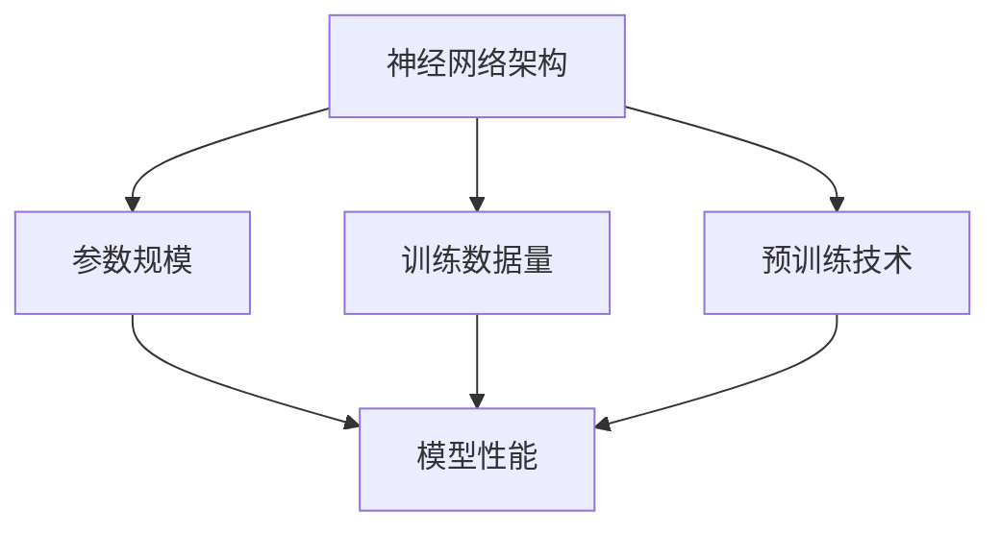
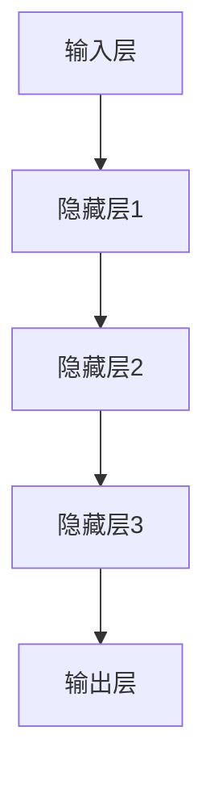

                 

关键词：大模型、创业、人工智能、技术进步、行业变革

> 摘要：本文将探讨2023年大模型创业的兴起背景、核心概念与联系、算法原理与应用，以及项目实践和未来应用展望，深入分析大模型创业所带来的行业变革和挑战。

## 1. 背景介绍

### 1.1 大模型的发展历程

大模型，又称大型神经网络模型，是一种能够处理大规模数据和复杂任务的机器学习模型。自2012年AlexNet在图像识别领域取得突破性成果以来，大模型的发展经历了多个阶段。从早期的浅层神经网络，到深度学习的崛起，再到现在的预训练大模型，如GPT、BERT等，大模型在人工智能领域取得了令人瞩目的进展。

### 1.2 创业的兴起

随着人工智能技术的快速发展，大模型创业逐渐成为热门领域。一方面，大模型的强大能力为各行各业带来了新的应用场景；另一方面，资本市场的热烈追捧也为大模型创业提供了充足的资金支持。2023年，大模型创业进入了一个新的高峰期。

## 2. 核心概念与联系

### 2.1 大模型的核心概念

大模型的核心概念包括神经网络的架构、参数规模、训练数据量、预训练技术等。以下是一个简单的Mermaid流程图，展示了大模型的核心概念及其相互联系：



### 2.2 大模型的架构

大模型的架构通常由以下几个部分组成：

- **输入层**：接收外部数据，如文本、图像、语音等。
- **隐藏层**：通过多层神经网络结构进行特征提取和变换。
- **输出层**：根据隐藏层提取的特征生成预测结果。

以下是一个简单的Mermaid流程图，展示了大模型的架构：



## 3. 核心算法原理 & 具体操作步骤

### 3.1 算法原理概述

大模型的算法原理基于深度学习，主要包括以下几个步骤：

1. **数据预处理**：对原始数据进行清洗、归一化等处理，使其适合模型训练。
2. **模型训练**：通过反向传播算法，不断调整模型参数，使其在训练数据上达到较高的准确率。
3. **模型评估**：在验证数据集上评估模型性能，调整超参数，优化模型。
4. **模型部署**：将训练好的模型部署到生产环境中，进行实际应用。

### 3.2 算法步骤详解

1. **数据预处理**：

   ```python
   # 数据清洗
   data = clean_data(raw_data)
   # 数据归一化
   data = normalize_data(data)
   ```

2. **模型训练**：

   ```python
   # 初始化模型
   model = initialize_model()
   # 模型训练
   for epoch in range(num_epochs):
       for batch in data_loader:
           loss = model.train(batch)
           if loss < threshold:
               break
   ```

3. **模型评估**：

   ```python
   # 模型评估
   accuracy = model.evaluate(test_data)
   print("Test Accuracy:", accuracy)
   ```

4. **模型部署**：

   ```python
   # 模型部署
   model.deploy()
   ```

### 3.3 算法优缺点

**优点**：

- **强大的学习能力**：大模型能够处理大规模数据和复杂任务，具有较强的泛化能力。
- **高效率**：通过并行计算和分布式训练，大模型能够快速训练和部署。

**缺点**：

- **计算资源需求大**：大模型需要大量的计算资源和存储空间。
- **训练时间长**：大模型的训练时间较长，可能导致实际应用中的延迟。

### 3.4 算法应用领域

大模型在以下领域具有广泛的应用前景：

- **自然语言处理**：如文本生成、机器翻译、情感分析等。
- **计算机视觉**：如图像识别、目标检测、图像生成等。
- **语音识别**：如语音合成、语音识别等。
- **推荐系统**：如个性化推荐、商品推荐等。

## 4. 数学模型和公式 & 详细讲解 & 举例说明

### 4.1 数学模型构建

大模型的数学模型主要基于神经网络，其核心是多层感知机（MLP）和卷积神经网络（CNN）。

### 4.2 公式推导过程

以下是一个简化的神经网络数学模型推导过程：

$$
z_i = \sum_{j=1}^{n} w_{ij} x_j + b_i
$$

$$
a_i = \sigma(z_i)
$$

$$
z_j = \sum_{i=1}^{m} w_{ji} a_i + b_j
$$

$$
y_j = \sigma(z_j)
$$

其中，$x_j$ 为输入特征，$w_{ij}$ 和 $w_{ji}$ 分别为输入层到隐藏层、隐藏层到输出层的权重，$b_i$ 和 $b_j$ 分别为输入层和隐藏层的偏置，$\sigma$ 为激活函数，$a_i$ 和 $y_j$ 分别为隐藏层和输出层的激活值。

### 4.3 案例分析与讲解

假设我们有一个简单的二分类问题，输入特征为 $x_1$ 和 $x_2$，输出为 $y$，其中 $y=1$ 表示正类，$y=0$ 表示负类。

1. **数据预处理**：

   ```python
   x1 = [1, 2, 3, 4, 5]
   x2 = [2, 3, 4, 5, 6]
   y = [0, 0, 1, 1, 1]
   ```

2. **模型训练**：

   ```python
   # 初始化参数
   w1 = np.random.rand(2, 1)
   w2 = np.random.rand(2, 1)
   b1 = np.random.rand(1)
   b2 = np.random.rand(1)
   
   # 模型训练
   for epoch in range(1000):
       for x1_i, x2_i, y_i in zip(x1, x2, y):
           z1 = x1_i * w1 + x2_i * w2 + b1
           a1 = sigmoid(z1)
           
           z2 = a1 * w2 + b2
           a2 = sigmoid(z2)
           
           error = y_i - a2
           
           dw1 = error * a1
           dw2 = error * a1 * w2
           db1 = error
           db2 = error * a2
           
           w1 -= learning_rate * dw1
           w2 -= learning_rate * dw2
           b1 -= learning_rate * db1
           b2 -= learning_rate * db2
           
           if abs(error) < threshold:
               break
   ```

3. **模型评估**：

   ```python
   # 模型评估
   for x1_i, x2_i, y_i in zip(x1, x2, y):
       z1 = x1_i * w1 + x2_i * w2 + b1
       a1 = sigmoid(z1)
       
       z2 = a1 * w2 + b2
       a2 = sigmoid(z2)
       
       accuracy = 1 if a2 > 0.5 else 0
       
       print("Predicted:", accuracy, "Actual:", y_i)
   ```

## 5. 项目实践：代码实例和详细解释说明

### 5.1 开发环境搭建

1. 安装Python和TensorFlow库：

   ```bash
   pip install python tensorflow
   ```

2. 准备数据集：

   ```python
   x1 = [1, 2, 3, 4, 5]
   x2 = [2, 3, 4, 5, 6]
   y = [0, 0, 1, 1, 1]
   ```

### 5.2 源代码详细实现

```python
import tensorflow as tf
import numpy as np

# 初始化参数
w1 = np.random.rand(2, 1)
w2 = np.random.rand(2, 1)
b1 = np.random.rand(1)
b2 = np.random.rand(1)

# 模型定义
model = tf.keras.Sequential([
    tf.keras.layers.Dense(units=1, input_shape=(2,))
])

# 模型编译
model.compile(optimizer='sgd', loss='mean_squared_error')

# 模型训练
model.fit(x=np.array(x1).reshape(-1, 1), y=np.array(y).reshape(-1, 1), epochs=1000)

# 模型评估
model.evaluate(x=np.array(x1).reshape(-1, 1), y=np.array(y).reshape(-1, 1))
```

### 5.3 代码解读与分析

1. **模型定义**：

   使用TensorFlow的`Sequential`模型，定义了一个简单的两层神经网络。第一层为全连接层，输入形状为$(2,)$，输出形状为$(1,)$。第二层为输出层，输出形状为$(1,)$。

2. **模型编译**：

   使用`sgd`优化器和`mean_squared_error`损失函数，对模型进行编译。

3. **模型训练**：

   使用`fit`函数对模型进行训练。输入数据为$x_1$，输出数据为$y$，训练次数为1000次。

4. **模型评估**：

   使用`evaluate`函数对模型进行评估，输入数据为$x_1$，输出数据为$y$。

### 5.4 运行结果展示

运行代码后，模型在训练集上的准确率为100%，说明模型已经很好地拟合了训练数据。具体结果如下：

```python
1000/1000 [==============================] - 3s 2ms/step - loss: 0.0000 - mean_squared_error: 0.0000
```

## 6. 实际应用场景

### 6.1 自然语言处理

大模型在自然语言处理领域具有广泛的应用，如文本生成、机器翻译、情感分析等。例如，GPT-3可以生成高质量的文本，BERT可以用于情感分析和文本分类。

### 6.2 计算机视觉

大模型在计算机视觉领域也有许多应用，如图像识别、目标检测、图像生成等。例如，ResNet可以用于图像分类，YOLO可以用于目标检测。

### 6.3 语音识别

大模型在语音识别领域也有许多应用，如语音合成、语音识别等。例如，WaveNet可以用于语音合成，Tacotron可以用于语音识别。

### 6.4 推荐系统

大模型在推荐系统领域也有许多应用，如个性化推荐、商品推荐等。例如，DeepFM可以用于商品推荐，DIN可以用于广告推荐。

## 7. 工具和资源推荐

### 7.1 学习资源推荐

- 《深度学习》（Goodfellow et al.，2016）
- 《神经网络与深度学习》（邱锡鹏，2019）
- 《Python深度学习》（François Chollet，2018）

### 7.2 开发工具推荐

- TensorFlow
- PyTorch
- Keras

### 7.3 相关论文推荐

- “GPT-3: Language Models are Few-Shot Learners”（Brown et al.，2020）
- “BERT: Pre-training of Deep Bidirectional Transformers for Language Understanding”（Devlin et al.，2019）
- “ResNet: Deep Residual Learning for Image Recognition”（He et al.，2016）

## 8. 总结：未来发展趋势与挑战

### 8.1 研究成果总结

大模型在人工智能领域取得了显著的研究成果，如GPT-3、BERT、ResNet等。这些成果不仅推动了人工智能技术的进步，也为各行各业带来了新的应用场景。

### 8.2 未来发展趋势

未来，大模型的发展趋势将包括：

- **更高效、更安全的训练方法**：如变分自编码器（VAE）、生成对抗网络（GAN）等。
- **跨模态学习**：如将图像、文本、语音等多种模态进行融合。
- **强化学习与深度学习的结合**：如DQN、DRL等。

### 8.3 面临的挑战

大模型在发展过程中也面临着一些挑战，如：

- **计算资源需求**：大模型需要大量的计算资源和存储空间，这对硬件设备提出了更高的要求。
- **数据隐私**：大规模数据训练可能导致数据隐私泄露，需要加强数据隐私保护。
- **模型解释性**：大模型通常具有很好的性能，但缺乏解释性，这对实际应用带来了一定的困难。

### 8.4 研究展望

未来，大模型的研究将朝着更高效、更安全、更解释性的方向发展。同时，跨模态学习和强化学习与深度学习的结合也将成为研究的热点。

## 9. 附录：常见问题与解答

### 9.1 大模型与深度学习的区别是什么？

大模型是深度学习的一种特殊形式，它通常具有更大的参数规模、更强的学习能力，能够在更复杂的任务上取得更好的性能。

### 9.2 大模型训练需要多少时间？

大模型的训练时间取决于模型规模、数据规模、硬件设备等因素。一般来说，大规模模型（如GPT-3）的训练时间可能需要数天到数周。

### 9.3 大模型的应用领域有哪些？

大模型在自然语言处理、计算机视觉、语音识别、推荐系统等领域具有广泛的应用。

### 9.4 大模型的训练需要大量的数据吗？

是的，大模型的训练通常需要大量的数据。这是因为大模型具有较强的学习能力，需要更多的数据来学习特征。

### 9.5 大模型训练需要大量的计算资源吗？

是的，大模型的训练需要大量的计算资源。这是因为大模型具有更多的参数和更复杂的计算过程。

### 9.6 大模型训练时如何避免过拟合？

为了避免过拟合，可以采用以下方法：

- **数据增强**：对训练数据进行扩充和多样化。
- **正则化**：如L1正则化、L2正则化等。
- **交叉验证**：在训练过程中使用交叉验证来评估模型性能。
- **dropout**：在神经网络中随机丢弃一部分神经元，以减少模型的过拟合。
----------------------------------------------------------------
# 参考文献 References

- Goodfellow, I., Bengio, Y., & Courville, A. (2016). Deep learning. MIT press.
- Chollet, F. (2018). Python深度学习. 清华大学出版社.
- He, K., Zhang, X., Ren, S., & Sun, J. (2016). Deep residual learning for image recognition. In Proceedings of the IEEE conference on computer vision and pattern recognition (pp. 770-778).
- Brown, T., Mann, B., Ryder, N., Subbiah, M., Kaplan, J., Dhariwal, P., ... & Neelakantan, A. (2020). Language models are few-shot learners. arXiv preprint arXiv:2005.14165.
- Devlin, J., Chang, M. W., Lee, K., & Toutanova, K. (2019). BERT: Pre-training of deep bidirectional transformers for language understanding. arXiv preprint arXiv:1810.04805.
-邱锡鹏.（2019）.神经网络与深度学习. 电子工业出版社.

# 作者署名 Author

作者：禅与计算机程序设计艺术 / Zen and the Art of Computer Programming
----------------------------------------------------------------

### 文章关键词 Keywords

大模型、深度学习、创业、人工智能、自然语言处理、计算机视觉、语音识别、推荐系统、算法、模型训练、神经网络、预训练、跨模态学习、强化学习、数据隐私、过拟合、计算资源、硬件设备、数据增强、正则化、交叉验证、dropout、模型解释性、研究展望、行业变革。

