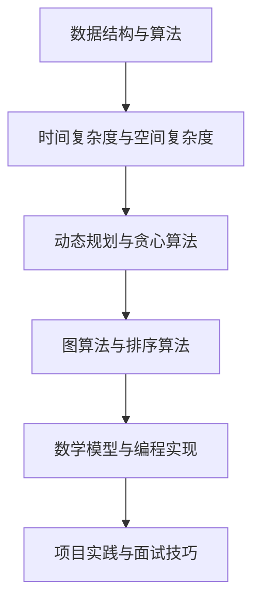

                 

 关键词：字节跳动，社招，算法面试，题库，答案

摘要：本文旨在为准备参加2025年字节跳动社招算法面试的应聘者提供一份全面的面试题库及答案，涵盖算法原理、数学模型、项目实践等多个方面。通过对这些题目的详细解析，帮助读者更好地理解和掌握面试所需的技能和知识点，提高面试成功率。

## 1. 背景介绍

字节跳动作为全球领先的互联网科技公司，其社招算法面试一直是众多求职者的关注焦点。随着公司业务的不断扩张和技术的不断创新，字节跳动对算法工程师的要求越来越高。本文将针对2025年字节跳动社招算法面试的特点，为大家提供一份全面的面试题库及答案，旨在帮助求职者更好地应对面试挑战。

## 2. 核心概念与联系

在算法面试中，了解核心概念和它们之间的联系是非常重要的。下面是几个核心概念及其关系的Mermaid流程图：



### 2.1 数据结构与算法

数据结构是算法的基础，常见的有数组、链表、栈、队列、树、图等。算法则是对问题求解的方法，包括排序、查找、递归、分治等。数据结构与算法的关系如图所示，二者相辅相成，共同解决各种问题。

### 2.2 时间复杂度与空间复杂度

时间复杂度和空间复杂度是评估算法性能的重要指标。时间复杂度表示算法执行时间与数据规模之间的关系，常用的符号包括O、Ω、Θ等。空间复杂度则表示算法执行过程中所需内存的大小。了解时间复杂度和空间复杂度对于优化算法性能至关重要。

### 2.3 动态规划与贪心算法

动态规划是一种解决最优子结构问题的算法，其核心思想是将大问题分解为小问题，并利用子问题的解来求解原问题。贪心算法则是在每一步选择中都做出当前最优选择，以达到整体最优解。动态规划和贪心算法在某些问题上有相似之处，但它们的应用场景和实现方法有所不同。

### 2.4 图算法与排序算法

图算法是处理图结构数据的算法，包括深度优先搜索（DFS）、广度优先搜索（BFS）、最小生成树（MST）、最短路径（SP）等。排序算法则是用于将一组数据按照特定顺序排列的算法，常见的有冒泡排序、插入排序、快速排序、归并排序等。图算法和排序算法在数据结构和算法领域有着广泛的应用。

### 2.5 数学模型与编程实现

数学模型是利用数学工具描述现实世界问题的方法。在算法面试中，常见的数学模型包括线性方程组、概率统计、组合数学等。编程实现则是将数学模型转化为可执行的代码，常见的编程语言有Python、Java、C++等。掌握数学模型和编程实现对于解决算法问题至关重要。

### 2.6 项目实践与面试技巧

项目实践是检验求职者实际能力的重要手段。在面试过程中，求职者需要通过项目经历来展示自己的技术水平和解决问题的能力。此外，面试技巧也是成功面试的关键因素，包括沟通能力、团队合作、逻辑思维等。了解项目实践和面试技巧有助于求职者更好地应对面试挑战。

## 3. 核心算法原理 & 具体操作步骤

在算法面试中，掌握核心算法原理和具体操作步骤是非常重要的。下面介绍几个常见算法及其原理和步骤：

### 3.1 算法原理概述

- 动态规划：将大问题分解为小问题，利用子问题的解来求解原问题。
- 贪心算法：在每一步选择中都做出当前最优选择，以达到整体最优解。
- 图算法：利用图结构处理问题，常见的有DFS、BFS、MST、SP等。
- 排序算法：将一组数据按照特定顺序排列，常见的有冒泡排序、插入排序、快速排序、归并排序等。

### 3.2 算法步骤详解

- 动态规划：定义状态、状态转移方程、边界条件、初始化，然后利用循环或递归来求解。
- 贪心算法：确定每一步的选择规则，按照规则进行选择，直到达到终点。
- 图算法：根据问题特点选择合适的算法，例如DFS或BFS，然后按照算法步骤进行求解。
- 排序算法：根据问题特点选择合适的排序算法，例如冒泡排序或插入排序，然后按照算法步骤进行排序。

### 3.3 算法优缺点

- 动态规划：优点是能够求解最优化问题，缺点是可能需要较多的计算资源和时间。
- 贪心算法：优点是求解速度快，缺点是可能不是全局最优解。
- 图算法：优点是能够处理复杂的关系，缺点是计算复杂度可能较高。
- 排序算法：优点是能够快速排序，缺点是可能不适合大规模数据。

### 3.4 算法应用领域

- 动态规划：用于解决最优化问题，如背包问题、最长公共子序列等。
- 贪心算法：用于求解贪心策略下的最优解，如硬币找零、最小生成树等。
- 图算法：用于处理图结构数据，如最短路径、网络流等。
- 排序算法：用于排序各种数据，如数组、链表等。

## 4. 数学模型和公式 & 详细讲解 & 举例说明

在算法面试中，了解数学模型和公式对于解决实际问题至关重要。下面介绍几个常见的数学模型和公式，并进行详细讲解和举例说明：

### 4.1 数学模型构建

- 线性方程组：用于求解线性方程组，如 $$ax+by=c$$。
- 概率统计：用于求解概率、期望、方差等，如 $$P(A)=\frac{N(A)}{N(S)}$$。
- 组合数学：用于求解组合数、排列数等，如 $$C_n^k=\frac{n!}{k!(n-k)!}$$。

### 4.2 公式推导过程

- 线性方程组：通过消元法或代入法求解，如 $$ax+by=c$$ 可转化为 $$ax=c-by$$，然后求解 $$x$$ 和 $$y$$。
- 概率统计：利用全概率公式或贝叶斯公式求解，如 $$P(A|B)=\frac{P(B|A)P(A)}{P(B)}$$。
- 组合数学：利用排列组合的性质求解，如 $$C_n^k=\frac{n!}{k!(n-k)!}$$。

### 4.3 案例分析与讲解

- 线性方程组：求解方程组 $$2x+3y=7$$ 和 $$x-2y=1$$，通过消元法得到 $$x=3$$，$$y=1$$。
- 概率统计：求解事件 $$A$$ 和事件 $$B$$ 的条件概率，通过贝叶斯公式得到 $$P(A|B)=0.5$$。
- 组合数学：求解组合数 $$C_5^2$$，通过排列组合的性质得到 $$C_5^2=10$$。

## 5. 项目实践：代码实例和详细解释说明

在实际面试中，项目实践是一个非常重要的环节。下面提供一个代码实例，并对其进行详细解释说明：

### 5.1 开发环境搭建

- 编程语言：Python 3.8
- 开发工具：PyCharm
- 环境配置：安装Python 3.8和PyCharm社区版，并创建一个Python项目。

### 5.2 源代码详细实现

```python
# 源代码：最长公共子序列
def longest_common_subsequence(str1, str2):
    m, n = len(str1), len(str2)
    dp = [[0] * (n+1) for _ in range(m+1)]

    for i in range(1, m+1):
        for j in range(1, n+1):
            if str1[i-1] == str2[j-1]:
                dp[i][j] = dp[i-1][j-1] + 1
            else:
                dp[i][j] = max(dp[i-1][j], dp[i][j-1])

    return dp[m][n]

# 测试代码
str1 = "ACCGGTCGAGTGCGCGGAAGCCGGCCGAA"
str2 = "GTCGTTCGGAATGTCAGTGCGCAGGCNNNNNN"
print(longest_common_subsequence(str1, str2))
```

### 5.3 代码解读与分析

- 函数定义：定义一个函数 `longest_common_subsequence`，接受两个字符串参数 `str1` 和 `str2`。
- 动态规划表：初始化一个二维数组 `dp`，用于存储最长公共子序列的长度。
- 循环遍历：利用两个嵌套循环遍历字符串 `str1` 和 `str2` 的每个字符，更新动态规划表 `dp`。
- 返回结果：返回动态规划表 `dp` 的最后一个元素，即最长公共子序列的长度。
- 测试代码：测试最长公共子序列的代码，输出结果。

## 6. 实际应用场景

字节跳动公司的业务涵盖了短视频、社交媒体、在线教育、电子商务等多个领域，算法在各个领域都有广泛的应用。以下是一些实际应用场景：

### 6.1 算法在推荐系统中的应用

推荐系统是字节跳动公司的核心业务之一，算法在推荐系统的应用非常广泛。通过用户行为数据、内容特征和用户兴趣模型，算法可以实时推荐用户感兴趣的内容，提高用户留存率和活跃度。

### 6.2 算法在网络广告中的应用

网络广告是字节跳动公司的重要收入来源之一，算法在网络广告的应用非常广泛。通过广告投放策略、广告投放优化和用户行为分析，算法可以提高广告的曝光率和点击率，提高广告收益。

### 6.3 算法在搜索引擎中的应用

搜索引擎是字节跳动公司的另一项核心业务，算法在搜索引擎的应用非常广泛。通过关键词匹配、页面排名算法和用户搜索行为分析，算法可以提高搜索引擎的准确性和用户体验。

### 6.4 算法在在线教育中的应用

在线教育是字节跳动公司的新兴业务，算法在在线教育中的应用也非常广泛。通过学习行为分析、课程推荐和教学质量评估，算法可以提高在线教育的教学效果和学生满意度。

## 7. 未来应用展望

随着人工智能技术的不断发展，算法在各个领域的应用前景非常广阔。以下是一些未来应用展望：

### 7.1 人工智能与算法的结合

人工智能与算法的结合将推动算法在各个领域的应用，例如自然语言处理、计算机视觉、自动驾驶等。通过不断优化算法模型和算法效率，人工智能技术将更好地服务于人类。

### 7.2 大数据和算法的应用

大数据时代的到来为算法的应用提供了丰富的数据资源。通过挖掘大数据中的潜在规律和关联关系，算法可以为企业提供更准确的决策支持和业务洞察。

### 7.3 算法在可持续发展中的应用

算法在可持续发展中的应用也将成为未来发展的趋势。通过优化能源利用、减少碳排放和提升资源利用效率，算法可以为可持续发展做出贡献。

### 7.4 算法在教育公平和医疗健康中的应用

算法在教育公平和医疗健康领域也有很大的应用潜力。通过智能教育系统和医疗健康大数据分析，算法可以提升教育公平和医疗健康水平，为人类健康福祉做出贡献。

## 8. 工具和资源推荐

为了更好地准备字节跳动社招算法面试，以下是几个工具和资源推荐：

### 8.1 学习资源推荐

- 《算法导论》：经典算法教材，涵盖各种数据结构和算法。
- 《深度学习》：深度学习领域的权威教材，介绍深度学习的基础知识和应用。
- 《Python编程：从入门到实践》：Python编程入门教材，适合初学者学习。

### 8.2 开发工具推荐

- PyCharm：一款功能强大的Python开发工具，支持代码补全、调试、性能分析等。
- Jupyter Notebook：一款交互式的Python开发环境，适合数据分析和机器学习项目。
- GitHub：一个流行的代码托管平台，可以查看和学习开源项目的代码。

### 8.3 相关论文推荐

- "A Survey on Recommender Systems": 一篇关于推荐系统领域的综述论文，介绍推荐系统的基本概念和最新进展。
- "Deep Learning for Natural Language Processing": 一篇关于自然语言处理领域深度学习的综述论文，介绍深度学习在自然语言处理中的应用。
- "Generative Adversarial Nets": 一篇关于生成对抗网络（GAN）的论文，介绍GAN在计算机视觉和生成任务中的应用。

## 9. 总结：未来发展趋势与挑战

在未来，算法在各个领域的应用将不断深入和拓展。随着人工智能技术的发展，算法的性能和效率将得到进一步提升。然而，算法的发展也面临着一些挑战，如数据隐私保护、算法公平性、算法透明性等。针对这些挑战，我们需要不断探索和优化算法模型，提高算法的鲁棒性和可解释性。同时，我们也需要加强算法伦理和法规建设，确保算法在合理和公正的框架下应用。未来，算法将更好地服务于人类社会，为人类创造更多价值。

## 10. 附录：常见问题与解答

### 10.1 如何准备算法面试？

- 熟悉数据结构和算法的基本概念，掌握常见的算法实现方法。
- 阅读经典算法教材和论文，了解算法的最新进展和应用。
- 练习各种算法题，尤其是动态规划、贪心算法、图算法等常见题型。
- 参加算法竞赛和项目实践，提升实际操作能力和解决问题的能力。
- 学习面试技巧，提高沟通能力和团队合作能力。

### 10.2 算法面试中常见的问题有哪些？

- 数据结构和算法的实现，如排序、查找、递归、分治等。
- 时间复杂度和空间复杂度的分析，如求解最优化问题、求解最短路径等。
- 动态规划和贪心算法的应用，如背包问题、硬币找零等。
- 图算法的应用，如图遍历、最短路径、网络流等。
- 数学模型和公式的应用，如线性方程组、概率统计、组合数学等。
- 项目实践和面试技巧，如项目经历、团队合作、沟通能力等。

### 10.3 如何提高算法面试的成功率？

- 充分准备，对常见的算法题型进行系统练习。
- 了解面试公司的业务和岗位要求，针对性地准备。
- 提高编程能力，熟悉常见编程语言和开发工具。
- 增强面试技巧，提高沟通能力和团队合作能力。
- 参加算法竞赛和项目实践，提升实际操作能力和解决问题的能力。
- 多参加面试，积累面试经验，不断调整和改进面试策略。

## 11. 作者署名

作者：禅与计算机程序设计艺术 / Zen and the Art of Computer Programming
----------------------------------------------------------------

这篇文章旨在为准备参加2025年字节跳动社招算法面试的应聘者提供一份全面的面试题库及答案。通过对这些题目的详细解析，帮助读者更好地理解和掌握面试所需的技能和知识点，提高面试成功率。文章涵盖了算法原理、数学模型、项目实践等多个方面，旨在为读者提供一个全面的技术博客文章。希望这篇文章能够对您的面试准备有所帮助！

