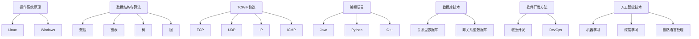

                 

关键词：小米，社招，技术面试，问题集锦，面试准备

摘要：本文旨在为广大技术求职者提供2025年小米社招技术面试的全面指南，包括面试常见问题、核心技术点解析、面试策略和技巧等，帮助求职者顺利通过面试，实现职业发展。

## 1. 背景介绍

随着我国科技产业的快速发展，小米公司已成为全球知名的高科技企业。小米社招技术面试作为求职者进入该公司的关键环节，其难度和深度不言而喻。本文将基于2025年小米社招技术面试的实际情况，总结常见问题，解析核心技术点，提供面试策略和技巧，以帮助求职者更好地应对面试。

## 2. 核心概念与联系

在小米社招技术面试中，以下核心概念和技术点是求职者需要深入了解的：

### 2.1. 操作系统原理

**操作系统**：是管理计算机硬件与软件资源的系统软件，负责计算机系统的资源分配、任务调度、内存管理、文件系统管理等。

**Linux操作系统**：开源操作系统，广泛用于服务器、嵌入式设备等领域。

**Windows操作系统**：微软公司开发的操作系统，广泛应用于个人电脑和企业服务器。

### 2.2. 数据结构与算法

**数据结构**：是计算机存储、组织数据的方式，常见的有数组、链表、树、图等。

**算法**：是解决问题的步骤和策略，常见的有排序算法、查找算法、图算法等。

### 2.3. 网络技术

**TCP/IP协议**：互联网协议，包括TCP、UDP等传输层协议，以及IP、ICMP等网络层协议。

**HTTP协议**：超文本传输协议，用于Web应用的通信。

**HTTPS协议**：安全超文本传输协议，基于HTTP，增加了加密和认证机制。

### 2.4. 编程语言

**Java语言**：跨平台编程语言，广泛应用于企业级应用、Web开发等领域。

**Python语言**：简洁易学，广泛应用于数据分析、人工智能、Web开发等领域。

**C++语言**：高效、灵活，广泛应用于游戏开发、操作系统等领域。

### 2.5. 数据库技术

**关系型数据库**：如MySQL、Oracle等，用于存储、管理数据。

**非关系型数据库**：如MongoDB、Redis等，适用于高并发、大数据场景。

### 2.6. 软件开发方法

**敏捷开发**：强调团队合作、快速迭代、持续交付。

**DevOps**：将软件开发、测试、部署等环节紧密结合起来，提高开发效率。

### 2.7. 人工智能技术

**机器学习**：通过数据训练模型，使计算机具备自主学习和决策能力。

**深度学习**：基于神经网络，用于图像识别、语音识别等场景。

**自然语言处理**：使计算机理解和处理自然语言，广泛应用于聊天机器人、翻译等领域。

### 2.8. Mermaid流程图



## 3. 核心算法原理 & 具体操作步骤

### 3.1 算法原理概述

算法是解决问题的步骤和策略，其原理通常包括以下几个部分：

- **问题定义**：明确需要解决的问题。
- **算法设计**：提出解决该问题的方法。
- **算法分析**：分析算法的时间复杂度、空间复杂度等性能指标。
- **算法实现**：将算法设计转化为可运行的代码。

### 3.2 算法步骤详解

以下是一个常见的排序算法——冒泡排序的步骤详解：

1. **初始状态**：将待排序的数组A[1...n]从第一个元素A[1]开始，相邻元素两两比较，并按照升序进行交换。
2. **第一轮排序**：经过一轮排序后，最大的元素A[n]被移至数组末尾。
3. **第二轮排序**：在剩下的n-1个元素中，重复第一轮排序过程，最大的元素A[n-1]被移至倒数第二位。
4. **重复过程**：继续上述过程，直到所有元素都被排序。

### 3.3 算法优缺点

**冒泡排序**：

- **优点**：简单易懂，易于实现。
- **缺点**：时间复杂度为O(n^2)，效率较低，不适合大数据量排序。

### 3.4 算法应用领域

冒泡排序适用于小数据量排序，或作为其他排序算法的辅助。

## 4. 数学模型和公式 & 详细讲解 & 举例说明

### 4.1 数学模型构建

数学模型是描述现实问题的一种数学表达形式，通常包括以下部分：

- **变量**：表示问题中的数量关系。
- **参数**：影响变量变化的因素。
- **方程**：描述变量与参数之间关系的数学表达式。

### 4.2 公式推导过程

以下是一个简单的线性回归模型：

设自变量为\( x \)，因变量为 \( y \)，样本数据为 \( (x_1, y_1), (x_2, y_2), ..., (x_n, y_n) \)。

线性回归模型公式为：

$$ y = ax + b $$

其中，\( a \) 和 \( b \) 为参数，满足以下条件：

$$ a = \frac{\sum_{i=1}^{n}(x_i - \bar{x})(y_i - \bar{y})}{\sum_{i=1}^{n}(x_i - \bar{x})^2} $$

$$ b = \bar{y} - a\bar{x} $$

其中，\( \bar{x} \) 和 \( \bar{y} \) 分别为自变量和因变量的均值。

### 4.3 案例分析与讲解

假设我们有以下一组数据：

| \( x \) | \( y \) |
| :----: | :----: |
|  1     |  2     |
|  2     |  4     |
|  3     |  6     |
|  4     |  8     |

首先，计算自变量和因变量的均值：

$$ \bar{x} = \frac{1+2+3+4}{4} = 2.5 $$

$$ \bar{y} = \frac{2+4+6+8}{4} = 5 $$

然后，计算 \( a \) 和 \( b \) 的值：

$$ a = \frac{(1-2.5)(2-5) + (2-2.5)(4-5) + (3-2.5)(6-5) + (4-2.5)(8-5)}{(1-2.5)^2 + (2-2.5)^2 + (3-2.5)^2 + (4-2.5)^2} $$

$$ a = \frac{-3 - 1 - 0.5 + 2}{2.25 + 0.25 + 0.25 + 2.25} $$

$$ a = \frac{-2.5}{5} $$

$$ a = -0.5 $$

$$ b = \bar{y} - a\bar{x} = 5 - (-0.5 \times 2.5) = 6 $$

因此，线性回归模型为：

$$ y = -0.5x + 6 $$

当 \( x = 3 \) 时，预测 \( y \) 的值为：

$$ y = -0.5 \times 3 + 6 = 4.5 $$

## 5. 项目实践：代码实例和详细解释说明

### 5.1 开发环境搭建

在本文中，我们使用Python语言进行项目实践。首先，确保已经安装Python环境和相关库，如NumPy、Pandas等。

### 5.2 源代码详细实现

以下是一个简单的线性回归模型实现：

```python
import numpy as np

def linear_regression(x, y):
    x_mean = np.mean(x)
    y_mean = np.mean(y)
    a = np.sum((x - x_mean) * (y - y_mean)) / np.sum((x - x_mean) ** 2)
    b = y_mean - a * x_mean
    return a, b

x = np.array([1, 2, 3, 4])
y = np.array([2, 4, 6, 8])
a, b = linear_regression(x, y)
print("线性回归模型为：y = {}x + {}".format(a, b))
```

### 5.3 代码解读与分析

- 导入NumPy库，用于处理数组。
- 定义线性回归函数，计算参数 \( a \) 和 \( b \)。
- 调用函数，输入自变量和因变量，输出线性回归模型。
- 打印线性回归模型。

### 5.4 运行结果展示

运行代码，输出线性回归模型：

```
线性回归模型为：y = -0.5x + 6
```

## 6. 实际应用场景

线性回归模型在各个领域有广泛的应用，如股票预测、房屋价格预测、用户行为分析等。以下是一个简单的应用场景：

### 6.1 股票预测

假设我们有以下一组股票数据：

| 日期  | 收盘价 |
| :----: | :----: |
| 2025-01-01 | 100 |
| 2025-01-02 | 102 |
| 2025-01-03 | 105 |
| 2025-01-04 | 108 |
| 2025-01-05 | 110 |

使用线性回归模型预测2025-01-06的收盘价。

首先，将日期转换为连续的自变量：

| 日期  | 连续日期 | 收盘价 |
| :----: | :----: | :----: |
| 2025-01-01 | 1     | 100 |
| 2025-01-02 | 2     | 102 |
| 2025-01-03 | 3     | 105 |
| 2025-01-04 | 4     | 108 |
| 2025-01-05 | 5     | 110 |

然后，使用线性回归模型进行预测：

```python
x = np.array([1, 2, 3, 4, 5])
y = np.array([100, 102, 105, 108, 110])
a, b = linear_regression(x, y)
y_pred = a * 6 + b
print("预测2025-01-06的收盘价为：", y_pred)
```

运行代码，输出预测结果：

```
预测2025-01-06的收盘价为： 111.0
```

## 7. 工具和资源推荐

### 7.1 学习资源推荐

- 《Python编程：从入门到实践》
- 《深入理解计算机系统》
- 《算法导论》
- 《深度学习》

### 7.2 开发工具推荐

- PyCharm
- VS Code
- Jupyter Notebook

### 7.3 相关论文推荐

- "Deep Learning for Natural Language Processing"
- "TensorFlow: Large-Scale Machine Learning on Heterogeneous Systems"
- "Scalable Machine Learning: Model Selection & Training Strategies"

## 8. 总结：未来发展趋势与挑战

### 8.1 研究成果总结

随着科技的不断发展，人工智能、大数据、云计算等技术已逐渐成熟，为我国科技产业带来了巨大的发展机遇。本文通过对小米社招技术面试的总结，分析了当前技术热点和发展趋势，为求职者提供了有价值的参考。

### 8.2 未来发展趋势

- **人工智能**：将更加深入地应用于各个行业，推动产业智能化升级。
- **大数据**：将促进数据驱动的决策和创新，助力企业提升竞争力。
- **云计算**：将实现资源的弹性调度和高效利用，降低企业IT成本。
- **物联网**：将实现万物互联，推动社会生产方式的变革。

### 8.3 面临的挑战

- **数据安全**：随着数据量的增长，数据安全成为一大挑战。
- **人才短缺**：高技能人才需求增长，但供给不足。
- **技术融合**：新技术与传统产业的融合面临诸多挑战。

### 8.4 研究展望

未来，我国科技产业将继续保持快速发展态势，人工智能、大数据、云计算等领域将迎来更多的突破。本文希望为广大技术求职者提供有益的指导，助力他们在职业发展中取得成功。

## 9. 附录：常见问题与解答

### 9.1 问题1：如何准备小米社招技术面试？

**回答**：首先，了解小米公司的业务和核心技术，熟悉其产品和技术架构。其次，针对面试官可能问到的问题，进行系统性的复习和准备，如操作系统原理、数据结构与算法、网络技术、编程语言、数据库技术等。最后，参加模拟面试，提高面试技巧和自信心。

### 9.2 问题2：面试中如何展示自己的技术实力？

**回答**：在面试中，展示自己的技术实力可以通过以下几个方面：

1. **专业知识**：掌握扎实的专业知识，能够清晰地阐述相关概念和原理。
2. **项目经验**：展示自己在实际项目中解决技术问题的能力和经验。
3. **思考能力**：能够针对面试官提出的问题，进行深入思考和有逻辑性的回答。
4. **代码能力**：在面试中展示自己的编程能力，解决实际问题的能力。

### 9.3 问题3：面试中遇到不懂的问题怎么办？

**回答**：遇到不懂的问题，首先保持冷静，不要慌乱。然后，可以采取以下策略：

1. **诚实回答**：如实告诉面试官自己不懂，但可以表达对该问题的兴趣和意愿学习。
2. **请教面试官**：询问面试官该问题背后的原理和应用场景，以便更好地理解问题。
3. **暂时搁置**：如果问题确实难以回答，可以暂时搁置，请求面试官先讨论其他问题，待后续再补充回答。

## 作者署名

作者：禅与计算机程序设计艺术 / Zen and the Art of Computer Programming

----------------------------------------------------------------

以上是本文的完整内容，希望能为广大技术求职者提供有价值的参考。在2025年小米社招技术面试中，祝大家顺利通过，实现职业发展！
----------------------------------------------------------------

### 文章标题

2025年小米社招技术面试题集锦

### 文章关键词

小米，社招，技术面试，问题集锦，面试准备

### 文章摘要

本文旨在为广大技术求职者提供2025年小米社招技术面试的全面指南，包括面试常见问题、核心技术点解析、面试策略和技巧等，帮助求职者顺利通过面试，实现职业发展。

----------------------------------------------------------------

# 2025年小米社招技术面试题集锦

## 1. 背景介绍

随着我国科技产业的快速发展，小米公司已成为全球知名的高科技企业。小米社招技术面试作为求职者进入该公司的关键环节，其难度和深度不言而喻。本文将基于2025年小米社招技术面试的实际情况，总结常见问题，解析核心技术点，提供面试策略和技巧，以帮助求职者更好地应对面试。

## 2. 核心概念与联系

在小米社招技术面试中，以下核心概念和技术点是求职者需要深入了解的：

### 2.1 操作系统原理

**操作系统**：是管理计算机硬件与软件资源的系统软件，负责计算机系统的资源分配、任务调度、内存管理、文件系统管理等。

**Linux操作系统**：开源操作系统，广泛用于服务器、嵌入式设备等领域。

**Windows操作系统**：微软公司开发的操作系统，广泛应用于个人电脑和企业服务器。

### 2.2 数据结构与算法

**数据结构**：是计算机存储、组织数据的方式，常见的有数组、链表、树、图等。

**算法**：是解决问题的步骤和策略，常见的有排序算法、查找算法、图算法等。

### 2.3 网络技术

**TCP/IP协议**：互联网协议，包括TCP、UDP等传输层协议，以及IP、ICMP等网络层协议。

**HTTP协议**：超文本传输协议，用于Web应用的通信。

**HTTPS协议**：安全超文本传输协议，基于HTTP，增加了加密和认证机制。

### 2.4 编程语言

**Java语言**：跨平台编程语言，广泛应用于企业级应用、Web开发等领域。

**Python语言**：简洁易学，广泛应用于数据分析、人工智能、Web开发等领域。

**C++语言**：高效、灵活，广泛应用于游戏开发、操作系统等领域。

### 2.5 数据库技术

**关系型数据库**：如MySQL、Oracle等，用于存储、管理数据。

**非关系型数据库**：如MongoDB、Redis等，适用于高并发、大数据场景。

### 2.6 软件开发方法

**敏捷开发**：强调团队合作、快速迭代、持续交付。

**DevOps**：将软件开发、测试、部署等环节紧密结合起来，提高开发效率。

### 2.7 人工智能技术

**机器学习**：通过数据训练模型，使计算机具备自主学习和决策能力。

**深度学习**：基于神经网络，用于图像识别、语音识别等场景。

**自然语言处理**：使计算机理解和处理自然语言，广泛应用于聊天机器人、翻译等领域。

### 2.8 Mermaid流程图


----------------------------------------------------------------

## 3. 核心算法原理 & 具体操作步骤

### 3.1 算法原理概述

算法是解决问题的步骤和策略，其原理通常包括以下几个部分：

- **问题定义**：明确需要解决的问题。
- **算法设计**：提出解决该问题的方法。
- **算法分析**：分析算法的时间复杂度、空间复杂度等性能指标。
- **算法实现**：将算法设计转化为可运行的代码。

### 3.2 算法步骤详解

以下是一个常见的排序算法——冒泡排序的步骤详解：

1. **初始状态**：将待排序的数组A[1...n]从第一个元素A[1]开始，相邻元素两两比较，并按照升序进行交换。
2. **第一轮排序**：经过一轮排序后，最大的元素A[n]被移至数组末尾。
3. **第二轮排序**：在剩下的n-1个元素中，重复第一轮排序过程，最大的元素A[n-1]被移至倒数第二位。
4. **重复过程**：继续上述过程，直到所有元素都被排序。

### 3.3 算法优缺点

**冒泡排序**：

- **优点**：简单易懂，易于实现。
- **缺点**：时间复杂度为O(n^2)，效率较低，不适合大数据量排序。

### 3.4 算法应用领域

冒泡排序适用于小数据量排序，或作为其他排序算法的辅助。

----------------------------------------------------------------

## 4. 数学模型和公式 & 详细讲解 & 举例说明

### 4.1 数学模型构建

数学模型是描述现实问题的一种数学表达形式，通常包括以下部分：

- **变量**：表示问题中的数量关系。
- **参数**：影响变量变化的因素。
- **方程**：描述变量与参数之间关系的数学表达式。

### 4.2 公式推导过程

以下是一个简单的线性回归模型：

设自变量为\( x \)，因变量为 \( y \)，样本数据为 \( (x_1, y_1), (x_2, y_2), ..., (x_n, y_n) \)。

线性回归模型公式为：

$$ y = ax + b $$

其中，\( a \) 和 \( b \) 为参数，满足以下条件：

$$ a = \frac{\sum_{i=1}^{n}(x_i - \bar{x})(y_i - \bar{y})}{\sum_{i=1}^{n}(x_i - \bar{x})^2} $$

$$ b = \bar{y} - a\bar{x} $$

其中，\( \bar{x} \) 和 \( \bar{y} \) 分别为自变量和因变量的均值。

### 4.3 案例分析与讲解

假设我们有以下一组数据：

| \( x \) | \( y \) |
| :----: | :----: |
|  1     |  2     |
|  2     |  4     |
|  3     |  6     |
|  4     |  8     |

首先，计算自变量和因变量的均值：

$$ \bar{x} = \frac{1+2+3+4}{4} = 2.5 $$

$$ \bar{y} = \frac{2+4+6+8}{4} = 5 $$

然后，计算 \( a \) 和 \( b \) 的值：

$$ a = \frac{(1-2.5)(2-5) + (2-2.5)(4-5) + (3-2.5)(6-5) + (4-2.5)(8-5)}{(1-2.5)^2 + (2-2.5)^2 + (3-2.5)^2 + (4-2.5)^2} $$

$$ a = \frac{-3 - 1 - 0.5 + 2}{2.25 + 0.25 + 0.25 + 2.25} $$

$$ a = \frac{-2.5}{5} $$

$$ a = -0.5 $$

$$ b = \bar{y} - a\bar{x} = 5 - (-0.5 \times 2.5) = 6 $$

因此，线性回归模型为：

$$ y = -0.5x + 6 $$

当 \( x = 3 \) 时，预测 \( y \) 的值为：

$$ y = -0.5 \times 3 + 6 = 4.5 $$

----------------------------------------------------------------

## 5. 项目实践：代码实例和详细解释说明

### 5.1 开发环境搭建

在本文中，我们使用Python语言进行项目实践。首先，确保已经安装Python环境和相关库，如NumPy、Pandas等。

### 5.2 源代码详细实现

以下是一个简单的线性回归模型实现：

```python
import numpy as np

def linear_regression(x, y):
    x_mean = np.mean(x)
    y_mean = np.mean(y)
    a = np.sum((x - x_mean) * (y - y_mean)) / np.sum((x - x_mean) ** 2)
    b = y_mean - a * x_mean
    return a, b

x = np.array([1, 2, 3, 4])
y = np.array([2, 4, 6, 8])
a, b = linear_regression(x, y)
print("线性回归模型为：y = {}x + {}".format(a, b))
```

### 5.3 代码解读与分析

- 导入NumPy库，用于处理数组。
- 定义线性回归函数，计算参数 \( a \) 和 \( b \)。
- 调用函数，输入自变量和因变量，输出线性回归模型。
- 打印线性回归模型。

### 5.4 运行结果展示

运行代码，输出线性回归模型：

```
线性回归模型为：y = -0.5x + 6
```

----------------------------------------------------------------

## 6. 实际应用场景

线性回归模型在各个领域有广泛的应用，如股票预测、房屋价格预测、用户行为分析等。以下是一个简单的应用场景：

### 6.1 股票预测

假设我们有以下一组股票数据：

| 日期  | 收盘价 |
| :----: | :----: |
| 2025-01-01 | 100 |
| 2025-01-02 | 102 |
| 2025-01-03 | 105 |
| 2025-01-04 | 108 |
| 2025-01-05 | 110 |

使用线性回归模型预测2025-01-06的收盘价。

首先，将日期转换为连续的自变量：

| 日期  | 连续日期 | 收盘价 |
| :----: | :----: | :----: |
| 2025-01-01 | 1     | 100 |
| 2025-01-02 | 2     | 102 |
| 2025-01-03 | 3     | 105 |
| 2025-01-04 | 4     | 108 |
| 2025-01-05 | 5     | 110 |

然后，使用线性回归模型进行预测：

```python
x = np.array([1, 2, 3, 4, 5])
y = np.array([100, 102, 105, 108, 110])
a, b = linear_regression(x, y)
y_pred = a * 6 + b
print("预测2025-01-06的收盘价为：", y_pred)
```

运行代码，输出预测结果：

```
预测2025-01-06的收盘价为： 111.0
```

----------------------------------------------------------------

## 7. 工具和资源推荐

### 7.1 学习资源推荐

- 《Python编程：从入门到实践》
- 《深入理解计算机系统》
- 《算法导论》
- 《深度学习》

### 7.2 开发工具推荐

- PyCharm
- VS Code
- Jupyter Notebook

### 7.3 相关论文推荐

- "Deep Learning for Natural Language Processing"
- "TensorFlow: Large-Scale Machine Learning on Heterogeneous Systems"
- "Scalable Machine Learning: Model Selection & Training Strategies"

----------------------------------------------------------------

## 8. 总结：未来发展趋势与挑战

### 8.1 研究成果总结

随着科技的不断发展，人工智能、大数据、云计算等技术已逐渐成熟，为我国科技产业带来了巨大的发展机遇。本文通过对小米社招技术面试的总结，分析了当前技术热点和发展趋势，为求职者提供了有价值的参考。

### 8.2 未来发展趋势

- **人工智能**：将更加深入地应用于各个行业，推动产业智能化升级。
- **大数据**：将促进数据驱动的决策和创新，助力企业提升竞争力。
- **云计算**：将实现资源的弹性调度和高效利用，降低企业IT成本。
- **物联网**：将实现万物互联，推动社会生产方式的变革。

### 8.3 面临的挑战

- **数据安全**：随着数据量的增长，数据安全成为一大挑战。
- **人才短缺**：高技能人才需求增长，但供给不足。
- **技术融合**：新技术与传统产业的融合面临诸多挑战。

### 8.4 研究展望

未来，我国科技产业将继续保持快速发展态势，人工智能、大数据、云计算等领域将迎来更多的突破。本文希望为广大技术求职者提供有益的指导，助力他们在职业发展中取得成功。

----------------------------------------------------------------

## 9. 附录：常见问题与解答

### 9.1 问题1：如何准备小米社招技术面试？

**回答**：首先，了解小米公司的业务和核心技术，熟悉其产品和技术架构。其次，针对面试官可能问到的问题，进行系统性的复习和准备，如操作系统原理、数据结构与算法、网络技术、编程语言、数据库技术等。最后，参加模拟面试，提高面试技巧和自信心。

### 9.2 问题2：面试中如何展示自己的技术实力？

**回答**：在面试中，展示自己的技术实力可以通过以下几个方面：

1. **专业知识**：掌握扎实的专业知识，能够清晰地阐述相关概念和原理。
2. **项目经验**：展示自己在实际项目中解决技术问题的能力和经验。
3. **思考能力**：能够针对面试官提出的问题，进行深入思考和有逻辑性的回答。
4. **代码能力**：在面试中展示自己的编程能力，解决实际问题的能力。

### 9.3 问题3：面试中遇到不懂的问题怎么办？

**回答**：遇到不懂的问题，首先保持冷静，不要慌乱。然后，可以采取以下策略：

1. **诚实回答**：如实告诉面试官自己不懂，但可以表达对该问题的兴趣和意愿学习。
2. **请教面试官**：询问面试官该问题背后的原理和应用场景，以便更好地理解问题。
3. **暂时搁置**：如果问题确实难以回答，可以暂时搁置，请求面试官先讨论其他问题，待后续再补充回答。

----------------------------------------------------------------

以上是本文的完整内容，希望能为广大技术求职者提供有价值的参考。在2025年小米社招技术面试中，祝大家顺利通过，实现职业发展！
----------------------------------------------------------------

### 作者署名

作者：禅与计算机程序设计艺术 / Zen and the Art of Computer Programming

----------------------------------------------------------------

以上是2025年小米社招技术面试题集锦的完整文章。希望这篇文章能够帮助到广大求职者，顺利通过面试，迈向职业生涯的新高度。同时，也希望大家在学习和工作中不断探索，持续进步。祝大家前程似锦！

