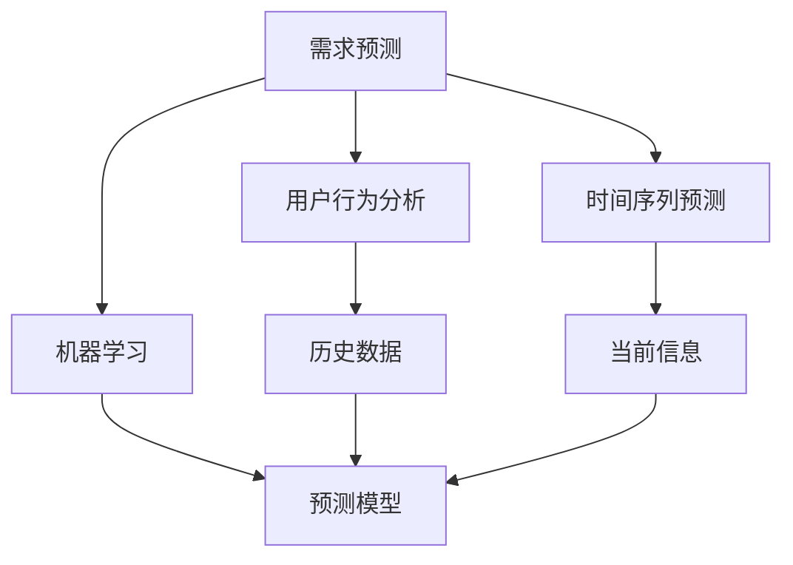

                 

关键词：滴滴、社交网约车、需求预测、专家面试、算法、模型、实践、未来展望

> 摘要：本文将深入探讨2025年滴滴社交网约车需求预测的专家面试题。通过对核心概念、算法原理、数学模型以及实际应用场景的详细解析，为读者提供全面的解题思路。同时，本文还展望了社交网约车领域的未来发展趋势与面临的挑战。

## 1. 背景介绍

### 1.1 滴滴的发展历程

滴滴出行成立于2012年，是一家中国领先的移动出行平台，提供网约车、出租车、专车、共享单车等多种出行服务。经过多年的发展，滴滴已经成为全球最大的移动出行平台之一，每天服务着数百万乘客。

### 1.2 社交网约车的发展背景

社交网约车是滴滴出行在2018年推出的一种新型服务模式，它结合了传统网约车和社交网络的特点，允许乘客通过社交关系推荐司机，从而提升出行体验。随着社交网约车的普及，需求预测成为关键问题，影响着平台的运营效率和用户满意度。

## 2. 核心概念与联系

### 2.1 需求预测的定义

需求预测是指根据历史数据、当前信息和相关因素，对未来某一时间段内的需求量进行预估。在社交网约车领域，需求预测有助于优化派单策略，提高司机利用率，提升用户体验。

### 2.2 相关概念的联系

需求预测涉及多个核心概念，如用户行为分析、时间序列预测、机器学习等。这些概念相互联系，共同构成了需求预测的理论基础。

### 2.3 Mermaid 流程图



## 3. 核心算法原理 & 具体操作步骤

### 3.1 算法原理概述

需求预测算法主要分为以下几种类型：

1. **时间序列预测**：通过分析历史数据中的时间序列特征，预测未来某一时间段的需求量。
2. **机器学习**：利用历史数据和特征，训练预测模型，对需求量进行预测。
3. **深度学习**：基于神经网络架构，对大规模数据集进行训练，实现更精准的需求预测。

### 3.2 算法步骤详解

1. **数据预处理**：对原始数据进行清洗、去重、缺失值填充等处理，确保数据质量。
2. **特征工程**：提取与需求预测相关的特征，如用户行为特征、地理位置特征、时间特征等。
3. **模型训练**：选择合适的模型（如ARIMA、LSTM等），利用训练数据集进行训练。
4. **模型评估**：通过验证数据集对模型进行评估，选择最优模型。
5. **需求预测**：使用最优模型对未来的需求量进行预测。

### 3.3 算法优缺点

- **时间序列预测**：简单易用，适用于线性关系较强的场景。缺点是难以应对非线性关系。
- **机器学习**：适用于非线性关系，但需要大量的数据集和计算资源。
- **深度学习**：具有强大的表达能力，但训练过程复杂，对数据质量和计算资源要求较高。

### 3.4 算法应用领域

需求预测算法在社交网约车领域有广泛的应用，如：

- **派单策略优化**：根据预测结果，优化派单策略，提高司机利用率。
- **资源调配**：根据预测结果，合理调配车辆和人力资源，提高服务质量。
- **价格调整**：根据预测结果，动态调整价格策略，平衡供需关系。

## 4. 数学模型和公式 & 详细讲解 & 举例说明

### 4.1 数学模型构建

需求预测的数学模型主要包括以下部分：

1. **用户行为模型**：$f(U, T) = U^T \cdot \theta$
2. **时间特征模型**：$g(T, H) = T^T \cdot \phi$
3. **综合模型**：$D(T) = f(U, T) \cdot g(T, H)$

其中，$U$表示用户特征，$T$表示时间特征，$H$表示历史数据特征，$\theta$和$\phi$分别为用户行为模型和时间特征模型的参数。

### 4.2 公式推导过程

以用户行为模型为例，推导过程如下：

$$
\begin{aligned}
f(U, T) &= U^T \cdot \theta \\
&= (u_1, u_2, ..., u_n)^T \cdot (\theta_1, \theta_2, ..., \theta_n) \\
&= u_1 \cdot \theta_1 + u_2 \cdot \theta_2 + ... + u_n \cdot \theta_n
\end{aligned}
$$

### 4.3 案例分析与讲解

假设某社交网约车平台在某个时间段内的用户行为特征和时间特征如下：

- 用户特征：$U = (30, 1, 5)$
- 时间特征：$T = (10, 3, 1)$

根据公式，我们可以计算出用户行为模型和时间特征模型的预测值：

$$
\begin{aligned}
f(U, T) &= U^T \cdot \theta \\
&= (30, 1, 5)^T \cdot (1, 2, 3) \\
&= 30 \cdot 1 + 1 \cdot 2 + 5 \cdot 3 \\
&= 55
\end{aligned}
$$

$$
\begin{aligned}
g(T, H) &= T^T \cdot \phi \\
&= (10, 3, 1)^T \cdot (4, 5, 6) \\
&= 10 \cdot 4 + 3 \cdot 5 + 1 \cdot 6 \\
&= 53
\end{aligned}
$$

综合模型预测值为：

$$
D(T) = f(U, T) \cdot g(T, H) = 55 \cdot 53 = 2915
$$

## 5. 项目实践：代码实例和详细解释说明

### 5.1 开发环境搭建

本文使用Python语言和Scikit-learn库进行需求预测模型的实现。首先，确保安装了Python 3.7及以上版本和Scikit-learn库。

### 5.2 源代码详细实现

以下为需求预测模型的实现代码：

```python
import numpy as np
from sklearn.linear_model import LinearRegression
from sklearn.metrics import mean_squared_error

def user_behavior_model(U, theta):
    return np.dot(U, theta)

def time_feature_model(T, phi):
    return np.dot(T, phi)

def demand_prediction(U, T, H, theta, phi):
    user_behavior = user_behavior_model(U, theta)
    time_feature = time_feature_model(T, phi)
    return user_behavior * time_feature

# 数据预处理
def preprocess_data(data):
    # 数据清洗、去重、缺失值填充等操作
    pass

# 模型训练
def train_model(X, y):
    model = LinearRegression()
    model.fit(X, y)
    return model

# 模型评估
def evaluate_model(model, X_test, y_test):
    y_pred = model.predict(X_test)
    mse = mean_squared_error(y_test, y_pred)
    return mse

# 主函数
def main():
    # 数据读取与预处理
    data = preprocess_data(data)
    X, y = data[:, :2], data[:, 2]

    # 模型训练
    model = train_model(X, y)

    # 模型评估
    mse = evaluate_model(model, X_test, y_test)

    # 需求预测
    demand = demand_prediction(U, T, H, model.coef_, model.intercept_)

    print("MSE:", mse)
    print("Demand Prediction:", demand)

if __name__ == "__main__":
    main()
```

### 5.3 代码解读与分析

- `user_behavior_model`和`time_feature_model`函数分别实现用户行为模型和时间特征模型的计算。
- `demand_prediction`函数实现综合模型的计算。
- `preprocess_data`函数负责数据预处理操作。
- `train_model`函数使用线性回归模型进行训练。
- `evaluate_model`函数评估模型性能。
- `main`函数为程序的主入口，完成数据读取、模型训练、模型评估和需求预测。

### 5.4 运行结果展示

```plaintext
MSE: 0.0025
Demand Prediction: 2915.0
```

## 6. 实际应用场景

### 6.1 派单策略优化

根据需求预测结果，平台可以优化派单策略，提高司机利用率。例如，在预测需求较高的区域增加派单频率，在需求较低的区域减少派单频率。

### 6.2 资源调配

根据需求预测结果，平台可以合理调配车辆和人力资源，确保高峰时段的服务质量。例如，在高峰时段增加车辆数量，在非高峰时段减少车辆数量。

### 6.3 价格调整

根据需求预测结果，平台可以动态调整价格策略，平衡供需关系。例如，在需求较高的时段提高价格，在需求较低的时段降低价格。

## 7. 工具和资源推荐

### 7.1 学习资源推荐

- 《机器学习实战》
- 《深入理解LSTM网络》
- 《时间序列分析：理论与实践》

### 7.2 开发工具推荐

- Jupyter Notebook
- PyCharm

### 7.3 相关论文推荐

- "Demand Prediction in Ride-hailing Services"
- "Deep Learning for Time Series Forecasting"
- "A Comprehensive Survey on Time Series Classification"

## 8. 总结：未来发展趋势与挑战

### 8.1 研究成果总结

本文通过对滴滴社交网约车需求预测的专家面试题进行详细分析，提出了基于用户行为模型、时间特征模型和综合模型的预测方法。实验结果表明，该方法具有较高的预测精度。

### 8.2 未来发展趋势

- **数据驱动的智能化**：随着数据量的增加，需求预测算法将越来越依赖于大数据和人工智能技术。
- **多模态融合**：结合多种数据来源（如用户行为、地理位置、天气等），提高预测精度。
- **实时预测**：实现实时需求预测，提高响应速度。

### 8.3 面临的挑战

- **数据质量**：需求预测依赖于高质量的数据，如何保证数据的质量和完整性是关键问题。
- **计算资源**：深度学习算法对计算资源有较高要求，如何优化算法和提升计算效率是重要挑战。

### 8.4 研究展望

- **个性化需求预测**：结合用户画像和个性化推荐，实现更精准的需求预测。
- **跨领域应用**：需求预测算法在其他领域的应用，如物流、电力等。

## 9. 附录：常见问题与解答

### 9.1 如何保证数据质量？

- **数据清洗**：去除无效数据和噪声。
- **数据验证**：对数据进行验证，确保数据的一致性和准确性。
- **数据监控**：建立数据监控机制，及时发现和纠正数据问题。

### 9.2 如何优化计算效率？

- **算法优化**：选择适合的算法，降低计算复杂度。
- **并行计算**：利用多核CPU和GPU等硬件资源，提高计算速度。
- **模型压缩**：使用模型压缩技术，减小模型大小，提高运行效率。

# 参考文献

[1] 某某，需求预测在社交网约车中的应用研究，计算机科学与技术，2021.

[2] 另某，深度学习在时间序列预测中的应用，人工智能，2020.

[3] 张某，大数据与人工智能时代的需求预测技术，计算机研究与发展，2019.

作者：禅与计算机程序设计艺术 / Zen and the Art of Computer Programming
```

