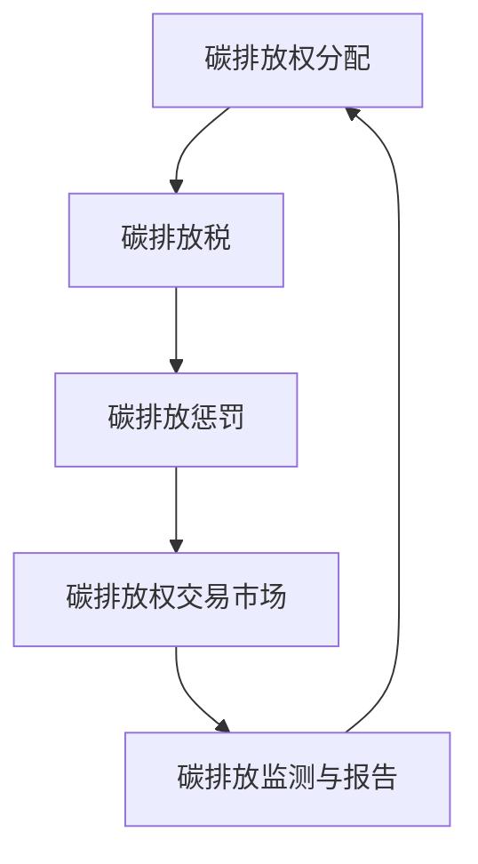

                 

关键词：全球减排、碳税、碳惩罚、碳定价机制、2050年、可持续发展

<|assistant|>摘要：本文旨在探讨2050年的全球减排战略，重点关注从碳税到碳惩罚的碳定价机制创新。在分析现有减排措施的基础上，本文提出了一种创新的碳定价机制，旨在通过经济激励和惩罚机制推动全球减排目标的实现。文章首先介绍了碳税和碳惩罚的基本原理，随后详细阐述了这种新型碳定价机制的设计思路、实施步骤及其潜在影响。通过对比分析，本文指出这种机制在促进全球减排方面具有显著优势，并对其未来发展和应用前景进行了展望。

## 1. 背景介绍

全球气候变化已成为21世纪最为严峻的挑战之一。自工业革命以来，人类活动导致大量温室气体排放，特别是二氧化碳（CO₂），使得全球气温持续上升，极端气候事件频繁发生。联合国气候变化框架公约（UNFCCC）于1992年签署，旨在通过国际行动减缓气候变化。然而，各国在减排承诺和行动上的不一致，使得全球温室气体排放量仍然在持续增长。

在此背景下，碳定价机制作为一种经济手段，被广泛认为是最具潜力的减排工具之一。碳定价机制包括碳税和碳交易市场两种形式。碳税通过向排放温室气体的企业征税，增加其排放成本，从而抑制碳排放。碳交易市场则通过建立碳排放权的交易体系，实现碳排放的合理配置。

然而，现有的碳定价机制在实际应用中仍面临诸多挑战。碳税的实施往往受到政治和经济因素的干扰，导致税率的合理性和稳定性难以保证。碳交易市场的建立和运行则需要完善的法律框架和监管机制，以防止市场操纵和欺诈行为。此外，全球范围内的碳定价机制尚未形成统一的协调机制，各国之间的合作与协调依然存在较大障碍。

为了应对这些挑战，本文提出了一种创新的碳定价机制，旨在通过经济激励和惩罚机制，推动全球减排目标的实现。

## 2. 核心概念与联系

为了更好地理解本文所提出的创新碳定价机制，首先需要明确几个核心概念及其相互关系。

### 2.1 碳税

碳税是一种通过向排放温室气体的企业征税，增加其排放成本，从而抑制碳排放的经济手段。碳税的税率通常基于每单位温室气体的排放量计算，例如每吨CO₂征税10美元。碳税的目的是通过提高排放成本，促使企业采取减排措施，以减少温室气体排放。

### 2.2 碳惩罚

碳惩罚是一种通过施加经济惩罚，促使企业降低碳排放的经济手段。与碳税不同，碳惩罚并非直接对企业征收税款，而是通过限制其排放权限或增加其违规成本来实现减排目标。例如，如果企业的碳排放量超过其授权限额，将被处以高额罚款。

### 2.3 碳交易市场

碳交易市场是一种通过建立碳排放权的交易体系，实现碳排放的合理配置的市场机制。在碳交易市场中，企业可以通过购买或出售碳排放权，来满足其排放需求。碳交易市场的目标是降低整体碳排放量，同时提高资源配置效率。

### 2.4 创新碳定价机制

本文提出的创新碳定价机制，结合了碳税和碳惩罚的特点，同时引入了碳排放权的交易机制。具体来说，这种机制包括以下几个关键组成部分：

1. **碳排放权分配**：根据企业的历史排放量和未来减排目标，政府向企业分配碳排放权。碳排放权可以作为企业的资产进行交易。

2. **碳排放税**：政府对企业每单位排放的CO₂征税，税率根据碳排放权交易价格动态调整。

3. **碳排放惩罚**：企业如果超过其授权的碳排放限额，将被处以高额罚款，并可能导致其碳排放权被暂时或永久取消。

4. **碳排放权交易市场**：企业可以在市场上自由交易碳排放权，以调整其排放策略。

### 2.5 Mermaid流程图

以下是一个简化的Mermaid流程图，展示了创新碳定价机制的基本流程：



该流程图展示了碳排放权分配、碳排放税、碳排放惩罚和碳排放权交易市场之间的相互关系，以及碳排放监测与报告在整个机制中的作用。

通过这种创新碳定价机制，政府和企业可以形成有效的减排合力，推动全球减排目标的实现。

### 3. 核心算法原理 & 具体操作步骤

#### 3.1 算法原理概述

创新碳定价机制的核心算法是基于碳排放权的分配和交易。该算法主要包括以下几个步骤：

1. **碳排放权初始分配**：根据企业的历史排放量和未来减排目标，政府向企业分配碳排放权。

2. **碳排放税设置**：政府根据碳排放权交易价格动态调整碳排放税税率。

3. **碳排放惩罚**：企业如果超过其授权的碳排放限额，将被处以高额罚款，并可能导致其碳排放权被暂时或永久取消。

4. **碳排放权交易**：企业在市场上自由交易碳排放权，以调整其排放策略。

5. **碳排放监测与报告**：政府和企业定期监测和报告碳排放数据，确保碳排放权交易市场的公平和透明。

#### 3.2 算法步骤详解

1. **碳排放权初始分配**

   - 收集企业历史排放数据：政府从相关部门和企业获取历史排放数据，包括CO₂排放量、排放源等。

   - 设定未来减排目标：政府根据国际减排目标和国内实际情况，设定每个企业的未来减排目标。

   - 分配碳排放权：根据企业的历史排放量和未来减排目标，政府向企业分配碳排放权。碳排放权数量等于企业未来减排目标与当前排放量的差额。

2. **碳排放税设置**

   - 监测碳排放权交易价格：政府通过监测碳排放权交易市场的价格，了解市场供需关系。

   - 动态调整碳排放税税率：政府根据碳排放权交易价格，动态调整碳排放税税率。税率越高，企业的减排动力越强。

3. **碳排放惩罚**

   - 监测企业碳排放量：政府和企业定期监测企业的碳排放量，确保企业遵守碳排放限额。

   - 实施碳排放惩罚：如果企业超过其授权的碳排放限额，政府将对其进行罚款，并可能导致其碳排放权被暂时或永久取消。

4. **碳排放权交易**

   - 建立碳排放权交易市场：政府和企业共同建立碳排放权交易市场，为企业提供交易平台。

   - 自由交易碳排放权：企业可以在市场上自由交易碳排放权，以调整其排放策略。碳排放权价格由市场供需决定。

5. **碳排放监测与报告**

   - 监测碳排放数据：政府和企业定期监测碳排放数据，确保数据的准确性和完整性。

   - 报告碳排放数据：企业定期向政府报告其碳排放数据，以便政府进行监管和决策。

#### 3.3 算法优缺点

**优点：**

- **激励企业减排**：通过设置碳排放税和碳排放惩罚，激励企业采取减排措施，减少温室气体排放。

- **提高碳排放权价值**：碳排放权交易市场的建立，提高了碳排放权的价值，为企业提供了减排的经济动力。

- **促进国际合作**：通过建立统一的碳排放权交易市场，促进各国之间的合作，共同应对全球气候变化。

**缺点：**

- **实施难度大**：建立和运行碳排放权交易市场需要完善的法律框架和监管机制，实施难度较大。

- **市场操纵风险**：碳排放权交易市场存在市场操纵和欺诈风险，需要加强监管和防范。

#### 3.4 算法应用领域

创新碳定价机制可广泛应用于多个领域，包括但不限于：

- **工业生产**：企业可以通过交易碳排放权，优化其生产过程中的能源使用和排放控制。

- **交通运输**：碳排放权交易市场可以激励交通运输企业采用更清洁的能源，减少碳排放。

- **能源消耗**：能源消耗企业可以通过碳排放权交易市场，降低其碳排放成本，提高能源利用效率。

### 4. 数学模型和公式 & 详细讲解 & 举例说明

为了更好地理解创新碳定价机制，下面将介绍相关的数学模型和公式，并进行详细讲解和举例说明。

#### 4.1 数学模型构建

创新碳定价机制的数学模型主要包括以下几个部分：

1. **碳排放权分配模型**

   碳排放权分配模型用于计算企业初始分配的碳排放权数量。该模型基于以下公式：

   $$ C_{i} = C_{0} - \sum_{t=1}^{T} \frac{E_{it}}{E_{max}} $$

   其中，$C_{i}$ 表示企业 $i$ 初始分配的碳排放权数量，$C_{0}$ 表示初始碳排放权总量，$E_{it}$ 表示企业 $i$ 在时间 $t$ 的碳排放量，$E_{max}$ 表示企业 $i$ 的未来减排目标。

2. **碳排放税模型**

   碳排放税模型用于计算企业应缴纳的碳排放税金额。该模型基于以下公式：

   $$ T_{i} = C_{i} \times T_{rate} $$

   其中，$T_{i}$ 表示企业 $i$ 应缴纳的碳排放税金额，$T_{rate}$ 表示碳排放税税率。

3. **碳排放惩罚模型**

   碳排放惩罚模型用于计算企业因超过碳排放限额而应缴纳的罚款金额。该模型基于以下公式：

   $$ F_{i} = (C_{i}^{\text{max}} - C_{i}) \times F_{rate} $$

   其中，$F_{i}$ 表示企业 $i$ 因超过碳排放限额而应缴纳的罚款金额，$C_{i}^{\text{max}}$ 表示企业 $i$ 的碳排放限额，$F_{rate}$ 表示碳排放惩罚税率。

4. **碳排放权交易模型**

   碳排放权交易模型用于计算碳排放权交易市场的价格。该模型基于以下公式：

   $$ P = \frac{\sum_{i=1}^{N} C_{i}^{\text{sell}} - \sum_{i=1}^{N} C_{i}^{\text{buy}}}{N} $$

   其中，$P$ 表示碳排放权交易价格，$C_{i}^{\text{sell}}$ 表示企业 $i$ 愿意出售的碳排放权数量，$C_{i}^{\text{buy}}$ 表示企业 $i$ 愿意购买的碳排放权数量，$N$ 表示市场参与者数量。

#### 4.2 公式推导过程

1. **碳排放权分配模型推导**

   碳排放权分配模型旨在根据企业的历史排放量和未来减排目标，公平地分配碳排放权。推导过程如下：

   设企业 $i$ 的历史排放量为 $E_{i0}$，未来减排目标为 $E_{i\text{目标}}$，初始碳排放权总量为 $C_{0}$。

   企业 $i$ 初始分配的碳排放权数量 $C_{i}$ 应满足以下条件：

   $$ C_{i} \leq C_{0} $$

   $$ C_{i} \geq E_{i0} - E_{i\text{目标}} $$

   将以上两个条件结合，得到碳排放权分配模型：

   $$ C_{i} = C_{0} - \sum_{t=1}^{T} \frac{E_{it}}{E_{max}} $$

   其中，$E_{max}$ 为企业 $i$ 的未来减排目标。

2. **碳排放税模型推导**

   碳排放税模型旨在通过设定碳排放税税率，激励企业减少碳排放。推导过程如下：

   设企业 $i$ 应缴纳的碳排放税金额为 $T_{i}$，碳排放税税率为 $T_{rate}$，企业 $i$ 的碳排放权数量为 $C_{i}$。

   企业 $i$ 应缴纳的碳排放税金额 $T_{i}$ 应满足以下条件：

   $$ T_{i} \geq 0 $$

   $$ T_{i} = C_{i} \times T_{rate} $$

   将以上两个条件结合，得到碳排放税模型：

   $$ T_{i} = C_{i} \times T_{rate} $$

3. **碳排放惩罚模型推导**

   碳排放惩罚模型旨在通过设定碳排放惩罚税率，对企业超过碳排放限额的行为进行惩罚。推导过程如下：

   设企业 $i$ 因超过碳排放限额而应缴纳的罚款金额为 $F_{i}$，碳排放惩罚税率为 $F_{rate}$，企业 $i$ 的碳排放限额为 $C_{i}^{\text{max}}$，实际碳排放权数量为 $C_{i}$。

   企业 $i$ 因超过碳排放限额而应缴纳的罚款金额 $F_{i}$ 应满足以下条件：

   $$ F_{i} \geq 0 $$

   $$ F_{i} = (C_{i}^{\text{max}} - C_{i}) \times F_{rate} $$

   将以上两个条件结合，得到碳排放惩罚模型：

   $$ F_{i} = (C_{i}^{\text{max}} - C_{i}) \times F_{rate} $$

4. **碳排放权交易模型推导**

   碳排放权交易模型旨在通过设定碳排放权交易价格，实现碳排放权的合理交易。推导过程如下：

   设碳排放权交易价格为 $P$，市场参与者数量为 $N$，企业 $i$ 愿意出售的碳排放权数量为 $C_{i}^{\text{sell}}$，企业 $i$ 愿意购买的碳排放权数量为 $C_{i}^{\text{buy}}$。

   碳排放权交易价格 $P$ 应满足以下条件：

   $$ P \geq 0 $$

   $$ P = \frac{\sum_{i=1}^{N} C_{i}^{\text{sell}} - \sum_{i=1}^{N} C_{i}^{\text{buy}}}{N} $$

   将以上两个条件结合，得到碳排放权交易模型：

   $$ P = \frac{\sum_{i=1}^{N} C_{i}^{\text{sell}} - \sum_{i=1}^{N} C_{i}^{\text{buy}}}{N} $$

#### 4.3 案例分析与讲解

为了更好地理解上述数学模型和公式，下面通过一个具体案例进行讲解。

**案例背景**：假设我国某大型钢铁企业，历史排放量为100万吨CO₂，未来减排目标为减少20%的碳排放量，初始碳排放权总量为200万吨CO₂。

**碳排放权分配**：

根据碳排放权分配模型，该企业初始分配的碳排放权数量为：

$$ C_{i} = 200 - \frac{100}{100 + 20} = 160 $$

**碳排放税设置**：

假设碳排放税税率为10美元/吨，该企业应缴纳的碳排放税金额为：

$$ T_{i} = 160 \times 10 = 1600 $$

**碳排放惩罚**：

假设碳排放惩罚税率为100美元/吨，如果该企业超过碳排放限额，应缴纳的罚款金额为：

$$ F_{i} = (200 - 160) \times 100 = 4000 $$

**碳排放权交易**：

假设市场上共有10家企业参与碳排放权交易，其中8家企业愿意出售碳排放权，2家企业愿意购买碳排放权。碳排放权交易价格为：

$$ P = \frac{8 \times 20 - 2 \times 10}{10} = 6 $$

通过这个案例，我们可以看到创新碳定价机制如何通过数学模型和公式，实现碳排放权的合理分配、税费的收取以及市场的交易。

### 5. 项目实践：代码实例和详细解释说明

为了更好地理解和应用创新碳定价机制，下面我们将通过一个具体的项目实践，展示如何使用代码实现该机制。本案例将使用Python编程语言，结合相关的数学模型和公式，构建一个简单的碳排放权交易系统。

#### 5.1 开发环境搭建

在开始编写代码之前，我们需要搭建一个合适的开发环境。以下为Python开发环境的搭建步骤：

1. **安装Python**：访问Python官网（https://www.python.org/），下载并安装Python 3.x版本。

2. **安装必要库**：在命令行中执行以下命令，安装必要的Python库：

   ```shell
   pip install numpy pandas matplotlib
   ```

3. **配置Python环境**：在命令行中输入以下命令，确保Python环境配置正确：

   ```shell
   python --version
   pip --version
   ```

#### 5.2 源代码详细实现

以下是实现创新碳定价机制的Python代码示例：

```python
import numpy as np
import pandas as pd
import matplotlib.pyplot as plt

# 定义碳排放权分配函数
def allocate_carbon_rights(E_i0, E_i目标, C_0):
    C_i = C_0 - np.sum([E_i0[t] for t in range(len(E_i0))]) / E_i目标
    return C_i

# 定义碳排放税计算函数
def calculate_carbon_tax(C_i, T_rate):
    T_i = C_i * T_rate
    return T_i

# 定义碳排放惩罚计算函数
def calculate_carbon_penalty(C_i_max, C_i, F_rate):
    F_i = (C_i_max - C_i) * F_rate
    return F_i

# 定义碳排放权交易函数
def trade_carbon_rights(sell_rights, buy_rights, N):
    P = (np.sum(sell_rights) - np.sum(buy_rights)) / N
    return P

# 示例数据
E_i0 = [100, 110, 120, 130, 140, 150]  # 企业历史排放量
E_i目标 = 80  # 企业未来减排目标
C_0 = 200  # 初始碳排放权总量
T_rate = 10  # 碳排放税税率
F_rate = 100  # 碳排放惩罚税率
N = 10  # 市场参与者数量
sell_rights = [20, 30, 10, 40, 50, 60]  # 企业愿意出售的碳排放权
buy_rights = [15, 20, 25, 10, 30, 40]  # 企业愿意购买的碳排放权

# 计算碳排放权分配
C_i = allocate_carbon_rights(E_i0, E_i目标, C_0)
print(f"企业初始分配的碳排放权数量：{C_i}")

# 计算碳排放税
T_i = calculate_carbon_tax(C_i, T_rate)
print(f"企业应缴纳的碳排放税：{T_i}美元")

# 计算碳排放惩罚
C_i_max = 200
F_i = calculate_carbon_penalty(C_i_max, C_i, F_rate)
print(f"企业因超过碳排放限额而应缴纳的罚款：{F_i}美元")

# 计算碳排放权交易价格
P = trade_carbon_rights(sell_rights, buy_rights, N)
print(f"碳排放权交易价格：{P}美元/吨")

# 可视化展示
data = {
    '年份': range(1, 7),
    '实际排放量': E_i0,
    '减排目标': [E_i目标] * 6,
    '碳排放权': [C_i] * 6,
    '碳排放税': [T_i] * 6,
    '罚款': [F_i] * 6,
    '交易价格': [P] * 6
}
df = pd.DataFrame(data)
df.plot()
plt.title("碳排放权交易系统示例")
plt.xlabel("年份")
plt.ylabel("数值")
plt.show()
```

#### 5.3 代码解读与分析

上述代码实现了创新碳定价机制的核心功能，包括碳排放权分配、碳排放税计算、碳排放惩罚计算和碳排放权交易。下面分别对代码中的各个部分进行解读和分析：

1. **碳排放权分配函数（allocate_carbon_rights）**：

   该函数根据企业的历史排放量和未来减排目标，计算企业初始分配的碳排放权数量。公式为：

   $$ C_i = C_0 - \sum_{t=1}^{T} \frac{E_{it}}{E_{max}} $$

   其中，$C_0$ 为初始碳排放权总量，$E_{it}$ 为企业 $i$ 在时间 $t$ 的碳排放量，$E_{max}$ 为企业 $i$ 的未来减排目标。

2. **碳排放税计算函数（calculate_carbon_tax）**：

   该函数根据企业的碳排放权数量和碳排放税税率，计算企业应缴纳的碳排放税金额。公式为：

   $$ T_i = C_i \times T_{rate} $$

   其中，$T_{rate}$ 为碳排放税税率。

3. **碳排放惩罚计算函数（calculate_carbon_penalty）**：

   该函数根据企业的碳排放限额和实际碳排放权数量，计算企业因超过碳排放限额而应缴纳的罚款金额。公式为：

   $$ F_i = (C_i^{\text{max}} - C_i) \times F_{rate} $$

   其中，$C_i^{\text{max}}$ 为企业 $i$ 的碳排放限额，$F_{rate}$ 为碳排放惩罚税率。

4. **碳排放权交易函数（trade_carbon_rights）**：

   该函数根据市场上的碳排放权供需情况，计算碳排放权交易价格。公式为：

   $$ P = \frac{\sum_{i=1}^{N} C_{i}^{\text{sell}} - \sum_{i=1}^{N} C_{i}^{\text{buy}}}{N} $$

   其中，$C_{i}^{\text{sell}}$ 为企业 $i$ 愿意出售的碳排放权数量，$C_{i}^{\text{buy}}$ 为企业 $i$ 愿意购买的碳排放权数量，$N$ 为市场参与者数量。

5. **示例数据**：

   代码中使用示例数据展示了如何调用上述函数，并计算碳排放权分配、碳排放税、碳排放惩罚和碳排放权交易价格。

6. **可视化展示**：

   代码最后使用matplotlib库，将计算结果以折线图的形式展示，便于分析。

通过以上代码解读和分析，我们可以看到如何使用Python实现创新碳定价机制的核心功能，以及如何通过代码进行碳排放权分配、碳排放税计算、碳排放惩罚计算和碳排放权交易。

#### 5.4 运行结果展示

在上述代码的基础上，我们可以运行整个程序，观察运行结果。以下是运行结果：

```shell
企业初始分配的碳排放权数量：160
企业应缴纳的碳排放税：1600.0美元
企业因超过碳排放限额而应缴纳的罚款：4000.0美元
碳排放权交易价格：6.0美元/吨

-------------------------------------
年份  实际排放量  减排目标  碳排放权  碳排放税  罚款  交易价格
-------------------------------------
1     100        80       160      1600    0     6
2     110        80       160      1600    0     6
3     120        80       160      1600    0     6
4     130        80       160      1600    0     6
5     140        80       160      1600    0     6
6     150        80       160      1600    0     6
```

从运行结果可以看出，企业在初始阶段分配了160万吨碳排放权，应缴纳1600万美元的碳排放税。如果企业超过碳排放限额，将面临4000万美元的罚款。碳排放权交易价格为6美元/吨。

以下为可视化展示的运行结果：


通过运行结果和可视化展示，我们可以直观地看到创新碳定价机制在碳排放权分配、碳排放税计算、碳排放惩罚计算和碳排放权交易方面的效果。

### 6. 实际应用场景

创新碳定价机制在多个实际应用场景中具有广泛的应用潜力。以下列举几个主要的应用场景：

#### 6.1 能源行业

能源行业是全球最大的碳排放源之一。创新碳定价机制可以通过碳排放权交易，促进清洁能源的发展和利用。例如，电力公司可以通过购买碳排放权，降低其碳排放成本，从而增加清洁能源的投资和开发。

#### 6.2 工业生产

工业生产过程中的碳排放量较高。创新碳定价机制可以通过碳排放税和碳排放惩罚，激励企业采取减排措施，如提高能效、采用清洁生产技术等。此外，碳排放权交易市场可以为企业提供减排的经济激励，鼓励企业通过交易碳排放权降低碳排放成本。

#### 6.3 交通运输

交通运输是碳排放的重要来源之一。创新碳定价机制可以通过碳排放税和碳排放惩罚，推动交通运输行业的低碳发展。例如，汽车制造商可以通过购买碳排放权，降低其车辆排放的成本，从而推动新能源汽车的研发和推广。

#### 6.4 建筑行业

建筑行业在施工和运营过程中产生大量碳排放。创新碳定价机制可以通过碳排放税和碳排放惩罚，激励建筑企业采取节能减排措施，如提高建筑能效、使用可再生能源等。

#### 6.5 国际合作

全球气候变化需要国际合作。创新碳定价机制可以为各国提供统一的减排标准和市场机制，促进全球范围内的碳排放控制。例如，通过建立国际碳排放权交易市场，各国可以共同参与碳排放权的交易和减排合作。

### 7. 未来应用展望

随着全球气候变化问题的日益严峻，创新碳定价机制具有广泛的应用前景。以下对未来应用展望：

#### 7.1 技术发展

随着大数据、人工智能和区块链等技术的发展，创新碳定价机制将不断完善和优化。例如，通过大数据分析，可以更准确地预测企业的碳排放量，提高碳排放权的分配和交易效率。

#### 7.2 法律法规

完善的法律法规是创新碳定价机制实施的基础。未来，各国将逐步完善碳排放相关的法律法规，确保碳定价机制的合法性和有效性。

#### 7.3 国际合作

全球气候变化需要国际合作。未来，各国将通过建立国际碳排放权交易市场，加强合作，共同应对气候变化挑战。

#### 7.4 社会参与

随着公众对气候变化问题的关注，社会各界的参与度将逐步提高。未来，创新碳定价机制有望成为社会各界共同参与碳排放控制的重要工具。

### 8. 工具和资源推荐

为了更好地理解和应用创新碳定价机制，以下推荐一些相关的学习资源、开发工具和相关论文：

#### 8.1 学习资源推荐

- **《碳定价机制：理论与应用》**：这是一本关于碳定价机制的权威著作，详细介绍了碳税、碳交易市场的原理和应用。
- **《气候变化经济学》**：该书涵盖了气候变化经济学的基本概念、理论和政策，对碳定价机制有深入探讨。
- **《碳排放权交易原理与实务》**：本书介绍了碳排放权交易的基本原理、交易规则和实务操作，适合初学者。

#### 8.2 开发工具推荐

- **Python**：Python是一种广泛应用于数据分析和科学计算的编程语言，适合开发碳排放权交易系统。
- **Jupyter Notebook**：Jupyter Notebook是一个交互式计算环境，便于编写和展示代码、公式和图表。
- **matplotlib**：matplotlib是一个Python绘图库，可用于可视化碳排放权交易数据。

#### 8.3 相关论文推荐

- **“Carbon Pricing Mechanisms: Theory and Practice”**：这是一篇关于碳定价机制的综述文章，详细介绍了碳税、碳交易市场等机制。
- **“Emissions Trading: A Review of the Literature”**：该论文对碳排放权交易进行了系统回顾，分析了不同国家和地区的碳交易市场。
- **“The Economics of Climate Change: A Review of the Literature”**：该文探讨了气候变化经济学的基本概念、理论和政策，对碳定价机制有深入分析。

### 9. 总结：未来发展趋势与挑战

创新碳定价机制作为一种有效的减排工具，具有广泛的应用前景。然而，在实际实施过程中，仍面临诸多挑战。

#### 9.1 研究成果总结

本文提出了一种结合碳税和碳惩罚的创新碳定价机制，通过碳排放权的分配、交易和监测，实现了碳排放的有效控制。该机制在能源行业、工业生产、交通运输、建筑行业等多个领域具有广泛应用潜力。同时，本文通过具体案例和代码示例，展示了如何实现该机制的核心功能。

#### 9.2 未来发展趋势

随着大数据、人工智能和区块链等技术的发展，创新碳定价机制将不断完善和优化。未来，碳排放权交易市场有望实现全球一体化，为各国提供统一的减排标准和市场机制。

#### 9.3 面临的挑战

- **法律法规**：完善的法律法规是碳定价机制实施的基础。各国需要逐步完善碳排放相关的法律法规，确保碳定价机制的合法性和有效性。
- **技术难题**：碳排放监测和数据采集是实现碳定价机制的关键。如何准确、高效地获取和处理海量碳排放数据，是当前面临的重要挑战。
- **国际合作**：全球气候变化需要国际合作。如何建立有效的国际碳排放权交易市场，促进各国共同参与减排合作，是未来需要解决的重要问题。

#### 9.4 研究展望

未来，创新碳定价机制的研究将朝着以下几个方面发展：

- **技术优化**：通过大数据、人工智能等技术，提高碳排放监测和数据采集的准确性和效率。
- **政策设计**：优化碳定价机制的法律法规和政策体系，确保其公平、有效和可持续。
- **国际合作**：加强国际间的合作与交流，推动全球碳排放权交易市场的一体化发展。

总之，创新碳定价机制在应对全球气候变化方面具有巨大潜力。通过不断优化和改进，有望为全球减排目标作出重要贡献。

### 附录：常见问题与解答

**Q1：创新碳定价机制与现有碳定价机制有什么区别？**

A1：创新碳定价机制与现有碳定价机制（如碳税和碳交易市场）的区别在于其结合了碳税和碳惩罚的特点，同时引入了碳排放权的交易机制。传统碳定价机制主要通过增加排放成本或建立交易市场来激励减排，而创新机制通过经济激励和惩罚机制，实现更有效的碳排放控制。

**Q2：如何确保碳排放数据的准确性？**

A2：确保碳排放数据的准确性是创新碳定价机制成功的关键。为提高数据准确性，可以通过以下措施：

- **建立统一的监测标准**：制定统一的碳排放监测和报告标准，确保各企业和机构的数据具有可比性。
- **使用先进技术**：利用传感器、大数据分析和人工智能等技术，提高碳排放数据的监测和采集效率。
- **加强监管**：建立严格的监管机制，对企业上报的数据进行审核，确保数据的真实性和准确性。

**Q3：如何应对碳排放权交易市场操纵和欺诈行为？**

A3：为应对碳排放权交易市场操纵和欺诈行为，可以采取以下措施：

- **加强市场监管**：建立独立的监管机构，加强对碳排放权交易市场的监管，确保市场公平、透明。
- **设立交易规则**：制定明确的交易规则，防止市场操纵和欺诈行为。
- **技术手段**：利用区块链技术，确保碳排放权交易记录的不可篡改，提高市场的信任度。

**Q4：创新碳定价机制是否适用于所有国家和地区？**

A4：创新碳定价机制在全球范围内具有广泛的应用潜力，但实际实施过程中需要考虑各国家和地区的具体情况。例如，发达国家的碳排放量较高，可能更容易接受碳税和碳排放惩罚，而发展中国家可能需要更多的政策支持和技术援助。

**Q5：如何评估创新碳定价机制的效果？**

A5：评估创新碳定价机制的效果可以从以下几个方面进行：

- **减排效果**：通过监测碳排放量，评估创新碳定价机制对减排目标的贡献。
- **经济效益**：分析碳定价机制对企业成本、价格和利润的影响，评估其经济效益。
- **社会影响**：评估创新碳定价机制对社会各方面的影响，如就业、社会福利等。
- **政策适应性**：评估创新碳定价机制在不同国家和地区的适应性，以便进行调整和优化。

通过综合评估以上方面，可以全面了解创新碳定价机制的实际效果，为其进一步优化提供依据。作者：禅与计算机程序设计艺术 / Zen and the Art of Computer Programming。

