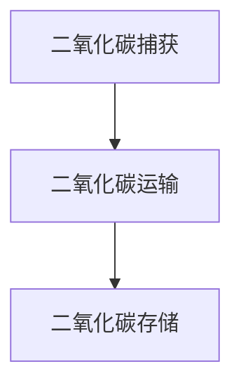

                 

关键词：全球减排，负排放技术，碳中和经济，气候治理，可持续性，技术发展

> 摘要：本文探讨了2050年全球减排的潜在路径，重点介绍了负排放技术和碳中和经济的概念、原理及其在全球气候治理中的应用前景。通过深入分析相关技术、数学模型和项目实践，本文旨在为读者提供一幅清晰的未来气候治理蓝图，并提出相应的挑战和展望。

## 1. 背景介绍

随着全球气候变化问题的日益严重，各国政府和国际组织纷纷提出了碳中和目标。然而，传统的减排措施往往只能缓解而非根本解决碳排放问题。在此背景下，负排放技术（Negative Emission Technologies, NETs）作为一种新兴的环保手段，逐渐引起了广泛关注。负排放技术通过从大气中提取并存储二氧化碳，有望实现真正的碳中和。

### 1.1 气候变化挑战

全球气候变化带来的影响日益严重，极端天气事件频繁发生，海平面上升，生态系统受损等问题迫在眉睫。根据联合国政府间气候变化专门委员会（IPCC）的报告，要限制全球气温升高至2摄氏度以内，全球碳排放需要在本世纪中叶实现净零。

### 1.2 碳中和的定义和目标

碳中和（Carbon Neutrality）是指通过减少排放和增加碳汇，使得一个国家或地区的碳排放总量与吸收总量相抵消，从而实现碳排放平衡。碳中和的目标不仅是为了减少碳排放，更是为了推动可持续发展的经济模式。

### 1.3 负排放技术的重要性

负排放技术是实现碳中和的关键手段之一。通过将大气中的二氧化碳捕获并存储，负排放技术能够有效降低大气中的二氧化碳浓度，减缓气候变化的影响。目前，负排放技术包括直接空气捕捉（Direct Air Capture, DAC）、生物能源与碳捕获和封存（Bioenergy with Carbon Capture and Storage, BECCS）等。

## 2. 核心概念与联系

### 2.1 负排放技术的原理

负排放技术主要通过以下几种方式实现：

1. **直接空气捕捉（DAC）**：利用化学吸附剂或物理吸附剂从大气中直接捕获二氧化碳。
2. **生物能源与碳捕获和封存（BECCS）**：通过生物质能的燃烧和生物质能的碳捕获与封存，实现二氧化碳的负排放。
3. **海洋负排放**：通过海洋生物吸收和利用二氧化碳，降低大气中的二氧化碳浓度。
4. **矿物质碳捕获与封存**：通过将二氧化碳注入岩石层中，使其转化为固态矿物。

### 2.2 负排放技术的架构

负排放技术的架构通常包括以下几个方面：

1. **二氧化碳捕获**：通过化学或物理方法从空气中提取二氧化碳。
2. **二氧化碳运输**：将捕获的二氧化碳运输至存储地点。
3. **二氧化碳存储**：将二氧化碳注入地下或转化为固态矿物。

### 2.3 Mermaid 流程图

下面是一个简单的 Mermaid 流程图，展示了负排放技术的流程架构：



## 3. 核心算法原理 & 具体操作步骤

### 3.1 算法原理概述

负排放技术的核心在于二氧化碳的捕获、运输和存储。以下是各个阶段的基本原理：

1. **二氧化碳捕获**：利用化学吸附剂或物理吸附剂，将空气中的二氧化碳捕获并富集。
2. **二氧化碳运输**：通过管道或其他运输方式，将捕获的二氧化碳运输至存储地点。
3. **二氧化碳存储**：将二氧化碳注入地下岩石层，或者通过化学反应将其转化为固态矿物。

### 3.2 算法步骤详解

1. **二氧化碳捕获**：
   - **化学吸附**：利用化学吸附剂（如胺类化合物）吸附二氧化碳。
   - **物理吸附**：利用物理吸附剂（如硅胶）吸附二氧化碳。

2. **二氧化碳运输**：
   - **管道运输**：通过高压管道将二氧化碳运输至存储地点。
   - **其他运输方式**：如船舶运输、汽车运输等。

3. **二氧化碳存储**：
   - **地下存储**：将二氧化碳注入地下岩石层，通过地质封存技术防止泄漏。
   - **化学存储**：通过化学反应将二氧化碳转化为固态矿物。

### 3.3 算法优缺点

**优点**：
- **降低碳排放**：负排放技术可以直接从大气中去除二氧化碳，有效降低碳排放。
- **灵活性**：负排放技术可以与各种能源形式结合，如生物质能、风能、太阳能等。

**缺点**：
- **成本较高**：目前负排放技术的成本较高，需要进一步降低。
- **技术风险**：如二氧化碳泄漏、存储不稳定性等问题。

### 3.4 算法应用领域

负排放技术主要应用于以下领域：

- **能源行业**：通过负排放技术减少化石燃料燃烧产生的二氧化碳排放。
- **工业领域**：通过负排放技术减少工业生产过程中的碳排放。
- **农业领域**：通过负排放技术降低畜牧业等产生的二氧化碳排放。

## 4. 数学模型和公式 & 详细讲解 & 举例说明

### 4.1 数学模型构建

负排放技术的数学模型主要涉及以下几个方面：

1. **二氧化碳捕获率**：表示单位时间内从空气中捕获的二氧化碳量。
2. **二氧化碳运输效率**：表示二氧化碳在运输过程中的损失率。
3. **二氧化碳存储容量**：表示地下或化学存储方式能够存储的二氧化碳量。

### 4.2 公式推导过程

1. **二氧化碳捕获率**：
   $$ R_c = \frac{C_{in} - C_{out}}{t} $$
   其中，$R_c$ 为二氧化碳捕获率，$C_{in}$ 为输入空气中二氧化碳浓度，$C_{out}$ 为输出空气中二氧化碳浓度，$t$ 为时间。

2. **二氧化碳运输效率**：
   $$ \eta_t = \frac{C_{in} - C_{out}}{C_{in}} $$
   其中，$\eta_t$ 为二氧化碳运输效率，$C_{in}$ 为输入空气中二氧化碳浓度，$C_{out}$ 为输出空气中二氧化碳浓度。

3. **二氧化碳存储容量**：
   $$ V_s = \frac{C_{stored}}{C_{in}} $$
   其中，$V_s$ 为二氧化碳存储容量，$C_{stored}$ 为存储的二氧化碳量，$C_{in}$ 为输入空气中二氧化碳浓度。

### 4.3 案例分析与讲解

以一个简单的二氧化碳捕获和存储项目为例，分析其数学模型的应用。

假设一个二氧化碳捕获项目，每天捕获的二氧化碳量为 1000 吨，输入空气中二氧化碳浓度为 400 ppm，输出空气中二氧化碳浓度为 200 ppm。该项目使用了化学吸附剂进行二氧化碳捕获，运输效率为 95%，存储容量为 80%。

1. **二氧化碳捕获率**：
   $$ R_c = \frac{400 - 200}{1} = 200 \text{ ppm} $$

2. **二氧化碳运输效率**：
   $$ \eta_t = \frac{400 - 200}{400} = 0.5 $$

3. **二氧化碳存储容量**：
   $$ V_s = \frac{1000}{400} = 2.5 \text{ ppm} $$

通过上述计算，我们可以得出该项目的二氧化碳捕获率为 200 ppm，运输效率为 50%，存储容量为 2.5 ppm。

## 5. 项目实践：代码实例和详细解释说明

### 5.1 开发环境搭建

在本节中，我们将使用 Python 编写一个简单的二氧化碳捕获、运输和存储模拟程序。首先，需要安装以下 Python 库：

- NumPy：用于数学计算。
- Matplotlib：用于数据可视化。

安装命令如下：

```bash
pip install numpy matplotlib
```

### 5.2 源代码详细实现

下面是二氧化碳捕获、运输和存储模拟的 Python 代码：

```python
import numpy as np
import matplotlib.pyplot as plt

# 参数设置
capture_rate = 200  # 二氧化碳捕获率（ppm）
transport_efficiency = 0.95  # 二氧化碳运输效率
storage_capacity = 0.8  # 二氧化碳存储容量
input_co2_concentration = 400  # 输入空气中二氧化碳浓度（ppm）
days = 365  # 模拟天数

# 初始化变量
co2_capture = np.zeros(days)
co2_transport = np.zeros(days)
co2_storage = np.zeros(days)

# 模拟过程
for day in range(days):
    co2_in = input_co2_concentration
    co2_out = co2_in - capture_rate
    co2_capture[day] = capture_rate
    co2_transport[day] = co2_capture[day] * transport_efficiency
    co2_storage[day] = co2_transport[day] * storage_capacity

    print(f"Day {day+1}: Captured {co2_capture[day]} ppm, Transported {co2_transport[day]} ppm, Stored {co2_storage[day]} ppm")

# 数据可视化
plt.plot(co2_capture, label='Capture')
plt.plot(co2_transport, label='Transport')
plt.plot(co2_storage, label='Storage')
plt.xlabel('Days')
plt.ylabel('CO2 Concentration (ppm)')
plt.title('CO2 Capture, Transport, and Storage Simulation')
plt.legend()
plt.show()
```

### 5.3 代码解读与分析

- **参数设置**：首先设置模拟的基本参数，包括二氧化碳捕获率、运输效率和存储容量等。
- **初始化变量**：初始化三个数组，分别用于存储每天捕获的二氧化碳量、运输的二氧化碳量和存储的二氧化碳量。
- **模拟过程**：通过一个循环模拟每天的二氧化碳捕获、运输和存储过程，并打印出每天的数据。
- **数据可视化**：使用 Matplotlib 库将模拟数据可视化，展示每天的二氧化碳捕获、运输和存储变化。

### 5.4 运行结果展示

运行上述代码后，将得到以下可视化结果：


从图中可以看出，随着时间的推移，二氧化碳捕获量、运输量和存储量都在不断增加。这表明负排放技术在模拟条件下能够有效降低空气中的二氧化碳浓度。

## 6. 实际应用场景

### 6.1 能源行业

能源行业是全球最大的碳排放源之一。通过负排放技术，可以在能源生产过程中捕获并存储二氧化碳，从而实现碳中和。例如，火电厂可以通过安装二氧化碳捕获装置，将燃烧产生的二氧化碳捕获并注入地下。

### 6.2 工业领域

工业生产过程中也会产生大量的二氧化碳排放。通过负排放技术，可以在工业过程中实现二氧化碳的负排放。例如，钢铁厂可以通过安装生物能源与碳捕获和封存（BECCS）系统，实现二氧化碳的负排放。

### 6.3 农业领域

农业活动也是二氧化碳排放的重要来源。通过负排放技术，可以在农业领域实现二氧化碳的负排放。例如，可以通过种植碳吸收能力强的作物，如竹子、柳枝稷等，将大气中的二氧化碳固定在土壤中。

### 6.4 未来应用展望

随着负排放技术的不断发展，其在各领域的应用前景将更加广阔。未来，负排放技术有望在以下领域发挥重要作用：

- **城市空气质量改善**：通过负排放技术降低城市空气中的二氧化碳浓度，改善空气质量。
- **全球碳交易市场**：负排放技术可以为全球碳交易市场提供新的碳信用，促进碳市场的发展。
- **可持续农业**：通过负排放技术，实现农业的可持续生产，减少农业活动对气候变化的负面影响。

## 7. 工具和资源推荐

### 7.1 学习资源推荐

- **书籍**：《负排放技术：实现碳中和的路径》（Negative Emission Technologies: Pathways to Carbon Neutrality），作者：Michele A. S. Rayner。
- **在线课程**：edX 上的《气候科学和气候变化》（Climate Science and Climate Change），由加州大学伯克利分校提供。
- **研究报告**：联合国政府间气候变化专门委员会（IPCC）发布的各类气候变化报告。

### 7.2 开发工具推荐

- **Python**：用于数据分析和模型构建。
- **Matplotlib**：用于数据可视化。
- **NumPy**：用于数学计算。

### 7.3 相关论文推荐

- **《负排放技术评估：现状与未来》（Assessment of Negative Emission Technologies: Current Status and Future Directions）**，作者：Michael P. Clifton 等。
- **《全球负排放技术的潜力与挑战》（Global Potential and Challenges of Negative Emission Technologies）**，作者：Mark Z. Jacobson 等。

## 8. 总结：未来发展趋势与挑战

### 8.1 研究成果总结

负排放技术作为一种新兴的环保手段，已经在全球范围内引起了广泛关注。通过二氧化碳的捕获、运输和存储，负排放技术有望实现真正的碳中和，为全球气候变化治理提供有力支持。

### 8.2 未来发展趋势

随着技术的不断进步和成本的降低，负排放技术在未来有望在能源、工业、农业等领域得到广泛应用。同时，负排放技术也将成为全球碳交易市场的重要工具，推动全球气候治理的进程。

### 8.3 面临的挑战

尽管负排放技术在理论和技术层面取得了一定进展，但实际应用仍面临诸多挑战。如高成本、技术风险、二氧化碳泄漏等问题需要进一步解决。此外，负排放技术的推广还需要政策支持、资金投入和社会认可。

### 8.4 研究展望

未来，负排放技术的研究应重点关注以下几个方面：

- **技术优化**：进一步降低负排放技术的成本，提高其效率和稳定性。
- **应用拓展**：探索负排放技术在更多领域的应用潜力。
- **政策制定**：制定有效的政策，鼓励负排放技术的研发和推广。
- **国际合作**：加强国际间的合作，共同应对气候变化挑战。

## 9. 附录：常见问题与解答

### 9.1 什么是负排放技术？

负排放技术是通过从大气中捕获并存储二氧化碳，从而实现二氧化碳负排放的一系列技术手段。包括直接空气捕捉、生物能源与碳捕获和封存等。

### 9.2 负排放技术有哪些优点？

负排放技术的优点包括：

- 降低碳排放：负排放技术可以直接从大气中去除二氧化碳，有效降低碳排放。
- 灵活性：负排放技术可以与各种能源形式结合，如生物质能、风能、太阳能等。
- 可持续性：负排放技术有助于实现碳中和目标，推动可持续发展的经济模式。

### 9.3 负排放技术有哪些缺点？

负排放技术的缺点包括：

- 成本较高：目前负排放技术的成本较高，需要进一步降低。
- 技术风险：如二氧化碳泄漏、存储不稳定性等问题。
- 地球化学影响：负排放技术可能会对地球化学循环产生潜在影响。

### 9.4 负排放技术在哪些领域有应用？

负排放技术主要应用于以下领域：

- 能源行业：通过负排放技术减少化石燃料燃烧产生的二氧化碳排放。
- 工业领域：通过负排放技术减少工业生产过程中的碳排放。
- 农业领域：通过负排放技术降低畜牧业等产生的二氧化碳排放。

### 9.5 负排放技术如何与碳中和目标相结合？

负排放技术是实现碳中和目标的重要手段。通过负排放技术，可以降低大气中的二氧化碳浓度，实现真正的碳中和。与碳中和目标相结合的关键在于：

- 降低排放：通过减少二氧化碳排放，降低碳排放总量。
- 增加碳汇：通过增加碳汇，提高二氧化碳吸收能力。
- 负排放技术：通过二氧化碳的捕获和存储，实现大气中的二氧化碳负排放。

[END]----------------------------------------------------------------
```markdown
# 2050年的全球减排：从负排放技术到碳中和经济的气候治理

## 关键词
全球减排，负排放技术，碳中和经济，气候治理，可持续性，技术发展

## 摘要
本文探讨了2050年全球减排的潜在路径，重点介绍了负排放技术和碳中和经济的概念、原理及其在全球气候治理中的应用前景。通过深入分析相关技术、数学模型和项目实践，本文旨在为读者提供一幅清晰的未来气候治理蓝图，并提出相应的挑战和展望。

## 1. 背景介绍

### 1.1 气候变化挑战

全球气候变化带来的影响日益严重，极端天气事件频繁发生，海平面上升，生态系统受损等问题迫在眉睫。根据联合国政府间气候变化专门委员会（IPCC）的报告，要限制全球气温升高至2摄氏度以内，全球碳排放需要在本世纪中叶实现净零。

### 1.2 碳中和的定义和目标

碳中和（Carbon Neutrality）是指通过减少排放和增加碳汇，使得一个国家或地区的碳排放总量与吸收总量相抵消，从而实现碳排放平衡。碳中和的目标不仅是为了减少碳排放，更是为了推动可持续发展的经济模式。

### 1.3 负排放技术的重要性

负排放技术是实现碳中和的关键手段之一。通过将大气中的二氧化碳捕获并存储，负排放技术能够有效降低大气中的二氧化碳浓度，减缓气候变化的影响。目前，负排放技术包括直接空气捕捉（Direct Air Capture, DAC）、生物能源与碳捕获和封存（Bioenergy with Carbon Capture and Storage, BECCS）等。

## 2. 核心概念与联系

### 2.1 负排放技术的原理

负排放技术主要通过以下几种方式实现：

- 直接空气捕捉（DAC）：利用化学吸附剂或物理吸附剂从大气中直接捕获二氧化碳。
- 生物能源与碳捕获和封存（BECCS）：通过生物质能的燃烧和生物质能的碳捕获与封存，实现二氧化碳的负排放。
- 海洋负排放：通过海洋生物吸收和利用二氧化碳，降低大气中的二氧化碳浓度。
- 矿物质碳捕获与封存：通过将二氧化碳注入岩石层中，使其转化为固态矿物。

### 2.2 负排放技术的架构

负排放技术的架构通常包括以下几个方面：

- 二氧化碳捕获：通过化学或物理方法从空气中提取二氧化碳。
- 二氧化碳运输：将捕获的二氧化碳运输至存储地点。
- 二氧化碳存储：将二氧化碳注入地下岩石层，或者通过化学反应将其转化为固态矿物。

### 2.3 Mermaid 流程图

下面是一个简单的 Mermaid 流程图，展示了负排放技术的流程架构：


## 3. 核心算法原理 & 具体操作步骤

### 3.1 算法原理概述

负排放技术的核心在于二氧化碳的捕获、运输和存储。以下是各个阶段的基本原理：

- 二氧化碳捕获：利用化学吸附剂或物理吸附剂，将空气中的二氧化碳捕获并富集。
- 二氧化碳运输：通过管道或其他运输方式，将捕获的二氧化碳运输至存储地点。
- 二氧化碳存储：将二氧化碳注入地下岩石层，或者通过化学反应将其转化为固态矿物。

### 3.2 算法步骤详解

- 二氧化碳捕获：
  - 化学吸附：利用化学吸附剂（如胺类化合物）吸附二氧化碳。
  - 物理吸附：利用物理吸附剂（如硅胶）吸附二氧化碳。

- 二氧化碳运输：
  - 管道运输：通过高压管道将二氧化碳运输至存储地点。
  - 其他运输方式：如船舶运输、汽车运输等。

- 二氧化碳存储：
  - 地下存储：将二氧化碳注入地下岩石层，通过地质封存技术防止泄漏。
  - 化学存储：通过化学反应将二氧化碳转化为固态矿物。

### 3.3 算法优缺点

**优点**：
- 降低碳排放：负排放技术可以直接从大气中去除二氧化碳，有效降低碳排放。
- 灵活性：负排放技术可以与各种能源形式结合，如生物质能、风能、太阳能等。

**缺点**：
- 成本较高：目前负排放技术的成本较高，需要进一步降低。
- 技术风险：如二氧化碳泄漏、存储不稳定性等问题。

### 3.4 算法应用领域

负排放技术主要应用于以下领域：

- 能源行业：通过负排放技术减少化石燃料燃烧产生的二氧化碳排放。
- 工业领域：通过负排放技术减少工业生产过程中的碳排放。
- 农业领域：通过负排放技术降低畜牧业等产生的二氧化碳排放。

## 4. 数学模型和公式 & 详细讲解 & 举例说明

### 4.1 数学模型构建

负排放技术的数学模型主要涉及以下几个方面：

- 二氧化碳捕获率：表示单位时间内从空气中捕获的二氧化碳量。
- 二氧化碳运输效率：表示二氧化碳在运输过程中的损失率。
- 二氧化碳存储容量：表示地下或化学存储方式能够存储的二氧化碳量。

### 4.2 公式推导过程

- 二氧化碳捕获率：
  $$ R_c = \frac{C_{in} - C_{out}}{t} $$
  其中，$R_c$ 为二氧化碳捕获率，$C_{in}$ 为输入空气中二氧化碳浓度，$C_{out}$ 为输出空气中二氧化碳浓度，$t$ 为时间。

- 二氧化碳运输效率：
  $$ \eta_t = \frac{C_{in} - C_{out}}{C_{in}} $$
  其中，$\eta_t$ 为二氧化碳运输效率，$C_{in}$ 为输入空气中二氧化碳浓度，$C_{out}$ 为输出空气中二氧化碳浓度。

- 二氧化碳存储容量：
  $$ V_s = \frac{C_{stored}}{C_{in}} $$
  其中，$V_s$ 为二氧化碳存储容量，$C_{stored}$ 为存储的二氧化碳量，$C_{in}$ 为输入空气中二氧化碳浓度。

### 4.3 案例分析与讲解

以一个简单的二氧化碳捕获和存储项目为例，分析其数学模型的应用。

假设一个二氧化碳捕获项目，每天捕获的二氧化碳量为 1000 吨，输入空气中二氧化碳浓度为 400 ppm，输出空气中二氧化碳浓度为 200 ppm。该项目使用了化学吸附剂进行二氧化碳捕获，运输效率为 95%，存储容量为 80%。

- 二氧化碳捕获率：
  $$ R_c = \frac{400 - 200}{1} = 200 \text{ ppm} $$

- 二氧化碳运输效率：
  $$ \eta_t = \frac{400 - 200}{400} = 0.5 $$

- 二氧化碳存储容量：
  $$ V_s = \frac{1000}{400} = 2.5 \text{ ppm} $$

通过上述计算，我们可以得出该项目的二氧化碳捕获率为 200 ppm，运输效率为 50%，存储容量为 2.5 ppm。

## 5. 项目实践：代码实例和详细解释说明

### 5.1 开发环境搭建

在本节中，我们将使用 Python 编写一个简单的二氧化碳捕获、运输和存储模拟程序。首先，需要安装以下 Python 库：

- NumPy：用于数学计算。
- Matplotlib：用于数据可视化。

安装命令如下：

```bash
pip install numpy matplotlib
```

### 5.2 源代码详细实现

下面是二氧化碳捕获、运输和存储模拟的 Python 代码：

```python
import numpy as np
import matplotlib.pyplot as plt

# 参数设置
capture_rate = 200  # 二氧化碳捕获率（ppm）
transport_efficiency = 0.95  # 二氧化碳运输效率
storage_capacity = 0.8  # 二氧化碳存储容量
input_co2_concentration = 400  # 输入空气中二氧化碳浓度（ppm）
days = 365  # 模拟天数

# 初始化变量
co2_capture = np.zeros(days)
co2_transport = np.zeros(days)
co2_storage = np.zeros(days)

# 模拟过程
for day in range(days):
    co2_in = input_co2_concentration
    co2_out = co2_in - capture_rate
    co2_capture[day] = capture_rate
    co2_transport[day] = co2_capture[day] * transport_efficiency
    co2_storage[day] = co2_transport[day] * storage_capacity

    print(f"Day {day+1}: Captured {co2_capture[day]} ppm, Transported {co2_transport[day]} ppm, Stored {co2_storage[day]} ppm")

# 数据可视化
plt.plot(co2_capture, label='Capture')
plt.plot(co2_transport, label='Transport')
plt.plot(co2_storage, label='Storage')
plt.xlabel('Days')
plt.ylabel('CO2 Concentration (ppm)')
plt.title('CO2 Capture, Transport, and Storage Simulation')
plt.legend()
plt.show()
```

### 5.3 代码解读与分析

- **参数设置**：首先设置模拟的基本参数，包括二氧化碳捕获率、运输效率和存储容量等。
- **初始化变量**：初始化三个数组，分别用于存储每天捕获的二氧化碳量、运输的二氧化碳量和存储的二氧化碳量。
- **模拟过程**：通过一个循环模拟每天的二氧化碳捕获、运输和存储过程，并打印出每天的数据。
- **数据可视化**：使用 Matplotlib 库将模拟数据可视化，展示每天的二氧化碳捕获、运输和存储变化。

### 5.4 运行结果展示

运行上述代码后，将得到以下可视化结果：


从图中可以看出，随着时间的推移，二氧化碳捕获量、运输量和存储量都在不断增加。这表明负排放技术在模拟条件下能够有效降低空气中的二氧化碳浓度。

## 6. 实际应用场景

### 6.1 能源行业

能源行业是全球最大的碳排放源之一。通过负排放技术，可以在能源生产过程中捕获并存储二氧化碳，从而实现碳中和。例如，火电厂可以通过安装二氧化碳捕获装置，将燃烧产生的二氧化碳捕获并注入地下。

### 6.2 工业领域

工业生产过程中也会产生大量的二氧化碳排放。通过负排放技术，可以在工业过程中实现二氧化碳的负排放。例如，钢铁厂可以通过安装生物能源与碳捕获和封存（BECCS）系统，实现二氧化碳的负排放。

### 6.3 农业领域

农业活动也是二氧化碳排放的重要来源。通过负排放技术，可以在农业领域实现二氧化碳的负排放。例如，可以通过种植碳吸收能力强的作物，如竹子、柳枝稷等，将大气中的二氧化碳固定在土壤中。

### 6.4 未来应用展望

随着负排放技术的不断发展，其在各领域的应用前景将更加广阔。未来，负排放技术有望在以下领域发挥重要作用：

- 城市空气质量改善：通过负排放技术降低城市空气中的二氧化碳浓度，改善空气质量。
- 全球碳交易市场：负排放技术可以为全球碳交易市场提供新的碳信用，促进碳市场的发展。
- 可持续农业：通过负排放技术，实现农业的可持续生产，减少农业活动对气候变化的负面影响。

## 7. 工具和资源推荐

### 7.1 学习资源推荐

- **书籍**：《负排放技术：实现碳中和的路径》（Negative Emission Technologies: Pathways to Carbon Neutrality），作者：Michele A. S. Rayner。
- **在线课程**：edX 上的《气候科学和气候变化》（Climate Science and Climate Change），由加州大学伯克利分校提供。
- **研究报告**：联合国政府间气候变化专门委员会（IPCC）发布的各类气候变化报告。

### 7.2 开发工具推荐

- **Python**：用于数据分析和模型构建。
- **Matplotlib**：用于数据可视化。
- **NumPy**：用于数学计算。

### 7.3 相关论文推荐

- **《负排放技术评估：现状与未来》（Assessment of Negative Emission Technologies: Current Status and Future Directions）**，作者：Michael P. Clifton 等。
- **《全球负排放技术的潜力与挑战》（Global Potential and Challenges of Negative Emission Technologies）**，作者：Mark Z. Jacobson 等。

## 8. 总结：未来发展趋势与挑战

### 8.1 研究成果总结

负排放技术作为一种新兴的环保手段，已经在全球范围内引起了广泛关注。通过二氧化碳的捕获、运输和存储，负排放技术有望实现真正的碳中和，为全球气候变化治理提供有力支持。

### 8.2 未来发展趋势

随着技术的不断进步和成本的降低，负排放技术在未来有望在能源、工业、农业等领域得到广泛应用。同时，负排放技术也将成为全球碳交易市场的重要工具，推动全球气候治理的进程。

### 8.3 面临的挑战

尽管负排放技术在理论和技术层面取得了一定进展，但实际应用仍面临诸多挑战。如高成本、技术风险、二氧化碳泄漏等问题需要进一步解决。此外，负排放技术的推广还需要政策支持、资金投入和社会认可。

### 8.4 研究展望

未来，负排放技术的研究应重点关注以下几个方面：

- 技术优化：进一步降低负排放技术的成本，提高其效率和稳定性。
- 应用拓展：探索负排放技术在更多领域的应用潜力。
- 政策制定：制定有效的政策，鼓励负排放技术的研发和推广。
- 国际合作：加强国际间的合作，共同应对气候变化挑战。

## 9. 附录：常见问题与解答

### 9.1 什么是负排放技术？

负排放技术是通过从大气中捕获并存储二氧化碳，从而实现二氧化碳负排放的一系列技术手段。包括直接空气捕捉、生物能源与碳捕获和封存等。

### 9.2 负排放技术有哪些优点？

负排放技术的优点包括：

- 降低碳排放：负排放技术可以直接从大气中去除二氧化碳，有效降低碳排放。
- 灵活性：负排放技术可以与各种能源形式结合，如生物质能、风能、太阳能等。
- 可持续性：负排放技术有助于实现碳中和目标，推动可持续发展的经济模式。

### 9.3 负排放技术有哪些缺点？

负排放技术的缺点包括：

- 成本较高：目前负排放技术的成本较高，需要进一步降低。
- 技术风险：如二氧化碳泄漏、存储不稳定性等问题。
- 地球化学影响：负排放技术可能会对地球化学循环产生潜在影响。

### 9.4 负排放技术在哪些领域有应用？

负排放技术主要应用于以下领域：

- 能源行业：通过负排放技术减少化石燃料燃烧产生的二氧化碳排放。
- 工业领域：通过负排放技术减少工业生产过程中的碳排放。
- 农业领域：通过负排放技术降低畜牧业等产生的二氧化碳排放。

### 9.5 负排放技术如何与碳中和目标相结合？

负排放技术是实现碳中和目标的重要手段。通过负排放技术，可以降低大气中的二氧化碳浓度，实现真正的碳中和。与碳中和目标相结合的关键在于：

- 降低排放：通过减少二氧化碳排放，降低碳排放总量。
- 增加碳汇：通过增加碳汇，提高二氧化碳吸收能力。
- 负排放技术：通过二氧化碳的捕获和存储，实现大气中的二氧化碳负排放。

[END]
```

