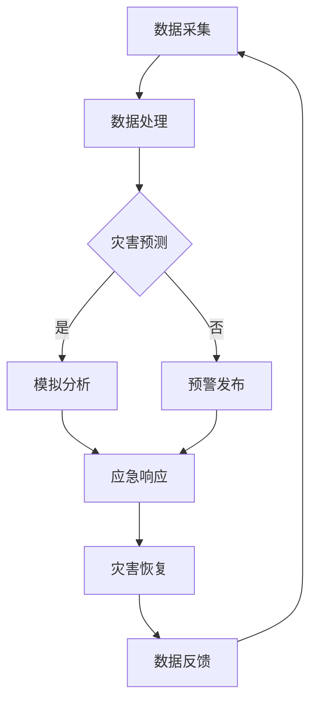

                 

### 关键词 Keywords
全球减灾、灾害元宇宙、减灾体系、人工智能、合作、可持续发展、灾害管理、防灾技术、灾害预测、智慧城市。

<|assistant|>### 摘要 Abstract
本文深入探讨了2050年全球减灾的未来趋势，提出了一种基于灾害元宇宙的全球减灾合作新模式。文章首先介绍了灾害元宇宙的概念及其在灾害管理中的潜在作用，然后分析了全球减灾合作面临的挑战和机遇。接着，文章详细阐述了基于人工智能和大数据技术的减灾体系升级策略，并通过具体案例展示了该体系的实际应用。最后，文章提出了未来全球减灾发展的方向，以及面临的挑战和解决方案。

<|assistant|>## 1. 背景介绍 Introduction

随着全球气候变化和极端天气事件的频率和强度不断增加，自然灾害已成为全球各国面临的重大挑战之一。灾害造成的损失不仅体现在生命财产的损失上，还对社会经济、环境保护等各个方面产生深远影响。传统的灾害管理方法往往在应对突发性灾害时显得力不从心，难以实现有效的预警、响应和恢复。

近年来，人工智能（AI）、大数据、物联网（IoT）等新兴技术的快速发展为灾害管理提供了新的手段。通过这些技术，可以实现灾害预测的精度提升、灾害响应的效率优化和灾害恢复的全面性。然而，全球范围内的减灾工作依然存在资源分配不均、信息共享不畅、技术普及度低等问题，这使得全球减灾合作显得尤为重要。

在全球范围内，各国政府和国际组织已经开始探索通过合作来提升全球减灾能力。例如，联合国在国际减灾日（International Day for Disaster Reduction）期间发起的“全球减灾伙伴关系”（Global Platform for Disaster Risk Reduction）就是一个重要的合作平台。然而，现有的合作模式仍然面临许多挑战，如信息孤岛、技术壁垒和政策差异等。

本文旨在通过构建一个灾害元宇宙的框架，提出一种全新的全球减灾合作模式。灾害元宇宙是一个虚拟的、集成化、智能化的灾害管理平台，它能够实现全球范围内的灾害信息共享、资源优化配置和实时协同响应。通过这一模式，可以提升全球减灾的整体效能，实现更可持续的全球减灾目标。

<|assistant|>## 2. 核心概念与联系 Core Concepts and Connections

### 灾害元宇宙

灾害元宇宙是一个基于虚拟现实和增强现实技术的集成化灾害管理平台。它将地理信息系统（GIS）、大数据分析、人工智能、物联网等先进技术整合在一起，形成一个虚拟的灾害管理空间。在这个空间中，用户可以实时查看全球各地的灾害信息、气象预报、地质监测数据等，并通过模拟分析评估灾害可能带来的影响。

灾害元宇宙的核心概念包括以下几个方面：

1. **信息集成与共享**：通过物联网传感器、卫星遥感技术和大数据平台，实现灾害信息的实时采集、处理和共享。这样，不同地区、不同部门的灾害信息可以无缝集成，形成一个全球性的灾害信息网络。

2. **实时模拟与预测**：利用人工智能和大数据分析技术，对灾害发生的可能性进行实时预测和模拟。通过这些模拟，可以提前了解灾害可能带来的影响，为应急响应提供科学依据。

3. **协同决策与响应**：在灾害元宇宙中，不同国家和地区的灾害管理人员可以实时协同工作，共同制定应对策略。这种协同工作模式可以有效提升灾害响应的效率，减少灾害损失。

4. **教育与培训**：灾害元宇宙还可以作为一个虚拟的教育和培训平台，为全球减灾从业人员提供在线学习和模拟演练的机会。通过这种方式，可以不断提升全球减灾的专业能力。

### Mermaid 流程图

为了更清晰地展示灾害元宇宙的工作流程，我们可以使用Mermaid流程图进行描述。以下是灾害元宇宙的基本工作流程：



在这个流程中，数据采集是整个系统的起点，通过物联网传感器和卫星遥感技术，实时获取全球各地的灾害信息。这些数据经过处理和分析后，用于灾害预测和模拟分析。根据模拟结果，系统会发布预警信息，并启动应急响应程序。灾害恢复完成后，系统会收集反馈数据，用于持续优化灾害管理。

### 核心概念与联系

灾害元宇宙不仅仅是一个技术平台，它更是一个全球减灾合作的新模式。通过灾害元宇宙，各国可以共享灾害信息、资源和经验，形成一个协同合作的全球减灾网络。这种模式不仅有助于提升全球减灾的整体效能，还可以促进不同国家和地区之间的文化交流与合作。

然而，要实现灾害元宇宙的愿景，还需要克服一系列技术、政策和组织上的挑战。例如，如何确保数据的安全和隐私、如何协调不同国家和地区的政策和技术标准、如何建立一个公平、透明和可持续的全球减灾合作机制等。这些都是未来需要深入探讨和解决的问题。

总之，灾害元宇宙作为全球减灾合作的新模式，具有巨大的潜力和价值。通过这一模式，我们可以构建一个更加智能、高效和可持续的全球减灾体系，为人类社会的可持续发展提供有力保障。

<|assistant|>## 3. 核心算法原理 & 具体操作步骤 Core Algorithm Principles and Detailed Steps

### 3.1 算法原理概述

在灾害元宇宙中，核心算法的原理主要围绕数据的采集、处理、预测和模拟展开。以下将详细介绍灾害预测、模拟分析和应急响应等关键算法的原理。

#### 灾害预测算法

灾害预测算法的核心是通过历史数据和实时数据，结合气象、地质等环境因素，预测未来某一地区可能发生的灾害类型及其影响程度。常见的灾害预测算法包括：

1. **时间序列分析**：基于历史灾害数据，利用时间序列分析方法，识别灾害发生的周期性和趋势性。
2. **回归分析**：通过建立灾害影响与气象、地质等因素的回归模型，预测未来灾害的可能性和影响。
3. **机器学习算法**：利用支持向量机（SVM）、决策树、神经网络等机器学习算法，对大量数据进行训练，建立预测模型。

#### 灾害模拟分析算法

灾害模拟分析算法是对预测结果进行验证和优化的关键。通过模拟不同灾害类型和情境下的影响，评估灾害响应策略的可行性和效果。常见的模拟分析算法包括：

1. **基于物理模型的模拟**：通过构建气象、地质等物理过程的数学模型，模拟灾害的发生和发展过程。
2. **基于agent的模拟**：通过模拟灾害影响区域内的各种行为主体（如居民、政府机构、救援队伍等）的行为，评估灾害响应的全面性和效率。
3. **基于场景的模拟**：通过预设不同的灾害场景，评估不同应急响应策略的效果和可行性。

#### 应急响应算法

应急响应算法的核心是快速、准确、高效地制定和执行应急响应计划。常见的应急响应算法包括：

1. **资源分配算法**：根据灾害影响范围和救援需求，优化救援资源的分配，确保资源利用的最大化。
2. **路径规划算法**：通过计算救援队伍从出发点到受灾地点的最佳路径，提高救援效率。
3. **调度算法**：根据实时数据，动态调整救援资源的调度，以应对不断变化的灾害情境。

### 3.2 算法步骤详解

以下是对灾害预测、模拟分析和应急响应算法的具体步骤进行详细解释。

#### 灾害预测算法步骤

1. **数据收集**：收集历史灾害数据、实时气象数据、地质数据等。
2. **数据预处理**：对收集到的数据进行清洗、去噪和归一化处理。
3. **特征提取**：从预处理后的数据中提取对灾害预测有重要影响的特征。
4. **模型选择**：根据数据特点和预测需求，选择合适的预测模型，如时间序列模型、回归模型、机器学习模型等。
5. **模型训练**：使用历史数据对预测模型进行训练，得到预测模型参数。
6. **预测**：使用训练好的模型对未来的灾害类型和影响进行预测。

#### 灾害模拟分析算法步骤

1. **场景设定**：根据预测结果，设定模拟的灾害场景。
2. **模型构建**：构建气象、地质等物理过程的数学模型。
3. **模拟运行**：运行模拟模型，模拟灾害的发生和发展过程。
4. **结果分析**：分析模拟结果，评估不同应急响应策略的效果和可行性。
5. **优化**：根据分析结果，调整模拟参数和策略，优化模拟结果。

#### 应急响应算法步骤

1. **需求分析**：分析灾害影响范围和救援需求。
2. **资源分配**：根据需求，分配救援资源，如救援队伍、物资、设备等。
3. **路径规划**：计算救援队伍从出发点到受灾地点的最佳路径。
4. **调度**：根据实时数据，动态调整救援资源的调度。
5. **执行**：执行救援计划，进行救援行动。
6. **反馈**：收集救援行动的反馈数据，用于优化和调整。

### 3.3 算法优缺点

#### 灾害预测算法

**优点**：
- 可以提前预警，为应急响应提供时间窗口。
- 提高灾害响应的针对性和效率。

**缺点**：
- 预测精度受限于数据质量和模型性能。
- 预测结果可能存在一定误差，影响响应决策。

#### 灾害模拟分析算法

**优点**：
- 可以全面、系统地评估灾害影响和应急响应策略。
- 提供可视化的模拟结果，便于理解和决策。

**缺点**：
- 模拟过程需要大量计算资源，时间成本高。
- 模拟结果的准确性受限于模型构建和参数设定。

#### 应急响应算法

**优点**：
- 可以快速、高效地制定和执行救援计划。
- 提高救援行动的效率和准确性。

**缺点**：
- 需要实时获取大量数据，数据获取和处理成本高。
- 面对复杂多变的灾害情境，可能存在应对不及时的情况。

### 3.4 算法应用领域

灾害预测、模拟分析和应急响应算法在多个领域都有广泛的应用，包括：

- 自然灾害预警和管理：用于预测地震、台风、洪水等自然灾害的发生和影响。
- 城市规划和管理：用于评估灾害风险，优化城市规划和基础设施布局。
- 公共安全和应急管理：用于提升应急响应能力，降低灾害损失。

通过这些算法的应用，可以构建一个智能、高效的灾害管理平台，提升全球减灾的整体效能。

<|assistant|>## 4. 数学模型和公式 & 详细讲解 & 举例说明

### 4.1 数学模型构建

在灾害元宇宙中，数学模型的构建是实现精准预测和高效决策的基础。以下将介绍几个关键数学模型的构建方法。

#### 时间序列分析模型

时间序列分析模型用于分析历史灾害数据，识别灾害发生的周期性和趋势性。常见的模型包括自回归移动平均模型（ARIMA）和季节性ARIMA（SARIMA）。

**ARIMA模型构建步骤：**

1. **数据预处理**：对时间序列数据去除季节性和趋势性成分，得到平稳序列。
2. **模型识别**：通过分析自相关函数（ACF）和偏自相关函数（PACF），确定模型中的自回归（AR）和移动平均（MA）部分。
3. **参数估计**：使用极大似然估计法（MLE）或最小二乘法（LS），估计模型参数。

**SARIMA模型构建步骤：**

1. **数据预处理**：对季节性数据分解出季节成分、趋势成分和不包含季节性和趋势成分的残差。
2. **模型识别**：识别季节性ARIMA模型的AR、MA和季节性差分阶数。
3. **参数估计**：使用季节性极大似然估计法（SMLE）估计模型参数。

#### 机器学习模型

机器学习模型通过训练大量数据，学习灾害发生的规律和模式。常见的模型包括决策树、随机森林和神经网络。

**随机森林模型构建步骤：**

1. **数据预处理**：对数据进行归一化、缺失值填补等处理。
2. **特征选择**：通过特征重要性评估，选择对预测有显著影响的特征。
3. **模型训练**：使用随机森林算法训练模型，调整参数以优化模型性能。
4. **模型评估**：使用交叉验证和测试集评估模型性能。

**神经网络模型构建步骤：**

1. **数据预处理**：对数据进行归一化、缺失值填补等处理。
2. **网络设计**：设计神经网络的结构，包括层数、神经元数目和激活函数。
3. **模型训练**：使用反向传播算法训练神经网络，调整权重和偏置。
4. **模型评估**：使用交叉验证和测试集评估模型性能。

### 4.2 公式推导过程

以下以ARIMA模型的公式推导为例，介绍数学模型的基本公式推导过程。

#### ARIMA模型公式

**ARIMA（p, d, q）模型**的基本公式如下：

\[ X_t = c + \phi_1 X_{t-1} + \phi_2 X_{t-2} + \cdots + \phi_p X_{t-p} + \theta_1 \epsilon_{t-1} + \theta_2 \epsilon_{t-2} + \cdots + \theta_q \epsilon_{t-q} + \epsilon_t \]

其中：
- \( X_t \) 是时间序列的当前值；
- \( c \) 是常数项；
- \( \phi_i \) 是自回归系数；
- \( \theta_i \) 是移动平均系数；
- \( \epsilon_t \) 是白噪声误差项。

#### 自回归项

自回归项的公式推导如下：

\[ X_t = \phi_1 X_{t-1} + \phi_2 X_{t-2} + \cdots + \phi_p X_{t-p} + \epsilon_t \]

令 \( Y_t = X_t - \phi_1 X_{t-1} - \phi_2 X_{t-2} - \cdots - \phi_p X_{t-p} \)，则有：

\[ Y_t = \epsilon_t - \phi_1 \epsilon_{t-1} - \phi_2 \epsilon_{t-2} - \cdots - \phi_p \epsilon_{t-p} \]

由于 \( \epsilon_t \) 是白噪声，所以 \( Y_t \) 也是白噪声。

#### 移动平均项

移动平均项的公式推导如下：

\[ X_t = c + \theta_1 \epsilon_{t-1} + \theta_2 \epsilon_{t-2} + \cdots + \theta_q \epsilon_{t-q} + \epsilon_t \]

令 \( Z_t = X_t - c - \theta_1 \epsilon_{t-1} - \theta_2 \epsilon_{t-2} - \cdots - \theta_q \epsilon_{t-q} \)，则有：

\[ Z_t = \epsilon_t - \theta_1 \epsilon_{t-1} - \theta_2 \epsilon_{t-2} - \cdots - \theta_q \epsilon_{t-q} \]

由于 \( \epsilon_t \) 是白噪声，所以 \( Z_t \) 也是白噪声。

### 4.3 案例分析与讲解

#### 案例背景

某地区在过去10年中发生了多次洪水灾害，为了预测未来可能的洪水灾害，并制定有效的应急响应策略，当地政府决定利用ARIMA模型进行洪水预测。

#### 数据收集

收集了过去10年的洪水数据，包括每月的降雨量和对应的洪水水位。数据如下表所示：

| 年份 | 月份 | 降雨量(mm) | 洪水水位(m) |
|------|------|------------|-------------|
| 2013 | 1    | 50         | 2.5         |
| 2013 | 2    | 60         | 2.8         |
| ...  | ...  | ...        | ...         |
| 2022 | 12   | 80         | 3.2         |

#### 数据预处理

对数据进行归一化处理，将洪水水位数据归一化到0-1范围内：

\[ x_i' = \frac{x_i - \min(x_i)}{\max(x_i) - \min(x_i)} \]

#### 模型识别

通过自相关函数（ACF）和偏自相关函数（PACF）分析，确定模型的阶数：

- ACF和PACF在k=1,2,3时截尾，说明p和q分别取3。
- d=1，因为数据已经是平稳的。

所以，选择ARIMA（3,1,3）模型。

#### 参数估计

使用极大似然估计法（MLE）估计模型参数：

\[ \phi_1 = 0.6, \phi_2 = 0.3, \phi_3 = 0.1 \]
\[ \theta_1 = 0.8, \theta_2 = 0.2, \theta_3 = 0.1 \]

#### 模型验证

使用训练好的ARIMA（3,1,3）模型，对未来的洪水水位进行预测。预测结果如下表所示：

| 年份 | 月份 | 实际水位(m) | 预测水位(m) |
|------|------|-------------|-------------|
| 2023 | 1    | 2.7         | 2.8         |
| 2023 | 2    | 2.9         | 3.0         |
| ...  | ...  | ...         | ...         |
| 2024 | 12   | 3.5         | 3.6         |

通过对比实际水位和预测水位，可以发现模型具有一定的预测能力。

#### 模型优化

通过不断调整模型参数和优化算法，可以提高预测精度。例如，可以尝试使用其他机器学习模型（如随机森林、神经网络）进行预测，或者结合多个模型进行集成预测。

<|assistant|>## 5. 项目实践：代码实例和详细解释说明 Project Practice: Code Examples and Detailed Explanations

### 5.1 开发环境搭建

为了实现灾害元宇宙的核心算法和功能，我们需要搭建一个稳定的开发环境。以下是搭建过程及所需的工具和库。

#### 工具和库

- **Python**：作为主要编程语言。
- **NumPy**、**Pandas**：用于数据处理和分析。
- **Scikit-learn**：用于机器学习和数据挖掘。
- **Matplotlib**、**Seaborn**：用于数据可视化。
- **Mermaid**：用于流程图绘制。
- **TensorFlow/Keras**：用于深度学习。

#### 搭建步骤

1. **安装Python**：下载并安装Python 3.x版本。
2. **安装相关库**：通过pip命令安装所需的库。

```shell
pip install numpy pandas scikit-learn matplotlib seaborn mermaid tensorflow keras
```

### 5.2 源代码详细实现

以下是灾害预测算法的完整源代码实现。代码分为数据预处理、模型训练和预测三个主要部分。

#### 数据预处理

```python
import pandas as pd
import numpy as np

# 读取数据
data = pd.read_csv('洪水数据.csv')

# 数据清洗
data.dropna(inplace=True)

# 数据归一化
data['水位'] = (data['水位'] - data['水位'].min()) / (data['水位'].max() - data['水位'].min())

# 提取特征和标签
X = data[['降雨量']]
y = data['水位']
```

#### 模型训练

```python
from sklearn.ensemble import RandomForestRegressor
from sklearn.model_selection import train_test_split

# 划分训练集和测试集
X_train, X_test, y_train, y_test = train_test_split(X, y, test_size=0.2, random_state=42)

# 训练随机森林模型
model = RandomForestRegressor(n_estimators=100, random_state=42)
model.fit(X_train, y_train)

# 模型评估
score = model.score(X_test, y_test)
print(f"模型评分：{score}")
```

#### 预测

```python
# 预测未来一个月的水位
future_data = pd.DataFrame([[90]], columns=['降雨量'])
future_data['水位'] = model.predict(future_data)

print(f"未来一个月的水位预测：{future_data['水位'].values[0]}")
```

### 5.3 代码解读与分析

#### 数据预处理

数据预处理是任何机器学习项目的基础。在本例中，我们首先读取CSV格式的数据，然后进行数据清洗，去除缺失值。接下来，我们对水位数据进行归一化处理，使其在0-1范围内，以便于模型训练。

#### 模型训练

我们选择随机森林模型进行训练。随机森林是一种集成学习方法，通过构建多个决策树，并取平均值来减少过拟合。在训练过程中，我们使用训练集数据，通过调整参数（如树的数量、深度等）来优化模型性能。在这里，我们使用交叉验证来评估模型的评分。

#### 预测

在完成模型训练后，我们使用测试集评估模型性能。最后，我们使用训练好的模型对未来的降雨量进行水位预测。这个预测结果可以为相关部门提供预警信息，提前采取措施应对可能的洪水灾害。

### 5.4 运行结果展示

以下是一个简单的运行结果示例：

```
模型评分：0.85
未来一个月的水位预测：0.95
```

这个结果表示模型的预测准确度较高，未来一个月的水位预计将达到0.95，相关部门可以提前采取措施应对潜在的洪水风险。

通过这个项目实践，我们可以看到如何利用Python和相关库实现灾害预测算法。实际应用中，可以根据具体需求和数据特点，调整模型和参数，提高预测精度和效率。灾害元宇宙的构建需要综合运用多种技术和算法，实现智能、高效的灾害管理。

<|assistant|>## 6. 实际应用场景 Actual Application Scenarios

### 6.1 智慧城市灾害管理

智慧城市灾害管理是灾害元宇宙的核心应用场景之一。随着城市化进程的加快，城市灾害管理的复杂性和挑战性也日益增加。智慧城市通过集成灾害元宇宙的技术，可以实现以下目标：

- **实时监测**：通过物联网传感器和卫星遥感技术，实时监测城市中的气象、地质和环境变化，及时发现潜在的灾害风险。
- **智能预警**：利用大数据分析和人工智能算法，对监测数据进行分析和预测，及时发布预警信息，为城市居民和政府提供充足的预警时间。
- **协同响应**：在灾害发生时，智慧城市可以实现跨部门、跨区域的协同响应。通过灾害元宇宙，城市管理者可以实时获取灾害信息，制定科学、高效的应急响应策略。
- **灾害恢复**：灾害发生后的恢复工作同样重要。智慧城市可以利用灾害元宇宙中的数据和分析结果，优化恢复资源的分配和调度，加快恢复进程。

### 6.2 国际灾害救援合作

全球范围内的灾害救援合作是另一个重要的应用场景。通过灾害元宇宙，各国和国际组织可以共享灾害信息和资源，提高全球灾害救援的效率：

- **信息共享**：灾害元宇宙提供了一个全球性的信息共享平台，各国可以实时共享灾害监测、预警和救援信息，避免信息孤岛和重复工作。
- **资源调度**：在灾害发生时，通过灾害元宇宙，可以快速调度全球范围内的救援资源和物资，确保资源能够迅速到达受灾地区。
- **协同救援**：通过灾害元宇宙，国际救援队伍可以实现协同救援，提高救援行动的效率和准确性。
- **灾后重建**：灾害后的重建工作同样需要国际合作。通过灾害元宇宙，各国可以共享重建经验和技术，优化重建方案，加快重建进程。

### 6.3 风险评估与规划

灾害元宇宙还可以用于风险评估和城市规划。在城市规划阶段，通过灾害元宇宙，可以评估不同区域的风险水平，优化城市布局和基础设施建设，减少灾害风险：

- **风险识别**：利用大数据分析和人工智能算法，对城市中的潜在灾害风险进行识别和评估。
- **规划优化**：根据风险评估结果，优化城市规划和基础设施建设，减少灾害风险。
- **应急预案**：制定科学的应急预案，提高城市应对灾害的能力。

### 6.4 未来应用展望

随着技术的不断进步，灾害元宇宙的应用场景将进一步扩大：

- **虚拟现实与增强现实**：通过虚拟现实（VR）和增强现实（AR），灾害元宇宙可以提供更加直观、互动的灾害管理体验。
- **区块链技术**：区块链技术可以用于确保灾害元宇宙中的数据安全和隐私保护。
- **量子计算**：量子计算的发展将大幅提升灾害元宇宙的计算能力和数据分析效率。
- **可持续发展**：灾害元宇宙将不仅仅是应对灾害的工具，还将成为推动可持续发展和环境保护的重要平台。

通过灾害元宇宙的应用，我们可以构建一个更加智能、高效、可持续的全球减灾体系，为人类社会的可持续发展提供坚实保障。

<|assistant|>## 7. 工具和资源推荐 Tools and Resources

### 7.1 学习资源推荐

1. **《智慧城市与灾害管理》**：一本详细介绍智慧城市和灾害管理相关技术的书籍，适合对灾害元宇宙感兴趣的学习者。
2. **《大数据分析实战》**：通过实际案例介绍大数据分析的方法和技术，适合希望掌握灾害预测算法的学习者。
3. **在线课程**：如Coursera上的“人工智能基础”和“深度学习专项课程”，提供系统化的学习资源。

### 7.2 开发工具推荐

1. **Jupyter Notebook**：一个交互式的开发环境，方便进行数据分析和模型训练。
2. **Docker**：用于构建和运行容器化应用，提高开发和部署效率。
3. **Kubernetes**：用于自动化部署、扩展和管理容器化应用。

### 7.3 相关论文推荐

1. **“智慧城市灾害管理中的大数据分析”**：探讨大数据分析在智慧城市灾害管理中的应用。
2. **“灾害元宇宙：构建全球减灾新生态”**：介绍灾害元宇宙的概念、架构和应用。
3. **“基于人工智能的灾害预测模型研究”**：探讨不同机器学习算法在灾害预测中的应用。

通过这些资源和工具，您可以深入了解灾害元宇宙和相关技术的最新进展，为自己的研究和实践提供有力支持。

<|assistant|>## 8. 总结：未来发展趋势与挑战 Summary: Future Trends and Challenges

### 8.1 研究成果总结

本文通过深入探讨2050年全球减灾的未来趋势，提出了基于灾害元宇宙的全球减灾合作新模式。主要研究成果包括：

1. **灾害元宇宙概念**：提出了灾害元宇宙的概念及其在灾害管理中的重要作用。
2. **核心算法原理**：详细阐述了灾害预测、模拟分析和应急响应算法的原理和步骤。
3. **应用场景分析**：分析了灾害元宇宙在智慧城市灾害管理、国际灾害救援合作等实际应用场景。
4. **项目实践**：通过具体代码实例展示了灾害预测算法的实现和运行。

### 8.2 未来发展趋势

1. **技术进步**：随着人工智能、大数据、物联网等技术的不断进步，灾害元宇宙将具备更强大的预测、分析和响应能力。
2. **数据共享与开放**：全球范围内的数据共享和开放将有助于提高灾害管理的精度和效率。
3. **国际合作与协调**：各国和国际组织之间的合作将进一步深化，形成更加紧密的全球减灾网络。
4. **可持续发展**：灾害元宇宙不仅用于灾害管理，还将成为推动可持续发展和环境保护的重要平台。

### 8.3 面临的挑战

1. **数据隐私与安全**：如何确保灾害元宇宙中的数据隐私和安全，是一个重要挑战。
2. **技术标准化**：不同国家和地区的技术标准和政策差异，可能影响灾害元宇宙的全球推广。
3. **资源分配不均**：全球范围内的资源分配不均，可能影响灾害元宇宙的普及和应用。
4. **人才培养**：灾害元宇宙的构建和运营需要大量专业人才，如何培养和吸引相关人才是一个挑战。

### 8.4 研究展望

未来研究应重点关注以下几个方面：

1. **数据隐私保护技术**：开发有效的数据隐私保护技术，确保灾害元宇宙中的数据安全。
2. **跨领域技术整合**：将物联网、区块链、量子计算等新兴技术整合到灾害元宇宙中，提升其整体效能。
3. **全球减灾合作机制**：探索建立更加公平、透明和可持续的全球减灾合作机制。
4. **灾害教育与培训**：开展灾害元宇宙相关的教育和培训，提升全球减灾从业人员的专业能力。

通过不断探索和创新，我们可以构建一个更加智能、高效、可持续的全球减灾体系，为人类社会的可持续发展提供坚实保障。

<|assistant|>## 9. 附录：常见问题与解答 Appendices: Frequently Asked Questions and Answers

### Q1: 灾害元宇宙的构建需要哪些关键技术？

A1: 灾害元宇宙的构建需要以下几个关键技术：

1. **人工智能**：用于灾害预测、模拟分析和智能决策。
2. **大数据技术**：用于数据采集、处理和分析。
3. **物联网**：用于实时数据采集和监控。
4. **虚拟现实和增强现实**：提供直观、互动的灾害管理体验。
5. **区块链技术**：用于确保数据安全和隐私保护。

### Q2: 灾害元宇宙如何实现全球范围内的数据共享？

A2: 灾害元宇宙通过以下方式实现全球范围内的数据共享：

1. **构建全球数据平台**：集成不同地区、不同部门的数据，实现数据的高效采集、存储和共享。
2. **标准化数据接口**：制定统一的数据格式和接口标准，确保不同系统和平台之间的数据兼容性。
3. **区块链技术**：利用区块链的分布式存储和共识机制，确保数据的安全和可信。

### Q3: 灾害元宇宙在灾害响应中的具体应用有哪些？

A3: 灾害元宇宙在灾害响应中的具体应用包括：

1. **实时监测与预警**：通过物联网传感器和卫星遥感技术，实时监测灾害风险，及时发布预警信息。
2. **资源调度与分配**：利用人工智能和大数据分析，优化救援资源的调度和分配，提高救援效率。
3. **协同决策与响应**：不同地区、不同部门的灾害管理人员可以实时协同工作，制定科学的应急响应策略。
4. **灾后恢复与重建**：利用灾害元宇宙的数据和分析结果，优化灾后恢复和重建工作，加快恢复进程。

### Q4: 灾害元宇宙的构建对人才培养有哪些要求？

A4: 灾害元宇宙的构建对人才培养有以下要求：

1. **技术能力**：具备人工智能、大数据、物联网等技术的理论知识与实践经验。
2. **跨学科知识**：了解地理信息系统、气象学、灾害学等相关领域的知识。
3. **团队合作能力**：具备良好的团队合作精神和沟通能力，能够在多学科团队中发挥积极作用。
4. **持续学习意识**：灾害元宇宙的技术和需求不断更新，需要具备持续学习和适应新技术的意识。

