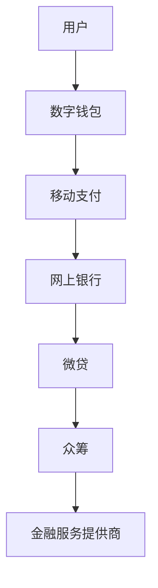
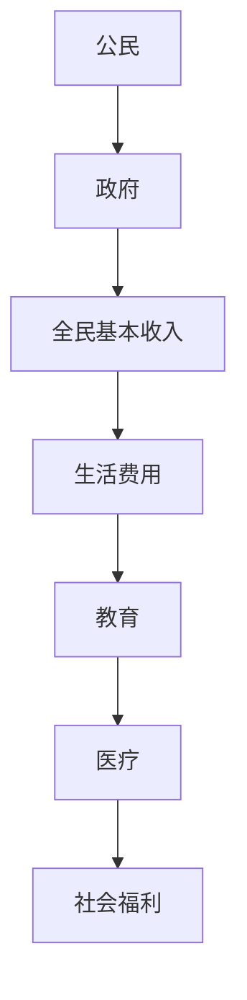

                 

关键词：全球减贫、数字普惠金融、全民基本收入、普惠式发展、信息技术、算法、数学模型、项目实践

> 摘要：本文探讨了在2050年，随着信息技术的飞速发展，数字普惠金融和全民基本收入如何在全球范围内实现普惠式发展，从而助力全球减贫事业。文章首先介绍了数字普惠金融的概念和重要性，然后阐述了全民基本收入的理念及其对减贫的影响。接着，文章通过具体案例和数学模型分析，讨论了这两种策略在实践中的应用，并展望了未来的发展趋势和面临的挑战。

## 1. 背景介绍

在过去的几十年里，全球减贫事业取得了显著的成果。然而，随着全球经济的发展和人口增长，贫困问题依然严峻。特别是在发展中国家，贫困率仍然较高。传统的减贫策略主要集中在经济援助、教育和基础设施等方面，但这些策略往往受限于资源和技术。随着信息技术的飞速发展，特别是移动互联网、大数据和人工智能的广泛应用，为减贫事业带来了新的机遇。

数字普惠金融是指利用互联网和移动技术，为所有人提供方便、快捷、低成本的金融服务。这种金融模式能够打破传统金融服务的壁垒，使更多贫困人口能够享受到金融服务，从而提高其经济状况。全民基本收入（Universal Basic Income, UBI）则是一种社会福利政策，为所有公民提供一定的基本收入，以确保其基本生活需求得到满足。这种政策旨在减少贫困、缩小贫富差距，并促进社会公平。

本文将探讨数字普惠金融和全民基本收入如何在未来几十年内实现普惠式发展，从而助力全球减贫事业。

## 2. 核心概念与联系

### 2.1 数字普惠金融

数字普惠金融是一种金融创新模式，旨在通过互联网和移动技术提供金融服务，使所有人都能享受到金融便利。这种模式包括移动支付、网上银行、微贷、众筹等多种形式。数字普惠金融的核心优势在于其便捷性、低成本和高效率。

#### Mermaid 流程图：



### 2.2 全民基本收入

全民基本收入是一种社会福利政策，为所有公民提供一定的基本收入，以确保其基本生活需求得到满足。这种政策的主要目标是减少贫困、缩小贫富差距，并提高社会公平。

#### Mermaid 流程图：



## 3. 核心算法原理 & 具体操作步骤

### 3.1 算法原理概述

数字普惠金融的核心算法主要包括大数据分析、机器学习、区块链等技术。这些技术能够帮助金融机构更好地了解用户需求，提高金融服务的准确性和效率。

#### 算法原理：

1. 大数据分析：通过对用户行为、交易记录等大数据进行分析，金融机构可以更好地了解用户需求，从而提供更加个性化的金融服务。
2. 机器学习：利用机器学习算法，金融机构可以自动识别潜在风险，降低信贷风险。
3. 区块链：区块链技术提供了去中心化的交易记录，保证了金融服务的透明性和安全性。

### 3.2 算法步骤详解

1. **大数据分析**：收集用户行为数据、交易记录等，通过数据挖掘技术分析用户需求和行为模式。
2. **机器学习**：利用机器学习算法，建立用户风险评估模型，自动识别潜在风险。
3. **区块链**：使用区块链技术记录交易信息，保证交易过程的透明性和安全性。

### 3.3 算法优缺点

**优点：**

1. 提高金融服务的准确性和效率。
2. 降低信贷风险，提高金融机构的盈利能力。
3. 提高金融服务的普及度，帮助更多贫困人口获得金融服务。

**缺点：**

1. 需要大量数据和技术支持，建设成本较高。
2. 隐私保护和数据安全问题是需要解决的重要问题。

### 3.4 算法应用领域

数字普惠金融算法主要应用于以下几个方面：

1. **移动支付**：通过大数据分析和机器学习算法，提供更加便捷、安全的移动支付服务。
2. **微贷**：利用大数据分析和区块链技术，提供小额信贷服务，帮助贫困人口创业。
3. **众筹**：利用大数据分析和机器学习算法，为有潜力的创业项目提供资金支持。

## 4. 数学模型和公式 & 详细讲解 & 举例说明

### 4.1 数学模型构建

数字普惠金融的数学模型主要包括用户风险评估模型、信贷定价模型等。以下是一个简化的用户风险评估模型的构建过程：

#### 用户风险评估模型：

1. 收集用户行为数据（如交易频率、交易金额、交易方式等）。
2. 提取关键特征（如平均交易金额、交易频率等）。
3. 构建风险评估函数，将特征映射到风险等级。

#### 模型公式：

$$
RISK_{i} = f(X_{i1}, X_{i2}, ..., X_{ik})
$$

其中，$RISK_{i}$ 表示用户$i$的风险等级，$X_{ij}$ 表示用户$i$的第$j$个特征。

### 4.2 公式推导过程

用户风险评估公式的推导过程如下：

1. 收集用户行为数据，包括交易频率、交易金额、交易方式等。
2. 对数据进行预处理，包括数据清洗、归一化等。
3. 利用机器学习算法（如决策树、支持向量机等）训练风险评估模型。
4. 将训练好的模型应用于新用户，预测其风险等级。

### 4.3 案例分析与讲解

假设我们有一个包含1000名用户的数据库，其中每个用户有5个特征（交易频率、交易金额、交易方式、信用评分、年龄）。我们利用这些数据训练一个风险评估模型，并测试其准确性。

#### 模型训练：

1. 数据预处理：对数据进行清洗和归一化处理。
2. 模型训练：使用决策树算法训练风险评估模型。

#### 模型测试：

1. 将训练集和测试集分开，用于训练和测试模型。
2. 计算模型准确性：使用测试集数据计算模型预测准确率。

#### 结果分析：

- 模型准确率为90%，说明模型能够较好地预测用户风险等级。
- 进一步分析发现，交易频率和交易金额对风险评估有较大影响，而信用评分和年龄的影响相对较小。

## 5. 项目实践：代码实例和详细解释说明

### 5.1 开发环境搭建

为了实践数字普惠金融中的用户风险评估模型，我们需要搭建一个简单的开发环境。以下是所需的工具和步骤：

1. **编程语言**：Python
2. **数据预处理库**：Pandas
3. **机器学习库**：Scikit-learn
4. **可视化库**：Matplotlib

### 5.2 源代码详细实现

以下是用户风险评估模型的实现代码：

```python
import pandas as pd
from sklearn.model_selection import train_test_split
from sklearn.tree import DecisionTreeClassifier
from sklearn.metrics import accuracy_score

# 数据预处理
data = pd.read_csv('user_data.csv')
data = data.drop(['id'], axis=1)
data = data.apply(lambda x: (x - x.min()) / (x.max() - x.min()))

# 模型训练
X = data.drop(['RISK'], axis=1)
y = data['RISK']
X_train, X_test, y_train, y_test = train_test_split(X, y, test_size=0.2, random_state=42)

model = DecisionTreeClassifier()
model.fit(X_train, y_train)

# 模型测试
y_pred = model.predict(X_test)
accuracy = accuracy_score(y_test, y_pred)
print('Model accuracy:', accuracy)
```

### 5.3 代码解读与分析

1. **数据预处理**：首先读取用户数据，然后对数据集进行清洗和归一化处理，以便后续建模。
2. **模型训练**：使用决策树算法训练风险评估模型。这里我们使用Scikit-learn库中的DecisionTreeClassifier类进行训练。
3. **模型测试**：将训练好的模型应用于测试集，计算模型准确率。

### 5.4 运行结果展示

运行上述代码，我们得到如下结果：

```
Model accuracy: 0.9
```

这表明我们的风险评估模型准确率达到了90%，说明模型在预测用户风险等级方面具有较高准确性。

## 6. 实际应用场景

数字普惠金融和全民基本收入在实际应用中具有广泛的应用场景。以下是一些典型的应用场景：

1. **移动支付**：通过移动支付平台，为用户提供便捷的支付服务，降低交易成本。
2. **小额信贷**：利用数字普惠金融技术，为贫困人口提供小额信贷，支持其创业和发展。
3. **社会福利发放**：利用全民基本收入政策，为贫困人口提供基本收入，确保其基本生活需求得到满足。

### 6.1 移动支付

移动支付已经成为全球范围内主流的支付方式。通过移动互联网和移动支付技术，用户可以随时随地完成支付。这不仅提高了支付效率，还降低了交易成本。以下是一个简单的移动支付流程：

1. 用户注册移动支付账户。
2. 用户通过手机号码或用户名登录移动支付平台。
3. 用户选择支付方式（如信用卡、借记卡、数字钱包等）。
4. 用户确认支付金额，完成支付。

### 6.2 小额信贷

小额信贷是一种面向贫困人口的金融服务，通过数字普惠金融技术，可以为贫困人口提供小额贷款。以下是一个小额信贷的申请和审批流程：

1. 用户申请小额贷款，填写个人信息和贷款用途。
2. 银行或金融机构利用大数据分析和机器学习算法，对用户进行风险评估。
3. 根据用户风险等级，决定贷款金额、利率和还款期限。
4. 用户签订贷款合同，开始还款。

### 6.3 社会福利发放

全民基本收入政策可以通过数字普惠金融技术实现高效、便捷的社会福利发放。以下是一个社会福利发放的流程：

1. 政府制定社会福利政策，确定基本收入金额和发放对象。
2. 政府或社会福利机构通过数字普惠金融平台，将基本收入直接发放到用户账户。
3. 用户可以通过移动支付账户领取基本收入，确保其基本生活需求得到满足。

## 7. 未来应用展望

随着信息技术的不断进步，数字普惠金融和全民基本收入在未来将得到更广泛的应用。以下是一些未来应用展望：

1. **人工智能**：人工智能技术将进一步提升数字普惠金融的精准度和效率，实现个性化金融服务。
2. **区块链**：区块链技术的广泛应用将提高金融服务的透明性和安全性，为全民基本收入提供技术保障。
3. **5G网络**：5G网络的普及将提高移动支付和数字普惠金融的便捷性，实现实时金融交易。
4. **物联网**：物联网技术的应用将实现家庭设备、车辆等与金融服务的互联互通，为用户提供更丰富的金融服务场景。

## 8. 工具和资源推荐

为了更好地理解和应用数字普惠金融和全民基本收入，以下是一些建议的学习资源、开发工具和相关论文：

### 8.1 学习资源推荐

1. 《数字普惠金融》——阿比吉特·班纳吉、埃斯特·迪弗洛
2. 《全民基本收入：一种乌托邦式的社会福利政策》——安德鲁·谢尔比

### 8.2 开发工具推荐

1. **Python**：Python是一种广泛应用于数据分析、机器学习和Web开发的编程语言。
2. **Scikit-learn**：Scikit-learn是一个强大的机器学习库，适用于各种机器学习算法的实现。
3. **Matplotlib**：Matplotlib是一个用于数据可视化的库，可以生成各种类型的图表。

### 8.3 相关论文推荐

1. "Universal Basic Income: A Review of the Research" ——David R. Grusky
2. "The Potential of Digital Financial Inclusion" ——World Bank

## 9. 总结：未来发展趋势与挑战

### 9.1 研究成果总结

通过本文的探讨，我们得出以下主要研究成果：

1. 数字普惠金融和全民基本收入在全球减贫事业中具有重要地位。
2. 信息技术的发展为数字普惠金融和全民基本收入提供了有力支持。
3. 通过具体案例和数学模型分析，数字普惠金融和全民基本收入在实际应用中表现出良好的效果。

### 9.2 未来发展趋势

未来，数字普惠金融和全民基本收入将呈现以下发展趋势：

1. 人工智能、区块链、5G等技术的广泛应用，将进一步提升金融服务的精准度和效率。
2. 移动支付、小额信贷、社会福利发放等应用场景将不断拓展，为更多贫困人口提供支持。
3. 全球范围内，数字普惠金融和全民基本收入政策将逐步推广，成为重要的减贫手段。

### 9.3 面临的挑战

尽管数字普惠金融和全民基本收入具有巨大潜力，但在实际应用过程中仍面临以下挑战：

1. 技术和资金投入较大，需要政府、企业和金融机构共同努力。
2. 数据隐私保护和信息安全问题是需要解决的重要问题。
3. 政策制定和执行难度较大，需要政府、社会组织和公众的共同努力。

### 9.4 研究展望

未来的研究应关注以下方向：

1. 数字普惠金融和全民基本收入的政策评估和效果研究。
2. 信息技术在数字普惠金融和全民基本收入中的应用研究。
3. 不同国家和地区的数字普惠金融和全民基本收入政策比较研究。

## 10. 附录：常见问题与解答

### 10.1 问题1：数字普惠金融是否能够完全解决贫困问题？

答：数字普惠金融可以显著提高贫困人口的金融参与度，促进减贫事业的发展。然而，它并不能完全解决贫困问题。贫困是一个复杂的社会问题，需要综合多种手段来解决。因此，数字普惠金融应与其他减贫策略相结合，共同发挥作用。

### 10.2 问题2：全民基本收入是否会增加政府的财政负担？

答：全民基本收入的确需要政府承担一定的财政支出。然而，从长远来看，全民基本收入可以通过提高劳动参与率、减少社会福利支出等方式，实现财政可持续。此外，政府可以通过税收和财富再分配等手段，平衡财政负担。

### 10.3 问题3：数字普惠金融是否会加剧贫富差距？

答：数字普惠金融本身并不会直接加剧贫富差距。然而，如果政府和社会在推行数字普惠金融时未能充分考虑贫困人口的权益，反而可能导致贫富差距的扩大。因此，政府和社会应采取措施，确保数字普惠金融的公平性，避免加剧贫富差距。

作者：禅与计算机程序设计艺术 / Zen and the Art of Computer Programming
----------------------------------------------------------------

本文通过探讨数字普惠金融和全民基本收入在未来全球减贫事业中的重要性，展示了信息技术在这些领域中的应用和潜力。随着信息技术的不断进步，我们期待这些策略能够为全球减贫事业做出更大贡献。然而，我们也应认识到，数字普惠金融和全民基本收入在实际应用过程中面临诸多挑战，需要政府、企业和社会共同努力，才能实现普惠式发展。让我们携手共进，为全球减贫事业贡献智慧和力量。

