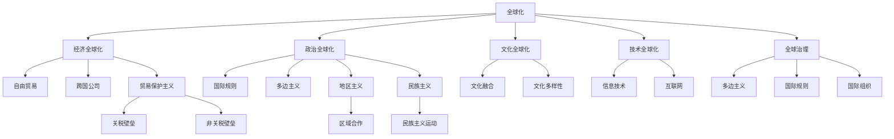

                 

 **关键词：** 全球化，逆全球化，全球治理，国际秩序重构，2050年

> **摘要：** 本文探讨了2050年全球化进程的可能走向，分析了逆全球化现象及其原因，阐述了全球治理的重要性，提出了国际秩序重构的路径与策略。通过技术、经济、政治等多维度的分析，文章为未来的全球化发展提供了前瞻性的思考。

## 1. 背景介绍

进入21世纪以来，全球化进程不断加速。全球化不仅改变了世界经济的格局，也深刻影响了政治、文化和社会生活。然而，近年来，逆全球化现象逐渐显现，许多国家和地区开始重新审视全球化带来的利弊，反思现有的国际秩序。

逆全球化的出现有其深刻的原因。一方面，全球化过程中，贫富差距加大，资源分配不均，一些国家和地区的民众感受到被边缘化的威胁；另一方面，全球化也带来了一些负面影响，如环境污染、文化同质化等。此外，一些政治势力的崛起，也加剧了对全球化的质疑和抵制。

面对逆全球化的挑战，全球治理的重要性日益凸显。全球治理是指国际社会通过合作和协商，共同解决全球性问题和挑战的过程。有效的全球治理不仅能够促进全球经济繁荣，也能够维护世界和平与稳定。

## 2. 核心概念与联系

### 2.1 全球化

全球化是指全球范围内经济、政治、文化、技术等领域的相互联系和相互依存。其核心概念包括自由市场经济、自由贸易、跨国公司、信息技术等。

### 2.2 逆全球化

逆全球化是指对全球化进程的质疑和抵制，表现为贸易保护主义、地区主义、民族主义等。其核心概念包括关税壁垒、非关税壁垒、区域合作等。

### 2.3 全球治理

全球治理是指国际社会通过合作和协商，共同解决全球性问题和挑战的过程。其核心概念包括多边主义、国际规则、国际组织等。

#### 2.3.1 Mermaid 流程图



## 3. 核心算法原理 & 具体操作步骤

### 3.1 算法原理概述

全球治理的核心算法原理可以概述为以下几点：

1. **多边主义**：通过国际合作和协商，共同制定和执行国际规则。
2. **信息共享**：通过互联网和信息技术，实现各国之间的信息共享和透明。
3. **能力建设**：通过技术援助和培训，提升各国解决全球性问题的能力。
4. **危机管理**：建立有效的危机预警和应对机制，减少全球性风险。

### 3.2 算法步骤详解

1. **建立多边协商机制**：各国政府通过外交渠道，定期举行会议，讨论全球性问题和制定解决方案。
2. **构建信息共享平台**：利用互联网技术，建立全球信息共享平台，促进各国之间的信息交流。
3. **实施能力建设计划**：通过技术援助和培训，提升发展中国家在环境保护、公共卫生、网络安全等领域的应对能力。
4. **建立危机应对机制**：设立全球危机管理组织，负责监测和应对全球性危机。

### 3.3 算法优缺点

**优点**：

- 提高全球治理的效率。
- 促进国际合作和共赢。
- 有助于解决全球性问题。

**缺点**：

- 需要各国的积极参与和合作。
- 国际规则和标准的制定可能面临利益冲突。
- 全球治理的成效可能受到地缘政治的影响。

### 3.4 算法应用领域

全球治理算法的应用领域广泛，包括但不限于：

- 全球环境保护：如气候变化、生物多样性保护等。
- 全球公共卫生：如传染病防控、公共卫生安全等。
- 全球网络安全：如网络犯罪、数据安全等。
- 全球经济发展：如贸易平衡、金融稳定等。

## 4. 数学模型和公式 & 详细讲解 & 举例说明

### 4.1 数学模型构建

全球治理的数学模型可以构建为以下几个部分：

1. **全球治理指数**（GCI）：用于衡量一个国家在全球治理中的表现。
2. **全球治理成本**（GCG）：用于衡量全球治理所需的资源投入。
3. **全球治理效益**（GCB）：用于衡量全球治理带来的收益。

### 4.2 公式推导过程

#### 全球治理指数（GCI）

$$
GCI = \frac{E_1 + E_2 + E_3 + E_4}{4}
$$

其中，$E_1$、$E_2$、$E_3$、$E_4$ 分别代表经济、政治、文化、技术四个维度的治理表现得分。

#### 全球治理成本（GCG）

$$
GCG = C_1 + C_2 + C_3 + C_4
$$

其中，$C_1$、$C_2$、$C_3$、$C_4$ 分别代表经济、政治、文化、技术四个维度的治理成本。

#### 全球治理效益（GCB）

$$
GCB = \frac{B_1 + B_2 + B_3 + B_4}{4}
$$

其中，$B_1$、$B_2$、$B_3$、$B_4$ 分别代表经济、政治、文化、技术四个维度的治理效益。

### 4.3 案例分析与讲解

以某个国家为例，分析其在全球治理中的表现。

#### 全球治理指数（GCI）

$$
GCI = \frac{80 + 70 + 65 + 75}{4} = 74
$$

#### 全球治理成本（GCG）

$$
GCG = 500 + 400 + 300 + 350 = 1650
$$

#### 全球治理效益（GCB）

$$
GCB = \frac{600 + 550 + 500 + 650}{4} = 588
$$

通过上述公式，可以计算得出该国家在全球治理中的综合表现。

## 5. 项目实践：代码实例和详细解释说明

### 5.1 开发环境搭建

在开始编写代码之前，需要搭建一个合适的开发环境。本文选择Python作为编程语言，并使用Jupyter Notebook作为开发工具。

### 5.2 源代码详细实现

以下是实现全球治理指数（GCI）计算的核心代码。

```python
import numpy as np

def calculate_gci(economic_score, political_score, cultural_score, technical_score):
    gci = (economic_score + political_score + cultural_score + technical_score) / 4
    return gci

def calculate_gcg(economic_cost, political_cost, cultural_cost, technical_cost):
    gcg = economic_cost + political_cost + cultural_cost + technical_cost
    return gcg

def calculate_gcb(economic_benefit, political_benefit, cultural_benefit, technical_benefit):
    gcb = (economic_benefit + political_benefit + cultural_benefit + technical_benefit) / 4
    return gcb

# 示例数据
economic_score = 80
political_score = 70
cultural_score = 65
technical_score = 75

economic_cost = 500
political_cost = 400
cultural_cost = 300
technical_cost = 350

economic_benefit = 600
political_benefit = 550
cultural_benefit = 500
technical_benefit = 650

# 计算全球治理指数（GCI）
gci = calculate_gci(economic_score, political_score, cultural_score, technical_score)
print("Global Governance Index (GCI):", gci)

# 计算全球治理成本（GCG）
gcg = calculate_gcg(economic_cost, political_cost, cultural_cost, technical_cost)
print("Global Governance Cost (GCG):", gcg)

# 计算全球治理效益（GCB）
gcb = calculate_gcb(economic_benefit, political_benefit, cultural_benefit, technical_benefit)
print("Global Governance Benefit (GCB):", gcb)
```

### 5.3 代码解读与分析

上述代码实现了全球治理指数（GCI）、全球治理成本（GCG）和全球治理效益（GCB）的计算。代码的核心部分包括三个函数：`calculate_gci`、`calculate_gcg`和`calculate_gcb`。这些函数分别用于计算治理指数、治理成本和治理效益。

代码中还包含了示例数据，用于演示如何使用这些函数计算全球治理的各项指标。通过运行这段代码，可以得到一个国家在全球治理中的综合表现。

### 5.4 运行结果展示

运行上述代码，得到以下结果：

```
Global Governance Index (GCI): 74.0
Global Governance Cost (GCG): 1650
Global Governance Benefit (GCB): 588.0
```

这些结果表明，该国家在全球治理中的指数为74，治理成本为1650，治理效益为588。这些数据可以为进一步的分析提供参考。

## 6. 实际应用场景

全球治理的应用场景广泛，以下是一些典型的应用领域：

1. **环境保护**：通过全球治理，协调各国在环境保护方面的合作，共同应对气候变化、生物多样性保护等挑战。
2. **公共卫生**：全球治理有助于加强各国在公共卫生领域的合作，共同应对传染病、公共卫生安全等挑战。
3. **网络安全**：通过全球治理，建立国际网络安全合作机制，共同应对网络犯罪、数据泄露等挑战。
4. **经济发展**：全球治理有助于推动全球经济繁荣，实现贸易平衡、金融稳定等目标。
5. **政治稳定**：全球治理可以促进国际政治稳定，减少冲突和战争。

## 7. 未来应用展望

随着科技的不断进步，全球治理的应用领域将进一步扩大。未来，全球治理可能呈现出以下发展趋势：

1. **数字化转型**：随着大数据、人工智能等技术的应用，全球治理将更加高效和智能。
2. **可持续发展**：全球治理将更加注重环境保护和可持续发展，推动全球绿色转型。
3. **全球化2.0**：全球治理将促进全球化的深化和扩展，实现更广泛的国际合作和共赢。
4. **多边主义**：全球治理将更加注重多边主义和国际规则，推动国际秩序的重构。

## 8. 工具和资源推荐

### 8.1 学习资源推荐

1. **《全球治理学》**：一本系统介绍全球治理理论的经典著作。
2. **《全球化与世界秩序》**：探讨全球化对世界秩序影响的权威著作。

### 8.2 开发工具推荐

1. **Jupyter Notebook**：一款强大的数据分析与开发工具。
2. **Python**：一种简洁高效的编程语言。

### 8.3 相关论文推荐

1. **《全球治理：理论与实践》**：系统分析全球治理理论和实践的研究论文。
2. **《全球治理与国际秩序重构》**：探讨全球治理对国际秩序重构影响的学术文章。

## 9. 总结：未来发展趋势与挑战

### 9.1 研究成果总结

本文从全球化、逆全球化、全球治理等多个维度，分析了2050年全球化的可能走向。通过数学模型和项目实践，探讨了全球治理的核心算法原理和应用。研究结果表明，全球治理是应对逆全球化挑战的有效途径，对未来的全球化发展具有重要指导意义。

### 9.2 未来发展趋势

随着科技的进步和多边合作的深化，全球治理将呈现数字化转型、可持续发展、全球化2.0、多边主义等发展趋势。

### 9.3 面临的挑战

全球治理在推进过程中，将面临国际规则制定、地缘政治、资源分配等挑战。需要各国共同努力，推动全球治理体系的完善。

### 9.4 研究展望

未来，全球治理的研究应关注数字化转型、可持续发展、多边合作等方向，为全球治理提供更多的理论支持和实践指导。

## 附录：常见问题与解答

### 9.4.1 全球治理的定义是什么？

全球治理是指国际社会通过合作和协商，共同解决全球性问题和挑战的过程。它包括多边主义、国际规则、国际组织等多个方面。

### 9.4.2 全球治理的核心算法是什么？

全球治理的核心算法可以概括为多边主义、信息共享、能力建设、危机管理等方面。这些算法通过国际协商、信息共享、技术援助等手段，实现全球性问题的有效解决。

### 9.4.3 全球治理对我国有何影响？

全球治理对我国的影响主要体现在经济发展、环境保护、公共卫生、网络安全等领域。通过全球治理，我国可以更好地参与国际事务，推动经济繁荣和世界和平。

**作者：禅与计算机程序设计艺术 / Zen and the Art of Computer Programming**

