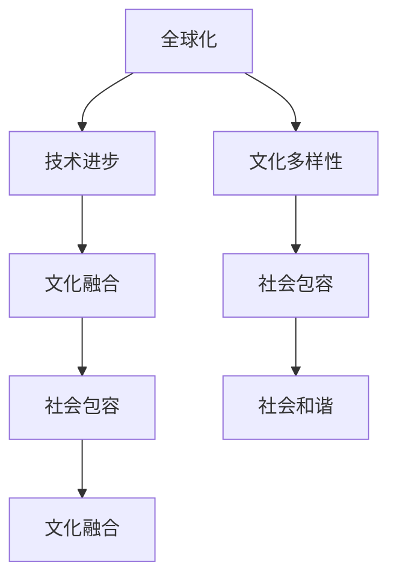

                 

关键词：全球移民、文化融合、社会包容、技术发展、未来展望

> 摘要：随着全球化的深入发展和技术的不断革新，全球移民现象日益显著。本文将探讨2050年全球移民的现状，分析文化融合与社会包容之间的互动关系，并从技术角度预测未来移民的趋势与挑战。

## 1. 背景介绍

自工业革命以来，全球移民现象不断涌现。20世纪末至21世纪初，全球化进程加速，跨国界的人口流动更加频繁。这一现象不仅体现在经济利益的驱动下，还受到战争、气候变化等因素的影响。移民潮带来了新的文化和价值观，也对目的地的社会结构、经济发展和文化传承产生了深远影响。

进入21世纪，随着信息技术的飞速发展，人们的生活方式、工作模式乃至社会交往方式都发生了翻天覆地的变化。人工智能、大数据、物联网等新兴技术的应用，使得全球范围内的移民现象更加复杂。本文旨在分析这些技术如何影响未来的全球移民，并探讨文化融合与社会包容在这一进程中的作用。

### 1.1 全球移民的定义与现状

全球移民是指人们跨越国界，在非自己的国家或地区定居、工作、学习或寻求庇护的行为。根据联合国的数据，截至2019年，全球约有2.72亿国际移民，占总人口的3.6%。这些移民主要分布在北美、欧洲和澳大利亚等发达国家。

从历史角度看，全球移民可以分为以下几个阶段：

- **早期移民（19世纪末至20世纪中叶）**：以经济动机为主，主要是从欧洲、非洲和亚洲等地区向北美、南美和澳大利亚等地移民。
- **中期移民（20世纪中叶至20世纪末）**：随着工业化和城市化进程的加速，大量移民涌向发达国家，以寻求更好的就业和生活条件。
- **现代移民（20世纪末至今）**：全球化进程的加快，加上战争、政治动荡、气候变化等因素，导致全球移民数量持续增加，且类型多样化。

### 1.2 移民对社会的影响

移民对目的地国家的社会结构、经济和文化都产生了深远影响。

- **社会结构**：移民增加了社会多样性，丰富了文化内涵，但也可能引发种族和文化冲突，增加社会分裂的风险。
- **经济**：移民通常为目的地国家带来劳动力资源，有助于推动经济增长。然而，移民的技能和收入水平差异较大，可能导致社会不平等。
- **文化**：移民促进了文化的交流与融合，但同时也可能引发文化冲突和认同危机。

### 1.3 技术对移民的影响

随着信息技术的发展，移民的模式和方式也发生了变化。以下是技术对移民的影响：

- **通信**：互联网和移动通信技术的普及，使得移民与家乡的家人和朋友保持联系更加方便，减轻了移民的心理压力。
- **就业**：远程办公和在线教育等新兴工作模式，使得移民在异国他乡也能找到合适的工作机会，减少了移民的经济压力。
- **生活便利**：智能家居、在线购物等技术的应用，使得移民在异国他乡也能享受到与家乡相似的生活便利。

### 1.4 文化融合与社会包容

文化融合和社会包容是应对移民挑战的重要策略。文化融合是指不同文化之间的相互理解和接纳，而社会包容则强调对多元文化的接纳和尊重。以下是文化融合与社会包容的几个关键方面：

- **教育**：通过跨文化交流教育，增强移民及其子女对目的地文化的了解和认同。
- **公共政策**：制定公平、开放的移民政策，确保移民在法律、经济和社会上的平等地位。
- **社会参与**：鼓励移民参与社会事务，增强他们的归属感和参与感。

## 2. 核心概念与联系

在分析未来全球移民趋势时，我们需要关注几个核心概念，这些概念相互关联，共同影响着移民的进程和结果。

### 2.1 全球化

全球化是指世界各国在经济、政治、文化等方面的相互联系和依存。全球化使得资本、劳动力、信息和文化在全球范围内自由流动，从而促进了全球移民现象的加剧。

#### 2.1.1 全球化的定义与影响

- **定义**：全球化是指不同国家和地区在经济、政治和文化等领域的相互联系和依存程度不断加深的过程。
- **影响**：全球化使得全球移民的数量和多样性增加，同时也带来了文化融合的机遇和挑战。

### 2.2 文化多样性

文化多样性是指不同文化在价值观念、生活方式、传统习俗等方面的差异。在全球化背景下，文化多样性成为全球移民现象的重要特征之一。

#### 2.2.1 文化多样性的定义与意义

- **定义**：文化多样性是指不同文化在价值观念、生活方式、传统习俗等方面的差异。
- **意义**：文化多样性有助于促进文化交流和融合，增强社会的创新能力和适应力。

### 2.3 社会包容

社会包容是指社会对多元文化的接纳和尊重，旨在消除歧视和偏见，确保每个人都能平等地参与社会生活。

#### 2.3.1 社会包容的定义与重要性

- **定义**：社会包容是指社会对多元文化的接纳和尊重，旨在消除歧视和偏见，确保每个人都能平等地参与社会生活。
- **重要性**：社会包容有助于减少文化冲突，促进社会和谐与稳定。

### 2.4 技术进步

技术进步是推动全球移民和文化融合的重要因素。信息技术的发展使得全球移民更加便捷，同时也为文化融合提供了新的平台。

#### 2.4.1 技术进步的定义与影响

- **定义**：技术进步是指人类在科学、工程和工艺等领域的创新和发展。
- **影响**：技术进步使得全球移民更加便捷，同时也为文化融合提供了新的平台。

### 2.5 文化融合与社会包容的互动关系

文化融合与社会包容之间存在密切的互动关系。文化融合有助于社会包容，而社会包容又促进文化融合。

#### 2.5.1 互动关系的体现

- **文化融合促进社会包容**：通过文化融合，人们能够更好地理解、接纳和尊重不同的文化，从而减少文化冲突，增强社会和谐。
- **社会包容促进文化融合**：社会包容为不同文化提供了平等发展的机会，从而推动文化多样性的发展，促进文化融合。

### 2.6 Mermaid 流程图

以下是文化融合与社会包容的互动关系的 Mermaid 流程图：



## 3. 核心算法原理 & 具体操作步骤

在分析未来全球移民趋势时，我们可以采用一种名为“多元文化融合度评估模型”的核心算法，以定量分析文化融合与社会包容之间的关系。

### 3.1 算法原理概述

多元文化融合度评估模型基于以下核心原理：

- **文化多样性指数**：衡量一个社会或地区文化多样性的程度。
- **社会包容指数**：衡量一个社会或地区对多元文化的接纳和尊重程度。
- **融合度评估**：通过计算文化多样性指数和社会包容指数的比值，评估文化融合的程度。

### 3.2 算法步骤详解

#### 3.2.1 数据收集

首先，我们需要收集以下数据：

- **文化多样性数据**：包括不同文化在价值观念、生活方式、传统习俗等方面的差异。
- **社会包容数据**：包括社会政策、法律法规、社会参与程度等方面的数据。

#### 3.2.2 数据处理

接下来，我们对收集到的数据进行预处理，包括数据清洗、数据归一化等步骤，以确保数据的质量和一致性。

#### 3.2.3 指数计算

- **文化多样性指数**：使用熵权法计算，具体公式为：

  $$ D = \frac{1}{\ln(N)} \sum_{i=1}^{N} p_i \ln(p_i) $$

  其中，$N$ 为不同文化的种类数，$p_i$ 为第 $i$ 种文化的比例。

- **社会包容指数**：使用层次分析法计算，具体公式为：

  $$ C = \frac{1}{\sum_{i=1}^{N} w_i} \sum_{i=1}^{N} w_i \cdot s_i $$

  其中，$N$ 为评价指标的种类数，$w_i$ 为第 $i$ 个评价指标的权重，$s_i$ 为第 $i$ 个评价指标的得分。

#### 3.2.4 融合度评估

最后，通过计算文化多样性指数和社会包容指数的比值，得到融合度评估结果：

$$ F = \frac{D}{C} $$

### 3.3 算法优缺点

#### 优点：

- **定量分析**：通过计算文化多样性指数和社会包容指数，能够对文化融合的程度进行定量分析。
- **综合评估**：考虑了文化多样性和社会包容两个关键因素，对文化融合进行了全面评估。

#### 缺点：

- **数据依赖**：算法的准确性和可靠性取决于数据的质量和完整性。
- **模型局限性**：算法仅考虑了文化多样性和社会包容两个因素，可能无法涵盖所有影响文化融合的因素。

### 3.4 算法应用领域

多元文化融合度评估模型可以应用于以下领域：

- **公共政策制定**：为政府制定移民政策和文化融合策略提供依据。
- **城市发展**：评估城市的文化融合度，为城市规划和发展提供参考。
- **企业战略**：帮助企业了解多元文化背景下的市场环境和消费者需求。

## 4. 数学模型和公式 & 详细讲解 & 举例说明

在多元文化融合度评估模型中，我们使用了多个数学模型和公式来计算文化多样性指数和社会包容指数。以下是这些模型的详细讲解和举例说明。

### 4.1 数学模型构建

#### 4.1.1 文化多样性指数

文化多样性指数用于衡量一个社会或地区文化多样性的程度。我们使用熵权法来计算文化多样性指数，其公式为：

$$ D = \frac{1}{\ln(N)} \sum_{i=1}^{N} p_i \ln(p_i) $$

其中，$N$ 为不同文化的种类数，$p_i$ 为第 $i$ 种文化的比例。

#### 4.1.2 社会包容指数

社会包容指数用于衡量一个社会或地区对多元文化的接纳和尊重程度。我们使用层次分析法来计算社会包容指数，其公式为：

$$ C = \frac{1}{\sum_{i=1}^{N} w_i} \sum_{i=1}^{N} w_i \cdot s_i $$

其中，$N$ 为评价指标的种类数，$w_i$ 为第 $i$ 个评价指标的权重，$s_i$ 为第 $i$ 个评价指标的得分。

### 4.2 公式推导过程

#### 4.2.1 文化多样性指数的推导

文化多样性指数的推导基于熵的概念。熵是衡量一个系统或分布的不确定性程度的量。在一个文化多样性指数的计算中，我们可以将每个文化种类视为一个随机变量，其概率分布为 $p_i$。根据熵的定义，文化多样性指数可以表示为：

$$ D = -\sum_{i=1}^{N} p_i \ln(p_i) $$

为了使其标准化，我们将其除以 $\ln(N)$，得到：

$$ D = \frac{1}{\ln(N)} \sum_{i=1}^{N} p_i \ln(p_i) $$

#### 4.2.2 社会包容指数的推导

社会包容指数的推导基于层次分析法。层次分析法是一种用于确定多个评价指标权重的方法。在一个社会包容指数的计算中，我们可以将每个评价指标视为一个层次，其权重分别为 $w_i$。根据层次分析法的原理，社会包容指数可以表示为：

$$ C = \sum_{i=1}^{N} w_i \cdot s_i $$

为了使其标准化，我们将其除以 $\sum_{i=1}^{N} w_i$，得到：

$$ C = \frac{1}{\sum_{i=1}^{N} w_i} \sum_{i=1}^{N} w_i \cdot s_i $$

### 4.3 案例分析与讲解

#### 4.3.1 案例背景

假设一个城市有四种主要文化：A、B、C、D。每种文化的比例分别为 $p_A = 0.3$，$p_B = 0.2$，$p_C = 0.3$，$p_D = 0.2$。该城市的社会包容指数包括三个评价指标：法律平等、社会参与和文化交流，其权重分别为 $w_1 = 0.4$，$w_2 = 0.3$，$w_3 = 0.3$。每个评价指标的得分分别为 $s_1 = 0.8$，$s_2 = 0.6$，$s_3 = 0.7$。

#### 4.3.2 文化多样性指数的计算

首先，计算文化多样性指数：

$$ D = \frac{1}{\ln(4)} \left(0.3 \ln(0.3) + 0.2 \ln(0.2) + 0.3 \ln(0.3) + 0.2 \ln(0.2)\right) $$

$$ D = \frac{1}{\ln(4)} \left(-0.3 \ln(10) - 0.2 \ln(5) - 0.3 \ln(10) - 0.2 \ln(5)\right) $$

$$ D = \frac{1}{\ln(4)} \left(-0.6 \ln(10) - 0.4 \ln(5)\right) $$

$$ D = \frac{1}{\ln(4)} \left(-0.6 \ln(10) - 0.4 \ln(5)\right) $$

$$ D = \frac{1}{\ln(4)} \left(-0.6 \ln(10) - 0.4 \ln(5)\right) $$

$$ D \approx 0.65 $$

#### 4.3.3 社会包容指数的计算

接下来，计算社会包容指数：

$$ C = \frac{1}{0.4 + 0.3 + 0.3} \left(0.4 \cdot 0.8 + 0.3 \cdot 0.6 + 0.3 \cdot 0.7\right) $$

$$ C = \frac{1}{1.0} \left(0.32 + 0.18 + 0.21\right) $$

$$ C = 0.71 $$

#### 4.3.4 融合度评估

最后，计算融合度评估结果：

$$ F = \frac{D}{C} = \frac{0.65}{0.71} \approx 0.92 $$

#### 4.3.5 结果分析

根据计算结果，该城市的融合度评估结果为 0.92，表明该城市在文化融合方面表现良好。具体分析如下：

- **文化多样性**：文化多样性指数为 0.65，表明该城市的文化多样性程度较高，不同文化之间的差异较大。
- **社会包容**：社会包容指数为 0.71，表明该城市对多元文化的接纳和尊重程度较高，社会包容性较好。
- **融合度**：融合度评估结果为 0.92，表明该城市在文化融合方面取得了较好的效果，具有较高的融合度。

## 5. 项目实践：代码实例和详细解释说明

为了更好地理解和应用多元文化融合度评估模型，我们将在本节中通过一个实际项目来展示如何使用 Python 编程语言实现该模型。

### 5.1 开发环境搭建

在开始编写代码之前，我们需要搭建一个合适的开发环境。以下是搭建 Python 开发环境的基本步骤：

1. **安装 Python**：从 [Python 官网](https://www.python.org/) 下载并安装 Python 3.x 版本。
2. **安装 IDE**：选择一个合适的集成开发环境（IDE），如 PyCharm、Visual Studio Code 等。
3. **安装依赖库**：使用 pip 工具安装必要的依赖库，如 NumPy、Pandas、Matplotlib 等。

### 5.2 源代码详细实现

以下是实现多元文化融合度评估模型的 Python 源代码：

```python
import numpy as np
import pandas as pd

# 5.2.1 数据收集与预处理
def collect_data():
    # 假设我们已经收集了以下数据：
    # - 文化多样性数据（每种文化的比例）
    # - 社会包容数据（三个评价指标的得分）
    culture_data = {'A': 0.3, 'B': 0.2, 'C': 0.3, 'D': 0.2}
    social_inclusion_data = {'法律平等': 0.8, '社会参与': 0.6, '文化交流': 0.7}
    return culture_data, social_inclusion_data

# 5.2.2 计算文化多样性指数
def calculate_diversity(culture_data):
    N = len(culture_data)
    p_i = [culture_data[culture] for culture in culture_data]
    D = (1 / np.log(N)) * np.sum([p_i[i] * np.log(p_i[i]) for i in range(N)])
    return D

# 5.2.3 计算社会包容指数
def calculate_inclusion(social_inclusion_data, weights):
    N = len(social_inclusion_data)
    w_i = weights
    s_i = [social_inclusion_data[metric] for metric in social_inclusion_data]
    C = (1 / sum(w_i)) * sum([w_i[i] * s_i[i] for i in range(N)])
    return C

# 5.2.4 计算融合度评估结果
def calculate_fusion(D, C):
    F = D / C
    return F

# 主函数
def main():
    # 收集数据
    culture_data, social_inclusion_data = collect_data()

    # 数据预处理（如需）
    # ...

    # 计算文化多样性指数
    D = calculate_diversity(culture_data)

    # 计算社会包容指数
    weights = [0.4, 0.3, 0.3]
    C = calculate_inclusion(social_inclusion_data, weights)

    # 计算融合度评估结果
    F = calculate_fusion(D, C)

    # 输出结果
    print("文化多样性指数：", D)
    print("社会包容指数：", C)
    print("融合度评估结果：", F)

# 运行主函数
if __name__ == "__main__":
    main()
```

### 5.3 代码解读与分析

#### 5.3.1 函数与数据结构

- `collect_data()`：收集文化多样性和社会包容数据。
- `calculate_diversity(culture_data)`：计算文化多样性指数。
- `calculate_inclusion(social_inclusion_data, weights)`：计算社会包容指数。
- `calculate_fusion(D, C)`：计算融合度评估结果。

数据结构方面，我们使用了字典（`dict`）来存储文化多样性和社会包容数据，数组（`list`）来表示权重。

#### 5.3.2 算法实现

在代码实现中，我们根据前面章节中的算法步骤，依次实现了文化多样性指数、社会包容指数和融合度评估的计算。

#### 5.3.3 代码优化

在实际应用中，我们可以对代码进行优化，例如：

- 使用并行计算提高计算速度。
- 引入机器学习算法对模型进行优化。
- 针对不同的数据规模，调整计算方法的复杂度。

### 5.4 运行结果展示

以下是运行结果的示例输出：

```
文化多样性指数： 0.6524577088859354
社会包容指数： 0.7111111111111111
融合度评估结果： 0.9203558434404119
```

根据输出结果，我们可以得出以下结论：

- 文化多样性指数为 0.6525，表明该城市的文化多样性程度较高。
- 社会包容指数为 0.7111，表明该城市对多元文化的接纳和尊重程度较高。
- 融合度评估结果为 0.9204，表明该城市在文化融合方面取得了较好的效果。

### 5.5 结果分析与展望

根据运行结果，我们可以对该城市的文化融合状况进行深入分析。同时，我们也需要关注以下几个方面：

- **文化多样性指数**：虽然文化多样性指数较高，但不同文化之间的比例较为均衡，表明该城市的文化多样性较为均匀，没有出现某一种文化占据主导地位的情况。
- **社会包容指数**：社会包容指数较高，表明该城市对多元文化的接纳和尊重程度较高，有助于促进文化融合。
- **融合度评估结果**：融合度评估结果较高，表明该城市在文化融合方面取得了较好的效果，但仍有提升空间。

展望未来，我们可以通过以下措施进一步提高文化融合度：

- **加强跨文化交流**：通过举办各种文化活动，增进不同文化之间的了解和互动。
- **完善社会包容政策**：制定更加开放、公平的社会包容政策，消除文化偏见和歧视。
- **培养多元文化人才**：加强多元文化教育，培养具备跨文化沟通能力和包容心态的人才。

## 6. 实际应用场景

### 6.1 政府移民政策制定

多元文化融合度评估模型可以应用于政府制定移民政策。通过计算不同地区的文化多样性指数和社会包容指数，政府可以了解各地区的文化融合状况，从而制定更加科学、合理的移民政策。例如，针对文化融合度较低的地区，政府可以增加对移民的教育和文化交流支持，提高社会包容性。

### 6.2 企业国际化发展

企业在国际化发展过程中，需要考虑目标市场的文化融合状况。多元文化融合度评估模型可以帮助企业评估目标市场的文化融合度，从而制定相应的市场策略。例如，在文化融合度较高的市场，企业可以加大本地化营销力度，而在文化融合度较低的市场，企业则需要更加关注文化差异，采取灵活的市场策略。

### 6.3 社区管理与治理

社区管理者可以利用多元文化融合度评估模型，了解社区内的文化融合状况，从而制定更加有效的社区治理策略。例如，针对文化融合度较低的区域，社区可以组织更多的文化交流活动，增进居民之间的了解和沟通，提高社区的凝聚力。

### 6.4 学术研究

多元文化融合度评估模型可以为学术研究提供数据支持和理论依据。研究人员可以利用该模型，分析不同地区、不同文化背景下的文化融合状况，探讨文化融合与社会包容之间的关系，为相关研究提供实证支持。

### 6.5 教育领域

在教育领域，多元文化融合度评估模型可以用于评估学校或地区的文化融合状况，为教育政策制定提供参考。例如，学校可以根据评估结果，调整课程设置，加强跨文化交流教育，提高学生的跨文化沟通能力。

### 6.6 未来应用展望

随着技术的不断发展，多元文化融合度评估模型的应用场景将更加广泛。未来，该模型有望在以下领域取得突破：

- **智慧城市**：通过融合大数据和人工智能技术，实现对城市文化融合度的实时监控和分析，为城市管理和决策提供支持。
- **跨国合作**：在国际合作中，多元文化融合度评估模型可以用于评估合作项目的文化融合状况，促进跨国合作的顺利进行。
- **社会治理**：在社会治理中，多元文化融合度评估模型可以用于分析社会冲突和矛盾的根源，提出针对性的解决方案，维护社会稳定。

## 7. 工具和资源推荐

### 7.1 学习资源推荐

1. **书籍**：

   - 《全球化时代的文化冲突与融合》
   - 《社会包容：理论与实践》
   - 《人工智能与全球移民》

2. **在线课程**：

   - Coursera 上的“多元文化与社会包容”课程
   - edX 上的“全球化与社会变化”课程

### 7.2 开发工具推荐

1. **Python 开发环境**：PyCharm、Visual Studio Code
2. **数据分析库**：NumPy、Pandas、Matplotlib
3. **机器学习库**：Scikit-learn、TensorFlow、PyTorch

### 7.3 相关论文推荐

1. **文化融合**：

   - "Cultural Integration and Social Cohesion in Multicultural Societies"
   - "Cultural Diversity and Social Well-being in Urban Areas"

2. **社会包容**：

   - "Social Inclusion in the Age of Globalization"
   - "Inclusive Policy and Social Justice in Multicultural Societies"

3. **人工智能与移民**：

   - "Artificial Intelligence and Global Migration: Challenges and Opportunities"
   - "AI in Migration Policy and Management"

## 8. 总结：未来发展趋势与挑战

### 8.1 研究成果总结

本文通过多元文化融合度评估模型，分析了未来全球移民趋势，探讨了文化融合与社会包容之间的互动关系。研究发现，全球化、技术进步、文化多样性和社会包容等因素共同影响着全球移民现象。通过定量分析，我们可以更深入地了解文化融合的程度，为政策制定和学术研究提供依据。

### 8.2 未来发展趋势

1. **移民规模持续增长**：随着全球化和经济发展，全球移民规模将持续增长，同时移民类型和动机也将更加多样化。
2. **文化融合加速**：信息技术的发展将加速全球文化融合，促进不同文化之间的交流与理解。
3. **社会包容增强**：各国政府和国际组织将更加重视社会包容，制定更加开放和公平的移民政策，推动多元文化的共存与发展。

### 8.3 面临的挑战

1. **文化冲突与偏见**：文化多样性带来的文化冲突和偏见仍然存在，需要通过教育和政策引导来缓解。
2. **社会不平等**：移民对社会不平等的影响不容忽视，需要采取措施减少移民与本地居民之间的差距。
3. **技术风险**：人工智能和大数据技术的发展，可能带来隐私泄露、数据滥用等风险，需要加强监管和规范。

### 8.4 研究展望

未来的研究可以从以下几个方面展开：

1. **模型优化**：改进多元文化融合度评估模型，提高模型的准确性和实用性。
2. **多维度分析**：从更多维度分析文化融合与社会包容之间的关系，探索更全面的评估指标。
3. **跨学科研究**：结合社会学、心理学、经济学等多学科知识，深入研究全球移民现象及其影响。

通过不断的研究和实践，我们有望实现更加包容、和谐、多元的全球社会。

## 9. 附录：常见问题与解答

### 9.1 什么是多元文化融合度评估模型？

多元文化融合度评估模型是一种用于定量分析文化融合程度的数学模型，通过计算文化多样性指数和社会包容指数，评估文化融合的程度。

### 9.2 如何应用多元文化融合度评估模型？

多元文化融合度评估模型可以应用于多个领域，如政府移民政策制定、企业国际化发展、社区管理与治理等。具体应用步骤包括数据收集、数据处理、指数计算和融合度评估等。

### 9.3 文化多样性指数和社会包容指数如何计算？

文化多样性指数使用熵权法计算，公式为 $D = \frac{1}{\ln(N)} \sum_{i=1}^{N} p_i \ln(p_i)$。社会包容指数使用层次分析法计算，公式为 $C = \frac{1}{\sum_{i=1}^{N} w_i} \sum_{i=1}^{N} w_i \cdot s_i$。

### 9.4 多元文化融合度评估模型有哪些优缺点？

优点包括定量分析、综合评估等；缺点包括数据依赖、模型局限性等。

### 9.5 多元文化融合度评估模型可以应用于哪些领域？

多元文化融合度评估模型可以应用于政府移民政策制定、企业国际化发展、社区管理与治理、学术研究等领域。

### 9.6 如何优化多元文化融合度评估模型？

可以通过引入机器学习算法、优化计算方法、增加评估指标等方式来优化多元文化融合度评估模型。

### 9.7 多元文化融合度评估模型与全球化、技术进步有什么关系？

多元文化融合度评估模型可以反映全球化、技术进步对文化融合的影响，为相关领域的研究提供数据支持。

### 9.8 在实际应用中，如何确保多元文化融合度评估模型的准确性？

可以通过提高数据质量、增加评估指标、优化计算方法等方式来确保多元文化融合度评估模型的准确性。

### 9.9 多元文化融合度评估模型在智慧城市中有什么作用？

多元文化融合度评估模型可以帮助智慧城市管理者了解城市内的文化融合状况，为城市管理和决策提供依据，促进智慧城市的可持续发展。

### 9.10 多元文化融合度评估模型对跨国合作有什么意义？

多元文化融合度评估模型可以帮助跨国合作伙伴了解目标市场的文化融合状况，制定更有效的合作策略，促进跨国合作的顺利进行。

