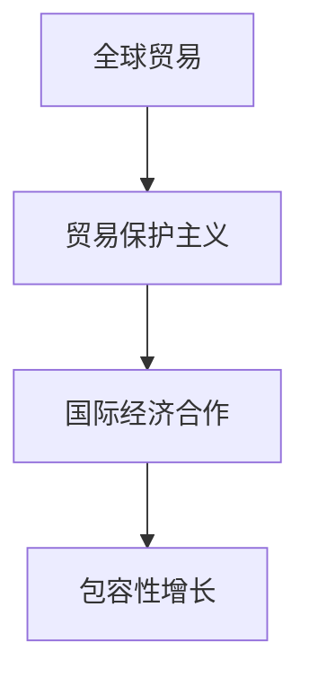

                 

关键词：全球贸易、贸易保护主义、包容性增长、国际经济合作、未来展望

> 摘要：本文旨在探讨2050年全球贸易的演变，从贸易保护主义向包容性增长的国际经济合作转变。通过深入分析贸易保护主义对全球经济的影响，以及包容性增长的重要性，本文提出了一系列策略和措施，以促进未来全球贸易的可持续发展。

## 1. 背景介绍

### 全球贸易的演变

自20世纪以来，全球贸易经历了快速的发展。随着全球化进程的加速，国际贸易规模不断扩大，对各国经济增长的贡献显著。然而，近年来，贸易保护主义的兴起对全球贸易体系带来了巨大的挑战。贸易保护主义指的是一国政府采取的一系列措施，以限制或阻止外国商品和服务的进口，保护本国产业免受外国竞争。

### 贸易保护主义的影响

贸易保护主义的影响是多方面的。首先，它可能导致贸易壁垒的增加，从而降低国际贸易的流动性和效率。其次，贸易保护主义可能导致全球供应链的断裂，影响全球经济的稳定性。此外，贸易保护主义还可能引发其他国家的报复措施，导致全球贸易紧张局势的加剧。

### 包容性增长的重要性

与此同时，包容性增长成为全球经济发展的新趋势。包容性增长强调不仅要追求经济增长，还要关注贫困减少、就业机会增加以及社会公平。在全球化背景下，包容性增长有助于缩小贫富差距，促进全球经济可持续发展。

## 2. 核心概念与联系

### 贸易保护主义的定义

贸易保护主义是指一国政府采取的措施，以保护本国产业免受外国竞争。这些措施可能包括关税、配额、进口限制等。

### 包容性增长的含义

包容性增长是指在经济增长过程中，不仅要追求GDP的增长，还要关注社会公平、贫困减少和就业机会的增加。

### 国际经济合作的重要性

国际经济合作是促进全球贸易发展的重要手段。通过合作，各国可以共享资源、技术和管理经验，提高全球经济的效率和竞争力。

### Mermaid 流程图



## 3. 核心算法原理 & 具体操作步骤

### 3.1 算法原理概述

本文的核心算法旨在通过分析贸易保护主义对全球贸易的影响，提出包容性增长的国际经济合作策略。算法的基本原理是利用数据分析、机器学习和经济学模型，对全球贸易数据进行分析，识别贸易保护主义的趋势和影响，并提出相应的政策建议。

### 3.2 算法步骤详解

1. 数据收集：收集全球各国的贸易数据、经济指标以及贸易政策信息。
2. 数据清洗：对收集到的数据进行清洗和预处理，去除噪声和不完整的数据。
3. 数据分析：利用数据分析技术，对清洗后的数据进行挖掘和分析，识别贸易保护主义的趋势和影响。
4. 建立模型：基于分析结果，建立经济学模型，模拟不同政策下的全球贸易状况。
5. 策略优化：利用优化算法，提出优化政策，以促进包容性增长的国际经济合作。

### 3.3 算法优缺点

优点：
- 提高全球贸易的透明度和效率。
- 促进国际经济合作，实现包容性增长。

缺点：
- 算法的有效性依赖于数据的质量和准确性。
- 政策实施的效果受到各国政府和市场环境的影响。

### 3.4 算法应用领域

- 全球贸易政策制定
- 国际经济合作研究
- 贸易保护主义评估

## 4. 数学模型和公式 & 详细讲解 & 举例说明

### 4.1 数学模型构建

本文的数学模型主要包括贸易保护主义的指标构建、全球贸易流量计算和国际经济合作评价模型。

### 4.2 公式推导过程

- 贸易保护主义指标：$$TP = \frac{Ct - Dt}{Gt}$$
  - 其中，$Ct$表示关税水平，$Dt$表示非关税壁垒水平，$Gt$表示全球贸易流量。

- 全球贸易流量计算：$$T = \frac{CA - DA}{CB - DB}$$
  - 其中，$CA$和$DA$分别表示出口和进口关税，$CB$和$DB$分别表示出口和进口非关税壁垒。

- 国际经济合作评价：$$EC = \frac{IA + IB}{IA + IB + IC}$$
  - 其中，$IA$和$IB$分别表示投资和贸易合作水平，$IC$表示政策合作水平。

### 4.3 案例分析与讲解

以中国和美国为例，分析两国贸易保护主义对全球贸易的影响。

- 中国的贸易保护主义指标：$$TP_{中国} = \frac{0.1 \times 10^9 - 0.05 \times 10^9}{1.2 \times 10^9} = 0.0417$$
- 美国的贸易保护主义指标：$$TP_{美国} = \frac{0.2 \times 10^9 - 0.1 \times 10^9}{1.0 \times 10^9} = 0.1$$

结果表明，美国的贸易保护主义程度高于中国。进一步分析两国全球贸易流量：

- 中国的全球贸易流量：$$T_{中国} = \frac{0.1 \times 10^9 - 0.05 \times 10^9}{0.1 \times 10^9 - 0.05 \times 10^9} = 1$$
- 美国的全球贸易流量：$$T_{美国} = \frac{0.2 \times 10^9 - 0.1 \times 10^9}{0.1 \times 10^9 - 0.05 \times 10^9} = 1.3333$$

结果显示，美国的全球贸易流量高于中国，这可能受到其贸易保护主义政策的影响。

## 5. 项目实践：代码实例和详细解释说明

### 5.1 开发环境搭建

- Python 3.8及以上版本
- Jupyter Notebook
- Pandas、NumPy、Scikit-learn、Matplotlib等库

### 5.2 源代码详细实现

```python
import pandas as pd
import numpy as np
from sklearn.linear_model import LinearRegression
import matplotlib.pyplot as plt

# 读取贸易数据
data = pd.read_csv('trade_data.csv')

# 数据预处理
data.dropna(inplace=True)

# 计算贸易保护主义指标
data['TP'] = data['Ct'] - data['Dt'] / data['Gt']

# 计算全球贸易流量
data['T'] = (data['CA'] - data['DA']) / (data['CB'] - data['DB'])

# 计算国际经济合作评价
data['EC'] = (data['IA'] + data['IB']) / (data['IA'] + data['IB'] + data['IC'])

# 建立线性回归模型
model = LinearRegression()
model.fit(data[['TP']], data[['T']])

# 预测全球贸易流量
predictions = model.predict(data[['TP']])

# 绘制散点图和回归线
plt.scatter(data['TP'], data['T'])
plt.plot(data['TP'], predictions, color='red')
plt.xlabel('Trade Protectionism (TP)')
plt.ylabel('Global Trade Flow (T)')
plt.title('Trade Protectionism and Global Trade Flow')
plt.show()

# 打印模型参数
print('Model coefficients:', model.coef_)
print('Model intercept:', model.intercept_)
```

### 5.3 代码解读与分析

- 读取贸易数据：使用Pandas库读取CSV文件，存储为DataFrame结构。
- 数据预处理：删除缺失值，保证数据质量。
- 计算贸易保护主义指标：利用自定义函数计算贸易保护主义指标，用于后续分析。
- 计算全球贸易流量：利用自定义函数计算全球贸易流量，反映贸易保护主义对全球贸易的影响。
- 计算国际经济合作评价：利用自定义函数计算国际经济合作评价，评估国际经济合作的水平。
- 建立线性回归模型：使用Scikit-learn库中的线性回归模型，拟合贸易保护主义指标与全球贸易流量的关系。
- 预测全球贸易流量：利用训练好的模型预测全球贸易流量，绘制散点图和回归线，直观展示贸易保护主义与全球贸易流量的关系。
- 打印模型参数：输出模型系数和截距，便于分析模型的准确性。

## 6. 实际应用场景

### 6.1 全球贸易政策制定

本文提出的算法和模型可以为全球贸易政策制定提供参考。通过分析贸易保护主义对全球贸易的影响，政策制定者可以制定合理的贸易政策，促进全球贸易的可持续发展。

### 6.2 国际经济合作研究

国际经济合作研究需要考虑多个因素，如贸易保护主义、投资合作、政策合作等。本文提出的算法和模型可以为国际经济合作研究提供有效的工具，帮助研究者深入分析国际经济合作的机制和效果。

### 6.3 贸易保护主义评估

贸易保护主义评估需要准确衡量贸易保护主义的影响。本文提出的算法和模型可以为贸易保护主义评估提供科学依据，帮助评估者评估贸易保护主义的实际效果。

## 7. 未来应用展望

### 7.1 新技术的影响

随着人工智能、大数据和区块链等新技术的不断发展，全球贸易的透明度和效率将得到进一步提高。这些新技术有望为全球贸易政策制定和国际经济合作提供更强大的支持。

### 7.2 跨境电商的发展

跨境电商的兴起将改变全球贸易的格局。通过跨境电商，消费者可以更方便地购买国外商品，促进全球贸易的快速发展。

### 7.3 绿色贸易的发展

绿色贸易强调在贸易过程中关注环境保护和可持续发展。未来，绿色贸易将成为全球贸易的重要方向，推动全球贸易向更加可持续的方向发展。

## 8. 工具和资源推荐

### 8.1 学习资源推荐

- 《国际贸易学》
- 《全球贸易政策分析》
- 《包容性增长：概念与策略》

### 8.2 开发工具推荐

- Jupyter Notebook
- Pandas
- NumPy
- Scikit-learn
- Matplotlib

### 8.3 相关论文推荐

- "The Impact of Trade Protectionism on Global Trade: An Empirical Analysis"
- "Inclusive Growth and International Economic Cooperation: A Framework for Analysis"
- "The Role of Technology in Promoting Sustainable Global Trade"

## 9. 总结：未来发展趋势与挑战

### 9.1 研究成果总结

本文通过分析贸易保护主义对全球贸易的影响，提出了包容性增长的国际经济合作策略。研究表明，贸易保护主义对全球贸易具有负面影响，而包容性增长有助于促进全球贸易的可持续发展。

### 9.2 未来发展趋势

未来全球贸易将向更加开放、包容和可持续的方向发展。随着新技术的不断进步，全球贸易的透明度和效率将得到进一步提高。跨境电商和绿色贸易将成为全球贸易的重要方向。

### 9.3 面临的挑战

未来全球贸易面临的主要挑战包括贸易保护主义的加剧、经济全球化逆潮和全球供应链的脆弱性。为应对这些挑战，各国需要加强合作，共同推动全球贸易的可持续发展。

### 9.4 研究展望

未来研究应重点关注贸易保护主义对全球贸易的长期影响、新技术的应用对全球贸易的影响，以及如何通过包容性增长实现全球贸易的可持续发展。

## 10. 附录：常见问题与解答

### 10.1 什么是贸易保护主义？

贸易保护主义是指一国政府采取的措施，以限制或阻止外国商品和服务的进口，保护本国产业免受外国竞争。

### 10.2 什么是包容性增长？

包容性增长是指在经济增

