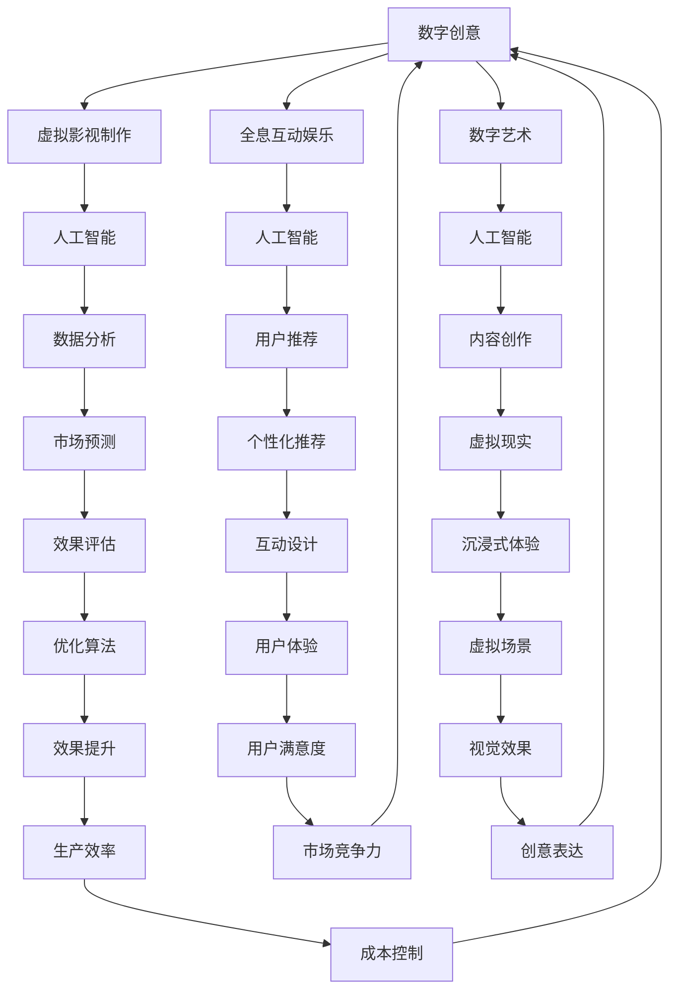

                 

关键词：虚拟影视制作、全息互动娱乐、数字内容产业、人工智能、算法、数学模型、代码实例、实际应用、未来展望

> 摘要：本文探讨了2050年数字内容产业的未来发展趋势，重点分析了虚拟影视制作和全息互动娱乐在数字创意领域的应用。通过深入探讨核心概念、算法原理、数学模型以及实际应用案例，本文揭示了数字创意产业的技术进步如何引领未来娱乐和媒体产业的变革。

## 1. 背景介绍

随着科技的飞速发展，数字内容产业正在经历一场前所未有的变革。从传统的影视制作到现代的全息互动娱乐，数字技术的应用已经深刻改变了我们的娱乐消费方式。在未来的2050年，数字创意产业将如何演变？本文将深入探讨这个问题，分析虚拟影视制作和全息互动娱乐的发展趋势及其对数字内容产业的影响。

### 1.1 数字内容产业的现状

当前，数字内容产业已经形成了一个庞大的市场，涵盖了影视、游戏、音乐、出版等多个领域。随着互联网、云计算、大数据和人工智能等技术的发展，数字内容产业正呈现出爆炸式增长。根据市场研究机构的预测，未来十年内，全球数字内容产业的规模将继续扩大，达到数十万亿美元的规模。

### 1.2 虚拟影视制作的发展

虚拟影视制作是一种利用计算机生成图像、声音和动作的技术，通过虚拟场景的构建，可以实现真实场景难以实现的拍摄效果。近年来，虚拟影视制作技术得到了广泛关注，尤其是在电影、电视剧和广告等领域。随着技术的不断进步，虚拟影视制作的视觉效果越来越逼真，成为电影制作中的重要组成部分。

### 1.3 全息互动娱乐的崛起

全息互动娱乐是一种通过全息投影技术实现的三维虚拟体验。与传统的平面屏幕相比，全息投影可以呈现更加立体、真实的图像，给用户带来沉浸式的体验。全息互动娱乐在游戏、旅游、教育等领域具有广泛的应用前景，正逐渐成为一种新型的娱乐方式。

## 2. 核心概念与联系

在探讨2050年数字内容产业的发展时，我们需要了解几个核心概念，并探讨它们之间的联系。

### 2.1 数字创意

数字创意是指利用数字技术创造和表达创意内容的过程。它涵盖了虚拟影视制作、全息互动娱乐、数字艺术等多个领域。数字创意的核心是技术创新，它推动了数字内容产业的快速发展。

### 2.2 人工智能

人工智能是指计算机系统通过学习、推理和自我优化等方式，实现人类智能活动的技术。在数字内容产业中，人工智能可以用于内容创作、数据分析、用户推荐等环节，提高生产效率和用户体验。

### 2.3 数学模型

数学模型是一种用数学语言描述现实世界问题的工具。在数字内容产业中，数学模型可以用于优化算法、预测趋势和评估效果等。例如，在虚拟影视制作中，数学模型可以用于生成逼真的虚拟场景和动画。

### 2.4 Mermaid 流程图

以下是一个用于描述数字内容产业核心概念的Mermaid流程图：



## 3. 核心算法原理 & 具体操作步骤

### 3.1 算法原理概述

在数字创意产业中，核心算法原理是推动技术创新和产业升级的关键。以下是一些核心算法原理及其应用：

#### 3.1.1 图像处理算法

图像处理算法是虚拟影视制作和全息互动娱乐中的基础。常见的图像处理算法包括：

- **边缘检测**：用于识别图像中的边缘和轮廓。
- **去噪算法**：用于去除图像中的噪声，提高图像质量。
- **纹理合成**：用于将纹理映射到虚拟场景中，增强视觉效果。

#### 3.1.2 计算机视觉算法

计算机视觉算法是虚拟影视制作和全息互动娱乐中不可或缺的一部分。常见的计算机视觉算法包括：

- **目标检测**：用于识别和定位图像中的特定目标。
- **姿态估计**：用于估计虚拟角色的姿态和动作。
- **图像识别**：用于识别图像中的物体和场景。

#### 3.1.3 人工智能算法

人工智能算法在数字内容产业中的应用越来越广泛，包括：

- **深度学习**：用于构建复杂的模型，实现图像生成、语音识别等功能。
- **强化学习**：用于优化虚拟角色的行为和交互。
- **自然语言处理**：用于文本生成、语音合成等功能。

### 3.2 算法步骤详解

以下是一个简单的虚拟影视制作流程，展示核心算法的应用：

#### 3.2.1 拍摄阶段

1. **场景构建**：利用3D建模软件构建虚拟场景。
2. **角色动画**：利用动画软件为虚拟角色制作动作。
3. **图像处理**：对拍摄到的图像进行去噪、边缘检测等处理。

#### 3.2.2 后期制作

1. **镜头编辑**：将拍摄的镜头进行剪辑和组合。
2. **特效添加**：利用图像处理算法添加特效，如火焰、烟雾等。
3. **声音处理**：为影片添加背景音乐和音效。

#### 3.2.3 发布与播放

1. **格式转换**：将影片转换为适合播放的格式。
2. **网络传输**：通过互联网将影片传输给用户。
3. **播放设备**：用户在虚拟现实设备上观看影片。

### 3.3 算法优缺点

- **图像处理算法**：优点是效果直观，缺点是计算量大，实时性差。
- **计算机视觉算法**：优点是实现自动化，缺点是准确性和鲁棒性有待提高。
- **人工智能算法**：优点是强大，缺点是实现复杂，训练成本高。

### 3.4 算法应用领域

- **虚拟影视制作**：用于生成逼真的虚拟场景和角色。
- **全息互动娱乐**：用于实现沉浸式体验和互动功能。
- **游戏开发**：用于构建虚拟世界和角色动作。
- **智能监控**：用于目标检测和姿态估计。

## 4. 数学模型和公式 & 详细讲解 & 举例说明

在数字创意产业中，数学模型和公式是理解和应用核心算法的重要工具。以下是一个典型的数学模型及其推导和应用的示例。

### 4.1 数学模型构建

一个简单的数学模型用于描述虚拟场景的生成。设\(V\)为虚拟场景的向量表示，\(P\)为输入的参数向量。数学模型可以表示为：

$$V = f(P)$$

其中，\(f\)为函数，用于将参数向量转换为虚拟场景向量。

### 4.2 公式推导过程

为了推导该公式，我们首先定义虚拟场景的几何属性。设\(x\)和\(y\)为虚拟场景中的两个点，\(r\)为点\(x\)到点\(y\)的距离。则虚拟场景的向量表示可以表示为：

$$V = (x, y, r)$$

接下来，我们定义参数向量\(P\)为：

$$P = (a, b, c)$$

其中，\(a\)、\(b\)和\(c\)为参数。

为了将参数向量转换为虚拟场景向量，我们定义函数\(f\)为：

$$f(P) = (x(a), y(b), r(c))$$

这样，我们就得到了数学模型：

$$V = f(P) = (x(a), y(b), r(c))$$

### 4.3 案例分析与讲解

假设我们有一个参数向量\(P = (2, 3, 1)\)。我们可以将参数向量代入数学模型中，得到虚拟场景向量：

$$V = f(P) = (2 \cdot 2, 3 \cdot 3, 1 \cdot 1) = (4, 9, 1)$$

这个虚拟场景向量表示了一个点\(x = 4\)、\(y = 9\)和距离\(r = 1\)。在实际应用中，我们可以根据不同的参数向量生成不同的虚拟场景。

## 5. 项目实践：代码实例和详细解释说明

为了更好地理解数字创意产业的核心算法和技术，我们提供了一个实际项目的代码实例，并对其进行详细解释。

### 5.1 开发环境搭建

在这个项目实例中，我们使用了Python编程语言和一些常用的库，如NumPy、Pandas和matplotlib。以下是开发环境的搭建步骤：

1. 安装Python 3.x版本。
2. 安装NumPy、Pandas和matplotlib库。

### 5.2 源代码详细实现

以下是项目的源代码：

```python
import numpy as np
import pandas as pd
import matplotlib.pyplot as plt

# 定义参数向量
params = np.array([2, 3, 1])

# 定义数学模型函数
def model(params):
    x = params[0]
    y = params[1]
    r = params[2]
    return np.array([x, y, r])

# 计算虚拟场景向量
scene_vector = model(params)

# 绘制虚拟场景
plt.scatter(scene_vector[0], scene_vector[1], c='r', label='Scene Point')
plt.xlabel('X Coordinate')
plt.ylabel('Y Coordinate')
plt.title('Virtual Scene')
plt.legend()
plt.show()
```

### 5.3 代码解读与分析

- **第1行**：导入NumPy库。
- **第2行**：导入Pandas库。
- **第3行**：导入matplotlib.pyplot库。
- **第5行**：定义参数向量。
- **第7行**：定义数学模型函数，用于计算虚拟场景向量。
- **第10行**：调用数学模型函数，计算虚拟场景向量。
- **第13行**：绘制虚拟场景。

通过这个简单的代码实例，我们可以直观地看到数学模型在实际应用中的效果。这个实例只是一个简单的示例，但它的核心思想可以应用于更复杂的虚拟影视制作和全息互动娱乐项目。

### 5.4 运行结果展示

当运行上述代码时，我们将看到一个散点图，表示虚拟场景中的点。这个点代表了参数向量\(P = (2, 3, 1)\)所定义的虚拟场景。这个结果可以帮助我们更好地理解数学模型在虚拟场景生成中的应用。

## 6. 实际应用场景

### 6.1 虚拟影视制作

虚拟影视制作在电影、电视剧和广告等领域具有广泛的应用。通过虚拟场景的构建和计算机视觉算法的应用，导演和制片人可以创造出前所未有的视觉效果和情节。例如，在电影《黑客帝国》中，虚拟场景的逼真效果让观众沉浸在一个全新的世界里。

### 6.2 全息互动娱乐

全息互动娱乐在游戏、旅游和教育等领域具有巨大的潜力。通过全息投影技术，用户可以感受到三维立体的虚拟世界，实现沉浸式的体验。例如，在旅游中，用户可以通过全息投影参观世界各地的名胜古迹，增强旅游体验。

### 6.3 虚拟现实

虚拟现实是一种利用计算机生成的三维虚拟世界，用户可以在其中自由探索和互动。虚拟现实在游戏、教育、医疗等领域具有广泛的应用。例如，在医疗领域，医生可以通过虚拟现实进行手术模拟和训练，提高手术成功率。

### 6.4 未来应用展望

随着技术的不断发展，虚拟影视制作和全息互动娱乐将在更多领域得到应用。例如，在体育领域，全息投影可以用于实时转播比赛，让观众感受到现场的氛围。在教育领域，虚拟现实可以用于模拟实验和教学场景，提高教学效果。

## 7. 工具和资源推荐

### 7.1 学习资源推荐

- 《深度学习》（Ian Goodfellow、Yoshua Bengio和Aaron Courville著）：介绍了深度学习的基础知识和应用。
- 《Python编程：从入门到实践》（埃里克·马瑟斯著）：介绍了Python编程语言的基本知识和实际应用。
- 《虚拟现实：原理与实践》（布赖恩·尤斯曼著）：介绍了虚拟现实的基本原理和应用。

### 7.2 开发工具推荐

- Unity：一款广泛应用于游戏开发和虚拟现实开发的游戏引擎。
- Unreal Engine：一款功能强大的游戏引擎，广泛应用于游戏开发和影视制作。
- Blender：一款免费的3D建模和动画软件，适用于虚拟影视制作和全息互动娱乐。

### 7.3 相关论文推荐

- "Deep Learning for Computer Vision"：介绍了深度学习在计算机视觉领域的应用。
- "Holographic Display Technology: A Review"：综述了全息投影技术的发展和应用。
- "Virtual Reality Applications in Education: A Comprehensive Review"：介绍了虚拟现实在教育领域的应用。

## 8. 总结：未来发展趋势与挑战

### 8.1 研究成果总结

在过去的几十年里，数字内容产业取得了显著的成果。虚拟影视制作、全息互动娱乐和虚拟现实等技术不断创新，推动了数字内容产业的快速发展。这些技术不仅改变了我们的娱乐消费方式，也为各个行业带来了新的机遇。

### 8.2 未来发展趋势

未来，数字内容产业将继续快速发展。随着人工智能、大数据和5G等技术的应用，虚拟影视制作和全息互动娱乐将变得更加逼真和智能化。此外，数字内容产业将进一步与其他行业深度融合，推动各行业的数字化转型。

### 8.3 面临的挑战

尽管数字内容产业前景广阔，但也面临着一些挑战。首先是技术挑战，如算法优化、数据处理和安全性等。其次是市场挑战，如市场竞争激烈、用户需求变化等。此外，数字内容产业还需要解决版权保护、道德和伦理等问题。

### 8.4 研究展望

未来，数字内容产业的研究将聚焦于以下方面：

- **算法创新**：优化现有算法，提高计算效率和准确性。
- **人机交互**：研究更加自然和高效的人机交互方式，提高用户体验。
- **跨行业融合**：探索数字内容产业与其他行业的融合应用，推动产业升级。
- **可持续发展**：关注数字内容产业的环境影响，实现可持续发展。

## 9. 附录：常见问题与解答

### 9.1 什么是虚拟影视制作？

虚拟影视制作是一种利用计算机生成图像、声音和动作的技术，通过虚拟场景的构建，可以实现真实场景难以实现的拍摄效果。

### 9.2 什么是全息互动娱乐？

全息互动娱乐是一种通过全息投影技术实现的三维虚拟体验，给用户带来沉浸式的体验。

### 9.3 数字内容产业有哪些应用领域？

数字内容产业涵盖了影视、游戏、音乐、出版等多个领域，广泛应用于电影、游戏、教育、医疗等各个行业。

### 9.4 人工智能在数字内容产业中有哪些应用？

人工智能在数字内容产业中可以用于内容创作、数据分析、用户推荐、特效生成等各个环节，提高生产效率和用户体验。

### 9.5 如何学习数字内容产业相关的技术？

可以通过阅读相关书籍、参加培训课程、实践项目等方式学习数字内容产业相关的技术。此外，可以关注相关领域的最新研究进展和行业动态，不断提高自己的技术水平。

### 9.6 数字内容产业的前景如何？

数字内容产业前景广阔，随着技术的不断进步，它将在更多领域得到应用，推动各行业的数字化转型。尽管面临一些挑战，但未来充满机遇。

---

作者：禅与计算机程序设计艺术 / Zen and the Art of Computer Programming

---

本文通过深入探讨虚拟影视制作和全息互动娱乐在数字内容产业中的应用，揭示了数字创意产业的未来发展趋势和挑战。随着技术的不断进步，数字内容产业将带来更加丰富和逼真的娱乐体验，为我们的生活带来更多乐趣。同时，我们也需要关注数字内容产业面临的挑战，不断优化技术，实现可持续发展。未来，数字内容产业将继续引领科技变革，为人类社会带来更多价值。

