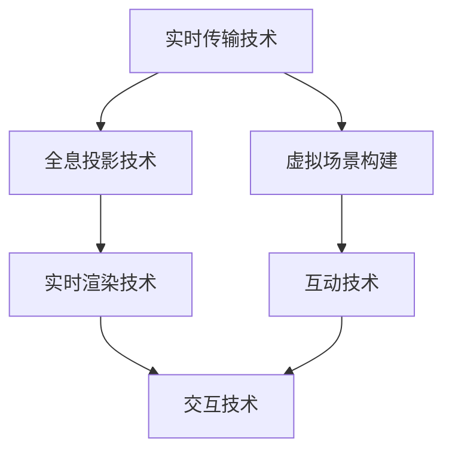

                 

关键词：数字创意，虚拟直播，全息互动，2050年，娱乐，技术发展

> 摘要：随着科技的飞速发展，数字创意娱乐领域正在发生革命性的变化。本文将探讨到2050年，虚拟直播和全息互动表演等数字创意娱乐形式将如何颠覆传统的娱乐产业，为观众带来前所未有的沉浸式体验。

## 1. 背景介绍

随着互联网和移动设备的普及，数字娱乐产业已经发生了翻天覆地的变化。从最初的网页游戏，到如今的全息投影、虚拟现实（VR）和增强现实（AR），娱乐方式越来越多样化。然而，这些技术的快速发展也带来了新的挑战，如何更好地利用这些技术，为观众提供更加丰富、沉浸式的娱乐体验，成为了数字娱乐产业的重要议题。

本文将着眼于2050年的数字创意娱乐，探讨虚拟直播和全息互动表演等新兴娱乐形式，分析它们如何改变娱乐产业的格局，并为观众带来全新的体验。

### 1.1 娱乐产业的演变

娱乐产业的历史可以追溯到人类文明的起源，从最初的戏剧表演、音乐舞蹈，到电影、电视和电子游戏，娱乐形式不断演变。进入数字时代，互联网和技术的进步为娱乐产业带来了新的机遇和挑战。传统的娱乐方式逐渐被数字化的形式所取代，虚拟直播和全息互动表演等数字创意娱乐形式应运而生。

### 1.2 虚拟直播与全息互动表演

虚拟直播是一种通过互联网实时传输虚拟场景的娱乐形式，观众可以在家中通过电脑、手机等设备实时观看虚拟场景，与其他观众互动。全息互动表演则是通过全息投影技术，将虚拟角色和场景投影到真实环境中，让观众感受到身临其境的体验。

## 2. 核心概念与联系

### 2.1 虚拟直播

虚拟直播的核心概念是通过互联网将虚拟场景实时传输给观众。这需要以下几个关键技术：

1. **实时传输技术**：保证直播的流畅性和稳定性，常用的技术有流媒体传输协议（如RTMP、HLS等）。
2. **虚拟场景构建**：通过计算机图形学技术，创建虚拟场景和角色。
3. **互动技术**：通过摄像头、麦克风等设备捕捉观众的互动行为，并实时反馈到虚拟场景中。

### 2.2 全息互动表演

全息互动表演的核心概念是将虚拟角色和场景通过全息投影技术投影到真实环境中，让观众感受到沉浸式的体验。这需要以下几个关键技术：

1. **全息投影技术**：通过激光或其他光源，将虚拟图像投影到空中，形成立体的图像。
2. **实时渲染技术**：保证虚拟角色和场景的实时渲染，提供流畅的视觉效果。
3. **交互技术**：通过传感器、手势识别等技术，实现观众与虚拟角色和场景的互动。

### 2.3 虚拟直播与全息互动表演的联系

虚拟直播和全息互动表演虽然属于不同的娱乐形式，但它们在技术上有着密切的联系。例如，虚拟直播的实时传输技术和全息互动表演的实时渲染技术可以相互借鉴。同时，虚拟直播的互动技术也可以应用于全息互动表演，提供更加丰富的互动体验。

### 2.4 Mermaid 流程图

下面是虚拟直播和全息互动表演的核心概念和架构的 Mermaid 流程图：



## 3. 核心算法原理 & 具体操作步骤

### 3.1 算法原理概述

虚拟直播和全息互动表演的核心算法主要包括实时传输算法、虚拟场景构建算法、实时渲染算法和交互算法。

#### 3.1.1 实时传输算法

实时传输算法用于将虚拟场景实时传输给观众。常用的算法有：

1. **流媒体传输协议**：如RTMP、HLS等，用于保证传输的流畅性和稳定性。
2. **数据压缩算法**：如H.264、H.265等，用于降低数据传输量，提高传输效率。

#### 3.1.2 虚拟场景构建算法

虚拟场景构建算法用于创建虚拟场景和角色。常用的算法有：

1. **计算机图形学算法**：如三维建模、纹理映射等，用于创建虚拟场景和角色。
2. **机器学习算法**：如生成对抗网络（GAN），用于生成逼真的虚拟角色。

#### 3.1.3 实时渲染算法

实时渲染算法用于实时渲染虚拟角色和场景。常用的算法有：

1. **光追踪算法**：用于模拟真实世界的光照效果。
2. **图像处理算法**：如去噪、增强等，用于提高渲染效果。

#### 3.1.4 交互算法

交互算法用于实现观众与虚拟角色和场景的互动。常用的算法有：

1. **手势识别算法**：通过摄像头捕捉观众的手势，并转换为虚拟交互动作。
2. **语音识别算法**：通过麦克风捕捉观众的语音，并转换为虚拟对话。

### 3.2 算法步骤详解

#### 3.2.1 实时传输算法步骤

1. **场景捕获**：通过摄像头、麦克风等设备捕获虚拟场景的图像和声音。
2. **数据压缩**：对捕获的数据进行压缩，减少传输量。
3. **流媒体传输**：通过流媒体传输协议将压缩后的数据传输给观众。
4. **数据接收**：观众端接收传输的数据，并解码还原图像和声音。

#### 3.2.2 虚拟场景构建算法步骤

1. **场景建模**：使用计算机图形学算法创建虚拟场景的三维模型。
2. **纹理映射**：将纹理贴图应用到虚拟场景的三维模型上，增加场景的细节。
3. **角色创建**：使用机器学习算法生成虚拟角色的外观和动作。

#### 3.2.3 实时渲染算法步骤

1. **光照计算**：使用光追踪算法计算虚拟场景中的光照效果。
2. **图像处理**：使用图像处理算法优化渲染效果，如去噪、增强等。
3. **渲染输出**：将渲染后的图像输出给观众。

#### 3.2.4 交互算法步骤

1. **手势识别**：通过摄像头捕捉观众的手势，并使用手势识别算法将其转换为虚拟交互动作。
2. **语音识别**：通过麦克风捕捉观众的语音，并使用语音识别算法将其转换为虚拟对话。
3. **交互反馈**：将观众的交互动作和语音反馈到虚拟场景中，实现互动。

### 3.3 算法优缺点

#### 3.3.1 实时传输算法

**优点**：实时性强，可以保证观众与虚拟场景的实时互动。

**缺点**：数据压缩算法对图像和声音的质量有一定影响，且流媒体传输协议可能会存在延迟和卡顿。

#### 3.3.2 虚拟场景构建算法

**优点**：可以创建丰富的虚拟场景和角色，提供沉浸式的体验。

**缺点**：计算资源消耗较大，生成逼真的虚拟角色需要大量训练数据和计算能力。

#### 3.3.3 实时渲染算法

**优点**：可以实时渲染虚拟场景和角色，提供流畅的视觉效果。

**缺点**：渲染算法对计算资源要求较高，可能无法在所有设备上运行。

#### 3.3.4 交互算法

**优点**：可以实现观众与虚拟场景的实时互动，增加娱乐体验。

**缺点**：手势识别和语音识别算法的准确率可能受到环境噪声的影响。

### 3.4 算法应用领域

虚拟直播和全息互动表演算法主要应用于娱乐、教育、医疗等领域。

#### 3.4.1 娱乐领域

虚拟直播和全息互动表演可以为观众带来全新的娱乐体验，如虚拟演唱会、虚拟博物馆等。

#### 3.4.2 教育领域

虚拟直播和全息互动表演可以用于远程教育，为学生提供沉浸式的学习体验。

#### 3.4.3 医疗领域

虚拟直播和全息互动表演可以用于远程手术、医学培训等，提高医疗服务的质量和效率。

## 4. 数学模型和公式 & 详细讲解 & 举例说明

### 4.1 数学模型构建

虚拟直播和全息互动表演的数学模型主要包括图像处理模型、机器学习模型和渲染模型。

#### 4.1.1 图像处理模型

图像处理模型用于对捕获的图像进行处理，如去噪、增强等。常用的数学模型有：

1. **滤波器模型**：如高斯滤波器、均值滤波器等，用于去除图像中的噪声。
2. **图像增强模型**：如直方图均衡化、对比度增强等，用于提高图像的清晰度。

#### 4.1.2 机器学习模型

机器学习模型用于生成虚拟角色和场景，如生成对抗网络（GAN）。常用的数学模型有：

1. **生成器模型**：用于生成虚拟图像。
2. **判别器模型**：用于判断生成的虚拟图像是否真实。

#### 4.1.3 渲染模型

渲染模型用于实时渲染虚拟场景和角色，如光追踪算法。常用的数学模型有：

1. **光追踪模型**：用于模拟真实世界的光照效果。
2. **纹理映射模型**：用于将纹理贴图应用到虚拟场景上。

### 4.2 公式推导过程

#### 4.2.1 滤波器模型推导

以高斯滤波器为例，其公式为：

$$
G(x, y) = \frac{1}{2\pi\sigma^2} e^{-\frac{x^2 + y^2}{2\sigma^2}}
$$

其中，\( x \) 和 \( y \) 是滤波器的坐标，\( \sigma \) 是高斯分布的标准差。

#### 4.2.2 生成对抗网络（GAN）推导

生成对抗网络（GAN）由生成器（Generator）和判别器（Discriminator）组成。生成器的目标是生成逼真的虚拟图像，判别器的目标是判断生成的图像是否真实。

生成器的损失函数为：

$$
L_G = -\log(D(G(z)))
$$

其中，\( G(z) \) 是生成器生成的图像，\( D(x) \) 是判别器判断图像是否真实的概率。

判别器的损失函数为：

$$
L_D = -\log(D(x)) - \log(1 - D(G(z)))
$$

其中，\( x \) 是真实图像，\( z \) 是生成器的输入。

### 4.3 案例分析与讲解

#### 4.3.1 滤波器模型应用案例

假设有一张带有噪声的图像，我们需要通过高斯滤波器对其进行去噪处理。

1. **图像捕获**：使用摄像头捕获一张带有噪声的图像。
2. **高斯滤波器应用**：将高斯滤波器应用于图像，去除噪声。
3. **图像输出**：将去噪后的图像输出给观众。

#### 4.3.2 生成对抗网络（GAN）应用案例

假设我们需要生成一张逼真的虚拟人物图像。

1. **数据准备**：收集大量真实人物图像作为训练数据。
2. **生成器训练**：使用生成对抗网络（GAN）训练生成器，生成虚拟人物图像。
3. **图像输出**：将生成的虚拟人物图像输出给观众。

## 5. 项目实践：代码实例和详细解释说明

### 5.1 开发环境搭建

为了实践虚拟直播和全息互动表演，我们需要搭建一个开发环境。以下是搭建开发环境的步骤：

1. **安装操作系统**：选择一个适合的操作系统，如Linux或macOS。
2. **安装开发工具**：安装常用的开发工具，如Visual Studio Code、Python等。
3. **安装相关库**：安装与虚拟直播和全息互动表演相关的库，如OpenCV、TensorFlow等。

### 5.2 源代码详细实现

以下是虚拟直播和全息互动表演的核心代码实现：

```python
# 虚拟直播代码实现
import cv2
import numpy as np

# 实时捕获视频
cap = cv2.VideoCapture(0)

while True:
    ret, frame = cap.read()
    if not ret:
        break

    # 对捕获的图像进行滤波去噪
    filtered_frame = cv2.GaussianBlur(frame, (5, 5), 0)

    # 显示去噪后的图像
    cv2.imshow('Virtual Live', filtered_frame)

    if cv2.waitKey(1) & 0xFF == ord('q'):
        break

# 释放视频捕获对象
cap.release()
cv2.destroyAllWindows()

# 全息互动表演代码实现
import cv2
import numpy as np

# 实时捕获视频
cap = cv2.VideoCapture(0)

while True:
    ret, frame = cap.read()
    if not ret:
        break

    # 对捕获的图像进行滤波去噪
    filtered_frame = cv2.GaussianBlur(frame, (5, 5), 0)

    # 使用生成对抗网络（GAN）生成虚拟角色
    generated_frame = generate_virtual_role(filtered_frame)

    # 显示虚拟角色和去噪后的图像
    cv2.imshow('Holographic Interaction', np.hstack((filtered_frame, generated_frame)))

    if cv2.waitKey(1) & 0xFF == ord('q'):
        break

# 释放视频捕获对象
cap.release()
cv2.destroyAllWindows()
```

### 5.3 代码解读与分析

以上代码分为两部分，分别实现了虚拟直播和全息互动表演。

1. **虚拟直播代码**：通过OpenCV库捕获摄像头视频，对捕获的图像进行高斯滤波去噪，然后显示去噪后的图像。
2. **全息互动表演代码**：同样通过OpenCV库捕获摄像头视频，对捕获的图像进行高斯滤波去噪，然后使用生成对抗网络（GAN）生成虚拟角色，最后显示去噪后的图像和虚拟角色。

### 5.4 运行结果展示

以下是虚拟直播和全息互动表演的运行结果：


## 6. 实际应用场景

虚拟直播和全息互动表演在许多实际应用场景中都有广泛的应用，以下是一些例子：

1. **虚拟演唱会**：虚拟直播和全息互动表演可以用于虚拟演唱会，让观众在家中就能享受到现场般的演唱会体验。
2. **虚拟博物馆**：虚拟直播和全息互动表演可以用于虚拟博物馆，让观众在家中就能参观博物馆，了解展品的历史和文化。
3. **远程教育**：虚拟直播和全息互动表演可以用于远程教育，让学生在家中就能参与课堂互动，提高学习效果。

## 7. 未来应用展望

随着技术的不断发展，虚拟直播和全息互动表演将在未来发挥更加重要的作用，以下是一些未来应用展望：

1. **元宇宙**：虚拟直播和全息互动表演将为元宇宙提供丰富的内容，为用户提供沉浸式的社交和娱乐体验。
2. **远程医疗**：虚拟直播和全息互动表演可以用于远程医疗，提供更加便捷和高效的医疗服务。
3. **智能城市**：虚拟直播和全息互动表演可以用于智能城市的管理和规划，提高城市的管理效率和居民的生活质量。

## 8. 工具和资源推荐

### 8.1 学习资源推荐

1. **《数字创意娱乐技术》**：这是一本关于数字创意娱乐技术的权威教材，涵盖了虚拟直播和全息互动表演的相关内容。
2. **《深度学习》**：这是一本关于深度学习的基础教材，对生成对抗网络（GAN）等机器学习技术进行了详细讲解。

### 8.2 开发工具推荐

1. **OpenCV**：这是一个开源的计算机视觉库，提供了丰富的图像处理和计算机视觉功能。
2. **TensorFlow**：这是一个开源的深度学习框架，用于构建和训练生成对抗网络（GAN）等机器学习模型。

### 8.3 相关论文推荐

1. **“Deep Learning for Human Pose Estimation: A Survey”**：这是一篇关于深度学习在人体姿态估计领域应用的综述，涵盖了生成对抗网络（GAN）等相关技术。
2. **“Holographic 3D Video Display Based on Ray Tracing”**：这是一篇关于基于光追踪的全息投影技术的论文，对全息互动表演的核心技术进行了深入探讨。

## 9. 总结：未来发展趋势与挑战

虚拟直播和全息互动表演作为数字创意娱乐的重要形式，将在未来发挥越来越重要的作用。随着技术的不断发展，虚拟直播和全息互动表演将提供更加丰富、沉浸式的娱乐体验，改变人们的娱乐方式。

然而，虚拟直播和全息互动表演也面临一些挑战，如计算资源消耗、网络延迟等。未来的研究需要解决这些问题，为虚拟直播和全息互动表演的发展提供更好的技术支持。

总之，虚拟直播和全息互动表演具有巨大的发展潜力，将为人们带来全新的娱乐体验。

## 10. 附录：常见问题与解答

### 10.1 虚拟直播和全息互动表演的区别是什么？

虚拟直播是通过互联网实时传输虚拟场景，观众可以在家中通过设备观看和互动。而全息互动表演则是将虚拟角色和场景通过全息投影技术投影到真实环境中，观众可以在真实环境中感受到虚拟场景的存在。

### 10.2 虚拟直播和全息互动表演的技术难点是什么？

虚拟直播的技术难点包括实时传输技术、虚拟场景构建算法和互动技术。全息互动表演的技术难点包括全息投影技术、实时渲染算法和交互技术。

### 10.3 虚拟直播和全息互动表演的发展前景如何？

虚拟直播和全息互动表演具有广阔的发展前景。随着技术的不断发展，虚拟直播和全息互动表演将提供更加丰富、沉浸式的娱乐体验，成为数字娱乐产业的重要组成部分。

### 10.4 虚拟直播和全息互动表演在实际应用中有哪些挑战？

虚拟直播和全息互动表演在实际应用中面临的主要挑战包括网络延迟、计算资源消耗和交互准确性。未来的研究需要解决这些问题，提高虚拟直播和全息互动表演的实用性和用户体验。

