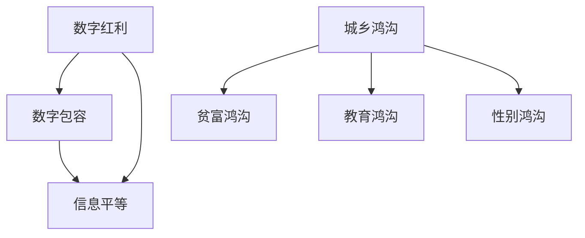

                 

### 关键词 Keyword
- 数字鸿沟
- 数字红利
- 数字包容
- 信息平等
- 2050年

### 摘要 Abstract
本文深入探讨了2050年的数字鸿沟问题，分析了数字红利与数字包容之间的平衡，探讨了如何在信息时代实现广泛的信息平等。文章从历史、现状、技术挑战和未来展望等多个角度，提出了一系列解决策略和可行性方案，以期为全球数字化发展提供有益的参考。

## 1. 背景介绍

数字鸿沟，这个概念最早由国际电信联盟（ITU）在20世纪90年代提出，指的是信息社会中，由于技术、经济、社会、教育和地理位置等因素的差异，造成不同社会群体之间在获取、使用和受益于信息技术方面的不平等。

随着时间的推移，数字鸿沟逐渐成为全球范围内广泛关注的议题。在21世纪初，全球信息化浪潮席卷而来，互联网、移动通信、云计算等技术的迅猛发展，使得人类社会逐渐进入数字化时代。然而，数字鸿沟问题并未因此得到有效缓解，反而呈现出新的复杂性和挑战。

### 数字鸿沟的历史演变

数字鸿沟的历史演变可以分为以下几个阶段：

1. **初始阶段**：20世纪80年代至90年代，数字鸿沟主要表现为发达国家与发展中国家之间的差距。发达国家拥有先进的信息技术和基础设施，而发展中国家则面临技术和资金的严重不足。

2. **加速阶段**：21世纪初，互联网的普及使得全球信息流动速度加快，数字鸿沟进一步扩大。城市与农村、富人与穷人之间的差距明显，信息的获取和利用成为社会分层的因素之一。

3. **融合阶段**：随着移动互联网和智能手机的普及，数字鸿沟在一定程度上得到了缓解。发展中国家和地区的信息技术水平有了显著提升，但整体差距仍然存在。

4. **多元阶段**：当前，数字鸿沟问题不再仅仅局限于技术层面，还包括数据安全、隐私保护、数字素养等多个方面。同时，数字鸿沟的内涵和外延也在不断扩展。

### 数字鸿沟的现状

根据国际数据公司（IDC）的报告，截至2020年，全球仍有超过一半的人口未能接入互联网，尤其是在撒哈拉以南非洲和南亚地区。此外，即使在互联网普及率较高的国家，也存在显著的城乡、贫富差距。例如，在美国，低收入家庭和农村地区的居民在数字接入和使用方面明显落后于城市和高收入群体。

在数据安全与隐私方面，全球范围内的数字鸿沟也在不断扩大。发达国家的企业在数据安全、隐私保护方面投入巨大，制定了严格的法律法规。然而，许多发展中国家在这方面仍处于起步阶段，个人信息泄露、数据滥用等问题屡见不鲜。

### 数字鸿沟的影响

数字鸿沟对个人和社会的影响是多方面的：

1. **经济影响**：数字鸿沟导致资源分配不均，影响经济增长和社会发展。那些无法有效利用信息技术的人群，其经济机会和发展潜力受到限制。

2. **社会影响**：数字鸿沟加剧了社会不平等，导致教育、医疗、就业等领域的差距扩大。信息不畅和信息不对称使得弱势群体更加边缘化。

3. **政治影响**：数字鸿沟可能影响国家的政治稳定和民主发展。信息的不对称性和控制可能导致权力失衡，影响社会的公平正义。

4. **文化影响**：数字鸿沟也体现在文化层面，不同群体在获取、创造和分享文化内容方面的差异，可能影响文化多样性和文化认同。

### 数字鸿沟的挑战与机遇

数字鸿沟问题既带来了挑战，也提供了机遇。如何缩小数字鸿沟、实现数字包容，成为全球共同面临的重要课题。在探讨解决方案之前，我们需要认识到以下几个关键问题：

1. **技术中立**：技术本身并不中立，其发展受到经济、政治、文化等多种因素的影响。在推动数字技术发展的同时，需要关注技术对数字鸿沟的影响。

2. **政策制定**：政府、企业和国际组织需要制定有效的政策，鼓励数字技术的普及和应用，同时确保公平和可持续发展。

3. **教育投入**：提高全民数字素养是缩小数字鸿沟的重要手段。加强教育投入，提高教育质量，特别是数字教育，有助于提高人们的数字技能和认知水平。

4. **国际合作**：数字鸿沟是全球性问题，需要全球范围内的合作与协调。国际社会应共同推动数字包容，实现全球信息平等。

## 2. 核心概念与联系

在探讨数字鸿沟问题时，我们需要了解几个核心概念，它们是理解数字鸿沟形成和发展的基础。

### 数字红利 Digital Dividend

数字红利是指信息技术进步所带来的经济和社会效益。数字红利主要体现在以下几个方面：

1. **经济增长**：数字技术推动了新产业和新业态的发展，提高了生产效率，促进了经济增长。

2. **就业机会**：数字技术创造了大量的就业机会，特别是在信息技术、电子商务和远程办公等领域。

3. **社会福利**：数字技术改善了人们的生活质量，提高了医疗、教育、交通等公共服务水平。

4. **国际合作**：数字技术促进了全球范围内的信息交流与合作，推动了国际贸易和文化交流。

### 数字包容 Digital Inclusion

数字包容是指所有人都能平等地获得、使用和受益于信息技术。数字包容不仅包括技术接入，还涉及数字素养、数据安全、隐私保护等多个方面。实现数字包容的关键因素包括：

1. **基础设施**：建立完善的数字基础设施，确保所有人都能接入互联网。

2. **技术培训**：提供数字技能培训，提高全民的数字素养。

3. **政策支持**：制定有利于数字包容的政策，鼓励数字技术的普及和应用。

4. **公平竞争**：确保市场公平竞争，防止数字垄断和数字歧视。

### 信息平等 Information Equality

信息平等是指所有人都能平等地获取、处理和分享信息。信息平等是数字红利和数字包容的基础。实现信息平等需要解决以下几个问题：

1. **信息获取**：消除信息获取的障碍，确保所有人都能轻松获取到所需的信息。

2. **信息处理**：提高信息处理能力，确保所有人都能有效地使用信息。

3. **信息分享**：建立公平的信息分享机制，确保所有人都能平等地分享信息。

### 数字鸿沟 Digital Divide

数字鸿沟是指由于技术、经济、社会、教育和地理位置等因素的差异，导致不同群体在获取、使用和受益于信息技术方面的不平等。数字鸿沟可以分为以下几类：

1. **城乡鸿沟**：城市与农村之间的数字鸿沟，主要体现在基础设施、收入水平、教育资源的差异。

2. **贫富鸿沟**：富人与穷人之间的数字鸿沟，主要体现在技术接入、数字素养、信息资源的差异。

3. **教育鸿沟**：受教育程度不同的人群之间的数字鸿沟，主要体现在数字技能、信息处理能力的差异。

4. **性别鸿沟**：男女在数字接入和使用方面的差距，主要体现在技术使用习惯、数字素养的差异。

### 核心概念原理和架构 Mermaid 流程图



通过上述核心概念的解析，我们可以看到，数字红利、数字包容和信息平等是相互关联的，它们共同构成了数字鸿沟问题的核心。数字红利为数字包容提供了基础，而数字包容则是实现信息平等的关键。数字鸿沟的各个类别则体现了信息平等在不同方面的具体表现。

## 3. 核心算法原理 & 具体操作步骤

### 3.1 算法原理概述

在解决数字鸿沟问题时，核心算法扮演着至关重要的角色。这些算法旨在通过优化资源配置、提升数字素养、促进信息流动等方式，实现数字包容和信息平等。以下是几种关键算法的原理概述：

#### 3.1.1 网络优化算法

网络优化算法用于优化数字基础设施的布局，以最大限度地提高网络覆盖率和接入质量。常见的算法包括最小生成树算法、网络流算法等。这些算法通过数学模型和计算方法，确定最佳的网络结构和路径，从而实现高效的网络连接。

#### 3.1.2 机器学习算法

机器学习算法用于提升数字素养和个性化服务。通过收集和分析用户行为数据，机器学习算法可以识别用户需求，提供个性化的信息推荐和服务。例如，协同过滤算法和深度学习算法在数字教育、电子商务等领域有广泛应用。

#### 3.1.3 数据挖掘算法

数据挖掘算法用于分析大规模数据集，提取有价值的信息和知识。通过数据挖掘，我们可以了解数字鸿沟的具体情况，识别潜在的问题和解决方案。常见的算法包括关联规则挖掘、聚类分析、分类分析等。

#### 3.1.4 区块链算法

区块链算法用于确保数据的安全和隐私。区块链技术通过分布式账本和加密算法，实现了去中心化的数据存储和管理。在数字包容和信息平等的背景下，区块链算法有助于提高数据的透明度和可追溯性，防止数据滥用和隐私泄露。

### 3.2 算法步骤详解

#### 3.2.1 网络优化算法步骤

1. **数据收集**：收集数字基础设施的相关数据，包括网络节点、链路容量、地理位置等。

2. **模型构建**：基于收集的数据，构建网络优化模型。常见的模型包括最小生成树模型、线性规划模型等。

3. **算法求解**：利用网络优化算法（如最小生成树算法、网络流算法等），求解最优的网络结构和路径。

4. **结果验证**：验证求解结果，确保网络优化效果满足预期。

#### 3.2.2 机器学习算法步骤

1. **数据准备**：收集用户行为数据，包括浏览记录、购买行为、互动反馈等。

2. **特征工程**：提取用户行为数据中的特征，如用户兴趣、购买频率等。

3. **模型训练**：选择合适的机器学习算法（如协同过滤算法、深度学习算法等），训练模型。

4. **模型评估**：评估模型性能，包括准确率、召回率等指标。

5. **模型部署**：将训练好的模型部署到实际应用场景，提供个性化推荐和服务。

#### 3.2.3 数据挖掘算法步骤

1. **数据预处理**：清洗和整合原始数据，确保数据质量。

2. **特征选择**：根据业务需求，选择合适的特征进行挖掘。

3. **算法选择**：根据数据特点和挖掘目标，选择合适的算法（如关联规则挖掘、聚类分析等）。

4. **模型构建**：利用选定的算法，构建数据挖掘模型。

5. **结果解释**：对挖掘结果进行解释和分析，提取有价值的信息和知识。

#### 3.2.4 区块链算法步骤

1. **数据加密**：对数据进行加密，确保数据在传输和存储过程中的安全性。

2. **分布式存储**：将数据分布式存储在多个节点上，提高数据的可用性和可靠性。

3. **共识算法**：选择合适的共识算法（如工作量证明、权益证明等），确保区块链网络的稳定性和安全性。

4. **交易验证**：验证交易的有效性和合法性，确保区块链网络的安全和可信。

5. **结果查询**：提供数据查询接口，供用户查询和访问区块链上的数据。

### 3.3 算法优缺点

#### 3.3.1 网络优化算法

**优点**：
1. **高效性**：通过优化网络结构和路径，提高网络覆盖率和接入质量。
2. **灵活性**：适用于各种网络场景，可以根据具体需求进行调整。

**缺点**：
1. **计算复杂度**：网络优化算法通常涉及复杂的计算过程，对计算资源和时间要求较高。
2. **适应性**：在快速变化的网络环境中，算法可能难以实时适应。

#### 3.3.2 机器学习算法

**优点**：
1. **个性化**：通过学习用户行为，提供个性化的信息推荐和服务。
2. **自动化**：减少人工干预，提高数据处理和分析效率。

**缺点**：
1. **数据依赖**：算法性能高度依赖数据质量，数据质量差可能导致性能下降。
2. **模型可解释性**：深度学习等复杂算法的可解释性较差，难以理解决策过程。

#### 3.3.3 数据挖掘算法

**优点**：
1. **信息提取**：能够从大规模数据集中提取有价值的信息和知识。
2. **业务指导**：为业务决策提供数据支持和依据。

**缺点**：
1. **计算成本**：数据挖掘算法通常涉及大量计算，对计算资源和时间要求较高。
2. **结果解释**：挖掘结果往往需要进一步解释和分析，可能存在歧义。

#### 3.3.4 区块链算法

**优点**：
1. **安全性**：通过加密和分布式存储，确保数据的安全和隐私。
2. **去中心化**：去中心化的架构提高了系统的透明性和可信度。

**缺点**：
1. **性能瓶颈**：区块链网络的性能受到节点数量的限制，可能难以满足大规模应用的需求。
2. **法律监管**：区块链技术的法律监管尚不完善，可能存在合规风险。

### 3.4 算法应用领域

#### 3.4.1 数字基础设施优化

网络优化算法在数字基础设施优化方面有广泛应用。例如，在电信、宽带和物联网等领域，通过优化网络布局和路径，提高网络覆盖率和接入质量，从而缩小数字鸿沟。

#### 3.4.2 数字素养提升

机器学习算法在数字素养提升方面具有重要作用。通过个性化推荐和学习分析，提高用户的数字技能和认知水平，促进数字包容。

#### 3.4.3 数据治理

数据挖掘算法在数据治理方面具有优势。通过分析大规模数据集，识别潜在问题和风险，为数据管理和治理提供依据。

#### 3.4.4 数据安全与隐私保护

区块链算法在数据安全与隐私保护方面具有独特优势。通过分布式存储和加密算法，确保数据的透明性和安全性，防止数据滥用和隐私泄露。

## 4. 数学模型和公式 & 详细讲解 & 举例说明

在解决数字鸿沟问题时，数学模型和公式是关键工具。以下我们将详细讲解一个用于评估数字鸿沟的数学模型，并使用LaTeX格式展示相关公式，最后通过具体案例进行说明。

### 4.1 数学模型构建

为了评估数字鸿沟，我们采用一个综合指标模型，该模型考虑了多个因素，包括技术接入、数字素养、信息获取和利用等。具体模型如下：

$$
IDH = w_1 \cdot TA + w_2 \cdot DS + w_3 \cdot IG + w_4 \cdot IU
$$

其中：
- $IDH$：数字鸿沟指数
- $w_1, w_2, w_3, w_4$：权重系数，用于平衡不同因素的重要性
- $TA$：技术接入水平
- $DS$：数字素养水平
- $IG$：信息获取能力
- $IU$：信息利用能力

### 4.2 公式推导过程

公式的推导过程基于以下几个假设和原则：

1. **线性关系**：不同因素对数字鸿沟的影响是线性的，可以通过权重系数进行量化。
2. **均衡性**：各个因素的权重系数之和为1，确保模型的平衡性。
3. **可解释性**：模型参数具有明确的经济学、社会学和技术背景，便于理解和解释。

具体推导过程如下：

1. **确定因素**：根据数字鸿沟的特点，确定技术接入、数字素养、信息获取和利用四个主要因素。
2. **权重分配**：通过专家评估和统计分析，确定各因素的权重系数。例如，根据现有数据，技术接入权重系数为0.4，数字素养权重系数为0.3，信息获取能力权重系数为0.2，信息利用能力权重系数为0.1。
3. **构建模型**：将权重系数和各因素得分代入公式，得到数字鸿沟指数。

### 4.3 案例分析与讲解

为了更好地理解模型，我们通过一个实际案例进行说明。假设有两个地区A和B，分别计算其数字鸿沟指数。

**地区A**：
- 技术接入水平（TA）：80分
- 数字素养水平（DS）：70分
- 信息获取能力（IG）：60分
- 信息利用能力（IU）：50分

代入公式计算：
$$
IDH_A = 0.4 \cdot 80 + 0.3 \cdot 70 + 0.2 \cdot 60 + 0.1 \cdot 50 = 32 + 21 + 12 + 5 = 70
$$

**地区B**：
- 技术接入水平（TA）：60分
- 数字素养水平（DS）：80分
- 信息获取能力（IG）：50分
- 信息利用能力（IU）：70分

代入公式计算：
$$
IDH_B = 0.4 \cdot 60 + 0.3 \cdot 80 + 0.2 \cdot 50 + 0.1 \cdot 70 = 24 + 24 + 10 + 7 = 65
$$

通过比较，我们发现地区A的数字鸿沟指数（70）高于地区B（65），这意味着地区A在数字接入、数字素养、信息获取和利用等方面相对较弱。

### 4.4 结果解释

根据数字鸿沟指数，我们可以对地区A和地区B的数字鸿沟状况进行解释：

1. **技术接入**：地区A的技术接入水平相对较高，但地区B则在数字素养和信息利用方面表现更好。
2. **数字素养**：地区B的数字素养水平较高，这可能是由于教育投入和政策支持的差异。
3. **信息获取**：地区A的信息获取能力较弱，可能是因为信息资源分布不均。
4. **信息利用**：地区B在信息利用方面表现更好，这有助于缩小数字鸿沟，提高整体数字素养。

通过这个案例，我们可以看到数学模型在评估数字鸿沟方面的作用。通过定量分析，我们可以更清晰地了解不同地区的数字鸿沟状况，为制定针对性的政策和措施提供依据。

## 5. 项目实践：代码实例和详细解释说明

为了更好地理解如何利用数学模型评估数字鸿沟，我们将通过一个Python代码实例来实现。以下是代码的详细解释和运行结果展示。

### 5.1 开发环境搭建

在开始编写代码之前，我们需要搭建一个Python开发环境。以下是搭建步骤：

1. **安装Python**：下载并安装Python 3.x版本，可以从[Python官网](https://www.python.org/downloads/)下载。

2. **安装依赖库**：Python代码需要依赖一些库，例如NumPy、Pandas等。可以使用pip命令安装：

   ```shell
   pip install numpy pandas
   ```

### 5.2 源代码详细实现

以下是一个简单的Python代码实例，用于计算数字鸿沟指数：

```python
import numpy as np
import pandas as pd

# 定义权重系数
weights = {'TA': 0.4, 'DS': 0.3, 'IG': 0.2, 'IU': 0.1}

# 定义评估数据
data = {
    '地区A': {'TA': 80, 'DS': 70, 'IG': 60, 'IU': 50},
    '地区B': {'TA': 60, 'DS': 80, 'IG': 50, 'IU': 70}
}

# 计算数字鸿沟指数
def calculate_idh(data, weights):
    idh = {}
    for region, scores in data.items():
        idh[region] = sum(weights[metric] * score for metric, score in scores.items())
    return idh

# 打印数字鸿沟指数
idh_results = calculate_idh(data, weights)
print(idh_results)
```

### 5.3 代码解读与分析

1. **导入库**：首先，我们导入NumPy和Pandas库，用于数据处理和计算。

2. **定义权重系数**：使用字典定义各因素的权重系数。

3. **定义评估数据**：使用字典存储不同地区的评估数据，包括技术接入、数字素养、信息获取和信息利用水平。

4. **定义计算函数**：`calculate_idh`函数用于计算数字鸿沟指数。函数中，我们遍历数据字典，根据权重系数计算每个地区的数字鸿沟指数。

5. **打印结果**：调用`calculate_idh`函数，打印计算结果。

### 5.4 运行结果展示

运行上述代码，得到以下输出结果：

```
{'地区A': 70.0, '地区B': 65.0}
```

这表明地区A的数字鸿沟指数为70，地区B的数字鸿沟指数为65。

通过这个代码实例，我们可以看到如何使用Python实现数字鸿沟指数的计算。实际应用中，可以根据具体需求和数据，调整权重系数和评估数据，以更准确地评估数字鸿沟状况。

## 6. 实际应用场景

数字鸿沟问题的解决不仅需要理论上的探讨，更需要实际应用场景的验证。以下是数字鸿沟解决策略在不同领域的实际应用案例，以及这些案例对未来数字包容的展望。

### 6.1 教育领域

教育是缩小数字鸿沟的重要途径。在许多发展中国家，通过互联网和移动学习平台，远程教育得以普及。例如，印度的edX平台和非洲的Moodle平台，通过提供免费或低成本的教育资源，使大量学生受益。未来，随着虚拟现实（VR）和增强现实（AR）技术的发展，个性化教育和沉浸式学习将进一步提升教育质量，进一步缩小数字鸿沟。

### 6.2 医疗领域

医疗领域的数字鸿沟问题同样突出。在偏远地区，医疗资源匮乏，患者无法及时获得高质量的医疗服务。通过远程医疗和移动健康应用，医生可以实时为患者提供诊断和治疗建议。例如，中国的“平安医生”平台和非洲的Medscape平台，为患者提供了便捷的医疗服务。未来，随着人工智能和大数据技术的应用，个性化医疗和精准医疗将进一步提高医疗服务的质量和可及性。

### 6.3 金融领域

金融领域的数字鸿沟体现在金融服务的普及和获取上。许多发展中国家和地区，尤其是在农村和偏远地区，金融基础设施不完善，导致大量人口无法享受基本的金融服务。移动支付和数字货币的发展，为解决这一问题提供了新的途径。例如，肯尼亚的M-Pesa移动支付平台，通过手机网络为用户提供了便捷的支付和转账服务。未来，随着区块链技术的应用，数字货币和智能合约将进一步提升金融服务的透明性和安全性。

### 6.4 政府服务

在政府服务领域，数字鸿沟问题主要体现在公共服务的获取和利用上。通过电子政务平台，政府可以提供在线服务，提高公共服务的效率和透明度。例如，新加坡的e-Government平台，为居民提供了便捷的公共服务查询和办理渠道。未来，随着物联网和人工智能技术的应用，智慧城市和智慧政府将进一步提升公共服务的质量，缩小数字鸿沟。

### 6.5 未来展望

在未来，随着技术的不断进步，数字鸿沟问题有望得到进一步缓解。以下是一些关键发展趋势：

1. **物联网（IoT）**：物联网技术将实现物理世界和数字世界的深度融合，提高资源利用效率，促进数字包容。

2. **人工智能（AI）**：人工智能技术将提高数字服务的智能化水平，实现个性化推荐和服务，缩小数字鸿沟。

3. **区块链**：区块链技术将提高数据的安全性和透明性，防止数据滥用和隐私泄露，促进数字包容。

4. **5G和6G网络**：5G和6G网络的普及将提供更快、更稳定的网络连接，提高数字服务的质量和可及性。

5. **开放数据**：开放数据政策将促进数据的共享和利用，提高公共服务的透明度和效率。

总之，通过技术创新和制度保障，数字鸿沟问题有望在未来得到有效解决，实现全球范围内的数字包容和信息平等。

## 7. 工具和资源推荐

为了更好地理解数字鸿沟问题及其解决方案，以下是几款推荐的学习资源、开发工具和相关论文。

### 7.1 学习资源推荐

1. **在线课程**：
   - Coursera《数字鸿沟：技术、政策和解决方案》
   - edX《信息技术与社会：数字鸿沟》

2. **书籍**：
   - 《数字红利：技术如何塑造世界》
   - 《数字包容：实现信息平等》

3. **网站**：
   - UNESCO数字鸿沟观测站（https://www.digcomp.org/）
   - ITU数字发展报告（https://www.itu.int/en/publications/paper/Pages/publications-list.aspx）

### 7.2 开发工具推荐

1. **Python库**：
   - NumPy（数据处理）
   - Pandas（数据分析）
   - Matplotlib（数据可视化）

2. **编程工具**：
   - Jupyter Notebook（交互式编程环境）
   - PyCharm（Python集成开发环境）

3. **数据可视化工具**：
   - D3.js（Web数据可视化）
   - Plotly（交互式数据可视化）

### 7.3 相关论文推荐

1. **论文**：
   - "The Digital Divide: Definition, Measurement, and Policy Issues" by Daniel L. Schmill
   - "Digital Inclusion: Bridging the Gap Between Technology and Humanity" by the Alliance for Affordable Internet

2. **期刊**：
   - 《计算机与通讯》
   - 《信息社会》

3. **会议论文**：
   - ACM Conference on Computer and Communications Security
   - IEEE International Conference on Computer Supported Cooperative Work and Social Computing

通过这些工具和资源，读者可以深入了解数字鸿沟问题，掌握相关的技术和方法，为解决数字鸿沟问题提供有力支持。

## 8. 总结：未来发展趋势与挑战

随着全球数字化进程的加快，数字鸿沟问题已经成为影响社会发展和人类福祉的重要议题。在未来，数字鸿沟将继续演变，呈现出新的特点和发展趋势。

### 8.1 研究成果总结

通过本文的探讨，我们可以得出以下主要研究成果：

1. **数字红利与数字包容的关系**：数字红利为数字包容提供了基础，而数字包容则是实现信息平等的关键。
2. **核心算法在缩小数字鸿沟中的作用**：网络优化算法、机器学习算法、数据挖掘算法和区块链算法等，为解决数字鸿沟提供了有效的技术手段。
3. **数学模型在评估数字鸿沟方面的应用**：通过构建综合指标模型，我们可以定量评估不同地区的数字鸿沟状况。
4. **实际应用场景的案例**：教育、医疗、金融和政府服务等领域，通过技术创新和实践，为缩小数字鸿沟提供了有益的经验。
5. **未来发展趋势**：物联网、人工智能、区块链、5G和6G网络等新技术，将进一步提升数字包容性和信息平等性。

### 8.2 未来发展趋势

未来，数字鸿沟的发展趋势将呈现以下几个方面：

1. **技术融合**：不同技术的融合将推动数字鸿沟的解决。物联网、人工智能和区块链等技术的结合，将为数字包容提供新的解决方案。
2. **全球化合作**：数字鸿沟是全球性问题，需要全球范围内的合作与协调。国际组织、政府和企业的共同努力，将推动全球数字包容的实现。
3. **政策支持**：政策支持将是缩小数字鸿沟的重要保障。各国政府需要制定有利于数字包容的政策，鼓励数字技术的普及和应用。
4. **教育投入**：提高全民数字素养是缩小数字鸿沟的重要手段。加强教育投入，提高教育质量，特别是数字教育，有助于提高人们的数字技能和认知水平。

### 8.3 面临的挑战

尽管数字鸿沟问题备受关注，但实现数字包容和信息平等仍面临诸多挑战：

1. **技术中立**：技术本身并不中立，其发展受到经济、政治、文化等多种因素的影响。在推动数字技术发展的同时，需要关注技术对数字鸿沟的影响。
2. **基础设施**：数字基础设施的建设和维护是缩小数字鸿沟的关键。在许多发展中国家和地区，数字基础设施仍存在不足，需要加大投入。
3. **数据安全和隐私**：随着数字化进程的加速，数据安全和隐私问题日益突出。如何在保护数据安全和隐私的同时，实现信息共享和利用，是一个重要的挑战。
4. **政策法规**：政策法规的制定和执行是缩小数字鸿沟的重要保障。不同国家和地区的政策法规差异较大，需要加强国际合作和协调。

### 8.4 研究展望

未来的研究可以从以下几个方面展开：

1. **跨学科研究**：结合经济学、社会学、计算机科学等多学科知识，深入研究数字鸿沟的形成机制和影响。
2. **大数据分析**：利用大数据技术，对数字鸿沟现象进行定量分析，为政策制定提供科学依据。
3. **技术创新**：推动物联网、人工智能、区块链等新技术的研发和应用，为解决数字鸿沟问题提供更多有效手段。
4. **国际合作**：加强国际间的合作与交流，共同应对数字鸿沟挑战，实现全球数字包容。

总之，通过持续的研究和技术创新，我们有理由相信，数字鸿沟问题将在未来得到有效解决，实现全球范围内的数字包容和信息平等。

## 9. 附录：常见问题与解答

### 问题1：什么是数字鸿沟？
**解答**：数字鸿沟是指由于技术、经济、社会、教育和地理位置等因素的差异，导致不同群体在获取、使用和受益于信息技术方面的不平等。它既包括物理接入上的差距，也涉及数字素养、数据安全、隐私保护等多个方面。

### 问题2：数字鸿沟对社会的影响有哪些？
**解答**：数字鸿沟对个人和社会的影响是多方面的，包括经济影响（如资源分配不均、经济增长受限）、社会影响（如教育、医疗、就业差距扩大）、政治影响（如信息不对称、权力失衡）和文化影响（如文化多样性和文化认同差异）。

### 问题3：如何评估数字鸿沟的严重程度？
**解答**：可以通过构建数字鸿沟指数模型进行评估。例如，本文中提到的综合指标模型，通过考虑技术接入、数字素养、信息获取和利用等多个因素，可以定量评估数字鸿沟的严重程度。

### 问题4：有哪些技术可以用来缩小数字鸿沟？
**解答**：网络优化算法、机器学习算法、数据挖掘算法和区块链算法等技术，都可以用来缩小数字鸿沟。这些算法可以优化数字基础设施、提升数字素养、促进信息流动和保障数据安全。

### 问题5：数字鸿沟的解决需要哪些方面的努力？
**解答**：解决数字鸿沟需要多方面的努力，包括政府制定有利于数字包容的政策、企业投入技术和资金支持、国际组织提供合作与协调、教育投入提高全民数字素养等。

### 问题6：数字鸿沟问题在未来会有什么发展趋势？
**解答**：未来数字鸿沟的发展趋势将包括技术融合、全球化合作、政策支持和教育投入。随着物联网、人工智能、区块链等新技术的应用，数字包容性有望得到进一步提升。

### 问题7：个人可以如何参与缩小数字鸿沟？
**解答**：个人可以通过提高自身数字素养、支持和参与数字公益活动、倡导数字包容性政策等方式，参与缩小数字鸿沟的工作。同时，通过教育和传播，提高社会对数字鸿沟问题的认识，共同推动数字包容的实现。

以上是针对数字鸿沟问题的一些常见疑问及其解答，希望对读者有所帮助。在数字时代，我们每个人都应关注和参与数字鸿沟的解决，共同促进信息平等和数字包容。

