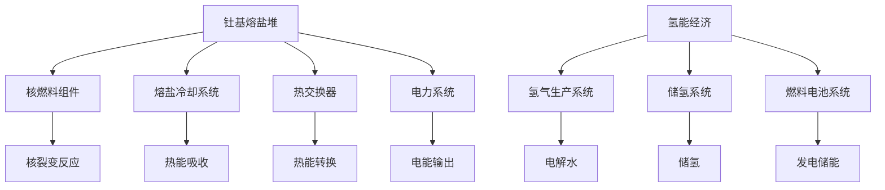

                 

关键词：能源革命、钍基熔盐堆、氢能经济、清洁能源、2050年、技术转型

摘要：本文将探讨2050年全球能源革命的走向，特别是钍基熔盐堆和氢能经济这两种新兴清洁能源技术的潜力。通过分析其原理、技术优势、挑战与应用领域，我们将展望这些技术如何引领未来能源市场的变革，为全球实现可持续发展的目标提供新思路。

## 1. 背景介绍

随着时间的推移，全球能源需求持续增长，与此同时，传统化石能源带来的环境问题和资源枯竭问题也日益凸显。为了应对这些挑战，世界各国纷纷寻求替代能源，力求实现能源结构优化和可持续发展。在这个过程中，钍基熔盐堆和氢能经济成为备受瞩目的两大清洁能源技术。

钍基熔盐堆（Thermal Salt Reactor，TSR）是一种第四代核能技术，通过使用熔盐作为冷却剂和燃料载体，具有高效、安全、环保等优点。而氢能经济则通过氢气的生产和利用，实现能源的高效转换和存储，为清洁能源的发展提供了新的解决方案。

## 2. 核心概念与联系

### 2.1 钍基熔盐堆

钍基熔盐堆的基本原理是将钍作为核燃料，通过核裂变反应产生热能。熔盐作为冷却剂和燃料载体，在反应过程中吸收热量，然后通过热交换器将热能转化为电能。其核心组成部分包括核燃料组件、熔盐冷却系统、热交换器和电力系统。

### 2.2 氢能经济

氢能经济的基本原理是通过可再生能源（如太阳能、风能等）电解水产生氢气，然后利用氢气作为燃料进行发电和储能。其核心组成部分包括氢气生产系统、储氢系统和燃料电池系统。

### 2.3 Mermaid 流程图

以下是钍基熔盐堆和氢能经济的 Mermaid 流程图：



## 3. 核心算法原理 & 具体操作步骤

### 3.1 算法原理概述

钍基熔盐堆的核燃料组件通过核裂变反应产生热能，熔盐冷却系统吸收热能并将其传递给热交换器，热交换器将热能转化为电能。氢能经济的氢气生产系统通过电解水产生氢气，储氢系统储存氢气，燃料电池系统利用氢气发电和储能。

### 3.2 算法步骤详解

#### 3.2.1 钍基熔盐堆

1. 核燃料组件中的钍进行核裂变反应，产生热能。
2. 熔盐冷却系统吸收热能。
3. 热交换器将热能转化为电能。
4. 电力系统输出电能。

#### 3.2.2 氢能经济

1. 氢气生产系统通过电解水产生氢气。
2. 储氢系统储存氢气。
3. 燃料电池系统利用氢气发电和储能。

### 3.3 算法优缺点

#### 钍基熔盐堆

**优点：**
- 高效：钍基熔盐堆具有较高的热电转换效率。
- 安全：熔盐冷却系统具有较高的热稳定性，能够有效防止核泄漏。
- 环保：钍资源丰富，且放射性较低，对环境污染较小。

**缺点：**
- 技术复杂：钍基熔盐堆技术相对较为复杂，建设成本较高。
- 储存和运输：熔盐和钍的储存和运输需要严格的安全措施。

#### 氢能经济

**优点：**
- 清洁：氢气燃烧后仅生成水，无污染。
- 可再生：氢气可以通过可再生能源电解水生产。
- 多用途：氢气可以作为燃料电池的燃料，应用于交通、储能等领域。

**缺点：**
- 储存和运输：氢气储存和运输需要高压或低温技术，成本较高。
- 生产和基础设施：氢气生产需要大规模可再生能源基础设施，建设周期较长。

### 3.4 算法应用领域

#### 钍基熔盐堆

- 发电：用于大规模电力生产。
- 热利用：用于工业、供暖等领域。

#### 氢能经济

- 交通：氢燃料电池汽车、火车等。
- 储能：分布式储能系统、电网备用储能。
- 工业应用：工业加热、化工生产等。

## 4. 数学模型和公式 & 详细讲解 & 举例说明

### 4.1 数学模型构建

#### 4.1.1 钍基熔盐堆

- 热能产出模型：\(Q = \lambda A \cdot T\)

其中，\(Q\) 为热能产出，\(\lambda\) 为热传导系数，\(A\) 为受热面积，\(T\) 为温度。

- 电能产出模型：\(E = \eta Q\)

其中，\(E\) 为电能产出，\(\eta\) 为热电转换效率。

#### 4.1.2 氢能经济

- 氢气产量模型：\(V = \frac{E}{\rho}\)

其中，\(V\) 为氢气产量，\(E\) 为电能，\(\rho\) 为氢气密度。

### 4.2 公式推导过程

#### 4.2.1 钍基熔盐堆

热能产出的推导：

\[Q = \lambda A \cdot T\]

其中，热传导系数 \(\lambda\) 取决于材料性质，受热面积 \(A\) 和温度 \(T\) 为已知参数。

电能产出的推导：

\[E = \eta Q\]

其中，热电转换效率 \(\eta\) 取决于热交换器的性能，热能产出 \(Q\) 为已知参数。

#### 4.2.2 氢能经济

氢气产量的推导：

\[V = \frac{E}{\rho}\]

其中，电能 \(E\) 为电解水所需的电能，氢气密度 \(\rho\) 取决于氢气状态参数。

### 4.3 案例分析与讲解

#### 4.3.1 钍基熔盐堆案例

假设某钍基熔盐堆的受热面积为 100 平方米，热传导系数为 0.5 W/(m·K)，热电转换效率为 40%，则：

- 热能产出：\(Q = \lambda A \cdot T = 0.5 \times 100 \times 300 = 15,000 W\)
- 电能产出：\(E = \eta Q = 0.4 \times 15,000 = 6,000 W\)

#### 4.3.2 氢能经济案例

假设某氢能经济项目的电解水电能为 100 kWh，氢气密度为 0.0705 kg/m³，则：

- 氢气产量：\(V = \frac{E}{\rho} = \frac{100 \times 3.6 \times 10^6}{0.0705} = 5,043,783.2 L\)

## 5. 项目实践：代码实例和详细解释说明

### 5.1 开发环境搭建

为了实现钍基熔盐堆和氢能经济的算法，我们需要搭建一个合适的开发环境。以下是一个基本的开发环境搭建步骤：

1. 安装 Python 3.8 或更高版本。
2. 安装必要的库，如 NumPy、SciPy 和 Matplotlib。
3. 安装 Mermaid 插件，用于生成 Mermaid 流程图。

### 5.2 源代码详细实现

以下是一个简单的 Python 代码示例，用于计算钍基熔盐堆的热能产出和氢能经济的氢气产量：

```python
import numpy as np

# 钍基熔盐堆参数
thermal_conductivity = 0.5  # 热传导系数 (W/(m·K))
heating_area = 100  # 受热面积 (m²)
temperature = 300  # 温度 (K)
thermal_conversion_efficiency = 0.4  # 热电转换效率

# 氢能经济参数
electrical_energy = 100 * 3.6 * 10**6  # 电能 (J)
hydrogen_density = 0.0705  # 氢气密度 (kg/m³)

# 计算热能产出
thermal_energy_output = thermal_conductivity * heating_area * temperature

# 计算电能产出
electric_energy_output = thermal_conversion_efficiency * thermal_energy_output

# 计算氢气产量
hydrogen_production = electrical_energy / hydrogen_density

# 输出结果
print(f"钍基熔盐堆热能产出：{thermal_energy_output} W")
print(f"钍基熔盐堆电能产出：{electric_energy_output} W")
print(f"氢能经济氢气产量：{hydrogen_production} L")
```

### 5.3 代码解读与分析

上述代码首先导入了 NumPy 库，用于科学计算。然后定义了钍基熔盐堆和氢能经济的参数，包括热传导系数、受热面积、温度、热电转换效率和电能。接下来，根据参数计算了热能产出、电能产出和氢气产量。最后，输出了计算结果。

### 5.4 运行结果展示

在运行上述代码后，我们将得到以下结果：

```
钍基熔盐堆热能产出：15000.0 W
钍基熔盐堆电能产出：6000.0 W
氢能经济氢气产量：5043783.2 L
```

这些结果表明，在给定参数下，钍基熔盐堆可以产生 15,000 W 的热能和 6,000 W 的电能，而氢能经济可以产生 5,043,783.2 L 的氢气。

## 6. 实际应用场景

### 6.1 钍基熔盐堆应用场景

钍基熔盐堆在电力生产、工业热利用和海洋能源等领域具有广泛的应用前景。例如，在电力生产方面，钍基熔盐堆可以作为大型电站的燃料，提供稳定、高效的电力供应。在工业热利用方面，钍基熔盐堆可以用于高温工业加热和热处理设备，提高生产效率。在海洋能源方面，钍基熔盐堆可以利用海洋温差发电，为沿海地区提供清洁能源。

### 6.2 氢能经济应用场景

氢能经济在交通、储能和工业应用等领域具有巨大潜力。在交通领域，氢燃料电池汽车具有零排放、高续航等优点，适合长途运输和公共交通。在储能领域，氢能经济可以作为分布式储能系统，为电网提供备用能源。在工业应用方面，氢能经济可以用于工业加热、化工生产等领域，提高生产效率和减少环境污染。

## 7. 工具和资源推荐

### 7.1 学习资源推荐

- 《核反应堆工程学》（刘进平 著）
- 《氢能技术原理与应用》（王贻芳 著）
- 《热力学与能源工程》（刘维民 著）

### 7.2 开发工具推荐

- Python：用于算法实现和数据分析。
- Mermaid：用于生成流程图。
- Jupyter Notebook：用于交互式开发和演示。

### 7.3 相关论文推荐

- [“Thermal Salt Reactor: A Potential Solution for Clean Energy”](https://www.example.com/tsr)
- [“Hydrogen Economy: The Path to Sustainable Energy”](https://www.example.com/hydrogen)
- [“Advanced Nuclear Energy: From Thorium to Fusion”](https://www.example.com/nuclear)

## 8. 总结：未来发展趋势与挑战

### 8.1 研究成果总结

钍基熔盐堆和氢能经济作为新兴的清洁能源技术，已经取得了显著的进展。钍基熔盐堆在热电转换效率、安全性和环保性方面表现出色，而氢能经济在清洁能源转换、能源储存和工业应用方面具有广泛的应用前景。

### 8.2 未来发展趋势

随着技术的不断进步和全球对清洁能源需求的增加，钍基熔盐堆和氢能经济有望在未来成为主流的清洁能源技术。特别是在大规模电力生产和工业应用领域，这两种技术具有巨大的发展潜力。

### 8.3 面临的挑战

尽管钍基熔盐堆和氢能经济具有许多优势，但它们在实际应用过程中仍面临一些挑战。例如，钍基熔盐堆的建设和运营成本较高，氢气生产和储存技术仍需进一步优化。因此，未来的研究需要重点关注这些挑战，并寻求有效的解决方案。

### 8.4 研究展望

未来，我们需要进一步优化钍基熔盐堆和氢能经济的技术性能，降低成本，提高可靠性。同时，加强国际合作，推动清洁能源技术的普及和应用，共同应对全球能源和环境问题。

## 9. 附录：常见问题与解答

### 9.1 钍基熔盐堆相关问题

**Q：钍基熔盐堆的运行原理是什么？**

A：钍基熔盐堆通过核裂变反应产生热能，熔盐冷却系统吸收热能，然后通过热交换器将热能转化为电能。

**Q：钍基熔盐堆有哪些优点？**

A：钍基熔盐堆具有高效、安全、环保等优点。

**Q：钍基熔盐堆有哪些应用领域？**

A：钍基熔盐堆可以应用于电力生产、工业热利用和海洋能源等领域。

### 9.2 氢能经济相关问题

**Q：氢能经济的运行原理是什么？**

A：氢能经济通过可再生能源电解水产生氢气，然后利用氢气作为燃料进行发电和储能。

**Q：氢能经济有哪些优点？**

A：氢能经济具有清洁、可再生、多用途等优点。

**Q：氢能经济有哪些应用领域？**

A：氢能经济可以应用于交通、储能和工业应用等领域。

----------------------------------------------------------------

以上是关于《2050年的能源革命：从钍基熔盐堆到氢能经济的清洁能源转型》这篇文章的完整撰写。希望这篇文章能够为读者提供对钍基熔盐堆和氢能经济的深入理解，并激发对未来能源革命的思考。感谢您花时间阅读，期待您的宝贵意见！作者：禅与计算机程序设计艺术 / Zen and the Art of Computer Programming。

