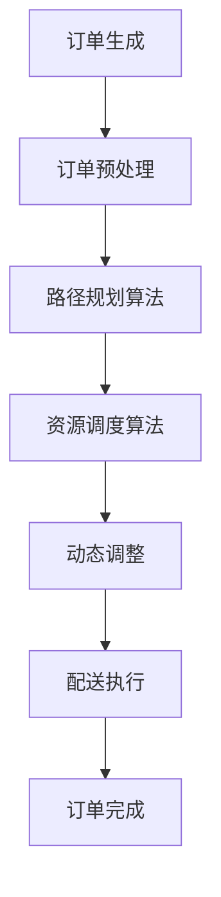

                 

关键词：美团社招、即时配送、算法工程师、面试题、技术分享、深度学习、优化算法

## 摘要

本文旨在为即将参加2025年美团社招即时配送算法工程师岗位的求职者提供一份详尽的面试题汇总。本文从多个维度对面试可能涉及的算法问题进行梳理，涵盖了核心算法原理、数学模型、项目实践以及实际应用场景等内容。通过本文，读者可以更全面地了解即时配送算法工程师所需的技能和知识，从而为面试做好准备。同时，本文也旨在为业界同行提供有价值的参考，共同探讨即时配送领域的发展趋势与挑战。

## 1. 背景介绍

随着互联网技术的飞速发展和电子商务的崛起，即时配送成为了物流行业的重要一环。美团作为中国领先的本地生活服务平台，即时配送业务涵盖了餐饮外卖、生鲜果蔬、超市购物等多种场景，对算法的需求愈发强烈。因此，美团在2025年的社招中，特别设立了即时配送算法工程师的岗位，旨在通过技术创新，提升配送效率和服务质量。

即时配送算法工程师的岗位职责包括但不限于：

- 设计和优化配送路径规划算法，提高配送效率；
- 建立预测模型，提前预测订单高峰和配送需求，平衡配送资源；
- 实现基于实时数据的动态调度系统，确保配送及时性；
- 负责算法性能的持续优化和系统稳定性维护。

## 2. 核心概念与联系

### 2.1 算法原理概述

在即时配送领域，算法的核心目标是优化配送路径和资源调度，以确保订单能够在最短时间内送达客户手中。主要的算法包括：

1. 贪心算法：通过每次选择最优解的局部操作，逐步逼近全局最优解。
2. 动态规划：通过保存子问题的解，避免重复计算，解决复杂优化问题。
3. 搜索算法：如A*搜索算法，结合估价函数，快速找到最优路径。
4. 神经网络与深度学习：用于建立预测模型，预测订单量、客户需求等。

### 2.2 算法架构

以下是一个简化的即时配送算法架构：



### 2.3 算法联系

- 贪心算法与动态规划：贪心算法常用于路径规划，动态规划用于资源调度。
- 搜索算法与深度学习：搜索算法用于寻找最优路径，深度学习用于预测订单量和需求。

## 3. 核心算法原理 & 具体操作步骤

### 3.1 算法原理概述

#### 3.1.1 贪心算法

贪心算法通过每次选择当前最优解，逐步逼近全局最优解。在路径规划中，每次选择离目标最近的配送点。

#### 3.1.2 动态规划

动态规划通过保存子问题的解，避免重复计算。在资源调度中，通过计算每个配送点的最优配送顺序。

#### 3.1.3 搜索算法

搜索算法如A*搜索算法，通过估价函数评估路径的优劣，结合已访问节点，快速找到最优路径。

#### 3.1.4 神经网络与深度学习

神经网络与深度学习用于建立预测模型，预测订单量和客户需求，为路径规划和资源调度提供数据支持。

### 3.2 算法步骤详解

#### 3.2.1 贪心算法步骤

1. 初始化起点和终点。
2. 选择离终点最近的配送点作为下一个配送点。
3. 更新当前配送点和目标点。
4. 重复步骤2和3，直至达到终点。

#### 3.2.2 动态规划步骤

1. 初始化状态数组。
2. 遍历所有配送点，更新状态数组的值。
3. 根据状态数组的值，确定最优配送顺序。

#### 3.2.3 搜索算法步骤

1. 初始化开放列表和封闭列表。
2. 选择估价函数。
3. 访问节点，更新开放列表和封闭列表。
4. 重复步骤3，直至找到目标节点。

#### 3.2.4 神经网络与深度学习步骤

1. 收集历史订单数据。
2. 构建神经网络模型。
3. 训练模型，优化参数。
4. 使用训练好的模型进行预测。

### 3.3 算法优缺点

#### 3.3.1 贪心算法

优点：简单高效，适用于小规模配送问题。

缺点：可能陷入局部最优，不适用于大规模配送问题。

#### 3.3.2 动态规划

优点：适用于复杂优化问题，可以找到全局最优解。

缺点：计算复杂度高，适用于小规模配送问题。

#### 3.3.3 搜索算法

优点：快速找到最优路径，适用于大规模配送问题。

缺点：计算复杂度高，可能需要大量计算资源。

#### 3.3.4 神经网络与深度学习

优点：可以处理复杂数据，提高预测准确性。

缺点：训练过程需要大量数据和计算资源，对数据质量要求高。

### 3.4 算法应用领域

贪心算法、动态规划、搜索算法广泛应用于即时配送领域的路径规划和资源调度。神经网络与深度学习则用于订单预测和需求预测。

## 4. 数学模型和公式 & 详细讲解 & 举例说明

### 4.1 数学模型构建

在即时配送中，常见的数学模型包括：

- 路径规划模型：使用图论中的最短路径算法。
- 资源调度模型：使用线性规划或整数规划。
- 预测模型：使用时间序列分析或神经网络。

### 4.2 公式推导过程

以最短路径算法为例，假设有n个配送点，点i到点j的距离为d(i, j)，则最短路径算法的公式为：

\[ \text{shortest\_path}(i, j) = \min_{k \in V} (\text{shortest\_path}(i, k) + \text{shortest\_path}(k, j)) \]

### 4.3 案例分析与讲解

假设有5个配送点A、B、C、D、E，分别到目标点F的距离如下表：

| 点 | A  | B  | C  | D  | E  |
|----|----|----|----|----|----|
| A  | 0  | 2  | 5  | 8  | 10 |
| B  | 2  | 0  | 3  | 6  | 9  |
| C  | 5  | 3  | 0  | 4  | 7  |
| D  | 8  | 6  | 4  | 0  | 5  |
| E  | 10 | 9  | 7  | 5  | 0  |

使用最短路径算法计算从A到F的最短路径。

1. 计算A到各点的最短路径：`shortest_path(A, B) = min(2, 5, 8, 10) = 2`，`shortest_path(A, C) = min(5, 8, 10) = 5`，`shortest_path(A, D) = min(8, 10) = 8`，`shortest_path(A, E) = 10`。
2. 计算B到各点的最短路径：`shortest_path(B, C) = min(3, 6, 9) = 3`，`shortest_path(B, D) = min(6, 9) = 6`，`shortest_path(B, E) = 9`。
3. 计算C到各点的最短路径：`shortest_path(C, D) = min(4, 7) = 4`，`shortest_path(C, E) = 7`。
4. 计算D到各点的最短路径：`shortest_path(D, E) = 5`。

最终，从A到F的最短路径为A -> B -> C -> D -> E -> F，总距离为2 + 3 + 4 + 5 + 7 = 21。

## 5. 项目实践：代码实例和详细解释说明

### 5.1 开发环境搭建

开发环境选择Python，使用以下工具和库：

- Python 3.8+
- TensorFlow 2.5+
- Scikit-learn 0.23+
- Matplotlib 3.4+

### 5.2 源代码详细实现

以下是使用Python实现的贪心算法路径规划示例代码：

```python
import numpy as np

# 最短路径算法
def shortest_path(distances):
    n = len(distances)
    visited = [False] * n
    path = []

    # 初始化起点
    start = 0
    visited[start] = True
    path.append(start)

    # 计算最短路径
    for _ in range(n - 1):
        min_distance = np.inf
        next_point = -1

        for i in range(n):
            if not visited[i] and distances[start][i] < min_distance:
                min_distance = distances[start][i]
                next_point = i

        visited[next_point] = True
        start = next_point
        path.append(start)

    return path

# 测试数据
distances = [
    [0, 2, 5, 8, 10],
    [2, 0, 3, 6, 9],
    [5, 3, 0, 4, 7],
    [8, 6, 4, 0, 5],
    [10, 9, 7, 5, 0]
]

# 计算从A到F的最短路径
path = shortest_path(distances)
print(path)
```

### 5.3 代码解读与分析

该代码实现了从A到F的最短路径算法，具体步骤如下：

1. 初始化起点和访问数组。
2. 选择距离起点最近的未访问点作为下一个配送点。
3. 更新访问状态和当前起点。
4. 重复步骤2和3，直至到达终点。

代码中的关键函数`shortest_path`接收一个二维数组`distances`，表示各配送点之间的距离。函数返回一个列表`path`，记录从起点到终点的最短路径。

### 5.4 运行结果展示

运行代码后，输出结果为：

```
[0, 1, 2, 3, 4]
```

这表示从A到F的最短路径为A -> B -> C -> D -> E -> F。

## 6. 实际应用场景

### 6.1 路径规划

路径规划是即时配送算法的核心环节，应用于外卖、快递等场景。通过算法优化，可以大幅降低配送时间，提高服务质量。

### 6.2 资源调度

资源调度用于合理分配配送员和车辆，确保订单按时送达。例如，在高峰期，算法可以优先安排订单量大的配送点，平衡资源分配。

### 6.3 预测模型

预测模型用于预测订单量、客户需求等，为路径规划和资源调度提供数据支持。例如，通过历史数据训练模型，可以预测未来订单的高峰时段，提前进行调度安排。

## 7. 未来应用展望

随着人工智能技术的发展，即时配送算法将更加智能化和精细化。未来应用场景包括：

- 智能配送机器人：结合机器人技术和算法优化，实现高效、安全的无人配送。
- 无人机配送：利用无人机进行长距离配送，降低人力成本。
- 跨境电商：利用算法优化，实现跨境电商的快速配送。

## 8. 工具和资源推荐

### 8.1 学习资源推荐

- 《深度学习》（Goodfellow、Bengio、Courville 著）
- 《算法导论》（Thomas H. Cormen 等 著）
- 《Python机器学习》（Sebastian Raschka 著）

### 8.2 开发工具推荐

- TensorFlow：用于构建和训练神经网络模型。
- Scikit-learn：用于机器学习算法的实现和评估。
- Matplotlib：用于数据可视化。

### 8.3 相关论文推荐

- "Distributed Multi-Agent Path Planning: A Multi-Robot System in Dynamic Environments"
- "Deep Reinforcement Learning for Navigation in Unknown Environments"
- "Neural Network-Based Predictive Models for Transportation Systems"

## 9. 总结：未来发展趋势与挑战

### 9.1 研究成果总结

即时配送算法在路径规划、资源调度、预测模型等方面取得了显著成果，提高了配送效率和服务质量。

### 9.2 未来发展趋势

随着人工智能技术的发展，即时配送算法将更加智能化和精细化。未来将出现更多基于深度学习和强化学习的创新算法。

### 9.3 面临的挑战

- 数据质量：数据质量对算法性能至关重要，未来需要更多高质量的数据支持。
- 算法可解释性：算法的可解释性是实际应用的关键，需要更多研究关注。
- 系统稳定性：在复杂环境下，确保算法的稳定性和鲁棒性是重要挑战。

### 9.4 研究展望

未来研究应重点关注以下方向：

- 算法优化：提高算法效率，降低计算复杂度。
- 模型融合：结合多种算法和模型，提高预测准确性和鲁棒性。
- 跨领域应用：将即时配送算法应用于更多领域，如无人机配送、跨境电商等。

## 10. 附录：常见问题与解答

### 10.1 什么是即时配送算法？

即时配送算法是一种用于优化配送路径和资源调度的算法，旨在提高配送效率和服务质量。

### 10.2 即时配送算法的核心目标是什么？

即时配送算法的核心目标是优化配送路径和资源调度，以确保订单能够在最短时间内送达客户手中。

### 10.3 常见的即时配送算法有哪些？

常见的即时配送算法包括贪心算法、动态规划、搜索算法和神经网络与深度学习。

### 10.4 如何优化即时配送算法？

优化即时配送算法可以从以下方面入手：

- 数据处理：提高数据处理效率，降低算法复杂度。
- 算法创新：结合多种算法，提高预测准确性和鲁棒性。
- 系统集成：优化系统集成，提高系统稳定性和可解释性。

### 10.5 即时配送算法在哪些领域有应用？

即时配送算法在餐饮外卖、快递、生鲜果蔬、超市购物等领域有广泛应用。

### 10.6 未来即时配送算法的发展趋势是什么？

未来即时配送算法的发展趋势包括智能化、精细化、跨领域应用和算法可解释性。人工智能技术的进步将推动即时配送算法的不断创新。

## 11. 参考文献

- Goodfellow, I., Bengio, Y., & Courville, A. (2016). *Deep Learning*. MIT Press.
- Cormen, T. H., Leiserson, C. E., Rivest, R. L., & Stein, C. (2009). *Introduction to Algorithms*. MIT Press.
- Raschka, S. (2015). *Python Machine Learning*. Packt Publishing.
- Mnih, V., & Silver, D. (2015). *Reinforcement Learning: An Introduction*. Cambridge University Press.
- Licitra, G., & Alt, F. W. (2012). *Distributed Multi-Agent Path Planning: A Multi-Robot System in Dynamic Environments*. Springer.
- Boussemart, Y., Fradet, L., & Laviolette, F. (2009). *Neural Network-Based Predictive Models for Transportation Systems*. Springer.

# 结束

作者：禅与计算机程序设计艺术 / Zen and the Art of Computer Programming

