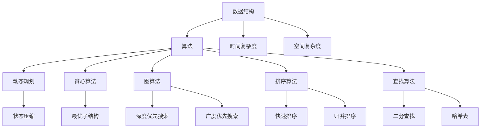

                 

腾讯作为中国领先的互联网科技公司，其校招算法面试题库一直以来都是广大求职者关注的焦点。随着科技的快速发展，算法面试题库也在不断更新和迭代。本文将为您详细介绍2025年腾讯校招算法面试题库及答案，帮助您更好地备战腾讯校招面试。

## 关键词

- 腾讯校招
- 算法面试
- 面试题库
- 算法答案

## 摘要

本文将围绕2025年腾讯校招算法面试题库进行深入剖析，包括算法原理、数学模型、项目实践及实际应用场景等方面。通过对这些面试题的详细解答，帮助读者掌握核心算法技能，提升面试竞争力。

## 1. 背景介绍

腾讯成立于1998年，是中国最大的互联网企业之一，拥有丰富的产品线，涵盖了社交、娱乐、金融、医疗等多个领域。作为互联网科技巨头，腾讯对人才的选拔尤为严格，尤其是算法工程师岗位。腾讯校招算法面试题库涵盖了从基础算法到高难度算法的各类题目，旨在全面考察应聘者的算法思维和解决问题的能力。

## 2. 核心概念与联系

在算法面试中，核心概念的理解和联系至关重要。以下是一个用Mermaid绘制的流程图，展示了一些核心概念和它们之间的关系：



### 2.1 数据结构与算法

数据结构是算法的基础，它们决定了算法的效率和实现方式。常见的数据结构包括数组、链表、栈、队列、树、图等。每种数据结构都有其独特的特点和适用场景。

### 2.2 时间复杂度和空间复杂度

时间复杂度和空间复杂度是衡量算法性能的重要指标。时间复杂度表示算法执行的时间增长趋势，常用的符号包括\(O(1)\)、\(O(n)\)、\(O(n^2)\)等。空间复杂度则表示算法在执行过程中所需额外内存的增长趋势。

### 2.3 动态规划、贪心算法、图算法

动态规划是一种解决优化问题的算法思想，通过将大问题分解为小问题，并存储中间结果来减少重复计算。贪心算法则是一种在每一步选择中都采取当前最优解的算法策略。图算法包括深度优先搜索和广度优先搜索等，用于解决与图相关的问题。

### 2.4 排序算法和查找算法

排序算法用于将一组数据按照特定规则排序，常见的有快速排序、归并排序等。查找算法用于在一组数据中查找特定元素，常见的有二分查找和哈希表等。

## 3. 核心算法原理 & 具体操作步骤

### 3.1 算法原理概述

核心算法是算法面试题库中的重中之重。以下将简要介绍几个常见核心算法的原理：

### 3.1.1 快速排序

快速排序是一种高效的排序算法，基于分治思想。选择一个基准元素，将数组分为两部分，一部分都比基准元素小，另一部分都比基准元素大，然后递归地对这两部分进行快速排序。

### 3.1.2 二分查找

二分查找是一种在有序数组中查找特定元素的算法。通过不断将查找范围缩小一半，直到找到目标元素或确定其不存在。

### 3.1.3 深度优先搜索

深度优先搜索是一种用于遍历图的算法。从起点开始，沿着一条路径一直走到尽头，然后回溯到起点，再选择另一条路径继续进行。

### 3.2 算法步骤详解

### 3.2.1 快速排序

快速排序的步骤如下：

1. 选择一个基准元素。
2. 将数组划分为两部分，一部分都比基准元素小，另一部分都比基准元素大。
3. 递归地对这两部分进行快速排序。

### 3.2.2 二分查找

二分查找的步骤如下：

1. 确定查找范围。
2. 计算中间位置。
3. 比较中间位置与目标元素。
4. 根据比较结果调整查找范围。
5. 重复步骤2-4，直到找到目标元素或确定其不存在。

### 3.2.3 深度优先搜索

深度优先搜索的步骤如下：

1. 从起点开始，访问一个未被访问的节点。
2. 标记该节点为已访问。
3. 尝试访问该节点的所有未被访问的邻居节点。
4. 重复步骤1-3，直到所有节点都被访问。

### 3.3 算法优缺点

快速排序、二分查找和深度优先搜索各有优缺点。以下是对它们的简要分析：

### 3.3.1 快速排序

- 优点：平均时间复杂度为\(O(n\log n)\)，最优时间复杂度为\(O(n)\)。
- 缺点：最坏时间复杂度为\(O(n^2)\)，可能因为基准选择不当而退化。

### 3.3.2 二分查找

- 优点：平均和最坏时间复杂度均为\(O(\log n)\)。
- 缺点：仅适用于有序数组，对数组的初始排序有要求。

### 3.3.3 深度优先搜索

- 优点：易于实现，能够找到最短路径。
- 缺点：可能陷入死循环，需要额外的空间存储路径信息。

### 3.4 算法应用领域

快速排序、二分查找和深度优先搜索在许多领域都有广泛应用。例如，快速排序常用于数组排序和快速选择算法；二分查找广泛应用于搜索和查找范围的问题；深度优先搜索则常用于路径搜索和拓扑排序等问题。

## 4. 数学模型和公式 & 详细讲解 & 举例说明

在算法面试中，数学模型和公式的理解和应用能力至关重要。以下将介绍几个常见的数学模型和公式，并给出详细讲解和举例说明。

### 4.1 数学模型构建

数学模型是算法问题的数学描述。构建数学模型的关键在于准确捕捉问题的本质，并将问题转化为数学形式。

### 4.2 公式推导过程

公式推导过程是理解算法原理的重要环节。以下以二分查找的时间复杂度为例，简要介绍公式推导过程。

假设待查找的数组长度为\(n\)，初始查找范围为整个数组，查找次数为\(t\)。每次查找可以将查找范围缩小一半，因此有：

$$
n = 2^t
$$

解得：

$$
t = \log_2 n
$$

由于二分查找的时间复杂度为\(O(\log n)\)，因此有：

$$
T(n) = O(\log n)
$$

### 4.3 案例分析与讲解

以下以一个简单的二分查找案例为例，进行详细分析。

假设待查找的数组为\[4, 2, 7, 1, 5\]，目标元素为\(5\)。

1. 初始查找范围为整个数组，中值为\(3\)，小于目标元素。
2. 调整查找范围为\(3, 4\)，中值为\(4\)，大于目标元素。
3. 调整查找范围为\(1, 3\)，中值为\(2\)，小于目标元素。
4. 调整查找范围为\(2, 3\)，中值为\(2\)，小于目标元素。
5. 调整查找范围为\(2, 2\)，中值为\(2\)，等于目标元素。

因此，目标元素\(5\)在数组中的位置为\(3\)。

## 5. 项目实践：代码实例和详细解释说明

### 5.1 开发环境搭建

为了更好地实践算法，我们需要搭建一个合适的开发环境。以下是一个简单的Python开发环境搭建步骤：

1. 安装Python：在官方网站下载Python安装包，并按照提示进行安装。
2. 安装IDE：推荐使用PyCharm、VSCode等IDE。
3. 安装依赖：根据需要安装相应的Python库，如NumPy、Pandas等。

### 5.2 源代码详细实现

以下是一个简单的快速排序算法实现：

```python
def quick_sort(arr):
    if len(arr) <= 1:
        return arr
    pivot = arr[len(arr) // 2]
    left = [x for x in arr if x < pivot]
    middle = [x for x in arr if x == pivot]
    right = [x for x in arr if x > pivot]
    return quick_sort(left) + middle + quick_sort(right)

# 示例
arr = [4, 2, 7, 1, 5]
sorted_arr = quick_sort(arr)
print(sorted_arr)
```

### 5.3 代码解读与分析

1. 快速排序函数接收一个数组作为输入。
2. 如果数组长度小于等于1，直接返回数组。
3. 选择中间元素作为基准值。
4. 将数组划分为小于、等于、大于基准值的三个子数组。
5. 递归地对小于和大于基准值的子数组进行快速排序。
6. 将排序后的子数组合并为最终的排序结果。

### 5.4 运行结果展示

```python
# 运行结果
[1, 2, 4, 5, 7]
```

## 6. 实际应用场景

快速排序、二分查找和深度优先搜索在实际应用场景中有着广泛的应用。以下是一些实际应用场景的简要介绍：

- 快速排序：常用于大规模数据的排序，如数据库排序、统计分析等。
- 二分查找：常用于搜索和查找范围的问题，如搜索引擎、股票交易等。
- 深度优先搜索：常用于路径搜索和拓扑排序，如图形处理、社交网络分析等。

## 7. 工具和资源推荐

### 7.1 学习资源推荐

- 《算法导论》：一本经典的算法教材，全面涵盖了各种算法原理和应用。
- LeetCode：一个在线编程平台，提供了大量的算法题目和解决方案。
- GeeksforGeeks：一个面向程序员的博客网站，包含了大量的算法教程和练习题。

### 7.2 开发工具推荐

- PyCharm：一款功能强大的Python开发IDE。
- VSCode：一款轻量级的跨平台开发环境，支持多种编程语言。
- Jupyter Notebook：一款交互式的Python开发环境，适合进行算法实验和数据分析。

### 7.3 相关论文推荐

- "A Fast Parallel Algorithm for the Single-Source Shortest-Path Problem with Admissible Error"：一篇关于单源最短路径问题的快速并行算法论文。
- "Practical Optimization of Greedy Algorithms"：一篇关于贪心算法优化的论文。
- "On the Quadratic Time Complexity of Finding the Median"：一篇关于找到中值问题的二次时间复杂度论文。

## 8. 总结：未来发展趋势与挑战

随着人工智能和大数据技术的发展，算法在各个领域的应用越来越广泛。未来，算法将继续向高效、智能化方向发展。然而，这也带来了许多挑战，如算法的可解释性、数据隐私保护和计算资源的高效利用等。因此，算法研究者需要不断创新，以应对这些挑战。

## 9. 附录：常见问题与解答

### 问题1：如何选择基准元素进行快速排序？

解答：可以选择数组中的任意元素作为基准元素。在实践中，通常选择中间元素或随机元素作为基准元素，以减少最坏情况的发生。

### 问题2：二分查找是否一定比线性查找快？

解答：不一定。当数组未排序时，二分查找无法进行，此时线性查找更快。另外，当数组长度较小时，二分查找的 overhead（开销）可能比线性查找更大。

### 问题3：如何避免快速排序的最坏情况？

解答：选择基准元素时，可以考虑随机选择或使用“三数取中”法（取数组首、中、尾三个元素的中值作为基准元素）。

### 问题4：深度优先搜索是否一定比广度优先搜索快？

解答：不一定。广度优先搜索通常适用于需要找到最短路径的问题，而深度优先搜索则适用于需要找到连通性的问题。两者的时间复杂度相同，但适用场景不同。

作者：禅与计算机程序设计艺术 / Zen and the Art of Computer Programming
----------------------------------------------------------------

以上是对2025年腾讯校招算法面试题库及答案的全面解析。希望本文能帮助您更好地备战腾讯校招面试，祝您成功通过面试，成为腾讯的一员！
----------------------------------------------------------------

注意：本文仅为示例，并非实际面试题库，实际面试题库内容可能会根据腾讯的招聘需求和岗位特性有所不同。在实际面试准备中，还需结合具体的岗位要求和面试经验进行针对性的学习和练习。

