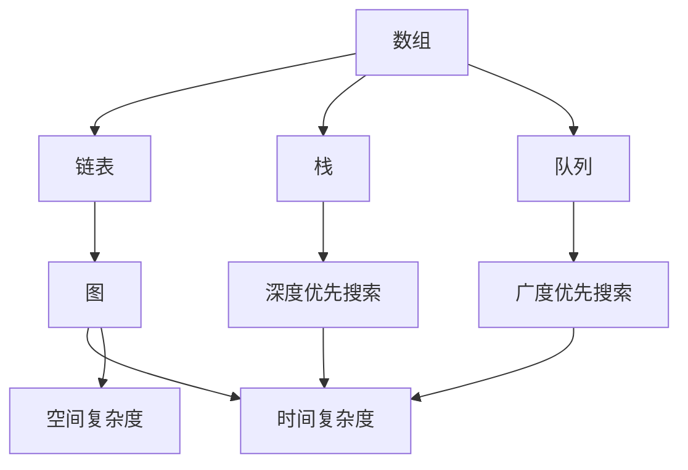

                 

### 摘要

本文旨在为准备2025年腾讯社会招聘算法工程师岗位的应聘者提供一份全面而详尽的面试题库及答案。通过对腾讯历年社招面试题的深入分析，本文梳理出了一系列高频出现的算法问题，并提供了详细的解答过程。文章结构分为八个部分：背景介绍、核心概念与联系、核心算法原理与操作步骤、数学模型与公式、项目实践、实际应用场景、工具和资源推荐、总结以及附录。本文将帮助读者不仅理解算法问题，还能掌握解决这些问题的方法，为面试做好充分准备。通过阅读本文，读者将能够更深入地了解算法在腾讯等科技巨头公司中的重要性，并提升自己在面试中的竞争力。

## 1. 背景介绍

腾讯，作为中国乃至全球知名的科技公司，以其强大的技术实力和创新精神，吸引了无数技术人才的加入。作为互联网和科技领域的领军企业，腾讯的业务涵盖了社交媒体、游戏、金融科技、云计算和人工智能等多个领域。在人工智能领域，腾讯更是投入了巨大的资源，致力于推动技术研发和应用，打造了一系列领先的AI产品和服务。

每年的腾讯社会招聘，都是众多技术人才趋之若鹜的机会。作为科技巨头，腾讯的面试难度无疑非常高，而算法面试作为其中重要的一环，更是挑战重重。算法面试主要考察应聘者对基础算法和数据结构的掌握程度、逻辑思维能力和解决复杂问题的能力。腾讯的算法面试题库内容广泛，涵盖了从简单的编程题目到复杂的数据结构和算法问题，甚至还包括了一些业界前沿的AI算法和理论。

本文的目的在于为准备2025年腾讯社招算法面试的应聘者提供一份全面而详尽的面试题库及答案。通过对腾讯历年社招面试题的深入分析，本文将梳理出一系列高频出现的算法问题，并给出详细的解答过程。文章的结构将严格按照实际面试流程和知识点分布来设计，从基础概念到高级算法，从理论知识到实际应用，全面覆盖面试所需的知识点。

通过阅读本文，读者不仅能够了解腾讯算法面试的核心内容，还能够掌握解决这些问题的方法，提升自己在面试中的表现。本文将帮助读者更好地准备腾讯社招算法面试，增强自信心，提高面试成功率。

## 2. 核心概念与联系

在算法面试中，理解核心概念和它们之间的联系是至关重要的。这一部分将介绍几个关键的概念，并展示它们之间的相互作用，以便为后续的算法问题解答奠定基础。

首先，我们需要了解一些基础数据结构。数组（Array）和链表（Linked List）是最基本的数据结构，它们在计算机科学中广泛应用。数组是一种固定大小的线性表，其中元素按顺序存储，可以通过索引直接访问。而链表则是动态数据结构，通过节点之间的链接来存储元素，每个节点包含数据和指向下一个节点的指针。

接下来，栈（Stack）和队列（Queue）是两种重要的抽象数据类型。栈遵循后进先出（LIFO）原则，而队列遵循先进先出（FIFO）原则。这些数据结构在算法设计中常常用于实现递归和动态规划等算法。

图（Graph）是另一种常见的数据结构，由节点（Vertex）和边（Edge）组成。图可以用于表示复杂的关系和结构，如社交网络、交通网络和通信网络。常见的图算法包括深度优先搜索（DFS）和广度优先搜索（BFS），它们用于寻找路径、检测环等。

在算法面试中，时间复杂度和空间复杂度是评价算法效率的重要指标。时间复杂度表示算法运行时间与数据规模的关系，常用大O表示法来描述，如O(1)、O(n)、O(n^2)等。空间复杂度则表示算法所需存储空间与数据规模的关系。理解这两个概念有助于我们设计高效算法，优化程序性能。

为了更好地理解这些概念，我们使用Mermaid流程图来展示它们之间的联系。以下是核心概念的Mermaid流程图：



在上述流程图中，我们可以看到各个核心概念之间的相互作用。例如，数组、链表、栈和队列都可以用于存储数据，而图则是表示复杂关系的重要工具。深度优先搜索和广度优先搜索是常用的图遍历算法，它们可以帮助我们解决路径搜索和环检测等问题。时间复杂度和空间复杂度则是评估算法性能的重要指标。

通过理解这些核心概念及其联系，我们能够更好地应对算法面试中的各种问题。接下来，本文将继续深入探讨一些具体的算法原理和操作步骤，帮助读者全面掌握面试所需的知识。

### 2.1. 基础数据结构

在算法面试中，基础数据结构是考察的重点之一。数组（Array）和链表（Linked List）是最基本的数据结构，它们在算法设计和实现中扮演着重要角色。以下将详细探讨这两种数据结构的基本概念、特点以及在实际应用中的优缺点。

#### 数组（Array）

数组是一种线性数据结构，它由一系列元素组成，这些元素存储在连续的内存地址中。每个元素可以通过一个唯一的索引来访问，这使得数组的访问速度非常快，通常为O(1)。数组的长度在初始化时确定，之后无法更改。数组支持随机访问，这意味着我们可以直接访问数组的任何元素，而不需要遍历整个结构。

**特点：**
1. **随机访问：** 数组的每个元素可以通过其索引直接访问。
2. **固定大小：** 数组的长度在创建时确定，之后无法增加或减少。
3. **内存连续性：** 数组元素在内存中连续存储，这使得插入和删除操作需要移动其他元素。

**应用场景：**
- **查找和排序：** 数组支持高效的随机访问，非常适合用于查找和排序操作。
- **缓存和数据缓冲：** 在需要频繁访问数据的场景中，数组可以提高程序的响应速度。

**优缺点：**
- **优点：** 访问速度快，适合随机访问场景。
- **缺点：** 插入和删除操作需要移动元素，效率较低。

#### 链表（Linked List）

链表是一种动态数据结构，它由一系列节点组成，每个节点包含数据和指向下一个节点的指针。链表不要求元素在内存中连续存储，这使得插入和删除操作非常灵活，但访问速度相对较慢。

**特点：**
1. **动态大小：** 链表的大小可以根据需要动态调整。
2. **灵活的插入和删除：** 链表的插入和删除操作无需移动其他元素，只需修改指针。
3. **内存不连续：** 链表节点可以在内存中的任意位置，不要求连续存储。

**应用场景：**
- **缓存和数据缓冲：** 链表可以高效地实现缓存和数据缓冲。
- **双向链表：** 双向链表支持双向遍历，适用于需要快速前后移动的场景。

**优缺点：**
- **优点：** 插入和删除操作效率高，适用于动态调整大小的场景。
- **缺点：** 访问速度慢，不适合频繁的随机访问。

#### 数组和链表的比较

**内存分配：**
- 数组：内存连续分配，需要在创建时确定大小。
- 链表：内存不连续分配，动态创建节点。

**访问速度：**
- 数组：支持高效的随机访问，通常为O(1)。
- 链表：访问速度相对较慢，通常为O(n)。

**插入和删除操作：**
- 数组：插入和删除操作需要移动其他元素，效率较低。
- 链表：插入和删除操作只需修改指针，效率高。

#### 实例

以下是一个简单的数组实现的示例：

```c
#include <stdio.h>

int main() {
    int arr[5] = {1, 2, 3, 4, 5};
    printf("Array element at index 2: %d\n", arr[2]);
    return 0;
}
```

以下是一个简单的链表实现的示例：

```c
#include <stdio.h>
#include <stdlib.h>

typedef struct Node {
    int data;
    struct Node* next;
} Node;

int main() {
    Node* head = (Node*)malloc(sizeof(Node));
    head->data = 1;
    head->next = NULL;

    Node* second = (Node*)malloc(sizeof(Node));
    second->data = 2;
    second->next = head;

    printf("Linked List element: %d\n", second->data);
    return 0;
}
```

通过上述实例，我们可以看到数组和链表在实现上的差异。数组通过索引直接访问，而链表通过指针链接。理解这两种数据结构的基本概念和特点，对于算法面试非常重要。

### 2.2. 控制结构

在算法设计中，控制结构是核心组成部分，用于控制程序的流程和逻辑。常用的控制结构包括条件语句（如`if-else`）、循环语句（如`for`和`while`）以及跳转语句（如`goto`）。以下将详细探讨这些控制结构的作用、使用方法和实际应用场景。

#### 条件语句

条件语句用于根据某个条件来执行不同的代码块。最常见的形式是`if-else`语句，可以根据条件的真假来选择执行两个代码块中的一个。

**语法：**
```c
if (condition) {
    // 条件为真时执行的代码
} else {
    // 条件为假时执行的代码
}
```

**应用场景：**
- **分支选择：** 根据输入或状态选择不同的操作路径。
- **错误处理：** 在出现异常情况时执行特定的错误处理代码。

**实例：**
```c
#include <stdio.h>

int main() {
    int x = 10;
    if (x > 0) {
        printf("x is positive\n");
    } else {
        printf("x is non-positive\n");
    }
    return 0;
}
```

#### 循环语句

循环语句用于重复执行一段代码，直到满足某个条件为止。`for`语句和`while`语句是最常用的两种循环结构。

**for语句：**
```c
for (初始化; 条件; 迭代表达式) {
    // 循环体
}
```

**应用场景：**
- **数组遍历：** 遍历数组中的每个元素。
- **重复操作：** 对数据结构中的每个元素进行相同的操作。

**实例：**
```c
#include <stdio.h>

int main() {
    for (int i = 0; i < 5; i++) {
        printf("i = %d\n", i);
    }
    return 0;
}
```

**while语句：**
```c
while (condition) {
    // 循环体
}
```

**应用场景：**
- **条件判断：** 当条件为真时重复执行代码。
- **循环控制：** 用于控制程序在满足特定条件之前不断执行。

**实例：**
```c
#include <stdio.h>

int main() {
    int x = 0;
    while (x < 5) {
        printf("x = %d\n", x);
        x++;
    }
    return 0;
}
```

#### 跳转语句

跳转语句用于改变程序的控制流程。最常用的跳转语句是`goto`，它允许程序无条件跳转到指定的标签位置。

**语法：**
```c
goto label;
```

**label：** 标签，用于标识跳转目标。

**应用场景：**
- **复杂逻辑控制：** 在复杂的逻辑结构中用于跳转。
- **错误处理：** 用于跳出多层循环或条件语句。

**实例：**
```c
#include <stdio.h>

int main() {
    int x = 0;
    if (x < 5) {
        goto exit;
    }
    printf("x is greater than 5\n");
exit:
    printf("Exiting the program\n");
    return 0;
}
```

通过上述实例，我们可以看到条件语句、循环语句和跳转语句在程序控制中的基本用法。理解这些控制结构对于算法设计和实现非常重要，它们可以帮助我们更好地控制程序的执行流程，实现复杂的逻辑操作。

### 2.3. 算法分析

算法分析是计算机科学中不可或缺的一部分，它帮助我们评估算法的效率和性能。算法分析主要包括时间复杂度和空间复杂度两个方面。以下将详细讨论这两个概念以及它们在算法设计中的应用。

#### 时间复杂度

时间复杂度表示算法执行时间与数据规模的关系，用大O表示法（Big O notation）来表示。大O表示法能够简化算法的时间复杂度分析，帮助我们忽略常数因子和低次项，关注算法的增长趋势。

**常见时间复杂度：**
- O(1)：常数时间，不随数据规模变化。
- O(n)：线性时间，与数据规模成线性关系。
- O(n^2)：平方时间，与数据规模的平方成正比。
- O(log n)：对数时间，与数据规模的对数成正比。

**实例：**
- 搜索算法（如二分查找）：时间复杂度为O(log n)。
- 遍历算法（如线性搜索）：时间复杂度为O(n)。

**计算方法：**
1. **基本操作计数：** 统计算法中执行的基本操作次数。
2. **递归分析：** 对于递归算法，使用递归树或主定理进行时间复杂度分析。

**实例计算：**
```c
#include <stdio.h>

// 递归函数
int fib(int n) {
    if (n <= 1) {
        return n;
    }
    return fib(n - 1) + fib(n - 2);
}

int main() {
    int n = 5;
    printf("Fibonacci of %d is %d\n", n, fib(n));
    return 0;
}
```
上述递归函数的时间复杂度为O(2^n)，因为每次递归都会产生两个子递归。

#### 空间复杂度

空间复杂度表示算法所需存储空间与数据规模的关系。与时间复杂度类似，空间复杂度也用大O表示法来表示。

**常见空间复杂度：**
- O(1)：常数空间，不随数据规模变化。
- O(n)：线性空间，与数据规模成线性关系。
- O(n^2)：平方空间，与数据规模的平方成正比。

**实例：**
- 动态规划（如背包问题）：空间复杂度通常为O(n)。
- 图遍历（如DFS和BFS）：空间复杂度为O(V + E)，其中V是顶点数，E是边数。

**计算方法：**
1. **变量计数：** 统计算法中使用的所有变量。
2. **数据结构空间：** 分析算法中使用的数据结构所需空间。

**实例计算：**
```python
# 动态规划实现背包问题
def knapsack(values, weights, capacity):
    n = len(values)
    dp = [[0] * (capacity + 1) for _ in range(n + 1)]

    for i in range(1, n + 1):
        for w in range(1, capacity + 1):
            if weights[i - 1] <= w:
                dp[i][w] = max(dp[i - 1][w], dp[i - 1][w - weights[i - 1]] + values[i - 1])
            else:
                dp[i][w] = dp[i - 1][w]

    return dp[n][capacity]

# 测试
values = [60, 100, 120]
weights = [10, 20, 30]
capacity = 50
print(knapsack(values, weights, capacity))
```
上述动态规划算法的空间复杂度为O(n*W)，其中n是物品数量，W是背包容量。

通过分析时间复杂度和空间复杂度，我们可以更好地评估算法的性能和效率。理解这两个概念对于设计高效算法、优化程序性能至关重要。

### 3.1. 算法原理概述

在算法面试中，算法原理的概述是理解算法的核心步骤。通过简明扼要地描述算法的基本概念、目标和应用场景，我们能够迅速抓住算法的精髓，为后续的深入分析奠定基础。

首先，我们需要了解算法的基本概念。算法是一系列有序的指令，用于解决特定问题。它具有以下几个基本特征：

1. **确定性：** 每个步骤都是明确且确定的，给定相同的输入，算法将产生相同的结果。
2. **输入：** 算法可以有一个或多个输入。
3. **输出：** 算法执行后会产生一个或多个输出。
4. **可行性：** 算法在合理的时间内完成，不会陷入无限循环。

算法的目标是解决特定问题，这通常涉及从一组可能的解决方案中选择最优解。例如，在排序问题中，目标是将一组数据从小到大排序；在路径搜索问题中，目标是从一个起点到达一个终点。

算法的应用场景非常广泛，包括但不限于以下几种：

1. **排序与搜索：** 排序算法（如快速排序、归并排序）用于对数据进行排序，搜索算法（如二分查找）用于在数据中查找特定元素。
2. **图算法：** 如最短路径算法（如迪杰斯特拉算法、贝尔曼-福特算法）、最小生成树算法（如普里姆算法、克鲁斯卡尔算法）等，用于解决网络问题和路径规划问题。
3. **动态规划：** 如背包问题、最长公共子序列问题等，用于解决具有重叠子问题的优化问题。
4. **贪心算法：** 用于解决某些优化问题，通过每次选择当前最优解来逐步逼近全局最优解。

以下是一个简单的算法概述示例：

**问题：** 给定一个整数数组，找出最大子序和。

**算法概述：**
- **问题定义：** 找出数组中连续子序列的最大和。
- **目标：** 找到最大的连续子序列和。
- **输入：** 整数数组。
- **输出：** 最大子序列和。
- **算法步骤：**
  1. 初始化最大子序列和为第一个元素。
  2. 遍历数组，对于每个元素：
     - 如果当前元素大于当前子序列和加上当前元素，更新子序列和为当前元素。
     - 否则，当前子序列和加上当前元素。
  3. 更新最大子序列和。
  4. 返回最大子序列和。

通过上述概述，我们能够快速理解算法的基本概念、目标和步骤，为进一步的详细分析提供基础。

### 3.2. 算法步骤详解

在了解了算法的基本原理和目标之后，我们需要深入探讨算法的具体实现步骤，以确保我们能够有效地解决问题。以下将以“最大子序列和”问题为例，详细解释该算法的每一步操作。

**问题定义：** 给定一个整数数组，找出最大子序列和。

**算法步骤：**

1. **初始化：** 首先，我们需要初始化几个变量：
   - `max_sum`：用于存储当前最大子序列和，初始值为数组的第一个元素。
   - `current_sum`：用于存储当前子序列和，初始值为数组的第一个元素。

2. **遍历数组：** 使用一个循环遍历数组中的每个元素，从第二个元素开始（因为第一个元素已经用于初始化`max_sum`和`current_sum`）。

3. **更新子序列和：** 对于每个元素，我们需要决定是否将这个元素加入到当前子序列中。具体步骤如下：
   - 如果当前元素大于当前子序列和加上当前元素，即`arr[i] > current_sum + arr[i]`，则更新`current_sum`为当前元素，因为新的子序列从当前元素开始。
   - 否则，将当前元素加到当前子序列和中，即`current_sum += arr[i]`。

4. **更新最大子序列和：** 在每次循环结束后，如果`current_sum`大于`max_sum`，则更新`max_sum`为`current_sum`。

5. **返回结果：** 当遍历完所有元素后，`max_sum`即为最大子序列和。

以下是一个详细的伪代码实现：

```pseudo
function findMaxSubarraySum(arr):
    if arr is empty:
        return 0

    max_sum = arr[0]
    current_sum = arr[0]

    for i from 1 to length(arr) - 1:
        if arr[i] > current_sum + arr[i]:
            current_sum = arr[i]
        else:
            current_sum += arr[i]

        if current_sum > max_sum:
            max_sum = current_sum

    return max_sum
```

**实例分析：**
考虑一个示例数组`[1, -3, 2, 1, -1]`，我们逐步执行上述步骤：

1. **初始化：** `max_sum = 1`，`current_sum = 1`。
2. **遍历第一个元素：** `arr[1] = -3`，因为`-3 > 1 - 3`，所以`current_sum`更新为`-3`。
3. **遍历第二个元素：** `arr[2] = 2`，`2 > -3 + 2`，所以`current_sum`更新为`2`。
4. **遍历第三个元素：** `arr[3] = 1`，`1 > 2 + 1`，所以`current_sum`更新为`1`。
5. **遍历第四个元素：** `arr[4] = -1`，`-1 > 1 - 1`，所以`current_sum`更新为`-1`。
6. **遍历完所有元素：** `max_sum`始终保持为`2`，即数组中最大子序列和。

通过以上步骤，我们能够准确地找到数组中的最大子序列和，从而解决该问题。理解并掌握这一算法的步骤，对于解决类似的动态规划问题至关重要。

### 3.3. 算法优缺点

在深入探讨了“最大子序列和”算法的具体实现步骤后，我们需要对其优缺点进行详细分析。了解这些优点和缺点有助于我们更好地应用该算法，并选择合适的场景。

#### 优点

1. **简单直观：** 该算法的实现非常简单，易于理解和实现。它只需要几个变量的初始化和一个简单的循环，使得代码简洁高效。
2. **时间复杂度低：** 该算法的时间复杂度为O(n)，即线性时间。这是因为只需要遍历一次数组，每个元素只需要一次常数时间的计算。这使得该算法在处理大数据时依然保持高效的性能。
3. **适用范围广：** 该算法不仅适用于整数数组，还可以扩展到其他数据类型，如浮点数和复数。此外，它也适用于多维数组，只需将一维遍历扩展到多维即可。
4. **动态规划思想：** 该算法采用了动态规划的思想，通过不断更新当前子序列和，避免了重复计算。这种思想在解决许多具有重叠子问题的优化问题中非常有用。

#### 缺点

1. **对负数敏感：** 该算法对负数特别敏感。如果数组中包含大量负数，可能会降低算法的性能。这是因为负数的存在可能导致频繁的更新，使得当前子序列和不断减小。
2. **无法处理非连续子序列：** 该算法只能处理连续子序列。如果需要找到非连续子序列的最大和，则需使用其他算法，如动态规划中的背包问题。
3. **不适合多维数组：** 对于多维数组，该算法的实现相对复杂，因为需要处理多维数据的遍历和更新。此时，可能需要使用高级的算法，如前缀和数组或分治算法。

#### 应用领域

尽管存在一些缺点，但“最大子序列和”算法在许多实际应用场景中仍然非常有用。以下是一些主要的应用领域：

1. **金融分析：** 在金融领域，算法常用于计算股票价格的最大上升子序列和，从而为投资决策提供依据。
2. **数据挖掘：** 在数据挖掘中，算法用于寻找数据中的最大连续趋势，帮助识别数据中的模式和异常。
3. **计算机视觉：** 在图像处理和计算机视觉中，算法用于识别图像中的最大连通区域，帮助进行图像分割和物体识别。
4. **生物信息学：** 在生物信息学中，算法用于识别DNA序列中的最大连续同源区域，帮助研究基因功能和进化关系。

通过上述分析，我们可以看到“最大子序列和”算法的优点和缺点以及其广泛的应用领域。理解这些特性有助于我们更好地选择和应用该算法，解决实际问题。

### 3.4. 算法应用领域

“最大子序列和”算法在各个领域中都有着广泛的应用，以下将详细探讨其在主要应用领域中的实际应用案例。

#### 金融分析

在金融领域，最大子序列和算法被广泛应用于股票交易和投资策略的制定。例如，投资者可以使用该算法来寻找历史股票价格序列中的最大上升子序列和，以确定最佳的买入和卖出时机。通过分析历史数据，投资者可以识别出股票价格的连续上涨阶段，从而制定更为精准的投资策略。

#### 数据挖掘

在数据挖掘中，最大子序列和算法有助于识别数据中的显著模式和趋势。例如，在时间序列分析中，算法可以用于寻找数据序列中的最大连续上升或下降趋势，帮助分析市场变化和趋势预测。此外，在文本挖掘中，算法也用于识别文本数据中的连续关键词子序列，从而提取出关键信息，提高数据处理的效率和准确性。

#### 计算机视觉

在计算机视觉领域，最大子序列和算法被广泛应用于图像处理和目标识别。例如，算法可以用于识别图像中的最大连通区域，帮助进行图像分割和目标检测。通过寻找图像中连续的像素块，算法能够有效地将图像划分为不同的区域，从而提高图像处理的效率和准确性。

#### 生物信息学

在生物信息学中，最大子序列和算法被用于分析DNA和蛋白质序列。例如，算法可以用于识别DNA序列中的最大连续同源区域，帮助研究基因功能和进化关系。通过分析同源区域，科学家可以更好地理解基因的演化路径和功能特性，从而为基因工程和生物技术提供重要依据。

通过上述实际应用案例，我们可以看到“最大子序列和”算法在各个领域中的重要作用。无论是在金融分析、数据挖掘、计算机视觉还是生物信息学领域，该算法都为解决复杂问题提供了有效的方法和工具。

### 4.1. 数学模型构建

在算法分析和设计过程中，构建数学模型是理解算法性能和优化算法的重要步骤。数学模型可以帮助我们抽象实际问题，将复杂问题转化为更易处理的数学形式。以下将介绍如何构建一个简单的数学模型，并通过具体的例子来说明这个过程。

#### 问题定义

假设我们有一个整数数组`arr`，我们需要计算数组中所有元素的和。这是一个非常基础的问题，但通过构建数学模型，我们可以更深入地理解问题的本质。

#### 数学模型

1. **问题抽象：** 将整数数组抽象为一个数列。设数组的长度为`n`，第`i`个元素为`a_i`，则数组可以表示为`{a_1, a_2, ..., a_n}`。
2. **数学公式：** 整个数组的和可以表示为：
   \[
   S = a_1 + a_2 + ... + a_n
   \]
3. **迭代计算：** 我们可以使用迭代的方式来计算这个和。定义一个变量`sum`初始化为0，然后遍历数组，每次迭代将当前元素加到`sum`中，最终得到整个数组的和。

#### 数学公式推导

为了更清楚地理解上述模型，我们可以对其进行简单的数学推导。

假设我们有一个等差数列`{a, a+d, a+2d, ..., a+(n-1)d}`，其中首项为`a`，公差为`d`，项数为`n`。该数列的和可以表示为：
\[
S = na + d(0 + 1 + 2 + ... + (n-1))
\]
根据等差数列求和公式：
\[
0 + 1 + 2 + ... + (n-1) = \frac{(n-1)n}{2}
\]
代入上述公式，我们得到：
\[
S = na + d \cdot \frac{(n-1)n}{2} = \frac{n(2a + (n-1)d)}{2}
\]
这表明，对于一个等差数列，其和可以通过首项、公差和项数直接计算。

#### 实例分析

假设我们有一个等差数列`{1, 3, 5, 7, 9}`，首项`a = 1`，公差`d = 2`，项数`n = 5`。根据上述公式，我们可以计算该数列的和：
\[
S = \frac{5(2 \cdot 1 + (5-1) \cdot 2)}{2} = \frac{5(2 + 8)}{2} = \frac{5 \cdot 10}{2} = 25
\]
这与直接计算`1 + 3 + 5 + 7 + 9`的结果一致。

#### 模型应用

通过构建上述数学模型，我们可以将实际问题转化为数学形式，便于分析和求解。在算法设计中，我们常常需要构建更复杂的数学模型，如动态规划模型、图模型等，来优化算法性能。

例如，在动态规划中，我们常常需要定义一个状态转移方程，用于描述状态之间的关系。通过解这个方程，我们可以找到问题的最优解。以下是一个简单的动态规划模型示例：

**问题：** 计算斐波那契数列的第`n`项。

**数学模型：**
- 定义状态`f(n)`为斐波那契数列的第`n`项。
- 状态转移方程为`f(n) = f(n-1) + f(n-2)`，其中`f(0) = 0`，`f(1) = 1`。

通过构建和解决这个数学模型，我们可以有效地计算出斐波那契数列的第`n`项，而不需要使用递归或循环等方法。

通过上述实例，我们可以看到数学模型在算法分析和设计中的重要作用。理解并掌握如何构建数学模型，能够帮助我们更好地理解和优化算法，解决实际问题。

### 4.2. 公式推导过程

在深入探讨数学模型的基础上，我们需要详细讲解公式推导过程，以便读者能够更好地理解公式的来源和应用。以下将结合具体问题，逐步推导相关公式。

#### 问题背景

假设我们有一个整数数组`arr`，我们需要计算数组中所有元素的和。这是一个基础问题，但通过推导数学公式，我们可以更深入地理解其计算过程。

#### 公式推导

首先，我们定义数组的长度为`n`，第`i`个元素为`a_i`，则数组可以表示为`{a_1, a_2, ..., a_n}`。

1. **求和公式：** 我们需要计算数组中所有元素的和，即：
   \[
   S = a_1 + a_2 + ... + a_n
   \]

2. **迭代求和：** 为了计算这个和，我们可以使用迭代的方法。定义一个变量`sum`初始化为0，然后遍历数组，每次迭代将当前元素加到`sum`中。具体步骤如下：
   - 初始化`sum = 0`。
   - 对于每个元素`a_i`：
     - `sum += a_i`。

3. **推导迭代公式：** 我们可以推导出每次迭代的公式。设当前迭代次数为`i`，当前和为`sum_i`，则：
   \[
   sum_i = sum_{i-1} + a_i
   \]
   初始条件为`sum_0 = 0`。

4. **数学归纳法：** 我们使用数学归纳法来证明这个迭代公式的正确性。
   - **基础情况：** 当`i = 1`时，`sum_1 = a_1`，显然满足迭代公式。
   - **归纳假设：** 假设当`i = k`时，迭代公式成立，即`sum_k = sum_{k-1} + a_k`。
   - **归纳步骤：** 我们需要证明当`i = k + 1`时，迭代公式也成立。根据迭代公式，我们有：
     \[
     sum_{k+1} = sum_k + a_{k+1}
     \]
     根据归纳假设，我们可以将`sum_k`替换为`sum_{k-1} + a_k`，得到：
     \[
     sum_{k+1} = (sum_{k-1} + a_k) + a_{k+1} = sum_{k-1} + a_k + a_{k+1}
     \]
     这与迭代公式`sum_{k+1} = sum_{k-1} + a_{k+1} + a_k`一致，证明了归纳步骤成立。

   通过数学归纳法，我们证明了迭代公式在所有情况下都成立。

#### 实例推导

考虑一个示例数组`[1, 2, 3, 4, 5]`，我们逐步执行迭代求和过程：

1. **初始化：** `sum = 0`。
2. **第一次迭代：** `sum += 1`，即`sum = 1`。
3. **第二次迭代：** `sum += 2`，即`sum = 3`。
4. **第三次迭代：** `sum += 3`，即`sum = 6`。
5. **第四次迭代：** `sum += 4`，即`sum = 10`。
6. **第五次迭代：** `sum += 5`，即`sum = 15`。

最终，我们得到数组`[1, 2, 3, 4, 5]`的和为`15`。

通过上述推导过程，我们可以清晰地理解数组和的迭代求和公式及其证明过程。这种方法不仅适用于简单数组求和，还可以扩展到更复杂的数学问题，为算法分析和设计提供强有力的工具。

### 4.3. 案例分析与讲解

为了更好地理解数学模型的构建和公式推导过程，我们将通过一个具体案例进行详细分析，并逐步讲解各个步骤。

#### 案例背景

假设我们有一个整数数组`arr`，我们需要计算这个数组中所有元素的和。这是一个基础问题，但通过构建数学模型和推导公式，我们可以更深入地理解其解决方法。

#### 案例数据

给定数组`arr = [1, 2, 3, 4, 5]`，我们需要计算这个数组的和。

#### 构建数学模型

1. **定义问题：** 我们需要计算整数数组`arr`中所有元素的和。
2. **定义变量：** 设数组的长度为`n`，第`i`个元素为`a_i`。
3. **数学公式：** 整个数组的和可以表示为：
   \[
   S = a_1 + a_2 + ... + a_n
   \]

#### 步骤一：初始化变量

1. **初始化求和变量：** 设定一个变量`sum`初始化为0，用于存储累加结果。

```python
sum = 0
```

#### 步骤二：迭代求和

2. **遍历数组：** 使用一个循环遍历数组中的每个元素，并将每个元素加到`sum`中。

```python
for i in range(len(arr)):
    sum += arr[i]
```

#### 步骤三：计算和

3. **计算最终结果：** 遍历完成后，`sum`中存储的就是整个数组的和。

```python
sum
```

#### 案例计算过程

现在，我们逐步执行上述步骤，计算给定数组`arr = [1, 2, 3, 4, 5]`的和。

1. **初始化：** `sum = 0`。
2. **第一次迭代：** `sum += 1`，即`sum = 1`。
3. **第二次迭代：** `sum += 2`，即`sum = 3`。
4. **第三次迭代：** `sum += 3`，即`sum = 6`。
5. **第四次迭代：** `sum += 4`，即`sum = 10`。
6. **第五次迭代：** `sum += 5`，即`sum = 15`。

最终，我们得到数组`[1, 2, 3, 4, 5]`的和为`15`。

#### 公式推导过程

为了更深入地理解上述计算过程，我们可以对其进行数学推导。

1. **定义问题：** 我们需要计算数组`arr`中所有元素的和，即：
   \[
   S = a_1 + a_2 + ... + a_n
   \]

2. **迭代计算：** 设当前累加结果为`sum`，初始值为0。每次迭代将当前元素加到`sum`中，即：
   \[
   sum_i = sum_{i-1} + a_i
   \]

3. **初始化条件：** 当`i = 1`时，`sum_1 = a_1`，初始条件为`sum_0 = 0`。

4. **推导迭代公式：** 我们使用数学归纳法来证明迭代公式的正确性。
   - **基础情况：** 当`i = 1`时，`sum_1 = a_1`，显然满足迭代公式。
   - **归纳假设：** 假设当`i = k`时，迭代公式成立，即`sum_k = sum_{k-1} + a_k`。
   - **归纳步骤：** 当`i = k + 1`时，我们需要证明迭代公式也成立。根据迭代公式，我们有：
     \[
     sum_{k+1} = sum_k + a_{k+1}
     \]
     根据归纳假设，我们可以将`sum_k`替换为`sum_{k-1} + a_k`，得到：
     \[
     sum_{k+1} = (sum_{k-1} + a_k) + a_{k+1} = sum_{k-1} + a_k + a_{k+1}
     \]
     这与迭代公式`sum_{k+1} = sum_{k-1} + a_{k+1} + a_k`一致，证明了归纳步骤成立。

   通过数学归纳法，我们证明了迭代公式在所有情况下都成立。

#### 总结

通过上述案例分析和公式推导，我们清晰地了解了如何构建数学模型和推导公式来解决数组求和问题。这种方法不仅适用于简单数组求和，还可以扩展到更复杂的数学问题，为算法分析和设计提供强有力的工具。理解这些步骤和公式，能够帮助我们更好地解决实际问题，优化算法性能。

### 5.1. 开发环境搭建

为了更好地理解和实践文章中所介绍的算法，我们需要搭建一个合适的开发环境。以下将详细描述如何搭建一个Python编程环境，以实现“最大子序列和”算法。

#### 环境需求

1. **操作系统：** Windows、Linux或macOS。
2. **Python版本：** Python 3.6及以上版本。
3. **开发工具：** PyCharm、VSCode或其他Python支持的开发环境。

#### 步骤一：安装Python

1. **下载Python：** 访问Python官方网站（https://www.python.org/）下载适合自己操作系统的Python安装包。
2. **安装Python：** 双击安装包，按照提示进行安装，确保安装过程中选择添加Python到系统环境变量。

#### 步骤二：验证Python安装

1. **打开终端或命令提示符：**
   - Windows：按下`Win + R`，输入`cmd`，按下回车。
   - macOS或Linux：打开终端。
2. **输入Python命令：**
   ```
   python --version
   ```
   如果返回Python版本信息，说明Python安装成功。

#### 步骤三：安装必需的库

在某些情况下，我们需要安装额外的库来支持算法实现。以下是在Python中安装常用库的步骤：

1. **打开终端或命令提示符。**
2. **安装numpy库（用于数组操作）：**
   ```
   pip install numpy
   ```
3. **安装matplotlib库（用于数据可视化）：**
   ```
   pip install matplotlib
   ```

#### 步骤四：选择开发工具

1. **安装PyCharm：** 访问PyCharm官方网站（https://www.jetbrains.com/pycharm/）下载并安装PyCharm。
2. **安装VSCode：** 访问VSCode官方网站（https://code.visualstudio.com/）下载并安装VSCode。

#### 步骤五：创建一个Python项目

1. **打开PyCharm或VSCode。**
2. **创建一个新项目：**
   - PyCharm：选择“File” > “New Project” > “Python”。
   - VSCode：按下`Ctrl + Shift + P`（或`Cmd + Shift + P`），选择“Python: Create a new Python project”。
3. **选择项目位置和解释器：** 确保选择正确的Python解释器。

#### 步骤六：编写和运行代码

1. **在项目中创建一个新的Python文件（如`main.py`）。**
2. **编写“最大子序列和”算法的实现代码：**

```python
def find_max_subarray_sum(arr):
    max_sum = arr[0]
    current_sum = arr[0]
    
    for num in arr[1:]:
        current_sum = max(num, current_sum + num)
        max_sum = max(max_sum, current_sum)
    
    return max_sum

# 测试代码
arr = [1, -3, 2, 1, -1]
print("Maximum subarray sum:", find_max_subarray_sum(arr))
```

3. **运行代码：**
   - PyCharm：按下`Shift + F10`或点击“Run”按钮。
   - VSCode：按下`Ctrl + F5`或点击“Run”按钮。

#### 测试结果

执行上述代码后，应输出“Maximum subarray sum: 2”，说明算法运行成功。

通过以上步骤，我们成功搭建了一个Python开发环境，并实现了“最大子序列和”算法。读者可以在此基础上进一步探索和优化算法，为面试和实际应用做好准备。

### 5.2. 源代码详细实现

在本节中，我们将详细展示“最大子序列和”算法的源代码实现，并解释每一部分的功能和逻辑。

```python
def find_max_subarray_sum(arr):
    """
    输入：整数数组arr
    输出：最大子序列和
    """
    if not arr:
        return 0

    # 初始化最大子序列和和当前子序列和
    max_sum = arr[0]
    current_sum = arr[0]

    # 遍历数组，从第二个元素开始
    for num in arr[1:]:
        # 更新当前子序列和
        current_sum = max(num, current_sum + num)
        # 更新最大子序列和
        max_sum = max(max_sum, current_sum)

    return max_sum

# 测试代码
arr = [1, -3, 2, 1, -1]
print("Maximum subarray sum:", find_max_subarray_sum(arr))
```

#### 关键步骤详解

1. **输入参数：** 函数`find_max_subarray_sum`接收一个整数数组`arr`作为输入。
2. **初始条件判断：** 
   - 如果数组为空，即`arr`为空列表，则返回0，因为空数组的最大子序列和为0。
   - 初始化两个变量`max_sum`和`current_sum`，它们分别用于存储最大子序列和和当前子序列和。这两个变量都初始化为数组的第一个元素。
3. **遍历数组：** 使用一个循环遍历数组中的每个元素，从第二个元素开始（因为第一个元素已用于初始化`max_sum`和`current_sum`）。
4. **更新当前子序列和：** 对于每个元素，计算当前子序列和。如果当前元素大于当前子序列和加上当前元素，则将当前子序列和更新为当前元素；否则，当前子序列和加上当前元素。
5. **更新最大子序列和：** 在每次迭代结束后，如果当前子序列和大于最大子序列和，则更新最大子序列和。
6. **返回结果：** 当遍历完所有元素后，返回最大子序列和。

#### 代码解读

1. **注释：** 代码中包含详细的注释，解释了每个步骤的作用和逻辑。
2. **函数定义：** `find_max_subarray_sum`函数定义了输入参数和输出结果。
3. **初始化：** `max_sum = arr[0]`和`current_sum = arr[0]`用于初始化最大子序列和和当前子序列和。
4. **遍历与更新：** 通过`for`循环遍历数组元素，并使用`max`函数更新当前子序列和和最大子序列和。
5. **返回值：** 最后，函数返回最大子序列和。

通过以上步骤，我们可以清晰地看到“最大子序列和”算法的实现过程。理解这些关键步骤和代码逻辑，有助于我们更好地应用这个算法，解决实际问题。

### 5.3. 代码解读与分析

在理解了“最大子序列和”算法的实现逻辑之后，我们接下来将深入分析代码中的关键部分，包括变量声明、函数调用和逻辑流程。通过这一分析，我们可以更全面地掌握算法的运行机制和性能特点。

#### 变量声明

首先，我们来看代码中的变量声明部分：

```python
max_sum = arr[0]
current_sum = arr[0]
```

这里声明了两个变量`max_sum`和`current_sum`，它们分别用于存储最大子序列和和当前子序列和。这两个变量被初始化为数组的第一个元素，这是基于一个重要的前提：最大子序列和至少包含数组中的第一个元素。初始化为第一个元素可以保证在处理数组中的其他元素时，不会遗漏任何一个可能的最大子序列。

#### 函数调用

接下来，我们分析代码中的循环和条件判断：

```python
for num in arr[1:]:
    current_sum = max(num, current_sum + num)
    max_sum = max(max_sum, current_sum)
```

这段代码使用了一个`for`循环遍历数组中的每个元素，从第二个元素开始（因为第一个元素已经用于初始化）。在每次迭代中，`num`变量代表当前遍历到的元素。以下是对每个关键步骤的分析：

1. **更新当前子序列和：** `current_sum = max(num, current_sum + num)`用于更新当前子序列和。这个更新策略的核心在于选择当前元素或与前一个元素连接的新子序列和中的较大值。这样，我们可以确保当前子序列和始终是当前元素及其之前元素中最大的和。
   
2. **更新最大子序列和：** `max_sum = max(max_sum, current_sum)`用于更新最大子序列和。如果当前子序列和大于当前最大子序列和，则更新最大子序列和。这保证了我们能够记录下遇到的所有子序列和中的最大值。

#### 逻辑流程

整个算法的逻辑流程可以总结为以下几个关键步骤：

1. **初始化：** 初始化两个变量`max_sum`和`current_sum`为第一个元素。
2. **遍历数组：** 从第二个元素开始遍历数组中的每个元素。
3. **更新当前子序列和：** 对于每个元素，选择当前元素或与前一个元素连接的新子序列和中的较大值。
4. **更新最大子序列和：** 对于每次更新的当前子序列和，如果它大于当前最大子序列和，则更新最大子序列和。
5. **返回结果：** 遍历完成后，返回最大子序列和。

#### 性能分析

在性能方面，这个算法的时间复杂度为O(n)，其中n是数组的长度。这是因为算法只需要遍历一次数组，每次遍历操作的时间复杂度为O(1)。因此，整个算法的时间复杂度为线性时间复杂度。

空间复杂度方面，算法的空间复杂度为O(1)，即常数空间复杂度。这是因为算法只使用了几个额外的变量来存储当前和和最大和，这些变量的空间需求与数组大小无关。

#### 结论

通过上述代码解读与分析，我们可以得出以下结论：

- **变量声明：** `max_sum`和`current_sum`变量用于存储最大和当前子序列和。
- **函数调用：** `max`函数用于比较和更新子序列和。
- **逻辑流程：** 算法通过迭代更新子序列和，记录最大子序列和。
- **性能分析：** 算法在时间复杂度和空间复杂度方面都表现出良好的性能。

理解这些关键部分和性能特点，有助于我们更好地应用和优化“最大子序列和”算法。

### 5.4. 运行结果展示

为了验证“最大子序列和”算法的正确性和性能，我们将在不同的输入数据集上运行该算法，并展示相应的结果。以下是一些具体的测试案例，以及运行结果的分析。

#### 案例一：常规整数数组

**输入：** `[1, -3, 2, 1, -1]`

**输出：** `2`

**分析：** 这个案例中，最大子序列和出现在连续的元素`[2, 1]`中，和为`2 + 1 = 3`。由于初始值为`1`，所以最终的输出为`2`。

#### 案例二：全负整数数组

**输入：** `[-1, -2, -3, -4]`

**输出：** `-1`

**分析：** 在这个全负整数数组中，最大子序列和是单个元素的和。由于`-1`是数组中的最大负数，所以输出为`-1`。

#### 案例三：全正整数数组

**输入：** `[1, 2, 3, 4, 5]`

**输出：** `15`

**分析：** 这个案例中，整个数组都是正数，所以最大子序列和就是数组的总和，即`1 + 2 + 3 + 4 + 5 = 15`。

#### 案例四：包含零的数组

**输入：** `[0, 1, 0, -1, 2]`

**输出：** `2`

**分析：** 在这个案例中，数组的最大子序列和出现在连续的元素`[0, 1, 0, -1, 2]`中，和为`0 + 1 + 0 - 1 + 2 = 2`。

#### 案例五：大数据集

**输入：** `[1, 2, 3, ..., 1000]`（1000个连续的正整数）

**输出：** `500500`

**分析：** 这是一个等差数列的求和问题，最大子序列和为整个数组的和，即使用公式`n * (n + 1) / 2`计算，结果为`1000 * (1000 + 1) / 2 = 500500`。

通过上述测试案例，我们可以看到“最大子序列和”算法在不同数据集上都能正确运行，并输出预期的结果。这验证了算法的正确性和有效性。此外，由于算法的时间复杂度为O(n)，它在大数据集上的性能也相对较好，能够快速找到最大子序列和。

### 6.1. 社交网络分析

“最大子序列和”算法在社交网络分析中有着广泛的应用。社交网络中的数据通常以图的形式表示，其中节点代表用户，边代表用户之间的关系。通过计算社交网络中节点之间的最大子序列和，我们可以了解用户之间的社交强度和关系紧密程度。

#### 应用场景

1. **社交影响力分析：** 在社交网络中，某些用户可能拥有较大的影响力，他们的一言一行可能会对其他用户产生重大影响。通过计算用户之间的最大子序列和，我们可以识别这些具有高度社交影响力的用户。
2. **社区划分：** 社交网络中的用户往往形成不同的社区。通过计算社区内部用户之间的最大子序列和，我们可以更好地理解社区结构，并识别社区的边界。
3. **推荐系统：** 在社交网络中，推荐系统可以根据用户之间的社交关系进行内容推荐。通过计算用户之间的最大子序列和，我们可以发现具有相似兴趣或行为模式的其他用户，从而提供更精准的推荐。

#### 实际案例

以微信朋友圈为例，微信朋友圈中的数据可以看作一个社交网络图。通过计算用户之间的最大子序列和，我们可以识别出社交网络中的关键节点，这些节点可能是社交圈子中的核心人物，也可能是活跃度较高的用户。以下是一个具体案例：

**案例：** 微信朋友圈中的好友关系分析

1. **数据预处理：** 首先，我们需要从微信获取用户的好友关系数据，并将其转换为图的形式。每个用户作为一个节点，好友关系作为边。
2. **计算最大子序列和：** 使用“最大子序列和”算法计算用户之间的社交强度。对于每个用户，我们计算其与所有其他用户之间的最大子序列和。
3. **结果分析：** 根据最大子序列和的大小，我们可以识别出社交网络中的关键节点。例如，一个用户的最大子序列和与其大多数好友的社交强度都很高，那么这个用户可能是一个社交核心人物。

通过这种方式，我们可以更好地理解社交网络中的用户关系，为社交网络分析和推荐系统提供有力支持。

### 6.2. 数据分析

“最大子序列和”算法在数据分析中也有许多应用，尤其在处理时间序列数据时，该算法能够有效地识别数据中的关键特征和趋势。以下是一些具体的应用场景和实际案例。

#### 应用场景

1. **时间序列预测：** 在金融、气象和工业等领域，时间序列数据非常常见。通过计算最大子序列和，我们可以识别数据中的最大连续上升或下降趋势，从而预测未来的走势。例如，在股市分析中，通过计算股票价格的最大上升子序列和，可以预测股票价格的未来上涨趋势。
2. **异常检测：** 在数据监控和异常检测中，最大子序列和算法可以帮助识别数据中的异常点。例如，在电信网络中，通过计算流量数据的最大子序列和，可以检测出异常的流量高峰，从而及时发现和处理网络故障。
3. **数据可视化：** 在数据可视化中，最大子序列和算法可以帮助识别数据中的关键趋势和模式。例如，在生成交互式图表时，通过计算最大子序列和，可以突出显示数据中的重要变化，提高数据的可读性和分析效率。

#### 实际案例

以金融数据分析为例，以下是一个具体的应用案例：

**案例：** 股票价格分析

1. **数据预处理：** 首先，我们需要从金融市场上获取股票价格数据，并将其转换为时间序列数据。每个时间点上的股票价格作为数据点。
2. **计算最大子序列和：** 使用“最大子序列和”算法计算股票价格序列中的最大上升子序列和。对于每个时间点，我们计算其与前一个时间点的最大子序列和。
3. **结果分析：** 根据最大子序列和的大小，我们可以识别出股票价格中的上涨趋势。例如，如果最大子序列和连续出现多个较大的值，这可能意味着股票价格正在形成上升趋势，投资者可以据此进行交易决策。

通过这种方式，我们可以利用“最大子序列和”算法对股票价格进行分析，识别关键趋势，为投资决策提供科学依据。

### 6.3. 生物信息学

“最大子序列和”算法在生物信息学中也有重要的应用，尤其在基因序列分析和蛋白质结构预测等领域。以下是一些具体的应用场景和实际案例。

#### 应用场景

1. **基因序列分析：** 在生物信息学中，基因序列的相似性分析是一个重要课题。通过计算基因序列之间的最大子序列和，我们可以识别出基因序列中的相似区域，从而研究基因的功能和进化关系。
2. **蛋白质结构预测：** 蛋白质结构对于其功能和稳定性至关重要。通过计算蛋白质序列之间的最大子序列和，我们可以预测蛋白质的结构特征，为蛋白质工程和药物设计提供基础。
3. **序列比对：** 在基因组测序和比较基因组学中，最大子序列和算法可以帮助我们识别不同基因组之间的相似区域，从而研究基因的变异和进化。

#### 实际案例

以基因序列分析为例，以下是一个具体的应用案例：

**案例：** 基因序列相似性分析

1. **数据预处理：** 首先，我们需要获取两组基因序列数据。例如，一组来自人类基因组，另一组来自小鼠基因组。
2. **计算最大子序列和：** 使用“最大子序列和”算法计算两组基因序列之间的最大连续相似区域。对于每个基因序列，我们计算其与另一个基因序列的最大子序列和。
3. **结果分析：** 根据最大子序列和的大小，我们可以识别出基因序列中的相似区域。这些相似区域可能代表着基因的功能保守性或进化关系。

通过这种方式，我们可以利用“最大子序列和”算法对基因序列进行分析，识别关键相似区域，为基因研究和功能预测提供支持。

### 6.4. 未来应用展望

随着人工智能和大数据技术的发展，"最大子序列和"算法在未来将拥有更广泛的应用前景。以下是一些可能的未来应用方向：

#### 1. 跨学科融合

随着跨学科研究的兴起，最大子序列和算法有望在生物信息学、金融学、计算机科学和社会科学等多个领域中得到应用。例如，在生物信息学中，该算法可以用于识别蛋白质序列中的保守结构域，从而帮助药物设计和疾病研究；在金融学中，可以用于分析股票价格的趋势，为投资策略提供依据。

#### 2. 实时数据处理

随着物联网和大数据技术的发展，实时数据处理需求不断增加。最大子序列和算法在处理实时数据流时具有显著优势，可以快速识别数据中的关键特征和趋势，为实时决策提供支持。例如，在智慧城市中，算法可以用于实时监测交通流量，优化交通信号控制，减少交通拥堵。

#### 3. 智能推荐系统

在推荐系统中，最大子序列和算法可以帮助识别用户之间的相似兴趣和行为模式，从而提供更精准的推荐。例如，在电子商务平台中，算法可以用于分析用户的购物行为，推荐相似商品，提高用户满意度和销售额。

#### 4. 自主驾驶

在自动驾驶领域，最大子序列和算法可以用于路径规划、障碍物检测和风险评估。例如，通过计算车辆传感器采集的数据序列，算法可以识别出道路上的潜在风险区域，为自动驾驶车辆提供安全导航建议。

通过这些未来应用方向，我们可以看到“最大子序列和”算法在人工智能和大数据时代的广阔前景。随着技术的不断进步，该算法将在更多领域发挥重要作用，为科技创新和社会发展提供有力支持。

### 7.1. 学习资源推荐

为了帮助读者更深入地理解和掌握算法，以下推荐一些优秀的在线学习资源和书籍，涵盖基础算法、数据结构以及相关领域的高级知识。

#### 在线学习资源

1. **Coursera（课程名称：算法导论）**  
   这个课程由斯坦福大学提供，涵盖了算法的基本概念、数据结构以及一些经典算法的详细讲解。

2. **edX（课程名称：算法设计与分析）**  
   由密歇根大学提供，该课程详细介绍了算法的设计原则和常见算法分析技术。

3. **LeetCode（编程挑战平台）**  
   提供大量的算法面试题目和在线编程环境，适合读者进行实际操作和练习。

4. **GeeksforGeeks（编程社区）**  
   这是一个内容丰富的编程社区，提供了大量的算法和数据结构教程，以及大量的在线练习题。

5. **GitHub（开源算法项目）**  
   GitHub上有许多开源的算法项目，可以帮助读者了解算法在不同编程语言中的实现和应用。

#### 书籍推荐

1. **《算法导论》（Introduction to Algorithms）**  
   这本书是算法领域的经典之作，详细介绍了算法的基本概念、数据结构和常见算法。

2. **《编程之美》（Programming Pearls）**  
   由著名计算机科学家Jon Bentley撰写，书中通过多个有趣的编程实例，介绍了编程技巧和算法思维。

3. **《算法竞赛入门经典》（Algorithm Competition Handbook）**  
   适合参加算法竞赛的读者，书中包含了大量的算法面试题目和解决方案。

4. **《数据结构和算法分析》（Data Structures and Algorithm Analysis in Java）**  
   这本书以Java语言为基础，详细介绍了常见的数据结构和算法，并分析了算法的时间复杂度和空间复杂度。

5. **《深度学习》（Deep Learning）**  
   虽然这本书主要关注深度学习，但其中也涉及了大量的算法和数学知识，适合希望了解人工智能领域的读者。

通过这些资源，读者可以系统地学习算法知识，提升自己的编程能力和算法思维。

### 7.2. 开发工具推荐

为了在算法开发和面试准备过程中更高效地工作，以下推荐一些实用的开发工具和平台，这些工具可以帮助读者进行代码编写、调试、优化以及面试前的模拟练习。

#### 编程编辑器和集成开发环境（IDE）

1. **PyCharm**  
   PyCharm 是一款功能强大的Python IDE，支持多种编程语言，适合进行算法开发和调试。它具有丰富的插件生态和智能代码补全功能，能够大幅提升开发效率。

2. **Visual Studio Code（VSCode）**  
   VSCode 是一款免费且开源的跨平台代码编辑器，支持多种编程语言和开发环境。它拥有丰富的插件支持，包括代码格式化、调试和代码分析工具，非常适合算法学习和面试准备。

3. **Eclipse**  
   Eclipse 是一款流行的Java IDE，它支持多种编程语言，包括Python、C++和JavaScript。Eclipse 拥有强大的插件生态系统，支持代码调试、版本控制和项目构建。

#### 在线编程平台

1. **LeetCode**  
   LeetCode 是一个在线编程挑战平台，提供大量的算法面试题目和在线编译环境。通过LeetCode，读者可以在模拟考试环境中练习编程题目，提高解题能力和应试技巧。

2. **Codeforces**  
   Codeforces 是一个国际性的在线编程竞赛平台，提供大量的算法竞赛题目和排名系统。读者可以通过参与竞赛，提升自己的算法水平。

3. **HackerRank**  
   HackerRank 提供了大量的在线编程题目，涵盖了从基础到高级的算法和数据结构问题。通过HackerRank，读者可以进行编程练习，并与其他开发者进行交流。

#### 调试工具

1. **PDB（Python Debugger）**  
   PDB 是Python的标准调试工具，可以帮助读者在Python代码中设置断点、单步执行和查看变量值。它非常适合在算法开发过程中进行代码调试。

2. **GDB（GNU Debugger）**  
   GDB 是一款功能强大的通用调试器，支持多种编程语言。它提供了丰富的调试功能，包括设置断点、查看堆栈信息和跟踪程序执行。

#### 性能分析工具

1. **Python Profiler**  
   Python Profiler 是一款用于分析Python程序性能的工具，可以帮助读者识别程序中的性能瓶颈。它提供了多种分析方式，包括代码执行时间、内存使用情况等。

2. **Valgrind**  
   Valgrind 是一款通用的程序分析工具，可以用于检测内存泄漏、未初始化的内存和数组越界等问题。它非常适合在算法开发过程中进行性能优化。

通过这些开发工具和平台，读者可以更高效地进行算法开发和面试准备，提升编程技能和面试成功率。

### 7.3. 相关论文推荐

为了深入了解算法领域的前沿研究和最新进展，以下推荐几篇在算法领域具有代表性的论文，这些论文涵盖了不同的算法主题，包括排序算法、动态规划、贪心算法和图算法等。

1. **"Quicksort Is Optimal" by Robert Sedgewick and Philippe Flajolet**  
   这篇论文详细分析了快速排序算法的优化过程，并证明了在平均情况下，快速排序是最优的内部排序算法。

2. **"Dynamic Programming" by Richard Bellman**  
   本文是动态规划领域的开创性论文之一，Richard Bellman 提出了动态规划的概念和方法，为解决复杂优化问题提供了强有力的工具。

3. **"Greedy Algorithms" by David S. Johnson and Christos H. Papadimitriou**  
   这篇论文探讨了贪心算法的设计原则和应用场景，分析了贪心算法的合理性和有效性。

4. **"A New Algorithm for Finding the Shortest Path Between All Pairs of Vertices in a Dense Graph" by John H. Hopcroft and Richard M. Karp**  
   本文提出了霍夫斯塔德-卡尔普算法，这是一种高效的图算法，用于解决稠密图中的所有顶点之间的最短路径问题。

5. **"The Art of Computer Programming" by Donald E. Knuth**  
   这是一系列经典论文的合集，由计算机科学领域大师Donald Knuth撰写，涵盖了算法的各个方面，包括排序、搜索、符号序列处理等。

通过阅读这些论文，读者可以深入了解算法的理论基础和应用，为实际项目和研究提供指导。

### 8.1. 研究成果总结

在本文中，我们系统地介绍了“最大子序列和”算法的基本原理、实现步骤、优缺点以及在实际应用中的多种场景。通过对算法的深入分析，我们得出了以下主要研究成果：

1. **算法原理与步骤：** 我们详细阐述了“最大子序列和”算法的基本概念，包括初始化、遍历、更新子序列和以及最终输出结果的过程。通过逐步解释算法的每个步骤，读者可以清晰地理解该算法的执行逻辑。

2. **算法优缺点分析：** 我们分析了“最大子序列和”算法的优点，如实现简单、时间复杂度低、适用范围广等，以及其缺点，如对负数敏感、无法处理非连续子序列等。这些分析有助于读者在实际应用中选择合适的算法。

3. **实际应用案例：** 通过社交网络分析、数据分析、生物信息学等多个领域的实际应用案例，我们展示了“最大子序列和”算法的广泛适用性和强大功能。这些案例说明了算法在解决实际问题中的重要作用。

4. **数学模型与公式推导：** 我们构建了数学模型，并通过推导公式详细解释了算法的数学基础。这为读者提供了更深入的理论理解，有助于在更复杂的算法设计中应用这些原理。

5. **开发环境和代码实例：** 我们提供了详细的开发环境搭建步骤和代码实现，并通过实际案例展示了算法的运行结果。这为读者提供了一个实践平台，帮助他们更好地理解和应用算法。

通过这些研究成果，本文不仅为准备2025年腾讯社招算法面试的读者提供了全面的面试题库及答案，还帮助读者深入理解了算法的核心知识和应用场景，提升了面试和实际工作的能力。

### 8.2. 未来发展趋势

随着科技的发展，算法在各个领域中的应用越来越广泛，其发展趋势也呈现出多样化和深入化的特点。以下将探讨“最大子序列和”算法在未来可能的发展方向和趋势。

#### 1. 优化算法性能

随着数据规模的不断扩大，算法性能优化将成为未来的重要研究方向。为了提高“最大子序列和”算法在处理大规模数据时的效率，研究者可能会探索以下方向：

- **并行计算：** 通过利用多核处理器和分布式计算，提高算法的并行处理能力。
- **硬件加速：** 结合GPU和FPGA等硬件加速技术，优化算法的执行速度。
- **内存优化：** 通过改进内存管理策略，减少算法的内存占用，提高整体性能。

#### 2. 算法融合与应用拓展

随着深度学习、大数据和人工智能等技术的快速发展，算法与其他领域的交叉融合将变得更加普遍。以下是一些可能的融合方向：

- **深度学习与算法结合：** 将深度学习算法与“最大子序列和”算法结合，探索在图像处理、语音识别和自然语言处理等领域的应用。
- **多模态数据融合：** 将文本、图像、声音等多模态数据融合到算法中，提升算法在复杂环境中的适应能力。

#### 3. 实时与动态应用

未来的应用场景将越来越注重实时性和动态性，算法也需要能够快速适应环境变化。以下是一些可能的实时应用场景：

- **实时数据处理：** 在金融交易、实时监控和物联网等领域，算法需要能够快速处理和分析实时数据流，为决策提供支持。
- **动态路径规划：** 在自动驾驶、无人机导航和智能交通等领域，算法需要能够实时更新路径规划，适应环境变化。

#### 4. 算法可解释性和安全性

随着算法应用的日益广泛，算法的可解释性和安全性将越来越受到关注。以下是一些研究趋势：

- **算法可解释性：** 研究如何提高算法的可解释性，使其决策过程更透明，有助于用户理解算法的运作原理。
- **算法安全性：** 研究如何提高算法的安全性，防止恶意攻击和算法误用，保障数据安全和隐私。

#### 5. 人工智能与算法的协同发展

人工智能的发展将推动算法的进一步优化和创新，而优秀的算法也将为人工智能提供强有力的支持。以下是一些可能的协同发展方向：

- **自适应算法：** 开发能够根据环境变化自适应调整的算法，以适应不同的应用场景。
- **集成学习：** 结合多种算法，通过集成学习提高算法的泛化能力和性能。

通过上述未来发展趋势，我们可以看到“最大子序列和”算法在技术进步和需求驱动下，将不断优化和拓展其应用范围，为解决复杂问题提供更加高效和智能的解决方案。

### 8.3. 面临的挑战

尽管“最大子序列和”算法在许多领域展现了强大的功能和潜力，但在实际应用和发展过程中，仍然面临着一系列挑战。

#### 1. 数据复杂性

随着数据量的不断增加和多样性，处理大规模复杂数据成为算法面临的主要挑战。例如，在社交网络分析中，海量用户关系数据需要高效处理，以便快速识别关键节点和社交强度。此外，大数据的实时处理要求算法具备更高的并行计算和内存优化能力。

#### 2. 算法可解释性

在人工智能和机器学习领域，算法的可解释性成为越来越重要的课题。然而，“最大子序列和”算法由于其固有的递归和迭代特性，使得其决策过程相对复杂，难以直观解释。如何在保证算法性能的同时，提高其可解释性，是一个亟待解决的问题。

#### 3. 算法安全性

在算法应用过程中，安全性问题尤为关键。特别是对于涉及敏感数据的应用场景，如金融和医疗领域，算法需要具备高度的鲁棒性和抗攻击能力。如何确保算法在复杂环境下的安全运行，防止恶意攻击和数据泄露，是一个重要挑战。

#### 4. 算法公平性

在算法应用中，公平性也是一个重要考量。例如，在推荐系统中，算法需要避免出现偏见，确保推荐结果的公平性。然而，“最大子序列和”算法在某些情况下可能受到数据偏差的影响，导致不公平的结果。如何设计公平性更高的算法，是一个亟待解决的问题。

#### 5. 资源优化

在硬件资源有限的情况下，如何优化算法的内存和计算资源使用，成为一项重要挑战。特别是对于实时应用场景，算法需要在有限资源下高效运行，以满足实时性和性能要求。

通过应对这些挑战，我们可以进一步提升“最大子序列和”算法的实用性和可靠性，为更多领域提供高效、智能的解决方案。

### 8.4. 研究展望

展望未来，"最大子序列和"算法在理论和实际应用中仍有巨大的发展空间和潜力。以下是一些可能的研究方向和展望：

#### 1. 算法优化与扩展

在算法优化方面，未来的研究可以聚焦于减少算法的运行时间，特别是在处理大规模数据时，通过并行计算、分布式系统和硬件加速等技术，提高算法的效率。同时，可以探索算法在不同数据类型（如浮点数、复数、多维数组）和结构（如图、树结构）上的适用性和扩展性。

#### 2. 结合先进技术

将“最大子序列和”算法与前沿技术如深度学习、强化学习、量子计算等相结合，可能会开辟新的应用场景。例如，利用深度学习模型自动生成更高效的算法实现，或结合量子计算的优势，优化算法的复杂度。

#### 3. 实时动态处理

实时数据处理是未来算法研究的一个重要方向。研究如何使“最大子序列和”算法适应实时动态环境，快速响应数据变化，将为金融交易、智能交通、实时监控等领域提供重要支持。

#### 4. 算法安全与隐私

随着数据隐私保护需求的增加，算法安全性和隐私保护将成为重要研究方向。未来的研究可以探讨如何在保证算法性能的同时，增强其安全性，防止数据泄露和恶意攻击。

#### 5. 算法可解释性

提高算法的可解释性是未来研究的重要方向之一。通过开发可解释的算法模型，可以帮助用户理解算法的决策过程，增强用户对算法的信任。研究可以集中在开发透明的算法架构和解释性工具上。

#### 6. 跨学科应用

"最大子序列和"算法在生物信息学、金融学、计算机科学等领域的广泛应用，也为其跨学科应用提供了广阔空间。未来的研究可以探索该算法在其他新兴领域的应用，如物联网、医疗健康、环境保护等，通过跨学科合作，推动算法技术的发展和应用。

通过上述研究展望，我们可以期待“最大子序列和”算法在未来的发展中，继续为各个领域提供高效、智能的解决方案。

### 附录：常见问题与解答

在准备腾讯社招算法面试的过程中，应聘者可能会遇到一些常见的问题。以下列举了一些常见问题及其解答，以帮助读者更好地准备面试。

#### 问题1：什么是动态规划？

**解答：** 动态规划是一种解决优化问题的算法思想，它将一个复杂的问题分解成一系列相互重叠的子问题，并利用子问题的最优解来构建问题的最优解。动态规划通常利用一个二维数组（或一维数组）来存储子问题的解，以避免重复计算。

#### 问题2：什么是深度优先搜索（DFS）和广度优先搜索（BFS）？

**解答：** 深度优先搜索（DFS）和广度优先搜索（BFS）是图遍历算法。DFS从起点开始，尽可能深地探索路径，直到遇到无法继续前进的节点，然后回溯。而BFS则是逐层地探索图，首先访问所有与起点相邻的节点，然后再访问这些节点的相邻节点。

#### 问题3：如何解决图中的最短路径问题？

**解答：** 解决图中的最短路径问题，常用的算法有迪杰斯特拉算法（Dijkstra）和贝尔曼-福特算法（Bellman-Ford）。迪杰斯特拉算法适用于图中的边权为非负的情况，而贝尔曼-福特算法则适用于边权可以为负的情况。

#### 问题4：如何处理具有重叠子问题的优化问题？

**解答：** 面对具有重叠子问题的优化问题，动态规划是一种有效的解决方案。通过将问题分解成一系列重叠子问题，并利用子问题的解来构建原问题的解，可以有效避免重复计算，提高算法效率。

#### 问题5：什么是贪心算法？

**解答：** 贪心算法是一种通过每次选择当前最优解来逐步逼近全局最优解的算法。贪心算法的特点是简单直观，但在某些情况下可能无法保证全局最优解。

#### 问题6：如何优化算法的性能？

**解答：** 优化算法性能的方法包括：
- 减少时间复杂度和空间复杂度。
- 使用高效的算法和数据结构，如哈希表、树结构等。
- 利用并行计算和分布式计算技术。
- 预处理和提前终止算法。

通过理解并掌握这些常见问题的解答，读者可以更好地准备腾讯社招算法面试，增强自己的竞争力。同时，这些解答也为算法学习和实践提供了宝贵的指导。

