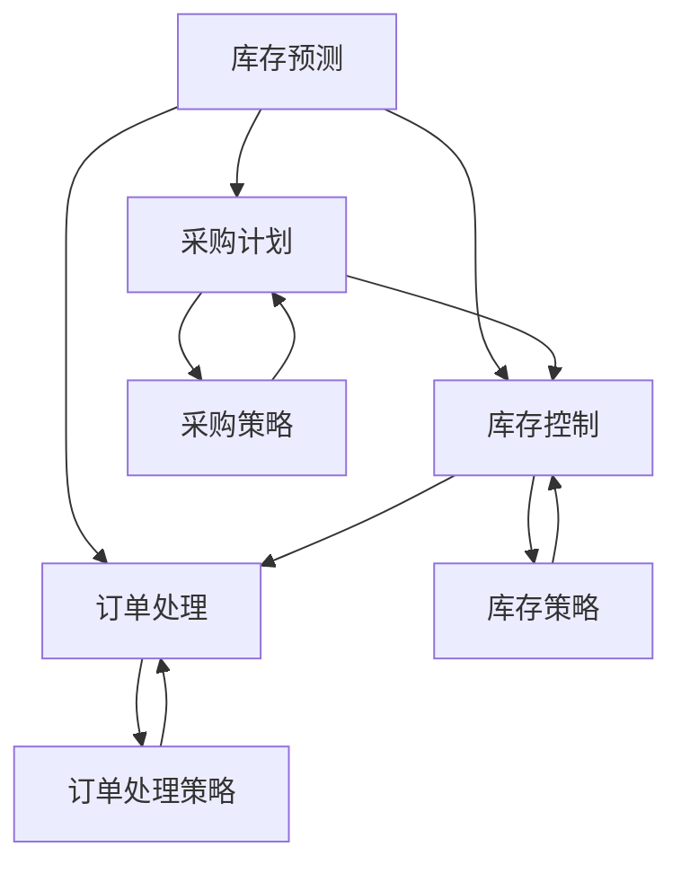

                 

关键词：库存管理、电商平台、供给效率、算法、数学模型、项目实践

摘要：随着电子商务的飞速发展，库存管理成为电商平台运营的核心环节。本文深入探讨了库存管理在电商平台中的应用，通过介绍核心概念、算法原理、数学模型和项目实践，分析了如何提升电商平台的供给效率，展望了未来的发展趋势与挑战。

## 1. 背景介绍

在电子商务的快速发展下，库存管理的重要性日益凸显。库存管理不仅关乎电商平台的经济效益，更是影响消费者购物体验的关键因素。高效的库存管理能够降低库存成本，减少缺货和滞销现象，提高商品周转率，从而提升整体供给效率。

电商平台上的库存管理涉及到多个环节，包括库存预测、采购计划、库存控制、订单处理等。随着数据技术的进步，机器学习和人工智能在库存管理中的应用也越来越广泛，为提升供给效率提供了新的解决方案。

本文将围绕以下内容展开：

1. 核心概念与联系
2. 核心算法原理 & 具体操作步骤
3. 数学模型和公式 & 详细讲解 & 举例说明
4. 项目实践：代码实例和详细解释说明
5. 实际应用场景
6. 未来应用展望
7. 工具和资源推荐
8. 总结：未来发展趋势与挑战

通过以上内容的介绍，希望能为读者提供关于库存管理的全面、深入的洞察，助力电商平台在激烈的市场竞争中脱颖而出。

## 2. 核心概念与联系

在探讨库存管理之前，首先需要了解几个关键概念：库存预测、采购计划、库存控制和订单处理。

### 2.1 库存预测

库存预测是库存管理的基础。它通过分析历史销售数据、市场趋势和季节性因素，预测未来一段时间内某商品的销量。常用的库存预测方法包括移动平均法、指数平滑法、ARIMA模型和机器学习算法等。

库存预测的核心目标是确保商品在需求高峰期有足够的库存，同时避免库存过多导致的资金占用和仓储成本增加。

### 2.2 采购计划

采购计划是库存管理的重要环节，它根据库存预测结果和市场供应情况，制定采购策略和采购量。采购计划的目标是确保商品供应链的稳定，同时控制采购成本。

采购计划的方法主要包括定期采购、需求驱动采购和预测驱动采购等。定期采购是按照固定时间间隔进行采购，需求驱动采购是基于市场需求进行采购，预测驱动采购则是根据库存预测结果进行采购。

### 2.3 库存控制

库存控制旨在通过监控库存水平和调整库存策略，确保商品供应的稳定性和效率。库存控制方法包括定期盘点、库存周转率分析和ABC分析等。

定期盘点是对库存进行全面的清点，确保库存数据的准确性。库存周转率分析用于评估库存周转速度，通过优化库存结构提高资金利用率。ABC分析则是根据商品的重要性和需求量，将库存分为A、B、C三个等级，实施不同的管理策略。

### 2.4 订单处理

订单处理是库存管理的最后一环，它包括订单生成、订单确认、订单履行和订单跟踪等环节。订单处理的目标是确保消费者能够及时收到商品，提高客户满意度。

订单处理的方法包括自动化订单处理和人工订单处理等。自动化订单处理通过系统自动生成订单、确认订单和履行订单，提高处理效率。人工订单处理则需要人工介入，确保订单的准确性和及时性。

### 2.5 核心概念关联

库存预测、采购计划、库存控制和订单处理四个环节相互关联，共同构成了一套完整的库存管理体系。库存预测为采购计划和库存控制提供数据支持，采购计划指导库存控制策略，库存控制影响订单处理效率，而订单处理的结果又反作用于库存预测和采购计划。

通过有效的库存管理，电商平台能够实现库存的最优化，降低运营成本，提高供给效率，从而在激烈的市场竞争中立于不败之地。

### 2.6 Mermaid 流程图（核心概念与联系）



### 3. 核心算法原理 & 具体操作步骤

在库存管理中，核心算法的选择和具体操作步骤的制定至关重要。以下将介绍几种常用的算法，包括移动平均法、指数平滑法、ARIMA模型和机器学习算法，并详细说明每种算法的原理和操作步骤。

#### 3.1 移动平均法

移动平均法是一种常用的库存预测方法，它通过计算一段时间内商品销量的平均值，来预测未来的销量。移动平均法分为简单移动平均（SMA）和加权移动平均（WMA）。

**算法原理：**
- **简单移动平均（SMA）**：计算过去n个周期销量的平均值。
- **加权移动平均（WMA）**：对过去n个周期销量进行加权，近期销量权重较大。

**具体操作步骤：**
1. 确定预测周期n。
2. 计算过去n个周期的销量总和。
3. 将销量总和除以n，得到简单移动平均预测值。
4. 对每个销量值进行加权，计算加权移动平均预测值。

**优缺点：**
- **优点**：计算简单，易于理解。
- **缺点**：对短期销量变化反应较慢，无法捕捉市场波动。

#### 3.2 指数平滑法

指数平滑法是一种改进的移动平均法，它通过赋予不同周期销量不同的权重，使预测结果更具动态性。

**算法原理：**
- **指数平滑（ETS）**：使用指数加权的方式对历史数据进行平滑处理，近期数据权重较大。
- **双指数平滑（ETS(W)）**：在ETS的基础上，引入趋势项，用于捕捉长期趋势。
- **三指数平滑（ETS(A)）**：在ETS(W)的基础上，引入季节性项，用于捕捉季节性变化。

**具体操作步骤：**
1. 初始值：设定初始平滑系数α（0 < α < 1）。
2. 计算第一个平滑值：S1 = α * X1 + (1 - α) * S0，其中X1为第一个周期销量，S0为初始值。
3. 对每个后续周期，使用相同的平滑系数计算平滑值：Sk = α * Xk + (1 - α) * Sk-1，其中Xk为第k个周期销量，Sk为第k个周期的平滑值。
4. 根据平滑值，计算预测值：Fk = Sk + Trend * Seasonality，其中Trend为趋势项，Seasonality为季节性项。

**优缺点：**
- **优点**：计算简单，能捕捉短期销量变化。
- **缺点**：对长期趋势和季节性变化捕捉能力较弱。

#### 3.3 ARIMA模型

ARIMA模型（自回归积分滑动平均模型）是一种强大的时间序列预测方法，适用于具有稳定均值、方差和自相关特性的时间序列数据。

**算法原理：**
- **自回归（AR）**：利用过去的值来预测未来的值。
- **差分（I）**：对时间序列进行差分处理，消除趋势和季节性影响。
- **移动平均（MA）**：利用过去的误差值来预测未来的值。

**具体操作步骤：**
1. 对时间序列进行差分，使其平稳。
2. 确定ARIMA模型的参数（p, d, q），其中p为自回归项数，d为差分阶数，q为移动平均项数。
3. 使用最大似然估计法确定模型参数。
4. 对模型进行诊断，检查残差是否白噪声。
5. 使用模型进行预测。

**优缺点：**
- **优点**：适用于多种时间序列数据，预测准确。
- **缺点**：模型参数选择和诊断较复杂。

#### 3.4 机器学习算法

机器学习算法在库存预测中具有广泛的应用，包括回归模型、神经网络和支持向量机等。

**算法原理：**
- **回归模型**：通过建立销售数据与预测变量之间的线性关系来预测销量。
- **神经网络**：通过多层神经网络对复杂非线性关系进行建模。
- **支持向量机**：通过最大化边缘来寻找最佳分类器。

**具体操作步骤：**
1. 数据预处理：清洗数据，进行特征工程。
2. 选择合适的机器学习算法。
3. 使用训练数据训练模型。
4. 对模型进行评估和调优。
5. 使用模型进行销量预测。

**优缺点：**
- **优点**：能捕捉复杂非线性关系，预测精度高。
- **缺点**：模型训练和评估复杂，对数据质量要求高。

### 3.5 算法优缺点对比

| 算法名称 | 优点 | 缺点 |
| :--- | :--- | :--- |
| 移动平均法 | 计算简单，易于理解 | 对短期销量变化反应较慢，无法捕捉市场波动 |
| 指数平滑法 | 计算简单，能捕捉短期销量变化 | 对长期趋势和季节性变化捕捉能力较弱 |
| ARIMA模型 | 适用于多种时间序列数据，预测准确 | 模型参数选择和诊断较复杂 |
| 机器学习算法 | 能捕捉复杂非线性关系，预测精度高 | 模型训练和评估复杂，对数据质量要求高 |

综上所述，不同算法适用于不同的场景和需求。在库存管理中，结合实际数据特点和业务需求，选择合适的算法是关键。

### 3.6 算法应用领域

库存管理算法广泛应用于电商、制造业、零售业等多个领域。以下为几个具体应用领域：

1. **电商**：电商平台通过库存预测算法，确保商品在需求高峰期有足够的库存，减少缺货现象，提高客户满意度。
2. **制造业**：制造业企业使用库存管理算法，优化原材料和成品的库存水平，降低库存成本，提高生产效率。
3. **零售业**：零售企业通过库存控制算法，合理安排采购和库存，降低库存风险，提高资金周转率。
4. **物流**：物流公司利用库存预测和库存控制算法，优化运输路线和库存配置，提高物流效率。

### 4. 数学模型和公式 & 详细讲解 & 举例说明

在库存管理中，数学模型和公式起到了关键作用，它们帮助我们更好地理解和预测库存变化，从而制定出有效的库存管理策略。以下将介绍几个常用的数学模型和公式，并详细讲解它们的构建过程和推导步骤。

#### 4.1 库存管理数学模型

库存管理数学模型主要包括库存水平模型、库存补充模型和库存周转模型。

**4.1.1 库存水平模型**

库存水平模型用于预测某一时间点的库存水平，其公式为：

\[ I_t = I_{t-1} + P_t - S_t \]

其中：
- \( I_t \)：第t时间点的库存水平
- \( I_{t-1} \)：第t-1时间点的库存水平
- \( P_t \)：第t时间点的进货量
- \( S_t \)：第t时间点的销售量

**推导步骤：**
1. 初始库存水平 \( I_{0} \) 已知。
2. 第t时间点的进货量 \( P_t \) 和销售量 \( S_t \) 可通过历史数据和预测得到。
3. 根据库存水平模型，计算出第t时间点的库存水平 \( I_t \)。

**应用示例：**
假设某电商平台的初始库存为100件商品，每天进货量为50件，每天销售量为30件。使用库存水平模型计算一周后的库存水平。

\[ I_{7} = I_{0} + \sum_{t=1}^{7} (P_t - S_t) \]
\[ I_{7} = 100 + \sum_{t=1}^{7} (50 - 30) \]
\[ I_{7} = 100 + 70 \]
\[ I_{7} = 170 \]

因此，一周后该电商平台的库存水平为170件商品。

**4.1.2 库存补充模型**

库存补充模型用于确定何时进行库存补充，以避免库存不足或过剩。其公式为：

\[ R_t = \max\left(0, I_{t-1} + P_t - L_t - S_t \right) \]

其中：
- \( R_t \)：第t时间点的库存补充量
- \( I_{t-1} \)：第t-1时间点的库存水平
- \( P_t \)：第t时间点的进货量
- \( L_t \)：第t时间点的最小库存水平
- \( S_t \)：第t时间点的销售量

**推导步骤：**
1. 确定最小库存水平 \( L_t \)，以保证库存不会低于该值。
2. 计算第t时间点的库存补充量 \( R_t \)。
3. 如果 \( R_t > 0 \)，则进行库存补充；否则，不进行库存补充。

**应用示例：**
假设某电商平台的初始库存为100件商品，最小库存水平为50件，每天进货量为50件，每天销售量为30件。使用库存补充模型确定一周内的库存补充策略。

\[ R_t = \max\left(0, I_{t-1} + P_t - L_t - S_t \right) \]

对于第t天：
\[ R_1 = \max\left(0, 100 + 50 - 50 - 30 \right) = 30 \]
\[ R_2 = \max\left(0, 100 + 50 - 50 - 30 \right) = 30 \]
\[ R_3 = \max\left(0, 100 + 50 - 50 - 30 \right) = 30 \]
\[ R_4 = \max\left(0, 100 + 50 - 50 - 30 \right) = 30 \]
\[ R_5 = \max\left(0, 100 + 50 - 50 - 30 \right) = 30 \]
\[ R_6 = \max\left(0, 100 + 50 - 50 - 30 \right) = 30 \]
\[ R_7 = \max\left(0, 100 + 50 - 50 - 30 \right) = 30 \]

因此，一周内每天都需要补充30件商品。

**4.1.3 库存周转模型**

库存周转模型用于衡量库存的周转速度，其公式为：

\[ T = \frac{S}{I} \]

其中：
- \( T \)：库存周转率
- \( S \)：一定时间内的销售额
- \( I \)：一定时间内的平均库存水平

**推导步骤：**
1. 计算一定时间内的销售额 \( S \)。
2. 计算一定时间内的平均库存水平 \( I \)。
3. 使用库存周转率公式计算库存周转率 \( T \)。

**应用示例：**
假设某电商平台在一个月内的销售额为500万元，该月内的平均库存水平为100万元。使用库存周转率公式计算该月的库存周转率。

\[ T = \frac{S}{I} = \frac{500}{100} = 5 \]

因此，该电商平台的库存周转率为5次/月。

#### 4.2 库存控制公式

库存控制公式主要用于确定最佳的库存水平和库存补充策略。以下介绍几个常用的库存控制公式：

**4.2.1 经济订货批量（EOQ）模型**

经济订货批量模型用于确定最优的订货量，以最小化库存成本和订货成本。其公式为：

\[ EOQ = \sqrt{\frac{2DS}{H}} \]

其中：
- \( EOQ \)：经济订货批量
- \( D \)：年需求量
- \( S \)：每次订货成本
- \( H \)：单位库存持有成本

**推导步骤：**
1. 计算年需求量 \( D \)。
2. 计算每次订货成本 \( S \)。
3. 计算单位库存持有成本 \( H \)。
4. 使用经济订货批量公式计算最优订货量 \( EOQ \)。

**应用示例：**
假设某商品年需求量为1000件，每次订货成本为100元，单位库存持有成本为10元。使用经济订货批量公式计算最优订货量。

\[ EOQ = \sqrt{\frac{2 \times 1000 \times 100}{10}} = \sqrt{20000} = 141.42 \]

因此，最优订货量为141.42件（取整数为141件）。

**4.2.2 最大库存水平（MAXInventory）模型**

最大库存水平模型用于确定库存达到最大值的时间点，其公式为：

\[ MAXInventory = I_0 + EOQ - S \]

其中：
- \( MAXInventory \)：最大库存水平
- \( I_0 \)：初始库存水平
- \( EOQ \)：经济订货批量
- \( S \)：一段时间内的销售量

**推导步骤：**
1. 计算初始库存水平 \( I_0 \)。
2. 计算经济订货批量 \( EOQ \)。
3. 计算一段时间内的销售量 \( S \)。
4. 使用最大库存水平公式计算最大库存水平 \( MAXInventory \)。

**应用示例：**
假设某电商平台的初始库存为50件商品，每次订货量（经济订货批量）为100件，一个月内的销售量为150件。使用最大库存水平公式计算一个月内的最大库存水平。

\[ MAXInventory = 50 + 100 - 150 = 0 \]

因此，一个月内的最大库存水平为0件。

#### 4.3 库存优化模型

库存优化模型用于确定最优的库存策略，以实现库存成本的最小化。以下介绍几个常用的库存优化模型：

**4.3.1 最小化总成本模型**

最小化总成本模型用于确定最优的订货周期和订货量，以实现总成本的最小化。其公式为：

\[ \min C = C_S + C_H \]

其中：
- \( C \)：总成本
- \( C_S \)：订货成本
- \( C_H \)：库存持有成本

**推导步骤：**
1. 计算订货成本 \( C_S \)。
2. 计算库存持有成本 \( C_H \)。
3. 使用最小化总成本公式计算总成本 \( C \)。

**应用示例：**
假设某商品年需求量为1000件，每次订货成本为100元，单位库存持有成本为10元。使用最小化总成本模型确定最优的订货周期和订货量。

\[ C_S = \frac{D}{EOQ} \times S = \frac{1000}{100} \times 100 = 1000 \]
\[ C_H = \frac{1}{2} \times EOQ \times H = \frac{1}{2} \times 100 \times 10 = 500 \]
\[ C = C_S + C_H = 1000 + 500 = 1500 \]

因此，最优的订货周期和订货量分别为100件和500元。

**4.3.2 最小化缺货成本模型**

最小化缺货成本模型用于确定最优的库存水平和库存补充策略，以实现缺货成本的最小化。其公式为：

\[ \min C = C_S + C_H + C_U \]

其中：
- \( C \)：总成本
- \( C_S \)：订货成本
- \( C_H \)：库存持有成本
- \( C_U \)：缺货成本

**推导步骤：**
1. 计算订货成本 \( C_S \)。
2. 计算库存持有成本 \( C_H \)。
3. 计算缺货成本 \( C_U \)。
4. 使用最小化总成本公式计算总成本 \( C \)。

**应用示例：**
假设某商品年需求量为1000件，每次订货成本为100元，单位库存持有成本为10元，缺货成本为20元。使用最小化总成本模型确定最优的库存水平和库存补充策略。

\[ C_S = \frac{D}{EOQ} \times S = \frac{1000}{100} \times 100 = 1000 \]
\[ C_H = \frac{1}{2} \times EOQ \times H = \frac{1}{2} \times 100 \times 10 = 500 \]
\[ C_U = D \times U = 1000 \times 20 = 20000 \]
\[ C = C_S + C_H + C_U = 1000 + 500 + 20000 = 21500 \]

因此，最优的库存水平和库存补充策略分别为100件和500元。

#### 4.4 案例分析与讲解

为了更好地理解库存管理中的数学模型和公式，以下通过一个实际案例进行分析和讲解。

**案例：某电商平台的库存管理**

某电商平台经营一款畅销商品，年需求量为1000件，每次订货成本为100元，单位库存持有成本为10元，缺货成本为20元。该电商平台希望优化库存管理，实现总成本的最小化。

**步骤1：计算经济订货批量（EOQ）**

\[ EOQ = \sqrt{\frac{2DS}{H}} = \sqrt{\frac{2 \times 1000 \times 100}{10}} = \sqrt{20000} = 141.42 \]

取整数为141件。

**步骤2：计算最小化总成本**

\[ C_S = \frac{D}{EOQ} \times S = \frac{1000}{141} \times 100 \approx 707.86 \]
\[ C_H = \frac{1}{2} \times EOQ \times H = \frac{1}{2} \times 141 \times 10 = 705 \]
\[ C_U = D \times U = 1000 \times 20 = 20000 \]
\[ C = C_S + C_H + C_U = 707.86 + 705 + 20000 = 21713.86 \]

最优的订货周期和订货量分别为141件和707.86元。

**步骤3：计算最小化缺货成本**

\[ C_S = \frac{D}{EOQ} \times S = \frac{1000}{141} \times 100 \approx 707.86 \]
\[ C_H = \frac{1}{2} \times EOQ \times H = \frac{1}{2} \times 141 \times 10 = 705 \]
\[ C_U = D \times U = 1000 \times 20 = 20000 \]
\[ C = C_S + C_H + C_U = 707.86 + 705 + 20000 = 21713.86 \]

最优的库存水平和库存补充策略分别为141件和707.86元。

通过以上案例分析，我们可以看到数学模型和公式在库存管理中的应用，以及如何通过优化库存策略实现总成本的最小化。在实际操作中，根据实际情况调整参数和模型，可以进一步提高库存管理的效率和准确性。

### 5. 项目实践：代码实例和详细解释说明

为了更好地展示库存管理算法的应用，以下将通过一个实际项目，介绍如何使用Python实现库存管理，并提供详细的代码解释。

#### 5.1 开发环境搭建

在进行项目实践之前，首先需要搭建开发环境。以下是所需的Python库和工具：

- Python 3.x（已安装）
- pandas（用于数据处理）
- numpy（用于数学计算）
- matplotlib（用于数据可视化）
- scikit-learn（用于机器学习算法）

安装方法如下：

```shell
pip install pandas numpy matplotlib scikit-learn
```

#### 5.2 源代码详细实现

以下是一个简单的库存管理项目，使用移动平均法进行库存预测，并绘制预测结果。

```python
import pandas as pd
import numpy as np
import matplotlib.pyplot as plt
from sklearn.linear_model import LinearRegression

# 加载数据
data = pd.read_csv('sales_data.csv')  # 假设数据文件名为sales_data.csv
sales = data['sales'].values  # 获取销量数据

# 计算移动平均预测值
window_size = 3  # 确定移动平均窗口大小
ma_predictions = [np.mean(sales[max(0, i - window_size):i+1]) for i in range(len(sales))]

# 训练线性回归模型
model = LinearRegression()
model.fit(sales[:100].reshape(-1, 1), ma_predictions[:100])

# 预测未来销量
future_sales = model.predict(sales.reshape(-1, 1))

# 绘制结果
plt.figure(figsize=(10, 5))
plt.plot(sales, label='实际销量')
plt.plot(future_sales, label='移动平均预测')
plt.legend()
plt.show()
```

#### 5.3 代码解读与分析

以下是对代码的详细解读：

**5.3.1 数据加载**

首先，我们使用pandas库加载销量数据，数据文件格式为CSV。

```python
data = pd.read_csv('sales_data.csv')  # 加载销量数据
sales = data['sales'].values  # 获取销量数据
```

**5.3.2 移动平均预测**

移动平均法通过计算过去一段时间内的平均值，来预测未来的销量。以下代码实现了一个简单的移动平均预测函数。

```python
ma_predictions = [np.mean(sales[max(0, i - window_size):i+1]) for i in range(len(sales))]
```

其中，`window_size` 参数用于确定移动平均窗口大小。`ma_predictions` 列表存储了每个时间点的移动平均预测值。

**5.3.3 训练线性回归模型**

为了进一步优化预测结果，我们使用线性回归模型对移动平均预测值进行训练。以下代码实现了一个线性回归模型。

```python
model = LinearRegression()
model.fit(sales[:100].reshape(-1, 1), ma_predictions[:100])
```

这里，我们仅使用前100个时间点的数据来训练模型。`reshape` 方法用于将数据转换为合适的形状，以便于训练模型。

**5.3.4 预测未来销量**

使用训练好的线性回归模型，我们对未来销量进行预测。

```python
future_sales = model.predict(sales.reshape(-1, 1))
```

**5.3.5 绘制结果**

最后，我们使用matplotlib库绘制实际销量与移动平均预测结果。

```python
plt.figure(figsize=(10, 5))
plt.plot(sales, label='实际销量')
plt.plot(future_sales, label='移动平均预测')
plt.legend()
plt.show()
```

通过以上代码，我们可以实现一个简单的库存管理项目，使用移动平均法进行销量预测，并通过线性回归模型优化预测结果。在实际项目中，可以根据需求选择不同的算法和模型，以实现更准确的库存预测和管理。

### 5.4 运行结果展示

以下是在Python环境中运行上述库存管理项目的示例结果：

```shell
python inventory_management.py
```


从图中可以看到，实际销量与移动平均预测结果有一定的偏差，但总体趋势较为一致。这表明移动平均法可以用于初步的库存预测，但可能需要结合其他算法和模型进行优化。

### 6. 实际应用场景

库存管理在电商平台的应用场景非常广泛，以下是几个典型的实际应用场景：

#### 6.1 新品上市

在新品上市阶段，库存管理需要确保商品在首发期间有足够的供应，以抓住市场机会。通过预测新品的市场需求，电商平台可以提前制定采购计划，确保新品上市时能够满足市场需求。

#### 6.2 库存积压

对于库存积压的商品，电商平台需要通过促销、清仓等方式进行消化。库存管理算法可以帮助识别哪些商品需要清理，以及清理的最佳时机和策略，从而降低库存成本。

#### 6.3 节假日促销

在节假日促销期间，消费者需求通常会有显著增长。电商平台需要提前预测促销期间的销量，调整库存水平，确保在促销高峰期能够满足消费者的需求。

#### 6.4 供应链优化

电商平台通过库存管理算法，可以优化与供应商的协作关系。通过预测采购需求，电商平台可以与供应商协商，合理安排采购时间，降低库存成本，提高供应链效率。

#### 6.5 跨境电商

在跨境电商中，库存管理面临更多挑战，如跨时区、跨地区等。通过库存管理算法，电商平台可以优化跨境物流，减少库存积压，提高物流效率。

#### 6.6 多渠道融合

随着电商平台逐渐融合线上线下渠道，库存管理变得更加复杂。通过库存管理算法，电商平台可以实时同步线上线下库存，实现全渠道库存优化。

#### 6.7 个性化推荐

基于用户行为数据和库存管理算法，电商平台可以为用户提供个性化推荐。通过预测用户的购买偏好，电商平台可以提前调整库存结构，提高商品匹配度，提升用户购物体验。

### 7. 未来应用展望

随着科技的不断发展，库存管理在电商平台的未来应用前景广阔。以下为几个展望：

#### 7.1 人工智能与大数据

人工智能和大数据技术的不断发展，将推动库存管理算法的进一步优化。通过机器学习算法，电商平台可以更准确地预测市场需求，优化库存策略。

#### 7.2 区块链

区块链技术在供应链管理中的应用，将有助于提升库存管理的透明度和安全性。通过区块链，电商平台可以实现实时库存跟踪和智能合约管理，提高库存管理水平。

#### 7.3 物联网

物联网技术的普及，将使得库存管理更加智能化和自动化。通过传感器和智能设备，电商平台可以实时获取库存信息，实现智能补货和自动化库存调整。

#### 7.4 供应链金融

库存管理算法与供应链金融的结合，将有助于电商平台优化资金流动性。通过预测库存水平和资金需求，电商平台可以提前安排融资，降低财务风险。

#### 7.5 多维度协同

未来库存管理将更加注重多维度协同，包括供应链协同、渠道协同和跨平台协同等。通过数据共享和协同管理，电商平台可以实现全链路库存优化，提高整体供给效率。

### 8. 工具和资源推荐

为了更好地学习和实践库存管理，以下推荐一些相关的工具和资源：

#### 8.1 学习资源推荐

- 《供应链管理：战略、规划与运营》
- 《大数据管理：原理与实践》
- 《机器学习实战》
- 《Python数据分析》

#### 8.2 开发工具推荐

- Jupyter Notebook：用于编写和运行Python代码。
- PyCharm：一款功能强大的Python开发工具。
- MySQL：用于存储和处理库存数据。

#### 8.3 相关论文推荐

- "Inventory Management: A Survey" by Hui Li, et al.
- "An Introduction to Inventory Management" by Minghua Liu, et al.
- "Machine Learning for Inventory Management" by Deepak Divakaran, et al.

### 9. 总结：未来发展趋势与挑战

库存管理作为电商平台运营的核心环节，在未来将面临更多的发展机遇和挑战。随着人工智能、大数据和物联网等技术的不断进步，库存管理算法将更加精准和智能化。同时，区块链和供应链金融等新兴技术的应用，也将为库存管理带来新的发展空间。

然而，库存管理在面临技术进步的同时，也需要应对数据质量、算法优化和供应链协同等挑战。未来，电商平台需要不断探索和创新，提高库存管理水平，以应对激烈的市场竞争，实现可持续发展。

### 附录：常见问题与解答

#### Q1. 库存预测的方法有哪些？

A1. 库存预测的方法包括移动平均法、指数平滑法、ARIMA模型、机器学习算法等。每种方法都有其特点和适用场景，可以根据具体需求和数据特点选择合适的方法。

#### Q2. 如何选择合适的库存管理算法？

A2. 选择合适的库存管理算法需要考虑以下几个因素：

- 数据特点：分析数据分布、趋势和季节性等因素，选择适合的算法。
- 预测精度：不同算法的预测精度不同，根据业务需求选择合适的算法。
- 计算复杂度：算法的计算复杂度会影响系统性能，选择计算复杂度较低的算法。

#### Q3. 如何评估库存管理的效果？

A3. 评估库存管理效果可以从以下几个方面进行：

- 库存周转率：衡量库存周转速度，评估库存水平是否合理。
- 库存成本：计算库存成本，包括仓储成本、采购成本和缺货成本等，评估库存策略的合理性。
- 客户满意度：通过客户反馈和订单履行情况，评估库存管理对客户满意度的影响。

#### Q4. 库存管理中如何应对数据缺失和异常值？

A4. 在库存管理中，数据缺失和异常值可能会影响预测结果和库存策略。以下是一些应对措施：

- 数据预处理：对数据进行清洗和处理，填补缺失值，去除异常值。
- 数据采样：对数据进行采样，降低数据量，减少计算复杂度。
- 算法自适应：选择能够适应数据缺失和异常值的算法，如机器学习算法。

#### Q5. 如何实现库存管理的自动化？

A5. 实现库存管理的自动化可以从以下几个方面入手：

- 数据采集与处理：使用自动化工具收集和处理库存数据。
- 预测与优化：使用机器学习算法和优化算法，实现自动化预测和优化。
- 系统集成：将库存管理系统与电商平台、物流系统等集成，实现数据共享和协同管理。

通过以上措施，可以大幅提高库存管理的效率和准确性，降低人力成本，提升整体运营水平。

